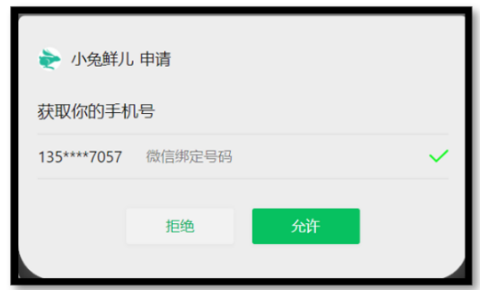
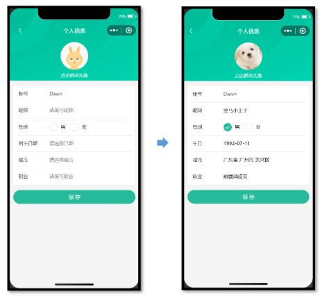

## uni-app—小兔鲜微信小程序实战

> uni-app官网：https://uniapp.dcloud.net.cn/
>
> 小兔鲜-小程序官网：https://megasu.gitee.io/uni-app-shop-note/


### 登录模块

涉及知识点：微信授权登录，文件上传，Store 状态管理等。

#### 1、微信登录

微信小程序的**开放能力**，允许开发者获取微信用户的基本信息（昵称、性别、手机号码等），开发者常用来实现注册/登录的功能。


##### 1.1 登录方式

常见登录/注册方式：

1. 用户名/手机号 + 密码
2. 手机号 + 验证码
3. 授权登录

实际开发过程中常常需要实现以上的一种或多种方式，我们的项目主要实现**授权登录**。

###### 微信授权登录

**微信授权登录**

用户在使用小程序时，其实已登录微信，其本质上就是：**微信授权给小程序读取微信用户信息**。


###### 传统登录方式

传统登录方式，一般是通过输入密码或者手机验证码实现登录。


> 温馨提示：接口文档中提供练习使用的登录接口，大家可自行完成。


#### 2、静态结构

登录页

```vue
// src/pages/login/login.vue

<script setup lang="ts">
//
</script>

<template>
  <view class="viewport">
    <view class="logo">
      <image
        src="https://pcapi-xiaotuxian-front-devtest.itheima.net/miniapp/images/logo_icon.png"
      ></image>
    </view>
    <view class="login">
      <!-- 网页端表单登录 -->
      <!-- <input class="input" type="text" placeholder="请输入用户名/手机号码" /> -->
      <!-- <input class="input" type="text" password placeholder="请输入密码" /> -->
      <!-- <button class="button phone">登录</button> -->

      <!-- 小程序端授权登录 -->
      <button class="button phone">
        <text class="icon icon-phone"></text>
        手机号快捷登录
      </button>
      <view class="extra">
        <view class="caption">
          <text>其他登录方式</text>
        </view>
        <view class="options">
          <!-- 通用模拟登录 -->
          <button>
            <text class="icon icon-phone">模拟快捷登录</text>
          </button>
        </view>
      </view>
      <view class="tips">登录/注册即视为你同意《服务条款》和《小兔鲜儿隐私协议》</view>
    </view>
  </view>
</template>

<style lang="scss">
page {
  height: 100%;
}

.viewport {
  display: flex;
  flex-direction: column;
  height: 100%;
  padding: 20rpx 40rpx;
}

.logo {
  flex: 1;
  text-align: center;
  image {
    width: 220rpx;
    height: 220rpx;
    margin-top: 15vh;
  }
}

.login {
  display: flex;
  flex-direction: column;
  height: 60vh;
  padding: 40rpx 20rpx 20rpx;

  .input {
    width: 100%;
    height: 80rpx;
    font-size: 28rpx;
    border-radius: 72rpx;
    border: 1px solid #ddd;
    padding-left: 30rpx;
    margin-bottom: 20rpx;
  }

  .button {
    display: flex;
    align-items: center;
    justify-content: center;
    width: 100%;
    height: 80rpx;
    font-size: 28rpx;
    border-radius: 72rpx;
    color: #fff;
    .icon {
      font-size: 40rpx;
      margin-right: 6rpx;
    }
  }

  .phone {
    background-color: #28bb9c;
  }

  .wechat {
    background-color: #06c05f;
  }

  .extra {
    flex: 1;
    padding: 70rpx 70rpx 0;
    .caption {
      width: 440rpx;
      line-height: 1;
      border-top: 1rpx solid #ddd;
      font-size: 26rpx;
      color: #999;
      position: relative;
      text {
        transform: translate(-40%);
        background-color: #fff;
        position: absolute;
        top: -12rpx;
        left: 50%;
      }
    }

    .options {
      display: flex;
      justify-content: center;
      align-items: center;
      margin-top: 70rpx;
      button {
        padding: 0;
        background-color: transparent;
      }
    }

    .icon {
      font-size: 24rpx;
      color: #444;
      display: flex;
      flex-direction: column;
      align-items: center;

      &::before {
        display: flex;
        align-items: center;
        justify-content: center;
        width: 80rpx;
        height: 80rpx;
        margin-bottom: 6rpx;
        font-size: 40rpx;
        border: 1rpx solid #444;
        border-radius: 50%;
      }
    }
    .icon-weixin::before {
      border-color: #06c05f;
      color: #06c05f;
    }
  }
}

.tips {
  position: absolute;
  bottom: 80rpx;
  left: 20rpx;
  right: 20rpx;
  font-size: 22rpx;
  color: #999;
  text-align: center;
}
</style>
```


#### 3、获取登录凭证


前端：调用 [wx.login()](https://developers.weixin.qq.com/miniprogram/dev/api/open-api/login/wx.login.html) 接口获取登录凭证（code）。

后端：通过凭证（code）向微信服务器生成[用户登录态](https://developers.weixin.qq.com/miniprogram/dev/framework/open-ability/login.html)。

```vue
<script setup lang="ts">
import { onLoad } from '@dcloudio/uni-app'

// 获取 code 登录凭证
let code = ''
onLoad(async () => {
  const res = await wx.login()
  code = res.code
})
</script>
```

注意：

> - code 获取**不要**在 getphonenumber 事件回调函数调用，否则可能会出现错误！！！
> - 用户登录态，不包含用户昵称、性别、手机号码等信息，作用是用于[后端与微信服务器通讯](https://developers.weixin.qq.com/miniprogram/dev/framework/open-ability/login.html)。


##### 4、获取手机号码

出于安全限制，小程序【规定】想获取用户的手机号，必须由用户主动【点击按钮】并【允许申请】才可获取加密的手机号信息。

**前端**：提供 `open-type` 按钮，在事件处理函数中获取加密的手机号信息。

**后端**：解密手机号信息，把手机号和用户登录态关联在一起。



```vue
<script setup lang="ts">
// 获取用户手机号码
const onGetphonenumber: UniHelper.ButtonOnGetphonenumber = (ev) => {
  console.log(ev)
}
</script>

<template>
  <view class="viewport">
    <view class="login">
      <button class="button phone" open-type="getPhoneNumber" @getphonenumber="onGetphonenumber">
        <text class="icon icon-phone"></text>
        手机号快捷登录
      </button>
    </view>
  </view>
</template>
```

**常见问题**

> Q：为什么我无法唤起获取手机号的界面？
>
> A：获取手机号功能**目前针对非个人开发者**，所以个人开发者无法唤起获取手机号界面 [详见文档](https://developers.weixin.qq.com/miniprogram/dev/framework/open-ability/getPhoneNumber.html)。


**温馨提示**

- 项目提供了[模拟登录 API ](https://apifox.com/apidoc/shared-0e6ee326-d646-41bd-9214-29dbf47648fa/api-43426851)用于练习，模拟手机号一键登录，请看后续章节。


#### 4、微信登录接口(生产环境)

获取手机号功能，**目前针对非个人开发者，且完成了认证的小程序开放**，[详见文档](https://developers.weixin.qq.com/miniprogram/dev/framework/open-ability/getPhoneNumber.html)。

**接口调用**

接口地址：/login/wxMin

请求方式：POST

请求参数：

**Body**

| 字段名称      | 是否必须 | 默认值 | 备注                        |
| :------------ | :------- | :----- | :-------------------------- |
| code          | 是       | 无     | wx.login 获取               |
| iv            | 是       | 无     | getphonenumber 事件回调获取 |
| encryptedData | 是       | 无     | getphonenumber 事件回调获取 |

##### 4.1 请求封装

```ts
// src/services/login.ts

import type { LoginResult } from '@/types/member'
import { http } from '@/utils/http'

type LoginParams = {
  code: string
  encryptedData: string
  iv: string
}
/**
 * 小程序登录
 * @param data 请求参数
 */
export const postLoginWxMinAPI = (data: LoginParams) => {
  return http<LoginResult>({
    method: 'POST',
    url: '/login/wxMin',
    data,
  })
}
```


##### 4.2 类型声明

```ts
// src/types/member.d.ts

/** 小程序登录 登录用户信息 */
export type LoginResult = {
  /** 用户ID */
  id: number
  /** 头像  */
  avatar: string
  /** 账户名  */
  account: string
  /** 昵称 */
  nickname?: string
  /** 手机号 */
  mobile: string
  /** 登录凭证 */
  token: string
}
```


##### 4.3 实现代码

```vue
// src/pages/login/login.vue

<script setup lang="ts">
import { postLoginWxMinAPI } from '@/services/login'
import { onLoad } from '@dcloudio/uni-app'

// 获取 code 登录凭证
let code = ''
onLoad(async () => {
  const res = await wx.login()
  code = res.code
})

// 获取用户手机号码
const onGetphonenumber: UniHelper.ButtonOnGetphonenumber = async (ev) => {
  // 获取参数
  const encryptedData = ev.detail.encryptedData!
  const iv = ev.detail.iv!
  // 登录请求
  await postLoginWxMinAPI({ code, encryptedData, iv })
  // 成功提示
  uni.showToast({ icon: 'none', title: '登录成功' })
}
</script>

<template>
  <view class="viewport">
    <view class="login">
      <button class="button phone" open-type="getPhoneNumber" @getphonenumber="onGetphonenumber">
        <text class="icon icon-phone"></text>
        手机号快捷登录
      </button>
    </view>
  </view>
</template>
```


#### 5、模拟手机登录(开发环境)

获取手机号功能，**目前针对非个人开发者，且完成了认证的小程序开放**，[详见文档](https://developers.weixin.qq.com/miniprogram/dev/framework/open-ability/getPhoneNumber.html)。

温馨提示

为了更好实现登录后续业务，后端提供[内部测试接口](https://apifox.com/apidoc/shared-0e6ee326-d646-41bd-9214-29dbf47648fa/api-43426851)，只需要传手机号即可实现快捷登录。

**请求接口**

接口地址：/login/wxMin/simple

请求方式：POST

请求参数：

**Body**

| 字段名称    | 是否必须 | 默认值 | 备注         |
| :---------- | :------- | :----- | :----------- |
| phoneNumber | 是       | 无     | 模拟的手机号 |

该接口跟微信登录接口返回的数据格式是相同的。


##### 5.1 请求封装

```ts
/**
 * 小程序登录_内测版
 * @param phoneNumber 模拟手机号码
 */
export const postLoginWxMinSimpleAPI = (phoneNumber: string) => {
  return http<LoginResult>({
    method: 'POST',
    url: '/login/wxMin/simple',
    data: {
      phoneNumber,
    },
  })
}
```


##### 5.2 用户信息持久化存储

Pinia 的持久化存储插件在 [项目起步](https://megasu.gitee.io/uni-app-shop-note/rabbit-shop/#pinia-persist) 模块已经搭建完成，现在只需要在用户登录成功后，补充 TS 类型声明并保存用户信息即可。


##### 5.3 实现代码

Store

```ts
// src/stores/modules/member.ts

import type { LoginResult } from '@/types/member'
import { defineStore } from 'pinia'
import { ref } from 'vue'

// 定义 Store
export const useMemberStore = defineStore(
  'member',
  () => {
    // 会员信息
    const profile = ref<LoginResult>() 

    // 保存会员信息，登录时使用
    const setProfile = (val: LoginResult) => {
      profile.value = val
    }

    // 清理会员信息，退出时使用
    const clearProfile = () => {
      profile.value = undefined
    }

    // 记得 return
    return { profile, setProfile, clearProfile }
  },
  {
    // 小程序端配置
    persist: {
      storage: {
        getItem(key) {
          return uni.getStorageSync(key)
        },
        setItem(key, value) {
          uni.setStorageSync(key, value)
        },
      },
    },
  },
)
```

登录页

```vue
<script setup lang="ts">
import { postLoginWxMinAPI, postLoginWxMinSimpleAPI } from '@/services/login'
import { useMemberStore } from '@/stores'
import type { LoginResult } from '@/types/member'
import { onLoad } from '@dcloudio/uni-app'

// 获取 code 登录凭证
let code = ''
onLoad(async () => {
  const res = await wx.login()
  code = res.code
})

// 获取用户手机号码（企业中写法）
const onGetphonenumber: UniHelper.ButtonOnGetphonenumber = async (ev) => {
  const encryptedData = ev.detail.encryptedData!
  const iv = ev.detail.iv!
  const res = await postLoginWxMinAPI({ code, encryptedData, iv })
  loginSuccess(res.result)
}

// 模拟手机号码快捷登录（开发练习）
const onGetphonenumberSimple = async () => {
  const res = await postLoginWxMinSimpleAPI('13123456789')
  loginSuccess(res.result)
}

const loginSuccess = (profile: LoginResult) => {
  // 保存会员信息
  const memberStore = useMemberStore() 
  memberStore.setProfile(profile) 
  // 成功提示
  uni.showToast({ icon: 'success', title: '登录成功' })
  setTimeout(() => {
    // 页面跳转
    uni.switchTab({ url: '/pages/my/my' })
  }, 500)
}
</script>
```

到此，微信登录模块已经完成，接下来进入到用户模块。


### 用户模块

> 在用户登录/注册成功后，展示会员信息，更新会员信息。

#### 1、会员中心页(我的)

主要实现两部分业务：

1. 渲染当前登录会员的昵称和头像，从 Store 中获取。
2. 猜你喜欢分页加载，可封装成**组合式函数**实现复用逻辑。


##### 1.1 静态结构

会员中心页

```vue
// src/pages/my/my.vue

<script setup lang="ts">
// 获取屏幕边界到安全区域距离
const { safeAreaInsets } = uni.getSystemInfoSync()
// 订单选项
const orderTypes = [
  { type: 1, text: '待付款', icon: 'icon-currency' },
  { type: 2, text: '待发货', icon: 'icon-gift' },
  { type: 3, text: '待收货', icon: 'icon-check' },
  { type: 4, text: '待评价', icon: 'icon-comment' },
]
</script>

<template>
  <scroll-view class="viewport" scroll-y enable-back-to-top>
    <!-- 个人资料 -->
    <view class="profile" :style="{ paddingTop: safeAreaInsets!.top + 'px' }">
      <!-- 情况1：已登录 -->
      <view class="overview" v-if="false">
        <navigator url="/pagesMember/profile/index" hover-class="none">
          <image
            class="avatar"
            mode="aspectFill"
            src="https://pcapi-xiaotuxian-front-devtest.itheima.net/miniapp/uploads/avatar_3.jpg"
          ></image>
        </navigator>
        <view class="meta">
          <view class="nickname"> 用户00031 </view>
          <navigator class="extra" url="/pagesMember/profile/profile" hover-class="none">
            <text class="update">更新头像昵称</text>
          </navigator>
        </view>
      </view>
      <!-- 情况2：未登录 -->
      <view class="overview" v-else>
        <navigator url="/pages/login/login" hover-class="none">
          <image
            class="avatar gray"
            mode="aspectFill"
            src="http://yjy-xiaotuxian-dev.oss-cn-beijing.aliyuncs.com/picture/2021-04-06/db628d42-88a7-46e7-abb8-659448c33081.png"
          ></image>
        </navigator>
        <view class="meta">
          <navigator url="/pages/login/login" hover-class="none" class="nickname">
            未登录
          </navigator>
          <view class="extra">
            <text class="tips">点击登录账号</text>
          </view>
        </view>
      </view>
      <navigator class="settings" url="/pagesMember/settings/index" hover-class="none">
        设置
      </navigator>
    </view>
    <!-- 我的订单 -->
    <view class="orders">
      <view class="title">
        我的订单
        <navigator class="navigator" url="/pagesOrder/list/list?type=0" hover-class="none">
          查看全部订单<text class="icon-right"></text>
        </navigator>
      </view>
      <view class="section">
        <!-- 订单 -->
        <navigator
          v-for="item in orderTypes"
          :key="item.type"
          :class="item.icon"
          :url="`/pagesOrder/list/list?type=${item.type}`"
          class="navigator"
          hover-class="none"
        >
          {{ item.text }}
        </navigator>
        <!-- 客服 -->
        <button class="contact icon-handset" open-type="contact">售后</button>
      </view>
    </view>
    <!-- 猜你喜欢 -->
    <view class="guess">
      <XtxGuess ref="guessRef" />
    </view>
  </scroll-view>
</template>

<style lang="scss">
page {
  height: 100%;
  overflow: hidden;
  background-color: #f7f7f8;
}

.viewport {
  height: 100%;
  background-repeat: no-repeat;
  background-image: url(https://pcapi-xiaotuxian-front-devtest.itheima.net/miniapp/images/center_bg.png);
  background-size: 100% auto;
}

/* 用户信息 */
.profile {
  margin-top: 20rpx;
  position: relative;

  .overview {
    display: flex;
    height: 120rpx;
    padding: 0 36rpx;
    color: #fff;
  }

  .avatar {
    width: 120rpx;
    height: 120rpx;
    border-radius: 50%;
    background-color: #eee;
  }

  .gray {
    filter: grayscale(100%);
  }

  .meta {
    display: flex;
    flex-direction: column;
    justify-content: center;
    align-items: flex-start;
    line-height: 30rpx;
    padding: 16rpx 0;
    margin-left: 20rpx;
  }

  .nickname {
    max-width: 350rpx;
    margin-bottom: 016rpx;
    font-size: 30rpx;

    overflow: hidden;
    text-overflow: ellipsis;
    white-space: nowrap;
  }

  .extra {
    display: flex;
    font-size: 20rpx;
  }

  .tips {
    font-size: 22rpx;
  }

  .update {
    padding: 3rpx 10rpx 1rpx;
    color: rgba(255, 255, 255, 0.8);
    border: 1rpx solid rgba(255, 255, 255, 0.8);
    margin-right: 10rpx;
    border-radius: 30rpx;
  }

  .settings {
    position: absolute;
    bottom: 0;
    right: 40rpx;
    font-size: 30rpx;
    color: #fff;
  }
}

/* 我的订单 */
.orders {
  position: relative;
  z-index: 99;
  padding: 30rpx;
  margin: 50rpx 20rpx 0;
  background-color: #fff;
  border-radius: 10rpx;
  box-shadow: 0 4rpx 6rpx rgba(240, 240, 240, 0.6);

  .title {
    height: 40rpx;
    line-height: 40rpx;
    font-size: 28rpx;
    color: #1e1e1e;

    .navigator {
      font-size: 24rpx;
      color: #939393;
      float: right;
    }
  }

  .section {
    width: 100%;
    display: flex;
    justify-content: space-between;
    padding: 40rpx 20rpx 10rpx;
    .navigator,
    .contact {
      text-align: center;
      font-size: 24rpx;
      color: #333;
      &::before {
        display: block;
        font-size: 60rpx;
        color: #ff9545;
      }
    }
    .contact {
      padding: 0;
      margin: 0;
      border: 0;
      background-color: transparent;
      line-height: inherit;
    }
  }
}

/* 猜你喜欢 */
.guess {
  background-color: #f7f7f8;
  margin-top: 20rpx;
}
</style>
```


##### 1.2 自定义导航

```json
// src/pages.json
{
    "path": "pages/my/my",
    "style": {
        "navigationStyle": "custom",
        "navigationBarTextStyle": "white",
        "navigationBarTitleText": "我的"
    }
},
```


##### 1.3 渲染会员信息

```vue
<!-- 情况1：已登录 -->
<view class="overview" v-if="memberStore.profile">
    <navigator url="/pagesMember/profile/profile" hover-class="none">
        <image class="avatar" mode="aspectFill" :src="memberStore.profile?.avatar"></image>
    </navigator>
    <view class="meta">
        <view class="nickname">
            {{ memberStore.profile.nickname || memberStore.profile.account }}
        </view>
        <navigator class="extra" url="/pagesMember/profile/profile" hover-class="none">
            <text class="update">更新头像昵称</text>
        </navigator>
    </view>
</view>
```


#### 2、猜你喜欢分页加载

实现步骤：


##### 2.1 获取组件实例

```ts
// 猜你喜欢
const guessRef = ref<XtxGuessInstance>()
```


##### 2.2 触底事件&加载分页数据

```ts
// 下拉触底事件
const onScrolltolower = () => {
    guessRef.value?.getMore()
}
```


##### 2.3 封装组合式函数

> 文档：https://cn.vuejs.org/guide/reusability/composables.html

```ts
// src/composables/index.ts
import { ref } from 'vue'
import type { XtxGuessInstance } from '@/types/component'

export function useGuessList() {
  // 猜你喜欢
  const guessRef = ref<XtxGuessInstance>()
  // 下拉刷新列表
  const onScrolltolower = () => {
    guessRef.value?.getMore()
  }
  // 返回封装ref和事件处理函数
  return {
    guessRef,
    onScrolltolower,
  }
}
```


#### 3、设置页分包和预下载


**小程序分包**：将小程序的代码分割成多个部分，分别打包成多个小程序包，`减少`小程序的`加载时间`，提高用户体验。 

**分包预下载**：在进入小程序某个页面时，由框架自动预下载可能需要的分包，`提升`进入后续分包页面时的`启动速度`。

实现步骤：


**温馨提示**

> 通过 VS Code 插件 [uni-create-view](https://marketplace.visualstudio.com/items?itemName=mrmaoddxxaa.create-uniapp-view) 可以快速新建分包页面，自动配置分包路由。

经验：分包一般是按照项目的业务模块划分，如会员模块分包，订单模块分包等。

##### 3.1 会员设置页—新建分包

```json
// src/pages.json

{
  // ...省略
  // 分包加载规则
  "subPackages": [
    {
      // 子包的根目录
      "root": "pagesMember",
      // 页面路径和窗口表现
      "pages": [
        {
          "path": "settings/settings",
          "style": {
            "navigationBarTitleText": "设置"
          }
        }
      ]
    }
  ],
}
```


##### 3.2 分包预下载

```json
// 分包预下载规则
"preloadRule": {
    "pages/my/my": {
        "network": "all", 
        "packages": ["pagesMember"] 
    }
}
```


##### 3.3 会员设置页—静态结构

设置页：`src/pagesMember/settings/settings.vue`

```vue
<script setup lang="ts">
//
</script>

<template>
  <view class="viewport">
    <!-- 列表1 -->
    <view class="list" v-if="true">
      <navigator url="/pagesMember/address/address" hover-class="none" class="item arrow">
        我的收货地址
      </navigator>
    </view>
    <!-- 列表2 -->
    <view class="list">
      <button hover-class="none" class="item arrow" open-type="openSetting">授权管理</button>
      <button hover-class="none" class="item arrow" open-type="feedback">问题反馈</button>
      <button hover-class="none" class="item arrow" open-type="contact">联系我们</button>
    </view>
    <!-- 列表3 -->
    <view class="list">
      <navigator hover-class="none" class="item arrow" url=" ">关于小兔鲜儿</navigator>
    </view>
    <!-- 操作按钮 -->
    <view class="action">
      <view class="button">退出登录</view>
    </view>
  </view>
</template>

<style lang="scss">
page {
  background-color: #f4f4f4;
}

.viewport {
  padding: 20rpx;
}

/* 列表 */
.list {
  padding: 0 20rpx;
  background-color: #fff;
  margin-bottom: 20rpx;
  border-radius: 10rpx;
  .item {
    line-height: 90rpx;
    padding-left: 10rpx;
    font-size: 30rpx;
    color: #333;
    border-top: 1rpx solid #ddd;
    position: relative;
    text-align: left;
    border-radius: 0;
    background-color: #fff;
    &::after {
      width: auto;
      height: auto;
      left: auto;
      border: none;
    }
    &:first-child {
      border: none;
    }
    &::after {
      right: 5rpx;
    }
  }
  .arrow::after {
    content: '\e6c2';
    position: absolute;
    top: 50%;
    color: #ccc;
    font-family: 'erabbit' !important;
    font-size: 32rpx;
    transform: translateY(-50%);
  }
}

/* 操作按钮 */
.action {
  text-align: center;
  line-height: 90rpx;
  margin-top: 40rpx;
  font-size: 32rpx;
  color: #333;
  .button {
    background-color: #fff;
    margin-bottom: 20rpx;
    border-radius: 10rpx;
  }
}
</style>
```


#### 4、退出登录

**设置页需实现以下业务**：

1. 退出登录，清理用户信息，返回上一页。
2. 根据登录状态，按需展示页面内容。

**实现步骤**：


**参考效果**：


##### 4.1 退出登录绑定tap事件

```ts
const onLogout = () => {
  uni.showModal({
    title: '',
    content: '确定要退出登录吗？',

    success(res) {
      // 如果点击了确定
      if (res.confirm) {
        // 清空用户信息
        memberStore.clearProfile()
        // 返回上一页
        uni.navigateBack()
      }
    },
  })
}
```


##### 4.2 内容条件渲染

```vue
<view class="list" v-if="memberStore.profile">
    <navigator url="/pagesMember/address/address" hover-class="none" class="item arrow">
        我的收货地址
    </navigator>
</view>
...
<!-- 操作按钮 -->
<view class="action" v-if="memberStore.profile">
    <view class="button" @tap="onLogout">退出登录</view>
</view>
```


#### 5、个人信息页

##### 5.1 分析

**功能**：用户可以对会员信息进行更新操作，涉及到表单数据提交、图片读取、文件上传等知识点。

**权限**：需要登录之后才能够访问该页面。



对于这种需要权限的页面，我们也可以将其归到分包页面中。


##### 5.2 个人信息页准备

实现步骤：


###### 新增分包页面

会员信息页，处理成分包页面：`src/pagesMember/profile/profile.vue`

```vue
<script setup lang="ts">
// 获取屏幕边界到安全区域距离
const { safeAreaInsets } = uni.getSystemInfoSync()
</script>

<template>
  <view class="viewport">
    <!-- 导航栏 -->
    <view class="navbar" :style="{ paddingTop: safeAreaInsets?.top + 'px' }">
      <navigator open-type="navigateBack" class="back icon-left" hover-class="none"></navigator>
      <view class="title">个人信息</view>
    </view>
    <!-- 头像 -->
    <view class="avatar">
      <view class="avatar-content">
        <image class="image" src=" " mode="aspectFill" />
        <text class="text">点击修改头像</text>
      </view>
    </view>
    <!-- 表单 -->
    <view class="form">
      <!-- 表单内容 -->
      <view class="form-content">
        <view class="form-item">
          <text class="label">账号</text>
          <text class="account">账号名</text>
        </view>
        <view class="form-item">
          <text class="label">昵称</text>
          <input class="input" type="text" placeholder="请填写昵称" value="" />
        </view>
        <view class="form-item">
          <text class="label">性别</text>
          <radio-group>
            <label class="radio">
              <radio value="男" color="#27ba9b" :checked="true" />
              男
            </label>
            <label class="radio">
              <radio value="女" color="#27ba9b" :checked="false" />
              女
            </label>
          </radio-group>
        </view>
        <view class="form-item">
          <text class="label">生日</text>
          <picker
            class="picker"
            mode="date"
            start="1900-01-01"
            :end="new Date()"
            value="2000-01-01"
          >
            <view v-if="false">2000-01-01</view>
            <view class="placeholder" v-else>请选择日期</view>
          </picker>
        </view>
        <view class="form-item">
          <text class="label">城市</text>
          <picker class="picker" mode="region" :value="['广东省', '广州市', '天河区']">
            <view v-if="false">广东省广州市天河区</view>
            <view class="placeholder" v-else>请选择城市</view>
          </picker>
        </view>
        <view class="form-item">
          <text class="label">职业</text>
          <input class="input" type="text" placeholder="请填写职业" value="" />
        </view>
      </view>
      <!-- 提交按钮 -->
      <button class="form-button">保 存</button>
    </view>
  </view>
</template>

<style lang="scss">
page {
  background-color: #f4f4f4;
}

.viewport {
  display: flex;
  flex-direction: column;
  height: 100%;
  background-image: url(https://pcapi-xiaotuxian-front-devtest.itheima.net/miniapp/images/order_bg.png);
  background-size: auto 420rpx;
  background-repeat: no-repeat;
}

// 导航栏
.navbar {
  position: relative;

  .title {
    height: 40px;
    display: flex;
    justify-content: center;
    align-items: center;
    font-size: 16px;
    font-weight: 500;
    color: #fff;
  }

  .back {
    position: absolute;
    height: 40px;
    width: 40px;
    left: 0;
    font-size: 20px;
    color: #fff;
    display: flex;
    justify-content: center;
    align-items: center;
  }
}

// 头像
.avatar {
  text-align: center;
  width: 100%;
  height: 260rpx;
  display: flex;
  flex-direction: column;
  justify-content: center;
  align-items: center;

  .image {
    width: 160rpx;
    height: 160rpx;
    border-radius: 50%;
    background-color: #eee;
  }

  .text {
    display: block;
    padding-top: 20rpx;
    line-height: 1;
    font-size: 26rpx;
    color: #fff;
  }
}

// 表单
.form {
  background-color: #f4f4f4;

  &-content {
    margin: 20rpx 20rpx 0;
    padding: 0 20rpx;
    border-radius: 10rpx;
    background-color: #fff;
  }

  &-item {
    display: flex;
    height: 96rpx;
    line-height: 46rpx;
    padding: 25rpx 10rpx;
    background-color: #fff;
    font-size: 28rpx;
    border-bottom: 1rpx solid #ddd;

    &:last-child {
      border: none;
    }

    .label {
      width: 180rpx;
      color: #333;
    }

    .account {
      color: #666;
    }

    .input {
      flex: 1;
      display: block;
      height: 46rpx;
    }

    .radio {
      margin-right: 20rpx;
    }

    .picker {
      flex: 1;
    }
    .placeholder {
      color: #808080;
    }
  }

  &-button {
    height: 80rpx;
    text-align: center;
    line-height: 80rpx;
    margin: 30rpx 20rpx;
    color: #fff;
    border-radius: 80rpx;
    font-size: 30rpx;
    background-color: #27ba9b;
  }
}
</style>
```


###### 开启自定义导航

```json
{
    "path": "profile/index",
    "style": {
        "navigationStyle": "custom",
        "navigationBarBackgroundColor": "white",
        "navigationBarTitleText": "个人信息页"
    }
}
```


##### 5.3 获取会员信息

**接口封装** `src/services/profile.ts`

```ts
import type { ProfileDetail } from '@/types/member'
import { http } from '@/utils/http'

/**
 * 获取个人信息
 */
export const getMemberProfileAPI = () => {
    return http<ProfileDetail>({
        method: 'GET',
        url: '/member/profile',
    })
}
```

**类型声明**

```ts
/** 个人信息 用户详情信息 */
export type ProfileDetail = {
  /** 用户ID */
  id: number
  /** 头像  */
  avatar: string
  /** 账户名  */
  account: string
  /** 昵称 */
  nickname?: string
  /** 性别 */
  gender?: Gender
  /** 生日 */
  birthday?: string
  /** 省市区 */
  fullLocation?: string
  /** 职业 */
  profession?: string
}
/** 性别 */
export type Gender = '女' | '男'
```

类型声明封装升级（可选），提取用户信息通用部分，再复用类型。

```ts
/** 封装通用信息 */
type BaseProfile = {
  /** 用户ID */
  id: number
  /** 头像  */
  avatar: string
  /** 账户名  */
  account: string
  /** 昵称 */
  nickname?: string
}

/** 小程序登录 登录用户信息 */
export type LoginResult = BaseProfile & {
  /** 用户ID */
  id: number
  /** 头像  */
  avatar: string
  /** 账户名  */
  account: string
  /** 昵称 */
  nickname?: string
  /** 手机号 */
  mobile: string
  /** 登录凭证 */
  token: string
}

/** 个人信息 用户详情信息 */
export type ProfileDetail = BaseProfile & {
  /** 性别 */
  gender?: Gender
  /** 生日 */
  birthday?: string
  /** 省市区 */
  fullLocation?: string
  /** 职业 */
  profession?: string
}
/** 性别 */
export type Gender = '女' | '男'
```


##### 5.4 渲染会员信息

会员信息页

```vue
<script setup lang="ts">
import { getMemberProfileAPI } from '@/services/profile'
import type { ProfileDetail } from '@/types/member'
import { onLoad } from '@dcloudio/uni-app'
import { ref } from 'vue'

// 获取屏幕边界到安全区域距离
const { safeAreaInsets } = uni.getSystemInfoSync()

// 获取个人信息
const profile = ref<ProfileDetail>()
const getMemberProfileData = async () => {
  const res = await getMemberProfileAPI()
  profile.value = res.result
}

onLoad(() => {
  getMemberProfileData()
})
</script>

<template>
  <view class="viewport">
    <!-- 导航栏 -->
    <view class="navbar" :style="{ paddingTop: safeAreaInsets?.top + 'px' }">
      <navigator open-type="navigateBack" class="back icon-left" hover-class="none"></navigator>
      <view class="title">个人信息</view>
    </view>
    <!-- 头像 -->
    <view class="avatar">
      <view class="avatar-content">
        <image class="image" :src="profile?.avatar" mode="aspectFill" />
        <text class="text">点击修改头像</text>
      </view>
    </view>
    <!-- 表单 -->
    <view class="form">
      <!-- 表单内容 -->
      <view class="form-content">
        <view class="form-item">
          <text class="label">账号</text>
          <text class="account">{{ profile?.account }}</text>
        </view>
        <view class="form-item">
          <text class="label">昵称</text>
          <input class="input" type="text" placeholder="请填写昵称" :value="profile?.nickname" />
        </view>
        <view class="form-item">
          <text class="label">性别</text>
          <radio-group>
            <label class="radio">
              <radio value="男" color="#27ba9b" :checked="profile?.gender === '男'" />
              男
            </label>
            <label class="radio">
              <radio value="女" color="#27ba9b" :checked="profile?.gender === '女'" />
              女
            </label>
          </radio-group>
        </view>
        <view class="form-item">
          <text class="label">出生日期</text>
          <picker
            class="picker"
            mode="date"
            :value="profile?.birthday"
            start="1900-01-01"
            :end="new Date()"
          >
            <view v-if="profile?.birthday">{{ profile?.birthday }}</view>
            <view class="placeholder" v-else>请选择日期</view>
          </picker>
        </view>
        <view class="form-item">
          <text class="label">城市</text>
          <picker class="picker" :value="profile?.fullLocation?.split(' ')" mode="region">
            <view v-if="profile?.fullLocation">{{ profile.fullLocation }}</view>
            <view class="placeholder" v-else>请选择城市</view>
          </picker>
        </view>
        <view class="form-item">
          <text class="label">职业</text>
          <input class="input" type="text" placeholder="请填写职业" :value="profile?.profession" />
        </view>
      </view>
      <!-- 提交按钮 -->
      <button class="form-button">保 存</button>
    </view>
  </view>
</template>
```


##### 5.5 修改会员信息

###### 接口封装

类型声明

```ts
// src/types/member.d.ts
/** 个人信息 修改请求体参数 */
export type ProfileParams = Pick<
  ProfileDetail,
  'nickname' | 'gender' | 'birthday' | 'profession'
> & {
  /** 省份编码 */
  provinceCode?: string
  /** 城市编码 */
  cityCode?: string
  /** 区/县编码 */
  countyCode?: string
}
```

接口封装：

```ts
/**
 * 修改个人信息
 * @param data 请求参数
 */
export const putMemberProfileAPI = (data: ProfileParams) => {
  return request<ProfileDetail>({
    method: 'PUT',
    url: '/member/profile',
    data: { ...data },
  })
}
```

###### 接口调用

```ts

```

