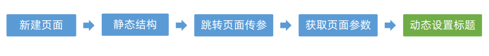
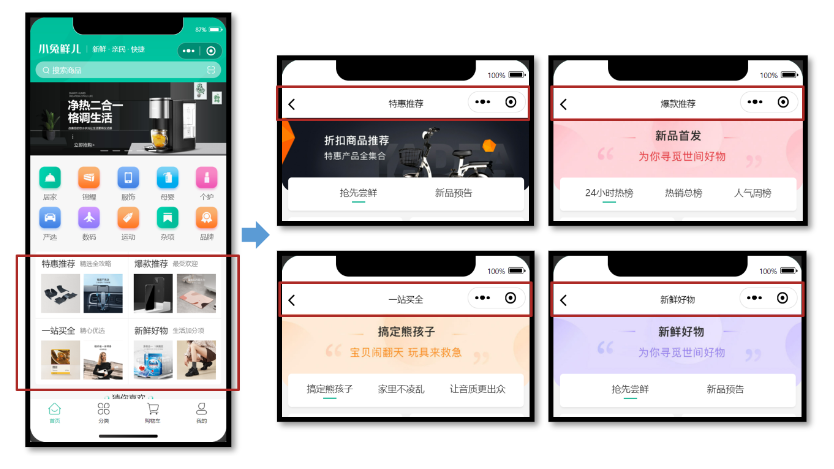
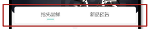
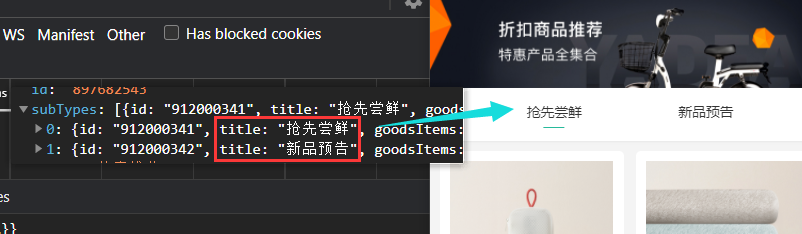
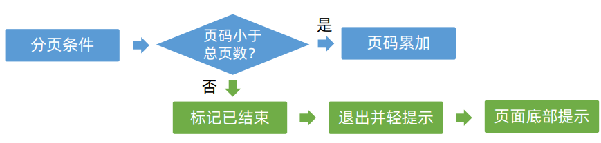
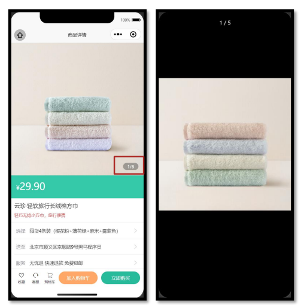

## uni-app—小兔鲜微信小程序实战

> uni-app官网：https://uniapp.dcloud.net.cn/
>
> 小兔鲜-小程序官网：https://megasu.gitee.io/uni-app-shop-note/

### 推荐模块

#### 1、准备组件

实现步骤：



推荐模块的布局结构是相同的，因此我们可以复用相同的页面及交互，只是所展示的数据不同。



##### 1.1 静态结构

新建热门推荐页面文件，并在 `pages.json` 中添加路由（VS Code 插件自动完成）。

```vue
<script setup lang="ts">
// 热门推荐页 标题和url
const hotMap = [
  { type: '1', title: '特惠推荐', url: '/hot/preference' },
  { type: '2', title: '爆款推荐', url: '/hot/inVogue' },
  { type: '3', title: '一站买全', url: '/hot/oneStop' },
  { type: '4', title: '新鲜好物', url: '/hot/new' },
]
</script>

<template>
  <view class="viewport">
    <!-- 推荐封面图 -->
    <view class="cover">
      <image
        src="http://yjy-xiaotuxian-dev.oss-cn-beijing.aliyuncs.com/picture/2021-05-20/84abb5b1-8344-49ae-afc1-9cb932f3d593.jpg"
      ></image>
    </view>
    <!-- 推荐选项 -->
    <view class="tabs">
      <text class="text active">抢先尝鲜</text>
      <text class="text">新品预告</text>
    </view>
    <!-- 推荐列表 -->
    <scroll-view scroll-y class="scroll-view">
      <view class="goods">
        <navigator
          hover-class="none"
          class="navigator"
          v-for="goods in 10"
          :key="goods"
          :url="`/pages/goods/goods?id=`"
        >
          <image
            class="thumb"
            src="https://yanxuan-item.nosdn.127.net/5e7864647286c7447eeee7f0025f8c11.png"
          ></image>
          <view class="name ellipsis">不含酒精，使用安心爽肤清洁湿巾</view>
          <view class="price">
            <text class="symbol">¥</text>
            <text class="number">29.90</text>
          </view>
        </navigator>
      </view>
      <view class="loading-text">正在加载...</view>
    </scroll-view>
  </view>
</template>

<style lang="scss">
page {
  height: 100%;
  background-color: #f4f4f4;
}

.viewport {
  display: flex;
  flex-direction: column;
  height: 100%;
  padding: 180rpx 0 0;
  position: relative;
}

.cover {
  width: 750rpx;
  height: 225rpx;
  border-radius: 0 0 40rpx 40rpx;
  overflow: hidden;
  position: absolute;
  left: 0;
  top: 0;
}

.scroll-view {
  flex: 1;
}

.tabs {
  display: flex;
  justify-content: space-evenly;
  height: 100rpx;
  line-height: 90rpx;
  margin: 0 20rpx;
  font-size: 28rpx;
  border-radius: 10rpx;
  box-shadow: 0 4rpx 5rpx rgba(200, 200, 200, 0.3);
  color: #333;
  background-color: #fff;
  position: relative;
  z-index: 9;

  .text {
    margin: 0 20rpx;
    position: relative;
  }

  .active {
    &::after {
      content: '';
      width: 40rpx;
      height: 4rpx;
      transform: translate(-50%);
      background-color: #27ba9b;
      position: absolute;
      left: 50%;
      bottom: 24rpx;
    }
  }
}

.goods {
  display: flex;
  flex-wrap: wrap;
  justify-content: space-between;
  padding: 0 20rpx 20rpx;

  .navigator {
    width: 345rpx;
    padding: 20rpx;
    margin-top: 20rpx;
    border-radius: 10rpx;
    background-color: #fff;
  }

  .thumb {
    width: 305rpx;
    height: 305rpx;
  }

  .name {
    height: 88rpx;
    font-size: 26rpx;
  }

  .price {
    line-height: 1;
    color: #cf4444;
    font-size: 30rpx;
  }

  .symbol {
    font-size: 70%;
  }

  .decimal {
    font-size: 70%;
  }
}

.loading-text {
  text-align: center;
  font-size: 28rpx;
  color: #666;
  padding: 20rpx 0 50rpx;
}
</style>

```


##### 1.2 修改热门推荐的跳转路由

热门推荐页要根据页面参数区分需要获取的是哪种类型的推荐列表，然后再去调用相应的接口，来获取不同的数据，再渲染到页面当中。

项目首页（传递参数）

```tsx
// src/pages/index/components/HotPanel.vue
<navigator :url="`/pages/hot/hot?type=${item.type}`">
  …省略  
</navigator>
```


##### 1.3 推荐详情模块获取参数

在`uni-app`中，`.vue`文件分为**页面文件**和**组件文件**。`defineProps`既可以用于接收父传子参数，也可用于页面传参参数。

```vue
// src/pages/hot/hot.vue
<script setup lang="ts">
// 热门推荐页 标题和url
const hotMap = [
  { type: '1', title: '特惠推荐', url: '/hot/preference' },
  { type: '2', title: '爆款推荐', url: '/hot/inVogue' },
  { type: '3', title: '一站买全', url: '/hot/oneStop' },
  { type: '4', title: '新鲜好物', url: '/hot/new' },
]
// uniapp 获取页面参数
const query = defineProps<{
  type: string
}>()
// console.log(query)
const currHot = hotMap.find((v) => v.type === query.type)
// 动态设置标题
uni.setNavigationBarTitle({ title: currHot!.title })
</script>
```


#### 2、获取数据

封装API接口，typescript类型，调用API获取数据

##### 2.1 根据文档封装接口

###### 地址参数

不同类型的推荐，需要调用不同的 API 接口：

| type | 推荐类型 | 接口路径        |
| :--- | :------- | :-------------- |
| 1    | 特惠推荐 | /hot/preference |
| 2    | 爆款推荐 | /hot/inVogue    |
| 3    | 一站买全 | /hot/oneStop    |
| 4    | 新鲜好物 | /hot/new        |

###### **Query:**

| 字段名称 | 是否必须 | 默认值 | 备注                 |
| :------- | :------- | :----- | :------------------- |
| subType  | 否       | 无     | 推荐列表 Tab 项的 id |
| page     | 否       | 1      | 页码                 |
| pageSize | 否       | 10     | 每页商品数量         |

###### 定义类型

由上述请求参数可知，我们需要定义一个类型。其中`page`和`pageSize`在分页的时候已经定义过了，我们只需要拿来用即可：

```ts
// types/hot.d.ts
import type { PageParams } from './global'

/** 推荐模块-请求参数类型 */
export type HotParams = PageParams & {
  /**Tab 项的 id，默认查询全部 Tab 项的第 1 页数据 */
  subType?: string
}
```

###### 封装API

```ts
// src/service/hot.ts

/**
 * 推荐-小程序
 * @param url 请求地址
 * @param data 请求参数
 */
export const getHotRecommend = (url: string, data?: HotParams) => {
  return request({
    method: 'GET',
    url,
    data,
  })
}
```


##### 2.2 接口调用

推荐组件：`pages/hot/index.vue`

```vue
<script setup lang="ts">
    import { getHotRecommend } from '@/services/hot'
    import { onLoad } from '@dcloudio/uni-app'

    // 热门推荐页 标题和url
    const hotMap = [
       ...
    ]
        
	// ...省略

    // 获取数据
    const getHotRecommandData = async () => {
        const res = await getHotRecommend(currentHotMap!.url)
        console.log(res)
    }

    // 页面加载时调用API
    onLoad(() => {
        getHotRecommandData()
    })
</script>
```


#### 3、页面渲染&Tab交互

##### 3.1 页面渲染

###### 类型声明

电商项目较为常见商品展示，商品的类型是可复用的，封装到 `src/types/global.d.ts` 文件中：

```ts
// src/types/global.d.ts
/** 通用商品类型 */
export type GoodsItem = {
  /** 商品描述 */
  desc: string
  /** 商品折扣 */
  discount: number
  /** id */
  id: string
  /** 商品名称 */
  name: string
  /** 商品已下单数量 */
  orderNum: number
  /** 商品图片 */
  picture: string
  /** 商品价格 */
  price: number
}
```

其实猜你喜欢的商品类型也相同，可复用通用商品类型，封装到 `src/services/home.ts` 文件中：

```ts
// src/services/home.ts
import type { GoodsItem } from '@/types/global'

// GuessItem 和 GoodsItem 类型相同
export type GuessItem = GoodsItem
```

热门推荐类型如下，新建 `src/types/hot.d.ts` 文件：

```ts
import type { PageResult, GoodsItem } from './global'

/** 热门推荐 */
export type HotResult = {
  /** id信息 */
  id: string
  /** 活动图片 */
  bannerPicture: string
  /** 活动标题 */
  title: string
  /** 子类选项 */
  subTypes: SubTypeItem[]
}

/** 热门推荐-子类选项 */
export type SubTypeItem = {
  /** 子类id */
  id: string
  /** 子类标题 */
  title: string
  /** 子类对应的商品集合 */
  goodsItems: PageResult<GoodsItem>
}
```

###### 升级API

```ts
// src/services/hot.ts
import type { HotParams, HotResult } from '@/types/hot'

export const getHotRecommend = (url: string, data?: HotParams) => {
  return request<HotResult>({
    method: 'GET',
    url,
    data,
  })
}
```

###### 页面渲染

```vue
<script setup lang="ts">
import { getHotRecommend } from '@/services/hot'
import type { SubType } from '@/types/hot'
import { ref } from 'vue'

// 省略...

// 推荐封面图
const bannerImage = ref('')
// 推荐选项
const subTypes = ref<SubType[]>([])
// 高亮的下标
const activeIndex = ref(0)
// 调用接口获取数据
const getHotRecommandData = async () => {
  const res = await getHotRecommend(currentHotMap!.url)
  // 保存封面
  bannerImage.value = res.result.bannerPicture
  // 保存列表
  subTypes.value = res.result.subTypes
}

// 页面加载时...
</script>

<template>
  <view class="viewport">
    <!-- 推荐封面图 -->
    <view class="cover">
      <image :src="bannerImage"></image>
    </view>
    <!-- 推荐选项 -->
    <view class="tabs">
      <text
        class="text"
        :class="{ active: activeIndex === index }"
        v-for="(item, index) in subTypes"
        :key="item.id"
        >{{ item.title }}</text
      >
    </view>
    <!-- 推荐列表 -->
    <scroll-view
      scroll-y
      class="scroll-view"
      v-for="(item, index) in subTypes"
      v-show="activeIndex === index"
      :key="item.id"
    >
      <view class="goods">
        <navigator
          hover-class="none"
          class="navigator"
          v-for="good in item.goodsItems.items"
          :key="good.id"
          :url="`/pages/goods/goods?id=${good.id}`"
        >
          <image class="thumb" :src="good.picture"></image>
          <view class="name ellipsis">{{ good.desc }}</view>
          <view class="price">
            <text class="symbol">¥</text>
            <text class="number">{{ good.price }}</text>
          </view>
        </navigator>
      </view>
      <view class="loading-text">正在加载...</view>
    </scroll-view>
  </view>
</template>
```


##### 3.2 Tab交互



实际上就是点击对应Tab项，显示对应的内容。据后端返回的数据，得到`subTypes`数组有多少条，代表着有多少个Tab项。



在上面的渲染中，其实该做的已经做了，我们只需要在点击的时候变化`activeIndex`的值为当前所选择的Tab项的`index`值即可。

给Tab项加上`tap`事件：

```vue
<text
      class="text"
      :class="{ active: activeIndex === index }"
      v-for="(item, index) in subTypes"
      :key="item.id"
      @tap="activeIndex = index"
      >{{ item.title }}</text
    >

<scroll-view
             scroll-y
             class="scroll-view"
             v-for="(item, index) in subTypes"
             v-show="activeIndex === index"
             :key="item.id"
             >
    //... 省略
</scroll-view>
```

最后通过`v-show`和`activeIndex`将选中Tab项的容器显示出来，其他项容器则隐藏。


#### 4、分页加载


这里实现的分页加载和前面在`XtxGuess`实现的方式是同理的。

* 给`scroll-view`绑定`scrolltolower`事件。
* 当容器下拉到底部时，发送数据请求。
* 将最新的数据追加到旧数据的后面 => 数组追加。

```vue
<script setup lang="ts">
// ...

// 下拉刷新
const onScrolltolower = async () => {
  // 获取当前项
  const currSubTypes = subTypes.value[activeIndex.value]
  // 页码累加
  currSubTypes.goodsItems.page++
  // 调用API
  const res = await getHotRecommend(currentHotMap!.url, {
    page: currSubTypes.goodsItems.page,
    pageSize: currSubTypes.goodsItems.pageSize,
    subType: currSubTypes.id,
  })
  // 获取最新数据
  const newCurrSubTypes = res.result.subTypes[activeIndex.value]
  // 追加到数组
  currSubTypes.goodsItems.items.push(...newCurrSubTypes.goodsItems.items)
}
</script>

<!-- 推荐列表 -->
<scroll-view
             scroll-y
             class="scroll-view"
             v-for="(item, index) in subTypes"
             v-show="activeIndex === index"
             :key="item.id"
             @scrolltolower="onScrolltolower"
             >
    <!-- ... 省略代码 -->
</scroll-view>
```


#### 5、分页条件

当请求的**分页页码**超出**后端返回页码**时，将返回空的数组。遇到这样的情况，我们应该停止请求，避免浪费不必要的性能。

实现步骤：



```ts
// 下拉刷新
const onScrolltolower = async () => {
    // 获取当前项
    const currSubTypes = subTypes.value[activeIndex.value]
    // 分页条件
    if (currSubTypes.goodsItems.page < currSubTypes.goodsItems.pages) {
        currSubTypes.goodsItems.page++
    } else {
        // 标记已结束
        currSubTypes.finished = true
        return uni.showToast({ icon: 'none', title: '没有更多数据了~' })
    }
    // 页码累加
    currSubTypes.goodsItems.page++
    // 调用API
    const res = await getHotRecommend(currentHotMap!.url, {
        page: currSubTypes.goodsItems.page,
        pageSize: currSubTypes.goodsItems.pageSize,
        subType: currSubTypes.id,
    })
    // 获取最新数据
    const newCurrSubTypes = res.result.subTypes[activeIndex.value]
    // 追加到数组
    currSubTypes.goodsItems.items.push(...newCurrSubTypes.goodsItems.items)
}
```

```tsx
<view class="loading-text"> {{ item.finished ? '没有更多数据了~' : '正在加载...' }}</view>
```


### 分类模块

#### 1、准备组件

商品分类页中的广告位，可复用之前定义的轮播图组件 `XtxSwiper`。


##### 1.1 静态结构

商品分类页静态结构： `src/pages/category/category.vue`：

```vue
<script setup lang="ts">
//
</script>

<template>
  <view class="viewport">
    <!-- 搜索框 -->
    <view class="search">
      <view class="input">
        <text class="icon-search">女靴</text>
      </view>
    </view>
    <!-- 分类 -->
    <view class="categories">
      <!-- 左侧：一级分类 -->
      <scroll-view class="primary" scroll-y>
        <view v-for="(item, index) in 10" :key="item" class="item" :class="{ active: index === 0 }">
          <text class="name"> 居家 </text>
        </view>
      </scroll-view>
      <!-- 右侧：二级分类 -->
      <scroll-view class="secondary" scroll-y>
        <!-- 焦点图 -->
        <XtxSwiper class="banner" :list="[]" />
        <!-- 内容区域 -->
        <view class="panel" v-for="item in 3" :key="item">
          <view class="title">
            <text class="name">宠物用品</text>
            <navigator class="more" hover-class="none">全部</navigator>
          </view>
          <view class="section">
            <navigator
              v-for="goods in 4"
              :key="goods"
              class="goods"
              hover-class="none"
              :url="`/pages/goods/goods?id=`"
            >
              <image
                class="image"
                src="https://yanxuan-item.nosdn.127.net/674ec7a88de58a026304983dd049ea69.jpg"
              ></image>
              <view class="name ellipsis">木天蓼逗猫棍</view>
              <view class="price">
                <text class="symbol">¥</text>
                <text class="number">16.00</text>
              </view>
            </navigator>
          </view>
        </view>
      </scroll-view>
    </view>
  </view>
</template>

<style lang="scss">
page {
  height: 100%;
  overflow: hidden;
}
.viewport {
  height: 100%;
  display: flex;
  flex-direction: column;
}
.search {
  padding: 0 30rpx 20rpx;
  background-color: #fff;
  .input {
    display: flex;
    align-items: center;
    justify-content: space-between;
    height: 64rpx;
    padding-left: 26rpx;
    color: #8b8b8b;
    font-size: 28rpx;
    border-radius: 32rpx;
    background-color: #f3f4f4;
  }
}
.icon-search {
  &::before {
    margin-right: 10rpx;
  }
}
/* 分类 */
.categories {
  flex: 1;
  min-height: 400rpx;
  display: flex;
}
/* 一级分类 */
.primary {
  overflow: hidden;
  width: 180rpx;
  flex: none;
  background-color: #f6f6f6;
  .item {
    display: flex;
    justify-content: center;
    align-items: center;
    height: 96rpx;
    font-size: 26rpx;
    color: #595c63;
    position: relative;
    &::after {
      content: '';
      position: absolute;
      left: 42rpx;
      bottom: 0;
      width: 96rpx;
      border-top: 1rpx solid #e3e4e7;
    }
  }
  .active {
    background-color: #fff;
    &::before {
      content: '';
      position: absolute;
      left: 0;
      top: 0;
      width: 8rpx;
      height: 100%;
      background-color: #27ba9b;
    }
  }
}
.primary .item:last-child::after,
.primary .active::after {
  display: none;
}
/* 二级分类 */
.secondary {
  background-color: #fff;
  .carousel {
    height: 200rpx;
    margin: 0 30rpx 20rpx;
    border-radius: 4rpx;
    overflow: hidden;
  }
  .panel {
    margin: 0 30rpx 0rpx;
  }
  .title {
    height: 60rpx;
    line-height: 60rpx;
    color: #333;
    font-size: 28rpx;
    border-bottom: 1rpx solid #f7f7f8;
    .more {
      float: right;
      padding-left: 20rpx;
      font-size: 24rpx;
      color: #999;
    }
  }
  .more {
    &::after {
      font-family: 'erabbit' !important;
      content: '\e6c2';
    }
  }
  .section {
    width: 100%;
    display: flex;
    flex-wrap: wrap;
    padding: 20rpx 0;
    .goods {
      width: 150rpx;
      margin: 0rpx 30rpx 20rpx 0;
      &:nth-child(3n) {
        margin-right: 0;
      }
      image {
        width: 150rpx;
        height: 150rpx;
      }
      .name {
        padding: 5rpx;
        font-size: 22rpx;
        color: #333;
      }
      .price {
        padding: 5rpx;
        font-size: 18rpx;
        color: #cf4444;
      }
      .number {
        font-size: 24rpx;
        margin-left: 2rpx;
      }
    }
  }
}
</style>
```


##### 1.2 渲染轮播图

**接口调用**

渲染轮播图数据业务功能对于前端来说比较简单，只需调用后端提供的接口将获得的数据展现。

> 注意：传递参数 `2` 标识获取商品分类页广告。

```vue
<script setup lang="ts">
import { getHomeBannerAPI } from '@/services/home'
import { onLoad } from '@dcloudio/uni-app'
import type { BannerItem } from '@/types/home'
import { ref } from 'vue'

// 获取轮播图数据
const categoryBannerList = ref<BannerItem[]>([])
const getBannerData = async () => {
  // 传递参数2,标识获取商品分类页广告
  const res = await getHomeBannerAPI(2)
  // 存放轮播图数据
  categoryBannerList.value = res.result
}

// 加载时调用接口
onLoad(() => {
  getBannerData()
})
</script>

<!-- 焦点图 -->
<XtxSwiper class="banner" :list="categoryBannerList" />
```


#### 2、渲染一级分类和Tab交互

##### 2.1 封装API接口

```ts
/**
 * 获取分类数据
 */
export const getCategoryTopAPI = () => {
    return request({
        method: 'GET',
        url: '/category/top',
    })
}
```


##### 2.2 初始化调用

```vue
<script setup lang="ts">
import { ref } from 'vue'
import { onLoad } from '@dcloudio/uni-app'
// ...
import { getCategoryTopAPI } from '@/services/category'

// 获取轮播图数据...
    
// 获取分类数据
const getCategoryData = async () => {
  const res = await getCategoryTopAPI()
  console.log(res)
}

// 加载时调用接口
onLoad(() => {
  getBannerData()
  getCategoryData()
})
</script>
```


##### 2.3 定义类型

```ts
// src/types/category.d.ts
import { GoodsItem } from './global'
/**
 * 一级分类项
 */
export interface CategoryTopItem {
  /**
   * 二级分类集合
   */
  children: CategoryChildItem[]
  /**
   * 一级分类id
   */
  id: string
  /**
   * 一级分类图片集
   */
  imageBanners: string[]
  /**
   * 一级分类名称
   */
  name: string
  /**
   * 一级分类图片
   */
  picture: string
}

/**
 * 二级分类项
 */
export interface CategoryChildItem {
  /**
   * 商品集合
   */
  goods: GoodsItem[]
  /**
   * 二级分类id
   */
  id: string
  /**
   * 二级分类名称
   */
  name: string
  /**
   * 二级分类图片
   */
  picture: string
}
```

接口添加类型规范：

```ts
/**
 * 获取分类数据
 */
export const getCategoryTopAPI = () => {
  return request<CategoryTopItem[]>({
    method: 'GET',
    url: '/category/top',
  })
}
```

商品分页模块需要更改几处代码：

```ts
import { ref } from 'vue'
import { onLoad } from '@dcloudio/uni-app'

import type { CategoryTopItem } from '@/types/category'
import { getCategoryTopAPI } from '@/services/category'

// 获取分类数据 => 添加类型规范
const categoryTopData = ref<CategoryTopItem[]>([])
const getCategoryData = async () => {
  const res = await getCategoryTopAPI()
  categoryTopData.value = res.result
}
```


##### 2.4 渲染一级分类

```vue
<!-- 左侧：一级分类 -->
<scroll-view class="primary" scroll-y>
    <view
          v-for="(item, index) in categoryTopData"
          :key="item.id"
          class="item"
          :class="{ active: index === 0 }"
          >
        <text class="name"> {{ item.name }} </text>
    </view>
</scroll-view>
```


##### 2.5 一级分类Tab交互

当用户点击一级分类时，需要高亮显示，即给它添加 `.active` 类名即可。

1. 添加一个`activeIndex`变量来存储tab项的`index`。
2. vue语法绑定类样式判断条件：`activeIndex === index`。
3. 给Tab绑定`tap`监听事件，点击哪一项，将`index`值赋值给`activeIndex`。

```tsx
// 创建tab项选中索引存储 , 默认选中第一项
const activeIndex = ref(0)


<!-- 左侧：一级分类 -->
<scroll-view class="primary" scroll-y>
    <view
        v-for="(item, index) in categoryTopData"
        :key="item.id"
        class="item"
        :class="{ active: index === activeIndex }"
        @tap="activeIndex = index"
        >
        <text class="name"> {{ item.name }} </text>
    </view>
</scroll-view>
```


#### 3、二级分类和商品渲染

##### 3.1 提取二级分类数据

> 主要难点是如何从一级分类中提取出二级分类。

商品二级分类是从属于某个一级分类的，通过 `computed` 配合**高亮下标**提取当前二级分类数据。

```ts
// 提取二级分类数据
const subCategoryList = computed(() => {
  return categoryTopData.value[activeIndex.value]?.children || []
})
```


##### 3.2 渲染二级分类

```tsx
<!-- 右侧：二级分类 -->
<scroll-view class="secondary" scroll-y>
    <!-- 焦点图 -->
    <XtxSwiper class="banner" :list="categoryBannerList" />
    <!-- 内容区域 -->
    <view class="panel" v-for="item in subCategoryList" :key="item.id">
        <view class="title">
            <text class="name">{{ item.name }}</text>
            <navigator class="more" hover-class="none">全部</navigator>
        </view>
        <view class="section">
            <navigator
                v-for="good in item.goods"
                :key="good.id"
                class="goods"
                hover-class="none"
                :url="`/pages/goods/goods?id=${good.id}`"
                >
                <image class="image" :src="good.picture"></image>
                <view class="name ellipsis">{{ good.name }}</view>
                <view class="price">
                    <text class="symbol">¥</text>
                    <text class="number">{{ good.price }}</text>
                </view>
            </navigator>
        </view>
    </view>
</scroll-view>
```


#### 4、骨架屏

实现步骤参考首页的骨架屏。

**参考效果**


商品分类页代码(总)：

```vue
<script setup lang="ts">
import { ref, computed } from 'vue'
import { onLoad } from '@dcloudio/uni-app'

import type { BannerItem } from '@/types/home'
import type { CategoryTopItem } from '@/types/category'

import { getHomeBannerAPI } from '@/services/home'
import { getCategoryTopAPI } from '@/services/category'
import PageSkeleton from './components/PageSkeleton.vue'

// 获取轮播图数据
const categoryBannerList = ref<BannerItem[]>([])
const getBannerData = async () => {
  // 传递参数2,标识获取商品分类页广告
  const res = await getHomeBannerAPI(2)
  // 存放轮播图数据
  categoryBannerList.value = res.result
}

// 创建tab项选中索引存储 , 默认选中第一项
const activeIndex = ref(0)

// 获取分类数据
const categoryTopData = ref<CategoryTopItem[]>([])
const getCategoryData = async () => {
  const res = await getCategoryTopAPI()
  categoryTopData.value = res.result
}

// 提取二级分类数据
const subCategoryList = computed(() => {
  return categoryTopData.value[activeIndex.value]?.children || []
})

// 是否加载完数据
const isFinished = ref(false)

// 加载时调用接口
onLoad(async () => {
  await Promise.all([getBannerData(), getCategoryData()])
  isFinished.value = true
})
</script>

<template>
  <view class="viewport" v-if="isFinished">
    <!-- 搜索框 -->
    <view class="search">
      <view class="input">
        <text class="icon-search">女靴</text>
      </view>
    </view>
    <!-- 分类 -->
    <view class="categories">
      <!-- 左侧：一级分类 -->
      <scroll-view class="primary" scroll-y>
        <view
          v-for="(item, index) in categoryTopData"
          :key="item.id"
          class="item"
          :class="{ active: index === activeIndex }"
          @tap="activeIndex = index"
        >
          <text class="name"> {{ item.name }} </text>
        </view>
      </scroll-view>
      <!-- 右侧：二级分类 -->
      <scroll-view class="secondary" scroll-y>
        <!-- 焦点图 -->
        <XtxSwiper class="banner" :list="categoryBannerList" />
        <!-- 内容区域 -->
        <view class="panel" v-for="item in subCategoryList" :key="item.id">
          <view class="title">
            <text class="name">{{ item.name }}</text>
            <navigator class="more" hover-class="none">全部</navigator>
          </view>
          <view class="section">
            <navigator
              v-for="good in item.goods"
              :key="good.id"
              class="goods"
              hover-class="none"
              :url="`/pages/goods/goods?id=${good.id}`"
            >
              <image class="image" :src="good.picture"></image>
              <view class="name ellipsis">{{ good.name }}</view>
              <view class="price">
                <text class="symbol">¥</text>
                <text class="number">{{ good.price }}</text>
              </view>
            </navigator>
          </view>
        </view>
      </scroll-view>
    </view>
  </view>
  <!-- 骨架屏 -->
  <PageSkeleton v-else />
</template>
```


### 详情模块

商品详情页的业务逻辑分为两部分：

1. 登录前：展示商品信息，轮播图交互（当前模块）
2. 登录后：加入购物车，立即购买（SKU 模块）

#### 1、准备组件

##### 1.1 效果


##### 1.2 静态结构

新建商品详情页：`pages/goods/index.vue`。

```vue
// src/pages/goods/goods.vue
<script setup lang="ts">
// 获取屏幕边界到安全区域距离
const { safeAreaInsets } = uni.getSystemInfoSync()
</script>

<template>
  <scroll-view scroll-y class="viewport">
    <!-- 基本信息 -->
    <view class="goods">
      <!-- 商品主图 -->
      <view class="preview">
        <swiper circular>
          <swiper-item>
            <image
              mode="aspectFill"
              src="https://yanxuan-item.nosdn.127.net/99c83709ca5f9fd5c5bb35d207ad7822.png"
            />
          </swiper-item>
          <swiper-item>
            <image
              mode="aspectFill"
              src="https://yanxuan-item.nosdn.127.net/f9107d47c08f0b99c097e30055c39e1a.png"
            />
          </swiper-item>
          <swiper-item>
            <image
              mode="aspectFill"
              src="https://yanxuan-item.nosdn.127.net/754c56785cc8c39f7414752f62d79872.png"
            />
          </swiper-item>
          <swiper-item>
            <image
              mode="aspectFill"
              src="https://yanxuan-item.nosdn.127.net/ef16f8127610ef56a2a10466d6dae157.jpg"
            />
          </swiper-item>
          <swiper-item>
            <image
              mode="aspectFill"
              src="https://yanxuan-item.nosdn.127.net/1f0c3f5d32b0e804deb9b3d56ea6c3b2.png"
            />
          </swiper-item>
        </swiper>
        <view class="indicator">
          <text class="current">1</text>
          <text class="split">/</text>
          <text class="total">5</text>
        </view>
      </view>

      <!-- 商品简介 -->
      <view class="meta">
        <view class="price">
          <text class="symbol">¥</text>
          <text class="number">29.90</text>
        </view>
        <view class="name ellipsis">云珍·轻软旅行长绒棉方巾 </view>
        <view class="desc"> 轻巧无捻小方巾，旅行便携 </view>
      </view>

      <!-- 操作面板 -->
      <view class="action">
        <view class="item arrow">
          <text class="label">选择</text>
          <text class="text ellipsis"> 请选择商品规格 </text>
        </view>
        <view class="item arrow">
          <text class="label">送至</text>
          <text class="text ellipsis"> 请选择收获地址 </text>
        </view>
        <view class="item arrow">
          <text class="label">服务</text>
          <text class="text ellipsis"> 无忧退 快速退款 免费包邮 </text>
        </view>
      </view>
    </view>

    <!-- 商品详情 -->
    <view class="detail panel">
      <view class="title">
        <text>详情</text>
      </view>
      <view class="content">
        <view class="properties">
          <!-- 属性详情 -->
          <view class="item">
            <text class="label">属性名</text>
            <text class="value">属性值</text>
          </view>
          <view class="item">
            <text class="label">属性名</text>
            <text class="value">属性值</text>
          </view>
        </view>
        <!-- 图片详情 -->
        <image
          mode="widthFix"
          src="https://yanxuan-item.nosdn.127.net/a8d266886d31f6eb0d7333c815769305.jpg"
        ></image>
        <image
          mode="widthFix"
          src="https://yanxuan-item.nosdn.127.net/a9bee1cb53d72e6cdcda210071cbd46a.jpg"
        ></image>
      </view>
    </view>

    <!-- 同类推荐 -->
    <view class="similar panel">
      <view class="title">
        <text>同类推荐</text>
      </view>
      <view class="content">
        <navigator
          v-for="item in 4"
          :key="item"
          class="goods"
          hover-class="none"
          :url="`/pages/goods/goods?id=`"
        >
          <image
            class="image"
            mode="aspectFill"
            src="https://yanxuan-item.nosdn.127.net/e0cea368f41da1587b3b7fc523f169d7.png"
          ></image>
          <view class="name ellipsis">简约山形纹全棉提花毛巾</view>
          <view class="price">
            <text class="symbol">¥</text>
            <text class="number">18.50</text>
          </view>
        </navigator>
      </view>
    </view>
  </scroll-view>

  <!-- 用户操作 -->
  <view class="toolbar" :style="{ paddingBottom: safeAreaInsets?.bottom + 'px' }">
    <view class="icons">
      <button class="icons-button"><text class="icon-heart"></text>收藏</button>
      <button class="icons-button" open-type="contact">
        <text class="icon-handset"></text>客服
      </button>
      <navigator class="icons-button" url="/pages/cart/cart" open-type="switchTab">
        <text class="icon-cart"></text>购物车
      </navigator>
    </view>
    <view class="buttons">
      <view class="addcart"> 加入购物车 </view>
      <view class="buynow"> 立即购买 </view>
    </view>
  </view>
</template>

<style lang="scss">
page {
  height: 100%;
  overflow: hidden;
  display: flex;
  flex-direction: column;
}

.viewport {
  background-color: #f4f4f4;
}

.panel {
  margin-top: 20rpx;
  background-color: #fff;
  .title {
    display: flex;
    justify-content: space-between;
    align-items: center;
    height: 90rpx;
    line-height: 1;
    padding: 30rpx 60rpx 30rpx 6rpx;
    position: relative;
    text {
      padding-left: 10rpx;
      font-size: 28rpx;
      color: #333;
      font-weight: 600;
      border-left: 4rpx solid #27ba9b;
    }
    navigator {
      font-size: 24rpx;
      color: #666;
    }
  }
}

.arrow {
  &::after {
    position: absolute;
    top: 50%;
    right: 30rpx;
    content: '\e6c2';
    color: #ccc;
    font-family: 'erabbit' !important;
    font-size: 32rpx;
    transform: translateY(-50%);
  }
}

/* 商品信息 */
.goods {
  background-color: #fff;
  .preview {
    height: 750rpx;
    position: relative;
    .image {
      width: 750rpx;
      height: 750rpx;
    }
    .indicator {
      height: 40rpx;
      padding: 0 24rpx;
      line-height: 40rpx;
      border-radius: 30rpx;
      color: #fff;
      font-family: Arial, Helvetica, sans-serif;
      background-color: rgba(0, 0, 0, 0.3);
      position: absolute;
      bottom: 30rpx;
      right: 30rpx;
      .current {
        font-size: 26rpx;
      }
      .split {
        font-size: 24rpx;
        margin: 0 1rpx 0 2rpx;
      }
      .total {
        font-size: 24rpx;
      }
    }
  }
  .meta {
    position: relative;
    border-bottom: 1rpx solid #eaeaea;
    .price {
      height: 130rpx;
      padding: 25rpx 30rpx 0;
      color: #fff;
      font-size: 34rpx;
      box-sizing: border-box;
      background-color: #35c8a9;
    }
    .number {
      font-size: 56rpx;
    }
    .brand {
      width: 160rpx;
      height: 80rpx;
      overflow: hidden;
      position: absolute;
      top: 26rpx;
      right: 30rpx;
    }
    .name {
      max-height: 88rpx;
      line-height: 1.4;
      margin: 20rpx;
      font-size: 32rpx;
      color: #333;
    }
    .desc {
      line-height: 1;
      padding: 0 20rpx 30rpx;
      font-size: 24rpx;
      color: #cf4444;
    }
  }
  .action {
    padding-left: 20rpx;
    .item {
      height: 90rpx;
      padding-right: 60rpx;
      border-bottom: 1rpx solid #eaeaea;
      font-size: 26rpx;
      color: #333;
      position: relative;
      display: flex;
      align-items: center;
      &:last-child {
        border-bottom: 0 none;
      }
    }
    .label {
      width: 60rpx;
      color: #898b94;
      margin: 0 16rpx 0 10rpx;
    }
    .text {
      flex: 1;
      -webkit-line-clamp: 1;
    }
  }
}

/* 商品详情 */
.detail {
  padding-left: 20rpx;
  .content {
    margin-left: -20rpx;
    .image {
      width: 100%;
    }
  }
  .properties {
    padding: 0 20rpx;
    margin-bottom: 30rpx;
    .item {
      display: flex;
      line-height: 2;
      padding: 10rpx;
      font-size: 26rpx;
      color: #333;
      border-bottom: 1rpx dashed #ccc;
    }
    .label {
      width: 200rpx;
    }
    .value {
      flex: 1;
    }
  }
}

/* 同类推荐 */
.similar {
  .content {
    padding: 0 20rpx 200rpx;
    background-color: #f4f4f4;
    display: flex;
    flex-wrap: wrap;
    .goods {
      width: 340rpx;
      padding: 24rpx 20rpx 20rpx;
      margin: 20rpx 7rpx;
      border-radius: 10rpx;
      background-color: #fff;
    }
    .image {
      width: 300rpx;
      height: 260rpx;
    }
    .name {
      height: 80rpx;
      margin: 10rpx 0;
      font-size: 26rpx;
      color: #262626;
    }
    .price {
      line-height: 1;
      font-size: 20rpx;
      color: #cf4444;
    }
    .number {
      font-size: 26rpx;
      margin-left: 2rpx;
    }
  }
  navigator {
    &:nth-child(even) {
      margin-right: 0;
    }
  }
}

/* 底部工具栏 */
.toolbar {
  position: fixed;
  left: 0;
  right: 0;
  bottom: 0;
  z-index: 1;
  background-color: #fff;
  height: 100rpx;
  padding: 0 20rpx var(--window-bottom);
  border-top: 1rpx solid #eaeaea;
  display: flex;
  justify-content: space-between;
  align-items: center;
  box-sizing: content-box;
  .buttons {
    display: flex;
    & > view {
      width: 220rpx;
      text-align: center;
      line-height: 72rpx;
      font-size: 26rpx;
      color: #fff;
      border-radius: 72rpx;
    }
    .addcart {
      background-color: #ffa868;
    }
    .buynow,
    .payment {
      background-color: #27ba9b;
      margin-left: 20rpx;
    }
  }
  .icons {
    padding-right: 10rpx;
    display: flex;
    align-items: center;
    flex: 1;
    .icons-button {
      flex: 1;
      text-align: center;
      line-height: 1.4;
      padding: 0;
      margin: 0;
      border-radius: 0;
      font-size: 20rpx;
      color: #333;
      background-color: #fff;
      &::after {
        border: none;
      }
    }
    text {
      display: block;
      font-size: 34rpx;
    }
  }
}
</style>
```


#### 2、页面渲染

##### 2.1 封装API接口

```ts
// src/services/goods.ts
/**
 * 获取商品详情
 * @param id 商品id
 */
export const getGoodsAPI = (id: string) => {
  return request({
    method: 'GET',
    url: '/goods',
    data: { id },
  })
}
```


##### 2.2 类型声明

```ts
import type { GoodsItem } from './global'

/** 商品信息 */
export type GoodsResult = {
  /** id */
  id: string
  /** 商品名称 */
  name: string
  /** 商品描述 */
  desc: string
  /** 当前价格 */
  price: number
  /** 原价 */
  oldPrice: number
  /** 商品详情: 包含详情属性 + 详情图片 */
  details: Details
  /** 主图图片集合[ 主图图片链接 ] */
  mainPictures: string[]
  /** 同类商品[ 商品信息 ] */
  similarProducts: GoodsItem[]
  /** sku集合[ sku信息 ] */
  skus: SkuItem[]
  /** 可选规格集合备注[ 可选规格信息 ] */
  specs: SpecItem[]
  /** 用户地址列表[ 地址信息 ] */
  userAddresses: AddressItem[]
}

/** 商品详情: 包含详情属性 + 详情图片 */
export type Details = {
  /** 商品属性集合[ 属性信息 ] */
  properties: DetailsPropertyItem[]
  /** 商品详情图片集合[ 图片链接 ] */
  pictures: string[]
}

/** 属性信息 */
export type DetailsPropertyItem = {
  /** 属性名称 */
  name: string
  /** 属性值 */
  value: string
}

/** sku信息 */
export type SkuItem = {
  /** id */
  id: string
  /** 库存 */
  inventory: number
  /** 原价 */
  oldPrice: number
  /** sku图片 */
  picture: string
  /** 当前价格 */
  price: number
  /** sku编码 */
  skuCode: string
  /** 规格集合[ 规格信息 ] */
  specs: SkuSpecItem[]
}

/** 规格信息 */
export type SkuSpecItem = {
  /** 规格名称 */
  name: string
  /** 可选值名称 */
  valueName: string
}

/** 可选规格信息 */
export type SpecItem = {
  /** 规格名称 */
  name: string
  /** 可选值集合[ 可选值信息 ] */
  values: SpecValueItem[]
}

/** 可选值信息 */
export type SpecValueItem = {
  /** 是否可售 */
  available: boolean
  /** 可选值备注 */
  desc: string
  /** 可选值名称 */
  name: string
  /** 可选值图片链接 */
  picture: string
}

/** 地址信息 */
export type AddressItem = {
  /** 收货人姓名 */
  receiver: string
  /** 联系方式 */
  contact: string
  /** 省份编码 */
  provinceCode: string
  /** 城市编码 */
  cityCode: string
  /** 区/县编码 */
  countyCode: string
  /** 详细地址 */
  address: string
  /** 默认地址，1为是，0为否 */
  isDefault: number
  /** 收货地址 id */
  id: string
  /** 省市区 */
  fullLocation: string
}
```


##### 2.3 重写API和调用API函数

```ts
import type { GoodsResult } from '@/types/goods'

/**
 * 获取商品详情
 * @param id 商品id
 */
export const getGoodsAPI = (id: string) => {
  return request<GoodsResult>({
    method: 'GET',
    url: '/goods',
    data: { id },
  })
}
```

```jsx
// 接收页面参数
const query = defineProps<{ id: string }>()

// 获取商品详情数据
const goodsDetail = ref<GoodsResult>()
const getGoodsDetailData = async () => {
  const res = await getGoodsAPI(query.id)
  goodsDetail.value = res.result
}

// 组件加载
onLoad(() => {
  getGoodsDetailData()
})
```


##### 2.4 页面渲染

```vue
<template>
  <scroll-view scroll-y class="viewport">
    <!-- 基本信息 -->
    <view class="goods">
      <!-- 商品主图 -->
      <view class="preview">
        <swiper circular>
          <swiper-item v-for="item in goodsDetail?.mainPictures" :key="item">
            <image mode="aspectFill" :src="item" />
          </swiper-item>
        </swiper>
        <view class="indicator">
          <text class="current">1</text>
          <text class="split">/</text>
          <text class="total">5</text>
        </view>
      </view>

      <!-- 商品简介 -->
      <view class="meta">
        <view class="price">
          <text class="symbol">¥</text>
          <text class="number">{{ goodsDetail?.price }}</text>
        </view>
        <view class="name ellipsis">{{ goodsDetail?.name }} </view>
        <view class="desc"> {{ goodsDetail?.desc }} </view>
      </view>

      <!-- 操作面板 -->
      <view class="action">
        <view class="item arrow">
          <text class="label">选择</text>
          <text class="text ellipsis"> 请选择商品规格 </text>
        </view>
        <view class="item arrow">
          <text class="label">送至</text>
          <text class="text ellipsis"> 请选择收获地址 </text>
        </view>
        <view class="item arrow">
          <text class="label">服务</text>
          <text class="text ellipsis"> 无忧退 快速退款 免费包邮 </text>
        </view>
      </view>
    </view>

    <!-- 商品详情 -->
    <view class="detail panel">
      <view class="title">
        <text>详情</text>
      </view>
      <view class="content">
        <view class="properties">
          <!-- 属性详情 -->
          <view class="item" v-for="item in goodsDetail?.details.properties" :key="item.name">
            <text class="label">{{ item.name }}</text>
            <text class="value">{{ item.value }}</text>
          </view>
        </view>
        <!-- 图片详情 -->
        <image
          v-for="item in goodsDetail?.details.pictures"
          :key="item"
          mode="widthFix"
          :src="item"
        ></image>
      </view>
    </view>

    <!-- 同类推荐 -->
    <view class="similar panel">
      <view class="title">
        <text>同类推荐</text>
      </view>
      <view class="content">
        <navigator
          v-for="item in goodsDetail?.similarProducts"
          :key="item.id"
          class="goods"
          hover-class="none"
          :url="`/pages/goods/index?id=${item.id}`"
        >
          <image class="image" mode="aspectFill" :src="item.picture"></image>
          <view class="name ellipsis">{{ item.name }}</view>
          <view class="price">
            <text class="symbol">¥</text>
            <text class="number">{{ item.price }}</text>
          </view>
        </navigator>
      </view>
    </view>
  </scroll-view>

  <!-- 用户操作 -->
  <view class="toolbar" :style="{ paddingBottom: safeAreaInsets?.bottom + 'px' }">
    <view class="icons">
      <button class="icons-button"><text class="icon-heart"></text>收藏</button>
      <button class="icons-button" open-type="contact">
        <text class="icon-handset"></text>客服
      </button>
      <navigator class="icons-button" url="/pages/cart/cart" open-type="switchTab">
        <text class="icon-cart"></text>购物车
      </navigator>
    </view>
    <view class="buttons">
      <view class="addcart"> 加入购物车 </view>
      <view class="buynow"> 立即购买 </view>
    </view>
  </view>
</template>
```


#### 3、轮播图交互

参考效果：



左右滑动图片，下标发生改变。

单击轮播图片，放大预览。

##### 3.1 更新下标

> 轮播图变化，更新下标

```tsx
const currentIndex = ref(0)
// 轮播图变化时
const onChange: UniHelper.SwiperOnChange = (ev) => {
// 更新当前下标
currentIndex.value = ev.detail!.current 轮播图变化 更新下标 }
```


##### 3.2 大图预览

> 点击图片，大图预览

```tsx
// 点击商品主图
const onTapImage = (url: string) => {
    uni.previewImage({
        current: url,
        urls: goods.value!.mainPictures,
    })
}
```


##### 3.3 视图代码

```tsx
<view class="preview">
    <swiper @change="onChange" circular>
        <swiper-item v-for="item in goods?.mainPictures" :key="item">
            <image @tap="onTapImage(item)" mode="aspectFill" :src="item" />
        </swiper-item>
    </swiper>
    <view class="indicator">
        <text class="current">{{ currentIndex + 1 }}</text>
        <text class="split">/</text>
        <text class="total">{{ goods?.mainPictures.length }}</text>
    </view>
</view>
```


#### 4、骨架屏

> 实现步骤参考首页的骨架屏。


#### 5、弹出层

##### 5.1 了解uni-ui中的弹出层组件


> 官方文档：https://en.uniapp.dcloud.io/component/uniui/uni-popup.html

```tsx
// 弹出层组件ref
const popup = ref<{
    open: (type?: UniHelper.UniPopupType) => void
    close: () => void
}>();


<view @tap="popup?.open('bottom')" class="item arrow">
    <text class="label">服务</text>
    <text class="text ellipsis"> 无忧退 快速退款 免费包邮 </text>
</view>

<!– uni-ui 弹出层组件 -->
<uni-popup ref="popup" type="bottom" background-color="#fff">
    <view>弹窗层内容1</view>
    <view>弹窗层内容2</view>
    <button @tap="popup?.close()">关闭弹出层</button>
</uni-popup>
```


#### 6、弹出层交互

实现步骤：


提供 **服务说明** 和 **收获地址** 两个组件的静态结构，实现弹出层交互。

##### 6.1 组件静态结构

###### **组件 1：服务说明**

```vue
// ServicePanel.vue
<script setup lang="ts">
//
</script>

<template>
  <view class="service-panel">
    <!-- 关闭按钮 -->
    <text class="close icon-close"></text>
    <!-- 标题 -->
    <view class="title">服务说明</view>
    <!-- 内容 -->
    <view class="content">
      <view class="item">
        <view class="dt">无忧退货</view>
        <view class="dd">
          自收到商品之日起30天内，可在线申请无忧退货服务（食品等特殊商品除外）
        </view>
      </view>
      <view class="item">
        <view class="dt">快速退款</view>
        <view class="dd">
          收到退货包裹并确认无误后，将在48小时内办理退款，
          退款将原路返回，不同银行处理时间不同，预计1-5个工作日到账
        </view>
      </view>
      <view class="item">
        <view class="dt">满88元免邮费</view>
        <view class="dd">
          单笔订单金额(不含运费)满88元可免邮费，不满88元， 单笔订单收取10元邮费
        </view>
      </view>
    </view>
  </view>
</template>

<style lang="scss">
.service-panel {
  padding: 0 30rpx;
  border-radius: 10rpx 10rpx 0 0;
  position: relative;
  background-color: #fff;
}

.title {
  line-height: 1;
  padding: 40rpx 0;
  text-align: center;
  font-size: 32rpx;
  font-weight: normal;
  border-bottom: 1rpx solid #ddd;
  color: #444;
}

.close {
  position: absolute;
  right: 24rpx;
  top: 24rpx;
}

.content {
  padding: 20rpx 20rpx 100rpx 20rpx;

  .item {
    margin-top: 20rpx;
  }

  .dt {
    margin-bottom: 10rpx;
    font-size: 28rpx;
    color: #333;
    font-weight: 500;
    position: relative;

    &::before {
      content: '';
      width: 10rpx;
      height: 10rpx;
      border-radius: 50%;
      background-color: #eaeaea;
      transform: translateY(-50%);
      position: absolute;
      top: 50%;
      left: -20rpx;
    }
  }

  .dd {
    line-height: 1.6;
    font-size: 26rpx;
    color: #999;
  }
}
</style>
```

###### **组件 2：收获地址组件**

```vue
// AddressPanel.vue
<script setup lang="ts">
//
</script>

<template>
  <view class="address-panel">
    <!-- 关闭按钮 -->
    <text class="close icon-close"></text>
    <!-- 标题 -->
    <view class="title">配送至</view>
    <!-- 内容 -->
    <view class="content">
      <view class="item">
        <view class="user">李明 13824686868</view>
        <view class="address">北京市顺义区后沙峪地区安平北街6号院</view>
        <text class="icon icon-checked"></text>
      </view>
      <view class="item">
        <view class="user">王东 13824686868</view>
        <view class="address">北京市顺义区后沙峪地区安平北街6号院</view>
        <text class="icon icon-ring"></text>
      </view>
      <view class="item">
        <view class="user">张三 13824686868</view>
        <view class="address">北京市朝阳区孙河安平北街6号院</view>
        <text class="icon icon-ring"></text>
      </view>
    </view>
    <view class="footer">
      <view class="button primary"> 新建地址 </view>
      <view v-if="false" class="button primary">确定</view>
    </view>
  </view>
</template>

<style lang="scss">
.address-panel {
  padding: 0 30rpx;
  border-radius: 10rpx 10rpx 0 0;
  position: relative;
  background-color: #fff;
}

.title {
  line-height: 1;
  padding: 40rpx 0;
  text-align: center;
  font-size: 32rpx;
  font-weight: normal;
  border-bottom: 1rpx solid #ddd;
  color: #444;
}

.close {
  position: absolute;
  right: 24rpx;
  top: 24rpx;
}

.content {
  min-height: 300rpx;
  max-height: 540rpx;
  overflow: auto;
  padding: 20rpx;
  .item {
    padding: 30rpx 50rpx 30rpx 60rpx;
    background-size: 40rpx;
    background-repeat: no-repeat;
    background-position: 0 center;
    background-image: url(https://pcapi-xiaotuxian-front-devtest.itheima.net/miniapp/images/locate.png);
    position: relative;
  }
  .icon {
    color: #999;
    font-size: 40rpx;
    transform: translateY(-50%);
    position: absolute;
    top: 50%;
    right: 0;
  }
  .icon-checked {
    color: #27ba9b;
  }
  .icon-ring {
    color: #444;
  }
  .user {
    font-size: 28rpx;
    color: #444;
    font-weight: 500;
  }
  .address {
    font-size: 26rpx;
    color: #666;
  }
}

.footer {
  display: flex;
  justify-content: space-between;
  padding: 20rpx 0 40rpx;
  font-size: 28rpx;
  color: #444;

  .button {
    flex: 1;
    height: 72rpx;
    text-align: center;
    line-height: 72rpx;
    margin: 0 20rpx;
    color: #fff;
    border-radius: 72rpx;
  }

  .primary {
    color: #fff;
    background-color: #27ba9b;
  }

  .secondary {
    background-color: #ffa868;
  }
}
</style>
```


##### 6.2 条件渲染弹出层

点击操作选项时，打开弹出层代码：

```ts
// 弹出层交互
const popupName = ref<'address' | 'service'>()
const openPopup = (name: typeof popupName.value) => {
  // 修改弹出层名字
  popupName.value = name
  // 打开弹出层
  popup.value?.open()
}
```

操作选项元素绑定事件如下：

```tsx
<view @tap="openPopup('address')" class="item arrow">
<text class="label">送至</text>
</view>
<view @tap="openPopup('service')" class="item arrow">
<text class="label">服务</text>
</view>
```

通过事件绑定及条件判断，打开弹出层结构：

```tsx
<!-- uni-popup -> 弹出层 -->
<uni-popup ref="popup" type="bottom" background-color="#fff">
    <AddressPanel v-if="popupName === 'address'" />
    <ServicePanel v-if="popupName === 'service'" />
</uni-popup>
```


##### 6.3 关闭弹出层

关闭按钮在子组件中，想要调用父组件的`close`方法需要通过`emit`。

###### 子组件操作

```tsx
// ts
const emit = defineEmits<{
    (event: 'close'): void
}>()
```

```vue
<!-- 关闭按钮 -->
<text class="close icon-close" @tap="emit('close')"></text>
```

###### 父组件操作

```vue
<uni-popup ref="popup" type="bottom" background-color="#fff">
    <AddressPanel v-if="popupName === 'address'" @close="popup?.close()" />
    <ServicePanel v-if="popupName === 'service'" @close="popup?.close()" />
</uni-popup>
```

