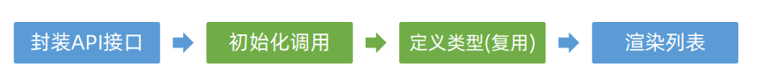
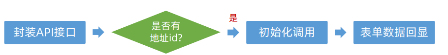
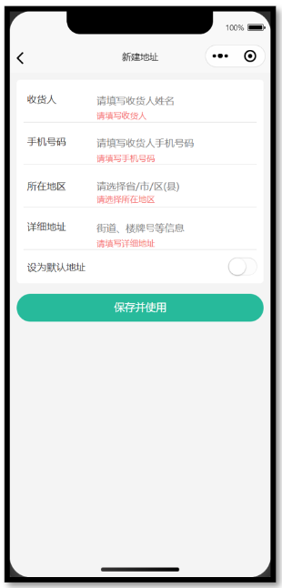
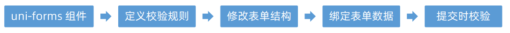
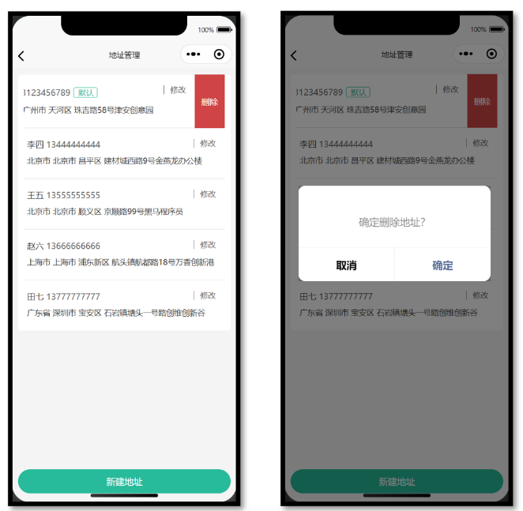
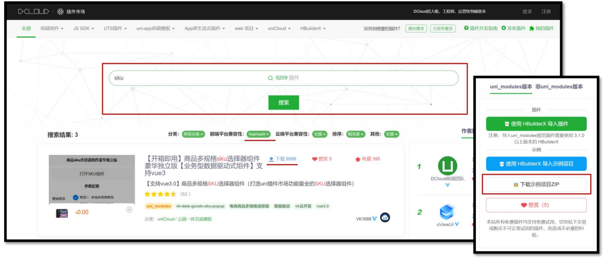

## uni-app—小兔鲜微信小程序实战

> uni-app官网：https://uniapp.dcloud.net.cn/
>
> 小兔鲜-小程序官网：https://megasu.gitee.io/uni-app-shop-note/


### 地址模块

- 能够获取不同类型的表单数据
- 能够动态设置导航栏的标题
- 能够使用 uni-ui 组件库的组件
- 能够完成收货地址的增删改查的功能


#### 1、准备工作

##### 1.1 静态结构

###### 地址管理页

`src/pagesMember/address/index.vue`

```vue
<script setup lang="ts">
//
</script>

<template>
  <view class="viewport">
    <!-- 地址列表 -->
    <scroll-view class="scroll-view" scroll-y>
      <view v-if="true" class="address">
        <view class="address-list">
          <!-- 收货地址项 -->
          <view class="item">
            <view class="item-content">
              <view class="user">
                黑马小王子
                <text class="contact">13111111111</text>
                <text v-if="true" class="badge">默认</text>
              </view>
              <view class="locate">广东省 广州市 天河区 黑马程序员</view>
              <navigator
                class="edit"
                hover-class="none"
                :url="`/pagesMember/address-form/address-form?id=1`"
              >
                修改
              </navigator>
            </view>
          </view>
          <!-- 收货地址项 -->
          <view class="item">
            <view class="item-content">
              <view class="user">
                黑马小公主
                <text class="contact">13222222222</text>
                <text v-if="false" class="badge">默认</text>
              </view>
              <view class="locate">北京市 北京市 顺义区 黑马程序员</view>
              <navigator
                class="edit"
                hover-class="none"
                :url="`/pagesMember/address-form/address-form?id=2`"
              >
                修改
              </navigator>
            </view>
          </view>
        </view>
      </view>
      <view v-else class="blank">暂无收货地址</view>
    </scroll-view>
    <!-- 添加按钮 -->
    <view class="add-btn">
      <navigator hover-class="none" url="/pagesMember/address-form/address-form">
        新建地址
      </navigator>
    </view>
  </view>
</template>

<style lang="scss">
page {
  height: 100%;
  overflow: hidden;
}

/* 删除按钮 */
.delete-button {
  display: flex;
  justify-content: center;
  align-items: center;
  width: 50px;
  height: 100%;
  font-size: 28rpx;
  color: #fff;
  border-radius: 0;
  padding: 0;
  background-color: #cf4444;
}

.viewport {
  display: flex;
  flex-direction: column;
  height: 100%;
  background-color: #f4f4f4;

  .scroll-view {
    padding-top: 20rpx;
  }
}

.address {
  padding: 0 20rpx;
  margin: 0 20rpx;
  border-radius: 10rpx;
  background-color: #fff;

  .item-content {
    line-height: 1;
    padding: 40rpx 10rpx 38rpx;
    border-bottom: 1rpx solid #ddd;
    position: relative;

    .edit {
      position: absolute;
      top: 36rpx;
      right: 30rpx;
      padding: 2rpx 0 2rpx 20rpx;
      border-left: 1rpx solid #666;
      font-size: 26rpx;
      color: #666;
      line-height: 1;
    }
  }

  .item:last-child .item-content {
    border: none;
  }

  .user {
    font-size: 28rpx;
    margin-bottom: 20rpx;
    color: #333;

    .contact {
      color: #666;
    }

    .badge {
      display: inline-block;
      padding: 4rpx 10rpx 2rpx 14rpx;
      margin: 2rpx 0 0 10rpx;
      font-size: 26rpx;
      color: #27ba9b;
      border-radius: 6rpx;
      border: 1rpx solid #27ba9b;
    }
  }

  .locate {
    line-height: 1.6;
    font-size: 26rpx;
    color: #333;
  }
}

.blank {
  margin-top: 300rpx;
  text-align: center;
  font-size: 32rpx;
  color: #888;
}

.add-btn {
  height: 80rpx;
  text-align: center;
  line-height: 80rpx;
  margin: 30rpx 20rpx;
  color: #fff;
  border-radius: 80rpx;
  font-size: 30rpx;
  background-color: #27ba9b;
}
</style>
```


###### 地址表单页

`src/pagesMember/address-form/index.vue`

```vue
<script setup lang="ts">
import { ref } from 'vue'

// 表单数据
const form = ref({
  receiver: '', // 收货人
  contact: '', // 联系方式
  fullLocation: '', // 省市区(前端展示)
  provinceCode: '', // 省份编码(后端参数)
  cityCode: '', // 城市编码(后端参数)
  countyCode: '', // 区/县编码(后端参数)
  address: '', // 详细地址
  isDefault: 0, // 默认地址，1为是，0为否
})
</script>

<template>
  <view class="content">
    <form>
      <!-- 表单内容 -->
      <view class="form-item">
        <text class="label">收货人</text>
        <input class="input" placeholder="请填写收货人姓名" value="" />
      </view>
      <view class="form-item">
        <text class="label">手机号码</text>
        <input class="input" placeholder="请填写收货人手机号码" value="" />
      </view>
      <view class="form-item">
        <text class="label">所在地区</text>
        <picker class="picker" mode="region" value="">
          <view v-if="false">广东省 广州市 天河区</view>
          <view v-else class="placeholder">请选择省/市/区(县)</view>
        </picker>
      </view>
      <view class="form-item">
        <text class="label">详细地址</text>
        <input class="input" placeholder="街道、楼牌号等信息" value="" />
      </view>
      <view class="form-item">
        <label class="label">设为默认地址</label>
        <switch class="switch" color="#27ba9b" :checked="true" />
      </view>
    </form>
  </view>
  <!-- 提交按钮 -->
  <button class="button">保存并使用</button>
</template>

<style lang="scss">
page {
  background-color: #f4f4f4;
}

.content {
  margin: 20rpx 20rpx 0;
  padding: 0 20rpx;
  border-radius: 10rpx;
  background-color: #fff;

  .form-item,
  .uni-forms-item {
    display: flex;
    align-items: center;
    min-height: 96rpx;
    padding: 25rpx 10rpx 40rpx;
    background-color: #fff;
    font-size: 28rpx;
    border-bottom: 1rpx solid #ddd;
    position: relative;
    margin-bottom: 0;

    // 调整 uni-forms 样式
    .uni-forms-item__content {
      display: flex;
    }

    .uni-forms-item__error {
      margin-left: 200rpx;
    }

    &:last-child {
      border: none;
    }

    .label {
      width: 200rpx;
      color: #333;
    }

    .input {
      flex: 1;
      display: block;
      height: 46rpx;
    }

    .switch {
      position: absolute;
      right: -20rpx;
      transform: scale(0.8);
    }

    .picker {
      flex: 1;
    }

    .placeholder {
      color: #808080;
    }
  }
}

.button {
  height: 80rpx;
  margin: 30rpx 20rpx;
  color: #fff;
  border-radius: 80rpx;
  font-size: 30rpx;
  background-color: #27ba9b;
}
</style>
```


##### 1.2 动态设置标题

```ts
// 获取页面参数
const query = defineProps<{
  id?: string
}>()

// 动态设置标题
uni.setNavigationBarTitle({ title: query.id ? '修改地址' : '新建地址' })
```


#### 2、新建地址

##### 2.1 接口封装

###### 类型声明

`src/types/address.d.ts`

```ts
/** 添加收货地址: 请求参数 */
export type AddressParams = {
  /** 收货人姓名 */
  receiver: string
  /** 联系方式 */
  contact: string
  /** 省份编码 */
  provinceCode: string
  /** 城市编码 */
  cityCode: string
  /** 区/县编码 */
  countyCode: string
  /** 详细地址 */
  address: string
  /** 默认地址，1为是，0为否 */
  isDefault: number
}
```

###### 接口定义

`src/services/address.ts`

```ts
import type { AddressParams } from '@/types/address'
import { request } from '@/utils/request'

/**
 * 添加收货地址
 * @param data 请求参数
 */
export const postMemberAddressAPI = (data: AddressParams) => {
  return request({
    method: 'POST',
    url: '/member/address',
    data,
  })
}
```


##### 2.2 实现代码

```vue
<script setup lang="ts">
import { postMemberAddressAPI } from '@/services/address'
import { ref } from 'vue'

// 表单数据
const form = ref({
  receiver: '', // 收货人
  contact: '', // 联系方式
  fullLocation: '', // 省市区(前端展示)
  provinceCode: '', // 省份编码(后端参数)
  cityCode: '', // 城市编码(后端参数)
  countyCode: '', // 区/县编码(后端参数)
  address: '', // 详细地址
  isDefault: 0, // 默认地址，1为是，0为否
})

// 收集所在地区
const onRegionChange: UniHelper.RegionPickerOnChange = (ev) => {
  // 省市区(前端展示)
  form.value.fullLocation = ev.detail.value.join(' ')
  // 省市区(后端参数)
  const [provinceCode, cityCode, countyCode] = ev.detail.code!
  // 合并数据
  Object.assign(form.value, { provinceCode, cityCode, countyCode })
}

// 收集是否默认收货地址
const onSwitchChange: UniHelper.SwitchOnChange = (ev) => {
  form.value.isDefault = ev.detail.value ? 1 : 0
}

// 提交表单
const onSubmit = async () => {
  // 新建地址请求
  await postMemberAddressAPI(form.value)
  // 成功提示
  uni.showToast({ icon: 'success', title: '添加成功' })
  // 返回上一页
  setTimeout(() => {
    uni.navigateBack()
  }, 400)
}
</script>

<template>
  <view class="content">
    <form>
      <!-- 表单内容 -->
      <view class="form-item">
        <text class="label">收货人</text>
        <input class="input" placeholder="请填写收货人姓名" v-model="form.receiver" />
      </view>
      <view class="form-item">
        <text class="label">手机号码</text>
        <input class="input" placeholder="请填写收货人手机号码" v-model="form.contact" />
      </view>
      <view class="form-item">
        <text class="label">所在地区</text>
        <picker
          class="picker"
          mode="region"
          :value="form.fullLocation.split(' ')"
          @change="onRegionChange"
        >
          <view v-if="form.fullLocation">{{ form.fullLocation }}</view>
          <view v-else class="placeholder">请选择省/市/区(县)</view>
        </picker>
      </view>
      <view class="form-item">
        <text class="label">详细地址</text>
        <input class="input" placeholder="街道、楼牌号等信息" v-model="form.address" />
      </view>
      <view class="form-item">
        <label class="label">设为默认地址</label>
        <switch
          class="switch"
          color="#27ba9b"
          :checked="form.isDefault === 1"
          @change="onSwitchChange"
        />
      </view>
    </form>
  </view>
  <!-- 提交按钮 -->
  <button @tap="onSubmit" class="button">保存并使用</button>
</template>
```


#### 3、地址管理页

为了能及时看到新建的收货地址，需在 `onShow` 生命周期中获取地址列表数据。


实现步骤：



##### 3.1 接口调用

> 接口地址：/member/address
>
> 请求方式：GET
>
> 登录权限: **是**
>
> 请求参数：无

###### 类型声明

`src/types/address.d.ts`

```ts
/** 收货地址项 */
export type AddressItem = {
  /** 收货人姓名 */
  receiver: string
  /** 联系方式 */
  contact: string
  /** 省份编码 */
  provinceCode: string
  /** 城市编码 */
  cityCode: string
  /** 区/县编码 */
  countyCode: string
  /** 详细地址 */
  address: string
  /** 默认地址，1为是，0为否 */
  isDefault: number
  /** 收货地址 id */
  id: string
  /** 省市区 */
  fullLocation: string
}
```

###### 接口封装

`src/types/address.ts`

```ts
/**
 * 获取收货地址列表
 */
export const getMemberAddressAPI = () => {
  return request<AddressItem[]>({
    method: 'GET',
    url: '/member/address',
  })
}
```

###### 复用地址类型

`src/types/goods.d.ts`

```ts
+ import type { AddressItem } from './address'

- /** 地址信息 */
- export type AddressItem = {
-   receiver: string
-   contact: string
-   provinceCode: string
-   cityCode: string
-   countyCode: string
-   address: string
-   isDefault: number
-   id: string
-   fullLocation: string
- }
```

> 温馨提示
>
> 用户登录后再访问**商品详情**，商品详情字段中包含用户收货地址列表，可以**复用收货地址类型**。


##### 3.2 实现代码

地址管理页

```vue
<script setup lang="ts">
import { getMemberAddressAPI } from '@/services/address'
import type { AddressItem } from '@/types/address'
import { onShow } from '@dcloudio/uni-app'
import { ref } from 'vue'

// 获取收货地址列表数据
const addressList = ref<AddressItem[]>([])
const getAddressList = async () => {
  const res = await getMemberAddressAPI()
  addressList.value = res.result
}

// 初始化调用(页面显示)
onShow(() => {
  getAddressList()
})
</script>

<template>
  <view class="viewport">
    <!-- 地址列表 -->
    <scroll-view class="scroll-view" scroll-y>
      <view v-if="true" class="address">
        <view class="address-list">
          <!-- 收获地址项 -->
          <view class="item" v-for="item in addressList" :key="item.id">
            <view class="item-content">
              <view class="user">
                {{ item.receiver }}
                <text class="contact">{{ item.contact }}</text>
                <text v-if="item.isDefault" class="badge">默认</text>
              </view>
              <view class="locate">{{ item.fullLocation }} {{ item.address }}</view>
              <navigator
                class="edit"
                hover-class="none"
                :url="`/pagesMember/address-form/address-form?id=${item.id}`"
              >
                修改
              </navigator>
            </view>
          </view>
        </view>
      </view>
      <view v-else class="blank">暂无收货地址</view>
    </scroll-view>
    <!-- 添加按钮 -->
    <view class="add-btn">
      <navigator hover-class="none" url="/pagesMember/address-form/address-form">
        新建地址
      </navigator>
    </view>
  </view>
</template>
```


#### 4、修改地址页

通过页面参数 `id` 来区分当前是**修改地址**还是**新建地址**。


##### 4.1 数据回显

修改地址之前，需要先实现数据回显，用户再进行有针对性的修改。

实现步骤：



###### 接口封装

```ts
/**
 *获取收货地址详情
 * @param id 请求参数
 */
export const getMemberAddress = (id: string) => {
  return request<AddressItem>({
    method: 'GET',
    url: `/member/address/${id}`,
  })
}
```

###### 实现代码

页面初始化的时候根据 `id` 获取地址详情，把获取的数据合并到表单数据中，用于数据回显。

```vue
<script setup lang="ts">
// 获取收货地址详情数据
const getMemberAddressByIdData = async () => {
  // 有 id 才调用接口
  if (query.id) {
    // 发送请求
    const res = await getMemberAddressByIdAPI(query.id)
    // 把数据合并到表单中
    Object.assign(form.value, res.result)
  }
}

// 页面加载
onLoad(() => {
  getMemberAddressByIdData()
})
</script>
```


##### 4.2 更新地址

将用户修改后的地址信息重新发送到服务端进行存储。

实现步骤：


###### 封装接口

```ts
/**
 *修改收货地址
 * @param id 地址的id
 * @param data 更新的数据
 */
export const putMemberAddress = (id: string, data: AddressParams) => {
  return request({
    method: 'PUT',
    url: `/member/address/${id}`,
    data,
  })
}
```

###### 实现代码

根据是否有地址 id 来判断提交表单到底是新建地址还是更新地址。

`src/pagesMember/address-form/index.vue`

```ts
<script setup lang="ts">
// 提交表单
const onSubmit = async () => {
  // 判断当前页面是否有地址 id
  if (query.id) {
    // 修改地址请求
    await putMemberAddressByIdAPI(query.id, form.value)
  } else {
    // 新建地址请求
    await postMemberAddressAPI(form.value)
  }
  // 成功提示
  uni.showToast({ icon: 'success', title: query.id ? '修改成功' : '添加成功' })
  // 返回上一页
  setTimeout(() => {
    uni.navigateBack()
  }, 400)
}
</script>
```


#### 5、表单校验

通过 `uni-ui` 组件库的 [uni-forms](https://uniapp.dcloud.net.cn/component/uniui/uni-forms.html#如何使用) 组件实现表单校验。



实现步骤：



实现代码：

```vue
<script setup lang="ts">
// 定义校验规则
const rules: UniHelper.UniFormsRules = {
  receiver: {
    rules: [{ required: true, errorMessage: '请输入收货人姓名' }],
  },
  contact: {
    rules: [
      { required: true, errorMessage: '请输入联系方式' },
      { pattern: /^1[3-9]\d{9}$/, errorMessage: '手机号格式不正确' },
    ],
  },
  fullLocation: {
    rules: [{ required: true, errorMessage: '请选择所在地区' }],
  },
  address: {
    rules: [{ required: true, errorMessage: '请选择详细地址' }],
  },
}

// 获取表单组件实例，用于调用表单方法
const formRef = ref<UniHelper.UniFormsInstance>() 

// 提交表单
const onSubmit = async () => {
  try {
    // 表单校验
    await formRef.value?.validate?.() 
    // 校验通过后再发送请求
    if (query.id) {
      // 修改地址请求
      await putMemberAddressByIdAPI(query.id, form.value)
    } else {
      // 新建地址请求
      await postMemberAddressAPI(form.value)
    }
    // 成功提示
    uni.showToast({ icon: 'success', title: query.id ? '修改成功' : '添加成功' })
    // 返回上一页
    setTimeout(() => {
      uni.navigateBack()
    }, 400)
  } catch (error) {
    uni.showToast({ icon: 'error', title: '请填写完整信息' }) 
  }
}
</script>

<template>
  <view class="content">
    <uni-forms :rules="rules" :model="form" ref="formRef">
      <!-- 表单内容 -->
      <uni-forms-item name="receiver" class="form-item">
        <text class="label">收货人</text>
        <input class="input" placeholder="请填写收货人姓名" v-model="form.receiver" />
      </uni-forms-item>
      <uni-forms-item name="contact" class="form-item">
        <text class="label">手机号码</text>
        <input
          class="input"
          placeholder="请填写收货人手机号码"
          :maxlength="11"
          v-model="form.contact"
        />
      </uni-forms-item>
      <uni-forms-item name="fullLocation" class="form-item">
        <text class="label">所在地区</text>
        <picker
          class="picker"
          @change="onRegionChange"
          mode="region"
          :value="form.fullLocation.split(' ')"
        >
          <view v-if="form.fullLocation">{{ form.fullLocation }}</view>
          <view v-else class="placeholder">请选择省/市/区(县)</view>
        </picker>
      </uni-forms-item>
      <uni-forms-item name="address" class="form-item">
        <text class="label">详细地址</text>
        <input class="input" placeholder="街道、楼牌号等信息" v-model="form.address" />
      </uni-forms-item>
      <view class="form-item">
        <label class="label">设为默认地址</label>
        <switch
          class="switch"
          color="#27ba9b"
          @change="onSwitchChange"
          :checked="form.isDefault === 1"
        />
      </view>
    </uni-forms>
  </view>
  <!-- 提交按钮 -->
  <button @tap="onSubmit" class="button">保存并使用</button>
</template>
```


#### 6、删除地址

通过 `uni-ui` 组件库的 [uni-swipe-action](https://uniapp.dcloud.net.cn/component/uniui/uni-swipe-action.html) 组件实现侧滑删除。



实现步骤：


##### 6.1 侧滑组件用法

```vue
<template>
  <!-- 滑动操作分区 -->
  <uni-swipe-action>
    <!-- 滑动操作项 -->
    <uni-swipe-action-item>
      <!-- 默认插槽 -->
      <view>内容</view>
      <!-- 右侧插槽 -->
      <template #right>
        <button class="delete-button">删除</button>
      </template>
    </uni-swipe-action-item>
  </uni-swipe-action>
</template>
```


##### 6.2 接口封装

```ts
/**
 * 删除收货地址
 * @param id 地址id(路径参数)
 */
export const deleteMemberAddressByIdAPI = (id: string) => {
  return request({
    method: 'DELETE',
    url: `/member/address/${id}`,
  })
}
```


##### 6.3 实现代码

侧滑地址列表项，右侧显示删除按钮，删除地址前需二次确认。

```vue
<script setup lang="ts">
// 删除收货地址
const onDeleteAddress = (id: string) => {
  // 二次确认
  uni.showModal({
    content: '删除地址?',
    success: async (res) => {
      if (res.confirm) {
        // 根据id删除收货地址
        await deleteMemberAddressByIdAPI(id)
        // 重新获取收货地址列表
        getAddressList()
      }
    },
  })
}
</script>

<template>
  <view class="viewport">
    <!-- 地址列表 -->
    <scroll-view class="scroll-view" scroll-y>
      <view v-if="addressList.length" class="address">
        <uni-swipe-action class="address-list">
          <!-- 收货地址项 -->
          <uni-swipe-action-item class="item" v-for="item in addressList" :key="item.id">
            <view class="item-content">
              <view class="user">
                {{ item.receiver }}
                <text class="contact">{{ item.contact }}</text>
                <text v-if="item.isDefault" class="badge">默认</text>
              </view>
              <view class="locate">{{ item.fullLocation }} {{ item.address }}</view>
              <navigator
                class="edit"
                hover-class="none"
                :url="`/pagesMember/address-form/address-form?id=${item.id}`"
              >
                修改
              </navigator>
            </view>
            <!-- 右侧插槽 -->
            <template #right>
              <button @tap="onDeleteAddress(item.id)" class="delete-button">删除</button>
            </template>
          </uni-swipe-action-item>
        </uni-swipe-action>
      </view>
      <view v-else class="blank">暂无收货地址</view>
    </scroll-view>
    <!-- 添加按钮 -->
    <view class="add-btn">
      <navigator hover-class="none" url="/pagesMember/address-form/address-form">
        新建地址
      </navigator>
    </view>
  </view>
</template>
```


### SKU模块

> 学会使用[插件市场](https://ext.dcloud.net.cn/)，下载并使用 `SKU` 组件，实现**商品详情页**规格展示和交互。

#### 1、SKU模块 – 基本概念

`SKU 概念`：存货单位（Stock Keeping Unit），库存管理的最小可用单元，通常称为“单品”。

SKU 常见于电商领域，对于前端工程师而言，更多关注 [SKU 算法](https://juejin.cn/post/7002746459456176158)，基于后端的 SKU 数据渲染页面并实现交互。


#### 2、下载SKU插件

[uni-app 插件市场](https://ext.dcloud.net.cn/)，是 uni-app 官方插件生态集中地。

`SKU` 属于电商常见业务，插件市场有现成的 `SKU` 插件，我们下载并在项目中使用。



经过综合评估，我们选择该[SKU 插件](https://ext.dcloud.net.cn/plugin?id=2848)，请下载插件到本地。

> 常见问题
>
> Q：如何评估第三方插件的质量？
>
> A：查看插件的**评分、评价、下载量、更新频率以及文档完整性**，以确保插件具有良好的社区口碑、兼容性、性能和维护状况。


#### 3、使用SKU插件

##### 3.1 组件安装到自己项目

1. 复制 `vk-data-goods-sku-popup` 和 `vk-data-input-number-box` 到项目的根 `components` 目录下。
2. 复制例子代码并运行体验。

`src/pages/cart/cart.vue`

```vue
<!-- 静态数据演示版本 适合任何后端 -->
<template>
  <view class="app">
    <button @click="openSkuPopup()">打开SKU组件</button>

    <vk-data-goods-sku-popup
      ref="skuPopup"
      v-model="skuKey"
      border-radius="20"
      :localdata="goodsInfo"
      :mode="skuMode"
      @open="onOpenSkuPopup"
      @close="onCloseSkuPopup"
      @add-cart="addCart"
      @buy-now="buyNow"
    ></vk-data-goods-sku-popup>
  </view>
</template>

<script>
var that // 当前页面对象
export default {
  data() {
    return {
      // 是否打开SKU弹窗
      skuKey: false,
      // SKU弹窗模式
      skuMode: 1,
      // 后端返回的商品信息
      goodsInfo: {},
    }
  },
  // 监听 - 页面每次【加载时】执行(如：前进)
  onLoad(options) {
    that = this
    that.init(options)
  },
  methods: {
    // 初始化
    init(options = {}) {},
    // 获取商品信息，并打开sku弹出
    openSkuPopup() {
      /**
       * 获取商品信息
       * 这里可以看到每次打开SKU都会去重新请求商品信息,为的是每次打开SKU组件可以实时看到剩余库存
       */
      // 此处写接口请求，并将返回的数据进行处理成goodsInfo的数据格式，
      // goodsInfo是后端返回的数据
      that.goodsInfo = {
        _id: '002',
        name: '迪奥香水',
        goods_thumb:
          'https://res.lancome.com.cn/resources/2020/9/11/15998112890781924_920X920.jpg?version=20200917220352530',
        sku_list: [
          {
            _id: '004',
            goods_id: '002',
            goods_name: '迪奥香水',
            image:
              'https://res.lancome.com.cn/resources/2020/9/11/15998112890781924_920X920.jpg?version=20200917220352530',
            price: 19800,
            sku_name_arr: ['50ml/瓶'],
            stock: 100,
          },
          {
            _id: '005',
            goods_id: '002',
            goods_name: '迪奥香水',
            image:
              'https://res.lancome.com.cn/resources/2020/9/11/15998112890781924_920X920.jpg?version=20200917220352530',
            price: 9800,
            sku_name_arr: ['70ml/瓶'],
            stock: 100,
          },
        ],
        spec_list: [
          {
            list: [
              {
                name: '20ml/瓶',
              },
              {
                name: '50ml/瓶',
              },
              {
                name: '70ml/瓶',
              },
            ],
            name: '规格',
          },
        ],
      }
      that.skuKey = true
    },
    // sku组件 开始-----------------------------------------------------------
    onOpenSkuPopup() {
      console.log('监听 - 打开sku组件')
    },
    onCloseSkuPopup() {
      console.log('监听 - 关闭sku组件')
    },
    // 加入购物车前的判断
    addCartFn(obj) {
      let { selectShop } = obj
      // 模拟添加到购物车,请替换成你自己的添加到购物车逻辑
      let res = {}
      let name = selectShop.goods_name
      if (selectShop.sku_name != '默认') {
        name += '-' + selectShop.sku_name_arr
      }
      res.msg = `${name} 已添加到购物车`
      if (typeof obj.success == 'function') obj.success(res)
    },
    // 加入购物车按钮
    addCart(selectShop) {
      console.log('监听 - 加入购物车')
      that.addCartFn({
        selectShop: selectShop,
        success: function (res) {
          // 实际业务时,请替换自己的加入购物车逻辑
          that.toast(res.msg)
          setTimeout(function () {
            that.skuKey = false
          }, 300)
        },
      })
    },
    // 立即购买
    buyNow(selectShop) {
      console.log('监听 - 立即购买')
      that.addCartFn({
        selectShop: selectShop,
        success: function (res) {
          // 实际业务时,请替换自己的立即购买逻辑
          that.toast('立即购买')
        },
      })
    },
    toast(msg) {
      uni.showToast({
        title: msg,
        icon: 'none',
      })
    },
  },
}
</script>

<style lang="scss" scoped>
.app {
  padding: 30rpx;
  font-size: 28rpx;
}
</style>
```


##### 3.2 插件文档部分

###### Props和事件的解释

Props 参数

|   Props   |                     说明                      |  类型   | 默认值 |   可选值    |
| :-------: | :-------------------------------------------: | :-----: | :----: | :---------: |
|  v-model  |  双向绑定，true 为打开组件，false 为关闭组件  | Boolean | false  | true、false |
|   mode    | 模式 1:都显示 2:只显示购物车 3:只显示立即购买 | Number  |   1    |   1、2、3   |
| localdata |              商品信息本地数据源               | Object  |   -    |      -      |

Event 事件名

|  Event   |                    说明                     |            回调参数             |
| :------: | :-----------------------------------------: | :-----------------------------: |
| add-cart | 点击添加到购物车时（需选择完 SKU 才会触发） | selectShop：当前选择的 sku 数据 |
| buy-now  |   点击立即购买时（需选择完 SKU 才会触发）   | selectShop：当前选择的 sku 数据 |
|   open   |                 打开组件时                  |                -                |
|  close   |                 关闭组件时                  |                -                |

常见问题

> Q：为什么插件使用时无需导入？
>
> A：`pages.json` 的 `easycom` 配置中，默认自动扫描 `xxx/xxx.vue` 格式的组件，**实现自动导入**。
>
> Q：为什么组件代码 Git 提交时报错？
>
> A：插件未采用 `eslint` 校验代码，请在插件源文件中添加 `/* eslint-disable */`，禁用 `eslint`。

###### 解决项目中eslint的问题

在 `vk-data-goods-sku-popup.vue` 和 `vk-data-input-number-box.vue` 组件禁用 `eslint`。

```vue
<script>
/* eslint-disable */
// 省略组件源代码
</script>
```

温馨提示: 插件的作者已合并 [`eslint-disable` PR](https://gitee.com/vk-uni/vk-u-goods-sku-popup/commit/e114364dd7166be5f66f3ee893d8b32efafa417b) ，现在已无需手动添加该注释。


### 购物车模块

