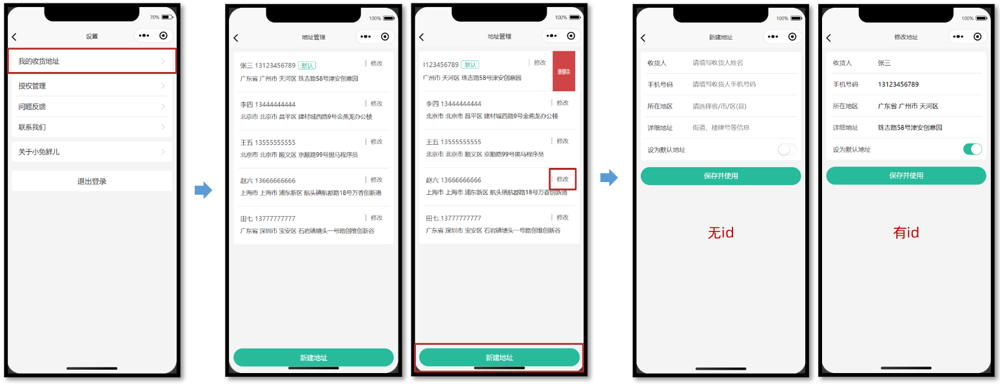

## uni-app—小兔鲜微信小程序实战

> uni-app官网：https://uniapp.dcloud.net.cn/
>
> 小兔鲜-小程序官网：https://megasu.gitee.io/uni-app-shop-note/


### 地址模块

- 能够获取不同类型的表单数据
- 能够动态设置导航栏的标题
- 能够使用 uni-ui 组件库的组件
- 能够完成收货地址的增删改查的功能




#### 1、准备工作

##### 1.1 静态结构

###### 地址管理页

`src/pagesMember/address/address.vue`

```vue
<script setup lang="ts">
//
</script>

<template>
  <view class="viewport">
    <!-- 地址列表 -->
    <scroll-view class="scroll-view" scroll-y>
      <view v-if="true" class="address">
        <view class="address-list">
          <!-- 收货地址项 -->
          <view class="item">
            <view class="item-content">
              <view class="user">
                黑马小王子
                <text class="contact">13111111111</text>
                <text v-if="true" class="badge">默认</text>
              </view>
              <view class="locate">广东省 广州市 天河区 黑马程序员</view>
              <navigator
                class="edit"
                hover-class="none"
                :url="`/pagesMember/address-form/address-form?id=1`"
              >
                修改
              </navigator>
            </view>
          </view>
          <!-- 收货地址项 -->
          <view class="item">
            <view class="item-content">
              <view class="user">
                黑马小公主
                <text class="contact">13222222222</text>
                <text v-if="false" class="badge">默认</text>
              </view>
              <view class="locate">北京市 北京市 顺义区 黑马程序员</view>
              <navigator
                class="edit"
                hover-class="none"
                :url="`/pagesMember/address-form/address-form?id=2`"
              >
                修改
              </navigator>
            </view>
          </view>
        </view>
      </view>
      <view v-else class="blank">暂无收货地址</view>
    </scroll-view>
    <!-- 添加按钮 -->
    <view class="add-btn">
      <navigator hover-class="none" url="/pagesMember/address-form/address-form">
        新建地址
      </navigator>
    </view>
  </view>
</template>

<style lang="scss">
page {
  height: 100%;
  overflow: hidden;
}

/* 删除按钮 */
.delete-button {
  display: flex;
  justify-content: center;
  align-items: center;
  width: 50px;
  height: 100%;
  font-size: 28rpx;
  color: #fff;
  border-radius: 0;
  padding: 0;
  background-color: #cf4444;
}

.viewport {
  display: flex;
  flex-direction: column;
  height: 100%;
  background-color: #f4f4f4;

  .scroll-view {
    padding-top: 20rpx;
  }
}

.address {
  padding: 0 20rpx;
  margin: 0 20rpx;
  border-radius: 10rpx;
  background-color: #fff;

  .item-content {
    line-height: 1;
    padding: 40rpx 10rpx 38rpx;
    border-bottom: 1rpx solid #ddd;
    position: relative;

    .edit {
      position: absolute;
      top: 36rpx;
      right: 30rpx;
      padding: 2rpx 0 2rpx 20rpx;
      border-left: 1rpx solid #666;
      font-size: 26rpx;
      color: #666;
      line-height: 1;
    }
  }

  .item:last-child .item-content {
    border: none;
  }

  .user {
    font-size: 28rpx;
    margin-bottom: 20rpx;
    color: #333;

    .contact {
      color: #666;
    }

    .badge {
      display: inline-block;
      padding: 4rpx 10rpx 2rpx 14rpx;
      margin: 2rpx 0 0 10rpx;
      font-size: 26rpx;
      color: #27ba9b;
      border-radius: 6rpx;
      border: 1rpx solid #27ba9b;
    }
  }

  .locate {
    line-height: 1.6;
    font-size: 26rpx;
    color: #333;
  }
}

.blank {
  margin-top: 300rpx;
  text-align: center;
  font-size: 32rpx;
  color: #888;
}

.add-btn {
  height: 80rpx;
  text-align: center;
  line-height: 80rpx;
  margin: 30rpx 20rpx;
  color: #fff;
  border-radius: 80rpx;
  font-size: 30rpx;
  background-color: #27ba9b;
}
</style>
```


###### 地址表单页

`src/pagesMember/address-form/address-form.vue`

```vue
<script setup lang="ts">
import { ref } from 'vue'

// 表单数据
const form = ref({
  receiver: '', // 收货人
  contact: '', // 联系方式
  fullLocation: '', // 省市区(前端展示)
  provinceCode: '', // 省份编码(后端参数)
  cityCode: '', // 城市编码(后端参数)
  countyCode: '', // 区/县编码(后端参数)
  address: '', // 详细地址
  isDefault: 0, // 默认地址，1为是，0为否
})
</script>

<template>
  <view class="content">
    <form>
      <!-- 表单内容 -->
      <view class="form-item">
        <text class="label">收货人</text>
        <input class="input" placeholder="请填写收货人姓名" value="" />
      </view>
      <view class="form-item">
        <text class="label">手机号码</text>
        <input class="input" placeholder="请填写收货人手机号码" value="" />
      </view>
      <view class="form-item">
        <text class="label">所在地区</text>
        <picker class="picker" mode="region" value="">
          <view v-if="false">广东省 广州市 天河区</view>
          <view v-else class="placeholder">请选择省/市/区(县)</view>
        </picker>
      </view>
      <view class="form-item">
        <text class="label">详细地址</text>
        <input class="input" placeholder="街道、楼牌号等信息" value="" />
      </view>
      <view class="form-item">
        <label class="label">设为默认地址</label>
        <switch class="switch" color="#27ba9b" :checked="true" />
      </view>
    </form>
  </view>
  <!-- 提交按钮 -->
  <button class="button">保存并使用</button>
</template>

<style lang="scss">
page {
  background-color: #f4f4f4;
}

.content {
  margin: 20rpx 20rpx 0;
  padding: 0 20rpx;
  border-radius: 10rpx;
  background-color: #fff;

  .form-item,
  .uni-forms-item {
    display: flex;
    align-items: center;
    min-height: 96rpx;
    padding: 25rpx 10rpx 40rpx;
    background-color: #fff;
    font-size: 28rpx;
    border-bottom: 1rpx solid #ddd;
    position: relative;
    margin-bottom: 0;

    // 调整 uni-forms 样式
    .uni-forms-item__content {
      display: flex;
    }

    .uni-forms-item__error {
      margin-left: 200rpx;
    }

    &:last-child {
      border: none;
    }

    .label {
      width: 200rpx;
      color: #333;
    }

    .input {
      flex: 1;
      display: block;
      height: 46rpx;
    }

    .switch {
      position: absolute;
      right: -20rpx;
      transform: scale(0.8);
    }

    .picker {
      flex: 1;
    }

    .placeholder {
      color: #808080;
    }
  }
}

.button {
  height: 80rpx;
  margin: 30rpx 20rpx;
  color: #fff;
  border-radius: 80rpx;
  font-size: 30rpx;
  background-color: #27ba9b;
}
</style>
```


##### 1.2 动态设置标题

```ts
// 获取页面参数
const query = defineProps<{
  id?: string
}>()

// 动态设置标题
uni.setNavigationBarTitle({ title: query.id ? '修改地址' : '新建地址' })
```


#### 2、新建地址

##### 2.1 接口封装

###### 类型声明

`src/types/address.d.ts`

```ts
/** 添加收货地址: 请求参数 */
export type AddressParams = {
  /** 收货人姓名 */
  receiver: string
  /** 联系方式 */
  contact: string
  /** 省份编码 */
  provinceCode: string
  /** 城市编码 */
  cityCode: string
  /** 区/县编码 */
  countyCode: string
  /** 详细地址 */
  address: string
  /** 默认地址，1为是，0为否 */
  isDefault: number
}
```

###### 接口定义

`src/services/address.ts`

```ts
import type { AddressParams } from '@/types/address'
import { request } from '@/utils/request'

/**
 * 添加收货地址
 * @param data 请求参数
 */
export const postMemberAddressAPI = (data: AddressParams) => {
  return request({
    method: 'POST',
    url: '/member/address',
    data,
  })
}
```


##### 2.2 实现代码

```vue
<script setup lang="ts">
import { postMemberAddressAPI } from '@/services/address'
import { ref } from 'vue'

// 表单数据
const form = ref({
  receiver: '', // 收货人
  contact: '', // 联系方式
  fullLocation: '', // 省市区(前端展示)
  provinceCode: '', // 省份编码(后端参数)
  cityCode: '', // 城市编码(后端参数)
  countyCode: '', // 区/县编码(后端参数)
  address: '', // 详细地址
  isDefault: 0, // 默认地址，1为是，0为否
})

// 收集所在地区
const onRegionChange: UniHelper.RegionPickerOnChange = (ev) => {
  // 省市区(前端展示)
  form.value.fullLocation = ev.detail.value.join(' ')
  // 省市区(后端参数)
  const [provinceCode, cityCode, countyCode] = ev.detail.code!
  // 合并数据
  Object.assign(form.value, { provinceCode, cityCode, countyCode })
}

// 收集是否默认收货地址
const onSwitchChange: UniHelper.SwitchOnChange = (ev) => {
  form.value.isDefault = ev.detail.value ? 1 : 0
}

// 提交表单
const onSubmit = async () => {
  // 新建地址请求
  await postMemberAddressAPI(form.value)
  // 成功提示
  uni.showToast({ icon: 'success', title: '添加成功' })
  // 返回上一页
  setTimeout(() => {
    uni.navigateBack()
  }, 400)
}
</script>

<template>
  <view class="content">
    <form>
      <!-- 表单内容 -->
      <view class="form-item">
        <text class="label">收货人</text>
        <input class="input" placeholder="请填写收货人姓名" v-model="form.receiver" />
      </view>
      <view class="form-item">
        <text class="label">手机号码</text>
        <input class="input" placeholder="请填写收货人手机号码" v-model="form.contact" />
      </view>
      <view class="form-item">
        <text class="label">所在地区</text>
        <picker
          class="picker"
          mode="region"
          :value="form.fullLocation.split(' ')"
          @change="onRegionChange"
        >
          <view v-if="form.fullLocation">{{ form.fullLocation }}</view>
          <view v-else class="placeholder">请选择省/市/区(县)</view>
        </picker>
      </view>
      <view class="form-item">
        <text class="label">详细地址</text>
        <input class="input" placeholder="街道、楼牌号等信息" v-model="form.address" />
      </view>
      <view class="form-item">
        <label class="label">设为默认地址</label>
        <switch
          class="switch"
          color="#27ba9b"
          :checked="form.isDefault === 1"
          @change="onSwitchChange"
        />
      </view>
    </form>
  </view>
  <!-- 提交按钮 -->
  <button @tap="onSubmit" class="button">保存并使用</button>
</template>
```


#### 3、地址管理页

为了能及时看到新建的收货地址，需在 `onShow` 生命周期中获取地址列表数据。


### Sku模块


### 购物车模块

