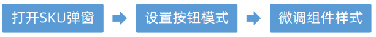
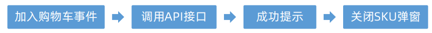
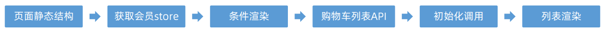
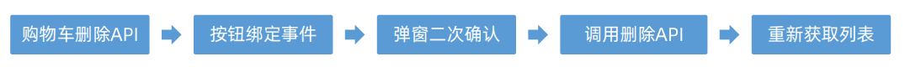
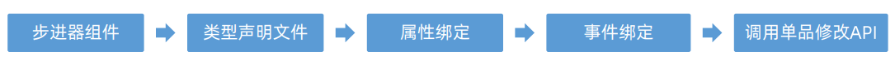
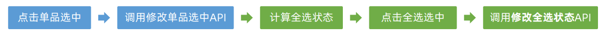
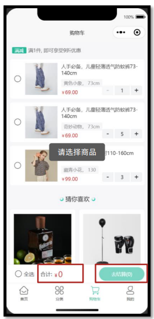
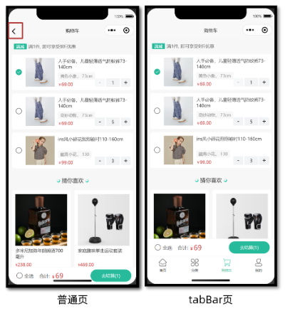

## uni-app—小兔鲜微信小程序实战

> uni-app官网：https://uniapp.dcloud.net.cn/
>
> 小兔鲜-小程序官网：https://megasu.gitee.io/uni-app-shop-note/


### 地址模块

- 能够获取不同类型的表单数据
- 能够动态设置导航栏的标题
- 能够使用 uni-ui 组件库的组件
- 能够完成收货地址的增删改查的功能


#### 1、准备工作

##### 1.1 静态结构

###### 地址管理页

`src/pagesMember/address/index.vue`

```vue
<script setup lang="ts">
//
</script>

<template>
  <view class="viewport">
    <!-- 地址列表 -->
    <scroll-view class="scroll-view" scroll-y>
      <view v-if="true" class="address">
        <view class="address-list">
          <!-- 收货地址项 -->
          <view class="item">
            <view class="item-content">
              <view class="user">
                黑马小王子
                <text class="contact">13111111111</text>
                <text v-if="true" class="badge">默认</text>
              </view>
              <view class="locate">广东省 广州市 天河区 黑马程序员</view>
              <navigator
                class="edit"
                hover-class="none"
                :url="`/pagesMember/address-form/address-form?id=1`"
              >
                修改
              </navigator>
            </view>
          </view>
          <!-- 收货地址项 -->
          <view class="item">
            <view class="item-content">
              <view class="user">
                黑马小公主
                <text class="contact">13222222222</text>
                <text v-if="false" class="badge">默认</text>
              </view>
              <view class="locate">北京市 北京市 顺义区 黑马程序员</view>
              <navigator
                class="edit"
                hover-class="none"
                :url="`/pagesMember/address-form/address-form?id=2`"
              >
                修改
              </navigator>
            </view>
          </view>
        </view>
      </view>
      <view v-else class="blank">暂无收货地址</view>
    </scroll-view>
    <!-- 添加按钮 -->
    <view class="add-btn">
      <navigator hover-class="none" url="/pagesMember/address-form/address-form">
        新建地址
      </navigator>
    </view>
  </view>
</template>

<style lang="scss">
page {
  height: 100%;
  overflow: hidden;
}

/* 删除按钮 */
.delete-button {
  display: flex;
  justify-content: center;
  align-items: center;
  width: 50px;
  height: 100%;
  font-size: 28rpx;
  color: #fff;
  border-radius: 0;
  padding: 0;
  background-color: #cf4444;
}

.viewport {
  display: flex;
  flex-direction: column;
  height: 100%;
  background-color: #f4f4f4;

  .scroll-view {
    padding-top: 20rpx;
  }
}

.address {
  padding: 0 20rpx;
  margin: 0 20rpx;
  border-radius: 10rpx;
  background-color: #fff;

  .item-content {
    line-height: 1;
    padding: 40rpx 10rpx 38rpx;
    border-bottom: 1rpx solid #ddd;
    position: relative;

    .edit {
      position: absolute;
      top: 36rpx;
      right: 30rpx;
      padding: 2rpx 0 2rpx 20rpx;
      border-left: 1rpx solid #666;
      font-size: 26rpx;
      color: #666;
      line-height: 1;
    }
  }

  .item:last-child .item-content {
    border: none;
  }

  .user {
    font-size: 28rpx;
    margin-bottom: 20rpx;
    color: #333;

    .contact {
      color: #666;
    }

    .badge {
      display: inline-block;
      padding: 4rpx 10rpx 2rpx 14rpx;
      margin: 2rpx 0 0 10rpx;
      font-size: 26rpx;
      color: #27ba9b;
      border-radius: 6rpx;
      border: 1rpx solid #27ba9b;
    }
  }

  .locate {
    line-height: 1.6;
    font-size: 26rpx;
    color: #333;
  }
}

.blank {
  margin-top: 300rpx;
  text-align: center;
  font-size: 32rpx;
  color: #888;
}

.add-btn {
  height: 80rpx;
  text-align: center;
  line-height: 80rpx;
  margin: 30rpx 20rpx;
  color: #fff;
  border-radius: 80rpx;
  font-size: 30rpx;
  background-color: #27ba9b;
}
</style>
```


###### 地址表单页

`src/pagesMember/address-form/index.vue`

```vue
<script setup lang="ts">
import { ref } from 'vue'

// 表单数据
const form = ref({
  receiver: '', // 收货人
  contact: '', // 联系方式
  fullLocation: '', // 省市区(前端展示)
  provinceCode: '', // 省份编码(后端参数)
  cityCode: '', // 城市编码(后端参数)
  countyCode: '', // 区/县编码(后端参数)
  address: '', // 详细地址
  isDefault: 0, // 默认地址，1为是，0为否
})
</script>

<template>
  <view class="content">
    <form>
      <!-- 表单内容 -->
      <view class="form-item">
        <text class="label">收货人</text>
        <input class="input" placeholder="请填写收货人姓名" value="" />
      </view>
      <view class="form-item">
        <text class="label">手机号码</text>
        <input class="input" placeholder="请填写收货人手机号码" value="" />
      </view>
      <view class="form-item">
        <text class="label">所在地区</text>
        <picker class="picker" mode="region" value="">
          <view v-if="false">广东省 广州市 天河区</view>
          <view v-else class="placeholder">请选择省/市/区(县)</view>
        </picker>
      </view>
      <view class="form-item">
        <text class="label">详细地址</text>
        <input class="input" placeholder="街道、楼牌号等信息" value="" />
      </view>
      <view class="form-item">
        <label class="label">设为默认地址</label>
        <switch class="switch" color="#27ba9b" :checked="true" />
      </view>
    </form>
  </view>
  <!-- 提交按钮 -->
  <button class="button">保存并使用</button>
</template>

<style lang="scss">
page {
  background-color: #f4f4f4;
}

.content {
  margin: 20rpx 20rpx 0;
  padding: 0 20rpx;
  border-radius: 10rpx;
  background-color: #fff;

  .form-item,
  .uni-forms-item {
    display: flex;
    align-items: center;
    min-height: 96rpx;
    padding: 25rpx 10rpx 40rpx;
    background-color: #fff;
    font-size: 28rpx;
    border-bottom: 1rpx solid #ddd;
    position: relative;
    margin-bottom: 0;

    // 调整 uni-forms 样式
    .uni-forms-item__content {
      display: flex;
    }

    .uni-forms-item__error {
      margin-left: 200rpx;
    }

    &:last-child {
      border: none;
    }

    .label {
      width: 200rpx;
      color: #333;
    }

    .input {
      flex: 1;
      display: block;
      height: 46rpx;
    }

    .switch {
      position: absolute;
      right: -20rpx;
      transform: scale(0.8);
    }

    .picker {
      flex: 1;
    }

    .placeholder {
      color: #808080;
    }
  }
}

.button {
  height: 80rpx;
  margin: 30rpx 20rpx;
  color: #fff;
  border-radius: 80rpx;
  font-size: 30rpx;
  background-color: #27ba9b;
}
</style>
```


##### 1.2 动态设置标题

```ts
// 获取页面参数
const query = defineProps<{
  id?: string
}>()

// 动态设置标题
uni.setNavigationBarTitle({ title: query.id ? '修改地址' : '新建地址' })
```


#### 2、新建地址

##### 2.1 接口封装

###### 类型声明

`src/types/address.d.ts`

```ts
/** 添加收货地址: 请求参数 */
export type AddressParams = {
  /** 收货人姓名 */
  receiver: string
  /** 联系方式 */
  contact: string
  /** 省份编码 */
  provinceCode: string
  /** 城市编码 */
  cityCode: string
  /** 区/县编码 */
  countyCode: string
  /** 详细地址 */
  address: string
  /** 默认地址，1为是，0为否 */
  isDefault: number
}
```

###### 接口定义

`src/services/address.ts`

```ts
import type { AddressParams } from '@/types/address'
import { request } from '@/utils/request'

/**
 * 添加收货地址
 * @param data 请求参数
 */
export const postMemberAddressAPI = (data: AddressParams) => {
  return request({
    method: 'POST',
    url: '/member/address',
    data,
  })
}
```


##### 2.2 实现代码

```vue
<script setup lang="ts">
import { postMemberAddressAPI } from '@/services/address'
import { ref } from 'vue'

// 表单数据
const form = ref({
  receiver: '', // 收货人
  contact: '', // 联系方式
  fullLocation: '', // 省市区(前端展示)
  provinceCode: '', // 省份编码(后端参数)
  cityCode: '', // 城市编码(后端参数)
  countyCode: '', // 区/县编码(后端参数)
  address: '', // 详细地址
  isDefault: 0, // 默认地址，1为是，0为否
})

// 收集所在地区
const onRegionChange: UniHelper.RegionPickerOnChange = (ev) => {
  // 省市区(前端展示)
  form.value.fullLocation = ev.detail.value.join(' ')
  // 省市区(后端参数)
  const [provinceCode, cityCode, countyCode] = ev.detail.code!
  // 合并数据
  Object.assign(form.value, { provinceCode, cityCode, countyCode })
}

// 收集是否默认收货地址
const onSwitchChange: UniHelper.SwitchOnChange = (ev) => {
  form.value.isDefault = ev.detail.value ? 1 : 0
}

// 提交表单
const onSubmit = async () => {
  // 新建地址请求
  await postMemberAddressAPI(form.value)
  // 成功提示
  uni.showToast({ icon: 'success', title: '添加成功' })
  // 返回上一页
  setTimeout(() => {
    uni.navigateBack()
  }, 400)
}
</script>

<template>
  <view class="content">
    <form>
      <!-- 表单内容 -->
      <view class="form-item">
        <text class="label">收货人</text>
        <input class="input" placeholder="请填写收货人姓名" v-model="form.receiver" />
      </view>
      <view class="form-item">
        <text class="label">手机号码</text>
        <input class="input" placeholder="请填写收货人手机号码" v-model="form.contact" />
      </view>
      <view class="form-item">
        <text class="label">所在地区</text>
        <picker
          class="picker"
          mode="region"
          :value="form.fullLocation.split(' ')"
          @change="onRegionChange"
        >
          <view v-if="form.fullLocation">{{ form.fullLocation }}</view>
          <view v-else class="placeholder">请选择省/市/区(县)</view>
        </picker>
      </view>
      <view class="form-item">
        <text class="label">详细地址</text>
        <input class="input" placeholder="街道、楼牌号等信息" v-model="form.address" />
      </view>
      <view class="form-item">
        <label class="label">设为默认地址</label>
        <switch
          class="switch"
          color="#27ba9b"
          :checked="form.isDefault === 1"
          @change="onSwitchChange"
        />
      </view>
    </form>
  </view>
  <!-- 提交按钮 -->
  <button @tap="onSubmit" class="button">保存并使用</button>
</template>
```


#### 3、地址管理页

为了能及时看到新建的收货地址，需在 `onShow` 生命周期中获取地址列表数据。


实现步骤：


##### 3.1 接口调用

> 接口地址：/member/address
>
> 请求方式：GET
>
> 登录权限: **是**
>
> 请求参数：无

###### 类型声明

`src/types/address.d.ts`

```ts
/** 收货地址项 */
export type AddressItem = {
  /** 收货人姓名 */
  receiver: string
  /** 联系方式 */
  contact: string
  /** 省份编码 */
  provinceCode: string
  /** 城市编码 */
  cityCode: string
  /** 区/县编码 */
  countyCode: string
  /** 详细地址 */
  address: string
  /** 默认地址，1为是，0为否 */
  isDefault: number
  /** 收货地址 id */
  id: string
  /** 省市区 */
  fullLocation: string
}
```

###### 接口封装

`src/types/address.ts`

```ts
/**
 * 获取收货地址列表
 */
export const getMemberAddressAPI = () => {
  return request<AddressItem[]>({
    method: 'GET',
    url: '/member/address',
  })
}
```

###### 复用地址类型

`src/types/goods.d.ts`

```ts
+ import type { AddressItem } from './address'

- /** 地址信息 */
- export type AddressItem = {
-   receiver: string
-   contact: string
-   provinceCode: string
-   cityCode: string
-   countyCode: string
-   address: string
-   isDefault: number
-   id: string
-   fullLocation: string
- }
```

> 温馨提示
>
> 用户登录后再访问**商品详情**，商品详情字段中包含用户收货地址列表，可以**复用收货地址类型**。


##### 3.2 实现代码

地址管理页

```vue
<script setup lang="ts">
import { getMemberAddressAPI } from '@/services/address'
import type { AddressItem } from '@/types/address'
import { onShow } from '@dcloudio/uni-app'
import { ref } from 'vue'

// 获取收货地址列表数据
const addressList = ref<AddressItem[]>([])
const getAddressList = async () => {
  const res = await getMemberAddressAPI()
  addressList.value = res.result
}

// 初始化调用(页面显示)
onShow(() => {
  getAddressList()
})
</script>

<template>
  <view class="viewport">
    <!-- 地址列表 -->
    <scroll-view class="scroll-view" scroll-y>
      <view v-if="true" class="address">
        <view class="address-list">
          <!-- 收获地址项 -->
          <view class="item" v-for="item in addressList" :key="item.id">
            <view class="item-content">
              <view class="user">
                {{ item.receiver }}
                <text class="contact">{{ item.contact }}</text>
                <text v-if="item.isDefault" class="badge">默认</text>
              </view>
              <view class="locate">{{ item.fullLocation }} {{ item.address }}</view>
              <navigator
                class="edit"
                hover-class="none"
                :url="`/pagesMember/address-form/address-form?id=${item.id}`"
              >
                修改
              </navigator>
            </view>
          </view>
        </view>
      </view>
      <view v-else class="blank">暂无收货地址</view>
    </scroll-view>
    <!-- 添加按钮 -->
    <view class="add-btn">
      <navigator hover-class="none" url="/pagesMember/address-form/address-form">
        新建地址
      </navigator>
    </view>
  </view>
</template>
```


#### 4、修改地址页

通过页面参数 `id` 来区分当前是**修改地址**还是**新建地址**。


##### 4.1 数据回显

修改地址之前，需要先实现数据回显，用户再进行有针对性的修改。

实现步骤：


###### 接口封装

```ts
/**
 *获取收货地址详情
 * @param id 请求参数
 */
export const getMemberAddress = (id: string) => {
  return request<AddressItem>({
    method: 'GET',
    url: `/member/address/${id}`,
  })
}
```

###### 实现代码

页面初始化的时候根据 `id` 获取地址详情，把获取的数据合并到表单数据中，用于数据回显。

```vue
<script setup lang="ts">
// 获取收货地址详情数据
const getMemberAddressByIdData = async () => {
  // 有 id 才调用接口
  if (query.id) {
    // 发送请求
    const res = await getMemberAddressByIdAPI(query.id)
    // 把数据合并到表单中
    Object.assign(form.value, res.result)
  }
}

// 页面加载
onLoad(() => {
  getMemberAddressByIdData()
})
</script>
```


##### 4.2 更新地址

将用户修改后的地址信息重新发送到服务端进行存储。

实现步骤：


###### 封装接口

```ts
/**
 *修改收货地址
 * @param id 地址的id
 * @param data 更新的数据
 */
export const putMemberAddress = (id: string, data: AddressParams) => {
  return request({
    method: 'PUT',
    url: `/member/address/${id}`,
    data,
  })
}
```

###### 实现代码

根据是否有地址 id 来判断提交表单到底是新建地址还是更新地址。

`src/pagesMember/address-form/index.vue`

```ts
<script setup lang="ts">
// 提交表单
const onSubmit = async () => {
  // 判断当前页面是否有地址 id
  if (query.id) {
    // 修改地址请求
    await putMemberAddressByIdAPI(query.id, form.value)
  } else {
    // 新建地址请求
    await postMemberAddressAPI(form.value)
  }
  // 成功提示
  uni.showToast({ icon: 'success', title: query.id ? '修改成功' : '添加成功' })
  // 返回上一页
  setTimeout(() => {
    uni.navigateBack()
  }, 400)
}
</script>
```


#### 5、表单校验

通过 `uni-ui` 组件库的 [uni-forms](https://uniapp.dcloud.net.cn/component/uniui/uni-forms.html#如何使用) 组件实现表单校验。


实现步骤：


实现代码：

```vue
<script setup lang="ts">
// 定义校验规则
const rules: UniHelper.UniFormsRules = {
  receiver: {
    rules: [{ required: true, errorMessage: '请输入收货人姓名' }],
  },
  contact: {
    rules: [
      { required: true, errorMessage: '请输入联系方式' },
      { pattern: /^1[3-9]\d{9}$/, errorMessage: '手机号格式不正确' },
    ],
  },
  fullLocation: {
    rules: [{ required: true, errorMessage: '请选择所在地区' }],
  },
  address: {
    rules: [{ required: true, errorMessage: '请选择详细地址' }],
  },
}

// 获取表单组件实例，用于调用表单方法
const formRef = ref<UniHelper.UniFormsInstance>() 

// 提交表单
const onSubmit = async () => {
  try {
    // 表单校验
    await formRef.value?.validate?.() 
    // 校验通过后再发送请求
    if (query.id) {
      // 修改地址请求
      await putMemberAddressByIdAPI(query.id, form.value)
    } else {
      // 新建地址请求
      await postMemberAddressAPI(form.value)
    }
    // 成功提示
    uni.showToast({ icon: 'success', title: query.id ? '修改成功' : '添加成功' })
    // 返回上一页
    setTimeout(() => {
      uni.navigateBack()
    }, 400)
  } catch (error) {
    uni.showToast({ icon: 'error', title: '请填写完整信息' }) 
  }
}
</script>

<template>
  <view class="content">
    <uni-forms :rules="rules" :model="form" ref="formRef">
      <!-- 表单内容 -->
      <uni-forms-item name="receiver" class="form-item">
        <text class="label">收货人</text>
        <input class="input" placeholder="请填写收货人姓名" v-model="form.receiver" />
      </uni-forms-item>
      <uni-forms-item name="contact" class="form-item">
        <text class="label">手机号码</text>
        <input
          class="input"
          placeholder="请填写收货人手机号码"
          :maxlength="11"
          v-model="form.contact"
        />
      </uni-forms-item>
      <uni-forms-item name="fullLocation" class="form-item">
        <text class="label">所在地区</text>
        <picker
          class="picker"
          @change="onRegionChange"
          mode="region"
          :value="form.fullLocation.split(' ')"
        >
          <view v-if="form.fullLocation">{{ form.fullLocation }}</view>
          <view v-else class="placeholder">请选择省/市/区(县)</view>
        </picker>
      </uni-forms-item>
      <uni-forms-item name="address" class="form-item">
        <text class="label">详细地址</text>
        <input class="input" placeholder="街道、楼牌号等信息" v-model="form.address" />
      </uni-forms-item>
      <view class="form-item">
        <label class="label">设为默认地址</label>
        <switch
          class="switch"
          color="#27ba9b"
          @change="onSwitchChange"
          :checked="form.isDefault === 1"
        />
      </view>
    </uni-forms>
  </view>
  <!-- 提交按钮 -->
  <button @tap="onSubmit" class="button">保存并使用</button>
</template>
```


#### 6、删除地址

通过 `uni-ui` 组件库的 [uni-swipe-action](https://uniapp.dcloud.net.cn/component/uniui/uni-swipe-action.html) 组件实现侧滑删除。


实现步骤：


##### 6.1 侧滑组件用法

```vue
<template>
  <!-- 滑动操作分区 -->
  <uni-swipe-action>
    <!-- 滑动操作项 -->
    <uni-swipe-action-item>
      <!-- 默认插槽 -->
      <view>内容</view>
      <!-- 右侧插槽 -->
      <template #right>
        <button class="delete-button">删除</button>
      </template>
    </uni-swipe-action-item>
  </uni-swipe-action>
</template>
```


##### 6.2 接口封装

```ts
/**
 * 删除收货地址
 * @param id 地址id(路径参数)
 */
export const deleteMemberAddressByIdAPI = (id: string) => {
  return request({
    method: 'DELETE',
    url: `/member/address/${id}`,
  })
}
```


##### 6.3 实现代码

侧滑地址列表项，右侧显示删除按钮，删除地址前需二次确认。

```vue
<script setup lang="ts">
// 删除收货地址
const onDeleteAddress = (id: string) => {
  // 二次确认
  uni.showModal({
    content: '删除地址?',
    success: async (res) => {
      if (res.confirm) {
        // 根据id删除收货地址
        await deleteMemberAddressByIdAPI(id)
        // 重新获取收货地址列表
        getAddressList()
      }
    },
  })
}
</script>

<template>
  <view class="viewport">
    <!-- 地址列表 -->
    <scroll-view class="scroll-view" scroll-y>
      <view v-if="addressList.length" class="address">
        <uni-swipe-action class="address-list">
          <!-- 收货地址项 -->
          <uni-swipe-action-item class="item" v-for="item in addressList" :key="item.id">
            <view class="item-content">
              <view class="user">
                {{ item.receiver }}
                <text class="contact">{{ item.contact }}</text>
                <text v-if="item.isDefault" class="badge">默认</text>
              </view>
              <view class="locate">{{ item.fullLocation }} {{ item.address }}</view>
              <navigator
                class="edit"
                hover-class="none"
                :url="`/pagesMember/address-form/address-form?id=${item.id}`"
              >
                修改
              </navigator>
            </view>
            <!-- 右侧插槽 -->
            <template #right>
              <button @tap="onDeleteAddress(item.id)" class="delete-button">删除</button>
            </template>
          </uni-swipe-action-item>
        </uni-swipe-action>
      </view>
      <view v-else class="blank">暂无收货地址</view>
    </scroll-view>
    <!-- 添加按钮 -->
    <view class="add-btn">
      <navigator hover-class="none" url="/pagesMember/address-form/address-form">
        新建地址
      </navigator>
    </view>
  </view>
</template>
```


### SKU模块

> 学会使用[插件市场](https://ext.dcloud.net.cn/)，下载并使用 `SKU` 组件，实现**商品详情页**规格展示和交互。

#### 1、SKU模块 – 基本概念

`SKU 概念`：存货单位（Stock Keeping Unit），库存管理的最小可用单元，通常称为“单品”。

SKU 常见于电商领域，对于前端工程师而言，更多关注 [SKU 算法](https://juejin.cn/post/7002746459456176158)，基于后端的 SKU 数据渲染页面并实现交互。


#### 2、下载SKU插件

[uni-app 插件市场](https://ext.dcloud.net.cn/)，是 uni-app 官方插件生态集中地。

`SKU` 属于电商常见业务，插件市场有现成的 `SKU` 插件，我们下载并在项目中使用。


经过综合评估，我们选择该[SKU 插件](https://ext.dcloud.net.cn/plugin?id=2848)，请下载插件到本地。

> 常见问题
>
> Q：如何评估第三方插件的质量？
>
> A：查看插件的**评分、评价、下载量、更新频率以及文档完整性**，以确保插件具有良好的社区口碑、兼容性、性能和维护状况。


#### 3、使用SKU插件

##### 3.1 组件安装到自己项目

1. 复制 `vk-data-goods-sku-popup` 和 `vk-data-input-number-box` 到项目的根 `components` 目录下。
2. 复制例子代码并运行体验。

`src/pages/cart/cart.vue`

```vue
<!-- 静态数据演示版本 适合任何后端 -->
<template>
  <view class="app">
    <button @click="openSkuPopup()">打开SKU组件</button>

    <vk-data-goods-sku-popup
      ref="skuPopup"
      v-model="skuKey"
      border-radius="20"
      :localdata="goodsInfo"
      :mode="skuMode"
      @open="onOpenSkuPopup"
      @close="onCloseSkuPopup"
      @add-cart="addCart"
      @buy-now="buyNow"
    ></vk-data-goods-sku-popup>
  </view>
</template>

<script>
var that // 当前页面对象
export default {
  data() {
    return {
      // 是否打开SKU弹窗
      skuKey: false,
      // SKU弹窗模式
      skuMode: 1,
      // 后端返回的商品信息
      goodsInfo: {},
    }
  },
  // 监听 - 页面每次【加载时】执行(如：前进)
  onLoad(options) {
    that = this
    that.init(options)
  },
  methods: {
    // 初始化
    init(options = {}) {},
    // 获取商品信息，并打开sku弹出
    openSkuPopup() {
      /**
       * 获取商品信息
       * 这里可以看到每次打开SKU都会去重新请求商品信息,为的是每次打开SKU组件可以实时看到剩余库存
       */
      // 此处写接口请求，并将返回的数据进行处理成goodsInfo的数据格式，
      // goodsInfo是后端返回的数据
      that.goodsInfo = {
        _id: '002',
        name: '迪奥香水',
        goods_thumb:
          'https://res.lancome.com.cn/resources/2020/9/11/15998112890781924_920X920.jpg?version=20200917220352530',
        sku_list: [
          {
            _id: '004',
            goods_id: '002',
            goods_name: '迪奥香水',
            image:
              'https://res.lancome.com.cn/resources/2020/9/11/15998112890781924_920X920.jpg?version=20200917220352530',
            price: 19800,
            sku_name_arr: ['50ml/瓶'],
            stock: 100,
          },
          {
            _id: '005',
            goods_id: '002',
            goods_name: '迪奥香水',
            image:
              'https://res.lancome.com.cn/resources/2020/9/11/15998112890781924_920X920.jpg?version=20200917220352530',
            price: 9800,
            sku_name_arr: ['70ml/瓶'],
            stock: 100,
          },
        ],
        spec_list: [
          {
            list: [
              {
                name: '20ml/瓶',
              },
              {
                name: '50ml/瓶',
              },
              {
                name: '70ml/瓶',
              },
            ],
            name: '规格',
          },
        ],
      }
      that.skuKey = true
    },
    // sku组件 开始-----------------------------------------------------------
    onOpenSkuPopup() {
      console.log('监听 - 打开sku组件')
    },
    onCloseSkuPopup() {
      console.log('监听 - 关闭sku组件')
    },
    // 加入购物车前的判断
    addCartFn(obj) {
      let { selectShop } = obj
      // 模拟添加到购物车,请替换成你自己的添加到购物车逻辑
      let res = {}
      let name = selectShop.goods_name
      if (selectShop.sku_name != '默认') {
        name += '-' + selectShop.sku_name_arr
      }
      res.msg = `${name} 已添加到购物车`
      if (typeof obj.success == 'function') obj.success(res)
    },
    // 加入购物车按钮
    addCart(selectShop) {
      console.log('监听 - 加入购物车')
      that.addCartFn({
        selectShop: selectShop,
        success: function (res) {
          // 实际业务时,请替换自己的加入购物车逻辑
          that.toast(res.msg)
          setTimeout(function () {
            that.skuKey = false
          }, 300)
        },
      })
    },
    // 立即购买
    buyNow(selectShop) {
      console.log('监听 - 立即购买')
      that.addCartFn({
        selectShop: selectShop,
        success: function (res) {
          // 实际业务时,请替换自己的立即购买逻辑
          that.toast('立即购买')
        },
      })
    },
    toast(msg) {
      uni.showToast({
        title: msg,
        icon: 'none',
      })
    },
  },
}
</script>

<style lang="scss" scoped>
.app {
  padding: 30rpx;
  font-size: 28rpx;
}
</style>
```


##### 3.2 插件文档部分

###### Props和事件的解释

Props 参数

|   Props   |                     说明                      |  类型   | 默认值 |   可选值    |
| :-------: | :-------------------------------------------: | :-----: | :----: | :---------: |
|  v-model  |  双向绑定，true 为打开组件，false 为关闭组件  | Boolean | false  | true、false |
|   mode    | 模式 1:都显示 2:只显示购物车 3:只显示立即购买 | Number  |   1    |   1、2、3   |
| localdata |              商品信息本地数据源               | Object  |   -    |      -      |

Event 事件名

|  Event   |                    说明                     |            回调参数             |
| :------: | :-----------------------------------------: | :-----------------------------: |
| add-cart | 点击添加到购物车时（需选择完 SKU 才会触发） | selectShop：当前选择的 sku 数据 |
| buy-now  |   点击立即购买时（需选择完 SKU 才会触发）   | selectShop：当前选择的 sku 数据 |
|   open   |                 打开组件时                  |                -                |
|  close   |                 关闭组件时                  |                -                |

常见问题

> Q：为什么插件使用时无需导入？
>
> A：`pages.json` 的 `easycom` 配置中，默认自动扫描 `xxx/xxx.vue` 格式的组件，**实现自动导入**。
>
> Q：为什么组件代码 Git 提交时报错？
>
> A：插件未采用 `eslint` 校验代码，请在插件源文件中添加 `/* eslint-disable */`，禁用 `eslint`。

###### 解决项目中eslint的问题

在 `vk-data-goods-sku-popup.vue` 和 `vk-data-input-number-box.vue` 组件禁用 `eslint`。

```vue
<script>
/* eslint-disable */
// 省略组件源代码
</script>
```

温馨提示: 插件的作者已合并 [`eslint-disable` PR](https://gitee.com/vk-uni/vk-u-goods-sku-popup/commit/e114364dd7166be5f66f3ee893d8b32efafa417b) ，现在已无需手动添加该注释。


#### 4、插件类型问题

尽管该插件未采用 TS 开发，但作者提供了详细的[插件文档](https://ext.dcloud.net.cn/plugin?id=2848)，我们可以依据文档为插件添加 TS 类型声明文件，从而提高项目数据校验的安全性。

##### 4.1 类型声明文件

`vk-data-goods-sku-popup.d.ts`

```ts
import { Component } from '@uni-helper/uni-app-types'

/** SKU 弹出层 */
export type SkuPopup = Component<SkuPopupProps>

/** SKU 弹出层实例 */
export type SkuPopupInstance = InstanceType<SkuPopup>

/** SKU 弹出层属性 */
export type SkuPopupProps = {
  /** 双向绑定，true 为打开组件，false 为关闭组件 */
  modelValue: boolean
  /** 商品信息本地数据源 */
  localdata: SkuPopupLocaldata
  /** 按钮模式 1:都显示 2:只显示购物车 3:只显示立即购买 */
  mode?: 1 | 2 | 3
  /** 该商品已抢完时的按钮文字 */
  noStockText?: string
  /** 库存文字 */
  stockText?: string
  /** 点击遮罩是否关闭组件 */
  maskCloseAble?: boolean
  /** 顶部圆角值 */
  borderRadius?: string | number
  /** 最小购买数量 */
  minBuyNum?: number
  /** 最大购买数量 */
  maxBuyNum?: number
  /** 每次点击后的数量 */
  stepBuyNum?: number
  /** 是否只能输入 step 的倍数 */
  stepStrictly?: boolean
  /** 是否隐藏库存的显示 */
  hideStock?: false
  /** 主题风格 */
  theme?: 'default' | 'red-black' | 'black-white' | 'coffee' | 'green'
  /** 默认金额会除以100（即100=1元），若设置为0，则不会除以100（即1=1元） */
  amountType?: 1 | 0
  /** 自定义获取商品信息的函数（已知支付宝不支持，支付宝请改用localdata属性） */
  customAction?: () => void
  /** 是否显示右上角关闭按钮 */
  showClose?: boolean
  /** 关闭按钮的图片地址 */
  closeImage?: string
  /** 价格的字体颜色 */
  priceColor?: string
  /** 立即购买 - 按钮的文字 */
  buyNowText?: string
  /** 立即购买 - 按钮的字体颜色 */
  buyNowColor?: string
  /** 立即购买 - 按钮的背景颜色 */
  buyNowBackgroundColor?: string
  /** 加入购物车 - 按钮的文字 */
  addCartText?: string
  /** 加入购物车 - 按钮的字体颜色 */
  addCartColor?: string
  /** 加入购物车 - 按钮的背景颜色 */
  addCartBackgroundColor?: string
  /** 商品缩略图背景颜色 */
  goodsThumbBackgroundColor?: string
  /** 样式 - 不可点击时,按钮的样式 */
  disableStyle?: object
  /** 样式 - 按钮点击时的样式 */
  activedStyle?: object
  /** 样式 - 按钮常态的样式 */
  btnStyle?: object
  /** 字段名 - 商品表id的字段名 */
  goodsIdName?: string
  /** 字段名 - sku表id的字段名 */
  skuIdName?: string
  /** 字段名 - 商品对应的sku列表的字段名 */
  skuListName?: string
  /** 字段名 - 商品规格名称的字段名 */
  specListName?: string
  /** 字段名 - sku库存的字段名 */
  stockName?: string
  /** 字段名 - sku组合路径的字段名 */
  skuArrName?: string
  /** 字段名 - 商品缩略图字段名(未选择sku时) */
  goodsThumbName?: string
  /** 被选中的值 */
  selectArr?: string[]

  /** 打开弹出层 */
  onOpen: () => void
  /** 关闭弹出层 */
  onClose: () => void
  /** 点击加入购物车时（需选择完SKU才会触发）*/
  onAddCart: (event: SkuPopupEvent) => void
  /** 点击立即购买时（需选择完SKU才会触发）*/
  onBuyNow: (event: SkuPopupEvent) => void
}

/**  商品信息本地数据源 */
export type SkuPopupLocaldata = {
  /** 商品 ID */
  _id: string
  /** 商品名称 */
  name: string
  /** 商品图片 */
  goods_thumb: string
  /** 商品规格列表 */
  spec_list: SkuPopupSpecItem[]
  /** 商品SKU列表 */
  sku_list: SkuPopupSkuItem[]
}

/** 商品规格名称的集合 */
export type SkuPopupSpecItem = {
  /** 规格名称 */
  name: string
  /** 规格集合 */
  list: { name: string }[]
}

/** 商品SKU列表 */
export type SkuPopupSkuItem = {
  /** SKU ID */
  _id: string
  /**  商品 ID */
  goods_id: string
  /** 商品名称 */
  goods_name: string
  /** 商品图片 */
  image: string
  /** SKU 价格 * 100, 注意：需要乘以 100 */
  price: number
  /** SKU 规格组成, 注意：需要与 spec_list 数组顺序对应 */
  sku_name_arr: string[]
  /** SKU 库存 */
  stock: number
}

/** 当前选择的sku数据 */
export type SkuPopupEvent = SkuPopupSkuItem & {
  /** 商品购买数量 */
  buy_num: number
}

/** 全局组件类型声明 */
declare module 'vue' {
  export interface GlobalComponents {
    'vk-data-goods-sku-popup': SkuPopup
  }
}
```


#### 5、核心业务

##### 5.1 渲染商品规格

使用以下两个属性：

- `localdata` 绑定商品 `SKU` 数据来源
- `v-model` 双向绑定，显示/隐藏组件

**注意**：后端返回的数据格式和插件所需的格式不一致，我们需要按插件要求进行处理。

```vue
<script setup lang="ts">
import type { SkuPopupLocaldata } from '@/components/vk-data-goods-sku-popup/vk-data-goods-sku-popup'

// 获取商品详情信息
const goods = ref<GoodsResult>()
const getGoodsByIdData = async () => {
  const res = await getGoodsByIdAPI(query.id)
  goods.value = res.result
  // SKU组件所需格式
  localdata.value = {
    _id: res.result.id,
    name: res.result.name,
    goods_thumb: res.result.mainPictures[0],
    spec_list: res.result.specs.map((v) => ({ name: v.name, list: v.values })),
    sku_list: res.result.skus.map((v) => ({
      _id: v.id,
      goods_id: res.result.id,
      goods_name: res.result.name,
      image: v.picture,
      price: v.price * 100, // 注意：需要乘以 100
      stock: v.inventory,
      sku_name_arr: v.specs.map((vv) => vv.valueName),
    })),
  }
}

// 是否显示SKU组件
const isShowSku = ref(false)
// 商品信息
const localdata = ref({} as SkuPopupLocaldata)
</script>

<template>
  <!-- SKU弹窗组件 -->
  <vk-data-goods-sku-popup v-model="isShowSku" :localdata="localdata" />
  <!-- 弹窗测试 -->
  <button @tap="isShowSku = true">打开 SKU 弹窗</button>
</template>
```


##### 5.2 打开弹窗交互

SKU 弹窗的按钮有三种形式。


实现步骤：



```vue
<script setup lang="ts">
// 按钮模式
enum SkuMode {
  Both = 1,
  Cart = 2,
  Buy = 3,
}
const mode = ref<SkuMode>(SkuMode.Cart)
// 打开SKU弹窗修改按钮模式
const openSkuPopup = (val: SkuMode) => {
  // 显示SKU弹窗
  isShowSku.value = true
  // 修改按钮模式
  mode.value = val
}
</script>

<template>
  <!-- SKU弹窗组件 -->
  <vk-data-goods-sku-popup
    v-model="isShowSku"
    :localdata="localdata"
    :mode="mode"
    add-cart-background-color="#FFA868"
    buy-now-background-color="#27BA9B"
  />

  <!-- 显示两个按钮 -->
  <view @tap="openSkuPopup(SkuMode.Both)" class="item arrow">请选择商品规格</view>
  <!-- 显示一个按钮 -->
  <view @tap="openSkuPopup(SkuMode.Cart)" class="addcart"> 加入购物车 </view>
  <view @tap="openSkuPopup(SkuMode.Buy)" class="payment"> 立即购买 </view>
</template>
```


##### 5.3 渲染被选中的值

实现步骤：


1. 通过 `ref` 获取组件实例。
2. 通过 `computed` 计算出**被选中的值**，渲染到界面中。

```vue
<script setup lang="ts">
// SKU组件实例
const skuPopupRef = ref<SkuPopupInstance>()
// 计算被选中的值
const selectArrText = computed(() => {
  return skuPopupRef.value?.selectArr?.join(' ').trim() || '请选择商品规格'
})
</script>

<template>
  <!-- SKU弹窗组件 -->
  <vk-data-goods-sku-popup
    v-model="isShowSku"
    :localdata="localdata"
    :mode="mode"
    add-cart-background-color="#FFA868"
    buy-now-background-color="#27BA9B"
    ref="skuPopupRef"
    :actived-style="{
      color: '#27BA9B',
      borderColor: '#27BA9B',
      backgroundColor: '#E9F8F5',
    }"
  />
  <!-- 操作面板 -->
  <view class="action">
    <view @tap="openSkuPopup(SkuMode.Both)" class="item arrow">
      <text class="label">选择</text>
      <text class="text ellipsis"> {{ selectArrText }} </text>
    </view>
  </view>
</template>
```

至此，已经完成 `SKU` 组件的交互，接下来进入到购物车模块，并实现加入购物车功能。


### 购物车模块

> 完成加入购物车，购物车列表交互，计算结算金额等业务。

#### 1、Sku—加入购物车

在商品详情页把 **选中规格后的商品(SKU)** 加入购物车。


实现步骤：



即将使用到的Sku事件：


##### 1.1 封装接口

`src/services/cart.ts`

```ts
import { request } from '@/utils/request'
/**
 * 加入购物车
 * @param data 请求体参数
 */
export const postMemberCartAPI = (data: { skuId: string; count: number }) => {
  return request({
    method: 'POST',
    url: '/member/cart',
    data,
  })
}
```


##### 1.2 实现代码

通过 `SKU` 组件提供的 `add-cart` 事件，获取加入购物车时所需的参数。

```vue
<script setup lang="ts">
// 加入购物车事件
const onAddCart = async (ev: SkuPopupEvent) => {
  await postMemberCartAPI({ skuId: ev._id, count: ev.buy_num })
  uni.showToast({ title: '添加成功' })
  isShowSku.value = false
}
</script>

<template>
  <!-- SKU弹窗组件 -->
  <vk-data-goods-sku-popup v-model="isShowSku" :localdata="localdata" @add-cart="onAddCart" />
</template>
```


#### 2、购物车列表渲染

参考效果：


实现步骤：



##### 2.1 静态结构

`src/pages/cart/cart.vue`

```vue
<script setup lang="ts">
//
</script>

<template>
  <scroll-view scroll-y class="scroll-view">
    <!-- 已登录: 显示购物车 -->
    <template v-if="true">
      <!-- 购物车列表 -->
      <view class="cart-list" v-if="true">
        <!-- 优惠提示 -->
        <view class="tips">
          <text class="label">满减</text>
          <text class="desc">满1件, 即可享受9折优惠</text>
        </view>
        <!-- 滑动操作分区 -->
        <uni-swipe-action>
          <!-- 滑动操作项 -->
          <uni-swipe-action-item v-for="item in 2" :key="item" class="cart-swipe">
            <!-- 商品信息 -->
            <view class="goods">
              <!-- 选中状态 -->
              <text class="checkbox" :class="{ checked: true }"></text>
              <navigator
                :url="`/pages/goods/goods?id=1435025`"
                hover-class="none"
                class="navigator"
              >
                <image
                  mode="aspectFill"
                  class="picture"
                  src="https://yanxuan-item.nosdn.127.net/da7143e0103304f0f3230715003181ee.jpg"
                ></image>
                <view class="meta">
                  <view class="name ellipsis">人手必备，儿童轻薄透气防蚊裤73-140cm</view>
                  <view class="attrsText ellipsis">黄色小象 140cm</view>
                  <view class="price">69.00</view>
                </view>
              </navigator>
              <!-- 商品数量 -->
              <view class="count">
                <text class="text">-</text>
                <input class="input" type="number" value="1" />
                <text class="text">+</text>
              </view>
            </view>
            <!-- 右侧删除按钮 -->
            <template #right>
              <view class="cart-swipe-right">
                <button class="button delete-button">删除</button>
              </view>
            </template>
          </uni-swipe-action-item>
        </uni-swipe-action>
      </view>
      <!-- 购物车空状态 -->
      <view class="cart-blank" v-else>
        <image src="/static/images/blank_cart.png" class="image" />
        <text class="text">购物车还是空的，快来挑选好货吧</text>
        <navigator open-type="switchTab" url="/pages/index/index" hover-class="none">
          <button class="button">去首页看看</button>
        </navigator>
      </view>
      <!-- 吸底工具栏 -->
      <view class="toolbar">
        <text class="all" :class="{ checked: true }">全选</text>
        <text class="text">合计:</text>
        <text class="amount">100</text>
        <view class="button-grounp">
          <view class="button payment-button" :class="{ disabled: true }"> 去结算(10) </view>
        </view>
      </view>
    </template>
    <!-- 未登录: 提示登录 -->
    <view class="login-blank" v-else>
      <text class="text">登录后可查看购物车中的商品</text>
      <navigator url="/pages/login/login" hover-class="none">
        <button class="button">去登录</button>
      </navigator>
    </view>
    <!-- 猜你喜欢 -->
    <XtxGuess ref="guessRef"></XtxGuess>
    <!-- 底部占位空盒子 -->
    <view class="toolbar-height"></view>
  </scroll-view>
</template>

<style lang="scss">
// 根元素
:host {
  height: 100vh;
  display: flex;
  flex-direction: column;
  overflow: hidden;
  background-color: #f7f7f8;
}

// 滚动容器
.scroll-view {
  flex: 1;
}

// 购物车列表
.cart-list {
  padding: 0 20rpx;

  // 优惠提示
  .tips {
    display: flex;
    align-items: center;
    line-height: 1;
    margin: 30rpx 10rpx;
    font-size: 26rpx;
    color: #666;

    .label {
      color: #fff;
      padding: 7rpx 15rpx 5rpx;
      border-radius: 4rpx;
      font-size: 24rpx;
      background-color: #27ba9b;
      margin-right: 10rpx;
    }
  }

  // 购物车商品
  .goods {
    display: flex;
    padding: 20rpx 20rpx 20rpx 80rpx;
    border-radius: 10rpx;
    background-color: #fff;
    position: relative;

    .navigator {
      display: flex;
    }

    .checkbox {
      position: absolute;
      top: 0;
      left: 0;

      display: flex;
      align-items: center;
      justify-content: center;
      width: 80rpx;
      height: 100%;

      &::before {
        content: '\e6cd';
        font-family: 'erabbit' !important;
        font-size: 40rpx;
        color: #444;
      }

      &.checked::before {
        content: '\e6cc';
        color: #27ba9b;
      }
    }

    .picture {
      width: 170rpx;
      height: 170rpx;
    }

    .meta {
      flex: 1;
      display: flex;
      flex-direction: column;
      justify-content: space-between;
      margin-left: 20rpx;
    }

    .name {
      height: 72rpx;
      font-size: 26rpx;
      color: #444;
    }

    .attrsText {
      line-height: 1.8;
      padding: 0 15rpx;
      font-size: 24rpx;
      align-self: flex-start;
      border-radius: 4rpx;
      color: #888;
      background-color: #f7f7f8;
    }

    .price {
      line-height: 1;
      font-size: 26rpx;
      color: #444;
      margin-bottom: 2rpx;
      color: #cf4444;

      &::before {
        content: '￥';
        font-size: 80%;
      }
    }

    // 商品数量
    .count {
      position: absolute;
      bottom: 20rpx;
      right: 5rpx;

      display: flex;
      justify-content: space-between;
      align-items: center;
      width: 220rpx;
      height: 48rpx;

      .text {
        height: 100%;
        padding: 0 20rpx;
        font-size: 32rpx;
        color: #444;
      }

      .input {
        height: 100%;
        text-align: center;
        border-radius: 4rpx;
        font-size: 24rpx;
        color: #444;
        background-color: #f6f6f6;
      }
    }
  }

  .cart-swipe {
    display: block;
    margin: 20rpx 0;
  }

  .cart-swipe-right {
    display: flex;
    height: 100%;

    .button {
      display: flex;
      justify-content: center;
      align-items: center;
      width: 50px;
      padding: 6px;
      line-height: 1.5;
      color: #fff;
      font-size: 26rpx;
      border-radius: 0;
    }

    .delete-button {
      background-color: #cf4444;
    }
  }
}

// 空状态
.cart-blank,
.login-blank {
  display: flex;
  justify-content: center;
  align-items: center;
  flex-direction: column;
  height: 60vh;
  .image {
    width: 400rpx;
    height: 281rpx;
  }
  .text {
    color: #444;
    font-size: 26rpx;
    margin: 20rpx 0;
  }
  .button {
    width: 240rpx !important;
    height: 60rpx;
    line-height: 60rpx;
    margin-top: 20rpx;
    font-size: 26rpx;
    border-radius: 60rpx;
    color: #fff;
    background-color: #27ba9b;
  }
}

// 吸底工具栏
.toolbar {
  position: fixed;
  left: 0;
  right: 0;
  bottom: var(--window-bottom);
  z-index: 1;

  height: 100rpx;
  padding: 0 20rpx;
  display: flex;
  align-items: center;
  border-top: 1rpx solid #ededed;
  border-bottom: 1rpx solid #ededed;
  background-color: #fff;
  box-sizing: content-box;

  .all {
    margin-left: 25rpx;
    font-size: 14px;
    color: #444;
    display: flex;
    align-items: center;
  }

  .all::before {
    font-family: 'erabbit' !important;
    content: '\e6cd';
    font-size: 40rpx;
    margin-right: 8rpx;
  }

  .checked::before {
    content: '\e6cc';
    color: #27ba9b;
  }

  .text {
    margin-right: 8rpx;
    margin-left: 32rpx;
    color: #444;
    font-size: 14px;
  }

  .amount {
    font-size: 20px;
    color: #cf4444;

    .decimal {
      font-size: 12px;
    }

    &::before {
      content: '￥';
      font-size: 12px;
    }
  }

  .button-grounp {
    margin-left: auto;
    display: flex;
    justify-content: space-between;
    text-align: center;
    line-height: 72rpx;
    font-size: 13px;
    color: #fff;

    .button {
      width: 240rpx;
      margin: 0 10rpx;
      border-radius: 72rpx;
    }

    .payment-button {
      background-color: #27ba9b;

      &.disabled {
        opacity: 0.6;
      }
    }
  }
}
// 底部占位空盒子
.toolbar-height {
  height: 100rpx;
}
</style>
```


##### 2.2 登录状态

获取会员store，进行条件渲染

```vue
<script setup lang="ts">
import { useMemberStore } from '@/stores'

// 获取会员Store
const memberStore = useMemberStore()
</script>

<template>
  <scroll-view scroll-y class="scroll-view">
    <!-- 已登录: 显示购物车 -->
    <template v-if="memberStore.profile">
      <!-- 购物车列表 -->
    </template>
    <!-- 未登录: 提示登录 -->
    <view class="login-blank" v-else>
      <text class="text">登录后可查看购物车中的商品</text>
      <navigator url="/pages/login/login" hover-class="none">
        <button class="button">去登录</button>
      </navigator>
    </view>
  </scroll-view>
</template>
```


##### 2.3 列表渲染

调用接口获取当前登录用户购物车中的商品列表。

###### **接口封装**

`src/services/cart.ts`

```ts
/**
 * 获取购物车列表
 */
export const getMemberCartAPI = () => {
  return request<CartItem[]>({
    method: 'GET',
    url: '/member/cart',
  })
}
```

###### 类型声明

`src/types/cart.d.ts`

```ts
/** 购物车类型 */
export type CartItem = {
  /** 商品 ID */
  id: string
  /** SKU ID */
  skuId: string
  /** 商品名称 */
  name: string
  /** 图片 */
  picture: string
  /** 数量 */
  count: number
  /** 加入时价格 */
  price: number
  /** 当前的价格 */
  nowPrice: number
  /** 库存 */
  stock: number
  /** 是否选中 */
  selected: boolean
  /** 属性文字 */
  attrsText: string
  /** 是否为有效商品 */
  isEffective: boolean
}
```

###### 实现代码

在页面初始化的时候判断用户是否已登录，已登录获取购物车列表。

```vue
<script setup lang="ts">
import { getMemberCartAPI } from '@/services/cart'
import { useMemberStore } from '@/stores'
import type { CartItem } from '@/types/cart'
import { onShow } from '@dcloudio/uni-app'
import { ref } from 'vue'

// 获取会员Store
const memberStore = useMemberStore()

// 获取购物车数据
const cartList = ref<CartItem[]>([])
const getMemberCartData = async () => {
  const res = await getMemberCartAPI()
  cartList.value = res.result
}

// 初始化调用: 页面显示触发
onShow(() => {
  // 用户已登录才允许调用
  if (memberStore.profile) {
    getMemberCartData()
  }
})
</script>

<template>
	...
      <!-- 购物车列表 -->
      <view class="cart-list" v-if="cartList.length">
        <!-- 优惠提示 -->
        <view class="tips">
          <text class="label">满减</text>
          <text class="desc">满1件, 即可享受9折优惠</text>
        </view>
        <!-- 滑动操作分区 -->
        <uni-swipe-action>
          <!-- 滑动操作项 -->
          <uni-swipe-action-item v-for="item in cartList" :key="item.skuId" class="cart-swipe">
            <!-- 商品信息 -->
            <view class="goods">
              <!-- 选中状态 -->
              <text class="checkbox" :class="{ checked: item.selected }"></text>
              <navigator
                :url="`/pages/goods/index?id=${item.id}`"
                hover-class="none"
                class="navigator"
              >
                <image mode="aspectFill" class="picture" :src="item.picture"></image>
                <view class="meta">
                  <view class="name ellipsis">{{ item.name }}</view>
                  <view class="attrsText ellipsis">{{ item.attrsText }}</view>
                  <view class="price">{{ item.nowPrice }}</view>
                </view>
              </navigator>
              <!-- 商品数量 -->
              <view class="count">
                <text class="text">-</text>
                <input class="input" type="number" :value="item.count.toString()" />
                <text class="text">+</text>
              </view>
            </view>
            <!-- 右侧删除按钮 -->
            <template #right>
              <view class="cart-swipe-right">
                <button class="button delete-button">删除</button>
              </view>
            </template>
          </uni-swipe-action-item>
        </uni-swipe-action>
      </view>
</template>
```


#### 3、购物车删除单品

通过侧滑删除购物车的商品，使用 [uni-swipe-action](https://uniapp.dcloud.net.cn/component/uniui/uni-swipe-action.html) 组件实现。

参考效果：


实现步骤：



##### 3.1 封装删除API

```ts
/**
 * 删除/清空购物车单品
 * @param ids 请求体参数 ids:Skuid集合
 */
export const deleteMemberCartAPI = (ids: string[]) => {
  return request({
    method: 'DELETE',
    url: '/member/cart',
    data: { ids },
  })
}
```


##### 3.2 实现删除代码

```vue
<script setup lang="ts">
// 点击删除按钮
const onDeleteCart = (skuId: string) => {
  // 弹窗二次确认
  uni.showModal({
    content: '是否删除',
    success: async (res) => {
      if (res.confirm) {
        // 后端删除单品
        await deleteMemberCartAPI({ ids: [skuId] })
        // 重新获取列表
        getCartList()
      }
    },
  })
}
</script>

<template>
  <!-- 右侧删除按钮 -->
  <template #right>
    <view class="cart-swipe-right">
      <button @tap="onDeleteCart(item.skuId)" class="button delete-button">删除</button>
    </view>
  </template>
</template>
```


#### 4、购物车修改单品数量

修改购买数量。

参考效果：


实现步骤：



##### 4.1 步进器组件 & 类型声明文件

复用 `SKU` 插件中的 **步进器组件** 修改商品数量，补充**类型声明文件**让组件类型更安全。

```ts
import { Component } from '@uni-helper/uni-app-types'

/** 步进器 */
export type InputNumberBox = Component<InputNumberBoxProps>

/** 步进器实例 */
export type InputNumberBoxInstance = InstanceType<InputNumberBox>

/** 步进器属性 */
export type InputNumberBoxProps = {
  /** 输入框初始值（默认1） */
  modelValue: number
  /** 用户可输入的最小值（默认0） */
  min: number
  /** 用户可输入的最大值（默认99999） */
  max: number
  /**  步长，每次加或减的值（默认1） */
  step: number
  /** 是否禁用操作，包括输入框，加减按钮 */
  disabled: boolean
  /** 输入框宽度，单位rpx（默认80） */
  inputWidth: string | number
  /**  输入框和按钮的高度，单位rpx（默认50） */
  inputHeight: string | number
  /** 输入框和按钮的背景颜色（默认#F2F3F5） */
  bgColor: string
  /** 步进器标识符 */
  index: string
  /** 输入框内容发生变化时触发 */
  onChange: (event: InputNumberBoxEvent) => void
  /** 输入框失去焦点时触发 */
  onBlur: (event: InputNumberBoxEvent) => void
  /** 点击增加按钮时触发 */
  onPlus: (event: InputNumberBoxEvent) => void
  /** 点击减少按钮时触发 */
  onMinus: (event: InputNumberBoxEvent) => void
}

/** 步进器事件对象 */
export type InputNumberBoxEvent = {
  /** 输入框当前值 */
  value: number
  /** 步进器标识符 */
  index: string
}

/** 全局组件类型声明 */
declare module 'vue' {
  export interface GlobalComponents {
    'vk-data-input-number-box': InputNumberBox
  }
}
```


##### 4.2 封装修改商品数量接口

```ts
/**
 * 修改购物车单品
 * @param skuId SKUID
 * @param data selected 选中状态 count 商品数量
 */
export const putMemberCartBySkuIdAPI = (
  skuId: string,
  data: { selected?: boolean; count?: number },
) => {
  return request<CartItem>({
    method: 'PUT',
    url: `/member/cart/${skuId}`,
    data,
  })
}
```


##### 4.3 实现代码

```vue
<script setup lang="ts">
import type { InputNumberBoxEvent } from '@/components/vk-data-input-number-box/vk-data-input-number-box'

// 修改商品数量
const onChangeCount = (ev: InputNumberBoxEvent) => {
  putMemberCartBySkuIdAPI(ev.index, { count: ev.value })
}
</script>

<template>
  <!-- 商品数量 -->
  <view class="count">
    <vk-data-input-number-box
      v-model="item.count"
      :min="1"
      :max="item.stock"
      :index="item.skuId"
      @change="onChangeCount"
    />
  </view>
</template>
```


#### 5、购物车修改选中状态

参考效果：


实现步骤：



##### 5.1 封装全选API

```ts
/**
 *购物车全选/取消全选
 * @param selected 请求体参数 selected 是否选中
 */
export const putMemberCartSelectedAPI = (selected: boolean) => {
  return request({
    method: 'PUT',
    url: '/member/cart/selected',
    data: { selected },
  })
}
```


##### 5.2 实现代码

```vue
<script setup lang="ts">
// 修改选中状态-单品修改
const onChangeSelected = (item: CartItem) => {
  // 前端数据更新-是否选中取反
  item.selected = !item.selected
  // 后端数据更新
  putMemberCartBySkuIdAPI(item.skuId, { selected: item.selected })
}

// 计算全选状态
const isSelectedAll = computed(() => {
  return cartList.value.length && cartList.value.every((v) => v.selected)
})

// 修改选中状态-全选修改
const onChangeSelectedAll = () => {
  // 全选状态取反
  const _isSelectedAll = !isSelectedAll.value
  // 前端数据更新
  cartList.value.forEach((item) => {
    item.selected = _isSelectedAll
  })
  // 后端数据更新
  putMemberCartSelectedAPI({ selected: _isSelectedAll })
}
</script>

<template>
  <!-- 商品信息 -->
  <view class="goods">
    <!-- 选中状态 -->
    <text @tap="onChangeSelected(item)" class="checkbox" :class="{ checked: item.selected }">
    </text>
  </view>
  <!-- 吸底工具栏 -->
  <view class="toolbar">
    <text @tap="onChangeSelectedAll" class="all" :class="{ checked: isSelectedAll }">全选</text>
  </view>
</template>
```


#### 6、购物车底部结算信息

参考效果：



实现步骤：


##### 6.1 三个计算

```ts
// 计算选中单品列表
const selectedList = computed(() => {
  return cartList.value.filter((item) => item.selected)
})

// 计算选中总件数
const selectedTotal = computed(() => {
  return selectedList.value.reduce((sum, item) => sum + item.count, 0)
})

// 计算选中商品金额
const selectedAmount = computed(() => {
  return selectedList.value.reduce((p, c) => p + c.count * c.price, 0)
})
```


##### 6.2 结算按钮交互

```ts
// 结算
const onPayment = () => {
  if (selectedTotal.value === 0) {
    uni.showToast({
      icon: 'none',
      title: '你还没有选择商品哦!',
    })
  }
  // 跳转到结算页
  uni.navigateTo({ url: '/pagesOrder/create/create' })
}
```


##### 6.3 渲染 & 绑定

```vue
<!-- 吸底工具栏 -->
<view class="toolbar">
    <text class="all" @tap="onChangeAll" :class="{ checked: isSelectAll }">全选</text>
    <text class="text">合计:</text>
    <text class="amount">{{ selectedAmount }}</text>
    <view class="button-grounp">
        <view class="button payment-button" @tap="onPayment" :class="{ disabled: false }">
            去结算({{ selectedTotal }})
        </view>
    </view>
</view>
```


#### 7、购物车两个购物车页面

> tabBar页：小程序跳转到 tabBar 页面时，会关闭其他所有非 tabBar 页面，所以小程序的 `tabBar 页没有后退按钮`。

为了解决小程序 [tabBar 页面限制](https://developers.weixin.qq.com/miniprogram/dev/api/route/wx.switchTab.html) 导致无法返回上一页的问题，将购物车业务独立为组件，使其既可从底部 tabBar 访问，又可在商品详情页中**跳转并返回**。

这样就需要 **两个购物车页面** 实现该功能，其中一个页面为 tabBar 页，另一个为普通页。

参考效果：



实现步骤：


目录结构：

```
pages/cart
├── components
│   └── CartMain.vue ...................................... 购物车业务组件
├── cart2.vue ............................................. 普通页
└── cart.vue   ............................................ TabBar页
```


##### 7.1 购物车业务封装成组件

将原本存放在`cart.vue`中的所有代码都copy到`CartMain.vue`中进行封装。


##### 7.2 两个页面的代码实现

新建两个组件，引入CartMain组件。

`cart2.vue` 和 ``cart.vue``

```vue
<script lang="ts" setup>
import CartMain from './components/CartMain.vue'
</script>

<template>
  <CartMain />
</template>
```


##### 7.3 pages.json添加路由

```json
{
    "pages":[
        ...
        {
            "path": "pages/cart/cart2",
            "style": {
                "navigationBarTitleText": "购物车"
            }
        },
    ]
}
```

`goods/index.vue`：添加路由跳转

```vue
<navigator class="icons-button" url="/pages/cart/cart2" open-type="navigate">
    <text class="icon-cart"></text>购物车
</navigator>
```

温馨提示

- 小程序 [跳转到 tabBar 页面](https://developers.weixin.qq.com/miniprogram/dev/api/route/wx.switchTab.html) 时，会关闭其他所有非 tabBar 页面。
- 小程序的 **tabBar 页没有后退按钮**，可通过 [getCurrentPages()](https://developers.weixin.qq.com/miniprogram/dev/reference/api/getCurrentPages.html) 验证，结果仅有一个页面，意味着历史记录被清空了。
- **有历史记录**的普通页才显示后退按钮。


> 未完功能：
>
> 1. 实现购物车猜你喜欢分页加载
> 2.  底部工具栏栏安全区适配