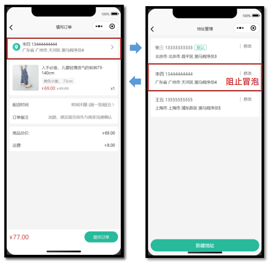
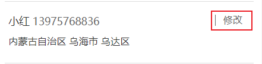
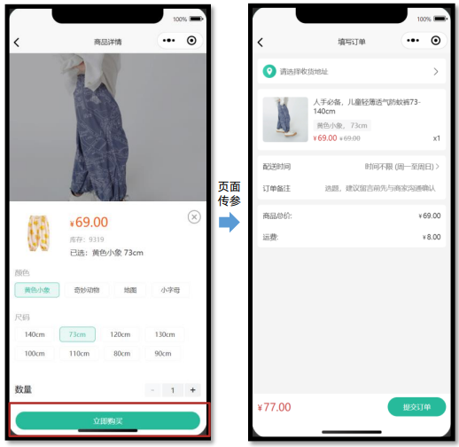
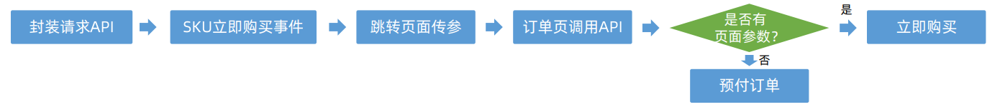
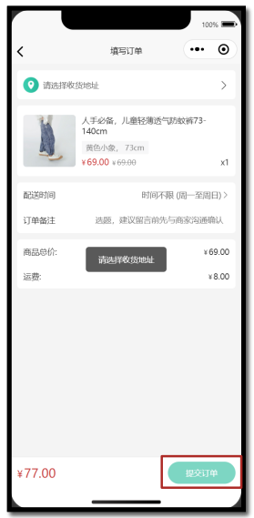

## uni-app—小兔鲜微信小程序实战

> uni-app官网：https://uniapp.dcloud.net.cn/
>
> 小兔鲜-小程序官网：https://megasu.gitee.io/uni-app-shop-note/


### 订单模块

订单模块页面较多，建议用新的分包文件夹独立管理订单模块页面：填写订单页，支付订单页，订单详情页，订单列表页。

#### 1、填写订单页—渲染基本数据

参考效果：


点击购物车的`结算`按钮，跳转到详情页。详情页中根据选中商品`生成预订单`。

##### 1.1 静态结构(分包)

`src\pageOrder\create\index.vue`

```vue
<script setup lang="ts">
import { computed, ref } from 'vue'

// 获取屏幕边界到安全区域距离
const { safeAreaInsets } = uni.getSystemInfoSync()
// 订单备注
const buyerMessage = ref('')
// 配送时间
const deliveryList = ref([
  { type: 1, text: '时间不限 (周一至周日)' },
  { type: 2, text: '工作日送 (周一至周五)' },
  { type: 3, text: '周末配送 (周六至周日)' },
])
// 当前配送时间下标
const activeIndex = ref(0)
// 当前配送时间
const activeDelivery = computed(() => deliveryList.value[activeIndex.value])
// 修改配送时间
const onChangeDelivery: UniHelper.SelectorPickerOnChange = (ev) => {
  activeIndex.value = ev.detail.value
}
</script>

<template>
  <scroll-view scroll-y class="viewport">
    <!-- 收货地址 -->
    <navigator
      v-if="false"
      class="shipment"
      hover-class="none"
      url="/pagesMember/address/address?from=order"
    >
      <view class="user"> 张三 13333333333 </view>
      <view class="address"> 广东省 广州市 天河区 黑马程序员3 </view>
      <text class="icon icon-right"></text>
    </navigator>
    <navigator
      v-else
      class="shipment"
      hover-class="none"
      url="/pagesMember/address/address?from=order"
    >
      <view class="address"> 请选择收货地址 </view>
      <text class="icon icon-right"></text>
    </navigator>

    <!-- 商品信息 -->
    <view class="goods">
      <navigator
        v-for="item in 2"
        :key="item"
        :url="`/pages/goods/goods?id=1`"
        class="item"
        hover-class="none"
      >
        <image
          class="picture"
          src="https://yanxuan-item.nosdn.127.net/c07edde1047fa1bd0b795bed136c2bb2.jpg"
        />
        <view class="meta">
          <view class="name ellipsis"> ins风小碎花泡泡袖衬110-160cm </view>
          <view class="attrs">藏青小花 130</view>
          <view class="prices">
            <view class="pay-price symbol">99.00</view>
            <view class="price symbol">99.00</view>
          </view>
          <view class="count">x5</view>
        </view>
      </navigator>
    </view>

    <!-- 配送及支付方式 -->
    <view class="related">
      <view class="item">
        <text class="text">配送时间</text>
        <picker :range="deliveryList" range-key="text" @change="onChangeDelivery">
          <view class="icon-fonts picker">{{ activeDelivery.text }}</view>
        </picker>
      </view>
      <view class="item">
        <text class="text">订单备注</text>
        <input
          class="input"
          :cursor-spacing="30"
          placeholder="选题，建议留言前先与商家沟通确认"
          v-model="buyerMessage"
        />
      </view>
    </view>

    <!-- 支付金额 -->
    <view class="settlement">
      <view class="item">
        <text class="text">商品总价: </text>
        <text class="number symbol">495.00</text>
      </view>
      <view class="item">
        <text class="text">运费: </text>
        <text class="number symbol">5.00</text>
      </view>
    </view>
  </scroll-view>
  <!-- 吸底工具栏 -->
  <view class="toolbar" :style="{ paddingBottom: safeAreaInsets?.bottom + 'px' }">
    <view class="total-pay symbol">
      <text class="number">99.00</text>
    </view>
    <view class="button" :class="{ disabled: true }"> 提交订单 </view>
  </view>
</template>

<style lang="scss">
page {
  display: flex;
  flex-direction: column;
  height: 100%;
  overflow: hidden;
  background-color: #f4f4f4;
}

.symbol::before {
  content: '¥';
  font-size: 80%;
  margin-right: 5rpx;
}

.shipment {
  margin: 20rpx;
  padding: 30rpx 30rpx 30rpx 84rpx;
  font-size: 26rpx;
  border-radius: 10rpx;
  background: url(https://pcapi-xiaotuxian-front-devtest.itheima.net/miniapp/images/locate.png)
    20rpx center / 50rpx no-repeat #fff;
  position: relative;

  .icon {
    font-size: 36rpx;
    color: #333;
    transform: translateY(-50%);
    position: absolute;
    top: 50%;
    right: 20rpx;
  }

  .user {
    color: #333;
    margin-bottom: 5rpx;
  }

  .address {
    color: #666;
  }
}

.goods {
  margin: 20rpx;
  padding: 0 20rpx;
  border-radius: 10rpx;
  background-color: #fff;

  .item {
    display: flex;
    padding: 30rpx 0;
    border-top: 1rpx solid #eee;

    &:first-child {
      border-top: none;
    }

    .picture {
      width: 170rpx;
      height: 170rpx;
      border-radius: 10rpx;
      margin-right: 20rpx;
    }

    .meta {
      flex: 1;
      display: flex;
      flex-direction: column;
      justify-content: center;
      position: relative;
    }

    .name {
      height: 80rpx;
      font-size: 26rpx;
      color: #444;
    }

    .attrs {
      line-height: 1.8;
      padding: 0 15rpx;
      margin-top: 6rpx;
      font-size: 24rpx;
      align-self: flex-start;
      border-radius: 4rpx;
      color: #888;
      background-color: #f7f7f8;
    }

    .prices {
      display: flex;
      align-items: baseline;
      margin-top: 6rpx;
      font-size: 28rpx;

      .pay-price {
        margin-right: 10rpx;
        color: #cf4444;
      }

      .price {
        font-size: 24rpx;
        color: #999;
        text-decoration: line-through;
      }
    }

    .count {
      position: absolute;
      bottom: 0;
      right: 0;
      font-size: 26rpx;
      color: #444;
    }
  }
}

.related {
  margin: 20rpx;
  padding: 0 20rpx;
  border-radius: 10rpx;
  background-color: #fff;

  .item {
    display: flex;
    justify-content: space-between;
    align-items: center;
    min-height: 80rpx;
    font-size: 26rpx;
    color: #333;
  }

  .input {
    flex: 1;
    text-align: right;
    margin: 20rpx 0;
    padding-right: 20rpx;
    font-size: 26rpx;
    color: #999;
  }

  .item .text {
    width: 125rpx;
  }

  .picker {
    color: #666;
  }

  .picker::after {
    content: '\e6c2';
  }
}

/* 结算清单 */
.settlement {
  margin: 20rpx;
  padding: 0 20rpx;
  border-radius: 10rpx;
  background-color: #fff;

  .item {
    display: flex;
    align-items: center;
    justify-content: space-between;
    height: 80rpx;
    font-size: 26rpx;
    color: #333;
  }

  .danger {
    color: #cf4444;
  }
}

/* 吸底工具栏 */
.toolbar {
  position: fixed;
  left: 0;
  right: 0;
  bottom: calc(var(--window-bottom));
  z-index: 1;

  background-color: #fff;
  height: 100rpx;
  padding: 0 20rpx;
  border-top: 1rpx solid #eaeaea;
  display: flex;
  justify-content: space-between;
  align-items: center;
  box-sizing: content-box;

  .total-pay {
    font-size: 40rpx;
    color: #cf4444;

    .decimal {
      font-size: 75%;
    }
  }

  .button {
    width: 220rpx;
    text-align: center;
    line-height: 72rpx;
    font-size: 26rpx;
    color: #fff;
    border-radius: 72rpx;
    background-color: #27ba9b;
  }

  .disabled {
    opacity: 0.6;
  }
}
</style>
```


##### 1.2  类型声明

`src/types/order.d.ts`

```ts
import type { AddressItem } from './address'

/** 获取预付订单 返回信息 */
export type OrderPreResult = {
  /** 商品集合 [ 商品信息 ] */
  goods: OrderPreGoods[]
  /** 结算信息 */
  summary: {
    /** 商品总价 */
    totalPrice: number
    /** 邮费 */
    postFee: number
    /** 应付金额 */
    totalPayPrice: number
  }
  /** 用户地址列表 [ 地址信息 ] */
  userAddresses: AddressItem[]
}

/** 商品信息 */
export type OrderPreGoods = {
  /** 属性文字，例如“颜色:瓷白色 尺寸：8寸” */
  attrsText: string
  /** 数量 */
  count: number
  /** id */
  id: string
  /** 商品名称 */
  name: string
  /** 实付单价 */
  payPrice: string
  /** 图片 */
  picture: string
  /** 原单价 */
  price: string
  /** SKUID */
  skuId: string
  /** 实付价格小计 */
  totalPayPrice: string
  /** 小计总价 */
  totalPrice: string
}
```


##### 1.3封装请求API

`services/order.ts`

```ts
import type { OrderPreResult } from '@/types/order'
import { request } from '@/utils/request'

/**
 * 填写订单-获取预付订单
 */
export const getMemberOrderPreAPI = () => {
  return request<OrderPreResult>({
    method: 'GET',
    url: '/member/order/pre',
  })
}
```


##### 1.4 初始化调用

`pagesOrder/create`

```ts
// 获取预订单数据
const orderPreData = ref<OrderPreResult>({} as OrderPreResult)
const getOrderPreData = async () => {
  const res = await getMemberOrderPreAPI()
  orderPreData.value = res.result
}
// 页面加载生命钩子
onLoad(() => {
  getOrderPreData()
})
```


##### 1.5 界面渲染

```vue
        <!-- 商品信息 -->
    <view class="goods">
      <navigator
        v-for="item in orderPreData.goods"
        :key="item.skuId"
        :url="`/pages/goods/index?id=${item.id}`"
        class="item"
        hover-class="none"
      >
        <image class="picture" :src="item.picture" />
        <view class="meta">
          <view class="name ellipsis"> {{ item.name }} </view>
          <view class="attrs">{{ item.attrsText }}</view>
          <view class="prices">
            <view class="pay-price symbol">{{ item.payPrice }}</view>
            <view class="price symbol">{{ item.price }}</view>
          </view>
          <view class="count">x{{ item.count }}</view>
        </view>
      </navigator>
    </view>
	...
	<!-- 支付金额 -->
    <view class="settlement">
      <view class="item">
        <text class="text">商品总价: </text>
        <text class="number symbol">{{ orderPreData.summary.totalPrice }}</text>
      </view>
      <view class="item">
        <text class="text">运费: </text>
        <text class="number symbol">{{ orderPreData.summary.postFee }}</text>
      </view>
    </view>
  </scroll-view>
  <!-- 吸底工具栏 -->
  <view class="toolbar" :style="{ paddingBottom: safeAreaInsets?.bottom + 'px' }">
    <view class="total-pay symbol">
      <text class="number">{{ orderPreData.summary.totalPayPrice }}</text>
    </view>
    <view class="button" :class="{ disabled: false }"> 提交订单 </view>
  </view>
```


#### 2、填写订单页—收货地址

参考效果：



单击收获地址选项可以跳转到地址管理页选择订单的地址。

实现步骤：


> 收货地址在地址管理页面中选择，为了更好管理选中收货地址，使用`pinia`创建独立 Store 维护。


##### 2.1 新建Store

`stores/modules/address.ts`

```ts
import type { AddressItem } from '@/types/address'
import { defineStore } from 'pinia'
import { ref } from 'vue'

export const useAddressStore = defineStore('address', () => {
  // state
  const selectedAddress = ref<AddressItem>()

  //action
  const changeAddress = (address: AddressItem) => {
    selectedAddress.value = address
  }
  //returns
  return {
    selectedAddress,
    changeAddress,
  }
})
```


##### 2.2 地址管理页选中地址

`pagesMember/address/index.vue`

```ts
// 选择收货地址 <= 填写订单页
const changeSelectAddress = (address: AddressItem) => {
  // 修改选中收货地址数据
  const addressStore = useAddressStore()
  addressStore.changeAddress(address)
  // 返回上一页
  uni.navigateBack()
}
```

绑定上述处理事件函数：

```vue
<view class="item-content" @tap="changeSelectAddress(item)">
	...
</view>
```


##### 2.3 解决bug



实现上述的代码逻辑后，我们在`地址管理页`单击修改将一直停在当前页，而不会跳转到`修改页`中。这是因为事件`冒泡`导致的bug，调用了父级同类型事件，执行了代码`  uni.navigateBack()`。

解决：组织冒泡。

```vue
<navigator
           class="edit"
           hover-class="none"
           :url="`/pagesMember/address-form/index?id=${item.id}`"
           @tap.stop="() => {}"
           >
    修改
</navigator>
```

`@tap.stop="() => {}"`实现了阻止事件冒泡功能。


#### 3、填写订单页—立即购买

从商品详情页的 `SKU` 组件直接点击【立即购买按钮】跳转到填写订单页，需要传递页面参数。

参考效果：



实现步骤：



##### 3.1 封装请求API

`services/order.ts`

```ts
/**
 * 填写订单-获取立即购买订单
 * @param data 查询参数
 */
export const getMemberOrderPreNowAPI = (data: {
  skuId: string
  count: string
  addressId?: string
}) => {
  return request<OrderPreResult>({
    method: 'GET',
    url: '/member/order/pre/now',
    data,
  })
}
```


##### 3.2 Sku购买事件

`pages/goods/index.vue` = > 跳转页面时传参

```ts
// 立即购买事件 => 填写订单页
const onBuyNow = (ev: SkuPopupEvent) => {
  // 从商品详情页的【立即购买事件】中收集两个必要参数，跳转填写订单页并传递页面参数。
  uni.navigateTo({ url: `/pagesOrder/create/create?skuId=${ev._id}&count=${ev.buy_num}` })
  // 关闭 SKU 组件
  isShowSku.value = false
}
```

```vue
  <!-- SKU弹窗组件 -->
  <vk-data-goods-sku-popup
    v-model="isShowSku"
    :localdata="localdata"
    @add-cart="onAddCart"
    ...
    @buy-now="onBuyNow"
  />
```


##### 3.3 根据页面参数返回对应结果

如果有页面参数，则为立即购买，否则为预付订单。

`pagesOrder/create`

```vue
<script setup lang="ts">
import { getMemberOrderPreAPI, getMemberOrderPreNowAPI } from '@/services/order'

// 页面参数
const query = defineProps<{
  skuId?: string
  count?: string
}>()

// 获取订单信息
const orderPre = ref<OrderPreResult>()
const getMemberOrderPreData = async () => {
  // 是否有立即购买参数
  if (query.count && query.skuId) {
    // 调用立即购买 API
    const res = await getMemberOrderPreNowAPI({
      count: query.count,
      skuId: query.skuId,
    })
    orderPre.value = res.result
  } else {
    // 调用预付订单 API
    const res = await getMemberOrderPreAPI()
    orderPre.value = res.result
  }
}
</script>
```


#### 4、填写订单页—提交订单

收集填写订单页的数据，点击页面底部的提交订单按钮，创建一个新的订单。

参考效果:



实现步骤：


##### 4.1 类型声明 & 封装API

类型声明

```ts
/** 提交订单 请求参数 */
export type OrderCreateParams = {
  /** 所选地址Id */
  addressId: string
  /** 配送时间类型，1为不限，2为工作日，3为双休或假日 */
  deliveryTimeType: number
  /** 订单备注 */
  buyerMessage: string
  /** 商品集合[ 商品信息 ] */
  goods: {
    /** 数量 */
    count: number
    /** skuId */
    skuId: string
  }[]
  /** 支付渠道：支付渠道，1支付宝、2微信--支付方式为在线支付时，传值，为货到付款时，不传值 */
  payChannel: 1 | 2
  /** 支付方式，1为在线支付，2为货到付款 */
  payType: 1 | 2
}

/** 提交订单 返回信息 */
export type OrderCreateResult = {
  /** 订单Id */
  id: string
}
```

接口封装

```ts
/**
 * 提交订单
 * @param data 请求参数
 */
export const postMemberOrderAPI = (data: OrderCreateParams) => {
  return request<{ id: string }>({
    method: 'POST',
    url: '/member/order',
    data,
  })
}
```


##### 4.2 调用接口跳转订单详情

```vue
<script setup lang="ts">
// 提交订单
const onOrderSubmit = async () => {
  // 没有收货地址提醒
  if (!selecteAddress.value?.id) {
    return uni.showToast({ icon: 'none', title: '请选择收货地址' })
  }
  // 发送请求
  const res = await postMemberOrderAPI({
    addressId: selecteAddress.value?.id,
    buyerMessage: buyerMessage.value,
    deliveryTimeType: activeDelivery.value.type,
    goods: orderPre.value!.goods.map((v) => ({ count: v.count, skuId: v.skuId })),
    payChannel: 2,
    payType: 1,
  })
  // 关闭当前页面，跳转到订单详情，传递订单id
  uni.redirectTo({ url: `/pagesOrder/detail/detail?id=${res.result.id}` })
}
</script>

<template>
  <view class="button" :class="{ disabled: !selecteAddress?.id }" @tap="onOrderSubmit">
    提交订单
  </view>
</template>
```

