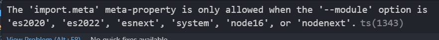

## 在Xtx-Shop中开发时遇到的问题

#### 1、关于vite环境下使用`import.meta`



解决：

```json
// tsconfig.json
{
    "compilerOptions": {
+        "module": "ESNext",
+        "moduleResolution": "Node",
    }
}
```


#### 2、TS声明的类型变量在接收后端返回的数据为什么超出范围不报错

原因在于 TypeScript 是一种静态类型检查工具，而 Vue 的模板和 JavaScript 中的对象是动态的。

在 TypeScript 中定义的类型只在编译时起作用，而在运行时，JavaScript 对象的结构可以自由地添加额外的属性而不会触发类型检查错误。

当您在 Vue 组件中接收后端返回数据并将其赋值给 `goodsDetail` 变量时，Vue 和 TypeScript 并不会强制限制数据结构要完全匹配 `GoodsResult` 中定义的类型。这种动态性和灵活性使得在实际开发中更容易处理各种情况，但也需要开发者自行确保数据的正确性和一致性。


#### 3、VScode编码问题

**在 VS Code 中写代码时，有时候可能会遇到代码修改后没有实时生效，需要重启 VS Code 才能看到想要的效果的情况**。这可能是由于一些缓存、插件或设置问题导致的。以下是一些可能的原因和解决方法：

1. **缓存问题**：有时候 VS Code 会缓存一些文件或数据，导致修改后并没有立即生效。你可以尝试在 VS Code 中清除缓存，方法是按下 `Ctrl + Shift + P` 打开命令面板，然后输入 `Reload Window` 或 `Developer: Reload Window`，重启 VS Code 窗口。
2. **插件问题**：某些插件可能会导致 VS Code 的表现异常，包括代码修改不能立即生效的情况。可以尝试禁用一些插件，特别是与编辑器自动刷新、代码高亮等相关的插件，看看是否有改善。
3. **文件监视器问题**：VS Code 使用文件监视器来监视文件的变化并实时更新编辑器。有时监视器可能会出现问题，导致代码修改后不能及时生效。你可以尝试在 VS Code 设置中搜索 `Files: Auto Save` 并将其设置为 `afterDelay` 或 `onWindowChange`，看看是否有改善。
4. **TypeScript 缓存问题**：如果你在 Vue 项目中使用了 TypeScript，并且修改了类型声明文件，有时候 TypeScript 的缓存可能会导致类型定义不会立即生效。你可以尝试在 TypeScript 编译选项中添加 `--noEmit`，这将禁用 TypeScript 的缓存功能。
5. **检查文件保存设置**：确保你在修改代码后及时保存文件。VS Code 默认会自动保存文件，但如果设置为手动保存，可能会导致修改不能立即生效。

通过以上方法，你应该可以尝试解决 VS Code 中代码修改不立即生效的问题。如果问题仍然存在，可以尝试更新 VS Code 到最新版本，或者查看 VS Code 的官方文档或社区论坛以获取进一步帮助。


#### 4、禁用TS缓存

要在 TypeScript 中禁用缓存，可以通过以下几种方式实现：

1. **使用 TypeScript 编译选项**：在 TypeScript 的编译选项中添加 `--noEmit` 选项可以禁用 TypeScript 的缓存。`--noEmit` 选项告诉 TypeScript 编译器只进行类型检查，而不生成任何输出文件。你可以在 TypeScript 项目的 tsconfig.json 文件中添加 `"noEmit": true` 来实现禁用缓存。

```json
{  
    "compilerOptions":
    { 
        "noEmit": true  
    } 
} 
```

1. **使用 tsc 命令**：在命令行中使用 tsc 命令编译 TypeScript 文件时，可以添加 `--noEmit` 选项来禁用缓存。例如：

```bash
tsc --noEmit yourFile.ts 
```

2. **使用 vscode-typescript 插件**：如果你在 VS Code 中使用 TypeScript，可以安装 vscode-typescript 插件，这个插件提供了一些设置选项用来控制 TypeScript 的行为。在 VS Code 设置中搜索 `typescript.tsserver.useSeparateSyntaxServer`，将其设置为 `true` 可以尝试禁用缓存。

以上是几种常见的方法来禁用 TypeScript 缓存。如果你仍然遇到缓存问题，可以尝试结合这些方法进行操作，看看能否解决你的问题。


#### 5、uniapp使用uni-swipe-action后右侧多了小于1px的间隙

问题：[uniapp](https://so.csdn.net/so/search?q=uniapp&spm=1001.2101.3001.7020)使用uni-swipe-action后右侧多了小于1px的间隙。且在真机上没有问题，但是在微信开发者工具中有问题。

代码如下：在滑动[滑块](https://so.csdn.net/so/search?q=滑块&spm=1001.2101.3001.7020)或者点击这个区域时，就会出现问题。


怀疑是，父级容器cart-box和子级uni-swipe-action宽度没有完全相等导致。

解决：给子容器加上`padding-right:1rpx;`


#### 6、ts中枚举类型为什么不能放在类型声明文件(*.d.ts)中

在 TypeScript 中，枚举类型在被声明后会被编译成一个对象，该对象在运行时会存在。

但是，在类型声明文件（.d.ts 文件）中声明的内容只会在编译时被用于类型检查，而不会在编译后产生实际的 JavaScript 代码。

因此，虽然你在类型声明文件中导出了枚举类型，但在其他组件中导入并使用时，枚举对象并不会在运行时被实际定义，导致枚举为 undefined 的报错。

要解决这个问题，你可以考虑以下两种方法：

##### 将枚举类型写在单独的ts文件中

将枚举类型的定义直接写在 TypeScript 文件中而不是单独写在类型声明文件中。这样在编译后会生成相应的 JavaScript 代码，从而保证枚举对象在运行时存在。

```ts
// enums.ts
export enum Colors {
  Red = 'RED',
  Blue = 'BLUE',
  Green = 'GREEN'
}

// component.ts
import { Colors } from './enums';

console.log(Colors.Red); // 输出: RED
```


######  ambient 声明进行全局声明

当需要将枚举类型定义放在类型声明文件（.d.ts 文件）中时，可以使用 ambient 声明来进行全局声明，以确保在其他组件中也能访问到枚举对象。这样可以解决枚举类型在组件中被认定为 undefined 的问题。

具体步骤如下：

1. 创建一个新的类型声明文件，比如 `enums.d.ts`。在该文件中使用 `declare enum` 来声明你的枚举类型。

```ts
// enums.d.ts 
declare enum Colors 
{  
    Red = 'RED',
    Blue = 'BLUE',  
    Green = 'GREEN' 
} 
```

2. 为了让其他组件能够访问到这个枚举对象，在声明文件中使用 `declare namespace` 来指定全局的命名空间，并将枚举对象添加到这个命名空间下。

```ts
// enums.d.ts 
declare namespace MyEnums 
{  
    export { Colors }; 
} 
```

3. 在其他组件中导入这个全局声明的命名空间，然后就可以使用该枚举对象了。示例：

```ts
// component.ts 
/// <reference path="enums.d.ts" />
console.log(MyEnums.Colors.Red);  // 输出Red
```

通过这种方法，你可以在类型声明文件中定义枚举类型，并使用 ambient 声明使其成为全局可访问的对象，以便在其他组件中正确引用和使用枚举对象。希望这样能够帮助到你。如果有任何疑问，请随时告诉我。