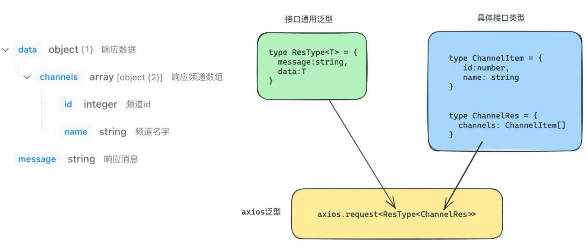
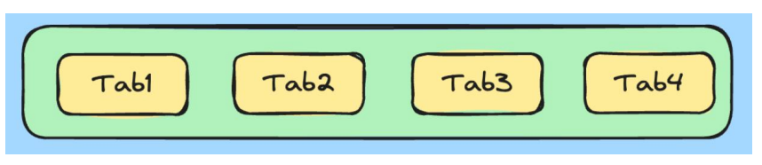

## React与TypeScript

### 基于Vite插件开发环境

Vite是一个`框架无关的前端工具链`，可以快速的生成一个 React + TS 的开发环境，并且可以提供快速的开发体验。

搭建环境：

```bash
npm create vite@latest react-ts-pro -- --template react-ts
```

说明：

1. npm create vite@latest 固定写法 （使用最新版本vite初始化项目)。
2. react-ts-pro 项目名称 （可以自定义）。
3. -- --template react-ts 指定项目模板为react-ts。


### useState与TypeScript

#### 1、自动推导

通常React会根据传入`useState的默认值`来自动推导类型,不需要显式标注类型。

```js
const [value,toggle] = useState(false)
```

说明：

1. value：类型为boolean
2. toggle：参数类型为boolean


#### 2、传递泛型参数

useState本身是一个`泛型函数`，可以传入具体的自定义类型。

```tsx
type User = {
    name:string,
    age:number
}

const [user,setUser] = useState<User>()
```

说明：

1. 限制useState函数参数的初始值必须满足类型为 ： User | ()=> User。
2. 限制setUser函数的参数必须满足类型为：User | ()=> User | undefined。
3. user状态数据具备User类型相关的类型提示。

 


#### 初始值为null

当我们不知道状态的初始值是什么，将useState的`初始值为null`是一个常见的做法，可以通过`具体类型联合null`来做显式注解。

```tsx
type User = {
    name:string
    age:number
}

const [user,setUser] = useState<User | null>(null)
```

说明： 

1. 限制useState函数参数的初始值可以是 User | null 。

2. 限制setUser函数的参数类型可以是 User | null。


### Props与TypeScript

#### 1、基础使用

为组件props添加类型，本质是给`函数的参数做类型注解`，可以使用`type对象类型或者interface接口`来做注解。

```tsx
type Props = {
    className:string
}

function Button(props:Props){
    const { className } = props
    return <button className={className}>click me</button>
}
```

说明：Button组件只能传入名称为className的prop参数，且类型为string，必填。


#### 2、为Props的children属性添加类型

children是一个比较特殊的prop, 支持多种不同类型数据的传入，需要通过一个`内置的ReactNode类型`来做注解。

```tsx
type Props = {
    className:string
    children:React.ReactNode
}

function Button(props:Props){
    const { className,children } = props
    return <button className={className}>{children}</button>
}
```

说明：注解之后，children可以是多种类型，包括：React.ReactElement 、string、number、 React.ReactFragment 、React.ReactPortal 、boolean、 null 、undefined等。


#### 3、为事件prop添加类型

组件经常执行类型为函数的prop实现子传父，这类prop重点在于函数参数类型的注解。

```tsx
type Props = {
	onGetMsg?:(msg:string) => void
}

function Son(props:Props) {
    const { onGetMsg } = props
    const clickHandler = ()=>{
        onGetMsg?.('this is msg')
    }
    
    return <button onClick={ clickHandler} >sendMsg</button>
}

function App (){
	const getMsgHandler = (msg:string) =>{
        console.log(msg)
    }
    
    return (
    	<>
              {/* 内联绑定 */}
              <Son onGetMsg={(msg) => console.log(msg)} />
              {/* 单独抽离注解匹配 */}
              <Son onGetMsg={getMsgHandler} />
        </>
    )
}
```

说明： 

1. 在组件内部调用时需要遵守类型的约束，参数传递需要满足要求 。
2. 绑定prop时如果绑定内联函数直接可以推断出参数类型，否则需要单独注解匹配的参数类型。


### useRef与TypeScript

#### 1、获取dom

获取dom的场景，可以直接把要获取的`dom元素的类型当成泛型参数传递给useRef`,可以推导出`.current属性的类型`。

```tsx
function App(){
    const domRef = useRef<HTMLInputElement>(null)
    
    useEffect(()=>{
        domRef.current?.focus()
    },[])
    
    return (
		<>
        	<input ref={domRef} />
        </>
    )
}
```


#### 2、引用稳定的存储器

把useRef当成引用稳定的存储器使用的场景可以通过`泛型传入联合类型`来做，比如定时器的场景：

```tsx
function App(){
    const timerRef = useRef<number | undefined>(undefined)
    
    useEffect(()=>{
        timerRef.current = setInterval(()=>{
            console.log('1')
        },1000)
        
        return ()=>clearInterval(timerRef.current)
    },[])
    
    return <div> this is div <div/>
}
```


### 事件与TypeScript

#### 1、为事件回调添加类型

```tsx
function App(){
	const changeHandler:React.ChangeEventHandler<HTMLInputElement> = (e)=>{
        console.log(e.target.value)
    }
    
    const clickHandler:React.MouseEventHandler<HTMLButtonElement> = (e)=>{
        console.log(e.target)
    }
    
    return (
    	<>
        	<input type="text" onChange={changeHandler} />
        	<button onClick={clickHandler}>click me!</button>
        </>
	)
}
```

说明：通过泛型函数约束了`整个事件回调函数的类型`，主要是为了约束事件参数e的类型。

  


### 极客网Mobile案例

#### 1、环境搭建

##### 1.1 基于vite搭建环境

```bash
npm create vite@latest react-jike-mobile -- --template react-ts
```


##### 1.2 安装 Ant Design Mobile

Ant Design Mobile 是 Ant Design 家族里专门针对于移动端的组件库。

> 文档：https://mobile.ant.design/zh/guide/quick-start/


#### 2、初始化路由

React的路由初始化，我们采用` react-router-dom `进行。

```bash
npm i react-router-dom
```


##### 2.1 分析


同级路由，两个一级路由。


##### 2.2 目录结构


##### 2.3 封装路由配置

```tsx
import { createBrowserRouter } from 'react-router-dom'
import Home from '../pages/Home'
import Detail from '../pages/Detail'

const router = createBrowserRouter([
    {
        path: '/',
        element: <Home />
    },
    {
        path: '/detail',
        element: <Detail />
    }
])

export default router
```

`main.tsx`

```tsx
import ReactDOM from 'react-dom/client'

// 导入provider 
import { RouterProvider } from 'react-router-dom'
// 导入router实例
import router from './router'

ReactDOM.createRoot(document.getElementById('root')).render(
  <RouterProvider router={router} />
)
```


#### 3、配置别名

场景：项目中各个模块之间的互相导入导出，可以通过@别名路径做路径简化，经过配置@相当于src目录，比如：


步骤： 

1. 让Vite做路径解析（真实的路径转换） 
2. 让VSCode做智能路径提示（开发者体验）


##### 3.1 修改vite配置

```js
import { defineConfig } from 'vite'
import react from '@vitejs/plugin-react'
import path from 'path'

// https://vitejs.dev/config/
export default defineConfig({
  plugins: [react()],
  resolve:{
    alias:{
      '@':path.resolve(__dirname,'./src'),
    }
  }
})
```


##### 3.2 安装node类型包

```bash
npm i @types/node -D
```


##### 3.3 修改tsconfig.json文件

```json
{
  "baseUrl": ".",
  "paths": {
    "@/*": [
      "src/*"
    ]
  },
}
```


#### 4、axios安装配置

##### 4.1 安装 axios

1. 安装axios到项目中
2. 在utils中封装request模块，主要包括了接口基地址、超时时间、拦截器
3. 在utils中做统一导出

```bash
npm i axios
```


##### 4.2 简易封装

```ts
import axios from 'axios'

const request = axios.create({
    baseURL: 'http://geek.itheima.net/v1_0',
    timeout: 5000,
})

// 请求拦截器
request.interceptors.request.use(
    (config) => {
        return config
    },
    (error) => {
        return Promise.reject(error)
    }
)

// 响应拦截器
request.interceptors.response.use(
    (response) => {
        return response
    },
    (error) => {
        return Promise.reject(error)
    }
)

export default request
```

`utils/index.tsx`

```ts
import request from './request'

export { request }
```


#### 5、封装API模块

##### 5.1 axios和ts的配合使用

场景：axios提供了request泛型方法，方便我们`传入类型参数推导出接口返回值的类型`。

```js
axios.request<Type>(requestConfig).then(res=>{
    // res.data 的类型为Type
    console.log(res.data)
})
```

说明：泛型参数 Type 的类型决定了 res.data 的类型。

步骤：

1. 根据接口文档创建一个通用的泛型接口类型(多个接口返回值的结构是相似的)。
2. 根据接口文档创建特有的接口数据类型（每个接口都有自己特殊的数据格式）
3. 组合1和组合2的类型，得到最终传给request泛型的参数类型


##### 5.2 流程图




##### 5.3 接口封装

```ts
import { request } from '@/utils'
import type { ResType } from './shared'


// 2.定义具体接口类型
type ChannelItem = {
    id: number
    name: string
}

type ChannelRes = {
    channels: ChannelItem[]
}


// 请求频道列表

export function fetchChannelAPI() {
    return request<ResType<ChannelRes>>({
        url: '/channels'
    })
}
```

所有api接口使用的公共类型：`shared.ts`

```ts
// 1.定义泛型
export type ResType<T> = {
    message: string
    data: T
}
```


#### 6、Home模块

##### 6.1 整体嵌套设计


##### 6.2 Tabs区域实现



实现步骤： 

1. 使用 ant-mobile 组件库中的 Tabs 组件进行页面结构创建 
2. 使用真实接口数据进行渲染 
3. 有优化的点进行优化处理

###### 准备结构

```tsx
import { Tabs } from 'antd-mobile'
import './style.css'

const Home = () => {
  return (
    <div className="tabContainer">
       <Tabs defaultActiveKey="0">
          <Tabs.Tab title='abc' key='0'>
            <div className="listContainer">
               {/* HomeList列表 */}
            </div>
          </Tabs.Tab>
      </Tabs>
      {/*
        <Tabs>
         <Tabs.Tab title='水果' key='fruits'>
            菠萝
          </Tabs.Tab>
          <Tabs.Tab title='蔬菜' key='vegetables'>
            西红柿
          </Tabs.Tab>
          <Tabs.Tab title='动物' key='animals'>
            蚂蚁
          </Tabs.Tab>
        </Tabs>
       */
      }
    </div>
  )
}

export default Home
```

```css
.tabContainer {
  position: fixed;
  height: 50px;
  top: 0;
  width: 100%;
}

.listContainer {
  position: fixed;
  top: 50px;
  bottom: 0px;
  width: 100%;
}
```

###### 真实接口数据进行渲染 

```tsx
const Home = () => {
    const [channels, setChannels] = useState<ChannelItem[]>([])
    useEffect(() => {
        const getChannels = async () => {
            try {
                const res = await fetchChannelAPI()
                setChannels(res.data.data.channels)
            } catch (error) {
                throw new Error('fetch channel error!')
            }
        }
        getChannels()
    }, [])
    return <div>
        <div className="tabContainer">
            {/* tab区域 */}
            <Tabs>
                {channels.map(item => 
                    <Tabs.Tab title={item.name} key={item.id}></Tabs.Tab>)
                }
            </Tabs>
        </div>
    </div>
}
```


##### 6.3 自定义hook函数优化（可选）

场景：当前状态数据的各种操作逻辑和组件渲染是写在一起的，可以采用`自定义hook封装的方式让逻辑和渲染相分离`。

实现步骤：

1. 把和Tabs相关的响应式数据状态以及操作数据的方法放到hook函数中
2. 组件中调用hook函数，消费其返回的状态和方法


```ts
import { useState, useEffect } from 'react'
import type { ChannelItem } from '@/api/list'
import { fetchChannelAPI } from '@/api/list'

function useTabs() {
    const [channels, setChannels] = useState<ChannelItem[]>([])
    useEffect(() => {
        const getChannels = async () => {
            try {
                const res = await fetchChannelAPI()
                setChannels(res.data.data.channels)
            } catch (error) {
                throw new Error('fetch channel error!')
            }
        }
        getChannels()
    }, [])

    return {
        channels
    }
}

export {useTabs}
```

`Home/index.tsx`

```tsx
import './style.css'
import { Tabs } from 'antd-mobile'
import { useTabs } from './useTabs'

const Home = () => {
    const { channels } = useTabs()
    return <div>
        <div className="tabContainer">
            {/* tab区域 */}
            <Tabs>
                {channels.map(item => <Tabs.Tab title={item.name} key={item.id}>
                    {/* list组件 */}
                </Tabs.Tab>)}
            </Tabs>
        </div>
    </div>
}

export default Home
```


##### 6.4 List组件实现

实现步骤： 

1. 搭建基础结构，并获取基础数据 
2. 为组件设计 channelId 参数，点击tab时传入不同的参数 
3. 实现上拉加载功能


###### 准备结构

```tsx
import { Image, List } from 'antd-mobile'
// mock数据
import { users } from './users'

const HomeList = () => {
    return (
        <>
            <List>
                {users.map((item) => (
                    <List.Item
                        key={item.id}
                        prefix={
                            <Image
                                src={item.avatar}
                                style={{ borderRadius: 20 }}
                                fit="cover"
                                width={40}
                                height={40}
                            />
                        }
                        description={item.description}
                    >
                        {item.name}
                    </List.Item>
                ))}
            </List>
        </>
    )
}

export default HomeList
```

```ts
// users.ts
export const users = [
    {
        id: '1',
        avatar:
            'https://images.unsplash.com/photo-1548532928-b34e3be62fc6?ixlib=rb-1.2.1&q=80&fm=jpg&crop=faces&fit=crop&h=200&w=200&ixid=eyJhcHBfaWQiOjE3Nzg0fQ',
        name: 'Novalee Spicer',
        description: 'Deserunt dolor ea eaque eos',
    },
    {
        id: '2',
        avatar:
            'https://images.unsplash.com/photo-1493666438817-866a91353ca9?ixlib=rb-0.3.5&q=80&fm=jpg&crop=faces&fit=crop&h=200&w=200&s=b616b2c5b373a80ffc9636ba24f7a4a9',
        name: 'Sara Koivisto',
        description: 'Animi eius expedita, explicabo',
    },
    {
        id: '3',
        avatar:
            'https://images.unsplash.com/photo-1542624937-8d1e9f53c1b9?ixlib=rb-1.2.1&q=80&fm=jpg&crop=faces&fit=crop&h=200&w=200&ixid=eyJhcHBfaWQiOjE3Nzg0fQ',
        name: 'Marco Gregg',
        description: 'Ab animi cumque eveniet ex harum nam odio omnis',
    },
    {
        id: '4',
        avatar:
            'https://images.unsplash.com/photo-1546967191-fdfb13ed6b1e?ixlib=rb-1.2.1&q=80&fm=jpg&crop=faces&fit=crop&h=200&w=200&ixid=eyJhcHBfaWQiOjE3Nzg0fQ',
        name: 'Edith Koenig',
        description: 'Commodi earum exercitationem id numquam vitae',
    },
]
```

###### 封装接口

```ts
// 请求文章列表
type ListItem = {
    art_id:string,
    title:string,
    aut_id:string,
    pubdate:string,
    aut_name:string,
    is_top:number,
    cover:{
        type:number,
        images:string[]
    }
}

type ListRes = {
    results:ListItem[]
    pre_timestamp:string
}

export function fetchListAPI(){
    return request<ListRes>({
        url:'/articles'
    })
}
```

###### 获取基础数据 & 渲染列表

```tsx
// component/list.tsx
import { Image, List } from 'antd-mobile'
// mock数据
import { useState, useEffect } from 'react'
import { fetchListAPI, ListRes } from '@/api/list'

type Props = {
    channelId: string
}

const HomeList = (props: Props) => {
    const { channelId } = props
    const [listRes, setListRes] = useState<ListRes>({
        results: [],
        pre_timestamp: '' + new Date().getTime(),
    })
    // 初始数据获取
    useEffect(() => {
        async function getList() {
            try {
                const res = await fetchListAPI({
                    channel_id: channelId,
                    timestamp: '' + new Date().getTime(),
                })
                setListRes({
                    results: res.data.data.results,
                    pre_timestamp: res.data.data.pre_timestamp
                })
            } catch (error) {
                throw new Error('fetch list error')
            }
        }
        getList()
    }, [])

    return (
        <>
            <List>
                {listRes.results.map((item) => (
                    <List.Item
                        key={item.art_id}
                        prefix={
                            <Image
                                src={item.cover.images?.[0]}
                                style={{ borderRadius: 20 }}
                                fit="cover"
                                width={40}
                                height={40}
                            />
                        }
                        description={item.pubdate}
                    >
                        {item.title}
                    </List.Item>
                ))}
            </List>
        </>
    )
}

export default HomeList
```

###### List列表无限滚动实现

交互要求：List列表在滑动到底部时，自动加载下一页列表数据 。

实现思路： 

1. 滑动到底部触发加载下一页动作 。

   `<InfiniteScroll/>`

2. 加载下一页数据 。

   `pre_timestamp 接口参数`

3. 把老数据和新数据做拼接处理。

   `[...oldList, ... newList]` 

4. 停止监听边界值 。

   `hasMore`

```tsx
// 开关标记是否还有新数据
const [hasMore, setHasMore] = useState(true)

// 加载
const loadMore = async () => {
    // 编写加载下一页的逻辑
    try {
        const res = await fetchListAPI({
            channel_id: channelId,
            timestamp: listRes.pre_timestamp
        })
        // 拼接新数据 + 存取下一次请求的时间戳
        setListRes({
            results: [...listRes.results,...res.data.data.results],
            pre_timestamp: res.data.data.pre_timestamp
        })
        // 停止监听
        if(res.data.data.results.length === 0){
            setHasMore(false)
        }
    } catch (error) {
        throw new Error('fetch list error')
    }
}


return (
    <>
    <List>
        ...
    </List>
    <InfiniteScroll loadMore={loadMore} hasMore={hasMore} />
    </>
)

```


#### 7、详情模块

##### 7.1 路由跳转&数据渲染

需求：点击列表中的某一项跳转到详情路由并显示当前文章。

1. 通过路由跳转方法进行跳转，并传递参数 。
2. `在详情路由下获取参数，并请求数据` 。
3. 渲染数据到页面中。


```ts
import { request } from "@/utils";
import  type { ResType } from './shared'


/**
 * 响应数据
 */
export type DetailData = {
    /**
     * 文章id
     */
    art_id: string;
    /**
     * 文章-是否被点赞，-1无态度, 0未点赞, 1点赞, 是当前登录用户对此文章的态度
     */
    attitude: number;
    /**
     * 文章作者id
     */
    aut_id: string;
    /**
     * 文章作者名
     */
    aut_name: string;
    /**
     * 文章作者头像，无头像, 默认为null
     */
    aut_photo: string;
    /**
     * 文章_评论总数
     */
    comm_count: number;
    /**
     * 文章内容
     */
    content: string;
    /**
     * 文章-是否被收藏，true(已收藏)false(未收藏)是登录的用户对此文章的收藏状态
     */
    is_collected: boolean;
    /**
     * 文章作者-是否被关注，true(关注)false(未关注), 说的是当前登录用户对这个文章作者的关注状态
     */
    is_followed: boolean;
    /**
     * 文章_点赞总数
     */
    like_count: number;
    /**
     * 文章发布时间
     */
    pubdate: string;
    /**
     * 文章_阅读总数
     */
    read_count: number;
    /**
     * 文章标题
     */
    title: string;
}

export function fetchDetailAPI(article_id:string){
    return request<ResType<DetailData>>(`/articles/${article_id}`)
}
```

```tsx
import { NavBar } from 'antd-mobile'
import { useEffect, useState } from 'react'
import { DetailData, fetchDetailAPI } from '@/api/detail'
import { useNavigate, useSearchParams } from 'react-router-dom'
const Detail = () => {
    const [detail, setDetail] = useState<DetailData | null>(null)

    // 获取url地址栏中的id
    const [params] = useSearchParams()
    const id = params.get('id')

    // 通过id发送请求获取文章详情数据
    useEffect(() => {
        async function getDetail() {
            try {
                const res = await fetchDetailAPI(id!)
                setDetail(res.data.data)
            } catch (error) {
                throw new Error('fetch detail error')
            }
        }
        if (id) {
            getDetail()
        }
    }, [id])

    // 回退功能
    const navigate = useNavigate()
    const back = () => navigate(-1)

    // 如果detail为空，则返回下面的JSX
    if (!detail) {
        return <div>this is loading</div>
    }
    return (
        <div>
            <NavBar onBack={back}>{detail.title}</NavBar>
            <div dangerouslySetInnerHTML={{ __html: detail.content }}></div>
        </div>
    )
}

export default Detail
```


