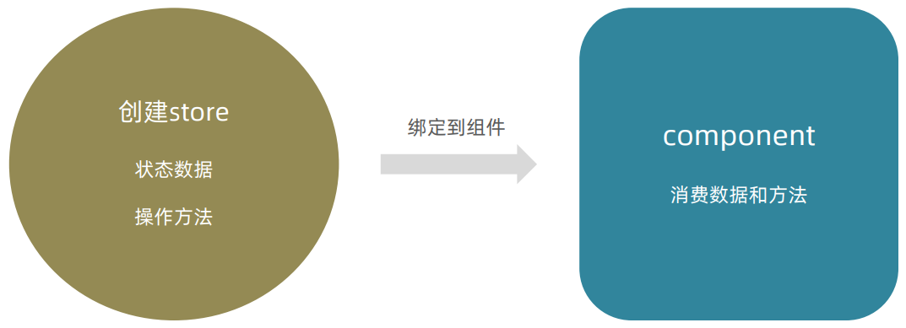

## ,React-拓展

### Hook—性能优化相关API

#### 1、useReducer

作用：和useState的作用类似，用来管理`相对复杂`的状态数据。

##### 1.1 基础用法

1. 定义一个reducer函数（根据不同的action返回不同的新状态）
2. 在组件中调用useReducer，并传入reducer函数和状态的初始值
3. 事件发生时，通过dispatch函数分派一个action对象（通知reducer要返回哪个新状态并渲染UI）

```jsx
// useReducer
import { useReducer } from 'react'

// 1.定义reducer函数 根据不同的action 返回不同状态
function reducer(state, action) {
    switch (action.type) {
        case 'INC':
            return state + 1
        case 'DEC':
            return state - 1
        case 'SET':
            return action.playload
        default:
            return state
    }
}

// 2.组件中调用 useReducer(reducer,0) => [state,dispatch]
// 3.调用dispatch({type：'INC'}) => 通知reducer产生一个新的状态

function App() {
    const [state, dispatch] = useReducer(reducer, 0)

    return (
        <div>
            this is App
            {state}
            <button onClick={() => dispatch({ type: 'INC' })}>+</button>
            <button onClick={() => dispatch({ type: 'DEC' })}>-</button>
        </div>
    )
}

export default App
```


##### 1.2 分派action时传参


```jsx
<button onClick={() => dispatch({ type: 'SET', playload: 100 })}>update</button>
```


##### 1.3 小结


#### 2、useMemo

作用：在组件每次重新渲染的时候`缓存计算的结果`。

看个案例：


在组件Component中，有两个状态`count1`和`count2`。现在的情况是count1状态变化，组件就会执行fn求斐波那契数列之和。问题来了，当组件中的count2发生变化时，fn也会重新执行。

**不管哪个状态数据发生变化，组件函数都会重新执行以达到重新渲染的目的**。位于组件内部的fn函数，也会跟着重新执行。fn函数只跟count1有关联，跟count2没有关联。像上图中count2发生变化引起的fn函数执行情况显然是不合理的，存在浪费的。

> 解决：我们可以通过Hook函数useMemo保证只有count1发生变化时执行fn，达到缓存结果目的。


##### 2.1 基础语法

```jsx
useMemo(()=>{
    // 根据count1返回计算结果
},[count1])
```

说明：使用useMemo做缓存之后可以保证只有count1依赖项发生变化时才会重新计算。


#### 3、React.memo

作用：允许组件在`Props没有改变`的情况下跳过渲染。

> React组件默认的渲染机制：只要父组件重新渲染子组件就会重新渲染。


由此，可以推出如果Son组件本身并不需要做渲染更新，是不是存在一定程度上的资源浪费？

> 通过React.memo 可以轻松解决这个问题。


##### 3.1 基础语法

```jsx
const MemoComponent = memo(function SomeComponent(props){
	// ...
})
```

说明：经过memo函数包裹生成的缓存组件只有在props发生变化的时候才会重新渲染。


##### 3.2 props的比较机制

机制: 在使用memo缓存组件之后，React会对`每一个 prop `使用` Object.is` 比较新值和老值，返回true，表示没有变化。

1. props为简单数据类型时：

```js
Object.is(3,3)  // => true	无变化
```

2. props为引用类型时(对象/数组)

```js
Object.is([],[]) // => false 有变化，React只关心引用是否变化
```


#### 4、useCallBack

作用：在组件多次重新渲染的时候`缓存函数`。


##### 4.1 基础语法

```jsx
const Input = memo(function Input({ onChange }) {
    console.log('子组件重新渲染了')
    return <input type="text" onChange={(e) => onChange(e.target.value)} />
})


function App() {
    // 传递给子组件的函数
    const changeHandler = useCallback((value) => console.log(value),[])
    // 触发父组件重新渲染函数
    const [count, setCount] = useState(0)
    return (
        <div className="App">
            {/* 把函数作为prop传给子组件 */}
            <Input onChange={changeHandler} />
            <button onClick={() => setCount(count + 1)}>+{count}</button>
        </div>
    )
}
```


### 组件通信相关函数

#### 1、React.forwardRef

##### 1.1 场景使用说明

使用ref暴露子组件中的DOM节点给父组件


##### 1.2 语法实现

```jsx
// 子组件
const Input = forwardRef((props,ref)=>{
    return <input type="text" ref={ref} />
})

// 父组件
function App(){
    const inputRef = useRef(null)
    return (
    	<>
        	<Input ref={inputRef} />
        </>
    )
}
```


#### 2、React.useInperativeHandle

通过ref暴露子组件中的方法。

##### 2.1 场景说明


##### 2.2 语法实现

```jsx
// 子组件
const Input = forwardRef((props, ref) => {
    // 实现聚焦逻辑
    const inputRef = useRef(null)
    const focusHandler = ()=>{
        inputRef.current.focus()
    }

    // 把聚焦函数暴露出去
    useImperativeHandle(ref,()=>{
        return {
            // 暴露方法
            focusHandler
        }
    })
    return <input type="text" ref={inputRef} />
})

// 父组件
function App() {
    const sonRef = useRef(null)
    const showRef = () => {
        console.log(sonRef)
        sonRef.current.focusHandler()
    }
    return (
        <>
            <Input ref={sonRef} />
            <button onClick={showRef}>focus</button>
        </>
    )
}
```


### Class API—编写类组件

#### 1、类组件基础结构

类组件就是通过`JS中的类来组织组件的代码`。

```jsx
class Counter extends Component {
    // 定义状态变量
    state = {
        count:0
    }
	// 事件回调
	clickHandler = ()=>{
        this.setState({
            count:this.state.count + 1
        })
    }
    
    // 渲染函数 UI模板(JSX)
    render(){
        return <button onClick={this.clickHandler}>{this.state.count}</button>
    }
}
```

创建类组件步骤：

1. 通过类属性state定义状态数据。
2. 通过setState方法来修改状态数据。
3. 通过render来写UI模版（JSX语法一致）。


#### 2、类组件的生命周期函数

概念：组件从创建到销毁的`各个阶段自动执行的函数`就是生命周期函数。


1. componentDidMount：组件挂载完毕自动执行 - 异步数据获取。
2. componentWillUnmount: 组件卸载时自动执行 - 清理副作。


#### 3、类组件的组件通信

概念：类组件和Hooks编写的组件在组件通信的思想上完全一致。

1. 父传子：通过prop绑定数据 。
2. 子传父：通过prop绑定父组件中的函数，子组件调用。
3. 兄弟通信：状态提升，通过父组件做桥接。


### zustand—极简的状态管理工具

#### 1、快速上手



> 注意：在使用zustand时，和redux进行对比学习，并复习redux内容 => 效率更佳。、