## React—极客园

### 简介

#### 1、项目来源

本项目是极客园PC端管理后台项目。

> 注：本项目素材来自于黑马程序员。

项目接口地址：

> https://apifox.com/apidoc/shared-fa9274ac-362e-4905-806b-6135df6aa90e


#### 2、项目演示

##### 2.1 登录

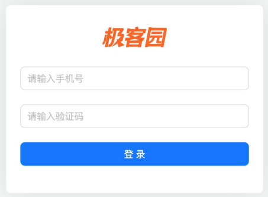


##### 2.2 管理页

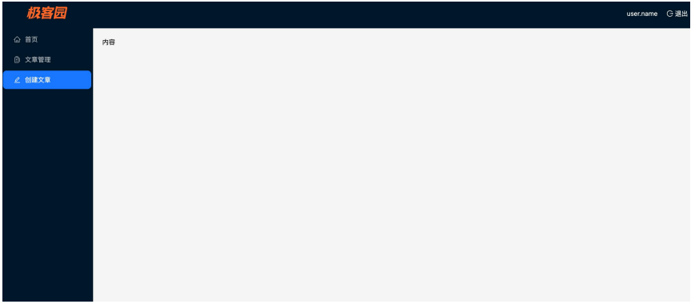


##### 2.3 文章列表

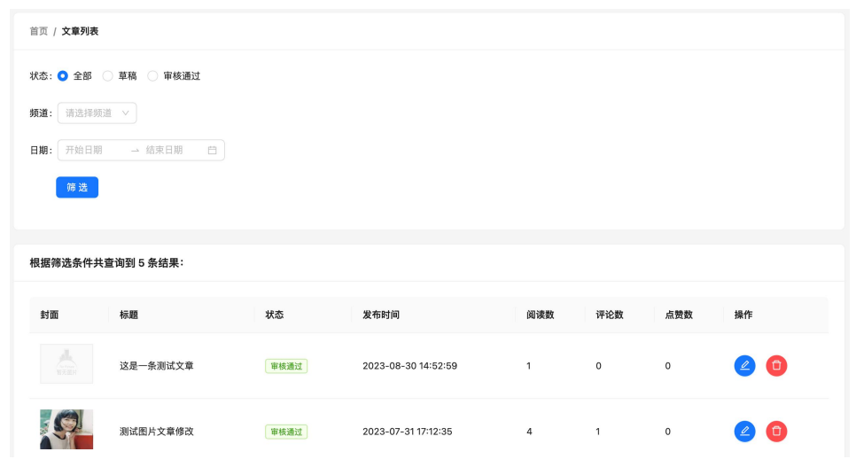


##### 2.4 文章发布

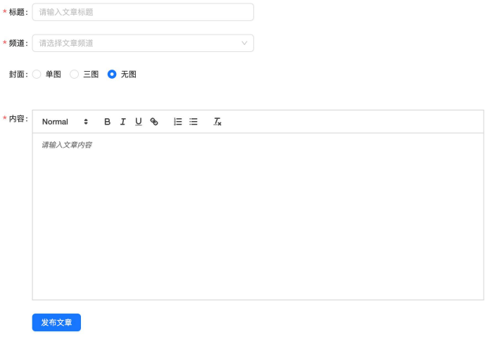


### 项目架构设计(准备)

#### 1、使用CRA初始化项目

这里我们如果想要使用别的包管理器来管理项目，可以通过对应方式来安装react项目。这里我们通过下面几个常见包管理器来安装react项目：

* npm
* yarn
* pnpm

##### 1.1 npm

```bash
# 全局安装
npm i -g create-react-app
create-react-app my-app
# 局部安装
npx create-react-app my-app 
```

> 对于仅仅使用一两次的包或命令，我们没有必要全局安装它们并占用空间，只需使用npx即可。


##### 1.2 yarn

```bash
# 局部安装
yarn create react-app my-app
```


##### 1.3 pnpm

```bash
# 局部安装
pnpm create react-app my-app
```

create-react-app官网中是推荐使用`npx`和`yarn`来安装react项目的，但是并没有支持`pnpm`。而create-react-app默认使用`npm`作为包管理工具，因此没有生成`pnpm`配置文件。

如果想要在项目中使用`pnpm`作为包管理工具，可以按照以下步骤进行操作：

1. 首先，确保已经全局安装了pnpm。如果没有安装，可以使用以下命令进行安装：

```bash
npm install pnpm -g 
# 或者开启corepack
corepack enable
```

2. 在项目根目录下创建一个名为`.npmrc`的文件，并在文件中添加以下内容：

```
package-manager=pnpm
```

3. 然后，删除项目根目录下的`node_modules`文件夹和`package-lock.json`文件（如果存在）。

4. 接下来，运行以下命令重新安装项目的依赖：

```bash
pnpm install
```

5. 安装完成后，可以使用以下命令启动项目：

```bash
pnpm start
```

这样就可以使用pnpm作为包管理工具，并且项目中会生成pnpm配置文件`.npmrc`。


#### 2、整理项目结构

按照业务规范整理项目目录(`重点SRC目录`)。

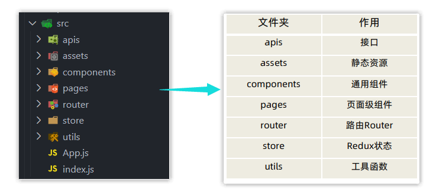


#### 3、配置SCSS预处理器

SCSS是一种预编译CSS语言，支持一些原生CSS不支持的高级用法，比如变量使用，嵌套语法等，使用SCSS可以让样式代码更加高效灵活。

项目中接入sass：

```bash
pnpm add sass -D
```


#### 4、安装Ant Design 组件库

Ant Design 是由蚂蚁金服出品的社区使用最广的React PC端组件库，内置了常用的现成组件，可以帮助我们快速开发PC管理后台项目。

安装Ant Design：

```bash
pnpm add antd --save
```

引入Button组件进行测试：

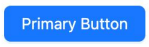


#### 5、路由配置

##### 5.1 路由设计

根据项目图片演示，设计路由的思路如下：

* App为根组件，Layout与Login同级，为App的子组件。
* 根据这种关系，对这三个组件关系进行配置路由。

```
|--- App.js
|	|--Layout
|	|	|-- index.js
|	|--Login
|	|	|--	index.js
└── ...
```


##### 5.2 路由配置

`router/index.js`中封装路由配置。

```js
import { createBrowserRouter } from 'react-router-dom'
import App from '../App'
import Layout from '../pages/Layout'
import Login from '../pages/Login'

const router = createBrowserRouter([
    {
        path: '/',
        element: <App />,
        children: [
            {
                index:true,
                element: <Layout />
            }, 
            {
                path: '/login',
                element: <Login />
            },
        ]
    },
])

export default router
```

其他三个组件

`App.js`

```jsx
import {Outlet} from 'react-router-dom'

function App() {
  return (
    <div>
      我是App
      <Outlet/>
    </div>
  )
}

export default App;
```

`Layout`

```jsx
const Layout = ()=>{
    return (
        <div>我是Layout</div>
    )
}

export default Layout
```

`Login`

```jsx
const Login = ()=>{
    return <div>我是Login</div>
}

export default Login
```

`index.js`中的配置

```jsx
import React from 'react';
import ReactDOM from 'react-dom/client';
import {RouterProvider} from 'react-router-dom'
import router from './router'

const root = ReactDOM.createRoot(document.getElementById('root'));
root.render(
  <React.StrictMode>
    <RouterProvider router={router} />
  </React.StrictMode>
);
```


#### 6、配置别名路径

配置别名路径能够方便我们开发过程中路径访问。

> 例如，将`@`替代`src`是我们经常配置的一个别名。

如何配置？

由于CRA是基于webpack+ES6进行构建的，并且webpack是已经预先配置且隐藏的(放入了小黑盒)，所以我们这里需要通过第三方工具来进行修改webpack的配置。

1. 针对路径转换，修改webpack别名路径配置使用`craco`。
2. 针对联想提示，修改VSCode配置`jsconfig.json`。

##### 6.1 路径转换—craco

安装第三方工具`craco`：

```bash
pnpm add @craco/craco -D
```

在项目根目录下新增文件`craco.config.js`文件中进行配置：

```js
const path = require('path')

module.exports = {
	// webpack配置
    webpack:{
        // 配置别名
        alias:{
            '@':path.resolve(__dirname,'src')
        }
    }
}
```

`package.json`包文件中配置启动和打包命令：

```json
"scripts": {
    "start": "craco start",
    "build": "craco build",
}
```


##### 6.2 联想提示—jsconfig.json

在项目根目录下新增`jsconfig.json`文件，添加路径提示配置

```json
{
    "compilerOptions": {
        "baseUrl": "./",
        "paths": {
            "@/*":[
                "src/*"
            ]
        }
    }
}
```


### 业务逻辑实现

#### 1、登录功能实现

##### 1.1 静态结构

使用 `AntD现成的组件` 创建登录页的内容结构。

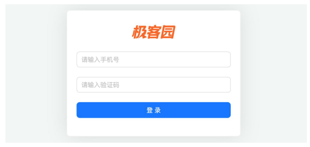

主要组件有：Card、Form、Input、Button。

```jsx
import { Card, Button, Form, Input } from 'antd'
import './index.scss'
import logo from '@/assets/logo.png'

const Login = () => {
    return (
        <div className="login">
            {/* 表单结构 */}
            <Card
                // 标题
                title={}
                bordered={false}
                >
                {/* 内容 */}
                <Form>
                    <Form.Item>
                        <Input placeholder='请输入手机号' />
                    </Form.Item>
                    <Form.Item>
                        <Input placeholder='请输入验证码' />
                    </Form.Item>
                    <Form.Item>
                        <Button type="primary" htmlType='submit' block size="large">						登录</Button>
                    </Form.Item>
                </Form>
            </Card>
        </div>
    )

}

export default Login
```

```scss
.login {
    width: 100%;
    height: 100%;
    background: center/cover url('~@/assets/login.png');

    >.ant-card {
        position: absolute;
        left: 50%;
        top: 50%;
        // height: 300px;
        width: 400px;
        transform: translate(-50%, -50%);
        box-shadow: 0 0 50px rgb(0 0 0 / 10%);

        .ant-card-head {
            padding: 10px 15px 0 15px;
            text-align: center;
            border: none;
        }

        .ant-card-head img {
            height: 60px;
        }

    }
}
```


##### 1.2 表单校验 & 收集数据

###### 表单校验

表单校验可以在提交登录之前校验用户的输入是否符合预期，如果不符合就阻止提交, 显示错误信息。

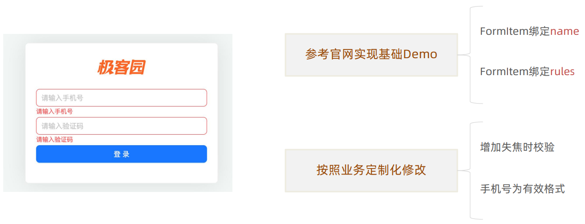

FormItem绑定**name** & 绑定 **rules**：

```jsx
// 1.定义表单校验规则
const rules = {
    phone: [
        {
            required: true,
            message: '请输入手机号'
        },
        {
            pattern:/^1[3-9]\d{9}$/,
            message:'请输入正确的手机号格式'
        }
    ],
    authCode: [
        {
            required: true,
            message: '请输入验证码'
        },
        {
            pattern:/^\d{6}$/,
            message:'验证码格式错误'
        }
    ]
}

{/* 内容 */}
<Form validateTrigger="onChange">
    <Form.Item name="phone" rules={rules.phone}>
        <Input placeholder='请输入手机号' />
    </Form.Item>
    <Form.Item name="authcode" rules={rules.authCode}>
        <Input placeholder='请输入验证码' />
    </Form.Item>
    <Form.Item>
        <Button type="primary" htmlType='submit' block size="large">登录</Button>
    </Form.Item>
</Form>
```

###### 收集数据

当用户输入了正确的表单内容，点击确认按钮时需要收集到用户当前输入的内容，用来提交接口请求。

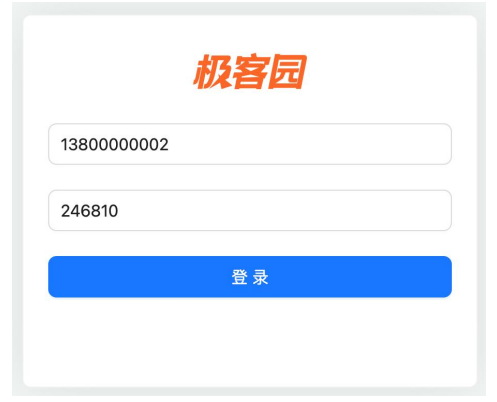

解决方案：给Form组件绑定**onFinish**回调函数，通过回调函数的参数获取用户输入的内容。

```jsx
// 2.收集数据
const onFinish = (values) =>{
    console.log(values)
}

<Form onFinish={onFinish} validateTrigger="onChange">
    <Form.Item name="phone" rules={rules.phone}>
        <Input placeholder='请输入手机号' />
    </Form.Item>
    <Form.Item name="authcode" rules={rules.authCode}>
        <Input placeholder='请输入验证码' />
    </Form.Item>
    <Form.Item>
        <Button type="primary" htmlType='submit' block size="large">登录</Button>
    </Form.Item>
</Form>
```


##### 1.3 axios封装

在整个项目中会发送很多网络请求，使用axios三方库做好统一封装，方便统一管理和复用。

1. 几乎所有的接口都是一样的接口域名
2. 几乎所有的接口都需要设置一样的超时时间 
3. 几乎所有的接口都需要做Token权限处理 .... 

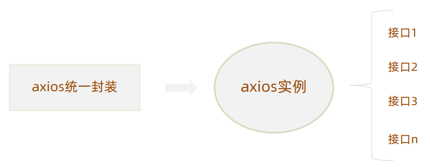


###### axios实例封装

`utils/request.js`

```js
import axios from 'axios'

const request = axios.create({
    baseURL: 'http://geek.itheima.net/v1_0',
    timeout: 5000
})

// 发送请求拦截器
request.interceptors.request.use(config => {
    // 在发送请求之前做些什么
    return config
},
    error => {
        // 对请求错误做些什么
        return Promise.reject(error)
    }
)

// 响应拦截器
request.interceptors.response.use(response => {
    // 对响应数据做些什么
    // 2xx范围内状态码会触发该函数
    return response
},
    error => {
        // 超出2xx状态码会触发该函数
        // 对响应错误做些射门
        return Promise.reject(error)
    }
)

// 导出axios实例
export default request
```

###### 在中转工具模块中导入

`utils/index.js`

```js
// 统计中转工具模块函数

import request from "./request";

export {
    request
}
```

这样做的原因？

> 将来我们所有自定义的模块都直接通过`@/utils`导入解构即可，无需重写对应的模块路径导入。


##### 1.4 Redux 封装 — 管理Token

Token作为一个用户的标识数据，需要在很`多个模块中共享`，Redux可以方便的解决状态共享问题。

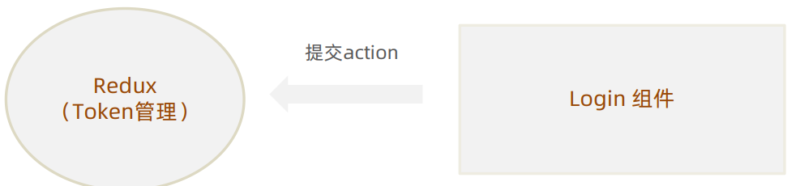

1. Redux中编写获取Token的异步获取和同步修改。
2. Login组件负责提交action并且把表单数据传递过来。


###### Redux封装 — 登录模块

1. 安装Redux包：

```js
pnpm add react-redux @reduxjs/toolkit
```

2. store模块配置

`store/index.js`

```js
// 组合子模块 + 导出store实例
import { configureStore } from '@reduxjs/toolkit'
import userReducer from './modules/userStore'

const store = configureStore({
    reducer:{
        user:userReducer
    }
})


export default store
export * from './modules/userStore'
```

`store/modules/userStore.js`

```js
// 用户相关的状态管理

import { request } from '@/utils'
import { createSlice } from '@reduxjs/toolkit'


const userStore = createSlice({
    name: 'user',
    initialState: {
        token: ''
    },
    // 同步修改方法
    reducers: {
        setToken(state, action) {
            state.token = action.payload
        }
    }
})

// 导出状态管理
export default userStore.reducer
// 导出同步方法
export const { setToken } = userStore.actions
// 异步操作方法
export const fetchLogin = (data) => {
    return async (dispatch) => {
        // 1.发送请求，获取token
        const { token } = await request.post('/v1_0/authorizations', data)
        // 2.调用同步方法
        dispatch(setToken(token))
    }
}
```

###### Login模块中调用异步action

```jsx
import { fetchLogin } from '@/store'
import { useDispatch } from 'react-redux'

const onFinish = (values) => {
    const data = {
        mobile:values.phone,
        code: values.authcode
    }
    dispatch(fetchLogin(data))
}
```


##### 1.5 Token持久化

现存问题：Redux存入Token之后如果刷新浏览器，Token会丢失（持久化就是防止刷新时丢失Token）。

问题原因：Redux是基于浏览器内存的存储方式，刷新时状态恢复为初始值。

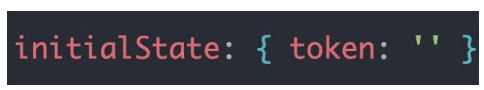

解决方案：

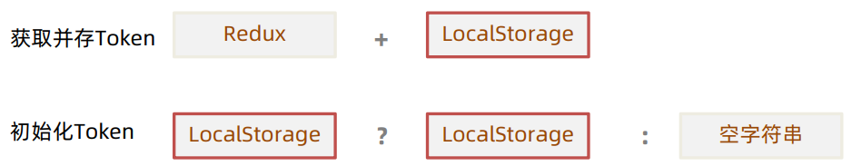

1. 获取并存储Token

`userStore.js`

```js
reducers: {
    setToken(state, action) {
        // 1.更新状态
        state.token = action.payload
        // 2.存储到本地存储中LocalStorage
        localStorage.setItem('token',action.payload)
    }
}
```

2. 初始化Token

```js
initialState: {
    // 初始化state，先从localStorage中访问，如果不存在则为空字符
    token: localStorage.getItem('token') || ''
},
```


##### 1.6 封装Token的存取删方法

封装的原因？ 

> 对于Token的各类操作在项目`多个模块中都有用到`，为了`共享复用`可以封装成工具函数。

注：工具函数我们都是放在`utils`目录下的。

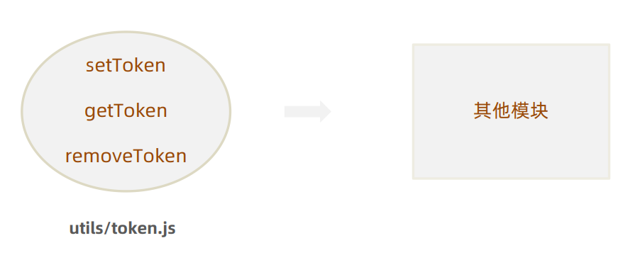

`utils/token.js`

```js
// 该工具函数用于token的存取删

const TOKENKEY = 'token_key'

const getToken = ()=>{
    return localStorage.getItem(TOKENKEY) || ''
}

const setToken = (token)=>{
    return localStorage.setItem(TOKENKEY,token)
}

const removeToken = ()=>{
    return localStorage.removeItem(TOKENKEY)
}

export{
    getToken,
    setToken,
    removeToken
}
```

在中转工具模块`utils/index.js`中导出

```js
export * from './token'
```

在`userStore.js`中使用

```js
import { getToken,setToken as _setToken } from '@/utils'

const userStore = createSlice({
    name: 'user',
    initialState: {
        // 初始化state，先从localStorage中访问，如果不存在则为空字符
        token: getToken()
    },
    // 同步修改方法
    reducers: {
        setToken(state, action) {
            // 1.更新状态
            state.token = action.payload
            // 2.存储到本地存储中LocalStorage
            _setToken(action.payload)
        }
    }
})
```


##### 1.7 将Token注入到Axios中

为什么要做这件事儿？ 

> Token作为用户的一个标识数据，后端很多接口都会以它作为接口权限判断的依据；请求拦截器注入Token之后，所有用到Axios实例的接口请求都自动携带了Token。

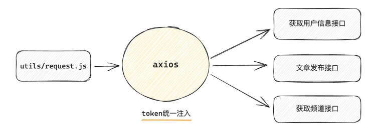

实现步骤：

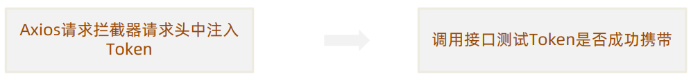

`utils/request.js`：注入Token

```js
// 发送请求拦截器
request.interceptors.request.use(config => {
    // 在发送请求之前做些什么
    const token = getToken()
    if(token){
        // 如果token存在，我们则将其添加到请求头上去
        config.headers.Authorization = `Bearer ${token}`
    }
    return config
},
    error => {
        // 对请求错误做些什么
        return Promise.reject(error)
    }
)
```

`Layout`：调用接口测试

```jsx
import { request } from "@/utils"
import { useEffect } from 'react'


const Layout = () => {
    useEffect(() => {
        request.get('/v1_0/user/profile')
    },[])

    return (
        <div className="layout">我是Layout</div>
    )
}

export default Layout
```


##### 1.8 根据Token控制路由跳转

具体要做什么事儿？ 

> 有些路由页面内的内容信息比较敏感，如果用户没有经过登录获取到有效Token，是没有权限跳转的，根据Token的有无控制当前路由是否可以跳转就是路由的权限控制。

解决方案：高级组件。

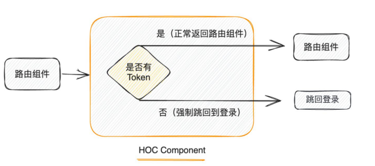

步骤：

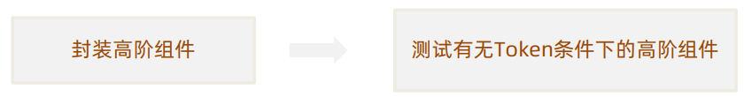

###### 封装高级组件

`components/AuthRoute.js`

```jsx
import { getToken } from "@/utils"
import { Navigate } from "react-router-dom"

const AuthRoute = ({children})=>{
    const token =getToken()
    if(token){
        return <>{children}</>
    }else{
        Navigate('/login')
    }
}

export default AuthRoute
```

###### 将高级组件配置到路由上

`router/index.js`

```js
...
import AuthRoute from '@/components/AuthRoute'

const router = createBrowserRouter([
    {
        path: '/',
        element: <App />,
        children: [
            {
                index:true,
                element: <AuthRoute><Layout /></AuthRoute>
            }, 
          	...
        ]
    },
])

export default router
```

###### 测试有无Token情况下的高级组件

1. 删除Token，路由跳转到layout。

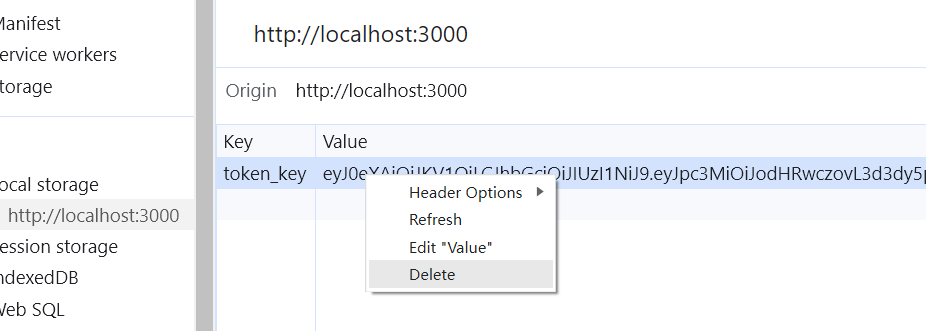

2. 成功登录后(有token)，是否可以正常访问layout页面。

```jsx
import { Card, Button, Form, Input, message } from 'antd'
import './index.scss'
import logo from '@/assets/logo.png'
import { fetchLogin } from '@/store'
import { useDispatch } from 'react-redux'
import { useNavigate } from 'react-router-dom'

const Login = () => {
    const dispatch = useDispatch()
    const navigate = useNavigate()
    // 1.定义表单校验规则
	...
    // 2.收集数据，提交表单
    const onFinish = async (values) => {
        const data = {
            mobile:values.phone,
            code: values.authcode
        }
        await dispatch(fetchLogin(data))

        // 提示信息
        message.success('登录成功!')
        // 跳转
        navigate('/')
    }
    return (
       ...
    )

}

export default Login
```


#### 2、布局页—layout实现

##### 2.1 静态布局 

```jsx
import React from 'react'
import './index.scss'
import { Breadcrumb, Layout, Menu, theme, Popconfirm } from 'antd'
import {
    HomeOutlined,
    DiffOutlined,
    EditOutlined,
    LogoutOutlined,
} from '@ant-design/icons';

const { Header, Content, Sider } = Layout
const { useState } = React

const items2 = [
    {
        label: '首页',
        key: '1',
        icon: <HomeOutlined />,
    },
    {
        label: '文章管理',
        key: '2',
        icon: <DiffOutlined />,
    },
    {
        label: '创建文章',
        key: '3',
        icon: <EditOutlined />,
    },
]

const BreadcrumbItems = [
    {
        title: 'Home'
    },
    {
        title: 'List'
    },
    {
        title: 'App'
    },
]

const GeeLayout = () => {
    // 主体颜色
    const {
        token: { colorBgContainer, borderRadiusLG },
    } = theme.useToken();

    return (
        <div className='layout'>
            <Layout>
                <Header
                    style={{
                        display: 'flex',
                            alignItems: 'center',
                    }}
                    >
                    <div className="logo" />
                    <div className="userInfo">
                        <span className="user-name">柴柴老师</span>
                        <span className="user-logout">
                            <Popconfirm title="是否确认退出？" okText="退出" cancelText="取消">
                                <LogoutOutlined /> 退出
                            </Popconfirm>
                        </span>
                    </div>
                </Header>
                <Layout>
                    <Sider
                        width={200}
                        style={{
                            background: colorBgContainer,
                        }}
                        >
                        <Menu
                            mode="inline"
                            defaultSelectedKeys={['1']}
                            style={{
                                height: '100%',
                                borderRight: 0,
                            }}
                            items={items2}
                            onClick={changeRoute}
                            />
                    </Sider>
                    <Layout
                        style={{
                            padding: '0 24px 24px',
                        }}
                        >
                        <Breadcrumb style={{'margin':'10px 0'}
                            } items={BreadcrumbItems}></Breadcrumb>
                        <Content
                            style={{
                            	padding: 24,
                              	margin: 0,
                                minHeight: 280,
                                background: colorBgContainer,
                                borderRadius: borderRadiusLG,
                            }}
                            >
                            {/* 路由出口 */}
                         
                        </Content>
                    </Layout>
                </Layout>
            </Layout>
        </div>
    )
}

export default GeeLayout
```

```scss
.layout {
    height: 100%;

    >.ant-layout {
        height: 100%;

        >.ant-layout-header{
            justify-content: space-between;
        }
        .logo {
            width: 200px;
            height: 60px;
            background: url('~@/assets/logo.png') no-repeat center / 160px auto;
        }

        .userInfo {
            color: wheat;

            .user-name{
                margin-right: 20px;
            }
        }
    }
}
```


##### 2.2 路由配置


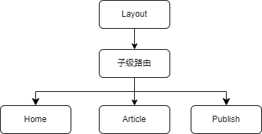

步骤：

1. 准备三个三级路由组件
2. router中通过children配置项进行配置
3. Layout组件中配置三级路由出口

###### 准备组件

`pages/Home`

```jsx
const Home = () => {
    return <div>Home</div>
}

export default Home
```

`pages/Publish`

```jsx
const Publish = () => {
    return <div>Publish</div>
}

export default Publish
```

`pages/Article`

```jsx
const Article = ()=>{
    return <div>Article</div>
}

export default Article
```

###### 配置路由

`router/index.js`

```js
...
import Home from '@/pages/Home'
import Article from '@/pages/Article'
import Publish from '@/pages/Publish'

const router = createBrowserRouter([
    {
        path: '/',
        element: <App />,
        children: [
            {
                path:'',
                element: <AuthRoute><Layout /></AuthRoute>,
                children:[
                    {
                        // 设置为默认路由 
                        // 1. path:空字符
                        // 2. 定义为索引路由 index:true (缺陷，索引路由下不能有子路由)
                        path:'',
                        element:<Home/>
                    },
                    {
                        path: '/article',
                        element: <Article />
                    },
                    {
                        path: '/publish',
                        element: <Publish />
                    },
                ]
            }, 
            {
                path: '/login',
                element: <Login />
            },
        ]
    },
])

export default router
```

###### Layout中配置路由出口

```jsx
<Content
    style={{
        padding: 24,
		margin: 0,
        minHeight: 280,
        background: colorBgContainer,
        borderRadius: borderRadiusLG,
    }}
    >
    {/* 路由出口 */}
    <Outlet />
</Content>
```


##### 2.3 路由跳转 & 高亮显示

实现效果1：点击左侧菜单可以跳转到对应的目标路由。

实现效果2：页面在刷新时可以根据当前的路由路径让对应的左侧菜单高亮显示。

###### 路由跳转

思路分析：

1. 左侧菜单要和路由形成一一对应的关系。
2. 点击菜单项时拿到路由路径，调用路由方法`navigate`跳转。

> 小知识点：`<Menu>`组件自身有一个`onClick`绑定事件，它的默认传参中就包含对应菜单项信息，我们只需要把其中的`key`和我们路由一一绑定即可。

```jsx
import { useNavigate } from 'react-router-dom'

// 1.Menu绑定数据和路由绑定
const item2s = [
    {
        label: '首页',
        key: '/',
        icon: <HomeOutlined />,
    },
    {
        label: '文章管理',
        key: '/publish',
        icon: <DiffOutlined />,
    },
    {
        label: '创建文章',
        key: '/article',
        icon: <EditOutlined />,
    },
]

const GeeLayout = ()=>{
    ...
    const navigate = useNavigate()
    // 3. Menu点击事件处理函数
    const changeRoute = ({key})=>{
        // 路由跳转
        navigate(key)
    }
    return (
    	...
        // 2.绑定onClick事件
        <Menu
        mode="inline"
        style={{
               height: '100%',
               borderRight: 0,
              }}
              items={item2s}
        onClick={changeRoute}
        />
        ...
    )
    
}
```

###### 高亮处理

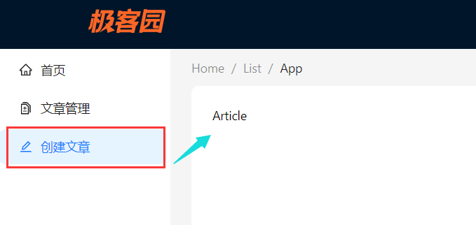

实现思路：

1. 获取当前url上的路由路径。
2. 找到菜单组件负责高亮的属性，绑定当前的路由路径即可。

> `Menu`组件的`defaultSelectedKeys`属性控制高亮显示，参数为`string[]`。

```jsx
const GeeLayout = ()=>{
    ...
    // Menu点击事件处理函数
    // 1.创建state存储路由url
    const location = useLocation()
    const selectedKey = location.pathname
    const [selected,setSelected] = useState(selectedKey)
    
    const navigate = useNavigate()
    const changeRoute = ({key})=>{
        // 2.每次单击菜单项之后，存储当前单击菜单项的路由
        setSelected(key)
        // 路由跳转
        navigate(key)
    }
    
    return (
    	...
        // 3.绑定selected
        <Menu
            mode="inline"
            defaultSelectedKeys={[selected]}
            style={{
                height: '100%',
                    borderRight: 0,
            }}
            items={item2s}
            onClick={changeRoute}
            />
        ...
    )
}
```


##### 2.4 展示个人信息

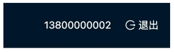

关键问题：用户信息应该放到哪里维护？

> 用户信息数据和Token令牌类似，用户的信息通常很有可能在多个组件中都需要共享使用，所以同样应该放到Redux中维护。

实现步骤：

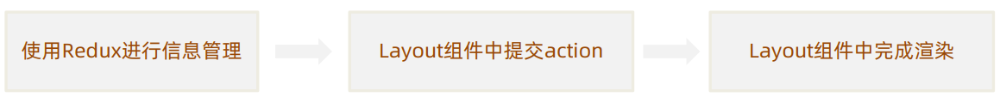

###### Redux管理用户信息

`userStore.js`

```jsx
const userStore = createSlice({
    name: 'user',
    initialState: {
        // 初始化state，先从localStorage中访问，如果不存在则为空字符
        token: getToken(),
        userinfo: {}
    },
    // 同步修改方法
    reducers: {
        setToken(state, action) {
            // 1.更新状态
            state.token = action.payload
            // 2.存储到本地存储中LocalStorage
            _setToken(action.payload)
        },
        setUserInfo(state, action) {
            state.userinfo = action.payload
        }
    }
})


// 导出状态管理
export default userStore.reducer
// 导出同步方法
export const { setToken ,setUserInfo} = userStore.actions


// 获取用户个人信息
export const fetchUserInfo = () => {
    return async (dispatch) => {
        // 1.发送请求
        const {data} = await request.get('/v1_0/user/profile')
        // 2.调用同步方法进行
        dispatch(setUserInfo(data))
    }
}
```

###### Layout中提交action

```jsx
import { useDispatch } from 'react-redux'
const { useState, useEffect } = React

const GeeLayout = ()=>{
    const dispatch = useDispatch()
    useEffect(() => {
        // 获取用户数据
        dispatch(fetchUserInfo())
    }, [dispatch])
    ...
}
```

###### 渲染页面

```jsx
import { useDispatch,useSelector } from 'react-redux'

const GeeLayout = ()=>{
    ...
    const { userinfo } = useSelector(state => state.user)    
    return (
    	...
        <span className="user-name">{userinfo.name}</span>
    )
}

```


##### 2.5 退出登录

退出登录是一个通用的业务逻辑，退出登录都要做什么？

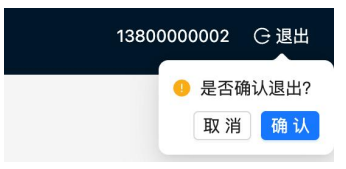

1. 提示用户是否确认要退出（危险操作，二次确认）。
2. 用户确认之后清除用户信息（Token以及其它个人信息） 。
3. 跳转到登录页（为下次登录做准备）。

###### 实现思路

1. 清除Redux管理的用户信息和Token，为`userStore`中新增同步action。

   > 我们获取的用户信息数据是保存在Redux中，所以在Redux需要做清除处理。
   >
   > 保存在本地存储中的Token也许要清除。

2. 为气泡弹框提交确认回调事件`onConfirm`。

3. Layout中，在回调函数中调用userStore的action。

4. 清除完毕之后，跳转到登录页面。

###### Redux中清除Token和用户信息

```js
// 同步修改方法
reducers: {
    setToken(state, action) {
        // 1.更新状态
        state.token = action.payload
        // 2.存储到本地存储中LocalStorage
        _setToken(action.payload)
    },
    setUserInfo(state, action) {
        state.userinfo = action.payload
    },
    clearUserInfo(state) {
        state.userinfo = {}
        state.token = ''
        removeToken()
    }
}
```

###### Layout中调用action

```jsx
const loginOut = ()=>{
    dispatch(clearUserInfo())
    navigate('/login')
}
```


##### 2.6 Token过期问题

什么是Token失效？ 为了用户的安全和隐私考虑，在用户长时间未在网站中做任何操作且规定的失效时间到达之后，当前的Token就会失效，一旦失效，不能再作为用户令牌标识请求隐私数据。

前端如何知道Token已经失效了？ 

> 通常在Token失效之后再去请求接口，后端会返回401状态码，前端可以监控这个状态做后续的操作。

Token失效了前端做什么？

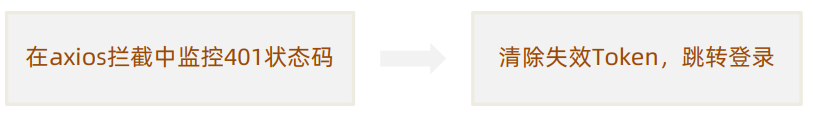


#### 3、文章发布—Publish

效果：

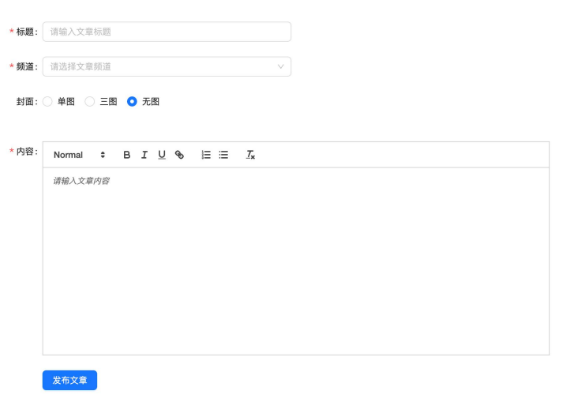

使用到组件：

> Form,Select,Input,Radio 和 富文本编辑器[react-quill](https://www.npmjs.com/package/react-quill)。

##### 3.1 静态布局

`Publish`

```jsx
import { Form, Input, Select, Radio, Button, Upload } from 'antd'
import { PlusOutlined } from '@ant-design/icons'
import ReactQuill from 'react-quill'
import 'react-quill/dist/quill.snow.css'
import { useState } from 'react'
import './index.scss'

const Publish = () => {
    const [value, setValue] = useState('')
    const [visible, setVisible] = useState(false)
    const showInputFile = (e)=>{
        if(e.target.value === 0 && useState){
            setVisible(false)
        }else{
            setVisible(true)
        }
    }

    return <div className="publish">
        <Form>
            <Form.Item label="标题">
                <Input placeholder="请输入文章标题" />
            </Form.Item>
            <Form.Item label="频道">
                <Select placeholder="请输入文章频道"></Select>
            </Form.Item>
            <Form.Item label="封面">
                <Form.Item>
                    <Radio.Group name="fm" defaultValue={0} onChange={showInputFile}>
                        <Radio value={1}>单图</Radio>
                        <Radio value={3}>三图</Radio>
                        <Radio value={0}>无图</Radio>
                    </Radio.Group>
                </Form.Item>
                {
                    visible && <Upload showUploadList listType="picture-card">
                        <div style={{ marginTop: 8 }}>
                            <PlusOutlined />
                        </div>
                    </Upload>
                }

            </Form.Item>
            <Form.Item label="内容">
                <ReactQuill className='publish-quill' theme="snow" value={value} onChange={setValue}></ReactQuill>
            </Form.Item>
            <Form.Item>
                <Button type="primary" size='large'>发布文章</Button>
            </Form.Item>
        </Form>

    </div>
}

export default Publish
```

```scss
.publish {
    height: 100%;
    padding: 20px;
    overflow-y: scroll;
    width: calc(100% + 4em);
    .ant-form {
        padding: 20px;

        .ant-form-item {
            width: 80%;

            input {
                width: 400px;
            }

            .ant-form-item-control-input {
                width: 400px;
            }


            .publish-quill {

                .ql-container,
                .ql-toolbar {
                    width: 600px;
                }

                .ql-editor {
                    min-height: 300px;
                }

            }

            &:nth-child(5) {
                padding-left: 40px;
            }

            .ant-upload-list {

                .ant-upload-list-item-container,
                .ant-upload-select {
                    width: 146px;
                    height: 146px;
                }
            }
        }
    }
}
```


##### 3.2 频道数据初始化

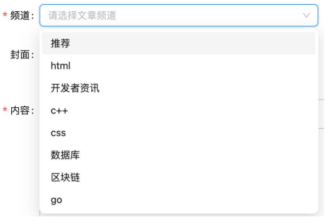

1. 根据接口文档在APIS模块中封装接口函数 
2. 使用 useState 维护数据
3. 在 useEffect 中调用接口获取数据并存入state
4. 绑定数据到下拉框组件

###### 接口封装

`apis/article.js`

```js
// 文章接口

import { request } from "@/utils";

export function getArticleChannels(){
    return request({
        url:'/v1_0/channels',
        method:'get'
    })
}
```

###### 调用接口获取数据渲染页面

```jsx
import { useState, useEffect } from 'react'
import { getArticleChannels } from '@/apis/article'
import './index.scss'
const { Option } = Select

// 获取频道数据
const [channels, setChannels] = useState([])
useEffect(() => {
    const getChannels = async () => {
        const { data: { channels } } = await getArticleChannels()
        setChannels(channels)
    }
    getChannels()
}, [])

<Form.Item label="频道">
    <Select name="channel_id" placeholder="请输入文章频道" defaultValue={0}>
        {channels.map(item =>
                      <Option value={item.id}>{item.name}</Option>
                     )}
    </Select>
</Form.Item>
```


##### 3.3 表单收集数据并提交

```jsx
const submitFormData = async (formData) => {
    // 根据封面选择进行判断
    if (isUpload) return
    // 创建传递数据
    const { channel_id, content, title, type } = formData
    const article = {
        title,
        content,
        cover: {
            type,
            images: imgList.map(item => item.response.data.url)
        },
        channel_id
    }
    // 调用接口，发送请求
    await newArticle(article)
    message.success('文章发布成功!')
    // 跳转
    navigate('/article',{replace:true})
}
```


##### 遇到问题

###### antd 中从其他组件跳转到首页时，首页中的Menu选项并没有更新

```jsx
// 为defaultSelectedKeys选项提供数据
const location = useLocation()
const [selected, setSelected] = useState(location.pathname)

<Menu
    mode="inline"
    defaultSelectedKeys={[selected]}
    style={{
        height: '100%',
            borderRight: 0,
    }}
    items={item2s}
    onClick={changeRoute}
    />
```

原因：

> 官方文档是这么介绍的，defaultSelectedKeys的作用是初始选中的菜单项 key 数组。由此可以推断该属性在Menu组件初始化之后就不起作用了。
>
> 在这里我们只是通过它在组件初始化时进行一个默认的选项，并没有说随着动态数据，进行一个选项的变化。

解决：

> 推荐在有defaultSelectedKeys属性的基础上，再加上selectedKeys。它的作用是当前选中的菜单项 key 数组(string[])，用它来路径设置跳转之后的选项。

`Layout`：找到解决方法之后，我们还需要在Layout组件中对`url`进行一个监控，保证每次路径跳转Menu组件都可以选择到正确的选项。这里我们可以通过`useEffect`钩子函数来实现该功能。

```jsx
useEffect(()=>{
    setSelected(location.pathname)
}, [location.pathname])
```

Menu组件添加`selectedKeys`。

```jsx
<Menu
    mode="inline"
    defaultSelectedKeys={[selected]}
    selectedKeys={[selected]}
    style={{
        height: '100%',
            borderRight: 0,
    }}
    items={item2s}
    onClick={changeRoute}
    />
```


#### 4、文章管理—Article

##### 4.1 静态结构

###### 表单结构

```jsx
import { Link } from 'react-router-dom'
import { Card, Breadcrumb, Form, Button, Radio, DatePicker, Select } from 'antd'
import locale from 'antd/es/date-picker/locale/zh_CN'

const { Option } = Select
const { RangePicker } = DatePicker

const Article = () => {
    return (
        <div>
            <Form initialValues={{ status: '' }} className='form'>
                <Form.Item label="状态" name="status">
                    <Radio.Group>
                        <Radio value={''}>全部</Radio>
                        <Radio value={0}>草稿</Radio>
                        <Radio value={2}>审核通过</Radio>
                    </Radio.Group>
                </Form.Item>

                <Form.Item label="频道" name="channel_id">
                    <Select
                        placeholder="请选择文章频道"
                        style={{ width: 120 }}
                        >
                        <Option value="jack">Jack</Option>
                        <Option value="lucy">Lucy</Option>
                    </Select>
                </Form.Item>

                <Form.Item label="日期" name="date">
                    {/* 传入locale属性 控制中文显示*/}
                    <RangePicker locale={locale}></RangePicker>
                </Form.Item>

                <Form.Item>
                    <Button type="primary" htmlType="submit" style={{ marginLeft: 40 }}>
                        筛选
                    </Button>
                </Form.Item>
            </Form>
        </div>
    )
}

export default Article
```

###### 表格结构

```jsx
// 导入资源
import { Table, Tag, Space } from 'antd'
import { EditOutlined, DeleteOutlined } from '@ant-design/icons'
import img404 from '@/assets/error.png'

const Article = () => {
  // 准备列数据
  const columns = [
    {
      title: '封面',
      dataIndex: 'cover',
      width: 120,
      render: cover => {
        return 
      }
    },
    {
      title: '标题',
      dataIndex: 'title',
      width: 220
    },
    {
      title: '状态',
      dataIndex: 'status',
      render: data => <Tag color="green">审核通过</Tag>
    },
    {
      title: '发布时间',
      dataIndex: 'pubdate'
    },
    {
      title: '阅读数',
      dataIndex: 'read_count'
    },
    {
      title: '评论数',
      dataIndex: 'comment_count'
    },
    {
      title: '点赞数',
      dataIndex: 'like_count'
    },
    {
      title: '操作',
      render: data => {
        return (
          <Space size="middle">
            <Button type="primary" shape="circle" icon={<EditOutlined />} />
            <Button
              type="primary"
              danger
              shape="circle"
              icon={<DeleteOutlined />}
            />
          </Space>
        )
      }
    }
  ]
  // 准备表格body数据
  const data = [
    {
      id: '8218',
      comment_count: 0,
      cover: {
        images: [],
      },
      like_count: 0,
      pubdate: '2019-03-11 09:00:00',
      read_count: 2,
      status: 2,
      title: 'wkwebview离线化加载h5资源解决方案'
    }
  ]
  return (
    <div>
      {/*  表格结构  */}
      <Card title={`根据筛选条件共查询到 count 条结果：`}>
        <Table rowKey="id" columns={columns} dataSource={data} />
      </Card>
    </div>
  )
}
```


##### 4.2 渲染频道数据

###### Publish抽离频道列表获取逻辑

`hooks/useChannel`

```js
// 封装获取频道列表的逻辑
import { useState,useEffect } from "react"
import { getArticleChannels} from '@/apis/article'

function useChannel(){
    // 1.获取频道列表的所有逻辑
    // 获取频道数据
    const [channels, setChannels] = useState([])
    useEffect(() => {
        const getChannels = async () => {
            const { data: { channels } } = await getArticleChannels()
            setChannels(channels)
        }
        getChannels()
    }, [])
    // 2.把组件中要用到的数据return出去
    return {
        channels
    }
}

export default useChannel
```

###### Article组件中使用

```jsx
import useChannel from '@/hooks/useChannel'

const Article = () => {
    // 获取频道数据
    const { channels } = useChannel()

    // 准备列数据
	...

    return (
        <div className='article'>
            {/* 表单区域 */}
            <Form initialValues={{ status: '' }} className='form'>
                <Form.Item label="状态" name="status">
                    <Radio.Group>
                        <Radio value={''}>全部</Radio>
                        <Radio value={0}>草稿</Radio>
                        <Radio value={2}>审核通过</Radio>
                    </Radio.Group>
                </Form.Item>

                <Form.Item label="频道" name="channel_id">
                    <Select
                        placeholder="请选择文章频道"
                        style={{ width: 120 }}
                        >
                        {channels.map(item => <Option key={item.id} value={item.id}>{item.name}</Option>)}
                    </Select>
                </Form.Item>

                <Form.Item label="日期" name="date">
                    {/* 传入locale属性 控制中文显示*/}
                    <RangePicker locale={locale}></RangePicker>
                </Form.Item>

                <Form.Item>
                    <Button type="primary" htmlType="submit" style={{ marginLeft: 40 }}>
                        筛选
                    </Button>
                </Form.Item>
            </Form>
            ...
        </div>
    )
}
```


##### 4.3 渲染表格数据

###### 封装调用接口函数

`apis/article.js`

```js
// 获取文章列表
export function getArticleList(params){
    return request({
        url:`/v1_0/mp/articles`,
        method:'get',
        params
    })
}
```

###### 在Article中调用该请求函数获取数据

```jsx
// 获取表格数据
const [list, setList] = useState([])
const [params, setParams] = useState({
    page: 1,
    per_page: 5,
    begin_pubdate: null,
    end_pubdate: null,
    status: null,
    channel_id: null
})

useEffect(() => {
    getArticleList(params).then(res=>{
        setList(res.data.results)
    }).catch(err=>{
        console.log(err)
    })
})
```

###### 在表格中进行渲染

```jsx
{/* 表格区域 */}
<Card className='table' title={`根据筛选条件共查询到 ${list.length} 条结果：`}>
    <Table rowKey="id" columns={columns} dataSource={list} />
</Card>
```


##### 4.4 表单筛选功能实现

###### 表单收集数据

```jsx
const [params, setParams] = useState({
    page: 1,
    per_page: 4,
    begin_pubdate: '',
    end_pubdate: '',
    status: '',
    channel_id: ''
})

// 表单筛选
const onFinish = (formData)=>{
    console.log(formData)
    // 将收集到的数据放在参数params中
    setParams({
        ...params,
        channel_id:formData.channel_id,
        status:formData.status,
        begin_pubdate:formData.date[0].format('YYYY-MM-DD'),
        end_pubdate:formData.date[1].format('YYYY-MM-DD')
    })
}
```

###### 获取文章列表数据(复用)

```jsx
useEffect(() => {
    getArticleList(params).then(res => {
        setList(res.data.results)
    }).catch(err => {
        console.log(err)
    })
},[params])
```


##### 4.5 分页功能实现

实现效果：点击页数，在Table中显示当前页的数据列表。

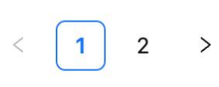

###### 给Table添加配置项*pagination*

```jsx
<Table rowKey="id" columns={columns} dataSource={list} pagination={{
        total:count,
        pageSize:params.per_page,
        onChange:onPageChange
    }}/>
```

###### 添加Pagination的onChange回调

```js
// 分页的页码变化回调
const onPageChange = (page)=>{
    // 切换页码 => 修改参数依赖项，引起数据重新获取渲染
    setParams({
        ...params,
        page
    })
}
```


##### 4.6 删除功能实现

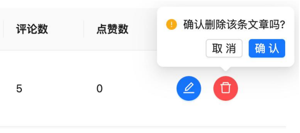

实现效果：点击删除按钮删除当前文章。

###### 封装删除接口

`apis/article.js`

```js
// 删除文章
export function delArticle(id){
    return request({
        url: `/v1_0/mp/articles/${id}`,
        method:'delete'
    })
}
```

###### 添加Popconfirm组件

```jsx
// 准备列数据
const columns = [
    {
        title: '封面',
        dataIndex: 'cover',
        width: 120,
        render: cover => {
            return 
        }
    },
    {
        title: '标题',
        dataIndex: 'title',
        width: 220
    },
    {
        title: '状态',
        dataIndex: 'status',
        // data === 1 待审核
        // data === 2 审核通过
        render: data => state[data]
    },
    {
        title: '发布时间',
        dataIndex: 'pubdate'
    },
    {
        title: '阅读数',
        dataIndex: 'read_count'
    },
    {
        title: '评论数',
        dataIndex: 'comment_count'
    },
    {
        title: '点赞数',
        dataIndex: 'like_count'
    },
    {
        title: '操作',
        render: data => {
            return (
                <Space size="middle">
                    <Button type="primary" shape="circle" icon={<EditOutlined />} />
                    {/* 添加气泡提示框 */}
                    <Popconfirm
                        title="删除文章"
                        description="你确定要删除当前文章吗？"
                        onConfirm={onConfirm(data)}
                        okText="确认"
                        cancelText="取消"
                        >
                        <Button
                            type="primary"
                            danger
                            shape="circle"
                            icon={<DeleteOutlined />}
                            />
                    </Popconfirm>
                </Space>
            )
        }
    }
]
```

###### 获取文章id，调用删除接口

```jsx
// 删除文章
const onConfirm = async (data) => {
    await delArticle(data.id)
    // 更新列表
    setParams({
        ...params
    })
}
```


##### 4.7 编辑功能实现

###### 编辑文章跳转

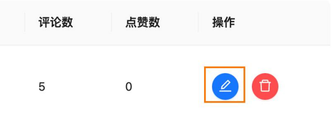

实现效果：点击编辑文章跳转到文章编辑页。

步骤：

1. 获取当前文章id
2. 跳转到编辑文章路由

```jsx
const navigate = useNavigate()

// 准备列数据
const columns = [
    {
        title: '封面',
        dataIndex: 'cover',
        width: 120,
        render: cover => {
            return 
        }
    },
    {
        title: '标题',
        dataIndex: 'title',
        width: 220
    },
    {
        title: '状态',
        dataIndex: 'status',
        // data === 1 待审核
        // data === 2 审核通过
        render: data => state[data]
    },
    {
        title: '发布时间',
        dataIndex: 'pubdate'
    },
    {
        title: '阅读数',
        dataIndex: 'read_count'
    },
    {
        title: '评论数',
        dataIndex: 'comment_count'
    },
    {
        title: '点赞数',
        dataIndex: 'like_count'
    },
    {
        title: '操作',
        render: data => {
            return (
                <Space size="middle">
                    <Button type="primary" onClick={()=>navigate(`/publish?id=${data.id}`)} shape="circle" icon={<EditOutlined />} />
                    {/* 添加气泡提示框 */}
                    <Popconfirm
                        title="删除文章"
                        description="你确定要删除当前文章吗？"
                        onConfirm={()=>onConfirm(data)}
                        okText="确认"
                        cancelText="取消"
                        >
                        <Button
                            type="primary"
                            danger
                            shape="circle"
                            icon={<DeleteOutlined />}
                            />
                    </Popconfirm>
                </Space>
            )
        }
    }
]
```

###### 封装文章详情接口

```js
// 获取文章详情
export function getArticleDetail(id){
    return request({
        url:`/v1_0/articles/${id}`
    })
}
```

###### 回填数据

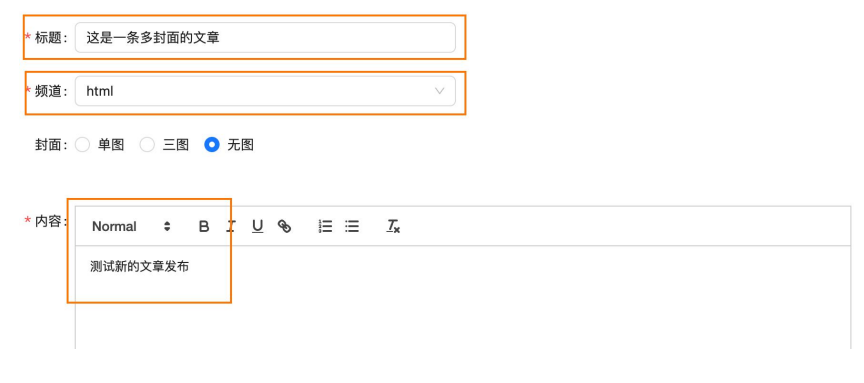

实现效果：把页面中除了封面之外的其余字段完成回填。

如何实现： 

1. 通过文章id获取到文章详情数据。
2. 调用Form组件实例方法 setFieldsValue 回显数据。 

```jsx
const [searchParams] = useSearchParams()
const article_id = searchParams.get('id')
const [form] = Form.useForm()
// 回填数据（编辑功能）
useEffect(() => {
    if (article_id) {
        // 通过id调用获取文章详情接口
        getArticleDetail(article_id).then(res => {
            const { type, images } = res.data.cover
            // 回显到表单
            form.setFieldsValue({
                ...res.data,
                type: type
            })
            // 回显封面
            function ShowImages() {
                if (type !== 0) {
                    setVisible(true)
                }
                setImgList(images.map(url => ({ url })))
            }
            ShowImages()
        })
    }
}, [article_id, form])
```

###### 面包屑状态优化

`Layout`

```jsx
const BreadcrumbItems = {
	...
    "/publish_id": [
        {
            title: '首页'
        },
        {
            title: '编辑文章'
        },
    ],
}


// 面包屑状态 默认值由当前地址url决定
const [breadCrumb, setBreadCrumb] = useState(BreadcrumbItems[location.pathname])   

// 面包屑状态实时监控
const [searchParams] = useSearchParams()
const id = searchParams.get('id')
useEffect(()=>{
    // 如果存在id则更换面包屑状态
    if(id){
        setBreadCrumb(BreadcrumbItems[location.pathname+'_id'])
    }
},[id,location])
```

###### 文章编辑更新

封装文章更新接口：

```js

```

修改原本发布文章的回调函数，使其具备更新功能：

```js
const submitFormData = async (formData) => {
    // 根据封面选择进行判断
    if (isUpload) return
    // 创建传递数据
    const { channel_id, content, title, type } = formData
    const article = {
        title,
        content,
        cover: {
            type,
            images: imgList.map(item => {
                // 如果item中有response
                if (item.response) {
                    return item.response.data.url
                } else {
                    return item.url
                }
            })
        },
        channel_id
    }
    // 调用接口，发送请求
    if (article_id) {
        // 调用更新接口
        await updateArticle({ ...article, id: article_id })
    } else {
        await newArticle(article)
    }
    message.success('文章发布成功!')
    // 跳转
    navigate('/article', { replace: true })
}
```


###### 优化—封面

文章图片切换模式时，当图片由多 => 少时转换，则清空imgList。

```jsx
// 控制封面组件显示隐藏(切换上传图片模式)
const changeScheme = (num) => {
    if (num === 0) {
        // 提交图片框移除
        setVisible(false)
    } else {
        setVisible(true)
    }
    // 什么时候清空图片列表？从一个图片多的模式 => 图片少的模式 (例如，3=>1,3=>无,1=>无)
    if(type > num){
        setImgList([])
    }
    setType(num)
    setIsUpload(checkType(num))
}
```


### 项目打包

#### 1、项目打包

打包指的是将项目中的`源代码和资源文件进行处理`，生成可在生产环境中运行的`静态文件`的过程。

> 在此项目中，静态文件指的是 html/css/js等静态文件。

打包命令

```bash
pnpm build
```


#### 2、本地预览

本地预览是指在本地通过静态服务器模拟生产服务器运行项目的过程。

实现步骤：

1. 安装本地包 `npm i -g serve`
2. `serve -s ./build`
3. 浏览器中访问 `http://localhost:3000`


#### 3、打包优化—路由懒加载

什么是路由懒加载？ 

> 路由懒加载是指路由的JS资源只有在被访问时才会动态获取，目的是为了优化项目首次打开的时间。

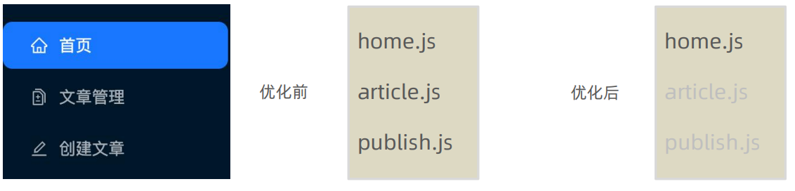

如何进行配置？

1. 把路由修改为由React提供的 lazy 函数进行动态导入。
2. 使用React内置的 `Suspense组件` 包裹路由中element选项对应的组件。

```js
import { createBrowserRouter } from 'react-router-dom'
import App from '@/App'
import Layout from '@/pages/Layout'
import Login from '@/pages/Login'
import AuthRoute from '@/components/AuthRoute'
import { Suspense, lazy } from 'react'

// 1. lazy函数对组件进行导入
const Home = lazy(() => import('@/pages/Home'))
const Article = lazy(() => import('@/pages/Article'))
const Publish = lazy(() => import('@/pages/Publish'))


const router = createBrowserRouter([
    {
        path: '/',
        element: <App />,
        children: [
            {
                path: '',
                element: <AuthRoute><Layout /></AuthRoute>,
                children: [
                    {
                        path: '',
                        element: <Suspense fallback={'加载中'}><Home /></Suspense>
                    },
                    {
                        path: '/article',
                        element: <Suspense fallback={'加载中'}><Article /></Suspense>
                    },
                    {
                        path: '/publish',
                        element: <Suspense fallback={'加载中'}><Publish /></Suspense>
                    },
                ]
            },
            {
                path: '/login',
                element: <Login />
            },
        ]
    },
])

export default router
```


#### 4、打包优化 — 包体积分析

什么包体积分析？ 

> 通过可视化的方式，直观的体现项目中各种包打包之后的体积大小，方便做优化。

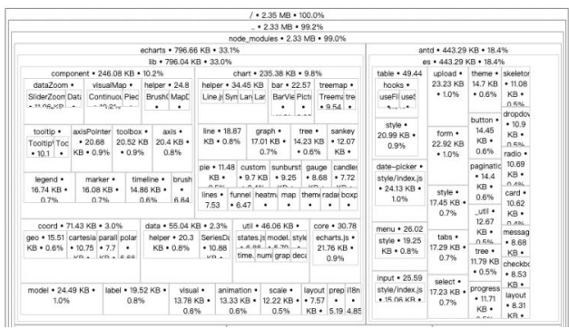

怎么做到？

> `source-map-explorer`。

1. 安装第三方包。

```bash
npm i source-map-explorer
```

2. 配置命令指定要分析的js文件。

```json
"scripts": {
    "start": "craco start",
    "build": "craco build",
    "test": "react-scripts test",
    "eject": "react-scripts eject",
    "analyze":"source-map-explorer 'build/static/js/*.js'"
},
```


#### 5、打包优化 — CDN优化

什么是CDN? 

> CDN是一种内容分发网络服务，当用户请求网站内容时，由离用户最近的服务器将缓存的资源内容传递给用户。

哪些资源可以放到CDN服务器？ 

> 体积较大的`非业务JS文件`, 比如react、react-dom 
>
> 1. 体积较大，需要利用CDN文件在浏览器的缓存特性，加快加载时间 
>
> 2. 非业务JS文件，不需要经常做变动，CDN不用频繁更新缓存

项目中怎么做？

1. 把需要做CDN缓存的文件排除在打包之外（react、react-dom） 
2. 以CDN的方式重新引入资源（react、react-dom）

**分析说明**：通过 craco 来修改 webpack 配置，从而实现 CDN 优化
**核心代码**
`craco.config.js`

```javascript
// 添加自定义对于webpack的配置

const path = require('path')
const { whenProd, getPlugin, pluginByName } = require('@craco/craco')

module.exports = {
  // webpack 配置
  webpack: {
    // 配置别名
    alias: {
      // 约定：使用 @ 表示 src 文件所在路径
      '@': path.resolve(__dirname, 'src')
    },
    // 配置webpack
    // 配置CDN
    configure: (webpackConfig) => {
      let cdn = {
        js:[]
      }
      whenProd(() => {
        // key: 不参与打包的包(由dependencies依赖项中的key决定)
        // value: cdn文件中 挂载于全局的变量名称 为了替换之前在开发环境下
        webpackConfig.externals = {
          react: 'React',
          'react-dom': 'ReactDOM'
        }
        // 配置现成的cdn资源地址
        // 实际开发的时候 用公司自己花钱买的cdn服务器
        cdn = {
          js: [
            'https://cdnjs.cloudflare.com/ajax/libs/react/18.1.0/umd/react.production.min.js',
            'https://cdnjs.cloudflare.com/ajax/libs/react-dom/18.1.0/umd/react-dom.production.min.js',
          ]
        }
      })

      // 通过 htmlWebpackPlugin插件 在public/index.html注入cdn资源url
      const { isFound, match } = getPlugin(
        webpackConfig,
        pluginByName('HtmlWebpackPlugin')
      )

      if (isFound) {
        // 找到了HtmlWebpackPlugin的插件
        match.userOptions.files = cdn
      }

      return webpackConfig
    }
  }
}
```

`public/index.html`

```html
<body>
  <div id="root"></div>
  <!-- 加载第三发包的 CDN 链接 -->
  <% htmlWebpackPlugin.options.cdn.js.forEach(cdnURL => { %>
    <script src="<%= cdnURL %>"></script>
  <% }) %>
</body>
```


##### whenProd解释

`@craco/craco` 是一个用于**定制 Create React App (CRA) 配置的工具**。其中的 `whenProd` 是 craco 的一个插件，用于在`生产环境下执行特定的配置`。

当你在使用 craco 配置 CRA 项目时，可以通过 whenProd 插件来指定只在生产环境下执行的配置。这对于需要在开发环境和生产环境下有不同行为的配置非常有用。

具体来说，whenProd 插件提供了一个 whenProd 函数，你可以在 craco.config.js 文件中使用它来定义只在生产环境下执行的配置。例如，你可以在 whenProd 函数中使用 craco 的其他配置函数，如 webpack、babel 等，来定制生产环境下的配置。

以下是一个示例的 craco.config.js 文件，展示了如何使用 whenProd 插件：

```js
javascriptconst { whenProd } = require('@craco/craco');

module.exports = {
  plugins: [
    // 只在生产环境下执行的配置
    whenProd(() => ({
      // 在生产环境下使用 Gzip 压缩
      webpack: {
        configure: {
          plugins: [
            new CompressionPlugin({
              algorithm: 'gzip',
              filename: '[path][base].gz',
              test: /\.(js|css|html|svg)$/,
              threshold: 10240,
              minRatio: 0.8,
            }),
          ],
        },
      },
    })),
    // 其他配置插件...
  ],
};
```

在上面的示例中，当你运行 `npm run build` 或 `yarn build` 命令时，whenProd 插件会根据当前环境判断是否执行包含 Gzip 压缩的 webpack 配置。


#### 6、出现问题

##### 6.1 html-webpack-plugin

html-webpack-plugin报错可能由以下原因导致：

1. 插件版本不兼容：如webpack版本与terser-webpack-plugin版本不兼容。
2. 配置错误：在webpack配置文件中，terser-webpack-plugin的配置项可能有误。
3. 代码问题：在你的代码中可能存在错误，导致 terser-webpack-plugin 无法正确压缩JavaScript文件。
4. 多入口配置问题：如果你使用了多入口，但使用了老方法配置html-webpack-plugin，可能会导致上述报错。

为解决这些问题，你可以尝试以下方法：

1. 检查并更新webpack和terser-webpack-plugin的版本12。
2. 检查webpack配置文件，确保terser-webpack-plugin的配置项正确。
3. 检查你的代码，修复可能存在的错误1。
4. 根据你的入口名字，使用config.plugin('html-[入口名]')进行配置。
5. 如果你的项目使用了多入口，确保你使用了正确的入口名称进行配置3。


###### terser-webpack-plugin

terser-webpack-plugin是一个用于压缩JavaScript代码的插件。

它是webpack生态系统中的一个常用插件，用于在生产环境中优化和压缩JavaScript代码，以减小文件大小并提高加载速度。

它可以自动删除未使用的代码、压缩函数、变量和属性名，以及应用其他优化策略，从最大程度地减小JavaScript文件的体积。

通过使用terser-webpack-plugin，你可以轻松地将你的JavaScript代码进行优化，以改善网站的性能。