## ReactRouter—入门

### 前端路由

#### 1、什么是前端路由

一个路径 path 对应一个组件 component 当我们在浏览器中访问一个 path 的时候，path 对应的组件会在页面中进行渲染。

```jsx
const routes = [
    {
        path:'/about',
        component:About,
    },
    {
        path:'/article',
        component:Article
    }
]
```


#### 2、创建路由环境

使用路由我们还是采用CRA创建项目的方式进行基础环境配置。

1. 创建项目并安装所有依赖

```bash
npx create-react-app react-router
npm i
```

2. 安装最新的ReactRouter包

```bash
npm i react-router-dom
```

3. 启动项目

```bash
npm run start
```


#### 3、快速开始

需求：创建一个可以切换登录页和文章页的路由系统。

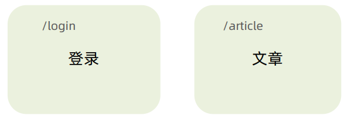

```jsx
import {createBrowserRouter, RouterProvider} from 'react-router-dom'

// 1.创建router实例对象并且配置路由对应关系
const router = createBrowserRouter([
  {
    path: "/login",
    element: <div>我是登录页</div>
  },{
    path:'/article',
    element: <div>我是文章页</div>
  }
])
```


### 抽象路由模块

#### 1、实际开发中的router配置

实际开发中的router配置会抽离出来，放在单独的一个文件夹当中，这样做的原因是便于后期的维护。

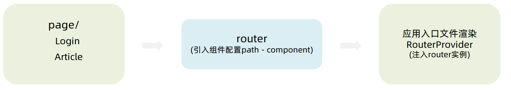


#### 2、抽离组件模块(page)

`page/Login`

```jsx
const Login = () => {
    return (
        <div>我是Login页面</div>
    )
}

export default Login
```


`page/Article`

```jsx
const Article = ()=>{
    return(
        <div>我是文章页面</div>
    )
}

export default Article
```


#### 3、抽离路由模块

`router/index.js`

```js
import {createBrowserRouter} from 'react-router-dom'
import Login from '../page/Login'
import Article from '../page/Article'
import App from '../App'

const router = createBrowserRouter([
    {
        path:'/',
        element:<App/>,
    },
    {
        path:'/login',
        element:<Login/>,
    },
    {
        path:'/article',
        element:<Article/>,
    }
])

export default router
```


### 路由导航

#### 1、什么是路由导航

路由系统中的多个路由之间需要进行`路由跳转`，并且在跳转的同时有可能需要`传递参数进行通信`。

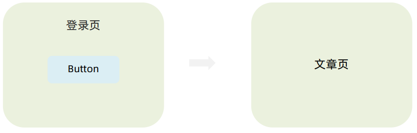


#### 2、声明式导航

声明式导航是指通过在模版中通过 ` <link/> 组件描述出要跳转到哪里`去，比如后台管理系统的左侧菜单通常使用这 种方式进行。

```jsx
<link to="/article">文章</link>
```

语法说明：通过给组件的`to属性指定要跳转到路由path`，组件会被渲染为浏览器支持的a链接，如果需要传参直接`通过字符串拼接`的方式拼接参数即可。


#### 3、编程式导航

编程式导航是指通过 `useNavigate` 钩子得到导航方法，然后通过调用方法以命令式的形式进行路由跳转，比如想在 登录请求完毕之后跳转就可以选择这种方式，更加灵活。

```jsx
import { useNavigate } from 'react-router-dom'

const Login = ()=>{
    const navigate = useNavigate()
    return (
    	<div>
        	我是登录页
            <button onClick={()=> navigate('/article')}>跳转至文章</button>
        </div>
    )
}
```

语法说明：通过调用navigate方法传入地址path实现跳转。


### 导航传参

#### 1、路由导航传参方式

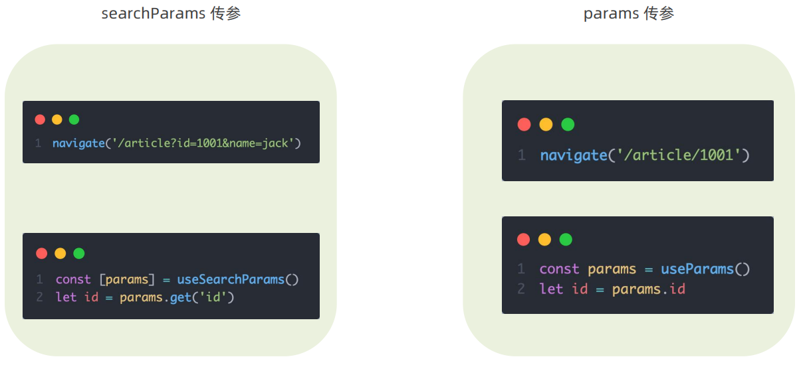

##### 1.1 searchParams传参

`Login/index.js`

```jsx
 {/* 跳转传参 */}
<button onClick={() => navigate('/article?id=1002&name=tom')}>跳转到文章页</button>
```

`Article/index.js`：接收参数

```jsx
import { useSearchParams } from "react-router-dom"

const Article = ()=>{
    const [params] = useSearchParams
    return(
        <div>我是文章页面
            {/* 普通传参 */}
            <p>文章ID：{params.get('id')}-{params.get('name')}</p>
        </div>
    )
}
```


##### 1.2 params传参

`router/index.js`：配置路由为动态路由

```js
{
    path:'/article/:id/:name',
    element:<Article/>,
}
```

`Login/index.js`

```jsx
 {/* 跳转传参 */}
<button onClick={() => navigate('/article/1001/tom')}>跳转到文章页</button>
```

`Article/index.js`

```jsx
import { useParams } from "react-router-dom"


const Article = ()=>{
    const params = useParams()
    return(
        <div>我是文章页面
            {/* 动态路由传参 */}
            <p>文章ID：{params.id}-{params.name}</p>
        </div>
    )
}
```


### 嵌套路由配置

#### 1、了解：什么是嵌套路由

在一级路由中又内嵌了其他路由，这种关系就叫做嵌套路由，嵌套至一级路由内的路由又称作二级路由，例如：


#### 2、实现嵌套路由配置

实现步骤：

1. . 使用 `children` 属性配置路由。
2. 使用 `<Outlet/>` 组件配置二级。

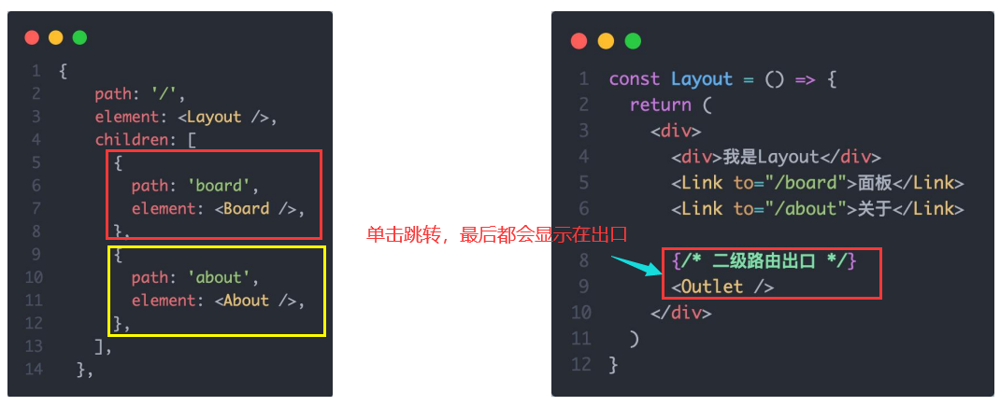

##### 2.1 创建组件

`page/Layout`

```jsx
import { Outlet,Link } from "react-router-dom"

function Layout(){

    return (
        <div>
            我是Layout页面
            <br/>
            <Link to="/layout/board">Home</Link><br/>
            <Link to="/layout/about">About</Link>

            {/* 二级路由出口 */}
            <Outlet/>
        </div>
    )
}
export default Layout
```

`page/Board`

```jsx
function Board() {

    return (
        <div>我是Board页面</div>
    )
}
export default Board
```

`page/About`

```jsx
function About() {

    return (
        <div>我是About页面</div>
    )
}
export default About
```


##### 2.2 路由配置

```js
{
    path:'/layout',
    element:<Layout/>,
    children:[
        { 
            path:'about',
            element:<About/>
        },
            { 
            path:'board',
            element:<Board/>
        }
    ]
},
```


### 默认二级路由

#### 1、场景和配置方式

当访问的是一级路由时，默认的二级路由组件可以得到渲染，只需要在二级路由的位置去掉path，设置`index属性为true`。

##### 1.1 路由配置更改

在这里我们给`Layout`下的一个子组件设置为默认二级路由。

```js
{
    path:'/layout',
    element:<Layout/>,
    children:[
        { 
            index:true,
            element:<About/>
        },
            { 
            path:'board',
            element:<Board/>
        }
    ]
},
```

> 需要注意的是：当path存在，且index属性也存在，这个时候index会失效！


##### 1.2 Layout组件修改

```jsx
function Layout(){
    return (
        <div>
            我是Layout页面
            <br/>
            <Link to="/layout">About</Link>
            <Link to="/layout/board">Board</Link><br/>

            {/* 二级路由出口 */}
            <Outlet/>
        </div>
    )
}
```

这里关于`About`跳转的路由是必须要修改的，当我们点击About链接时，他会去路由关系中找是否存在`About`相关的路由。如果此时路由关系还是`/layout/about`就会报错，因为`/layout/about`这个路由不存在。

这里我们通过修改目标路由为`/layout`，可以纠正这种错误(`/layout`的二级路由设置了默认路由，会自动跳转到它)。


#### 404路由配置

#### 1、404出现场景

当浏览器输入url的路径在整个路由配置中都找不到对应的 path，为了用户体验，可以使用 404 兜底组件进行 渲染。

实现步骤：

1. 准备一个NotFound组件
2. 在路由表数组的末尾，以*号作为路由path配置路由

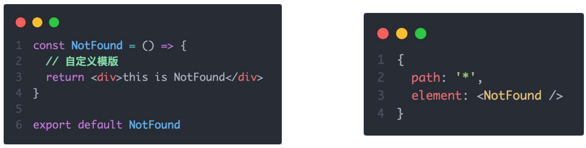


### 两种路由模式

#### 1、关于路由模式

各个主流框架的路由常用的路由模式有俩种，`history模式和hash模式`, ReactRouter分别由 createBrowerRouter 和 createHashRouter 函数负责创建。

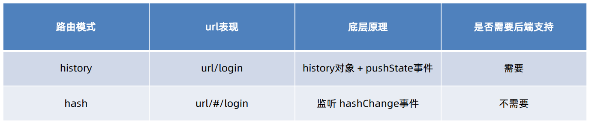


### 案例：记账本

#### 1、功能演示和环境搭建

##### 1.1 功能演示

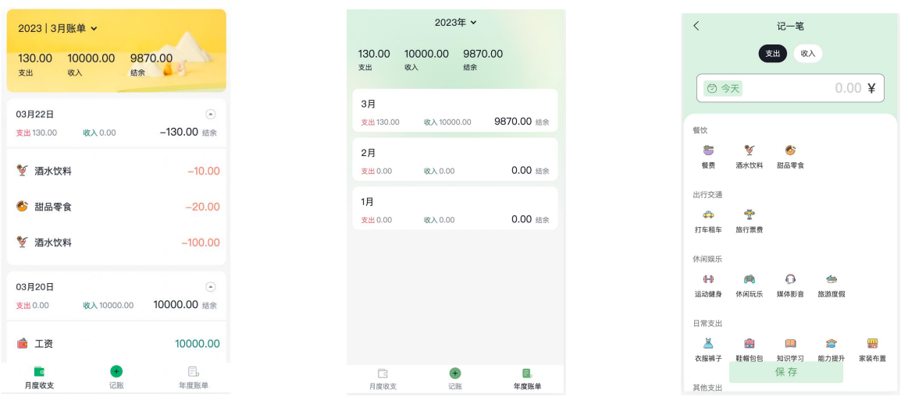


##### 1.2 环境搭建

**使用CRA创建项目，并安装必要依赖**，包括下列基础包。

1. Redux状态管理 - @reduxjs/toolkit、react-redux
2. 路由 - react-router-dom
3. 时间处理 - dayjs
4. class类名处理 - classnames
5. 移动端组件库 - antd-mobile
6. http请求插件 - axios


#### 2、配置别名路径@

##### 2.1 别名路径配置

别名路径配置有两种方式：

1. 路径解析配置（webpack），把`@/`解析为`src/`。
2. 路径联想配置（VsCode），VsCode 在输入 `@/` 时，自动联想出来对应的 `src/`下的子级目录。

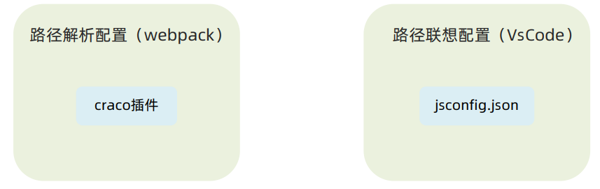


##### 2.2 路径解析配置

CRA本身把webpack配置包装到了黑盒里无法直接修改，需要借助一个插件 - `craco`。

配置步骤：

1. 安装craco

```bash
npm i -D @craco/craco
```

2. 项目根目录下创建配置文件`craco.config.js`

3. 配置文件中添加路径解析配置
4. 包文件中配置启动和打包命令

```js
const path = require('path')

module.exports = {
    // webpack配置
    webpack:{
        // 配置别名
        alias:{
            // 约定：使用@ 表示src文件所在路径
            '@':path.resolve(__dirname,'src')
        }
    }
}
```

```json
"scripts":{
    "start":"craco start",
    "build":"craco build"
}
```


##### 2.3 联想路径配置

VsCode的联想配置，需要我们在项目目录下添加 `jsconfig.json` 文件，加入配置之后VsCode会自动读取配置帮助我们 自动联想提示。

配置步骤：

1. 根目录下新增配置文件 - jsconfig.json
2. 添加路径提示配置

```js
{
	"compilerOptions":{
        "baseUrl":"./",
        "paths":{
            "@/*":[
                "src/*"
            ]
        }
    }
}
```


#### 3、Mock数据实现

##### 3.1 mock数据？

在前后端分类的开发模式下，前端可以在没有实际后端接口的支持下先进行接口数据的模拟，进行正常的业务功能开发。

市场常见的Mock方式

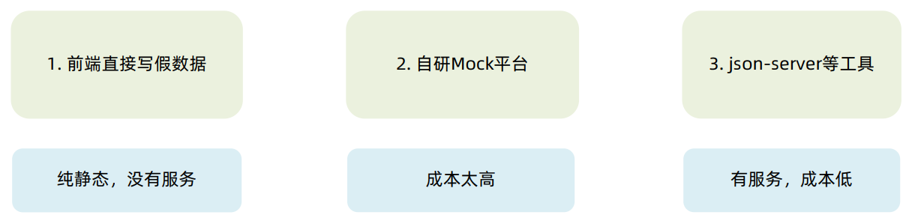


##### 3.2 json-server实现数据mock

json-server是一个node包，可以在不到 30 秒内获得零编码的完整的Mock服务。

实现步骤：

1. 项目中安装`json-server`包

```
npm i -D json-server
```

2. 准备一个json文件（包含数据）

3. 添加启动命令`package.json`

```json
"server":"json server ./server/data.json --port 8888"
```

4. 访问接口进行测试


#### 4、整体路由设计

#### 4.1 路由设计

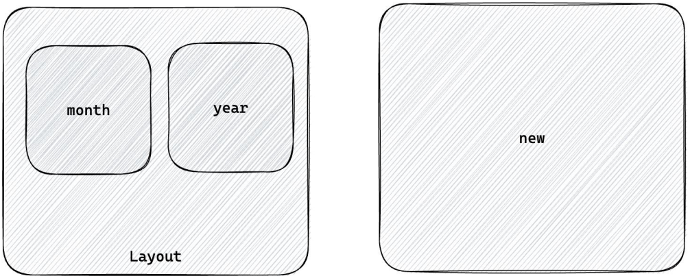

根据页面分析，大致我们可以将其分为四个组件：

* Month、Year、Layout、New
* App组件包裹所有的组件

路由设计：

1. 一级路由：Layout/New
2. 二级路由：Layout>Month/Year


#### 5、antD-mobile主题定制

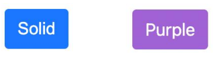

定制方案：

1. 全局定制：整个应用范围内的组件都生效。

2. 局部定制：只在某些元素内部的组件生效。

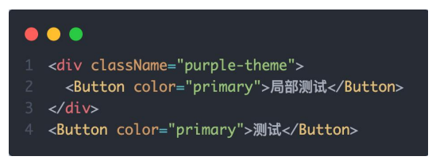

实现方式：

```css
:root:root{
    --adm-color-primary:#a062d4;
}
```

```css
.purple-theme{
	--adm-color-primary:#a062d4;
}
```


#### 6、Redux管理账目列表

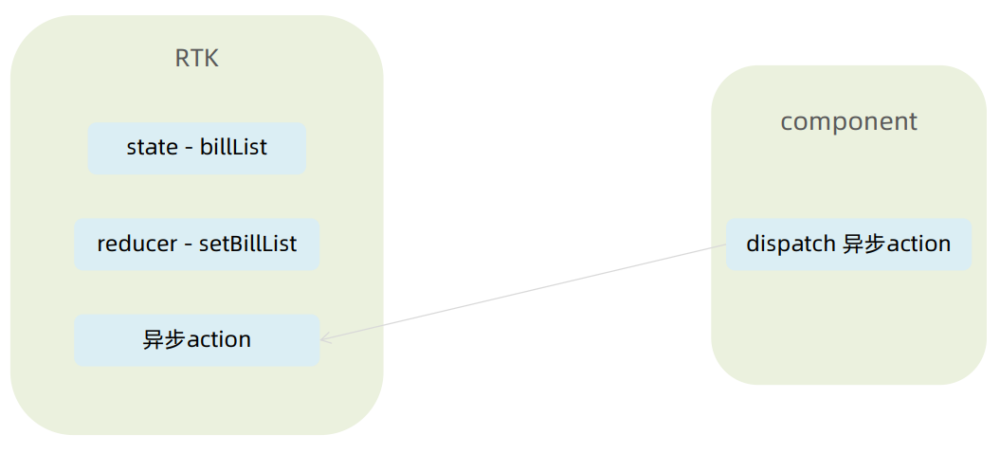

解释：

* state-biilList — 记账记录数据。`biilStore`
* reducer-setBillList  — 同步action 获取记录数据，给biilList 赋初值。`biilStore`
* 异步action — 操作同步action来更改state 。     `biilStore`
* dispatch — 在组件中操作store中的异步action来更改数据。数据的更新 => UI重新渲染


#### 7、TabBar功能实现

##### 7.1 需求理解

需求：使用antD的`TabBar标签栏组件`进行布局以及路由的切换。

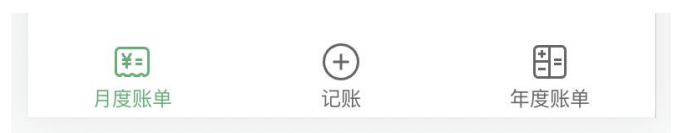

实现方式：`看文档（找到相似Demo-复制代码跑通-定制化修改）`。

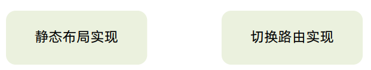


##### 7.2 实现功能

###### 静态布局

```jsx
import { TabBar } from "antd-mobile"
import { useEffect } from "react"
import { Outlet } from "react-router-dom"
import { useDispatch } from 'react-redux'
import { getBillList } from "@/store/modules/billStore"
import './index.scss'
import {
  BillOutline,
  CalculatorOutline,
  AddCircleOutline
} from 'antd-mobile-icons'

const tabs = [
  {
    key: '/month',
    title: '月度账单',
    icon: <BillOutline />,
  },
  {
    key: '/new',
    title: '记账',
    icon: <AddCircleOutline />,
  },
  {
    key: '/year',
    title: '年度账单',
    icon: <CalculatorOutline />,
  },
]

const Layout = () => {
  const dispatch = useDispatch()
  useEffect(() => {
    dispatch(getBillList())
  }, [dispatch])
  return (
    <div className="layout">
      <div className="container">
        <Outlet />
      </div>
      <div className="footer">
        <TabBar>
          {tabs.map(item => (
            <TabBar.Item key={item.key} icon={item.icon} title={item.title} />
          ))}
        </TabBar>
      </div>
    </div>
  )
}

export default Layout
```

###### 路由切换

```jsx
import {useNavigate} from 'react-router-dom'

const Layout = ()=>{
    ... 
    const navigate = useNavigate()
    const switchRoute = (path)=>{
        navigate(path)
    }
    return (
    	...
         <TabBar>
          {tabs.map(item => (
            <TabBar.Item key={item.key} icon={item.icon} title={item.title} />
          ))}
        </TabBar>
    )
}
```


#### 8、月度账单

##### 8.1 统计区域

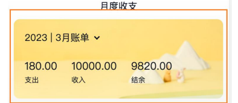

功能点： 

1. 点击切换月份 
2. 适配箭头显示 
3. 统计支出、收入、结余数据

###### 静态布局

```jsx
import { NavBar, DatePicker } from 'antd-mobile'
import './index.scss'

const Month = () => {
  return (
    <div className="monthlyBill">
      <NavBar className="nav" backArrow={false}>
        月度收支
      </NavBar>
      <div className="content">
        <div className="header">
          {/* 时间切换区域 */}
          <div className="date">
            <span className="text">
              2023 | 3月账单
            </span>
            <span className='arrow expand'></span>
          </div>
          {/* 统计区域 */}
          <div className='twoLineOverview'>
            <div className="item">
              <span className="money">{100}</span>
              <span className="type">支出</span>
            </div>
            <div className="item">
              <span className="money">{200}</span>
              <span className="type">收入</span>
            </div>
            <div className="item">
              <span className="money">{200}</span>
              <span className="type">结余</span>
            </div>
          </div>
          {/* 时间选择器 */}
          <DatePicker
            className="kaDate"
            title="记账日期"
            precision="month"
            visible={false}
            max={new Date()}
          />
        </div>
      </div>
    </div >
  )
}

export default Month
```

```css
.monthlyBill {
    // 声明变量—css中的声明方式
    --bill-text-color: #191d26;
    height: 100%;
    background-color: rgba(245, 245, 245, 0.9);
    // 使用变量
    color: var(--bill-text-color);

    .nav {
        --adm-font-size-10: 16px;
        color: #121826;
        background-color: transparent;

        .adm-nav-bar-back-arrow {
            font-size: 20px;
        }
    }

    .content {
        height: 573px;
        padding: 0 10px;
        overflow: scroll;
        -ms-overflow-style: none;
        /* Internet Explorer 10+ */
        scrollbar-width: none;

        /* Firefox */
        &::-webkit-scrollbar {
            display: none;
            /* Safari and Chrome */
        }

        >.header {
            height: 135px;
            padding: 20px 20px 20px 18.5px;
            margin-bottom: 10px;
            background-image: url(https://zqran.gitee.io/images/ka/month-bg.png);
            background-size: cover;

            .date {
                display: flex;
                align-items: center;
                margin-bottom: 25px;
                font-size: 16px;

                .arrow {
                    display: inline-block;
                    width: 7px;
                    height: 7px;
                    margin-top: -3px;
                    margin-left: 9px;
                    border-top: 2px solid #121826;
                    border-left: 2px solid #121826;
                    transform: rotate(225deg);
                    transform-origin: center;
                    transition: all 0.3s;
                }

                .arrow.expand {
                    transform: translate(0, 2px) rotate(45deg);
                }
            }

            .twoLineOverview {
                display: flex;
                justify-content: space-around;

                >.item {
                    display: flex;
                    flex-direction: column;

                    >.money {
                        height: 24px;
                        line-height: 24px;
                        margin-bottom: 5px;
                        font-size: 18px;
                    }

                    >.type {
                        height: 14px;
                        line-height: 14px;
                        font-size: 12px;
                    }
                }
            }
        }
    }
}
```

###### 切换弹框实现

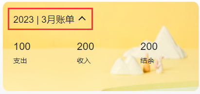

功能要求：

1. 点击上图框中位置打开时间选择弹框 
2. 点击取消/确认按钮以及蒙层区域都可以关闭弹框 
3. 弹框关闭时箭头朝下，打开是箭头朝上

基本思路：

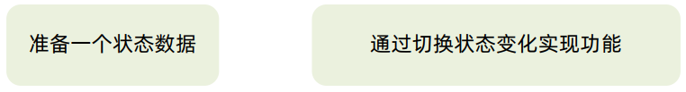

代码：

* 原生JS操作类+react-useRef获取dom

```jsx
// 1.选择时间功能
// 控制DatePick打开和关闭，默认是false=>关闭
const [dateVisible,setDateVisible] = useState(false)
// 开启弹框=>切换时间的触发事件
const arrowRef = useRef(null)
const setDate = ()=>{
    // 时间弹框开启时箭头指向
    arrowRef.current.classList.add('expand')
    // 弹框开启
    setDateVisible(true)
}
// 弹框取消/关闭时触发事件
const closeDatePick = ()=>{
    setDateVisible(false)
    // 时间弹框关闭时箭头指向
    arrowRef.current.classList.remove('expand')
}

{/* 时间切换区域 */}
<div className="date" onClick={setDate}>
    <span className="text">
        2023 | 3月账单
    </span>
    <span className='arrow' ref={arrowRef}></span>
</div>

<DatePicker
    className="kaDate"
    title="记账日期"
    precision="month"
    visible={dateVisible}
    onClose={closeDatePick}
    max={new Date()}
    />
```

* classnames库解决

```jsx
const setDate = ()=>{
    // 弹框开启
    setDateVisible(true)
}
// 弹框取消/关闭时触发事件
const closeDatePick = ()=>{
    setDateVisible(false)
}


{/* 时间切换区域 */}
<div className="date" onClick={setDate}>
    <span className="text">
        2023 | 3月账单
    </span>
    <span className=className={classNames('arrow', {'expand':dateVisible})} ></span>
</div>
```

###### 切换时间显示

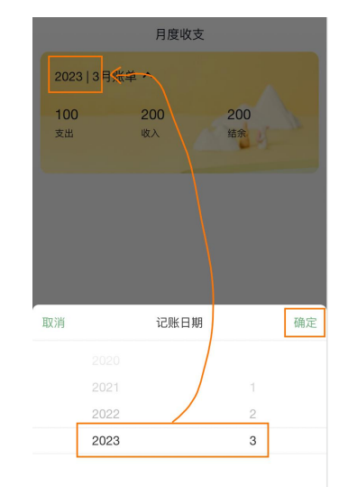

基础思路：

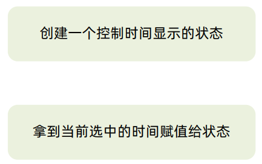

代码：

```jsx
import dayjs from 'dayjs'

const [currentDate, setCurrentDate] = useState(() => dayjs(new Date()).format('YYYY-MM'))
const onConfirm = (value) => {
    const formatDate = dayjs(value).format('YYYY-MM')
    setCurrentDate(formatDate)
}


{/* 时间切换区域 */}
<div className="date" onClick={setDate}>
    <span className="text">
        {currentDate}月账单
    </span>
    <span className={classNames('arrow', { 'expand': dateVisible })} ></span>
</div>

 {/* 时间选择器 */}
<DatePicker
    className="kaDate"
    title="记账日期"
    precision="month"
    visible={dateVisible}
    onClose={closeDatePick}
    max={new Date()}
    onConfirm={onConfirm}
    />
```

###### 账单数据按月分组实现

问题：为什么要按月分组？

> 记账本案例大功能分为三个模块：月度账单、添加账单、年度账单。
>
> 其中月度账单需要根据每一个月收入支出数据来计算**总的支出、总的收入、结余**。
>
> 并且，当前后端返回的数据是简单平铺的，不是按月份划分好的，而我们要做的功能是以月为单位的统计。

拿到的数据格式：

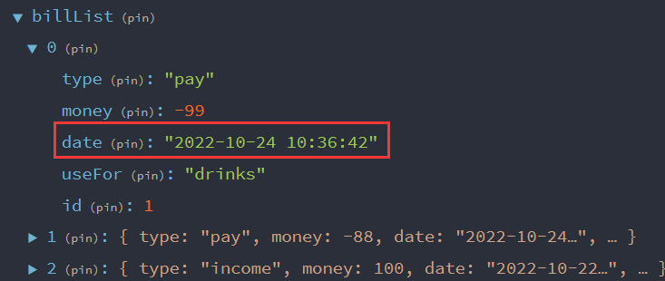

我们要做的就是根据其中的`date`属性来对数据进行分组。

实现步骤：

1. 从Redux拿到数据

2. 数据的二次处理(`useMemo`)

   > `useMemo` 是一个 React Hook，它在每次重新渲染的时候能够缓存计算的结果，类似于Vue中的`computed`。

3. 按月份分组逻辑实现(`lodash`)

   > 这里我们用到了第三方库lodash，这是为了加快开发效率。其实自己也是可以编写原生js代码来进行分组归类的，这样实现需要更多的思考更多的时间。

代码：

```jsx
import dayjs from 'dayjs'
import { useSelector } from 'react-redux'
import _ from 'lodash'

const billList = useSelector(state=>state.bill.billList)
const monthGroup = useMemo(()=>{
    // return计算后的值
    return _.groupBy(billList, (item) => dayjs(item.date).format('YYYY-MM'))
},[billList])
```

###### 计算选中月份的统计数据

需求：点击时间确认按钮之后，把当前月的统计数据计算出来显示到页面中。

步骤：

1. 点击确认获取到当前年月(`YYYY-MM`)。
2. 再按月分组数据中找到对应数组(`数组['YYYY-MM']`)。
3. 基于找到对应的数组做计算。

例如：

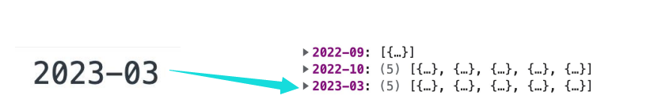

实现代码：

```jsx
const [currentMonthList, setMonthList] = useState([])
const monthResult = useMemo(() => {
    // 支出 / 收入 / 结余
    const pay = currentMonthList.filter(item => item.type === 'pay').reduce((sum, item) => sum + item.money, 0)
    const income = currentMonthList.filter(item => item.type === 'income').reduce((sum, item) => sum + item.money, 0)

    // 返回
    return {
        pay,
        income,
        total: pay + income
    }
},[currentMonthList])

const onConfirm = (value) => {
    const formatDate = dayjs(value).format('YYYY-MM')
    setCurrentDate(formatDate)
    // 4.1 拿到月份分组中的数据
    // state更新数据是异步的，在同步代码执行之前，异步都不会执行
    setMonthList(monthGroup[formatDate] || [])
}

 <div className='twoLineOverview'>
    <div className="item">
        <span className="money">{monthResult.pay}</span>
        <span className="type">支出</span>
    </div>
    <div className="item">
        <span className="money">{monthResult.income}</span>
        <span className="type">收入</span>
    </div>
    <div className="item">
        <span className="money">{monthResult.total}</span>
        <span className="type">结余</span>
    </div>
</div>
```

###### 月度初始化时渲染统计数据

需求：打开月度账单时，把当前月份的统计数据渲染到页面中。

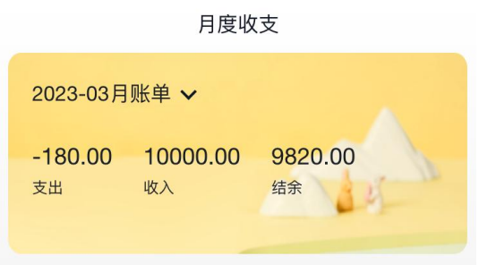

实现步骤：

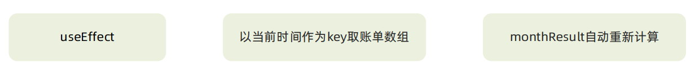

实现代码：

```jsx
// 初始化月度统计数据
useEffect(() => {
    const newDate = dayjs().format('YYYY-MM')
    if (monthGroup[newDate]) {
        setMonthList(monthGroup[newDate])
    }
}, [monthGroup])
```


##### 8.2 列表区域

######  单日列表显示

需求：把当前月的账单数据以单日为单位进行统计显示。

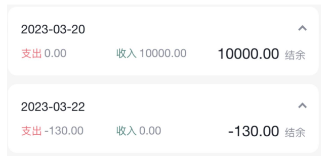

> 该需求跟按月来分组同理。

实现步骤：

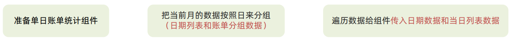

实现代码：

`Month`

```jsx
// 将当前选中月份中按日进行分组
const dayGroup = useMemo(() => {
    const groupData = _.groupBy(currentMonthList, (item) => {
        return dayjs(item.date).format('YYYY-MM-DD'))
    })
    const keys = Object.keys(groupData)
    // 当前选中月份每天数据 + 每天的key(YYYY-MM-DD)
    return {
        groupData,
        keys
    }
}, [currentMonthList])

// 视图渲染
{/* 单日列表 */}
{
    dayGroup.keys.map(key=>{
        return <DailyBill date={key} billList={dayGroup.groupData[key]}/>
    })
}
```

`Month/components/DayBill/index.js`

```jsx
import classNames from 'classnames'
import { useMemo } from 'react'
import './index.scss'

const DailyBill = ({ date, billList }) => {
    // 1.计算月份统计数据 (返回统计数据)
    const dayResult = useMemo(() => {
        // 支出 / 收入 / 结余
        const pay = billList.filter(item => item.type === 'pay').reduce((sum, item) => sum + item.money, 0)
        const income = billList.filter(item => item.type === 'income').reduce((sum, item) => sum + item.money, 0)
        // 返回
        return {
            pay,
            income,
            total: pay + income
        }
    }, [billList])


    return (
        <div className={classNames('dailyBill')}>
            <div className="header">
                <div className="dateIcon">
                    <span className="date">{date}</span>
                    <span className={classNames('arrow')}></span>
                </div>
                <div className="oneLineOverview">
                    <div className="pay">
                        <span className="type">支出</span>
                        <span className="money">{dayResult.pay.toFixed(2)}</span>
                    </div>
                    <div className="income">
                        <span className="type">收入</span>
                        <span className="money">{dayResult.income.toFixed(2)}</span>
                    </div>
                    <div className="balance">
                        <span className="money">{dayResult.total.toFixed(2)}</span>
                        <span className="type">结余</span>
                    </div>
                </div>
            </div>


        </div>
    )
}
export default DailyBill
```

`Month/components/DayBill/index.scss`

```jsx
.dailyBill {
    margin-bottom: 10px;
    border-radius: 10px;
    background: #ffffff;

        .header {
            --ka-text-color: #888c98;
            padding: 15px 15px 10px 15px;

            .dateIcon {
                display: flex;
                justify-content: space-between;
                align-items: center;
                height: 21px;
                margin-bottom: 9px;

                .arrow {
                    display: inline-block;
                    width: 5px;
                    height: 5px;
                    margin-top: -3px;
                    margin-left: 9px;
                    border-top: 2px solid #888c98;
                    border-left: 2px solid #888c98;
                    transform: rotate(225deg);
                    transform-origin: center;
                    transition: all 0.3s;
                }

                .arrow.expand {
                    transform: translate(0, 2px) rotate(45deg);
                }

                .date {
                    font-size: 14px;
                }
            }
        }

    .oneLineOverview {
        display: flex;
        justify-content: space-between;

        .pay {
            flex: 1;

            .type {
                font-size: 10px;
                margin-right: 2.5px;
                color: #e56a77;
            }

            .money {
                color: var(--ka-text-color);
                font-size: 13px;
            }
        }

        .income {
            flex: 1;

            .type {
                font-size: 10px;
                margin-right: 2.5px;
                color: #4f827c;
            }

            .money {
                color: var(--ka-text-color);
                font-size: 13px;
            }
        }

        .balance {
            flex: 1;
            margin-bottom: 5px;
            text-align: right;

            .money {
                line-height: 17px;
                margin-right: 6px;
                font-size: 17px;
            }

            .type {
                font-size: 10px;
                color: var(--ka-text-color);
            }
        }
    }

    .billList {
        padding: 15px 10px 15px 15px;
        border-top: 1px solid #ececec;

            .bill {
                display: flex;
                justify-content: space-between;
                align-items: center;
                height: 43px;
                margin-bottom: 15px;

                &:last-child {
                    margin-bottom: 0;
                }

                .icon {
                    margin-right: 10px;
                    font-size: 25px;
                }

                .detail {
                    flex: 1;
                    padding: 4px 0;

                    .billType {
                        display: flex;
                        align-items: center;
                        height: 17px;
                        line-height: 17px;
                        font-size: 14px;
                        padding-left: 4px;
                    }
                }

                .money {
                    font-size: 17px;

                    &.pay {
                        color: #ff917b;
                    }

                    &.income {
                        color: #4f827c;
                    }
                }
            }
    }
}

.dailyBill.expand {
    .header {
        border-bottom: 1px solid #ececec;
    }

    .billList {
        display: block;
    }
}
```

###### 单日账单列表显示

需求：把单日的账单列表渲染到视图中。

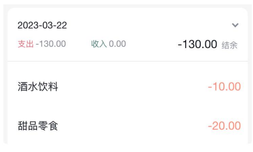

实现步骤：

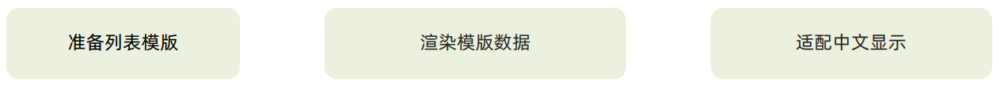

1. 列表模板 & 渲染数据。

```jsx
{/* 单日列表 */}
<div className="billList">
  {billList.map(item => {
    return (
      <div className="bill" key={item.id}>
        <div className="detail">
          <div className="billType">{item.useFor}</div>
        </div>
        <div className={classNames('money', item.type)}>
          {item.money.toFixed(2)}
        </div>
      </div>
    )
  })}
</div>
```

2. 中文适配，在`src/contant`创建适配中文文件`billList.js`。

```jsx
export const billListData = {
  pay: [
    {
      type: 'foods',
      name: '餐饮',
      list: [
        { type: 'food', name: '餐费' },
        { type: 'drinks', name: '酒水饮料' },
        { type: 'dessert', name: '甜品零食' },
      ],
    },
    {
      type: 'taxi',
      name: '出行交通',
      list: [
        { type: 'taxi', name: '打车租车' },
        { type: 'longdistance', name: '旅行票费' },
      ],
    },
    {
      type: 'recreation',
      name: '休闲娱乐',
      list: [
        { type: 'bodybuilding', name: '运动健身' },
        { type: 'game', name: '休闲玩乐' },
        { type: 'audio', name: '媒体影音' },
        { type: 'travel', name: '旅游度假' },
      ],
    },
    {
      type: 'daily',
      name: '日常支出',
      list: [
        { type: 'clothes', name: '衣服裤子' },
        { type: 'bag', name: '鞋帽包包' },
        { type: 'book', name: '知识学习' },
        { type: 'promote', name: '能力提升' },
        { type: 'home', name: '家装布置' },
      ],
    },
    {
      type: 'other',
      name: '其他支出',
      list: [{ type: 'community', name: '社区缴费' }],
    },
  ],
  income: [
    {
      type: 'professional',
      name: '其他支出',
      list: [
        { type: 'salary', name: '工资' },
        { type: 'overtimepay', name: '加班' },
        { type: 'bonus', name: '奖金' },
      ],
    },
    {
      type: 'other',
      name: '其他收入',
      list: [
        { type: 'financial', name: '理财收入' },
        { type: 'cashgift', name: '礼金收入' },
      ],
    },
  ],
}

export const billTypeToName = Object.keys(billListData).reduce((prev, key) => {
  billListData[key].forEach(bill => {
    bill.list.forEach(item => {
      prev[item.type] = item.name
    })
  })
  return prev
}, {})
```

3. 在`DayBill`中使用该适配。

```jsx
import { billTypeToName } from '@/contant/billList'

// 渲染
<div className="billList">
    {billList.map(item => {
        return (
            <div className="bill" key={item.id}>
                <div className="detail">
                    <div className="billType">{billTypeToName[item.useFor]}</div>
                </div>
                <div className={classNames('money', item.type)}>
                    {item.money.toFixed(2)}
                </div>
            </div>
        )
    })}
</div>
```

###### 点击切换显示

需求：点击展开收起箭头，切换账单列表显示。

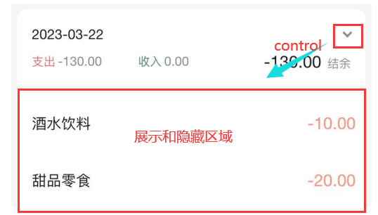

实现步骤：

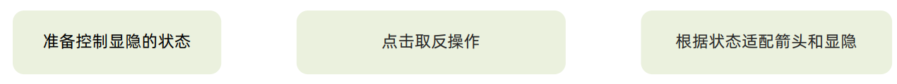

代码实现：

```jsx
// 声明状态
const [visible, setVisible] = useState(false)

{/* 类样式控制 */}
<div className="dateIcon">
    <span className="date">{date}</span>
    {/* expand，有这个类名箭头朝上*/}
	<span 
        className={classNames('arrow', visible && 'expand')} 
        onClick={()=>setVisible(!visible)}>
	</span>
</div>

{/* 列表显示和隐藏 */}
<div className="billList" style={{ 'display': visible ? 'block' : 'none' }}>
	...
</div>
```

###### 账单类型图标组件封装

需求：封装一个图标组件，可以根据不同的账单类型显示不同的图标。

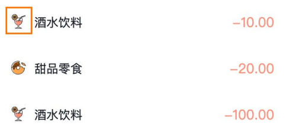

实现步骤：

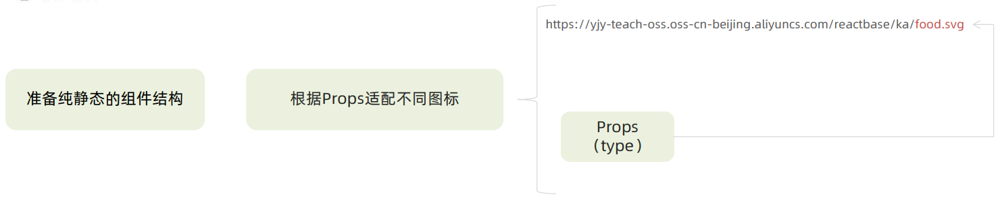

> 从https://yjy-teach-oss.oss-cn-beijing.aliyuncs.com/reactbase/ka/food.svg获取图标。

1. 创建结构。`src/components/Icon/index.js`

```jsx
const Icon = () => {
  return (
    
  )
}

export default Icon
```

2. 根据Props适配不同图标。

```jsx
// 设置基地址
const BASE_URL = 'https://yjy-teach-oss.oss-cn-beijing.aliyuncs.com/reactbase/ka/'

const Icon = ({type}) => {
    return (
        
    )
}
export default Icon
```

`DayBill`

 ```jsx
<div className="billList" style={{ 'display': visible ? 'block' : 'none' }}>
    {billList.map(item => {
        return (
            <div className="bill" key={item.id}>
                {/* 渲染图标 */}
                <Icon type={item.useFor}/>
                <div className="detail">
                    <div className="billType">{billTypeToName[item.useFor]}</div>
                </div>
                <div className={classNames('money', item.type)}>
                    {item.money.toFixed(2)}
                </div>
            </div>
        )
    })}
</div>
 ```


#### 9、新增账单

##### 9.1 功能分析 & 静态结构

###### 功能分析

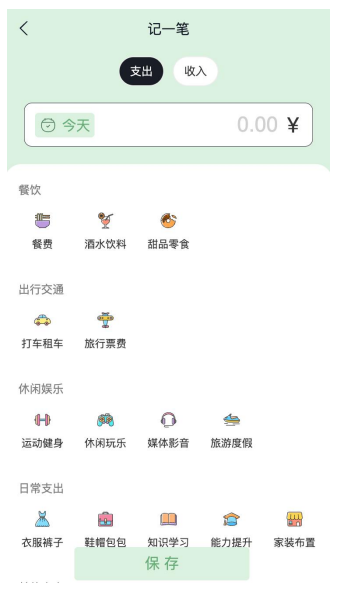

1. 不同类型的账单列表渲染
2. 支出和收入两种状态切换
3. 点击保存实现记账功能

> 圣杯布局、双飞翼布局

###### 静态结构

```jsx
import { Button, DatePicker, Input, NavBar } from 'antd-mobile'
import Icon from '@/components/Icon'
import './index.scss'
import classNames from 'classnames'
import { billListData } from '@/contant/billList'
import { useNavigate } from 'react-router-dom'

const New = () => {
    const navigate = useNavigate()
    return (
        <div className="keepAccounts">
            {/* 页面介绍 */}
            <NavBar className="nav" onBack={() => navigate(-1)}>
                记一笔
            </NavBar>


            <div className="header">
                {/* 账单类型 */}
                <div className="kaType">
                    <Button
                        shape="rounded"
                        className={classNames('selected')}
                        >
                        支出
                    </Button>
                    <Button
                        className={classNames('')}
                        shape="rounded"
                        >
                        收入
                    </Button>
                </div>

                <div className="kaFormWrapper">
                    <div className="kaForm">
                        <div className="date">
                            <Icon type="calendar" className="icon" />
                            <span className="text">{'今天'}</span>
                            <DatePicker
                                className="kaDate"
                                title="记账日期"
                                max={new Date()}
                                />
                        </div>
                        <div className="kaInput">
                            <Input
                                className="input"
                                placeholder="0.00"
                                type="number"
                                />
                            <span className="iconYuan">¥</span>
                        </div>
                    </div>
                </div>
            </div>

            <div className="kaTypeList">
                {billListData['pay'].map(item => {
                    return (
                        <div className="kaType" key={item.type}>
                            <div className="title">{item.name}</div>
                            <div className="list">
                                {item.list.map(item => {
                                    return (
                                        <div
                                            className={classNames(
                                                'item',
                                                ''
                                            )}
                                            key={item.type}

                                            >
                                            <div className="icon">
                                                <Icon type={item.type} />
                                            </div>
                                            <div className="text">{item.name}</div>
                                        </div>
                                    )
                                })}
                            </div>
                        </div>
                    )
                })}
            </div>

            <div className="btns">
                <Button className="btn save">
                    保 存
                </Button>
            </div>
        </div>
    )
}

export default New
```

```scss
.keepAccounts {
    --ka-bg-color: #daf2e1;
    --ka-color: #69ae78;
    --ka-border-color: #191d26;

    height: 100%;
    background-color: var(--ka-bg-color);

    .nav {
        --adm-font-size-10: 16px;
        color: #121826;
        background-color: transparent;

        &::after {
            height: 0;
        }

        .adm-nav-bar-back-arrow {
            font-size: 20px;
        }
    }

    .header {
        height: 132px;

        .kaType {
            padding: 9px 0;
            text-align: center;

            .adm-button {
                --adm-font-size-9: 13px;

                &:first-child {
                    margin-right: 10px;
                }
            }

            .selected {
                color: #fff;
                --background-color: var(--ka-border-color);
            }
        }

        .kaFormWrapper {
            padding: 10px 22.5px 20px;

            .kaForm {
                display: flex;
                padding: 11px 15px 11px 12px;
                border: 0.5px solid var(--ka-border-color);
                border-radius: 9px;
                background-color: #fff;

                .date {
                    display: flex;
                    align-items: center;
                    height: 28px;
                    padding: 5.5px 5px;
                    border-radius: 4px;
                    // color: #4f825e;
                    color: var(--ka-color);
                    background-color: var(--ka-bg-color);

                    .icon {
                        margin-right: 6px;
                        font-size: 17px;
                    }

                    .text {
                        font-size: 16px;
                    }
                }

                .kaInput {
                    flex: 1;
                    display: flex;
                    align-items: center;

                    .input {
                        flex: 1;
                        margin-right: 10px;
                        --text-align: right;
                        --font-size: 24px;
                        --color: var(--ka-color);
                        --placeholder-color: #d1d1d1;
                    }

                    .iconYuan {
                        font-size: 24px;
                    }
                }
            }
        }
    }

    .container {}

    .kaTypeList {
        height: 490px;
        padding: 20px 11px;
        padding-bottom: 70px;
        overflow-y: scroll;
        background: #ffffff;
        border-radius: 20px 20px 0 0;
        -ms-overflow-style: none;
        /* Internet Explorer 10+ */
        scrollbar-width: none;

        /* Firefox */
        &::-webkit-scrollbar {
            display: none;
            /* Safari and Chrome */
        }

        .kaType {
            margin-bottom: 25px;
            font-size: 12px;
            color: #333;

            .title {
                padding-left: 5px;
                margin-bottom: 5px;
                font-size: 13px;
                color: #808080;
            }

            .list {
                display: flex;

                .item {
                    width: 65px;
                    height: 65px;
                    padding: 9px 0;
                    margin-right: 7px;
                    text-align: center;
                    border: 0.5px solid #fff;

                    &:last-child {
                        margin-right: 0;
                    }

                    .icon {
                        height: 25px;
                        line-height: 25px;
                        margin-bottom: 5px;
                        font-size: 25px;
                    }
                }

                .item.selected {
                    border: 0.5px solid var(--ka-border-color);
                    border-radius: 5px;
                    background: var(--ka-bg-color);
                }
            }
        }
    }

    .btns {
        position: fixed;
        bottom: 15px;
        width: 100%;
        text-align: center;

        .btn {
            width: 200px;
            --border-width: 0;
            --background-color: #fafafa;
            --text-color: #616161;

            &:first-child {
                margin-right: 15px;
            }
        }

        .btn.save {
            --background-color: var(--ka-bg-color);
            --text-color: var(--ka-color);
        }
    }
}
```


##### 9.2 支出和收入切换功能实现

`page/New`

步骤：

1. 准备控制支出收入的状态。

```jsx
import {useState} from 'react'

// 状态state设置默认为 pay
const [type,setType] = useState('pay')
```

2. 点击按钮切换状态(分为样式和代码)

```jsx
const toggleType = (type) =>{
    // 切换状态 
    setType(type)
}

<div className="kaType">
    <Button
        shape="rounded"
        // 样式切换
        className={classNames(type === 'pay' && 'selected')}
        onClick={() => toogleType('pay')}
        >
        支出
    </Button>
    <Button
        // 样式切换
        className={classNames({ 'selected': type === 'income' })}
        shape="rounded"
        onClick={() => toogleType('income')}
        >
        收入
    </Button>
</div>
```

3. 切换状态后数据重新渲染

```jsx
<div className="kaTypeList">
    {billListData[type].map(item => {
        ...
    })}
</div>
```


##### 9.3 实现新增账单功能

需求：点击保存按钮新增账单。

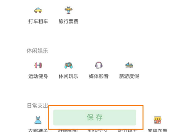

实现步骤：

1. 收集数据需要提交的数据。

```jsx
// 数据要求格式
const obj = {
	type:'',	// 账单类型 支出 or 收入
    money:'',	// 账单金额 收入为正、支出为负
    date:'',	// 记账时间 当前记账的时间
    useFor:''	// 账单type 收入或支出来源
}
```

2. 在Redux编写新增异步函数。

3. 点击保存提交action。

`New/index.js`

```jsx
...
import { useState } from 'react'
import dayjs from 'dayjs'
import { insertBill } from '@/store'
import { useDispatch } from 'react-redux'

const New = () => {
    const navigate = useNavigate()
    // 1.切换支出和收入
    ...
    
    // 2.新增账单
    // 2.1 准备需要提交的数据model
    const [bill, setBill] = useState({
        type: Billtype,
        money: 0,
        date: '',
        useFor: '',
    })

    // 2.2 修改账单提交时间
    // 时间选择器显示状态
    const [visible, setVisible] = useState(false)
    // 选中的时间
    const [nowDate, setDate] = useState(dayjs().format('YYYY-MM-DD'))
    const handleChangeDate = (date) => {
        setDate(dayjs(date).format('YYYY-MM-DD'))
        // if (dayjs().format('YYYY-MM-DD') === nowDate){
        //     setBill({ ...bill, date: new Date().toISOString() })
        // }else{
        //     setBill({ ...bill, date: date.toISOString() })
        // }
        setBill({ ...bill, date: date.toISOString() })
    }

    // 2.3 设定支出/收入money
    const getMoney = (e) => {
        if (Billtype === 'pay') {
            setBill({ ...bill, money: -e.target.value})
        } else {
            setBill({ ...bill, money: +e.target.value})
        }
    }

    // 2.4 选择支出/消费来源 useFor
    const [useFor, setUseFor] = useState('')
    const handleUserFor = (e) => {
        // 阻止冒泡
        // e.stopPropagation()
        // console.log(e.target)

        // 第二种方式：
        // console.log(e.currentTarget.dataset)
        const { type } = e.currentTarget.dataset
        setUseFor(type)
        setBill({...bill,useFor:type})
    }

    // 2.5 新增账单
    const dispatch = useDispatch()
    const addBill = () => {
        if(!bill.date){
            bill.date = new Date().toISOString()
        }
        // 新增账单
        dispatch(insertBill(bill))
    }
    return (
        <div className="keepAccounts">
            {/* 页面介绍 */}
            <NavBar className="nav" onBack={() => navigate(-1)}>
                记一笔
            </NavBar>


            <div className="header">
                {/* 账单类型 */}
                <div className="kaType">
                    <Button
                        shape="rounded"
                        // 样式切换
                        className={classNames(Billtype === 'pay' && 'selected')}
                        onClick={() => toogleType('pay')}
                        >
                        支出
                    </Button>
                    <Button
                        // 样式切换
                        className={classNames({ 'selected': Billtype === 'income' })}
                        shape="rounded"
                        onClick={() => toogleType('income')}
                        >
                        收入
                    </Button>
                </div>

                <div className="kaFormWrapper">
                    <div className="kaForm">
                        <div className="date" onClick={() => setVisible(true)}>
                            <Icon type="calendar" className="icon" />
                            <span className="text">{dayjs().format('YYYY-MM-DD') === nowDate ? '今天' : nowDate}</span>
                            <DatePicker
                                visible={visible}
                                className="kaDate"
                                title="记账日期"
                                max={new Date()}
                                onClose={() => setVisible(false)}
                                onConfirm={handleChangeDate}
                                />
                        </div>
                        <div className="kaInput">
                            <Input
                                className="input"
                                placeholder="0.00"
                                type="number"
                                onBlur={getMoney}
                                />
                            <span className="iconYuan">¥</span>
                        </div>
                    </div>
                </div>
            </div>

            <div className="kaTypeList">
                {billListData[Billtype].map(item => {
                    return (
                        <div className="kaType" key={item.type}>
                            <div className="title" >{item.name}</div>
                            <div className="list">
                                {item.list.map(item => {
                                    return (
                                        <div
                                            className={classNames(
                                                'item',
                                                { 'selected': useFor === item.type}
                                            )}
                                            key={item.type}
                                            data-type={item.type}
                                            onClick={handleUserFor}
                                            >
                                            <div className="icon">
                                                <Icon type={item.type} />
                                            </div>
                                            <div className="text">{item.name}</div>
                                        </div>
                                    )
                                })}
                            </div>
                        </div>
                    )
                })}
            </div>

            <div className="btns">
                <Button className="btn save" onClick={addBill}>
                    保 存
                </Button>
            </div>
        </div>
    )
}

export default New
```

`store/modules/billStore.js`

```js
// 同步
addBill:(state,action)=>{
    state.billList.push(action.payload)
}

// 异步
export const insertBill = (data) =>{
    return async (dispatch)=>{
        // 编写异步请求
        const res =  await axios.post('http://localhost:3006/ka',data)
        // 触发同步事件reducer
        dispatch(addBill(res.data))
    }
}
```


### 案例记账本遇到问题

#### 1、JS事件穿透

出现原因：给父元素绑定点击事件，但是`e.target`为父元素下的一个子元素。

解决方案：

1. 给所有子元素样式添加下列样式，然后再阻止冒泡，即可获取绑定父元素的target。

2. 通过`e.currentTarget`总是获取到你绑定的元素。


