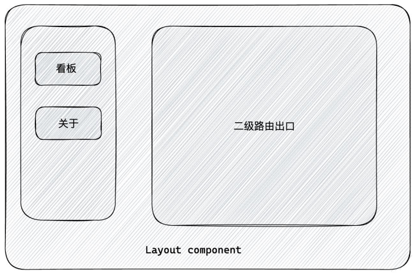

## ReactRouter—入门

### 前端路由

#### 1、什么是前端路由

一个路径 path 对应一个组件 component 当我们在浏览器中访问一个 path 的时候，path 对应的组件会在页面中进行渲染。

```jsx
const routes = [
    {
        path:'/about',
        component:About,
    },
    {
        path:'/article',
        component:Article
    }
]
```


#### 2、创建路由环境

使用路由我们还是采用CRA创建项目的方式进行基础环境配置。

1. 创建项目并安装所有依赖

```bash
npx create-react-app react-router
npm i
```

2. 安装最新的ReactRouter包

```bash
npm i react-router-dom
```

3. 启动项目

```bash
npm run start
```


#### 3、快速开始

需求：创建一个可以切换登录页和文章页的路由系统。


```jsx
import {createBrowserRouter, RouterProvider} from 'react-router-dom'

// 1.创建router实例对象并且配置路由对应关系
const router = createBrowserRouter([
  {
    path: "/login",
    element: <div>我是登录页</div>
  },{
    path:'/article',
    element: <div>我是文章页</div>
  }
])
```


### 抽象路由模块

#### 1、实际开发中的router配置

实际开发中的router配置会抽离出来，放在单独的一个文件夹当中，这样做的原因是便于后期的维护。


#### 2、抽离组件模块(page)

`page/Login`

```jsx
const Login = () => {
    return (
        <div>我是Login页面</div>
    )
}

export default Login
```


`page/Article`

```jsx
const Article = ()=>{
    return(
        <div>我是文章页面</div>
    )
}

export default Article
```


#### 3、抽离路由模块

`router/index.js`

```js
import {createBrowserRouter} from 'react-router-dom'
import Login from '../page/Login'
import Article from '../page/Article'
import App from '../App'

const router = createBrowserRouter([
    {
        path:'/',
        element:<App/>,
    },
    {
        path:'/login',
        element:<Login/>,
    },
    {
        path:'/article',
        element:<Article/>,
    }
])

export default router
```


### 路由导航

#### 1、什么是路由导航

路由系统中的多个路由之间需要进行`路由跳转`，并且在跳转的同时有可能需要`传递参数进行通信`。


#### 2、声明式导航

声明式导航是指通过在模版中通过 ` <link/> 组件描述出要跳转到哪里`去，比如后台管理系统的左侧菜单通常使用这 种方式进行。

```jsx
<link to="/article">文章</link>
```

语法说明：通过给组件的`to属性指定要跳转到路由path`，组件会被渲染为浏览器支持的a链接，如果需要传参直接`通过字符串拼接`的方式拼接参数即可。


#### 3、编程式导航

编程式导航是指通过 `useNavigate` 钩子得到导航方法，然后通过调用方法以命令式的形式进行路由跳转，比如想在 登录请求完毕之后跳转就可以选择这种方式，更加灵活。

```jsx
import { useNavigate } from 'react-router-dom'

const Login = ()=>{
    const navigate = useNavigate()
    return (
    	<div>
        	我是登录页
            <button onClick={()=> navigate('/article')}>跳转至文章</button>
        </div>
    )
}
```

语法说明：通过调用navigate方法传入地址path实现跳转。


### 导航传参

#### 1、路由导航传参方式


##### 1.1 searchParams传参

`Login/index.js`

```jsx
 {/* 跳转传参 */}
<button onClick={() => navigate('/article?id=1002&name=tom')}>跳转到文章页</button>
```

`Article/index.js`：接收参数

```jsx
import { useSearchParams } from "react-router-dom"

const Article = ()=>{
    const [params] = useSearchParams
    return(
        <div>我是文章页面
            {/* 普通传参 */}
            <p>文章ID：{params.get('id')}-{params.get('name')}</p>
        </div>
    )
}
```


##### 1.2 params传参

`router/index.js`：配置路由为动态路由

```js
{
    path:'/article/:id/:name',
    element:<Article/>,
}
```

`Login/index.js`

```jsx
 {/* 跳转传参 */}
<button onClick={() => navigate('/article/1001/tom')}>跳转到文章页</button>
```

`Article/index.js`

```jsx
import { useParams } from "react-router-dom"


const Article = ()=>{
    const params = useParams()
    return(
        <div>我是文章页面
            {/* 动态路由传参 */}
            <p>文章ID：{params.id}-{params.name}</p>
        </div>
    )
}
```


### 嵌套路由配置

#### 1、了解：什么是嵌套路由

在一级路由中又内嵌了其他路由，这种关系就叫做嵌套路由，嵌套至一级路由内的路由又称作二级路由，例如：




#### 2、实现嵌套路由配置

实现步骤：

1. . 使用 `children` 属性配置路由。
2. 使用 `<Outlet/>` 组件配置二级。


##### 2.1 创建组件

`page/Layout`

```jsx
import { Outlet,Link } from "react-router-dom"

function Layout(){

    return (
        <div>
            我是Layout页面
            <br/>
            <Link to="/layout/board">Home</Link><br/>
            <Link to="/layout/about">About</Link>

            {/* 二级路由出口 */}
            <Outlet/>
        </div>
    )
}
export default Layout
```

`page/Board`

```jsx
function Board() {

    return (
        <div>我是Board页面</div>
    )
}
export default Board
```

`page/About`

```jsx
function About() {

    return (
        <div>我是About页面</div>
    )
}
export default About
```


##### 2.2 路由配置

```js
{
    path:'/layout',
    element:<Layout/>,
    children:[
        { 
            path:'about',
            element:<About/>
        },
            { 
            path:'board',
            element:<Board/>
        }
    ]
},
```


### 默认二级路由

#### 1、场景和配置方式

当访问的是一级路由时，默认的二级路由组件可以得到渲染，只需要在二级路由的位置去掉path，设置`index属性为true`。

##### 1.1 路由配置更改

在这里我们给`Layout`下的一个子组件设置为默认二级路由。

```js
{
    path:'/layout',
    element:<Layout/>,
    children:[
        { 
            index:true,
            element:<About/>
        },
            { 
            path:'board',
            element:<Board/>
        }
    ]
},
```

> 需要注意的是：当path存在，且index属性也存在，这个时候index会失效！


##### 1.2 Layout组件修改

```jsx
function Layout(){
    return (
        <div>
            我是Layout页面
            <br/>
            <Link to="/layout">About</Link>
            <Link to="/layout/board">Board</Link><br/>

            {/* 二级路由出口 */}
            <Outlet/>
        </div>
    )
}
```

这里关于`About`跳转的路由是必须要修改的，当我们点击About链接时，他会去路由关系中找是否存在`About`相关的路由。如果此时路由关系还是`/layout/about`就会报错，因为`/layout/about`这个路由不存在。

这里我们通过修改目标路由为`/layout`，可以纠正这种错误(`/layout`的二级路由设置了默认路由，会自动跳转到它)。


#### 404路由配置

#### 1、404出现场景

当浏览器输入url的路径在整个路由配置中都找不到对应的 path，为了用户体验，可以使用 404 兜底组件进行 渲染。

实现步骤：

1. 准备一个NotFound组件
2. 在路由表数组的末尾，以*号作为路由path配置路由


### 两种路由模式

#### 1、关于路由模式

各个主流框架的路由常用的路由模式有俩种，`history模式和hash模式`, ReactRouter分别由 createBrowerRouter 和 createHashRouter 函数负责创建。


### 案例：记账本

