## React基础(续)

### 受控表单绑定

概念：使用React组件的状态（useState）控制表单的状态。

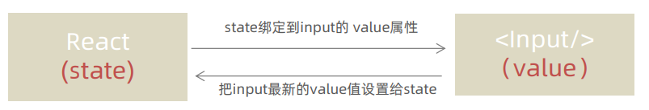

1. 准备一个React状态值

```jsx
const [value,setValue] = useState('')
```

2. 通过value属性绑定状态，通过onChange属性绑定状态同步函数

```jsx
<input
    type="text"
    value={value}
    onChange={(e)=>setValue(e.target.value)}
/>
```


### React中获取DOM

在 React 组件中获取/操作 DOM，需要使用 `useRef` React Hook钩子函数，分为两步：

1. 使用useRef创建 ref 对象，并与 JSX 绑定

```jsx
const inputRef = useRef(null)
```

```jsx
<input type="text" ref={inputRef} />
```

2. 在DOM可用时，通过 inputRef.`current` 拿到 DOM 对象

```jsx
console.log(inputRef.current)
```


### 案例：B站评论-发表评论

#### 1、核心功能实现分析-发布

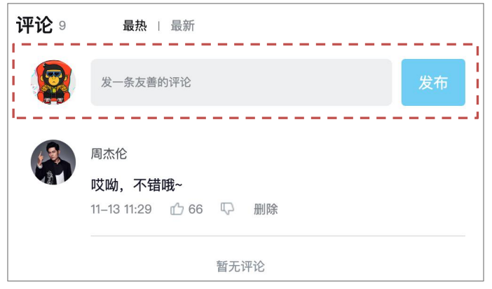

1. 获取评论内容
2. 点击发布按钮发布评论

```jsx
{/* 发布按钮 */}
<div className="reply-box-send" onClick={publishCm}>
    <div className="send-text">发布</div>
</div>
```

```jsx
// 发布评论
const [comment,setComment] = useState('')
const publishCm = ()=> {
    const date = new Date()
    // 获取时间戳id
    const id = date.getTime()
    // 发布时间
    const Mt = date.getMonth() + 1 // 月份
    const Dt = date.getDate() // 日期
    const HH = date.getHours() // 小时
    const mm = date.getMinutes() // 分钟
    const time = `${Mt}-${Dt} ${HH}:${mm}`
    setCommentList([
        ...commentList,
        {
            rpid: new Date().getTime(),
            user: user,
            content: comment,
            ctime: time ,
            like: 0,
        }
    ])
}
```


#### 2、评论列表对象id处理和时间处理

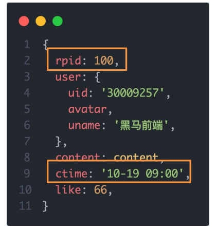

1. rpid要求一个唯一的随机数id - `uuid`
2. ctime要求以当前时间为标准，生成固定格式 - `dayjs`

> 第三方库-uuid：[uuid](https://www.npmjs.com/package/uuid)
>
> 第三方库-dayjs：[dayjs](https://www.npmjs.com/package/dayjs)

```jsx
// 发布评论
const [comment,setComment] = useState('')
const publishCm = ()=> {
    setCommentList([
        ...commentList,
        {
            rpid: uuidv4(),
            user: user,
            content: comment,
            ctime: dayjs().format('MM-DD HH:mm') ,
            like: 0,
        }
    ])
}
```


#### 3、清空内容并重新聚焦

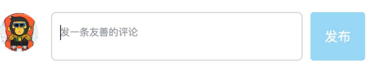

1. 清空内容 - 把控制input框的value状态设置为空字符串
2. 重新聚焦 - 拿到input的dom元素，调用focus方法

```jsx
import {useRef} from 'react'

// 发布评论
const [comment,setComment] = useState('')
const inputRef = useRef(null)
const publishCm = ()=> {
    // 添加评论数据
    setCommentList([
        ...commentList,
        {
            rpid: uuidv4(),
            user: user,
            content: comment,
            ctime: dayjs().format('MM-DD HH:mm') ,
            like: 0,
        }
    ])
    // 清空内容
    setComment('')
    // 聚焦
    inputRef.current.focus()
}
```


### 组件通信

#### 1、什么是组件通信

组件通信就是`组件之间的数据传递`，根据组件嵌套关系的不同，有不同的通信方法。

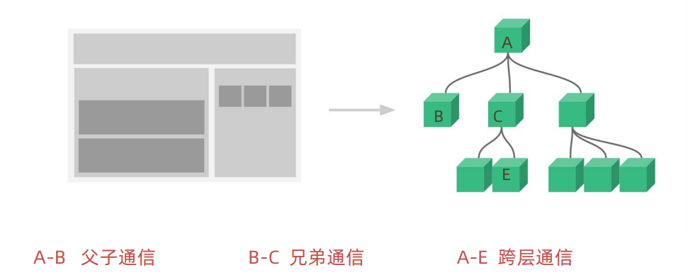


#### 2、父子通信

##### 2.1 父传子基础实现

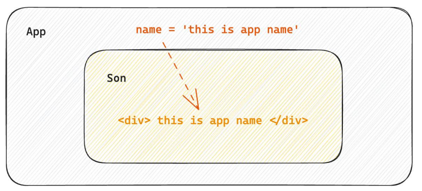

实现步骤：

1. 父组件传递数据 - 在子组件标签上`绑定属性`
2. 子组件接收数据 - 子组件通过`props参数`接收

```jsx
function Son(props) {
  // props:对象中包含了父组件传递过来的所有数据
  return <div>this is son 
    <p>{props.name}</p>
  </div>
}

function App() {
  const name = 'john'
  return (
    <div className="App">
      <Son name={name}></Son>
    </div>
  );
}
```


##### 2.2 父传子-props说明

1. props可以传递任意的数据

> 数字、字符串、布尔值、数组、对象、函数、JSX

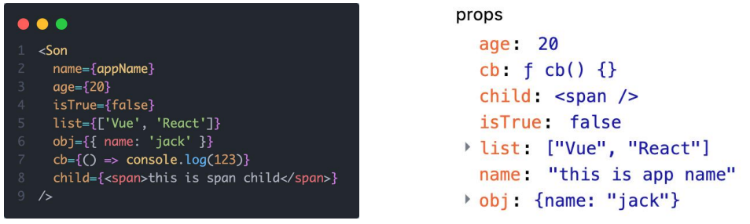

2. props是只读对象

子组件`只能读取props中的数据`，不能直接进行修改, 父组件的数据只能由父组件修改。


##### 2.3 特殊的prop children

场景：当我们把内容嵌套在子组件标签中时，父组件会自动在名为children的prop属性中接收该内容。

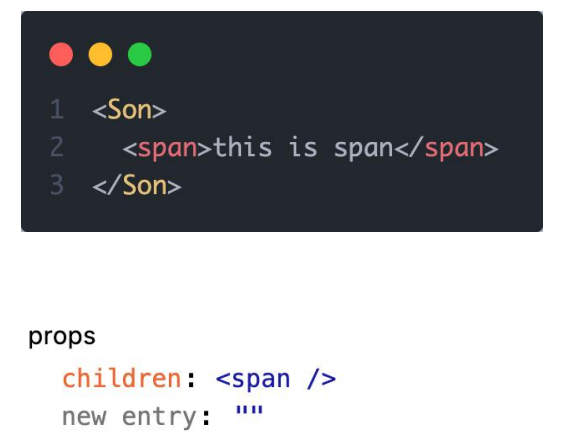

```jsx
function Son(props) {
  // 子组件中嵌套的内容都会被放在props.children属性中
  return <div>this is son 
    <p>{props.name}</p>
    {props.children}
  </div>
}

function App() {
  const name = 'john'
  return (
    <div className="App">
      <Son name={name}>
        <span>this is span</span>
      </Son>
    </div>
  );
}
```


##### 2.4 子传父

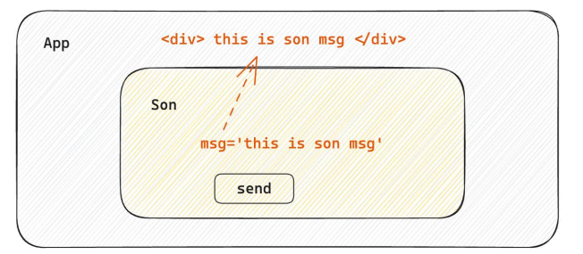

核心思路：在子组件中调用父组件中的函数并传递参数。

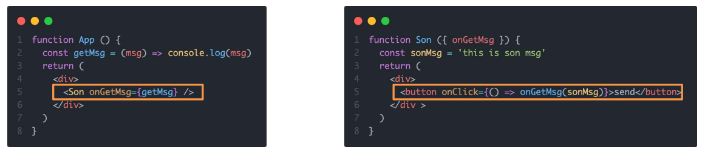


#### 3、使用状态提升实现兄弟组件通信

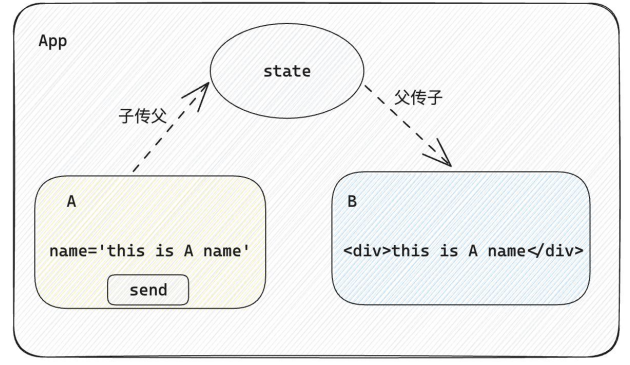

实现思路：借助“状态提升”机制，通过父组件进行兄弟组件之间的数据传递。

1. A组件先通过子传父的方式把数据传给父组件App。
2. App拿到数据后通过父传子的方式再传递给B组件。

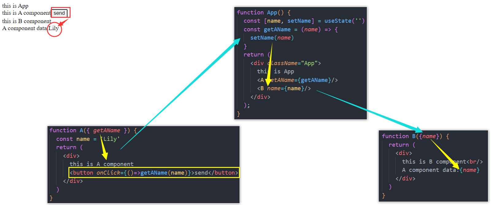


#### 4、使用Context机制跨层级组件通信

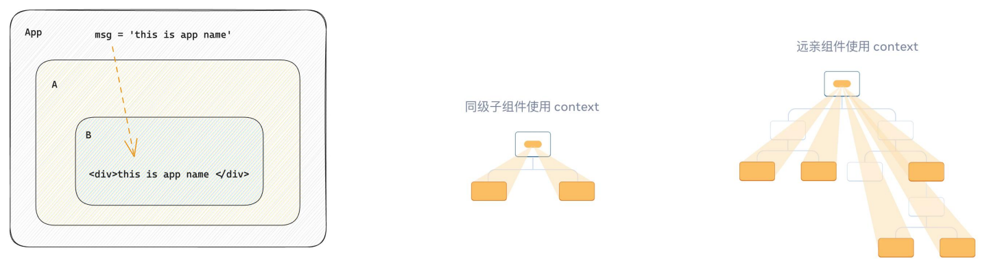

实现步骤：

1. 使用createContext方法创建一个上下文对象Ctx。
2. 在顶层组件（App）中通过 `Ctx.Provider` 组件提供数据。
3. 在底层组件（B）中通过 `useContext` 钩子函数获取 消费数据。


### useEffect 的使用

#### 1、useEffect概念理解

useEffect是一个React Hook函数，用于在React组件中创建不是由事件引起而是`由渲染本身引起的操作（副作用）`, 比 如发送AJAX请求，更改DOM等等。

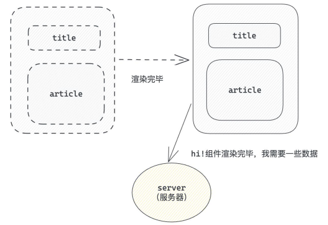

说明：上面的组件中没有发生任何的用户事件，`组件渲染完毕之后`就需要和服务器要数据，整个过程属于`“只由渲染引起的操作”`。


#### 2、基础使用方式

需求：在组件渲染完毕之后，立刻从服务端获取频道列表数据并显示到页面中。

语法：

```jsx
useEffect(()=>{ },[])
```

* 参数1是一个函数，可以把它叫做副作用函数，在函数内部可以放置要执行的操作。
* 参数2是一个数组（可选参），在数组里放置依赖项，不同依赖项会影响第一个参数函数的执行，当是一个空数组的时候，副作用函数`只会在组件渲染完毕之后执行一次`。

> 接口地址：http://geek.itheima.net/v1_0/channels


#### 3、useEffect 依赖项参数说明

useEffect副作用函数的执行时机存在多种情况，根据`传入依赖项的不同`，会有不同的执行表现。

| 依赖项         | 副作用函数执行时机                |
| -------------- | --------------------------------- |
| 没有依赖项     | 组件初始渲染+组件更新时执行       |
| 空数组依赖     | 只在初始渲染时执行一次            |
| 添加特定依赖项 | 组件初始渲染+特性依赖项变化时执行 |

```jsx
function App() {
  const [count,setCount] = useState(0)
  // 1.没有任何依赖项  初始+组件更新
  // useEffect(()=>{
  //   console.log('副作用函数执行了')
  // })

  // 2.空数组依赖   初始
  // useEffect(() => {
  //   console.log('副作用函数执行了')
  // },[])

  // 3.传入特定依赖项  初始+依赖项变化时
  useEffect(() => {
    console.log('副作用函数执行了')
  }, [count])
  return (
    <div className="App">
      this is App
      <button onClick={()=>setCount(count+1)}>{count}</button>
    </div>
  );
}
```


#### 4、清除副作用

在useEffect中编写的`由渲染本身引起的对接组件外部的操作`，社区也经常把它叫做`副作用操作`，比如在useEffect中开 启了一个定时器，我们想在组件卸载时把这个定时器再清理掉，这个过程就是清理副作用。

```jsx
useEffect(()=>{
    // 实现副作用操作逻辑
    return () => {
		// 清除副作用逻辑
    }
})
```

说明：清除副作用的函数最常见的执行时机是在组件卸载时自动执行。

> 习后案例：在Son组件渲染时开启一个定制器，卸载时清除这个定时器。

```jsx
function Son() {
  // 1.渲染时开启一个定时器
  useEffect(() => {
    const timer = setInterval(() => {
      console.log('定时器执行中...')
    }, 1000)

    return () => {
      // 清除副作用(组件卸载时)
      clearInterval(timer)
    }
  })
  return <div>this is Son</div>
}

function App() {
  const [show, setShow] = useState(true)
  return (
    <div className="App">
      {show && <Son />}
      <button onClick={() => setShow(false)}>卸载Song组件</button>
    </div>
  );
}
```


### 自定义Hook实现

#### 1、自定义Hook函数

概念：自定义Hook是以 `use 打头的函数`，通过自定义Hook函数可以用来实现`逻辑的封装和复用`。

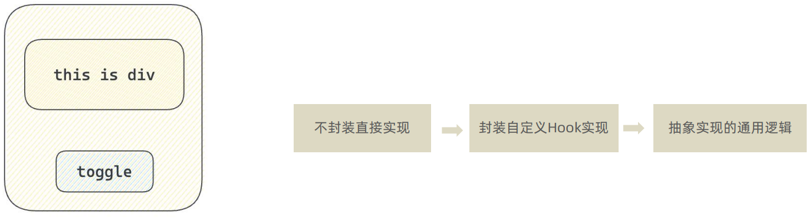  

封装自定义hook思路

1. 声明一个以use打头的函数

2. 在函数体内封装可复用的逻辑(只要是可复用的逻辑)

3. 把组件中用到的状态或者回调return出去(以对象或者数组)

4. 在哪个组件中要用到这个逻辑，就执行这个函数，解构出来状态和回调进行使用

```jsx
function useToggle(){
  // 可复用的逻辑代码
  const [value, setValue] = useState(true)
  const toggle = () => setValue(!value)

  // 哪些状态和回调函数需要在其他组件中使用 return
  return {
    value,
    toggle
  }
}

function App() {
  const {value,toggle} =  useToggle() // 调用自定义Hook
  return (
    <div className="App">
      {value && <div>this is div</div>}
      <button onClick={toggle}>toggle</button>
    </div>
  );
}
```


### React Hook使用规则

使用规则 

1. 只能在组件中或者其他自定义Hook函数中调用 。
2. 只能在组件的顶层调用，不能嵌套在 if、for、其他函数中。

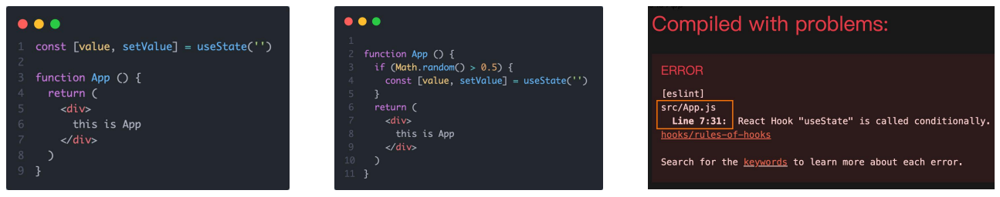


### 案例：优化B站评论案例

#### 1、优化需求

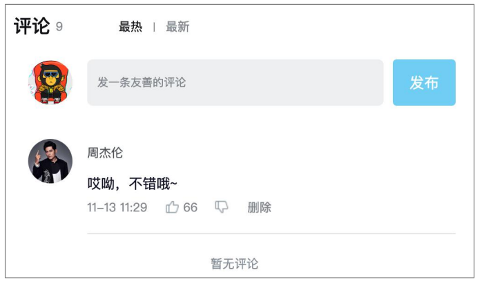

1. 使用请求接口的方式获取评论列表并渲染 。
2. 使用自定义Hook函数封装数据请求的逻辑 。
3. 把评论中的每一项抽象成一个独立的组件实现渲染。


#### 2、优化需求—通过接口获取评论列表

1. 使用`json-server` 工具模拟接口服务, 通过 axios 发送接口请求。

> [json-server](https://github.com/typicode/json-server)是一个快速以.json文件作为数据源模拟接口服务的工具 
>
> 
>
> axios是一个广泛使用的前端请求库

2. 使用 `useEffect` 调用接口获取数据。

```jsx
useEffect(()=>{
    // 发送网络请求
},[])
```


##### 2.1 启动接口服务

安装`json-server`

```bash
npm i json-server -D
```

创建`db.json`文件，放在项目根目录下

```json
{
  "list": [
    {
      "rpid": 3,
      "user": {
        "uid": "13258165",
        "avatar": "http://toutiao.itheima.net/resources/images/98.jpg",
        "uname": "周杰伦"
      },
      "content": "哎哟，不错哦",
      "ctime": "10-18 08: 15",
      "like": 126
    },
    {
      "rpid": 2,
      "user": {
        "uid": "36080105",
        "avatar": "http://toutiao.itheima.net/resources/images/98.jpg",
        "uname": "许嵩"
      },
      "content": "我寻你千百度 日出到迟暮",
      "ctime": "11-13 11: 29",
      "like": 88
    },
    {
      "rpid": 1,
      "user": {
        "uid": "30009257",
        "avatar": "http://toutiao.itheima.net/resources/images/98.jpg",
        "uname": "薛之谦"
      },
      "content": "丑八怪~~~~~，在这爱美的时代！",
      "ctime": "10-19 09: 00",
      "like": 66
    }
  ]
}
```

将`json-server`执行json服务器命令，添加到package.json脚本中

```json
"scripts": {
    "start": "react-scripts start",
    "build": "react-scripts build",
    "serve":"json-server db.json --port 3005 --watch"
},
```


##### 2.2 发送请求获取数据&数据渲染


#### 3、封装评论项Item组件

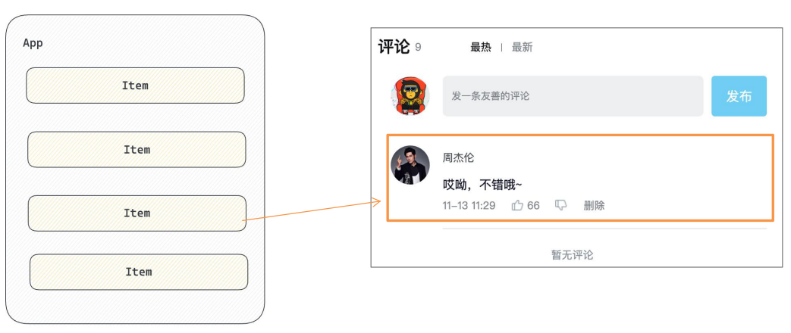

抽象原则：App作为“智能组件”负责数据的获取，Item作为“UI组件”负责数据的渲染。


