## React基础篇

### React是什么

#### 1、React介绍

React由Meta公司开发，是一个用于 构建Web和原生交互界面的库
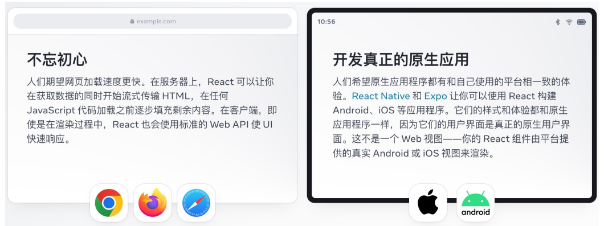


#### 2、React的优势

相较于传统基于DOM开发的优势


相较于其他前端框架的优势

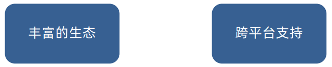


#### 3、市场情况

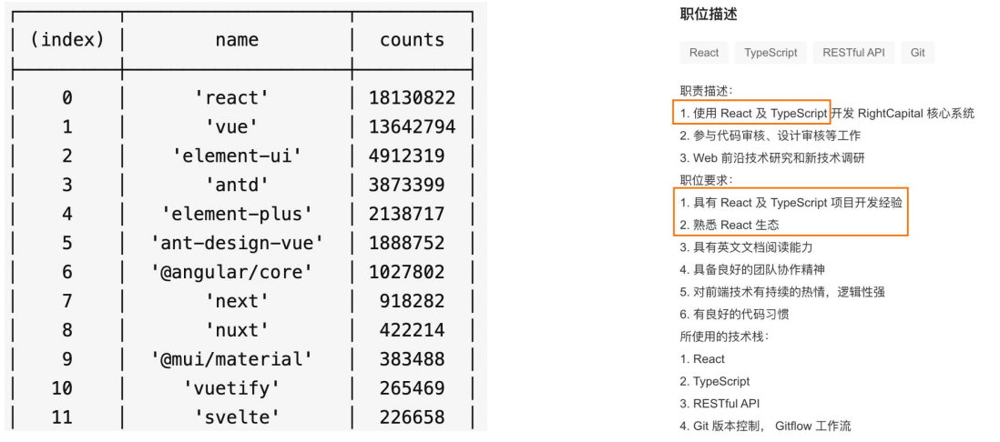


### 开发环境搭建

#### 1、create-react-app快速搭建开发环境

create-react-app是一个快速 `创建React开发环境的工具`，底层由Webpack构建，`封装了配置细节`，开箱即用。

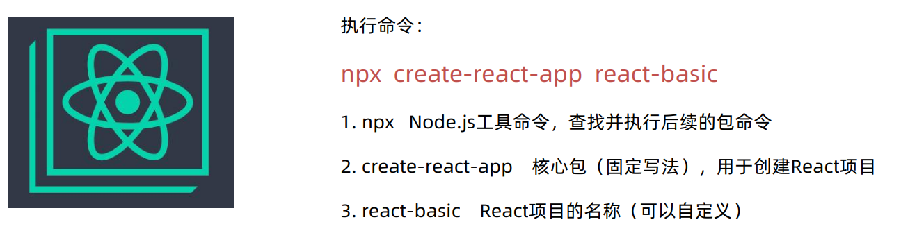

创建React项目的更多方式 

> https://zh-hans.react.dev/learn/start-a-new-react-project

启动项目

```bash
cd react-basic
npm start
```

如果你看到这样的页面，说明项目已经启动完毕！

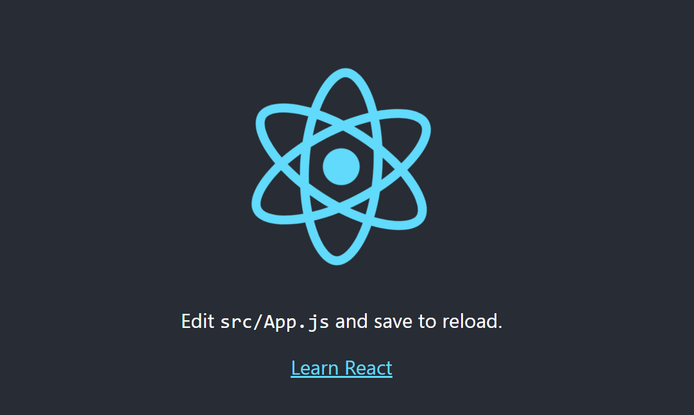

#### 2、修改src目录

为了方便我们后续的学习，我们可以删除掉src目录下除`App.js`及`index.js`之外的所有文件。

```js
// App.js 项目根组件
// App => index.js => public/index.html(root)

function App() {
  return (
    <div className="App">
       this is App
    </div>
  );
}

export default App;
```

```js
// 项目入口文件 从这里开始运行

// React必要的两个核心包
import React from 'react';
import ReactDOM from 'react-dom/client';
// 导入项目的根组件
import App from './App';
// 把 App根组件渲染到id为root的dom节点上
const root = ReactDOM.createRoot(document.getElementById('root'));
root.render(<App />)
```

> 如果具备Vue框架基础，这里会显得浅显易懂！


#### 3、yarn搭建react开发环境

1. 安装yarn包管理器

```bash
# 通过npm安装yarn
npm i yarn -g
# 或者启用 corepack
corepack enable
```

> corepack启用后，就会全局模块中就会多出yarn和pnpm包管理器的文件了。

2. 通过yarn安装react项目

```bash
yarn create react-app my-app
```

3. 如果想安装支持typescript的react项目

```bash
yarn create react-app my-app --template typescript
```


#### 4、pnpm搭建react开发环境

1. 安装pnpm包管理器

```bash
npm i pnpm -g
```

2. 创建一个新的react项目

```bash
pnpm create react-app my-app
```

3. 如果想安装支持typescript的react项目

```bash
pnpm create react-app my-app --template typescript
```


### JSX基础

#### 1、什么是JSX

概念：JSX是JavaScript和XML（HTML）的缩写，表示在`JS代码中编写HTML模版结构`,它是React中编写 UI模版的方式。

```jsx
function App() {
  return (
    <div className="App">
       this is App
    </div>
  );
}
```

上述代码中，return后括号包裹的`div`标签内容就是`JSX`语法。

JSX的优势：

1. HTML的声明式模板写法。
2. JS的可编程能力。


#### 2、JSX的本质

JSX并不是标准的JS语法，它是`JS的语法扩展`，浏览器本身不能识别，需要通过`解析工具做解析`之后才能 在浏览器中运行。

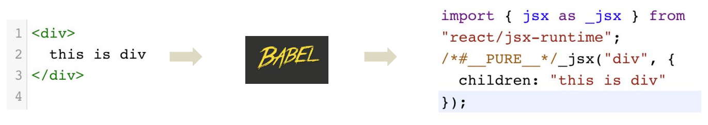


#### 3、高频场景

在JSX中可以通过 `大括号语法{}` 识别 JavaScript中的表达式，比如常见的变量、函数调用、方法调用等等。

1. 使用引号传递字符串
2. 使用JavaScript变量
3. 函数调用和方法调用
4. 使用JavaScript对象

```jsx
const count = 100
function getName(){
  return 'alice'
}

function App() {
  return (
    <div className="App">
       this is App
       {/* 使用引号传递字符串 */}
       {'this is message'}
       {/* 识别js变量 */}
       {count}
       {/* 函数调用 */}
       {getName()}
       {/* 方法调用 */}
       {new Date().getDate()}
       {/* 使用js对象 */}
       <div style={{color:'red'}}>this is div</div>
    </div>
  );
}
```


#### 4、JSX中实现列表渲染

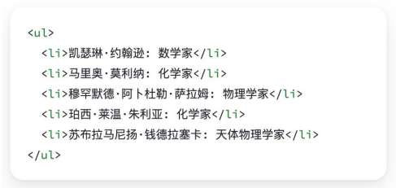

语法：在JSX中可以使用原生JS中的`map方法`遍历渲染列表。

```jsx
const list = [
  { id: 1, name: '张三' },
  { id: 2, name: '李四' },
  { id: 3, name: '王五' },
  { id: 4, name: '赵六' },
]

function App() {
  return (
    <div className="App">
       {/* 渲染列表 */}
       <ul>
         {list.map(item =>
           <li>{item.name}</li>
         )}
       </ul>
    </div>
  );
}
```


#### 5、JSX实现条件渲染

##### 5.1 基础条件渲染

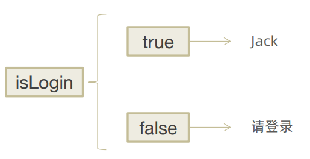

语法：在React中，可以通过`逻辑与运算符&&、三元表达式（?:）`实现基础的条件渲染

```jsx
{/* 简单条件渲染  */}
{isLogin ? <div>欢迎回来,jack!</div> : <div>请先登录</div>}
{isLogin && <div>欢迎回来,jack!</div> }
```


##### 5.2 复杂条件渲染


需求：列表中需要根据文章状态适配三种情况，单图，三图，和无图三种模式。

> 解决方案：自定义函数 + if判断语句。

```jsx
const getArticleType = () => {
  if(articleType === 0){
    return <div>无图模式</div>
  }else if(articleType === 1){
    return <div>单图模式</div>
  }else{
    return <div>三图模式</div>
  }
}

{/* 复杂条件渲染 */}
{getArticleType()}
```


### React事件绑定

#### 1、基础事件绑定

语法：`on + 事件名称 = { 事件处理程序 }`，整体上遵循小驼峰命名。

```jsx
function App() {
  const handleClick = () => {
    console.log('clicked');
  }
  return (
    <div className="App">
        <button onClick={handleClick}>click me</button>
    </div>
  );
}
```


#### 2、使用事件对象参数

语法：在事件回调函数中`设置形参e`。

```jsx
function App(){
    // 事件函数无参触发(不传递参数)，如果设定了第一个形参，默认为事件对象参数
    const handleClick = (e,item) => {
        console.log('clicked',e);
        console.log('item',item);
    }
    return (
        <div className="App">
            <button onClick={handleClick}>click me</button>
        </div>
    );
}
```


#### 3、传递自定义参数

语法：事件绑定的位置改造成`箭头函数的写法`，在执行clickHandler实际处理业务函数的时候传递实参。

```jsx
function App(){
    const handleClick = (name) => {
        console.log('clicked',name);
    }
    return (
        <div className="App">
        <button onClick={()=>handleClick('jack')}>click me</button>
        </div>
    );
}
```

注意：不能直接写函数调用，这里事件绑定需要一个`函数引用`。


#### 4、同时传递事件对象和自定义参数

语法：在事件绑定的位置传递事件实参e和自定义参数，clickHandler中声明形参，注意顺序对应。

```jsx
function App(){
    const handleClick = (name,e) => {
        console.log('clicked', name,e);
    }
    return (
        <div className="App">
            <button onClick={(e) => handleClick('jack',e)}>click me</button>
        </div>
    );
}
```


### React中的组件

#### 1、组件是什么

概念：一个组件就是用户界面的一部分，它可以有自己的逻辑和外观，组件之间`可以互相嵌套，也可以复用多次`。

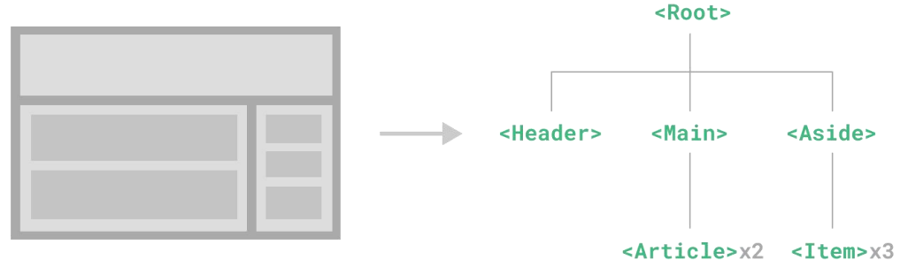

组件化开发可以让开发者像搭积木一样构建一个完整的庞大的应用。


#### 2、React组件

在React中，一个组件就是`首字母大写的函数`，内部存放了组件的逻辑和视图UI, 渲染组件只需要`把组件当成标签书写`即可。

##### 2.1 定义组件

```jsx
// 1.定义组件
function Button(){
    // 业务逻辑-组件逻辑
    return <button>click me</button>
}
```


##### 2.2 使用组件

```jsx
function App(){
    return (
    	<div className="App">
            {/* 2.使用组件(渲染组件) */}
            {/* 自闭和 */}
            <Button/>
            {/* 成对标签 */}
            <Button></Button>
        </div>
    )
}
```


### 组件状态管理-useState

#### 1、useState基础使用

useState 是一个 React Hook（函数），它允许我们向组件添加一个`状态变量`, 从而控制影响组件的渲染结果。

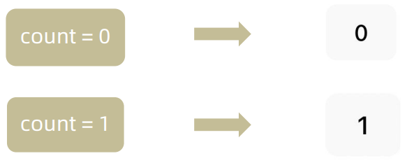

本质：和普通JS变量不同的是，状态变量一旦发生变化组件的视图UI也会跟着变化（`数据驱动视图`）。

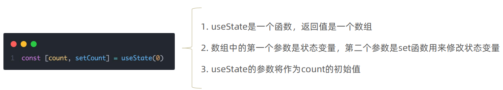


#### 2、修改状态规则

##### 2.1 状态不可变

在React中，状态被认为是只读的，我们应该始终`替换它而不是修改它`，直接修改状态不能引发视图更新。

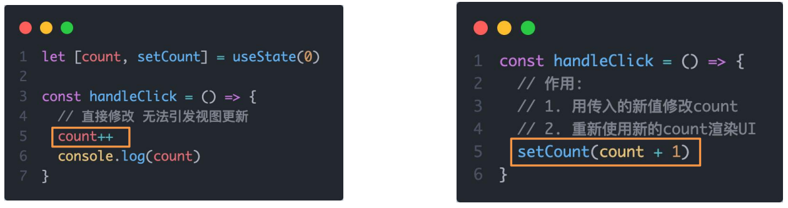


##### 2.2 修改对象状态

规则：对于对象类型的状态变量，应该始终传给set方法一个`全新的对象`来进行修改。

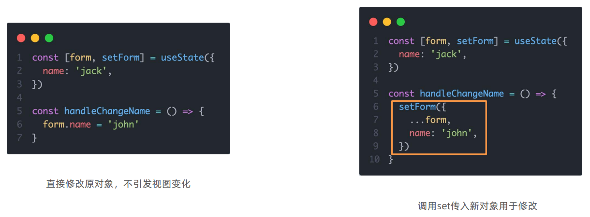


#### 3、本节思考

```
为什么修改对象状态，坚持新对象替换就对象，新值覆盖旧值？该行为的原理是什么？
```


### 组件基础样式处理

#### 1、组件基础样式方案

React组件基础的样式控制有俩种方式：

1. 行内样式(不推荐)

```jsx
<div style={{color:'red',fontSize:'50px'}}>this is div</div>
```

2. class类名控制

`index.css`

```css
.foo{
    color:red;
}
```

`App.js`

```jsx
import './index.css'

function App (){
    return (
    	<div>
        	<span className="foo">this is span</span>
        </div>
    )
}
```


### B站评论

#### 1、功能分析

效果：


1. 渲染评论列表
2. 删除评论实现
3. 渲染导航Tab和高亮实现
4. 评论列表排序功能实现


#### 2、渲染评论列表

核心思路：

1. 使用useState维护评论列表数据。
2. 使用`map`方法对列表数据进行遍历渲染(不要忘记加key)。

```jsx
// 评论列表数据
const list =[
    {
        // 评论id
        rpid: 3,
        // 用户信息
        user: {
            uid: '13258165',
            avatar: "http://toutiao.itheima.net/resources/images/98.jpg",
            uname: '周杰伦',
        },
        // 评论内容
        content: '哎哟，不错哦',
        // 评论时间
        ctime: '10-18 08:15',
        like: 88,
    },
    {
        rpid: 2,
        user: {
            uid: '36080105',
            avatar: "http://toutiao.itheima.net/resources/images/98.jpg",
            uname: '许嵩',
        },
        content: '我寻你千百度 日出到迟暮',
        ctime: '11-13 11:29',
        like: 88,
    },
    {
        rpid: 1,
        user: {
            uid: '30009257',
            avatar,
            uname: '薛之谦',
        },
        content: '丑八怪~~~~~，在这爱美的时代！',
        ctime: '10-19 09:00',
        like: 66,
    },
]
// 当前登录用户信息
const user = {
    // 用户id
    uid:'3009257',
    // 用户头像
    avatar,
    // 用户昵称
    uname:'张三'
}
// 导航 Tab 数组
const tabs = [
    {type:'hot',text:'最热'},
    {type:'time',text:'最新'}
]

const App = ()=>{
    return (
    	
    )
}
```


#### 3、实现评论删除

需求：

1. 只有自己的评论才显示删除按钮
2. 点击删除按钮，删除当前评论，列表中不再显示

核心思路：

1. 删除显示 => 条件渲染
2. 删除功能 => 拿到id，通过数组的filter方法对评论列表过滤

> 过滤出来的新的对象覆盖旧对象。

```jsx
const [commentList, setCommentList] = useState(defaultList)
const handleDel = (id) => {
    setCommentList(commentList.filter(item => item.rpid !== id))
}
```


#### 4、渲染Tab&高亮实现

需求：选中的tab项做高亮处理，没有选中的没有高亮。

核心思路：

点击谁就把谁的`type（独一无二的标识）记录下来`，然后和遍历时的`每一项的type做匹配`，谁匹配到就设置负责高亮的类名。

> 这里的记录指的是记录到state中。


#### 5、排序实现

需求：

点击最新，评论列表按照创建事件倒序排序(新的在前)。点击最热按照点赞数量进行排序(多的在前)。

核心思路：

把`评论列表状态数据进行不同的排序处理`，当成新值传给set函数重新渲染视图UI。

> 这里推荐使用第三方库`lodash`中的`orderBy`函数。

```jsx
const handleTabsChange = (type) => {
    setType(type)
    // 排序实现
    if (type === 'hot') {
        // 根据点赞数排序
        setCommentList(_.orderBy(commentList, 'like', 'desc'))
    } else {
        // 根据时间排序
        setCommentList(_.orderBy(commentList, 'ctime', 'desc'))
    }
}
```


#### 6、classnames优化类名控制

classnames是一个简单的JS库，可以非常方便的`通过条件动态控制class类名的显示`。

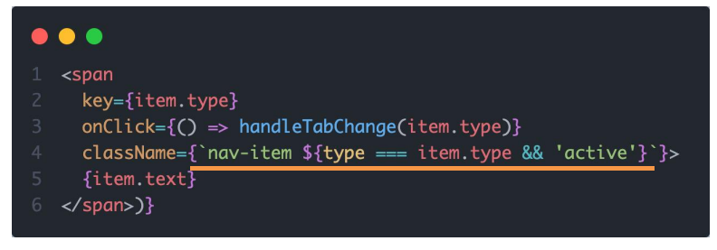

> 问题：字符串的拼接方式不够直观，也容易出错。

使用`classnames`之后：

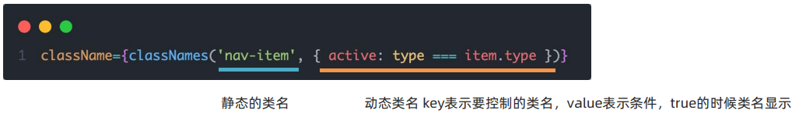


