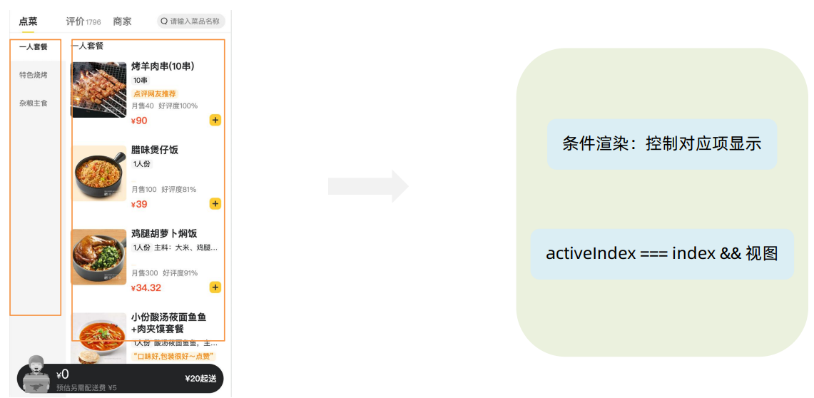

## Redux入门

### 什么是Redux

#### 1、Redux简介

Redux 是React最常用的`集中状态管理工具`，类似于Vue中的Pinia（Vuex），可以独立于框架运行。

作用：通过集中管理的方式管理应用的状态。


#### 2、Redux体验

不和任何框架绑定，不使用任何构建工具，使用纯Redux实现计数器。


使用步骤：

1. 定义一个 `reducer 函数` （根据当前想要做的修改返回一个新的状态）。
2. 使用createStore方法传入 reducer函数 生成一个`store实例对象`。
3. 使用store实例的 `subscribe方法` 订阅数据的变化（数据一旦变化，可以得到通知）。
4. 使用store实例的 `dispatch方法提交action对象` 触发数据变化（告诉reducer你想怎么改数据）。
5. 使用store实例的 `getState方法` 获取最新的状态数据更新到视图中。


#### 3、Redux管理数据流程梳理


为了职责清晰，数据流向明确，Redux把整个数据修改的流程分成了三个核心概念，分别是：`state、action和reducer`。

1. state：一个对象，存放着管理的数据状态。
2. action：一个对象，用来描述你想怎么修改数据 state。
3. reducer：一个函数 更具action的描述生成一个新的state。


### React与Redux-环境准备

#### 1、配套工具

在React中使用redux，官方要求安装俩个其他插件 - `Redux Toolkit`和`react-redux`。

1. Redux Toolkit（RTK）- 官方推荐编写Redux逻辑的方式，是一套工具的集合集，`简化书写方式`。


2. react-redux - 用来 `链接 Redux `和 `React组件` 的中间件。


#### 2、配置基础环境

1. 使用 CRA 快速创建 React 项目

```bash
npx create-react-app react-redux
```

2. 安装配套工具

```bash
npm i @reduxjs/toolkit react-redux
```

3. 启动项目

```bash
npm run start
```


#### 3、store目录结构设计


1. 通常集中状态管理的部分都会单独创建一个单独的`store`目录。
2. 应用通常会有很多个子模块，所以创建一个`modules`目录，在内部编写业务分类的子store。
3. store中的入口文件index.js的作用是组合modules中所有子模块，并导出store。


### React与Redux—实现counter

#### 1、整体路径熟悉


#### 2、使用React Toolkit 创建 counterStore

`stores/modules/counterStore.js`

```js
import {createSlice} from '@reduxjs/toolkit'

const counterStore = createSlice({
    name:'counter',
    // 初始状态数据
    initialState:{
        count:0
    },
    // 修改数据的同步方法
    reducers:{
        increment(state){
            state.count++
        },
        decrement(state){
            state.count--
        }
    }
})

// 导出=>解构出创建的action对象的函数 (actionCreater)
export const {increment,decrement} = counterStore.actions

// 导出reducer函数
export default counterStore.reducer
```

`stores/index.js`

```js
import {configureStore} from '@reduxjs/toolkit'
import counterReducer from './modules/counterStore'


// 创建根store组合子模块
const store = configureStore({
    reducer:{
        counter:counterReducer
    }
})

export default store
```


#### 3、为React注入store

react-redux负责把Redux和React 链接 起来，内置 Provider组件 通过 store 参数把创建好的store实例注入到应用中 ，链接正式建立。

```jsx
import App from './App.js'
import stores from './stores'
import { Provider } from 'react-redux'

const root = ReactDOM.createRoot(document.querySelect('#root'))
root.render(
	<Provider stores={stores}>
    	<App/>
    </Provider>
)
```


#### 4、React组件使用store中的数据

在React组件中使用store中的数据，需要用到一个 钩子函数 - `useSelector`，它的作用是把store中的数据映射到组件 中，使用样例如下：


`App.js`

```jsx
import { useSelector } from 'react-redux'

function App() {
  const {count} = useSelector(state=>state.counter)
  return (
    <div className="App">
        {count}
    </div>
  );
}
```


#### 5、React组件修改store中的数据

React组件中修改store中的数据需要借助另外一个hook函数 - `useDispatch`，它的作用是生成提交action对象的 dispatch函数，使用样例如下：

```jsx
import { useSelector, useDispatch } from 'react-redux'
// 导入创建action对象的方法
import {increment,decrement} from './stores'

function App() {
  const { count } = useSelector(state => state.counter)
  const dispatch = useDispatch()
  return (
    <div className="App">
      <button onClick={() => dispatch(decrement())}>-</button>
      {count}
      <button onClick={() => dispatch(increment())}>+</button>
    </div>
  );
}
```


#### 6、小结

1. 组件中使用哪个hook函数获取store中的数据？

> useSelector

2. 组件中使用哪个hook函数获取dispatch方法？

> useDispatch

3. 如何得到要提交action对象(修改state状态)？

> 执行store模块中导出的actionCreater方法
>
> actionCreater：就是store模块中，reducer中的action方法。


### Redux与React - 提交action传参

#### 1、需求说明


组件中有俩个按钮 `add to 10` 和 `add to 20` 可以直接把count值修改到对应的数字，目标count值是在组件中传递过 去的，需要在`提交action的时候传递参数`。


#### 2、提交action传参实现需求

在reducers的同步修改方法中`添加action对象参数`，在`调用actionCreater的时候传递参数`，参数会被传递到`action对 象payload属性上`。


### Redux与React - 异步状态操作

#### 1、需求理解


#### 2、异步操作样板代码


1. 创建store的写法保持不变，配置好同步修改状态的方法 

2. 单独封装一个函数，在函数内部return一个新函数，在新函数中 

   2.1 封装异步请求获取数据 

   2.2 调用`同步actionCreater`传入异步数据生成一个action对象，并使用dispatch提交 

3. 组件中dispatch的写法保持不变


### Redux调试 - devtool

#### 1、安装chrome调试工具

Redux官方提供了针对于Redux的调试工具，支持实时state信息展示，action提交信息查看等。


### 美团外卖—案例演示和环境准备

#### 1、案例展示


基本开发思路：使用 `RTK（Redux Toolkit）`来管理应用状态, 组件负责 数据渲染 和 dispatch action。


#### 2、准备并熟悉环境

1. 克隆项目到本地（内置了基础静态组件和模版）

```bash
git clone http://git.itcast.cn/heimaqianduan/redux-meituan.git
```

2. 安装所有依赖

```bash
npm i 
```

3. 启动mock服务（内置了json-server）

```bash
npm run serve
```

4. 启动前端服务

```bash
npm run start
```


#### 3、分类和商品列表渲染

##### 3.1 需求理解


##### 3.2 实现步骤


###### 实现mock服务

为什么要实现mock服务？

> mock可以提供我们所需数据的接口，可以提高我们开发前端项目的效率。

```bash
npm run serve
```

###### 编写store

`takeaway.js`：设置状态数据state及操作state的方法

```js
import {createSlice} from '@reduxjs/toolkit'
import axios from 'axios'

const takeAwayStore = createSlice({
    name:'takeaway',
    initialState:{
        // 餐品列表
        foodsList:[]
    },
    reducers:{
        // 获取foodsList
        setFoodsList(state,action){
            state.foodsList = action.playlod
        }
    }
})
// 导出并解构
export const {setFoodsList} = takeAwayStore.actions
// 异步操作
const fetchFoodsList = ()=>{
	return async(dispatch)=>{
        // axios获取数据
		const res = await axios.get('http://localhost:3004/takeaway')
        // 调用dispatch函数提交action
        dispatch(setFoodsList(res.data))
    }
}

export {fetchFoodsList}
export default takeAwayStore.reducer
```

`store/index.js`：将已经创建好的takeaway模块导入配置reducer，并再次导出。

```js
import {configureStore} from '@reduxjs/toolkit'
import takeaway from './modules/takeaway'

const store = configureStore({
    reducer:{
        takeaway
    }
})

// 导出store模块
export default store
// 将takeaway模块中的所有导出暴露=>以后直接从index.js中访问即可，而无需引入modules/takeaway.js
export * from './modules/takeaway'
```

`src/index.js`：注入已经配置好的状态管理。

```jsx
// 注入store
import { Provider } from 'react-redux'
import store from './store'

const root = createRoot(document.getElementById('root'))
root.render(
  <Provider store={store}>
    <App />
  </Provider>
)
```

###### 组件触发action并渲染数据

`App.js`

```js
import { useEffect } from 'react'
import { useDispatch, useSelector } from 'react-redux'
import { fetchGoodsList } from './store'

const App = ()=>{
    const dispatch = useDispatch()
    // 初始化数据
    useEffect(() => {
        dispatch(fetchGoodsList())
    }, [dispatch])
    // 通过useSelecor获取到注入的store数据
    const {foodsList}  = useSelector(state=>state.takeaway)
	...
    {/* 外卖商品列表 */}
    {takeAwayList.map(item => {
        return (
            <FoodsCategory
            key={item.tag}
			// 列表标题
            name={item.name}
            // 列表商品
            foods={item.foods}
            />)
        })
    }
    ...
}
```


#### 4、点击分类激活交互实现

##### 4.1 理解需求


##### 4.2 步骤分析


###### RTK编写activeIndex方法

`takeaway.js`

```js
initialState:{
    ...
    activeIndex:0
},
reducers:{
    ...
    changeActiveIndex(state, action) {
        state.activeIndex = action.payload
    },
}

// 导出
export const { setGoodsList, changeActiveIndex}  = takeAwayStore.actions
```

###### 激活动态类名显示&activeIndex更改

`components/Menu/index.js`

```jsx
import {useDispatch, useSelector} from 'react-redux'
import { changeActiveIndex } from '../../store'

const Menu = ()=>{
    // 获取选中状态
    const {foodsList,activeIndex} = useSelector(state=>state.takeaway)
    const dispatch = useDispatch()
    
    // 从foodsList中分离出menus
    const menus = foodsList.map(item=>({tag:item.tag,name:item.name}))
    return (
        <nav className="list-menu">
            {/* 添加active类名会变成激活状态 */}
            {menus.map((item, index) => {
                return (
                    <div
                        key={item.tag}
                        className={classNames(
                            'list-menu-item',
                            { active: activeIndex === index}
                        )}
                        onClick={() => dispatch(changeActiveIndex(index))}
                        >
                        {item.name}
                    </div>
                )
            })}
        </nav>
    )
}


```


#### 5、商品列表切换显示

##### 5.1 需求理解




##### 5.2 实现步骤

1. 根据条件控制对应项显示=>`activeIndex === index?`
2. 当条件结果为true，我们就进行视图渲染

`App.js`

```jsx
const { takeAwayList,activeIndex } = useSelector(state => state.takeaway)

<div className="goods-list">
    {/* 外卖商品列表 */}
    {takeAwayList.map((item,index) => {
            return (
            activeIndex === index &&
            <FoodsCategory
                key={item.tag}
                // 列表标题
                name={item.name}
                // 列表商品
                foods={item.foods}
			/>
        )
	})}
</div>
```


#### 6、添加购物车实现

##### 6.1 需求理解


##### 6.2 实现步骤


###### RTK新增状态cartList

`takeaway.js`

```js
initialState:{
    ...
    cartList:[]
},
reducers:{
    ...,
    const addCart(state,action){
        // 如果已存在，则count+1
        const item = state.cartList.find(item=>item.id === action.playload.id)
        if(item){
            count++
        }else{
            state.cartList.push({...action.playload,count:1})
        }
    }
}

// 将该方法导出
export const { setGoodsList, changeActiveIndex, addCart}  = takeAwayStore.actions
```

###### 组件点击添加至购物车

`FoodItem/index.js`

```jsx
const dispatch = useDispatch()

span className="plus" onClick={() => dispatch(addCart({
    id,
    picture,
    name,
    unit,
    description,
    food_tag_list,
    month_saled,
    like_ratio_desc,
    price,
    tag,
    count
}))}></span>
```


#### 7、统计区域功能实现

##### 7.1 需求理解


##### 7.2 实现步骤


###### 渲染数量

`Cart/index.js`

```jsx
<!-- 数量 -->
<div onClick={onShow} className={classNames('icon')}>
    {cart.length>0 && <div className="cartCornerMark">{cart.length}</div>}
</div>
```

###### 计算总价格

```jsx
// 计算总价
const totalPrice = cart.reduce((sum, item) => sum + item.price * item.count, 0)

{/* 购物车价格 */}
<div className="main">
    <div className="price">
        <span className="payableAmount">
            <span className="payableAmountUnit">¥</span>
            {totalPrice.toFixed(2)}
        </span>
    </div>
    <span className="text">预估另需配送费 ¥5</span>
</div>
```

###### 当购物车中有外卖餐品时进行高亮处理

高亮效果：


```jsx
<div onClick={onShow} className={classNames('icon', { fill: cart.length > 0 })}>
    {cart.length>0 && <div className="cartCornerMark">{cart.length}</div>}
</div>

{/* 结算 or 起送 */}
{cart.length>0 ? (
    <div className="goToPreview">去结算</div>
) : (
    <div className="minFee">¥20起送</div>
)}
```


#### 8、购物车列表功能实现

##### 8.1 需求理解


##### 8.2 实现步骤


###### 购物车中渲染数据

`Cart/index.js`

```jsx
const { cartList: cart } = useSelector(state => state.takeaway)


<div className="scrollArea">
    {cart.map(item => {
        return (
            <div className="cartItem" key={item.id}>
                
                <div className="main">
                    <div className="skuInfo">
                        <div className="name">{item.name}</div>
                    </div>
                    <div className="payableAmount">
                        <span className="yuan">¥</span>
                        <span className="price">{item.price}</span>
                    </div>
                </div>
                <div className="skuBtnWrapper btnGroup">
                    <Count
                        count={item.count}
                        onPlus={() => dispatch(increCount({ id: item.id }))}
                        onMinus={() => dispatch(decreCount({ id: item.id }))}
                        />
                </div>
            </div>
        )
    })}
</div>
```

###### RTK中增减函数

`takeaway.js`

```js
increCount(state,action){
    // 修改购物车中对应商品的数量 => id
    const item = state.cartList.find(item => item.id === action.payload.id)
    item.count++
},
decreCount(state,action){
    // 修改购物车中对应商品的数量 => id
    const item = state.cartList.find(item => item.id === action.payload.id)
    if(item.count ===  0){
        return
    }
    item.count--
},
    
// 导出
export const { setGoodsList, changeActiveIndex, addCart, increCount, decreCount }  = takeAwayStore.actions

```

###### 购物车组件中调用增减函数

```jsx
<Count
    count={item.count}
    onPlus={() => dispatch(increCount({ id: item.id }))}
    onMinus={() => dispatch(decreCount({ id: item.id }))}
    />
```


#### 9、控制购物车显示和隐藏

##### 9.1 需求理解


##### 9.2 实现步骤


###### useState控制显隐

`Cart/index.js`

```jsx
  // 购物车显示和隐藏 (蒙层)
const [visible, setVisible] = useState(false)
const onShow = ()=>{
    // 如果购物车列表中有数据，才可用显示
    if(cart.length > 0)
    {
        setVisible(true)
    }
}


{/* 遮罩层 添加visible类名可以显示出来=>点击遮罩区隐藏*/}
<div
    className={classNames('cartOverlay', visible && 'visible')}
    onClick={() => setVisible(false)}
    />

{/* fill 添加fill类名可以切换购物车状态*/}
<div onClick={onShow} className={classNames('icon', { fill: cart.length > 0 })}>
    {cart.length>0 && <div className="cartCornerMark">{cart.length}</div>}
</div>

<div className={classNames('cartPanel', visible && 'visible')}>
	...
</div>
```


