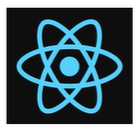
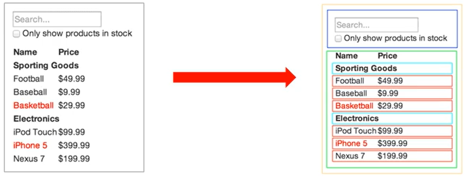
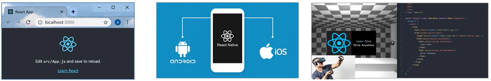

## react - day01

#### 1、React概述

##### 1.1 什么是React



React是一个用于构建用户界面的JavaScript库。

用户界面：HTML页面(前端)

React主要用来写HTML页面，或构建Web应用。

如果从MVC的角度看，React仅仅是视图层(V)，也就是只负责视图的渲染，而并非提供了完整的M和C的功能。

React起源于 FaceBook的内部项目，后又用来架设 Instagram的网站 ，并于 2013 年5月开源。


##### 1.2 React特点

React的特点如下：

* 声名式

* 基于组件

* 学习一次随处使用


###### 1.2.1 声名式

你只需要描述UI(HTML)看起来是什么样，就跟写HTML一样。

React负责渲染 UI ，并在数据变化时更新 UI。

```react
const jsx = <div className = "app">
	<h1>Hello React！ 动态变化数据：{count}</h1>      
</div>
```


###### 1.2.2 基于组件

* 组件是React中最重要的内容。

* 组件表示页面中的部分内容。

* 组合、复用多个组件，可以实现完整的页面功能。




###### 1.2.3 学习一次，随处使用

* 使用React可以开发Web应用。
* 使用React可以开发移动端原生应用(react-native)
* 使用React可以开发VR(虚拟现实)应用(react 360)




#### 2、React基本使用

##### 2.1 React安装

安装命令：

```bash
npm i react react-dom
```


#### 3、React脚手架的使用

