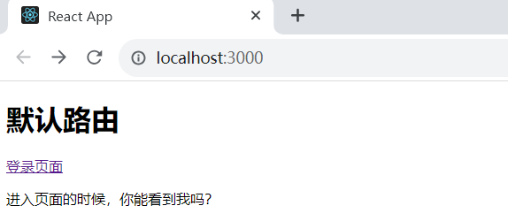
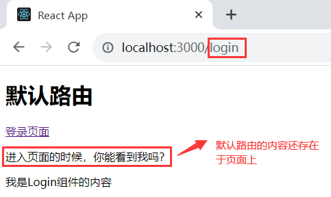
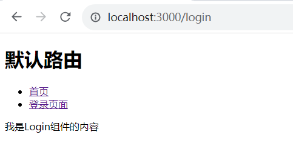

## React—路由基础

#### 1、学习目标

* 能够知道React路由的作用
* 能够掌握react-router-dom的基本使用
* 能够使用编程式导航跳转路由
* 能够知道React路由的匹配模式

> 注意：本节学习的是旧版本的React，官网文档称之为V5，现在路由已更新到了6.16.0，也就是所谓的V6。

> 官方文档：
>
> * [V5文档](https://v5.reactrouter.com/)
> * [V6文档](https://reactrouter.com/zh/main)


#### 2、React路由介绍

现代的前端应用大多都是` SPA`（单页应用程序），也就是只有一个 HTML 页面的应用程序。因为它的用户体 验更好、对服务器的压力更小，所以更受欢迎。为了有效的使用单个页面来管理原来多页面的功能，前端路由 应运而生。

* 前端路由的功能：让用户从一个视图（页面）导航到另一个视图（页面）。
* 前端路由是一套映射规则，在React中，是 `URL路径` 与 `组件` 的对应关系。
* 使用React路由简单来说，就是配置 `路径`和`组件`（配对）。


#### 3、路由基本使用

##### 3.1 使用步骤

1. 安装 `react-router-dom`包。

2. 导入路由的三个核心组件：`Router`/`Route`/`Link`。
3. 使用`Router`组件包裹整个应用(**重要**)。
4. 使用`Link`组件作为导航菜单(路由入口)。
5. 使用`Route`组件配置路由规则和要展示的组件(路由出口)。

① 安装`react-router-dom`包：

```bash
# npm包管理器
npm i react-router-dom
# yarn管理器
yarn add react-router-dom
# 安装旧版本(此文档所使用版本)
npm i react-router-dom@5.0.0
```

② 导入三个核心组件：

```js
import {BrowserRouter as Router,Route,Link} from 'react-router-dom'
```

③ 使用`Router`组件包裹应用：

```jsx
<Router>
	<div className="App">
    	// ...省略页面内容
    </div>
</Router>
```

④ 使用`Link组件`作为导航菜单(路由入口)。

```jsx
<Link to="/first">页面一</Link>
```

⑤ 使用`Route组件`配置路由规则和要展示的组件(路由出口)。

```jsx
const First = () => <p>页面一的内容</p>
<Router>
	<div className="App">
        <Link to="/first">页面一</Link>
        <Route path="/first" component={First}></Route>
    </div>
</Router>
```


##### 3.2 常用组件说明

* Router 组件：包裹整个应用，一个 React 应用只需要`使用一次`。
* 两种常用 Router：HashRouter 和 `BrowserRouter`。
* HashRouter：使用 URL 的哈希值实现（localhost:3000/#/first）。
* （推荐）`BrowserRouter`：使用 H5 的 history API 实现（localhost:3000/first）。


Link组件：用于指定导航链接(a标签)

```jsx
// to属性：浏览器地址栏中的pathname(location.pathname)
<Link to="/first">页面一</Link>
```

 Route 组件：指定路由展示组件相关信息

```jsx
// path属性：路由规则
// component属性：展示的组件
// Route组件写在哪，渲染出来的组件就展示在哪
<Route path="/first" component={First}></Route>
```


#### 4、路由的执行过程

1. 点击Link组件(a标签)，修改了浏览器地址栏中的url。
2. React路由监听到地址栏url的变化。
3. React路由内部遍历所有Route组件，使用路由规则（path）与pathname进行匹配。
4. 当路由规则（path）能够匹配地址栏中的pathname时，就展示该Route组件的内容。


#### 5、编程式导航

场景：点击登录按钮，登录成功后，通过代码跳转到后台首页，如何实现？

编程式导航：`通过 JS 代码来实现页面跳转`

history 是 React 路由提供的，用于获取`浏览器历史记录`的相关信息

`push(path)`：跳转到某个页面，参数 path 表示要跳转的路径

`go(n)`： 前进或后退到某个页面，参数 n 表示前进或后退页面数量（比如：-1 表示后退到上一页）

```jsx
class Login extends Component {
    handleLogin = () => {
    // ...
    this.props.history.push('/home')
    }
    render() {...省略其他代码}
}
```

为什么我们通过`props`可以拿到`history属性`？

> 在之前，我们创建的组件中是没有该属性的。但是通过`Route`渲染出组件的时候，它往props中传递了一些属性，`history`就是其中之一。


#### 6、默认路由

问题：现在的路由都是点击导航菜单后展示的，如何在进入页面的时候就展示呢？

默认路由：表示进入页面时就会匹配的路由 

默认路由path为：/

```jsx
<Route path="/" component={Home} />
```


#### 7、匹配模式

##### 7.1 模糊匹配

问题：当 Link组件的 to 属性值为 “/login”时，为什么 默认路由 也被匹配成功？ 

```jsx
const Home = () => <p>进入页面的时候，你能看到我吗？</p>
const Login = () => <p>我是Login组件的内容</p>

const App = () => {
  return (
    <Router>
      <div>
        <h1>默认路由</h1>
        <Link to="/login">登录页面</Link>
        {/* 默认路由 */}
        <Route path="/" component={Home}></Route>
        <Route path="/login" component={Login}></Route>
      </div>
    </Router>
  )
}
```

没有跳转到Login之前：



单击跳转之后：



> **原因**：默认情况下，React 路由是模糊匹配模式 。

模糊匹配规则：只要 pathname 以 `path 开头`就会匹配成功。

```jsx
<Link to="/login">登录页面</Link>
<Route path="/" component={Home} /> 匹配成功
```

| path   | 能够匹配的pathname                   |
| ------ | ------------------------------------ |
| /      | 所有pathname                         |
| /first | /first 或 /first/a 或 /first/a/b/... |


##### 7.2 精确匹配

问题：默认路由任何情况下都会展示，如何避免这种问题？ 

> 给 Route 组件添加 exact 属性，让其变为精确匹配模式 。

精确匹配：只有当 path 和 pathname 完全匹配时才会展示该路由 

```jsx
// 此时，该组件只能匹配 pathname=“/” 这一种情况
<Route exact path="/" component=... />
```

推荐：给默认路由添加`exact`属性。

```jsx
const Home = () => <p>进入页面的时候，你能看到我吗？</p>
const Login = () => <p>我是Login组件的内容</p>

const App = () => {
  return (
    <Router>
      <div>
        <h1>默认路由</h1>
        <ul>
          <li>
            <Link to="/">首页</Link>
          </li>
          <li>
            <Link to="/login">登录页面</Link>
          </li>
        </ul>
        {/* 默认路由,添加exact属性，就会让当前路由变为精确匹配 */}
        <Route exact path="/" component={Home}></Route>
        <Route path="/login" component={Login}></Route>
      </div>
    </Router>
  )
}
```

单击登录页面后的结果：




#### 8、React路由基础总结

1. React 路由可以有效的管理多个视图（组件）实现 SPA 
2. Router组件包裹整个应用，只需要使用一次 
3. Link组件是入口，Route组件是出口 
4. 通过 props.history 实现编程式导航 
5. 默认模糊匹配，添加 exact 变精确匹配 
6. React 路由的一切都是组件，可以像思考组件一样思考路由