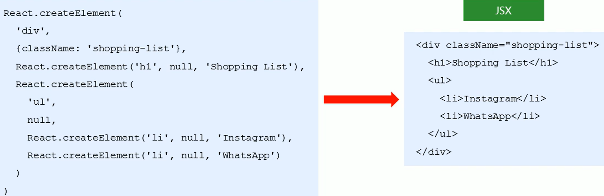

## JSX

#### 关于上一节的 React.createElement()问题

为什么只对于`createElement()`作一个了解，而不推荐在后续学习中使用：

1. 比较繁琐，且不简洁。
2. 不直观，无法一眼看出所描述的结构。
3. 不优雅，用户体验不爽。



通过上图我们就可以看出`createElement()`和`JSX`的区别了(直观结构，类似于HTML，容易读懂)。这也是为什么后面我们将用`JSX`来替代它来渲染页面。


#### 1、JSX的基本使用

##### 1.1 JSX简介

`JSX`是`JavaScript XML`得到的简写，表示在JavaScript代码中写XML(HTML)格式代码。

优势：声明式语法更加直观、与HTML结构相同，降低了学习成本、提升开发效率。

> JSX是React的核心内容。


##### 1.2 使用步骤

1.使用JSX语法创建react元素

```js
// 使用JSX语法 创建react元素
const title = <h1>Hello JSX</h1>
```

2.使用 ReactDOM.render() 方法渲染 react元素到页面中

```js
ReactDOM.render(title,root)
```


##### 1.3 小结

1. 推荐使用JSX语法创建React元素

2. 写JSX就跟写HTML一样，更加直观、友好

3. JSX语法更能体现出React的声明式特点(描述UI长什么样)

4. 使用步骤：

   ```js
   // 1.使用JSX语法 创建react元素
   const title = <h1>Hello JSX</h1>
   // 2.将React元素渲染到页面上
   ReactDOM.render(title,root)
   ```


##### 1.3 注意点

1. React元素的属性名使用驼峰命名法。

2. JSX语法必须有一个根节点包裹其他子节点(一个节点除外)。

3. 特殊属性名：class => `className` 、for => htmlFor、tabindex => tabIndex。

4. 没有子节点的React元素可以用`/>`结束。

5. 推荐：使用`小括号包括JSX`，从而避免JS中自动插入分号陷阱。

   ```js
   // 使用小括号包裹JSX
   const dv = (
   	<div>Hello JSX </div>
   )
   ```


##### 思考

**为什么脚手架中可以使用JSX语法？**

1. JSX不是标准的ECMAScript语法，它是ECMAScript语法扩展。
2. 需要使用 babel 编译处理后，才能在浏览器环境中使用。
3. create-react-app 脚手架中已经默认有该配置，无需手动配置。
4. 编译JSX语法的包为：[@babel/preset-react](https://babeljs.io/docs/babel-preset-react)。


#### 2、JSX中使用JavaScript表达式

##### 2.1 嵌入JS表达式

数据存储在JS中。

**语法**：`{ JavaScript 表达式 }`

**注意**：语法中是`单大括号`，不是双大括号！

```js
// 样例模板
const name = 'Jack'
const dv = (
	<div>你好，我叫：？？？</div>
)

// 嵌入表达式后
const name = 'Jack'
const dv = (
	<div>你好，我叫：{name}</div>
)
```

> 类似于Vue中的插值语法“Mustache” => `{{}}`。


##### 注意点

* `单大括号`中可以使用任意的JavaScript表达式。
* JSX自身也是JS表达式。
* 注意：JS中的对象是一个例外(`JSX是不能直接通过{}去使用一个对象的`)，一般只会出现在style属性中。
* 注意：`不能在{}中出现语句`(比如：if/for等)。


#### 3、JSX的条件渲染

场景：loading效果。

条件渲染：根据条件渲染特定的JSX结构。

可以使用`if/else`或`三元运算符`或`逻辑与运算符`来实现。

```js
/** react18 **/
// 1.导入创建根节点(容器)函数
import { createRoot } from 'react-dom/client'
// 2.设置根节点
const container = createRoot(document.querySelector('#root'))
// 3.使用JSX语法创建react元素

const isloading = true
// if-else
// const loadData = () => {
//   if (isloading) {
//     return <div>loading...</div>
//   }
//   return <div>数据加载完毕，此处显示加载后的数据</div>
// }

// 三元表达式
// const loadData = () => {
//   return isloading ? <div>loading...</div> : <div>数据加载完毕，此处显示加载后的数据</div>
// }

// 逻辑与
const loadData = () => {
  return isloading && <div>loading...</div>
}

const title = <h1>条件渲染：{loadData()}</h1>
// // 4.将react元素渲染到根节点(容器)中
container.render(title)

/** react16 or react17 **/
// 1.导入react-dom
import ReactDOM from 'react-dom'
// 2.使用JSX语法创建react元素
const isloading = true
// if-else
// const loadData = () => {
//   if (isloading) {
//     return <div>loading...</div>
//   }
//   return <div>数据加载完毕，此处显示加载后的数据</div>
// }

// 三元表达式
// const loadData = () => {
//   return isloading ? <div>loading...</div> : <div>数据加载完毕，此处显示加载后的数据</div>
// }

// 逻辑与
const loadData = () => {
  return isloading && <div>loading...</div>
}

const title = <h1>条件渲染：{loadData()}</h1>

// 3.渲染react元素到页面上
ReactDOM.render(title, document.querySelector('#root'))
```


#### 4、JSX的列表渲染

如果要渲染一组数据，应该使用数组的`map()`方法。

```js
// 1.声明并初始化一个数组
const songs = [
    {id: 1, name: '痴心绝对'},
    {id: 2, name: '像我这样的人'},
    {id: 3, name: '南山南'},
]
// 2.将数据插入react元素中
const list = (
	<ul>
    	{ songs.map(item=> <li>{item.name}</li> )}
    </ul>
)
```

注意：渲染列表时应该添加 key 属性，`key 属性的值要保证唯一`。

```js
const list = (
	<ul>
    	{ songs.map(item=> <li key={item.id} >{item.name}</li> )}
    </ul>
)
```

原则：map() 遍历谁，就给谁添加 key 属性。

> 我们在给列表项设置key时，应该避免使用索引号作为key。


#### 5、JSX的样式处理

##### 5.1 行内样式-style

```js
<h1 style={{ color: 'red', backgroundColor: 'skyblue' }}>
    JSX的样式处理
</h1>
```


##### 5.2 类名—className(推荐)

```js
<h1 className="title">
    JSX的样式处理
</h1>
```


#### 6、JSX总结

1. JSX是React的核心内容
2. JSX表示在JS代码中写HTML代码结构，是React声明式的体现。
3. 使用JSX配合嵌入式的JS表达式、条件渲染、列表渲染，可以描述任意UI结构。
4. 推荐使用 className 的方式给JSX添加样式。
5. React 完全利用JS语言自身的能力来编写UI，而不是造轮子增强 HTML 功能。


