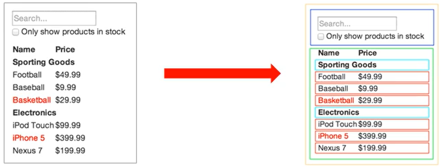
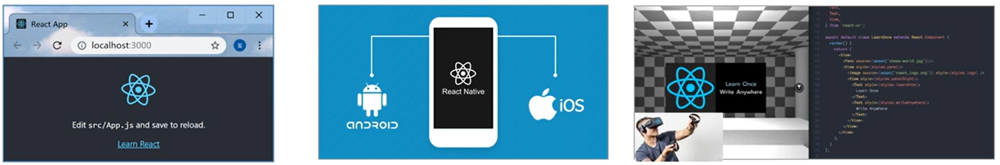
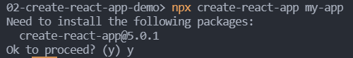
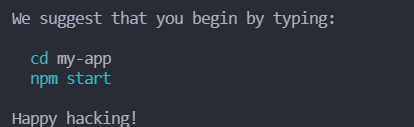

## react — 基础

#### 1、React概述

##### 1.1 什么是React


React是一个用于构建用户界面的JavaScript库。

用户界面：HTML页面(前端)

React主要用来写HTML页面，或构建Web应用。

如果从MVC的角度看，React仅仅是视图层(V)，也就是只负责视图的渲染，而并非提供了完整的M和C的功能。

React起源于 FaceBook的内部项目，后又用来架设 Instagram的网站 ，并于 2013 年5月开源。


##### 1.2 React特点

React的特点如下：

* 声名式

* 基于组件

* 学习一次随处使用


###### 1.2.1 声名式

你只需要描述UI(HTML)看起来是什么样，就跟写HTML一样。

React负责渲染 UI ，并在数据变化时更新 UI。

```react
const jsx = <div className = "app">
	<h1>Hello React！ 动态变化数据：{count}</h1>      
</div>
```


###### 1.2.2 基于组件

* 组件是React中最重要的内容。

* 组件表示页面中的部分内容。

* 组合、复用多个组件，可以实现完整的页面功能。




###### 1.2.3 学习一次，随处使用

* 使用React可以开发Web应用。
* 使用React可以开发移动端原生应用(react-native)
* 使用React可以开发VR(虚拟现实)应用(react 360)




#### 2、React基本使用

##### 2.1 React安装

安装命令：

```bash
# 因为在初学REACT的时候，版本不是最新的，你可以按下面的来安装
npm i react@16.8.6 react-dom@16.8.6
```

解析：

* react包是核心，提供创建元素，组件等功能。
* react-dom包提供 DOM 相关功能等。


##### 2.2 React的使用

1. 引入react 和 react-dom 两个js文件

   ```html
   <!-- 1.引入js文件 -->
   <script src="./node_modules/react/umd/react.development.js"></script>
   <script src="./node_modules/react-dom/umd/react-dom.development.js"></script>
   ```

2. 创建React元素

   ```html
   <script>
   	const title = React.createElement('h1',null,'Hello React')
   </script>
   ```

3. 渲染React元素到页面中

   ```html
   <div id="app"></div>
   
   <script>
       const title = React.createElement('h1',null,'Hello React')
       ReactDOM.render(title,document.querySelector('#app'))
   </script>
   ```


##### 2.2 方法的说明

* React.createElement() 说明

  ```js
  // 返回值：React元素
  // 第一个参数：要创建的React元素名称
  // 第二个参数：该React元素的属性
  // 第三个及其以后的参数：该React元素的子节点
  const el = React.createElement('h1', { title: '标题' }, 'Hello React')
  ```

* `ReactDOM.render()` 说明

  ```js
  // 第一个参数：要渲染的React元素
  // 第二个参数：DOM对象，用于指定渲染到页面中的位置
  ReactDOM.render(el, document.querySelector('app'))
  ```


#### 3、React脚手架的使用

##### 3.1 React脚手架意义

1. 脚手架是开发 现代Web 应用的必备。 
2. 充分利用 Webpack、Babel、ESLint 等工具辅助项目开发。
3. 零配置，无需手动配置繁琐的工具即可使用。 
4. 关注业务，而不是工具配置


##### 3.2 使用React脚手架初始化项目

###### 3.2.1 创建React项目

[Create React App](https://github.com/facebookincubator/create-react-app) 是一个用于**学习 React** 的舒适环境，也是用 React 创建**新的[单页](https://zh-hans.legacy.reactjs.org/docs/glossary.html#single-page-application)应用**的最佳方式。

它会配置你的开发环境，以便使你能够使用最新的 JavaScript 特性，提供良好的开发体验，并为生产环境优化你的应用程序。你需要在你的机器上安装 [Node >= 14.0.0 和 npm >= 5.6](https://nodejs.org/en/)。要创建项目，请执行：

```bash
npx create-react-app my-app
cd my-app
npm start
```

如果是第一次执行该命令，会提示要你安装`create-react-app`脚手架。



项目创建成功：




###### 3.2.2 启动React项目

根据后面的提示，依次输入上述命令：

```bash
# 进入项目根目录
cd my-app
# 启动项目
npm start
```

项目运行的结果如下：


##### 3.3 React脚手架细节补充

###### 3.3.1 npx命令介绍

`npm v5.2.0`引入的一条命令。

**目的**：提升包内提供的命令行工具的使用体验 。

**原来**：先安装脚手架包，再使用这个包中提供的命令 。

**现在**：无需安装脚手架包，就可以直接使用这个包提供的命令。


###### 3.3.2 补充说明

推荐下面几种方式来创建`React`项目：

1. `npx create-react-app my-app`

   > 最后的`my-app`是创建react项目的项目名称。

2. `npm init react-app my-app`

3. `yarn create react-app my-app`


关于`yarn`的补充说明：

* yarn是 Facebook 发布的包管理器，可以看作是npm的替代品，功能与npm相同。
* yarn 具有快速、可靠和安全的特点
* 初始化新项目：`yarn init`
* 安装包：`yarn add 包名称`
* 安装项目依赖项：`yarn`
* 其他命令，请参考[yarn文档](https://www.yarnpkg.cn/cli/install)


##### 3.4 在脚手架中使用React

1.导入react 和 react-dom 两个包

```js
// 基于ES6模块化语法导入两个react包
import React from 'react'
import ReactDOM from 'react-dom'
```

2.调用 `React.createElement()` 方法创建 react元素。

3.调用 `ReactDOM.render()` 方法渲染 react 元素到页面中。


以上所有代码都写在`src`下的`index.js`文件中。

```js
// 1.导入react
import React from 'react'
import ReactDOM from 'react-dom'

// 2.创建react元素
const title = React.createElement('h1', null, 'Hello Reacct!!!')

// 3.渲染react元素到页面上
ReactDOM.render(title, document.querySelector('#root'))
```

页面渲染结果：


#### 4、总结

1. React是构建用户界面的JavaScript库。

2. 使用react时，推荐使用脚手架方式。

3. 初始化项目(创建项目)命令：`npx create-react-app my-app`。

4. 启动项目命令：`npm start`(或`yarn start`)。

5. React.createElement() 方法用于创建react元素 (了解)。

6. ReactDOM.render() 方法负责渲染 react元素到页面中。

   > 该方法主要用于Web应用中，如果是其他移动端，VR端有专门的实现方法。


