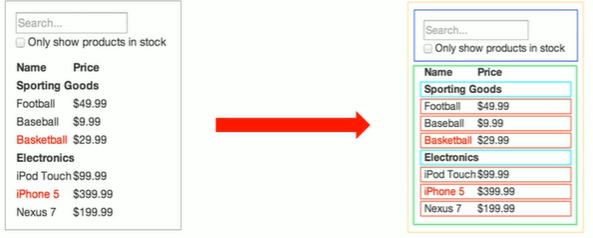
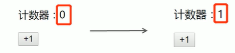
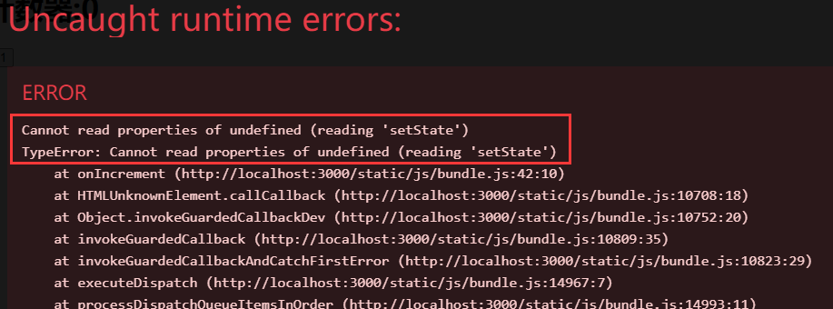
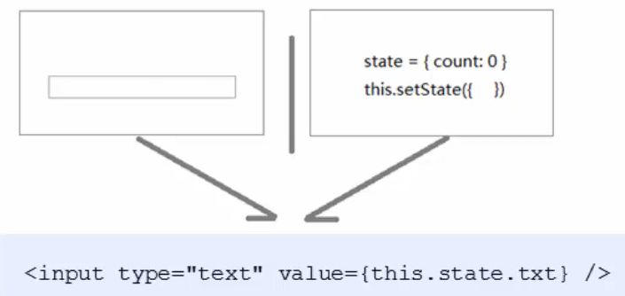
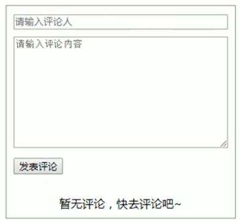
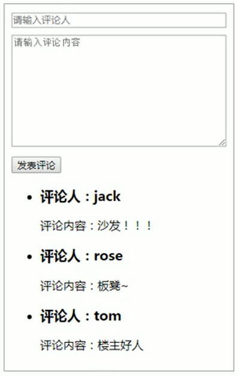

## React — 组件

#### 1、React组件介绍

1. 组件是React的 **一等公民** ，使用React就是在用组件。
2. 组件表示页面中的部分功能。
3. 组合多个组件实现完整的页面功能。
4. `特点`：可复用、独立、可组合。




#### 2、React组件的两种创建方式

##### 2.1 使用函数创建组件

###### 2.1.1 创建函数组件

函数组件：使用JS的函数(或箭头函数)创建的组件。

两个约定：

* 函数名称必须是以`大写字母开头`，React 据此区分 组件 和 普通的React 元素。
* 函数组件`必须有返回值`，表示该组件的结构。

如果返回值为null，则表示不渲染任何内容。

```js
function Hello(){
    return (
    	<div>这是我的第一个函数组件</div>
    )
}
```


###### 2.1.2 使用函数组件

**渲染函数组件**：`用函数名作为组件的标签名`。

> 组件标签可以是单标签，也可以是双标签。

```js
function Hello(){
    return (
    	<div>这是我的第一个函数组件</div>
    )
}
ReactDOM.render(<Hello/>,root)
```


##### 2.2 使用类创建组件

类组件：使用ES6的 class 关键字创建的组件。

4个约定：

* 类名称也必须以`大写字母开头`。
* 类组件应该继承于 `React.Component` 父类，从而可以使用父类中提供的方法或属性。
* 类组件必须提供 `render()` 方法。
* render() 方法`必须有返回值`，表示该组件的结构。

```js
class Hello extends React.Component{
    render(){
        return <div>Hello Class Component!</div>
    }
}
// 用类名作为标签名来渲染
ReactDOM.render(<Hello/>,root)
```


##### 2.3 抽离为独立的JS文件

思考：项目中组件多了之后，该如何组织这些组件呢？

> 选择一：将所有组件放在同一个JS文件中。
>
> 选择二：将每个组件放到单独的JS文件中。

组件作为一个独立的个体，一般都会`放到一个单独的JS文件中`。


示例：

1. 创建Hello.js
2. 在Hello.js中导入React
3. 创建组件(函数或类)
4. 在Hello.js中导出该组件(暴露)
5. 在index.js中导入Hello组件
6. 渲染组件

```js
// Hello.js
import React from 'react'
class Hello extends React.Component{
    render(){
        return <div>Hello Class Component!</div>
    }
}
// 导出Hello组件
export default Hello
```


#### 3、React事件处理

##### 3.1 事件绑定

React事件绑定语法与DOM事件语法相似。

语法：`on+事件名称=(事件处理程序)`，比如：onClick={()=>()}。

注意：`React事件采用 驼峰命名法`，比如：onMouseEnter、onFocus等。


在函数组件中绑定事件：

```js
function App(){
    function handleClick(){
        console.log('单击事件触发了')
    }
    return (
    	<button onClick={handleClick}>点我</button>
    )
}
```


在类组件中绑定事件：

```js
class App extends React.Component {
    handleClick() {
        console.log('单击事件触发了')
    }
    render() {
        return (
        <button onClick={this.handleClick}></button>
        )
    }
}
```


##### 3.2 事件对象

可以通过`事件处理程序的参数`获取到事件对象。

React中的事件对象叫做：`合成事件`(对象)。

合成事件：兼容所有浏览器，无需担心跨浏览器兼容性问题。

```js
function handleClick(e) {
    e.preventDefault()
    console.log('事件对象', e)
}
<a onClick={handleClick}>点我，不会跳转页面</a>
```


#### 4、有状态和无状态组件

* 函数组件又叫`无状态组件`，类组件又叫`有状态组件`。

* 状态(state) 即 `数据`。

* 函数组件没有自己的状态，`只负责数据展示`(静)。

* 类组件有自己的状态，`负责更新UI`，让页面“动”起来。

比如计数器案例中，点击按钮让数值加 1 。0 和 1 就是不同时刻的状态，而由 0 变为 1 就表示状态发生了变 化。状态变化后，UI 也要相应的更新。React 中想要实现该功能，就要使用有状态组件来完成。




#### 5、组件中的 state 和 setState()

##### 5.1 state的基本使用

状态(state) 即数据，是组件内部的`私有`数据，只能在组件内部使用。

`state的值是对象`，表示一个组件中可以有多个数据。

初始化state如下：

```js
class Hello extends React.Component {
    constructor() {
        super()
        // 初始化state
        this.state = {
        count: 0
        }
    }
    render() {
        return (
        <div>有状态组件</div>
        )
    }
}
```

简写以后(推荐)：

```js
class Hello extends React.Component {
    state = {
        count: 0,
    }
    render() {
        return (
        <div>有状态组件</div>
        )
    }
}
```


获取状态：`this.state`

```js
class Hello extends React.Component {
    // 简化语法
    state= {
        count: 0
    }
    render() {
        return (
        <div>有状态组件，{this.state.count}</div>
        )
    }
}
```


##### 5.2 setState()修改状态

组件的状态是可变的，我们可以通过下面的方式修改数据：

```js
this.setState({要修改的数据})
```

示例：

```js
// 正确
this.setState({
    count: this.state.count + 1
})
// 错误
this.state.count += 1
```

在使用setState修改state值时，如果state中有多个数据，我们只需要将需要修改的数据放到setState里面即可，并不需要把state中所有数据都放里面。修改其中一个数据，并不会影响其他数据的值。

> 不要直接修改state中的值，这是错误的！！！


setState()作用：

1. 修改state
2. 更新UI

> 思想：数据先发生改变，再去改变视图 => 数据驱动视图。


##### 5.3 从JSX中抽离事件处理程序

JSX中掺杂了过多的JS逻辑代码，会显得非常混乱 => 不易维护。

推荐：`将逻辑抽离到单独的方法中，保证JSX结构清晰`。



原因：事件处理程序中 this 的值为 undefined。

希望：this 指向组件实例（render方法中的this即为组件实例）。


#### 6、事件绑定 this 指向

##### 6.1 箭头函数

利用箭头函数自身不绑定this的特点。

render()方法中的this为组件实例，可以获取到setState()。

```js
class Hello extends React.Component{
    onIncrement() {
        this.setState({ … })
    }
    render() {
        // 箭头函数中的this指向外部环境，此处为：render()方法
        return (
        <button onClick={() => this.onIncrement()}></button>
        )
    }

}
```


##### 6.2  Function.prototype.bind()

利用ES5中的bind方法，将事件处理程序中的this与组件实例绑定到一起：

```js
class Hello extends React.Component {
    constructor() {
        super()
        this.onIncrement = this.onIncrement.bind(this)
    }
    // ...省略 onIncrement
    render() {
        return (
        <button onClick={this.onIncrement}></button>
        )
    }
}

```


##### 6.3 class实例方法

利用箭头函数形式的class实例方法。

注意：该语法是实验性语法，但是，由于babel的存在可以直接使用。

```js
class Hello extends React.Component {
    onIncrement = () => {
        this.setState({ … })
    }
    render() {
        return (
        <button onClick={this.onIncrement}></button>
        )
    }
}
```


##### 6.4 总结

1. 推荐：`使用class实例方法`
2. 箭头函数
3. bind


#### 7、表单处理

##### 7.1 受控组件

###### 7.1.1 介绍

**受控组件**：其中受到React控制的表单元素。

HTML中的表单元素是可输入的，也就是有自己的可变状态。而，React中的可变状态通常保存在state中，并且只能通过setState()方法来修改。

```js
state = {
    count: 0
}
this.setState({
    count: this.state.count + 1
})
```

React件state与表单元素值value绑定在一起，由state的值来控制表单元素的值。




###### 7.1.2 步骤

1.在state中添加一个状态，作为表单元素的value值(控制表单元素值的来源)

```js
state = {text:''}
```

```jsx
<input type="text" value={this.state.txt} />
```


2.给表单元素绑定 change 事件，将 表单元素的值 设置为 state 的值（控制表单元素值的变化）

```jsx
<input type="text" value={this.state.txt} 
    onChange={e=> this.setState({txt:e.target.value})}/>
```


###### 7.1.3 示例

1. 文本框、富文本框、下拉框
2. 复选框


###### 7.1.14 多表单元素的优化

问题：每个表单元素都有一个单独的事件处理函数太繁琐(**×**代码复用)。

优化：使用一个事件处理程序同时处理多个表单元素。


优化步骤：

1. 给表单元素添加name属性，名称与state相同
2. 根据表单元素类型获取对应值
3. 在change事件处理程序中通过[name]来修改对应的state

```jsx
<input type="text" name="txt" value={this.state.txt} 
    onChange={this.handleForm} />
```

```js
// 根据表单元素类型获取值
const value = target.type ==='checkbox'?
      target.checked:target.value

// 根据name设置对应state
this.setState({
	[name]:value
})
```


##### 7.2 非受控组件(DOM方式)

###### 7.2.1 说明

说明：借助于 ref，使用原生 DOM 方式来获取表单元素值。

ref的作用：获取DOM或组件。

> 和Vue中的ref使用方法类似。


###### 7.2.2 使用步骤

1.调用 React.createRef() 方法创建一个 ref 对象：

```js
constructor() {
    super()
    this.txtRef = React.createRef()
}
```

2.将创建好的 ref 对象添加到文本框中

```js
<input type="text" ref={this.txtRef} />
```

3.通过 ref 对象获取到文本框的值

```js
console.log(this.txtRef.current.value)
```


#### 8、总结

1. 组件的创建方式：函数组件 和 类组件
2. 无状态（函数）组件，负责静态结构展示
3. 有状态（类）组件，负责更新UI，让页面动起来
4. 绑定事件注意this指向问题
5. 推荐使用受控组件来处理表单
6. 完全利用JS语言的能力创建组件，这是React思想


#### 9、案例—评论列表

页面效果展示：

 


##### 9.1 需求分析

① 渲染评论列表（列表渲染）

② 没有评论数据时渲染：暂无评论（条件渲染） 

③ 获取评论信息，包括评论人和评论内容（受控组件） 

④ 发表评论，更新评论列表（setState()）


##### 9.2 渲染评论列表

① 在 state 中初始化评论列表数据 

② 使用数组的map方法遍历state中的列表数据 

③ 给每个被遍历的li元素添加key属性

```jsx
//准备数据
// 初始化状态
state = {
    comments: [
        { id: 1, name: 'jack', content: '沙发！！！' },
        { id: 2, name: 'rose', content: '板凳~' },
        { id: 3, name: 'tom', content: '楼主好人' },
    ],
}

// 渲染列表
<ul>
    {this.state.comments.map((item) => (
        <li key={item.id}>
            <h3>评论人：{item.name}</h3>
            <p>评论内容：{item.content}</p>
        </li>
    ))}
</ul>
```


##### 9.3 渲染无评论

① 判断列表数据的长度是否为0 

② 如果为0，则渲染暂无评论

```jsx
{this.state.comments.length === 0 ? (
    <div className="no-comment">暂无评论，快去评论吧~</div>
) : (
    <ul>
        {this.state.comments.map((item) => (
            <li key={item.id}>
                <h3>评论人：{item.name}</h3>
                <p>评论内容：{item.content}</p>
            </li>
        ))}
    </ul>
)}
```


##### 9.4 获取评论信息

① 使用受控组件方式处理表单元素

事件处理函数：

```js
// 处理表单元素
handleForm = (e) => {
    const { name, value } = e.target
    this.setState({
        [name]: value,
    })
}
```

React元素处理：

```jsx
// render函数中
// 解构对象
const { userName, userContent } = this.state

{/* DOM元素 */}
<input className="user" type="text" placeholder="请输入评论人" autoComplete="off" name="userName" value={userName} onChange={this.handleForm} />
<textarea onChange={this.handleForm} name="userContent" value={userContent} className="content" cols="30" rows="10" placeholder="请输入评论内容" />
```

实现数据双向绑定。


##### 9.5  发表评论

① 给按钮绑定单击事件 

② 在事件处理程序中，通过state获取评论信息 

③ 将评论信息添加到state中，并调用 setState() 方法更新state 

④ 边界情况：清空文本框 

⑤ 边界情况：非空判断