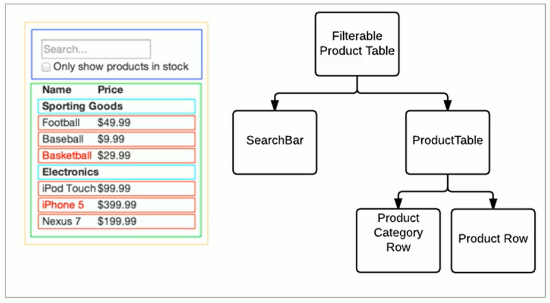
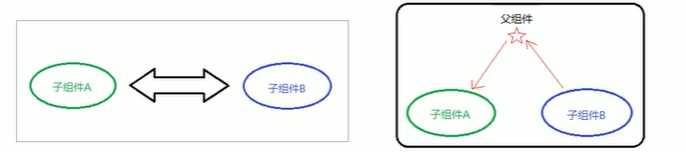
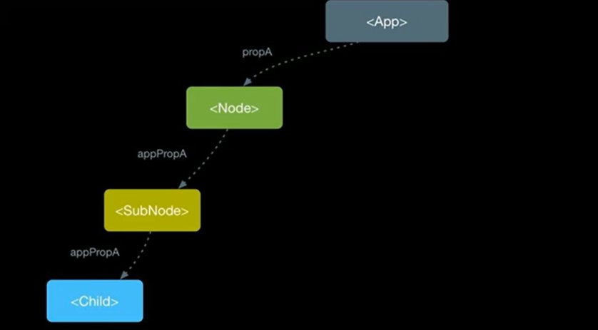
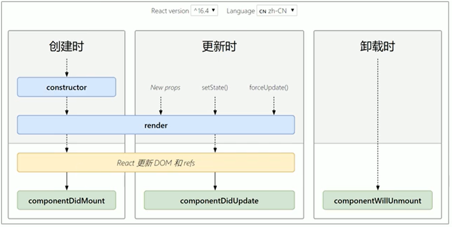
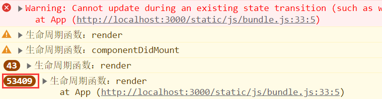

## React—组件进阶

#### 1、组件通讯介绍

`组件`是独立且封闭的单元，默认情况下，只能使用组件自己的数据。在组件化过程中，我们将一个完整的功能 拆分成多个组件，以更好的完成整个应用的功能。而在这个过程中，多个组件之间不可避免的要共享某些数据 。为了实现这些功能，就需要打破组件的独立封闭性，让其与外界沟通。这个过程就是`组件通讯`。




#### 2、组件的props

##### 2.1 介绍

组件是封闭的，要接收外部数据应该通过`props`来实现。

**props的作用**：接收传递给组件的数据。

**传递数据**：给组件标签添加属性。

**接收数据**：函数组件通过`参数props`接收数据，类组件通过`this.props`接收数据。


代码示例：

 传递数据=>

```jsx
<Hello name="jack" age={19} />
```

> React传递数据和Vue是一样的，都是在`以属性的方式将数据传递给子组件`。

① 函数组件props接收数据

```jsx
function Hello(props){
    console.log(props)
    return (
    	<div>接收到数据:{props.name}</div>
    )
}
```

②类组件props接收数据

```jsx
class Hello extends React.Component{
 	render(){
        return (
        	<div>接收到的数据：{this.props.age} </div>
        )
    }   
}
```


##### 2.2 props特点

**1.**可以给组件传递任意类型的数据 。

**2.**props 是只读的对象，只能读取属性的值，无法修改对象 。

**3.**注意：使用类组件时，如果写了构造函数，应该将 props 传递给 super()，否则，无法在构造函数中获取到 props！

```jsx
class Hello extends React.Component {
    constructor(props) {
        // 推荐将props传递给父类构造函数
        super(props)
    }
    render() {
        return <div>接收到的数据：{this.props.age}</div>
    }
}
```


#### 3、组件通讯的三种方式

##### 3.1 父传子

**1.**父组件提供要传递的state数据。

**2.**给子组件标签添加属性，值为`state`中的数据。

**3.**子组件通过`props`接收父组件中传递的数据。

```js
// 父组件
class Parent extends React.Component {
    state = { lastName: '王' }
    render() {
        return (
            <div>
            传递数据给子组件：<Child name={this.state.lastName} />
            </div>
        )
    }
}

// 子组件
function Child(props) {
    return <div>子组件接收到数据：{props.name}</div>
}
```


##### 3.2 子传父

思路：利用回调函数，父组件提供回调，子组件调用，将要传递的数据作为回调函数的参数。

1. 父组件提供一个回调函数(用于接受数据)
2. 将该函数作为属性的值，传递给子组件

```js
class Parent extends React.Component {
    getChildMsg = (msg) => {
        console.log('接收到子组件数据', msg)
    }
    render() {
        return (
            <div>
            子组件：<Child getMsg={this.getChildMsg} />
            </div>
        )
    }
}
```

3. 子组件通过props调用回调函数
4. 将子组件的数据作为参数传递给回调函数

```jsx
class Child extends React.Component{
    state = {childMsg : ''}
	handleClick = () => {
        this.props.getMsg(this.state.childMsg)
    }
    return (
    	<button onClick={this.handleClick}>点我，给父组件传递数据</button>
    )
}
```


##### 3.3 兄弟组件通讯

* 将`共享状态`提升到最近的公共父组件中，由`公共父组件`管理这个状态
*  思想：`状态提升`
* 公共父组件职责：1. 提供共享状态 2. 提供操作共享状态的方法
*  要通讯的子组件只需通过` props` 接收状态或操作状态的方法




#### 4、Context

##### 4.1 何时使用Context

思考：APP组件要传递数据给Child组件，该如何处理？

> [传递 props](https://zh-hans.react.dev/learn/passing-props-to-a-component) 是将数据通过 UI 树显式传递到使用它的组件的好方法。
>
> 但是当你需要在组件树中深层传递参数以及需要在组件间复用相同的参数时，传递 props 就会变得很麻烦。最近的根节点父组件可能离需要数据的组件很远，[状态提升](https://zh-hans.react.dev/learn/sharing-state-between-components) 到太高的层级会导致 “逐层传递 props” 的情况。



在React中就有一个更好的方式来进行传递数据：`Context`。

Context作用：跨组件传递数据(比如：主题、语言等)。


##### 4.2 使用步骤

###### 4.2.1 React 16.x版本 Context使用

1.调用React.createContext() 创建Provider(提供数据)和Consumer(消费数据)两个组件。

```js
import React from 'react'
const {Provider,Consumer} = React.createContext()
```

2.使用Provider组件作为父结点。

```jsx
<Provider>
	<div className="App">
    	<Child1/>
    </div>
</Provider>
```

3.设置value属性，表示要传递的数据。

```jsx
<Provider value="pink"></Provider>
```

4.调用Consumer组件接受数据。

```jsx
<Consumer>
	{data => <span>data参数表示接受到的数据 -- {data} </span>}
</Consumer>
```


###### 4.2.2 React18.x.x关于Context使用

参考官网：(https://zh-hans.react.dev/learn/passing-data-deeply-with-context#step-1-create-the-context)


##### 4.3 总结

1. 如果两个组件是远方亲戚(比如，嵌套多层)可以使用Context实现组件通讯。
2. Context提供了两个组件：Provider和Consumer。
3. Provider组件：用来提供数据。
4. Consumer组件：用来消费数据。


#### 5、props深入

##### 5.1 children属性

children属性：表示组件标签的子节点。当组件标签有子节点时，props就会有该属性。

children属性与普通的props一样，值可以是任意值(文本、React元素、组件，甚至是函数)。

```jsx
function Hello(props){
	return (
    	<div>
        	组件创建的子节点：{props.children}
        </div>
    )
}

<Hello>我是子节点</Hello>
```

只要当组件标签中存在节点，该节点就会被传递到props的children属性中。反之，如果组件标签没有节点(文本节点，元素节点)，则props不会有children属性。

> 我们可以把children属性和vue中插槽进行对比理解。


##### 5.2 props校验

###### 5.2.1 props可能出现的问题

对于组件来说，props是外来的，无法保证组件使用者传入什么格式的数据。

如果传入的数据格式不对，可能会导致组件内部报错。

关键问题：组件的使用者不知道明确的错误原因。

```js
// 小明创建的组件App
function App(props) {
    const arr = props.colors
    const lis = arr.map((item, index) => <li key={index}>{item.name}</li>)
    return (
    <ul>{lis}</ul>
    )
}
// 小红使用组件App
<App colors={19} />
```


###### 5.2.2 什么是props校验

props 校验：允许在创建组件的时候，就指定 props 的类型、格式等 。

作用：捕获使用组件时因为props导致的错误，给出明确的错误提示，增加组件的健壮性。

```js
App.propTypes = {
    colors: PropTypes.array
}
```

如果我们还是使用上面的那个组件，通过这里的配置，最后我们可以看到控制台报错下面信息：


###### 5.2.3 如何实现props校验

步骤：

1. 安装包 prop-types （yarn add prop-types / npm i prop-types）。
2. 导入 prop-types 包。
3. 使用`组件名.propTypes={} `来给组件的props添加校验规则。
4. [校验规则](https://legacy.reactjs.org/docs/typechecking-with-proptypes.html)通过PropTypes对象来指定。

```jsx
import PropTypes from 'prop-types'
function App(props){
	retrun (
    	<h1>Hi,{props.colors}</h1>
    )
}

App.propTypes = {
    // 约定colors属性为array类型
    // 如果类型不对，则报出明确错误，便于分析错误原因
    colors:PropTypes.array
}
```


###### 5.3.4 props校验规则

1. 常见类型：array、bool、func、number、object、string
2. React元素类型：element
3. 必填项：isRequired
4. 特定结构的对象：shape({ })

```js
// 常见类型
optionalFunc: PropTypes.func,
// 必选
requiredFunc: PropTypes.func.isRequired,
// 特定结构的对象
optionalObjectWithShape: PropTypes.shape({
    color: PropTypes.string,
    fontSize: PropTypes.number
})
```


###### 5.3.5 props的默认值

场景：分页组件 => 每页显示条数

作用：给props设置默认值，在未传入props时生效

```js
function App(props) {
return (
    <div>
    此处展示props的默认值：{props.pageSize}
    </div>
    )
}
// 设置默认值
App.defaultProps = {
    pageSize: 10
}
// 不传入pageSize属性
<App />
```


#### 6、组件的生命周期

##### 6.1 概述

**了解生命周期意义**：组件的生命周期有助于理解组件的运行方式、完成更复杂的组件功能、分析组件错误原因等。

**组件的生命周期**：组件从被创建到挂载到页面中运行，再到组件不用时卸载的过程 。

 生命周期的每个阶段总是伴随着一些方法调用，这些方法就是生命周期的钩子函数。

**钩子函数(Hook)的作用**：为开发人员在不同阶段操作组件提供了时机。

> 注意：只有类组件才有生命周期。


##### 6.2 生命周期的三个阶段

1. 每个阶段的执行时机
2. 每个阶段的钩子函数执行顺序
3. 每个阶段钩子函数的作用




###### 6.2.1 创建时(挂载阶段)

执行时机：组件创建时（页面加载时）

执行顺序：


| 钩子函数          | 触发时机                | 作用                                                  |
| ----------------- | ----------------------- | ----------------------------------------------------- |
| constructor       | 创建组件时，最先运行    | 1.初始化state          <br />2.为事件处理程序绑定this |
| render            | 每次组件渲染都会触发    | 渲染UI（`注意：不能调用setState()`）                  |
| componentDidMount | 组件挂载(完成DOM渲染)后 | 1.发送网络请求 <br/>2.DOM操作                         |

关于为什么不能在render函数中调用`setState()`：

> 前面我们已经了解了setState()，它既能更新状态(state)，又能更新UI。如果在render函数中你调用了setState()，那么它就会去调用render()来更新UI。而render函数中又会在次调用setState()，双方反复调用形成一个递归，最后会直接报错：超出最大调用次数。

如下图，render函数的调用次数不断地增加。




###### 6.2.2 更新时(更新阶段)

执行时机：

1. setState()
2. forceUpdate()
3. 组件收到新的props

说明：以上三者任意一种变化，组件就会重新渲染。

执行顺序：


| 钩子函数           | 触发时机                | 作用                                                         |
| ------------------ | ----------------------- | ------------------------------------------------------------ |
| render             | 每次组件渲染都会触发    | 渲染UI(与挂载阶段是同一个render)                             |
| componentDidUpdate | 组件更新(完成DOM渲染)后 | 1.发送网络请求<br />2.DOM操作<br />注意：如果要setState()必须放在一个if条件中 |


###### 6.2.3 卸载时(卸载阶段)

执行时机：组件从页面中消失

| 钩子函数            | 触发时机               | 作用                             |
| ------------------- | ---------------------- | -------------------------------- |
| componentWillUnmout | 组件卸载(从页面中消失) | 执行清理工作(比如：清理定时器等) |


##### 6.3 不常用钩子函数介绍

旧版生命周期钩子函数(知道)：


新版生命周期钩子函数(知道)：


#### 7、render-props和高阶组件

##### 7.1 React组件复用概述

思考：如果两个组件中的部分功能相似或相同，该如何处理？

> 处理方式：复用相似的功能(联想组件封装)。

复用什么(结构/状态/状态逻辑)？

1. `state`

2. `操作state方法(组件状态逻辑)`

在React中有两种方式解决上述复用问题：

1. `render props 模式`

2. `高阶组件(HOC)`

> 需要注意：这两种方式不是新的API，而是利用React自身特点的编码技巧，演化而成的固定模式(写法)。


##### 7.2 render props 模式

###### 思路分析

思路：将要复用的state和操作state的方法封装到一个组件中。

问题1：如何拿到该组件中复用的state？

> 在使用组件时，添加一个值为函数的prop，通过 函数参数 来获取（需要组件内部实现）

```js
<Mouse />
```


问题2：如何渲染任意的UI？

> 使用该函数的返回值作为要渲染的UI内容（需要组件内部实现）

```jsx
<Mouse render={(mouse) => {}}/>

<Mouse render={(mouse) => (
    <p>鼠标当前位置 {mouse.x}，{mouse.y}</p>
)}/>
```


###### 使用步骤

1. 创建Mouse组件，在组件中提供复用的状态逻辑代码（1. 状态 2. 操作状态的方法） 
2. 将要复用的状态作为 props.render(state) 方法的参数，暴露到组件外部 
3. 使用 props.render() 的返回值作为要渲染的内容

```jsx
class Mouse extends React.Component {
    // … 省略state和操作state的方法
    render() {
        return this.props.render(this.state)
    }
}

<Mouse render={(mouse) => <p>鼠标当前位置 {mouse.x}，{mouse.y}</p>}/>
```


###### 演示Mouse组件复用

* Mouse组件负责：封装复用的状态逻辑代码（1. 状态 2. 操作状态的方法） 
* 状态：鼠标坐标（x, y）
* 操作状态的方法：鼠标移动事件
* 传入的render prop负责：使用复用的状态来渲染UI结构

```jsx
class Mouse extends React.Component {
    // … 省略state和操作state的方法
    render() {
        return this.props.render(this.state)
    }
}

<Mouse render={(mouse) => <p>鼠标当前位置 {mouse.x}，{mouse.y}</p>}/>
```


###### children 代替 render 属性

注意：并不是该模式叫 render props 就必须使用名为render的prop，实际上可以使用任意名称的prop。

把prop是一个函数并且告诉组件要渲染什么内容的技术叫做：render props模式。

推荐：使用 children 代替 render 属性

```jsx
<Mouse>
    {({x, y}) => <p>鼠标的位置是 {x}，{y}</p> }
</Mouse>
// 组件内部：
this.props.children(this.state)
```

```jsx
// Context 中的用法：
<Consumer>
    {data => <span>data参数表示接收到的数据 -- {data}</span>}	
</Consumer>
```


###### 代码优化

1. 推荐：给render props 模式添加props校验
2. 应该在组件卸载时接触 mousemove 事件绑定

```jsx
Mouse.propTypes = {
    chidlren: PropTypes.func.isRequired
}
```

```jsx
componentWillUnmount() {
    window.removeEventListener('mousemove', this.handleMouseMove)
}
```


##### 7.3 高阶组件

###### 概述

高阶组件目标：实现状态逻辑复用。

采用包装(装饰)模式，比如说：手机壳。

* 手机：获取保护功能
* 手机壳：提供保护功能

> 高阶组件就相当于手机壳，通过包装组件，增强组件功能。


###### 思路分析

`高阶组件`（HOC，Higher-Order Component）`是一个函数`，接收要包装的组件，返回增强后的组件

高阶组件内部`创建一个类组件`，在这个类组件中`提供复用的状态逻辑`代码，通过prop将复用的状态传递给 被包装组件 WrappedComponent。

```js
const EnhancedComponent = withHOC(WrappedComponent)
```

```js
// 高阶组件内部创建的类组件：
class Mouse extends React.Component {
    render() {
        return <WrappedComponent {...this.state} />
    }
}
```


###### 使用步骤

1. 创建一个函数，名称约定`以with开头`

```js
function withMouse() {}
```

2. 指定函数参数，参数应该以大写字母开头(作为要渲染的组件)

```js
function withMouse(WrappedComponent) {}
```

3.  在函数内部创建一个类组件，提供复用的状态逻辑代码，并返回

4. 在该组件中，渲染参数组件，同时将状态通过prop传递给参数组件

```js
function withMouse(WrappedComponent) {
    class Mouse extends React.Component {}
    return Mouse
}
```

```jsx
// Mouse组件的render方法中：
return <WrappedComponent {...this.state} />
```

5. 调用该高阶组件，传入要增强的组件，通过返回值拿到增强后的组件，并将其渲染到页面中

```jsx
// 创建组件
const MousePosition = withMouse(Position)
// 渲染组件
<MousePosition />
```


###### 设置displayName

* 使用高阶组件存在的问题：得到的两个组件名称相同 
* 原因：默认情况下，React使用组件名称作为 displayName 
* 解决方式：为 高阶组件 设置 displayName 便于调试时区分不同的组件
*  displayName的作用：用于设置调试信息（React Developer Tools信息）

设置方式：

```js
Mouse.displayName = `WithMouse${getDisplayName(WrappedComponent)}`

function getDisplayName(WrappedComponent) {
    return WrappedComponent.displayName || WrappedComponent.name || 'Component'
}
```


###### 传递props

问题：props丢失。

原因：高阶组件没有往下传递props

解决方式：

> 渲染 WrappedComponent 时，将 state 和 this.props 一起传递给组件。

传递方式：

```jsx
<WrappedComponent {...this.state} {...this.props} />
```


#### 8、总结

1. 组件通讯是构建 React 应用必不可少的一环。 
2. props 的灵活性让组件更加强大。 
3. 状态提升是React组件的常用模式。 
4. 组件生命周期有助于理解组件的运行过程。 
5. 钩子函数让开发者可以在特定的时机执行某些功能。 
6. render props模式和高阶组件都可以实现组件状态逻辑复用。 
7. 组件极简模型： (state, props) => UI。


