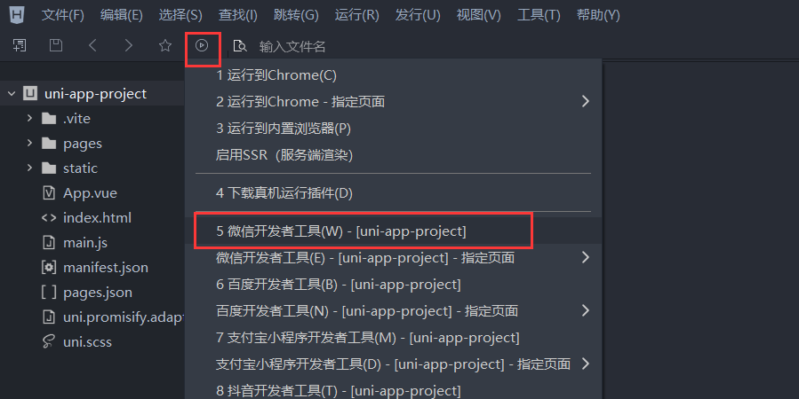

## uni-app—小兔鲜微信小程序实战

> uni-app官网：https://uniapp.dcloud.net.cn/
>
> 小兔鲜-小程序官网：https://megasu.gitee.io/uni-app-shop-note/

### uni-app基础+项目起步

#### 1、项目架构

uni-app 小兔鲜儿电商项目架构：


#### 2、创建项目

uni-app 支持两种方式创建项目： 

1. 通过 HBuilder X 创建 
2. 通过命令行创建

##### 2.1 HBuilder  X  安装

> 官网下载：https://www.dcloud.io/hbuilderx.html

1. 官网下载


2. 解压后将`.exe`文件作为快捷方式发送到桌面即可。


##### 2.2 HBuilderX 创建 uni-app 项目并启动起来

1. 选中新建项目


2. 选择 `uni-app` 项目，设置好`项目名称及存放地址`，模板选择`默认模板`(初学)，最后将vue版本修改为`vue3`版本


> uni-app项目是成功创建了，但是有一个问题，那就是它不能够在微信小程序中运行。微信小程序支持文件格式`wxml`和`wxss`。

3. 为了解决上述问题，我们需要安装插件`uni-app(vue3)编译器`


4. 运行项目

   选择微信开发者工具



​		配置微信开发者工具路径


​		出现问题 & 问题解决方案


5. 打开微信开发者工具解决问题

   打开设置，开启服务端口

   

   

6. HBuilderX再次启动调试

   上面配置好之后，我们通过HBuilderX编译项目后，将会自动以微信开发者工具为调试器打开项目。

   

小技巧：

> 问题：如果每次修改代码后，我们都要返回微信开发者工具查看效果，这样就会特别麻烦。
>
> 解决：将微信开发者工具上的`模拟器`分离窗口，这样下次写完代码可以直接看到效果。

分离窗口：


实现效果：


##### 2.3 总结步骤


#### 3、pages.json 和 tabBar 案例

##### 3.1 目录文件的功能详情


##### 3.2 创建一个新的页面


在`pages.json`中加上关于底部 tab `TabBar`属性：

```json
"tabBar": {
    "list": [
        {
            "pagePath": "pages/index/index",
            "text": "首页",
            "iconPath": "static/tabs/home_default.png",
            "selectedIconPath": "static/tabs/home_selected.png"
        },
        {
            "pagePath": "pages/my/my",
            "text": "我的",
            "iconPath": "static/tabs/user_default.png",
            "selectedIconPath": "static/tabs/user_selected.png"
        }
    ]
},
```

效果：


##### 3.3 总结步骤


#### 4、uni-app和原生小程序开发区别

每个页面是一个 .vue 文件，数据绑定及事件处理同 Vue.js 规范：


1. 属性绑定 src="{{ url }}" 升级成 :src="url"。
2. 事件绑定 bindtap="eventName" 升级成 @tap="eventName"，支持（）传参。
3. `支持 Vue 常用指令`  v-for、 v-if、v-show、v-model 等。

> 温馨提示：调用接口能力，建议前缀 `wx` 替换为 `uni` ，养成好习惯，这样支持多端开发。


#### 5、命令行创建uni-app项目

##### 5.1 按照官网提示按照模板

vue3+ts版: 

```bash
npx degit dcloudio/uni-preset-vue#vite-ts my-vue3-project
```

- npx ： 是 Node.js 的一个命令行工具，它在运行时帮助我们执行安装在本地项目中的 npm 包。
- degit：是一个命令行工具，用于从远程代码库中快速克隆仓库的特定版本或分支，而不需要复制整个代码库的历史记录。它是由 Rich Harris 创建，为了方便在开发过程中快速开始新项目或者拷贝已有项目的特定版本而设计。

> 官网链接：https://uniapp.dcloud.net.cn/quickstart-cli.html#创建uni-app


##### 5.2 HBuilderX 安装内置终端


按照提示，确认下载，等待安装成功即可。


##### 5.3 安装依赖


```bash
# 这里用的是npm包管理器，使用其他包管理器进行安装依赖也行
npm install
```


##### 5.4 编译和运行项目

首先，查看`package.json`文件中运行项目的脚本命令：


执行脚本命令：

```bash
# 编译微信小程序平台
npm run dev:mp-weixin
```

打开微信开发者工具，导入下面的`mp-weixin`文件目录。


最后，在按照前面所学对项目中的部分代码进行修改即可。


##### 5.5 总结步骤


#### 6、VS Code 开发 uni-app 项目

##### 6.1 为什么选择 VS Code ？ 

* HbuilderX 对 TS 类型支持暂不完善 
* VS Code 对 TS 类型支持友好，熟悉的编辑器


##### 6.2 安装插件

###### uni-create-view

> 可以方便我们在VS Code中创建视图和组件。


安装该插件后，在我们右击目录时，可以创建uniapp页面。


如果你遇到了和我一样的问题：新建uniapp页面，没有同名的文件夹，那你可以按下面进行修改设置。


###### uni-helper

> 可以让我们在VS Code中有uni-app的代码提示功能。


例如：

`pages.json`


`xx.vue`


###### uniapp小程序扩展

> 自动提示标签可用属性,鼠标悬浮查询属性文档,新增支持uview的组件提示。


效果如下：


##### 6.3 ts类型校验

###### 安装类型声明文件

```bash
npm i -D @types/wechat-miniprogram @uni-helper/uni-app-types
```

* @types/wechat-miniprogram：微信小程序类型声明文件提示
* @uni-helper/uni-app-types：uni-app的类型声明文件提示

###### 配置 tsconfig.json

```json
"types": [
    "@dcloudio/types",
    // 添加微信小程序/uniapp的类型声明文件支持
    "@types/wechat-miniprogram",
    "@uni-helper/uni-app-types"
],
"vueCompilerOptions":{
    "experimentalRuntimeMode":"runtime-uni-app"
}
```


##### 6.4 json注释问题

在uni-app中，`manifest.json`和`pages.json`是允许写注释的，但是在VS Code中会进行报错处理。这种报错对于我们开发者是特别敏感的，我们可以通过下面的方式关闭掉它：


> jsonc表示是允许写注释的。


##### 6.5 遇到的问题

###### 在vue组件中使用view标签报错 、tsconfig报错


原因：没有在`tsconfig.json`中设置好vue编译器。

解决：vueCompilerOptions和compilerOptions同级即可。

```json
{
    "extends": "@vue/tsconfig/tsconfig.json",
    "compilerOptions": {
        "allowJs": true,
        "sourceMap": true,
        "baseUrl": ".",
        "paths": {
            "@/*": [
                "./src/*"
            ]
        },
        "lib": [
            "esnext",
            "dom"
        ],
        "types": [
            "@dcloudio/types",
            "miniprogram-api-typings",
            "@uni-helper/uni-app-types"
        ],
    },
    "vueCompilerOptions": {
        // experimentalRuntimeMode 已废弃，现调整为 nativeTags，请升级 Volar 插件至最新版本
        "nativeTags": [
            "block",
            "component",
            "template",
            "slot"
        ]
    },
    "include": [
        "src/**/*.ts",
        "src/**/*.d.ts",
        "src/**/*.tsx",
        "src/**/*.vue"
    ]
}
```

###### 


### 小兔鲜项目搭建

#### 1、拉取小兔鲜项目模板代码

实现步骤：


```bash
git clone http://git.itcast.cn/heimaqianduan/erabbit-uni-app-vue3-ts.git xtx-shop
```

注意事项：

* 在` manifest.json `中添加微信小程序的 `appid`。


#### 2、引入 uni-ui 组件库


##### 2.1 安装 uni-ui

```bash
pnpm i @dcloudio/uni-ui
```


##### 2.2 配置 easycom—组件自动引入

```json
// pages.json
{
	"easycom": {
		"autoscan": true,
		"custom": {
			// uni-ui rules are configured as follows
			"^uni-(.*)": "@dcloudio/uni-ui/lib/uni-$1/uni-$1.vue"
		}
	},
	
	// Other content
	pages:[
		// ...
	]
}
```

> 正则表达式 `^uni-(.*)` 匹配所有以 `uni-` 开头的字符串，并且后面的 `(.*)` 是一个捕获组，用于匹配 `uni-` 后面的任意字符串。例如，可以匹配 `"uni-button"`、`"uni-image"` 等。


##### 2.3 安装类型声明文件

官方并没有给`uni-ui`添加类型声明文件，就需要我们按照第三方库给它添加类型声明文件。

```bash
pnpm i -D @uni-helper/uni-ui-types
```

`tsconfig.json`中添加该类型声明：


完成效果：


#### 3、小程序端 Pinia 持久化


##### 3.1 注意点

> 说明：`Pinia` 用法与 `Vue3` 项目完全一致，`uni-app` 项目仅需解决**持久化插件兼容性**问题。

在之前我们pc端给数据持久化处理都是添加到本地存储上面。

```js
// 网页端
localStorage.setItem()
localStorage.getItem()
```

但是，在小程序端没有这个API。在原生微信小程序中，我们是通过下面方法来存储数据：

```js
// 小程序端API
wx.setStorageSync()
wx.getStorageSync()
```

不过，在`uni-app`中为了兼容多端，我们建议这样写：

```js
uni.setStorageSync()
uni.getStorageSync()
```


##### 3.2 安装持久化存储插件

```bash
pnpm i pinia-plugin-persistedstate
import { createPinia } from 'pinia'
import persist from 'pinia-plugin-persistedstate'

// 创建
```

插件默认使用 `localStorage` 实现持久化，小程序端不兼容，需要替换持久化 API。


##### 3.3 基本用法

会员子模块：`store/modules/member.ts`

```ts
import { defineStore } from 'pinia'
import { ref } from 'vue'

// 定义Store
export const useMemberStore = defineStore(
	'member',
    () => {
		// 会员信息
        const profile = ref<any>()
        
        // 保存会员信息，登录时使用
        const setProfile = (val:any) =>{
            profile.value = val
        }
        
        // 清理会员信息，退出时使用
        const clearProfile = () =>{
            profile.value = undefined
        }
        
        // 最后，将state及action return出去
        return {
            profile,
            setProfile,
            clearProfile
        }
    },
    // TODO: 持久化
    {
        persist:true
    }
)
```

`index.ts`

```ts
import { createPinia } from 'pinia'
import persist from 'pinia-plugin-persistedstate'

// 创建 pinia 实例
const pinia = createPinia()
// 使用持久化存储插件
pinia.use(persist)

// 默认导出，给 main.ts 使用
export default pinia

// 模块统一导出
export * from './modules/member'
```

`main.ts`

```ts
import { createSSRApp } from 'vue'
import pinia from './stores'

import App from './App.vue'
export function createApp() {
  const app = createSSRApp(App)

  app.use(pinia)
  return {
    app,
  }
}
```


##### 3.4 多端兼容

```ts
// stores/modules/member.ts
export const useMemberStore = defineStore(
  'member',
  () => {
    //…省略
  },
  {
    // 配置持久化
    persist: {
      // 调整为兼容多端的API
      storage: {
        setItem(key, value) {
          uni.setStorageSync(key, value) // [!code warning]
        },
        getItem(key) {
          return uni.getStorageSync(key) // [!code warning]
        },
      },
    },
  },
)
```

> 文档：https://prazdevs.github.io/pinia-plugin-persistedstate/guide/config.html#storage。


#### 4、uni.request 请求封装


##### 4.1 请求和上传文件拦截器

> 拦截器文档：https://uniapp.dcloud.net.cn/api/interceptor.html#addinterceptor
>
> 接口文档：https://apifox.com/apidoc/shared-0e6ee326-d646-41bd-9214-29dbf47648fa/doc-1521513


> 实现需求
>
> 1. 拼接基础地址
> 2. 设置超时时间
> 3. 添加请求头标识
> 4. 添加 token

```ts
import { useMemberStore } from '@/stores'
// 基地址
const BaseURL = 'https://pcapi-xiaotuxian-front-devtest.itheima.net'

// 拦截匹配规则
const reqInterceptor = {
    // 拦截前触发
    invoke(args: UniApp.RequestOptions) {
        // 1. 非http 拼接基础地址
        if (!args.url.startsWith('http')) {
            args.url = BaseURL + args.url
        }
        // 2. 设置超时时间 默认为60s
        args.timeout = 10000
        // 3. 添加小程序请求头标识
        args.header = {
            ...args.header,
            'source-client': 'miniapp',
        }
        // 4.添加 token
        const memberStore = useMemberStore()
        const token = memberStore.profile.token
        if (token) {
            args.header.Authorization = token
        }
    },
}

// 添加拦截器
// 拦截 request 请求
uni.addInterceptor('request', reqInterceptor)
// 拦截 uploadFile 文件上传
uni.addInterceptor('uploadFile', reqInterceptor)
```


##### 4.2 封装 Promise 请求函数


```ts
export const request = (options: UniApp.RequestOptions) => {
  // 1.返回Promise对象
  return new Promise((resolve, reject) => {
    uni.request({
      ...options,
      // 2.请求成功
      success(res) {
        resolve(res.data)
      },
    })
  })
}
```

###### 获取数据成功—添加类型

```ts
interface Data<T> {
  code: string
  msg: string
  result: T
}

// 2.2 添加类型，支持泛型
export const request = <T>(options: UniApp.RequestOptions) => {
  // 1.返回Promise对象
  return new Promise<Data<T>>((resolve, reject) => {
    uni.request({
      ...options,
      // 2.请求成功
      success(res) {
        // 2.1 提取核心数据 res.data
        // 类型断言
        resolve(res.data as Data<T>)
      },
    })
  })
}
```

###### 获取数据失败

uni.request 的 `success` 回调函数只是表示服务器`响应成功`，`没处理响应状态码`，业务中使用不方便。

axios 函数是只有`响应状态码是 2xx `才调用 `resolve 函数`，`表示获取数据成功`，业务中使用更准确。


```ts
export const request = <T>(options: UniApp.RequestOptions) => {
    // 1.返回Promise对象
    return new Promise<Data<T>>((resolve, reject) => {
        uni.request({
            ...options,
            // 2.请求成功
            success(res) {
                if (res.statusCode >= 200 && res.statusCode < 300) {
                    // 2.1 提取核心数据 res.data
                    // 类型断言
                    resolve(res.data as Data<T>)
                } else if (res.statusCode === 401) {
                    // 3.2 401错误 => 清理用户信息，跳转到登录页
                    const memberStore = useMemberStore()
                    memberStore.clearProfile()
                    // 跳转到登录页
                    uni.navigateTo({ url: '/pages/login/login' })
                    reject(res)
                } else {
                    // 3.3 其他错误 => 根据后端错误信息轻提示
                    uni.showToast({
                        icon: 'none',
                        title: (res.data as Data<T>).msg || '请求错误',
                    })
                    reject(res)
                }
            },
            // 3.请求失败
            fail(err) {
                // 3.1 网络失败 => 提示用户换网络
                uni.showToast({
                    icon: 'none',
                    title: '网络错误，换个网络试试',
                })
                reject(err)
            },
        })
    })
}
```

> 小技巧：我们可以点击左上角的机型这里，可以调整机型类型、模拟操作。模拟操作中可以修改手机的网络：WiFI、2G~4G、Offline。


### 首页模块实现

> 涉及知识点：组件通信、组件自动导入、数据渲染、触底分页加载、下拉刷新等。

#### 1、自定义导航栏

**参考效果**：自定义导航栏的样式需要适配不同的机型。


操作步骤：

1. 准备组件静态结构
2. 修改页面配置，隐藏默认导航栏，修改文字颜色
3. 样式适配 -> 安全区域

##### 1.1 准备静态结构

新建业务组件：`src/pages/index/components/CustomNavbar.vue`

```vue
<script setup lang="ts">
//
</script>

<template>
  <view class="navbar">
    <!-- logo文字 -->
    <view class="logo">
      <image class="logo-image" src="@/static/images/logo.png"></image>
      <text class="logo-text">新鲜 · 亲民 · 快捷</text>
    </view>
    <!-- 搜索条 -->
    <view class="search">
      <text class="icon-search">搜索商品</text>
      <text class="icon-scan"></text>
    </view>
  </view>
</template>

<style lang="scss">
/* 自定义导航条 */
.navbar {
  background-image: url(@/static/images/navigator_bg.png);
  background-size: cover;
  position: relative;
  display: flex;
  flex-direction: column;
  padding-top: 20px;
  .logo {
    display: flex;
    align-items: center;
    height: 64rpx;
    padding-left: 30rpx;
    padding-top: 20rpx;
    .logo-image {
      width: 166rpx;
      height: 39rpx;
    }
    .logo-text {
      flex: 1;
      line-height: 28rpx;
      color: #fff;
      margin: 2rpx 0 0 20rpx;
      padding-left: 20rpx;
      border-left: 1rpx solid #fff;
      font-size: 26rpx;
    }
  }
  .search {
    display: flex;
    align-items: center;
    justify-content: space-between;
    padding: 0 10rpx 0 26rpx;
    height: 64rpx;
    margin: 16rpx 20rpx;
    color: #fff;
    font-size: 28rpx;
    border-radius: 32rpx;
    background-color: rgba(255, 255, 255, 0.5);
  }
  .icon-search {
    &::before {
      margin-right: 10rpx;
    }
  }
  .icon-scan {
    font-size: 30rpx;
    padding: 15rpx;
  }
}
</style>
```


##### 1.2 隐藏导航栏，修改字体颜色

`pages.json`

```json
{
    "path": "pages/index/index",
    "style": {
        // 导航栏样式，仅支持 default/custom。custom即取消默认的原生导航栏，需看使用注意
        "navigationStyle": "custom",
        // 导航栏标题颜色及状态栏前景颜色，仅支持 black/white
        "navigationBarTextStyle": "white",
        "navigationBarTitleText": "首页"
    }
},
```


##### 1.3 样式适配 -> 安全区域

不同手机的安全区域不同，适配安全区域能防止页面重要内容被遮挡。

可通过 `uni.getSystemInfoSync()` 获取屏幕边界到安全区的距离。


组件安全区适配：

```vue
<!-- src/pages/index/componets/CustomNavbar.vue -->
<script>
// 获取屏幕边界到安全区域距离
const { safeAreaInsets } = uni.getSystemInfoSync()
</script>

<template>
  <!-- 顶部占位 -->
  <view class="navbar" :style="{ paddingTop: safeAreaInsets?.top + 'px' }">
    <!-- ...省略 -->
  </view>
</template>
```


#### 2、通用轮播组件

轮播图组件需要在首页和分类页使用，封装成通用组件。

**参考效果**

> 小兔鲜儿项目中总共有两处广告位，分别位于【首页】和【商品分类页】。
>
> 轮播图组件需要在首页和分类页使用，需要封装成通用组件。


实现步骤：

1. 准备组件
2. 自动导入组件
3. 添加组件类型声明

##### 2.1 静态结构

首页广告布局为独立的组件 `XtxSwiper` ，位于的 `src/components` 目录中。

该组件定义了 `list` 属性接收外部传入的数据，内部通过小程序内置组件 `swiper` 展示首页广告的数据。

`src/components/XtxSwiper.vue`

```vue
<script setup lang="ts">
import { ref } from 'vue'

const activeIndex = ref(0)
</script>

<template>
  <view class="carousel">
    <swiper :circular="true" :autoplay="false" :interval="3000">
      <swiper-item>
        <navigator url="/pages/index/index" hover-class="none" class="navigator">
          <image
            mode="aspectFill"
            class="image"
            src="https://pcapi-xiaotuxian-front-devtest.itheima.net/miniapp/uploads/slider_1.jpg"
          ></image>
        </navigator>
      </swiper-item>
      <swiper-item>
        <navigator url="/pages/index/index" hover-class="none" class="navigator">
          <image
            mode="aspectFill"
            class="image"
            src="https://pcapi-xiaotuxian-front-devtest.itheima.net/miniapp/uploads/slider_2.jpg"
          ></image>
        </navigator>
      </swiper-item>
      <swiper-item>
        <navigator url="/pages/index/index" hover-class="none" class="navigator">
          <image
            mode="aspectFill"
            class="image"
            src="https://pcapi-xiaotuxian-front-devtest.itheima.net/miniapp/uploads/slider_3.jpg"
          ></image>
        </navigator>
      </swiper-item>
    </swiper>
    <!-- 指示点 -->
    <view class="indicator">
      <text
        v-for="(item, index) in 3"
        :key="item"
        class="dot"
        :class="{ active: index === activeIndex }"
      ></text>
    </view>
  </view>
</template>

<style lang="scss">
/* 轮播图 */
.carousel {
  height: 280rpx;
  position: relative;
  overflow: hidden;
  transform: translateY(0);
  background-color: #efefef;
  .indicator {
    position: absolute;
    left: 0;
    right: 0;
    bottom: 16rpx;
    display: flex;
    justify-content: center;
    .dot {
      width: 30rpx;
      height: 6rpx;
      margin: 0 8rpx;
      border-radius: 6rpx;
      background-color: rgba(255, 255, 255, 0.4);
    }
    .active {
      background-color: #fff;
    }
  }
  .navigator,
  .image {
    width: 100%;
    height: 100%;
  }
}
</style>
```


##### 2.2 **自动导入全局组件**

```json
{
  // 组件自动引入规则
  "easycom": {
    // 是否开启自动扫描 @/components/$1/$1.vue 组件
    "autoscan": true,
    // 以正则方式自定义组件匹配规则
    "custom": {
      // uni-ui 规则如下配置
      "^uni-(.*)": "@dcloudio/uni-ui/lib/uni-$1/uni-$1.vue",
      // 以 Xtx 开头的组件，在 components 目录中查找
      "^Xtx(.*)": "@/components/Xtx$1.vue"
    }
  }
}
```


##### 2.3 **全局组件类型声明**

Volar 插件说明：[Vue Language Tools](https://github.com/vuejs/language-tools)

```ts
// src/types/components.d.ts
import XtxSwiper from './XtxSwiper.vue'
declare module 'vue' {
  export interface GlobalComponents {
    XtxSwiper: typeof XtxSwiper
  }
}
```

> **版本升级**：新版 [Volar](https://github.com/vuejs/language-tools) 把 `declare module '@vue/runtime-core'` 调整为 `declare module 'vue'`。


##### 2.4 轮播图指示点


`src/components/XtxSwiper.vue`

```vue
<script setup lang="ts">
import { ref } from 'vue'

const activeIndex = ref(0)
// UniHelper 为 uni-app 提供事件类型
const onChange: UniHelper.SwiperOnChange = (ev) => {
  // !:非空断言，主观上排除空值情况
  activeIndex.value = ev.detail!.current
}
</script>

<template>
  <view class="carousel">
    <swiper @change="onChange" :circular="true" :autoplay="false" :interval="3000">
      <swiper-item>
        <navigator url="/pages/index/index" hover-class="none" class="navigator">
          <image
            mode="aspectFill"
            class="image"
            src="https://pcapi-xiaotuxian-front-devtest.itheima.net/miniapp/uploads/slider_1.jpg"
          ></image>
        </navigator>
      </swiper-item>
      <swiper-item>
        <navigator url="/pages/index/index" hover-class="none" class="navigator">
          <image
            mode="aspectFill"
            class="image"
            src="https://pcapi-xiaotuxian-front-devtest.itheima.net/miniapp/uploads/slider_2.jpg"
          ></image>
        </navigator>
      </swiper-item>
      <swiper-item>
        <navigator url="/pages/index/index" hover-class="none" class="navigator">
          <image
            mode="aspectFill"
            class="image"
            src="https://pcapi-xiaotuxian-front-devtest.itheima.net/miniapp/uploads/slider_3.jpg"
          ></image>
        </navigator>
      </swiper-item>
    </swiper>
    <!-- 指示点 -->
    <view class="indicator">
      <text
        v-for="(item, index) in 3"
        :key="item"
        class="dot"
        :class="{ active: index === activeIndex }"
      ></text>
    </view>
  </view>
</template>
```

知识点：

1. `UniHelper` 提供事件类型，[文档说明](https://www.npmjs.com/package/@uni-helper/uni-app-types)
2. `？`(可选链) 允许前面表达式为空值 
3. `！`(非空断言) 主观上排除掉空值情况


##### 2.5 获取轮播图数据

1. 封装获取轮播图数据API
2. 页面初始化调用API

```ts
// src/services/home.ts

import { request } from '@/utils/request'

/**
 * 首页-广告区域-小程序
 * @param distributionSite 广告区域展示位置 1 为首页（默认值）2 为商品分类页
 */
export const getHomeBannerAPI = (distributionSite = 1) => {
  request({
    method: 'GET',
    url: '/home/banner',
    data: {
      distributionSite,
    },
  })
}
```

```vue
<!-- pages/index/index.vue -->
<script setup lang="ts">
import { onLoad } from '@dcloudio/uni-app'
import { ref } from 'vue'
import { getHomeBannerAPI } from '@/services/home'
import CustomNavbar from './components/CustomNavbar.vue'

const bannerList = ref([])
const getHomeBannerData = async () => {
  const res = await getHomeBannerAPI()
  console.log(res)
}
onLoad(() => {
  getHomeBannerData()
})
</script>
```


##### 2.6 轮播图数据类型并渲染

实现步骤：

1. 定义轮播图数据类型
2. 指定类型并传值给子组件
3. 渲染轮播图数据

###### 声明数据类型

存放路径：`src/types/home.d.ts`

```ts
/** 首页-广告区域数据类型 */
export type BannerItem = {
/** 跳转链接 */
hrefUrl: string
/** id */
id: string
/** 图片链接 */
imgUrl: string
/** 跳转类型 */
type: number
}
```

修改已经封装好的接口类型：

```ts
// src/services/home.ts
import type { BannerItem } from '@/types/home'

export const getHomeBannerAPI = (distributionSite = 1) => {
  return request<BannerItem[]>({
    method: 'GET',
    url: '/home/banner',
    data: {
      distributionSite,
    },
  })
}
```

###### 指定类型并传值给子组件

父组件添加类型声明&传值给子组件：`pages/index/index.vue`

```vue
<script setup lang="ts">
// 省略代码...
import type { BannerItem } from '@/types/home'


const bannerList = ref<BannerItem[]>([])
const getHomeBannerData = async () => {
  const res = await getHomeBannerAPI()
  bannerList.value = res.result
}
onLoad(() => {
  getHomeBannerData()
})
</script>

<template>
  <!-- 自定义导航栏 -->
  <CustomNavbar></CustomNavbar>
  <!-- 轮播图: => 传递数据给子组件 -->
  <XtxSwiper :list="bannerList"></XtxSwiper>
  <view class="index">index</view>
</template>
```

子组件接受数据：`src/components/XtxSwiper.vue`

```vue
<script setup lang="ts">
// 省略代码...
    
// 子组件创建 props 接收数据
defineProps<{
  list: BannerItem[]
}>()
</script>

<template>
  <view class="carousel">
    <swiper @change="onChange" :circular="true" :autoplay="false" :interval="3000">
      <swiper-item v-for="item in list" :key="item.id">
        <navigator url="/pages/index/index" hover-class="none" class="navigator">
          <image mode="aspectFill" class="image" :src="item.imgUrl"></image>
        </navigator>
      </swiper-item>
    </swiper>
    <!-- 指示点 -->
    <view class="indicator">
      <text
        v-for="(item, index) in list"
        :key="item.id"
        class="dot"
        :class="{ active: index === activeIndex }"
      ></text>
    </view>
  </view>
</template>
```


##### 2.7 轮播图总结


#### 3、前台分类组件

参考效果：


**准备工作**

1. 准备组件，只有首页使用
2. 导入并使用组件
3. 设置首页底色为 `#F7F7F7`

##### 3.1 静态结构

前台类目布局为独立的组件 `CategoryPanel`属于首页的业务组件，存放到首页的 `components` 目录中。

```vue
<script setup lang="ts">
//
</script>

<template>
  <view class="category">
    <navigator
      class="category-item"
      hover-class="none"
      url="/pages/index/index"
      v-for="item in 10"
      :key="item"
    >
      <image
        class="icon"
        src="https://pcapi-xiaotuxian-front-devtest.itheima.net/miniapp/images/nav_icon_1.png"
      >
      </image>
      <text class="text">居家</text>
    </navigator>
  </view>
</template>

<style lang="scss">
/* 前台类目 */
.category {
  margin: 20rpx 0 0;
  padding: 10rpx 0;
  display: flex;
  flex-wrap: wrap;
  min-height: 328rpx;

  .category-item {
    width: 150rpx;
    display: flex;
    justify-content: center;
    flex-direction: column;
    align-items: center;
    box-sizing: border-box;

    .icon {
      width: 100rpx;
      height: 100rpx;
    }

    .text {
      font-size: 26rpx;
      color: #666;
    }
  }
}
</style>
```

`pages/index`中导入：

```vue
<script setup lang="ts">
// 省略...
import CategoryPanel from './components/CategoryPanel.vue'
// 省略...
</script>

<template>
  <!-- 自定义导航栏 -->
  <CustomNavbar />
  <!-- 轮播图 -->
  <XtxSwiper :list="bannerList" />
  <!-- 前台分类 -->
  <CategoryPanel />
</template>

<style lang="scss">
// 小程序页面根标签是 page
page {
  background-color: #f7f7f7;
}
</style>
```


##### 3.2 获取前台分类数据

1. 封装前台分类数据API
2. 页面初始化调用API `onLoad`

```ts
// services/home.ts

/**
 * 首页-前台分类-小程序
 */
export const getHomeCategoryAPI = () => {
  return request({
    method: 'GET',
    url: '/home/category/mutli',
  })
}
```

首页组件中调用API：

```vue

<script setup lang="ts">
// 省略...
import { getHomeBannerAPI, getHomeCategoryAPI } from '@/services/home'
// 获取轮播图数据...

// 获取前台分类数据
const getHomeCategroyDate = async () => {
  const res = await getHomeCategoryAPI()
  console.log(res)
}

onLoad(() => {
  getHomeBannerData()
  getHomeCategroyDate()
})
</script>
```


##### 3.3 给前台数据添加类型声明 & 数据渲染

步骤：

1. 定义前台分类数据类型
2. 指定类型并传值给子组件
3. 渲染前台分类数据

###### 声明数据类型

定义前台分类数据类型 => `types/home.d.ts`

```ts
/** 首页-前台分类区域数据类型 */
export interface CategroyItem {
  /** 分类id */
  id: string
  /** 图标链接 */
  icon: string
  /** 分类名称 */
  name: string
}
```

###### 指定数据类型 & 传递数据给子组件

指定类型并传值给子组件 =>  API中添加类型`services/home.ts` =>  首页组件中添加类型`pages/index/index.vue`

```ts
/**
 * 首页-前台分类-小程序
 */
export const getHomeCategoryAPI = () => {
  return request<CategroyItem[]>({
    method: 'GET',
    url: '/home/category/mutli',
  })
}
```

```ts
// 获取前台分类数据
const categoryList = ref<CategroyItem[]>([])
const getHomeCategroyDate = async () => {
  const res = await getHomeCategoryAPI()
  categoryList.value = res.result
}

onLoad(() => {
  getHomeBannerData()
  getHomeCategroyDate()
})
```

```vue
<template>
  <!-- 自定义导航栏 -->
  <CustomNavbar />
  <!-- 轮播图 -->
  <XtxSwiper :list="bannerList" />
  <!-- 前台分类 -->
  <CategoryPanel :categoryList="categoryList" />
</template>
```

子组件渲染数据：`src\pages\index\components\CategoryPanel.vue`

```vue
<script setup lang="ts">
import type { CategroyItem } from '@/types/home'

defineProps<{
  categoryList: CategroyItem[]
}>()
</script>

<template>
  <view class="category">
    <navigator
      class="category-item"
      hover-class="none"
      url="/pages/index/index"
      v-for="item in categoryList"
      :key="item.id"
    >
      <image class="icon" :src="item.icon"> </image>
      <text class="text">{{ item.name }}</text>
    </navigator>
  </view>
</template>
```


#### 4、热门推荐组件

热门推荐功能，后端根据用户的消费习惯等信息向用户推荐的一系列商品，前端负责展示这些商品展示给用户。

**参考效果**


##### 4.1 静态结构

热门推荐布局为独立的组件 `HotPanel`，属于首页的业务组件，存放到首页的 `components` 目录中。

```vue
<script setup lang="ts">
//
</script>

<template>
  <!-- 推荐专区 -->
  <view class="panel hot">
    <view class="item" v-for="item in 4" :key="item">
      <view class="title">
        <text class="title-text">特惠推荐</text>
        <text class="title-desc">精选全攻略</text>
      </view>
      <navigator hover-class="none" url="/pages/hot/hot" class="cards">
        <image
          class="image"
          mode="aspectFit"
          src="https://pcapi-xiaotuxian-front-devtest.itheima.net/miniapp/uploads/goods_small_1.jpg"
        ></image>
        <image
          class="image"
          mode="aspectFit"
          src="https://pcapi-xiaotuxian-front-devtest.itheima.net/miniapp/uploads/goods_small_2.jpg"
        ></image>
      </navigator>
    </view>
  </view>
</template>

<style lang="scss">
/* 热门推荐 */
.hot {
  display: flex;
  flex-wrap: wrap;
  min-height: 508rpx;
  margin: 20rpx 20rpx 0;
  border-radius: 10rpx;
  background-color: #fff;

  .title {
    display: flex;
    align-items: center;
    padding: 24rpx 24rpx 0;
    font-size: 32rpx;
    color: #262626;
    position: relative;
    .title-desc {
      font-size: 24rpx;
      color: #7f7f7f;
      margin-left: 18rpx;
    }
  }

  .item {
    display: flex;
    flex-direction: column;
    width: 50%;
    height: 254rpx;
    border-right: 1rpx solid #eee;
    border-top: 1rpx solid #eee;
    .title {
      justify-content: start;
    }
    &:nth-child(2n) {
      border-right: 0 none;
    }
    &:nth-child(-n + 2) {
      border-top: 0 none;
    }
    .image {
      width: 150rpx;
      height: 150rpx;
    }
  }
  .cards {
    flex: 1;
    padding: 15rpx 20rpx;
    display: flex;
    justify-content: space-between;
    align-items: center;
  }
}
</style>
```

父组件导入使用`pages/index/index.vue`

```vue
<template>
  <!-- 自定义导航栏 -->
  <CustomNavbar />
  <!-- 轮播图 -->
  <XtxSwiper :list="bannerList" />
  <!-- 前台分类 -->
  <CategoryPanel :categoryList="categoryList" />
  <!-- 热门推荐 -->
  <HotPanel />
</template>
```


##### 4.2 获取热门推荐数据

1. 封装获取热门数据API
2. 页面初始化调用API

```ts
// services/home.ts
export const getHomeHotAPI = () => {
    return http({
        method: 'GET',
        url: '/home/hot/mutli',
    })
}
```

```jsx
// pages/index/index.vue
const getHomeHotData = async () => {
    const res = await getHomeHotAPI()
    console.log(res)
}
onLoad(() => {
    getHomeHotData()
})
```


##### 4.3 声明数据类型&渲染

```ts
/** 首页-热门推荐数据类型 */
export type HotItem = {
  /** 说明 */
  alt: string
  /** id */
  id: string
  /** 图片集合[ 图片路径 ] */
  pictures: string[]
  /** 跳转地址 */
  target: string
  /** 标题 */
  title: string
  /** 推荐类型 */
  type: string
}
```

接口封装

```ts
// services/home.ts
/**
 * 首页-热门推荐-小程序
 */
export const getHomeHotAPI = () => {
  return http<HotItem[]>({
    method: 'GET',
    url: '/home/hot/mutli',
  })
}
```

最后将获得的数据结合模板语法渲染到页面中。

`src\pages\index\index.vue`

```jsx
const hotList = ref<HotItem[]>([])
const getHomeHotData = async () => {
  const res = await getHomeHotAPI()
  hotList.value = res.result
}

<!-- 热门推荐 -->
<HotPanel :hotList="hotList" />
```

`src\pages\index\components\HotPanel.vue`

```vue
<script setup lang="ts">
import type { HotItem } from '@/types/home'

// 定义 props 接收数据
defineProps<{
  list: HotItem[]
}>()
</script>

<template>
  <!-- 推荐专区 -->
  <view class="panel hot">
    <view class="item" v-for="item in list" :key="item.id">
      <view class="title">
        <text class="title-text">{{ item.title }}</text>
        <text class="title-desc">{{ item.alt }}</text>
      </view>
      <navigator hover-class="none" :url="`/pages/hot/hot?type=${item.type}`" class="cards">
        <image
          v-for="src in item.pictures"
          :key="src"
          class="image"
          mode="aspectFit"
          :src="src"
        ></image>
      </navigator>
    </view>
  </view>
</template>
```


#### 5、猜你喜欢组件

**参考效果**

猜你喜欢功能，后端根据用户的浏览记录等信息向用户随机推荐的一系列商品，前端负责把商品在**多个页面中展示**。


**准备工作**

1. 准备组件 (通用组件，多页面使用)
2. 定义组件类型
3. 准备 `scroll-view` 滚动容器
4. 设置 `page` 和 `scroll-view` 样式

##### 5.1 静态结构

猜你喜欢是一个通用组件 `XtxGuess`，多个页面会用到该组件，存放到 `src/components` 目录中。

```vue
<script setup lang="ts">
//
</script>

<template>
  <!-- 猜你喜欢 -->
  <view class="caption">
    <text class="text">猜你喜欢</text>
  </view>
  <view class="guess">
    <navigator
      class="guess-item"
      v-for="item in 10"
      :key="item"
      :url="`/pages/goods/goods?id=4007498`"
    >
      <image
        class="image"
        mode="aspectFill"
        src="https://pcapi-xiaotuxian-front-devtest.itheima.net/miniapp/uploads/goods_big_1.jpg"
      ></image>
      <view class="name"> 德国THORE男表 超薄手表男士休闲简约夜光石英防水直径40毫米 </view>
      <view class="price">
        <text class="small">¥</text>
        <text>899.00</text>
      </view>
    </navigator>
  </view>
  <view class="loading-text"> 正在加载... </view>
</template>

<style lang="scss">
:host {
  display: block;
}
/* 分类标题 */
.caption {
  display: flex;
  justify-content: center;
  line-height: 1;
  padding: 36rpx 0 40rpx;
  font-size: 32rpx;
  color: #262626;
  .text {
    display: flex;
    justify-content: center;
    align-items: center;
    padding: 0 28rpx 0 30rpx;

    &::before,
    &::after {
      content: '';
      width: 20rpx;
      height: 20rpx;
      background-image: url(@/static/images/bubble.png);
      background-size: contain;
      margin: 0 10rpx;
    }
  }
}

/* 猜你喜欢 */
.guess {
  display: flex;
  flex-wrap: wrap;
  justify-content: space-between;
  padding: 0 20rpx;
  .guess-item {
    width: 345rpx;
    padding: 24rpx 20rpx 20rpx;
    margin-bottom: 20rpx;
    border-radius: 10rpx;
    overflow: hidden;
    background-color: #fff;
  }
  .image {
    width: 304rpx;
    height: 304rpx;
  }
  .name {
    height: 75rpx;
    margin: 10rpx 0;
    font-size: 26rpx;
    color: #262626;
    overflow: hidden;
    text-overflow: ellipsis;
    display: -webkit-box;
    -webkit-line-clamp: 2;
    -webkit-box-orient: vertical;
  }
  .price {
    line-height: 1;
    padding-top: 4rpx;
    color: #cf4444;
    font-size: 26rpx;
  }
  .small {
    font-size: 80%;
  }
}
// 加载提示文字
.loading-text {
  text-align: center;
  font-size: 28rpx;
  color: #666;
  padding: 20rpx 0;
}
</style>
```


##### 5.2 **全局组件类型**

`src/types/components.d.ts`

```ts
import 'vue'
import XtxSwiper from '@/components/XtxSwiper.vue'
import XtxGuess from '@/components/XtxGuess.vue'

declare module 'vue' {
  export interface GlobalComponents {
    XtxSwiper: typeof XtxSwiper
    XtxGuess: typeof XtxGuess
  }
}
```


##### 5.3 准备 scroll-view 滚动容器

`pages/index`

```vue
<template>
  <!-- 自定义导航栏 -->
  <CustomNavbar />
  <!-- 
    1.自定义导航栏不需要加入滚动栏里面
    2.scroll-y 垂直滚动
    3.给滚动容器设置高度
   -->
  <scroll-view scroll-y>
    <!-- 轮播图 -->
    <XtxSwiper :list="bannerList" />
    <!-- 前台分类 -->
    <CategoryPanel :categoryList="categoryList" />
    <!-- 热门推荐 -->
    <HotPanel :hotList="hotList" />
    <!-- 猜你喜欢 -->
    <XtxGuess></XtxGuess>
  </scroll-view>
</template>
```


##### 5.4 设置 page 和 scroll-view 样式

```scss
// 小程序页面根标签是 page
page {
  display: flex;
  flex-direction: column;
  height: 100%;
  background-color: #f7f7f7;
}
.scroll-view {
  flex: 1;
}
```


##### 5.5 获取猜你喜欢数据

1. 封装获取猜你喜欢数据API
2. `组件挂载完毕`调用API

> 考虑到会有多个地方使用到该组件，如果在首页和购物车中使用该组件，是不是得调用两次API。因此在这里我们选择在`XtxGuess`组件渲染完毕时调用API，不管多少个页面使用该组件，只要组件渲染完毕，就可以自动获取数据。

###### 封装API

```ts
// src/services/home.ts
/**
 * 猜你喜欢-小程序
 */
export const getHomeGoodsGuessLike = () => {
  return request({
    method: 'GET',
    url: '/home/goods/guessLike',
  })
}
```

```jsx
// src/components/XtxGuess.vue
// 获取猜你喜欢列表数据
const getGuessLikeData = async () => {
  const res = await getHomeGoodsGuessLike()
}
// 组件挂载完毕
onMounted(() => {
  getGuessLikeData()
})
```


##### 5.6 猜你喜欢类型和列表渲染

通用分页结果类型如下，新建 `src/types/global.d.ts` 文件：

```ts
/** 通用分页结果类型 */
export type PageResult<T> = {
  /** 列表数据 */
  items: T[]
  /** 总条数 */
  counts: number
  /** 当前页数 */
  page: number
  /** 总页数 */
  pages: number
  /** 每页条数 */
  pageSize: number
}
```

猜你喜欢-商品类型如下，存放到 `src/types/home.d.ts` 文件：

```ts
/** 猜你喜欢-商品类型 */
export type GuessItem = {
  /** 商品描述 */
  desc: string
  /** 商品折扣 */
  discount: number
  /** id */
  id: string
  /** 商品名称 */
  name: string
  /** 商品已下单数量 */
  orderNum: number
  /** 商品图片 */
  picture: string
  /** 商品价格 */
  price: number
}
```


```vue
<script setup lang="ts">
import { getHomeGoodsGuessLike } from '@/services/home'
import type { GuessItem } from '@/types/home'
import { onMounted, ref } from 'vue'

// 获取猜你喜欢数据
const guessList = ref<GuessItem[]>([])
const getGuessLikeData = async () => {
  const res = await getHomeGoodsGuessLike()
  guessList.value = res.result.items
}

onMounted(() => {
  getGuessLikeData()
})
</script>

<view class="guess">
    <navigator
               class="guess-item"
               v-for="item in guessList"
               :key="item.id"
               :url="`/pages/goods/goods?id=4007498`"
               >
        <image class="image" mode="aspectFill" :src="item.picture"></image>
        <view class="name"> {{ item.desc }} </view>
        <view class="price">
            <text class="small">¥</text>
            <text>{{ item.price }}</text>
        </view>
    </navigator>
</view>
```


##### 5.7 猜你喜欢分页准备


###### 父容器滚动触底 => 父调子

项目首页：通过模板ref绑定子组件

```vue
// pages/index/index.vue
<script setup lang="ts">
import type { XtxGuessInstance } from '@/types/components'
import { ref } from 'vue'
// 获取猜你喜欢组件实例
const guessRef = ref<XtxGuessInstance>()

// 滚动触底事件
const onScrolltolower = () => {
  guessRef.value?.getMore()
}
</script>

<template>
  <!-- 滚动容器 -->
  <scroll-view scroll-y @scrolltolower="onScrolltolower">
    <!-- 猜你喜欢 -->
    <XtxGuess ref="guessRef" />
  </scroll-view>
</template>
```

###### 子组件 => 暴露获取数据方法

```vue
<script setup lang="ts">
// ...

// 获取猜你喜欢数据
const guessList = ref<GuessItem[]>([])
const getGuessLikeData = async () => {
  const res = await getHomeGoodsGuessLike()
  guessList.value = res.result.items
}

// 组件挂载完毕
onMounted(() => {
  getGuessLikeData()
})

// 暴露方法
defineExpose({
  getMore: getGuessLikeData,
})
</script>
```


##### 5.8 分页加载


###### 升级API函数

定义分页类型，通用分页参数类型如下，存放到 `src/types/global.d.ts` 文件：

```ts
/** 通用分页参数类型 */
export type PageParams = {
  /** 页码：默认值为 1 */
  page?: number
  /** 页大小：默认值为 10 */
  pageSize?: number
}
```

API参数添加类型：

```ts
export const getHomeGoodsGuessLike = (data: PageParams) => {
  return request<PageResult<GuessItem>>({
    method: 'GET',
    url: '/home/goods/guessLike',
    data,
  })
}
```

###### 滚动触底

`src/components/XtxGuess.vue`

```jsx
// 分页参数
const pageParams: Required<PageParams> = {
  page: 1,
  pageSize: 10,
}

// 获取猜你喜欢数据
const guessList = ref<GuessItem[]>([])
const getGuessLikeData = async () => {
  const res = await getHomeGoodsGuessLike(pageParams)
  // guessList.value =
  // 数组追加
  guessList.value.push(...res.result.items)
  // 页数累加
  pageParams.page++
}
```


##### 5.9 分页条件

在上面的分页业务中，其实还有一个问题。在我们得到返回的数据中其实是有总数据条数及页码数的。如果当我们请求超过页码数，后端返回来的数据就是空数组，而我们这个请求将毫无意义，浪费不必要的性能。


```jsx
// src/components/XtxGuess.vue
是否已结束
const finish = ref(false)
const getHomeGoodsGuessLikeData = async () => {
    已结束退出函数并提示用户
    if (finish.value === true) {
        return uni.showToast({ 
            icon: 'none’, 
            title: '没有数据了~’
        })
    }
    const res = await getHomeGoodsGuessLikeAPI(pageParams)
    guessList.value.push(...res.result.items)
    当前页码是否小于总页数
    if (pageParams.page < res.result.pages) {
        页码累加
        pageParams.page++
    } else {
        标记为已结束
        finish.value = true
    }
}
```

```vue
<view class="loading-text"> {{ finish ? '没有更多了~' : '正在加载...' }} </view>
```


#### 6、下拉刷新

##### 6.1 首页组件下拉刷新


下拉刷新是位于`自定义导航栏`下，所以它应该是属于`滚动容器`的。


> 下拉刷新实际上是在用户操作下拉交互时**重新调用接口**，然后将新获取的数据再次渲染到页面中。

**操作步骤**

基于 `scroll-view` 组件实现下拉刷新，需要通过以下方式来实现下拉刷新的功能。

- 配置 `refresher-enabled` 属性，开启下拉刷新交互
- 监听 `@refresherrefresh` 事件，判断用户是否执行了下拉操作
- 配置 `refresher-triggered` 属性，关闭下拉状态

```vue
// src/pages/index/index.vue
<!-- 滚动容器 -->
<scroll-view
refresher-enabled
@refresherrefresh="onRefresherrefresh"
:refresher-triggered="isTriggered"
>
…省略
</scroll-view>
```

```ts
// src/pages/index/index.vue
// 下拉刷新状态
const isTriggered = ref(false)
// 自定义下拉刷新被触发
const onRefresherrefresh = async () => {
    // 开启动画
    isTriggered.value = true
    // 加载数据
    await Promise.all([
        getHomeBannerData(), 
        getHomeCategoryData(), 
        getHomeHotData(),
    ])
    // 关闭动画
    isTriggered.value = false
}
```


##### 6.2 猜你喜欢组件下拉刷新


`XtxGuess.vue`是由子组件内部调用接口获取数据，而不是由首页组件`index.vue`传递数据，所以这里我们得单独拎出来进行处理。


`XtxGuess.vue`组件中创建重置数据函数，并暴露出来

```jsx
// 重置数据
const resetData = () => {
  pageParams.page = 1
  guessList.value = []
  finish.value = false
}

// 暴露方法
defineExpose({
  getMore: getGuessLikeData,
  resetData,
})
```

`index.vue`

```jsx
// 下拉刷新
const OnRefresherrefresh = async () => {
    // 启用下拉刷新动画
    isTriggered.value = true
    // 加载数据
    // 重置猜你喜欢数据
    guessRef.value?.resetData()
    await Promise.all([getHomeBannerData(), getHomeCategroyDate(), getHomeHotData()])
    // 关闭下拉刷新动画
    isTriggered.value = false
}
```


#### 7、骨架屏

##### 7.1 如何生成骨架屏


关于如何生成骨架屏如下图所示：


使用时需要把自动生成的 `xxx.skeleton.vue` 和 `xxx.skeleton.wxss` 封装成 `vue` 组件。

然后再将对应文件中内容转换为下面格式的骨架：


##### 7.2 首页抽离出来的骨架结构

```vue
<template name="skeleton">
  <view is="components/XtxSwiper">
    <view class="carousel XtxSwiper--carousel">
      <swiper :circular="true" :interval="3000" :current="0" :autoplay="false">
        <swiper-item
          style="
            position: absolute;
            width: 100%;
            height: 100%;
            transform: translate(0%, 0px) translateZ(0px);
          "
        >
          <navigator class="navigator XtxSwiper--navigator" hover-class="none">
            <image class="image XtxSwiper--image sk-image" mode="aspectFill"></image>
          </navigator>
        </swiper-item>
      </swiper>
      <view class="indicator XtxSwiper--indicator">
        <text class="dot XtxSwiper--dot"></text>
        <text class="dot XtxSwiper--dot"></text>
        <text class="dot XtxSwiper--dot"></text>
        <text class="dot XtxSwiper--dot active XtxSwiper--active"></text>
        <text class="dot XtxSwiper--dot"></text>
      </view>
    </view>
  </view>
  <view is="pages/index/components/CategoryPanel">
    <view class="category CategoryPanel--category">
      <navigator class="category-item CategoryPanel--category-item" hover-class="none">
        <image class="icon CategoryPanel--icon sk-image"></image>
        <text class="text CategoryPanel--text sk-transparent sk-text-14-2857-800 sk-text"
          >居家</text
        >
      </navigator>
      <navigator class="category-item CategoryPanel--category-item" hover-class="none">
        <image class="icon CategoryPanel--icon sk-image"></image>
        <text class="text CategoryPanel--text sk-transparent sk-text-14-2857-942 sk-text"
          >锦鲤</text
        >
      </navigator>
      <navigator class="category-item CategoryPanel--category-item" hover-class="none">
        <image class="icon CategoryPanel--icon sk-image"></image>
        <text class="text CategoryPanel--text sk-transparent sk-text-14-2857-657 sk-text"
          >服饰</text
        >
      </navigator>
      <navigator class="category-item CategoryPanel--category-item" hover-class="none">
        <image class="icon CategoryPanel--icon sk-image"></image>
        <text class="text CategoryPanel--text sk-transparent sk-text-14-2857-682 sk-text"
          >母婴</text
        >
      </navigator>
      <navigator class="category-item CategoryPanel--category-item" hover-class="none">
        <image class="icon CategoryPanel--icon sk-image"></image>
        <text class="text CategoryPanel--text sk-transparent sk-text-14-2857-70 sk-text">个护</text>
      </navigator>
      <navigator class="category-item CategoryPanel--category-item" hover-class="none">
        <image class="icon CategoryPanel--icon sk-image"></image>
        <text class="text CategoryPanel--text sk-transparent sk-text-14-2857-334 sk-text"
          >严选</text
        >
      </navigator>
      <navigator class="category-item CategoryPanel--category-item" hover-class="none">
        <image class="icon CategoryPanel--icon sk-image"></image>
        <text class="text CategoryPanel--text sk-transparent sk-text-14-2857-260 sk-text"
          >数码</text
        >
      </navigator>
      <navigator class="category-item CategoryPanel--category-item" hover-class="none">
        <image class="icon CategoryPanel--icon sk-image"></image>
        <text class="text CategoryPanel--text sk-transparent sk-text-14-2857-591 sk-text"
          >运动</text
        >
      </navigator>
      <navigator class="category-item CategoryPanel--category-item" hover-class="none">
        <image class="icon CategoryPanel--icon sk-image"></image>
        <text class="text CategoryPanel--text sk-transparent sk-text-14-2857-463 sk-text"
          >杂项</text
        >
      </navigator>
      <navigator class="category-item CategoryPanel--category-item" hover-class="none">
        <image class="icon CategoryPanel--icon sk-image"></image>
        <text class="text CategoryPanel--text sk-transparent sk-text-14-2857-269 sk-text"
          >品牌</text
        >
      </navigator>
    </view>
  </view>
  <view is="pages/index/components/HotPanel">
    <view class="panel HotPanel--panel hot HotPanel--hot">
      <view class="item HotPanel--item">
        <view class="title HotPanel--title">
          <text class="title-text HotPanel--title-text sk-transparent sk-text-14-2857-599 sk-text"
            >特惠推荐</text
          >
          <text class="title-desc HotPanel--title-desc sk-transparent sk-text-14-2857-189 sk-text"
            >精选全攻略</text
          >
        </view>
        <navigator class="cards HotPanel--cards" hover-class="none">
          <image class="image HotPanel--image sk-image" mode="aspectFit"></image>
          <image class="image HotPanel--image sk-image" mode="aspectFit"></image>
        </navigator>
      </view>
      <view class="item HotPanel--item">
        <view class="title HotPanel--title">
          <text class="title-text HotPanel--title-text sk-transparent sk-text-14-2857-147 sk-text"
            >爆款推荐</text
          >
          <text class="title-desc HotPanel--title-desc sk-transparent sk-text-14-2857-26 sk-text"
            >最受欢迎</text
          >
        </view>
        <navigator class="cards HotPanel--cards" hover-class="none">
          <image class="image HotPanel--image sk-image" mode="aspectFit"></image>
          <image class="image HotPanel--image sk-image" mode="aspectFit"></image>
        </navigator>
      </view>
      <view class="item HotPanel--item">
        <view class="title HotPanel--title">
          <text class="title-text HotPanel--title-text sk-transparent sk-text-14-2857-962 sk-text"
            >一站买全</text
          >
          <text class="title-desc HotPanel--title-desc sk-transparent sk-text-14-2857-102 sk-text"
            >精心优选</text
          >
        </view>
        <navigator class="cards HotPanel--cards" hover-class="none">
          <image class="image HotPanel--image sk-image" mode="aspectFit"></image>
          <image class="image HotPanel--image sk-image" mode="aspectFit"></image>
        </navigator>
      </view>
      <view class="item HotPanel--item">
        <view class="title HotPanel--title">
          <text class="title-text HotPanel--title-text sk-transparent sk-text-14-2857-143 sk-text"
            >新鲜好物</text
          >
          <text class="title-desc HotPanel--title-desc sk-transparent sk-text-14-2857-314 sk-text"
            >生活加分项</text
          >
        </view>
        <navigator class="cards HotPanel--cards" hover-class="none">
          <image class="image HotPanel--image sk-image" mode="aspectFit"></image>
          <image class="image HotPanel--image sk-image" mode="aspectFit"></image>
        </navigator>
      </view>
    </view>
  </view>
  <view is="components/XtxGuess" class="r r">
    <view class="caption XtxGuess--caption">
      <text
        class="text XtxGuess--text sk-transparent sk-text-0-0000-621 sk-text sk-pseudo sk-pseudo-circle"
        >猜你喜欢</text
      >
    </view>
  </view>
</template>

<style>
.sk-transparent {
  color: transparent !important;
}
.sk-text-3-5714-379 {
  background-image: linear-gradient(
    transparent 3.5714%,
    #eeeeee 0%,
    #eeeeee 96.4286%,
    transparent 0%
  ) !important;
  background-size: 100% 28rpx;
  position: relative !important;
}
.sk-text {
  background-origin: content-box !important;
  background-clip: content-box !important;
  background-color: transparent !important;
  color: transparent !important;
  background-repeat: repeat-y !important;
}
.sk-text-14-2857-315 {
  background-image: linear-gradient(
    transparent 14.2857%,
    #eeeeee 0%,
    #eeeeee 85.7143%,
    transparent 0%
  ) !important;
  background-size: 100% 39.2rpx;
  position: relative !important;
}
.sk-text-14-2857-847 {
  background-image: linear-gradient(
    transparent 14.2857%,
    #eeeeee 0%,
    #eeeeee 85.7143%,
    transparent 0%
  ) !important;
  background-size: 100% 36.4rpx;
  position: relative !important;
}
.sk-text-14-2857-38 {
  background-image: linear-gradient(
    transparent 14.2857%,
    #eeeeee 0%,
    #eeeeee 85.7143%,
    transparent 0%
  ) !important;
  background-size: 100% 36.4rpx;
  position: relative !important;
}
.sk-text-14-2857-129 {
  background-image: linear-gradient(
    transparent 14.2857%,
    #eeeeee 0%,
    #eeeeee 85.7143%,
    transparent 0%
  ) !important;
  background-size: 100% 36.4rpx;
  position: relative !important;
}
.sk-text-14-2857-10 {
  background-image: linear-gradient(
    transparent 14.2857%,
    #eeeeee 0%,
    #eeeeee 85.7143%,
    transparent 0%
  ) !important;
  background-size: 100% 36.4rpx;
  position: relative !important;
}
.sk-text-14-2857-716 {
  background-image: linear-gradient(
    transparent 14.2857%,
    #eeeeee 0%,
    #eeeeee 85.7143%,
    transparent 0%
  ) !important;
  background-size: 100% 36.4rpx;
  position: relative !important;
}
.sk-text-14-2857-433 {
  background-image: linear-gradient(
    transparent 14.2857%,
    #eeeeee 0%,
    #eeeeee 85.7143%,
    transparent 0%
  ) !important;
  background-size: 100% 36.4rpx;
  position: relative !important;
}
.sk-text-14-2857-257 {
  background-image: linear-gradient(
    transparent 14.2857%,
    #eeeeee 0%,
    #eeeeee 85.7143%,
    transparent 0%
  ) !important;
  background-size: 100% 36.4rpx;
  position: relative !important;
}
.sk-text-14-2857-788 {
  background-image: linear-gradient(
    transparent 14.2857%,
    #eeeeee 0%,
    #eeeeee 85.7143%,
    transparent 0%
  ) !important;
  background-size: 100% 36.4rpx;
  position: relative !important;
}
.sk-text-14-2857-924 {
  background-image: linear-gradient(
    transparent 14.2857%,
    #eeeeee 0%,
    #eeeeee 85.7143%,
    transparent 0%
  ) !important;
  background-size: 100% 36.4rpx;
  position: relative !important;
}
.sk-text-14-2857-560 {
  background-image: linear-gradient(
    transparent 14.2857%,
    #eeeeee 0%,
    #eeeeee 85.7143%,
    transparent 0%
  ) !important;
  background-size: 100% 36.4rpx;
  position: relative !important;
}
.sk-text-14-2857-695 {
  background-image: linear-gradient(
    transparent 14.2857%,
    #eeeeee 0%,
    #eeeeee 85.7143%,
    transparent 0%
  ) !important;
  background-size: 100% 44.8rpx;
  position: relative !important;
}
.sk-text-14-2857-743 {
  background-image: linear-gradient(
    transparent 14.2857%,
    #eeeeee 0%,
    #eeeeee 85.7143%,
    transparent 0%
  ) !important;
  background-size: 100% 33.6rpx;
  position: relative !important;
}
.sk-text-14-2857-826 {
  background-image: linear-gradient(
    transparent 14.2857%,
    #eeeeee 0%,
    #eeeeee 85.7143%,
    transparent 0%
  ) !important;
  background-size: 100% 44.8rpx;
  position: relative !important;
}
.sk-text-14-2857-838 {
  background-image: linear-gradient(
    transparent 14.2857%,
    #eeeeee 0%,
    #eeeeee 85.7143%,
    transparent 0%
  ) !important;
  background-size: 100% 33.6rpx;
  position: relative !important;
}
.sk-text-14-2857-468 {
  background-image: linear-gradient(
    transparent 14.2857%,
    #eeeeee 0%,
    #eeeeee 85.7143%,
    transparent 0%
  ) !important;
  background-size: 100% 44.8rpx;
  position: relative !important;
}
.sk-text-14-2857-267 {
  background-image: linear-gradient(
    transparent 14.2857%,
    #eeeeee 0%,
    #eeeeee 85.7143%,
    transparent 0%
  ) !important;
  background-size: 100% 33.6rpx;
  position: relative !important;
}
.sk-text-14-2857-233 {
  background-image: linear-gradient(
    transparent 14.2857%,
    #eeeeee 0%,
    #eeeeee 85.7143%,
    transparent 0%
  ) !important;
  background-size: 100% 44.8rpx;
  position: relative !important;
}
.sk-text-14-2857-574 {
  background-image: linear-gradient(
    transparent 14.2857%,
    #eeeeee 0%,
    #eeeeee 85.7143%,
    transparent 0%
  ) !important;
  background-size: 100% 33.6rpx;
  position: relative !important;
}
.sk-text-0-0000-78 {
  background-image: linear-gradient(
    transparent 0%,
    #eeeeee 0%,
    #eeeeee 100%,
    transparent 0%
  ) !important;
  background-size: 100% 32rpx;
  position: relative !important;
}
.sk-image {
  background: #efefef !important;
}
.sk-pseudo::before,
.sk-pseudo::after {
  background: #efefef !important;
  background-image: none !important;
  color: transparent !important;
  border-color: transparent !important;
}
.sk-pseudo-rect::before,
.sk-pseudo-rect::after {
  border-radius: 0 !important;
}
.sk-pseudo-circle::before,
.sk-pseudo-circle::after {
  border-radius: 50% !important;
}
.sk-container {
  position: absolute;
  left: 0;
  top: 0;
  width: 100%;
  height: 100%;
  overflow: hidden;
  background-color: transparent;
}
</style>
```

上面所有代码都是从`index.skeleton.wxml`和`index.skeleton.wxss`中选择对应的结构抽离出来的。


##### 7.3 骨架屏使用

骨架效果：


首页代码：

```vue
<script >
    // 加载中标记
    const isLoading = ref(false)
    onLoad(async () => {
        isLoading.value = true
        await Promise.all([
            getHomeBannerData(),
            getHomeCategoryData(),
            getHomeHotData()
        ])
        isLoading.value = false
    })
</script>
<scroll-view>
    <PageSkeleton v-if="isLoading" />
    <template v-else>
<XtxSwiper />
<CategoryPanel />
<HotPanel />
<XtxGuess />
    </template>
</scroll-view> 
```


