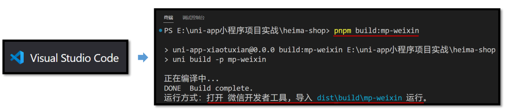
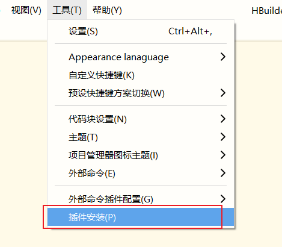
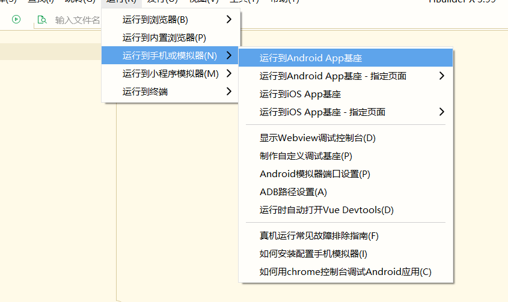
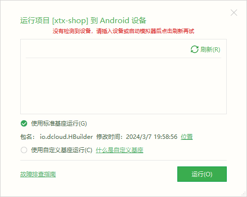
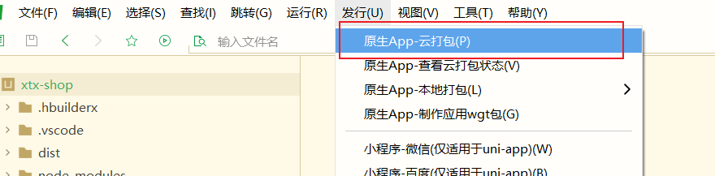
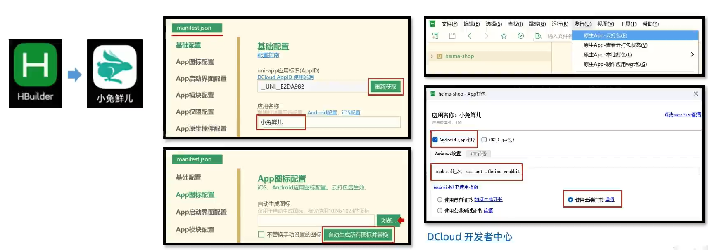

## 项目打包

#### 1、微信小程序端发布

> 小程序官网：https://mp.weixin.qq.com/

发布步骤：


##### 1.1 VSCode 对项目进行打包



##### 1.2 微信开发者工具进行上传


##### 1.3 提交审核


#### 2、条件编译和网页端打包

> **常见问题**：按照 `uni-app` 规范开发可保证多平台兼容，但每个平台有自己的一些特性，该如何处理？

**注意事项**：`网页端不支持微信平台授权登录等功能`可通过[条件编译](https://uniapp.dcloud.net.cn/tutorial/platform.html)，让代码按条件编译到不同平台。


##### 2.1 条件编译

条件编译语法：通过特殊注释，以 `#ifdef` 或 `#ifndef` 加 平台名称 开头，以 `#endif` 结尾。


条件编译支持: 支持 .vue, .ts, .js, .scss, .css, pages.json 等文件。

温馨提醒：如果是打包成 App 端，需要把项目代码导入 HbuilderX 开发工具，由 HbuilderX 运行到真机或模拟器，提供原生App云打包服务。


##### 2.2 网页端打包

把当前 uni-app 项目打包成网页(H5)端，并配置路由基础路径。

1. 运行打包命令 `pnpm build:h5`
2. 预览和测试，使用浏览器打开 `/dist/build/h5` 目录下的 `index.html` 文件
3. 由运维部署到服务器

###### 路由基础路径

默认的路由基础路径为 `/` 根路径，部分网站并不是部署到根路径，需要按运维要求调整。

```json
// manifest.json
{
  /* 网页端特有配置 */
  "h5": {
    "router": {
      // 基础路径：./ 为相对路径
      "base": "./"
    }
  } /* 小程序特有相关 */,
  "mp-weixin": {
    // …省略
  },
  "vueVersion": "3"
}
```


#### 3、Android App端预览和调试

实现步骤：


##### 3.1 导入HBuilder X 且 下载模拟器


或者进入 “工具”中的“插件安装”



选择下图中选中的插件安装即可


##### 3.2 运行项目

###### HBuilder X端操作


选择项目 => 运行到Android基座



如果你遇到这样的问题，不要慌，是因为手机还没配置好开发者模式。



接下来我们需要对手机端进行设置。

###### 手机端进行设置


1. 数据线手机接电脑

2. 开启开发者模式

```
① 进入手机中的 “关于本机”
② 选择“版本信息”进入
③ 点击“版本号” 5 ~ 8次，开启开发者模式(设置了锁屏密码需要输入锁屏密码)
④ 如果已经开启了“开发者模式”，这样单击“版本号”他会提示你开发者模式已开启
```

> 并不是所有手机都适用，可以去搜索对应手机打开`开发选项`步骤。

3. 开启USB调试

###### 开始运行

实现了上述步骤后，电脑端刷新，单击运行即可。


##### 3.3 HBuilder X 对应的cli版本不同


出现该警告原因：PC端版本比手机端的3.99版本低，PC端需要将`uni-app`的SDK版本更新依赖到指定的3.99版本。

添加了最新依赖包之后，我们要重新编译才会看到最新的UI效果。


#### 4、Android App端 云打包

步骤：


##### 4.1 登录DCloud账号

如果你还没有DCloud账号，可以注册一个。



输入账号和密码进行登录


##### 4.2 后续操作

获取DCloud的AppId、设置应用名称&图标、云端证书生成等。



我们只需要在DCloud开发者中心生成云端证书即可，无需下载下来。

剩下的根据自己的选择进行勾选即可，最后执行打包操作。


#### 5、iOS App端 预览/调试、打包

步骤：


##### 5.1 准备设备

* Mac系统电脑、IPhone设备
* 虚拟机Mac系统、模拟器


##### 5.2 运行到手机或模拟器

同Android调试是一样的。

> 在开发中，我们还是推荐使用模拟器xCode，可以省下一大笔成本。


##### 5.3 IOS打包

iOS打包和Android打包其实区别不大，主要的区别是证书的获取。

* Android可以用免费的云端证书
* iOS需要花钱。

> iOS生成证书要求：
>
> 1. 有苹果开发者账号，并且加入了“iOS Developer Program”
> 2. 每年需要交几百米

参考文档：https://ask.dcloud.net.cn/article/152

