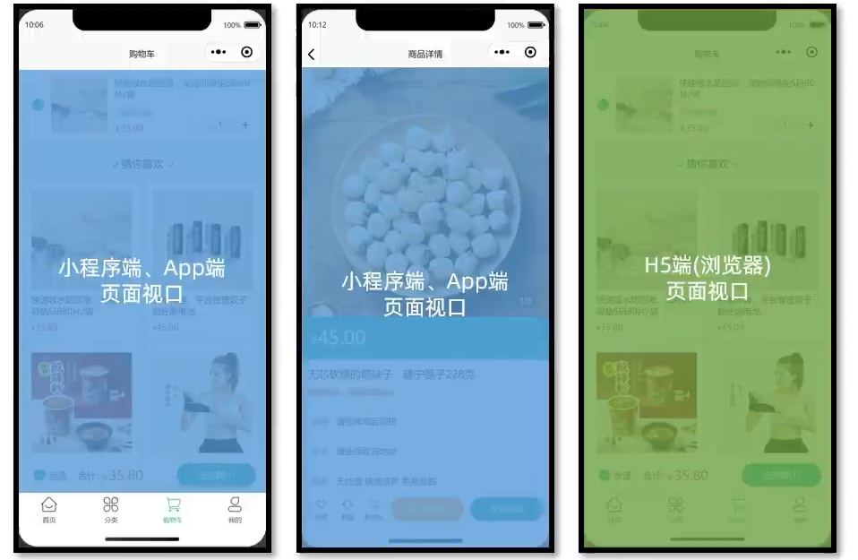
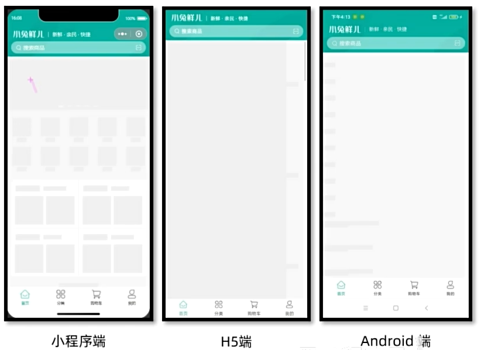
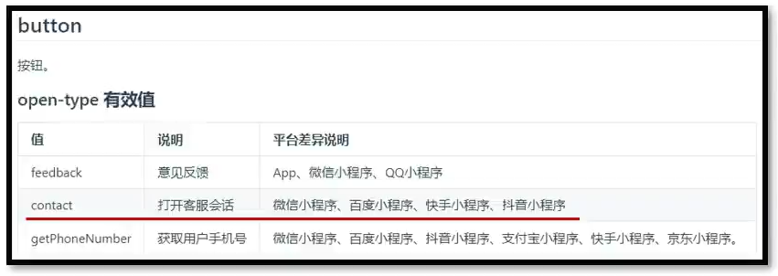
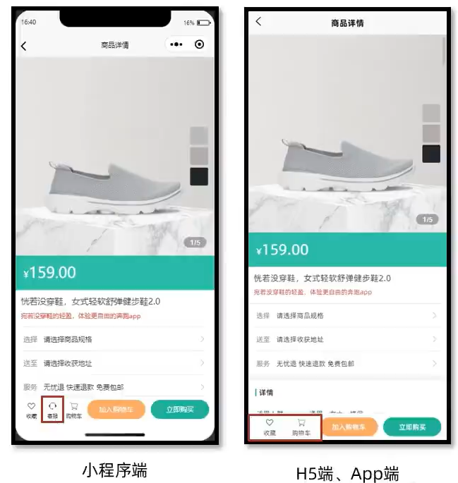
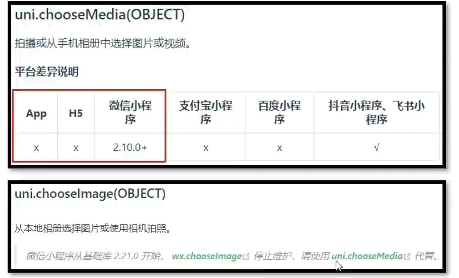
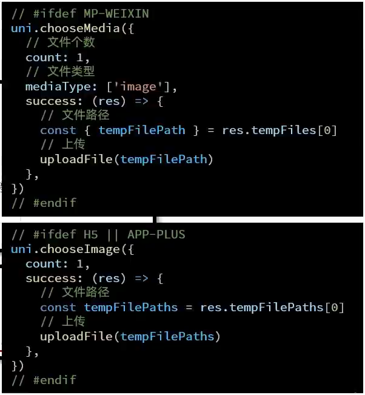

## 跨端兼容

#### 1、样式兼容

* 小程序端不支持`*`通配符
* 页面**视口差异**
* H5端 默认开启 **scoped**
* [uni-app 跨端注意](https://uniapp.dcloud.net.cn/matter.html)
* [uni-app CSS支持](https://uniapp.dcloud.net.cn/tutorial/syntax-css.html#css-%E5%8F%98%E9%87%8F)
* [uni-app 条件编译](https://uniapp.dcloud.net.cn/tutorial/platform.html)

##### 1.1 不支持通配符 *解决方案

使用选择器，例如并集选择器(view,text)


##### 1.2 视口差异



我们把上述的视口称为`webview`。

###### 在小程序端和H5端page的高度问题

在小程序端的`page`和H5端的`uni-page-body`的高度是存在问题的。这里的高度是由多端视口决定的。

小程序/App端的视口很明显和H5端有所不同，这也导致了H5端的高度会自行适配网页的高度，我们在视口区域设置的滚动触底因为h5的高度过高，触不到底而无法触发处理事件。

所以，这里的解决方式是对`page`设置一个高度即可。


##### 1.3 H5端默认开启scoped造成的影响

温馨提示:

1. H5 端是单页面应用，scoped 隔离样式

2. App 端默认是系统 webview 渲染
3. 经测试App端组件样式也会默认隔离

> 在App端，page的样式是不生效的。



###### 解决H5端默认scoped问题

因为scoped导致组件样式不生效，所以我们需要对组件样式进行抽离，并重新引入。

1. 将`XtxSwiper.vue`等骨架屏显示组件样式抽离出来，单独以组件名作为样式文件`xx.scss`。
2. 在使用到对应组件的骨架屏中通过`@import 'url'`引入组件样式。
3. 这里我们统一将样式抽离出来，放到`components/styles`下。公共组件放公共的components，局部组件放局部的components中。

```css
@import '@/components/styles/XtxSwiper.scss';
@import './styles/CategoryPanel.scss'
@import './styles/HotPanel.scss'
```

> App端同样适用上述上述解决方案。


###### App端父容器下拉问题

首页出现`自定义导航栏`可以下拉情况，问题：App端编译后，原本Page样式是无法生效的。

解决：

```css
/* #ifdef APP-PLUS */
#app,
/* #endif */
// 小程序页面根标签是 page
page {
  display: flex;
  flex-direction: column;
  height: 100%;
  background-color: #f7f7f7;
}
```


#### 2、组件兼容

* uni-app 内置组件借鉴小程序组件
* 注意 **平台差异说明**





我们可以发现，Button组件有一些功能在App/H5端是不支持的，所以我们可以将不支持的功能将其条件编译，只在小程序端生效。

```vue
<!-- #ifdef MP-WEIXIN -->
<button class="icons-button" open-type="contact">
    <text class="icon-handset"></text>客服
</button>
<!-- #endif -->
```

样式问题：移除客服按钮之后，收藏和购物车按钮布局出现问题

```css
/* #ifdef H5 || APP-PLUS */
.toolbar .icons a.navigator-wrap {
  flex: 1;
}
```


#### 3、JS API兼容

* 非 H5端，不支持 window、document等浏览器的 JS API。
* uni-app 扩展 **uni对象**，封装大量支持跨端的JS API。
* 使用各端专有 JS API，如微信支付 需添加 **条件编译**。
* 注意 **平台差异说明**



建议：出了跨端问题再查文档。




