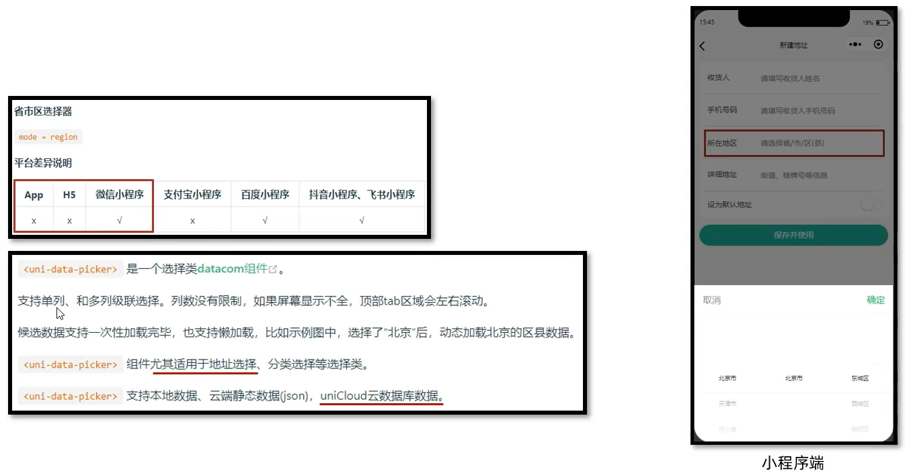
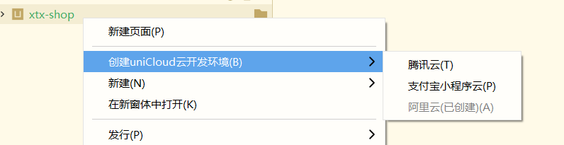
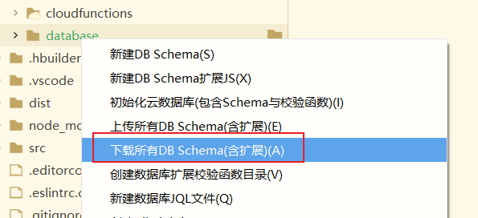
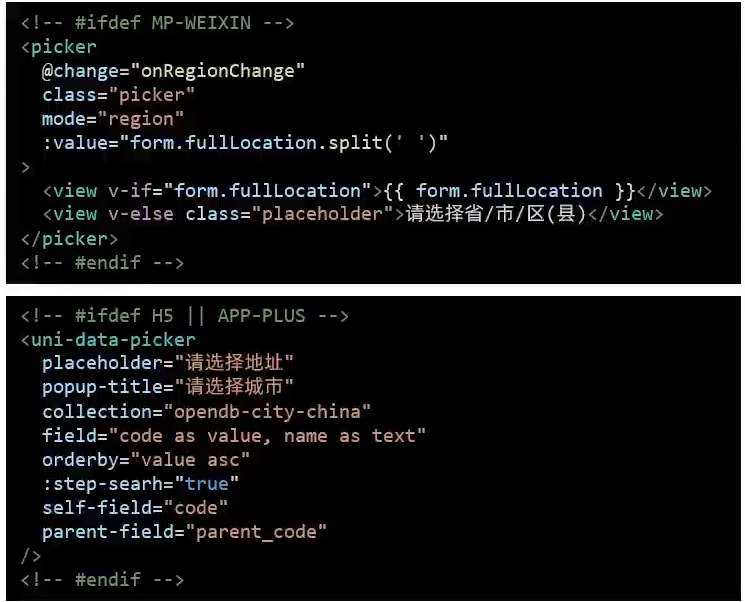
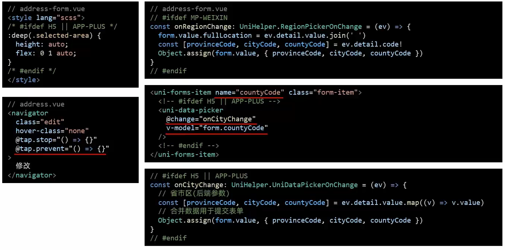

## uniCloud云开发

#### 1、基础概念

* uniCloud 可以通过JS开发服务端，包含云数据库，云函数，云存储等。
* uniCloud 可结合 uni-ui 组件库使用

#### 2、准备工作

##### 2.1 uniCloud控制台

1. 打开DCloud官网，进入uniCloud控制台。
2. 使用uniCloud控制台是需要实名认证的。
3. 新增服务空间(阿里云，阿里云提供免费的服务空间)
4. 新建云数据库 => 创建数据表(中国城市) 

> uniCloud控制台地址：https://unicloud.dcloud.net.cn

##### 2.2 Hbuilder X创建云开发环境

选择项目目录，新建uniCloud开发环境。

关联服务空间或项目。

下载云端的DB Schema。

运行到浏览器

#### 3、城市选择

以上为我们解决picker不兼容 H5端和App端的解决方案。

关于连接到uniCloud的云数据库，还有几个需要注意的点：

> uniCloud服务目前只能通过HBuilder X进行关联，其内部内置了启用uniCloud的插件。并且uniCloud是不支持命令行来进行运行的，只能通过HBuilderX手动运行项目。

#### 4、城市选择完成

* 进行了样式覆盖
* 阻止了跳转时的默认行为
* picker组件的事件进行条件编译
* uni-forms-item的表单校验进行了修改，以countyCode为准
* 回显，v-model绑定数据form.countyCode，区级编码绑定已经具备省市信息

