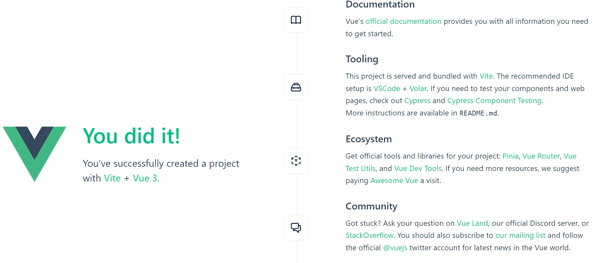
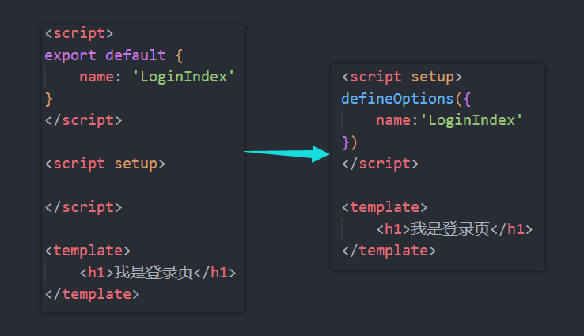
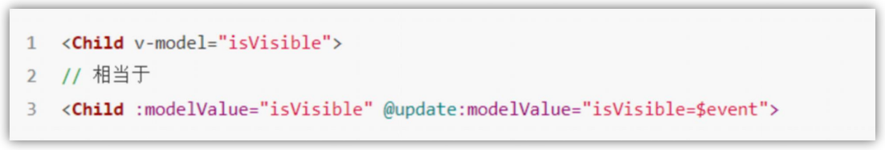

## day09 

#### 1、为什么要学 Vue3

##### 工资和技术的提升


##### Vue3的优势


##### Vue2选项式API `vs` Vue3组合式API


vue2的缺陷：代码量少时，看不出什么问题。一旦vue2中选项式的代码变多之后，就会变得难以维护，需要大量时间去来回滚轮维护。例如，调用一个功能模块时，我们需要移动100~1000行代码去查看调用函数。

> 简而言之，当项目规模越大，选项式API的劣势就会越明显。

Vue3中是如何进行优化的？

> Vue3中的数据不再是data中提供，而是调用一个函数来提供。
>
> Vue3中的Composition API是将所有功能相关的数据、方法、监听进行集中式管理。这样带来的好处是，如果将来我们改造某一块的功能，我们只需要关注这一块的代码就行了(800行代码，只需要关注其中50行代码)。
>
> 


案例：点击按钮，让数字+1

```jsx
// vue2
<script>
	export default {
		data () {
			return {
				count:0
            }
        },
        methods:{
			addCount () {
				this.count ++
            }
        }
    }
</script>
```

```jsx
// vue3
<script setup>
	import {ref} from 'vue'
    const count = ref(0)
    const addCount = () => count.value++
</script>
```

vue3相对vue2的优势：

1. 代码量变少了。
2. 分散式维护转为集中式维护，更易封装复用。


#### 2、create-vue搭建Vue3项目

##### 2.1 认识 create-vue

create-vue是Vue官方`新的脚手架工具`，底层切换到了` vite（下一代构建工具）`，为开发提供极速响应。


##### 2.2 使用 create-vue 创建项目(vite搭建)

###### 1. npm包管理器搭建

1. 前提环境条件

```bash
# 前提环境条件：已经安装了 16.0 或更高的Node.js
node -v
```

2. 创建一个Vue应用

```bash
npm init vue@latest
npm create vite@latest
```

这一指令将会安装并执行 `create-vue`。

> create-vue：
>
> * 基于vite工具
> * 除了上面的命令，还可以使用`npm init vite-app 项目名`  

如下：


构建项目成功后，再输入下面的命令将项目跑起来即可：


###### 2. yarn+vite搭建

1. 前提环境要求

```bash
# 最小为18.0版本，最高大于20.0版本
node -v
```

2. 创建指令

```bash
yarn create vite
```

如下：


###### 3. pnpm+vite

1. 输入指令创建项目

```bash
pnpm create vite
```

2. 选择Vue框架，再选择用户自定义使用 `create-vue`


3. 和上面创建项目的流程是一样的，就不过多描述
4. 项目创建完成，按照提示输入指令运行项目即可


##### 2.3 项目运行

项目运行效果图：




#### 3、熟悉项目目录 和 关键文件

项目目录如下：


其中关键文件：

1. vite.config.js - 项目的配置文件 `基于vite的配置 `

2. package.json - 项目包文件 `核心依赖项变成了 Vue3.x 和 vite `

3. main.js - 入口文件` createApp函数创建应用实例 `

4. app.vue - 根组件 `SFC单文件组件 script - template - style`

   > 变化一：脚本script和模板template顺序调整 
   >
   > 变化二：模板template不再要求唯一根元素 
   >
   > 变化三：脚本script添加setup标识支持组合式API 

5. index.html - 单页入口 提供id为app的挂载点


#### 4、插件更换

vue2使用的插件是`Vetur`：


vue3使用的插件为`Volar`：


> 先把vue2使用的Vetur禁用一下，在开启Volar。


#### 5、组合式API

##### 5.1 setup选项

###### 1. 简介


**setup的特征**：

* *执行时机，比beforeCreate还要早*
* *setup函数中，获取不到this(this是undefined)*
* *数据 和 函数 ，需要在 setup 最后return，才能在模板中应用*
* *可以通过setup的语法糖简化代码*

**代码示例**：

```jsx
<script>
  export default{
    setup(){
      // 数据 
      const message = 'hello vue3!'
      // 函数
      const logMessage = ()=> {console.log(message)}

      return {
        message,
        logMessage
      }
    },
    beforeCreate(){
      console.log('beforeCreate函数')
    }
  }
</script>

<template>
  <div>{{message}}</div>
  <button @click="logMessage">按钮</button>
</template>
```

问题：*每次使用数据都得return一下，好麻烦*。


###### 2. setup语法糖

`<script setup>`语法糖。

原始写法是上面的那种写法，使用语法糖之后，写法如下：

```jsx
<script setup>
  // 数据 
  const message = 'hello vue3!'
  // 函数
  const logMessage = ()=> {console.log(message)}
</script>
```

语法糖原理：


###### 3. 小结

1. setup选项的执行时机？ 

   > beforeCreate钩子之前 自动执行 

2. setup写代码的特点是什么？ 

   > 定义数据 + 函数 然后以对象方式return 

3.  `<script setup>`解决了什么问题？

   > 经过语法糖的封装更简单的使用组合式API

4. setup中this还指向组件实例吗？

   > 指向undefined，那时候组件实例还没有创建出来


##### 5.2 reactive和ref

在Vue中，数据默认不是响应式的。如果我们希望数据是响应式的，就需要通过`reactive`或`ref`进行处理。

###### 1. reactive()

作用：接受对象类型数据的参数传入并返回一个响应式的对象。

核心步骤：

1. 从vue包中导入`reactive`函数
2. 在`<script setup>`中执行`reactive`函数并传入类型为对象的初始值，并使用变量接收返回值

```jsx
<script setup>
	// 导入
    import {reactive} from 'vue'
    
    // 执行函数 传入参数 变量接收
    const state = reactive(对象类型数据)
</script>
```


###### 2. ref()

作用：接收简单类型或者对象类型的数据传入并返回一个响应式的对象。

核心步骤：

1. 从vue包中导入`ref`
2. 在`<script setup>`中执行`ref函数`并传入初始值，使用变量接收 ref函数 的返回值

```jsx
<script setup>
	// 导入
    import {ref} from 'vue'
    
    // 执行函数 传入参数 变量接收
    const count = ref(简单数据类型或对象类型数据)
</script>
```


###### 3.小结

1. reactive和ref函数的共同作用是什么 ？

   > 用函数调用的方式生成响应式数据 

2. reactive vs ref ？ 

   > 1. reactive不能处理简单类型的数据 
   > 2. ref参数类型支持更好但是必须通过.value访问修改
   > 3. ref函数的内部实现依赖于reactive函数 

3. 在实际工作中推荐使用哪个？

   > 推荐使用ref函数，更加灵活统一


##### 5.3 computed

计算属性基本思想和Vue2的完全一致，组合式API下的计算属性`只是修改了写法`。

核心步骤：

1. 导入computed函数
2. 执行函数 在回调参数中 return基于响应式数据做计算的值，用变量接收。

```jsx
<script setup>
	// 导入
    import { computed } from 'vue'
    // 执行函数 变量接收 在回调参数中return计算值
    const computedState = computed(()=>{
        return 基于响应式数据做计算之后的值
    })
</script>
```

案例：实现如下图效果。


```jsx
<script setup>
    import {ref,computed} from 'vue'

    // const 计算属性 = computed(()=>{return 计算返回的结果})
    // 声明数据
    const list = ref([1,2,3,4,5,6,7,8])

    // 基于list派生出一个计算属性，从list中进行过滤出 >2
    const computedList = computed(()=>{
      return list.value.filter(item => item>2)
    })

    // 定义一个修改数组的方法
    const addFn = ()=>{
      list.value.push(666)
    }
</script>
<template>
    <div>原始数据：{{list }}</div>
    <div>计算之后的数据:{{ computedList }}</div>
    <button type="button" @click="addFn">修改</button>
</template>
```

**计算公式**：始终从原始响应式数组中筛选出大于2的所有项 - filter。

**最佳实践**：

1. 计算属性中不应该有“副作用”。

> 计算属性中应该只包含有计算逻辑，而不应有其他的东西。比如异步请求/修改DOM。

2. 避免直接修改计算属性的值。

> 计算属性应该是只读的，特殊情况可以配置get/set。


##### 5.4 watch

###### 1.简介

作用：侦听一个或者多个数据的变化，数据变化时执行回调函数。

两个额外参数：

1. immediate 立即执行
2. deep 深度侦听


###### 2.侦听单个数据

1. 导入watch
2. 执行watch函数传入要侦听的响应式数据(ref对象)和回调函数

```jsx
<script setup>
	// 1. 导入watch
    import {ref,watch} from 'vue'
    const count = ref(0)
    // 2. 调用watch 侦听变化
    watch(count,(newValue,oldValue)=>{
        console.log(`count发生了变化，旧值为${oldValue},新值为${newValue}`)
    })
</script>
```


###### 3.侦听多个数据

说明：同时侦听多个响应式数据的变化，不管哪个数据变化都需要执行回调。

```jsx
<script setup>
	import { ref,watch } from 'vue'
    const count = ref(0)
    const name = ref('cp')
    
    // 侦听多个数据源
    watch(
    	[count,name],
    	([newCount,newName],[oldCount,oldName]) => {
        	console.log('count或者name变化了',[newCount,newName],[oldCount,oldName])
    	}
    )
</script>
```


###### 4.immediate属性

说明：在侦听器创建时立即触发回调, 响应式数据变化之后继续执行回调。

```js
const count  = ref(0)
watch(count,()=>{
    console.log('count发生了变化')
},{
    immeiate:true
})
```


###### 5. deep

默认机制：通过watch监听的ref对象默认是浅层侦听的，直接修改嵌套的对象属性不会触发回调执行，需要开启deep 选项。

```js
const state = ref({count:0})
watch(state,()=> console.log('数据变化了'))

const changeStateByCount = ()=>{
    // 直接修改属性 => 不会触发回调
    state.value.count++
}
```


###### 6.精确侦听对象的某个属性

需求：在不开启deep的前提下，侦听age的变化，只有age变化时才执行回调。

```js
const info = ref({
    name:'cp',
    age:20
})

watch(
	()=>info.value.age,
    ()=>console.log('age数据发生了变化')
)
```


###### 7.小结

1. 作为watch函的第一个参数，ref对象需要添加.value吗？

> 不需要，第一个参数就是传ref对象。

2. watch只能侦听单个数据吗

> 单个或者多个。

3. 不开启deep，直接监视 复杂类型，修改属性能够触发回调吗？

> 不能，watch函数默认是浅层侦听。

4. 不开启deep，怎么去精确侦听对象中的某个属性？

> 可以把第一个参数写成函数的写法，返回要监听的具体属性。


##### 5.5 生命周期函数

###### 1. Vue3的生命周期API(选项式 VS 组合式)

| 选项式API            | 组合式API         |
| -------------------- | ----------------- |
| beforeCreate/created | setup             |
| beforeMount          | onBeforeMount     |
| mounted              | onMounted         |
| beforeUpdate         | onBeforeUpdate    |
| updated              | onUpdated         |
| `beforeUnmount`      | `onBeforeUnmount` |
| `unmounted`          | `onUnmounted`     |


###### 2. 基本使用

1. 导入生命周期函数
2. 执行生命周期函数 传入回调

```js
import { onMounted } from 'vue'

// beforeCreate 和 created 的相关代码
// 一律放在 setup 中执行
const getList = ()=>{
  setTimeout(()=>{
    console.log('发送请求，获取数据！')
  },2000)
}
// 一进入页面的请求
getList()

// 如果有些代码需要在mounted生命周期中执行
onMounted(()=>{
  console.log('mounted生命周期函数 - 逻辑1')
})
// 写成函数的调用方式，可以调用多次，并不会冲突，而是按照顺序依次执行
onMounted(()=>{
  console.log('mounted生命周期函数 - 逻辑2')
})
```

> 生命周期函数是可以执行多次的，多次执行时传入的回调会在`时机成熟时依次执行`。


###### 3.小结

1. 组合式API中生命周期函数的格式是什么？

> on + 生命周期名字。

2. 组合式API中可以使用onCreated吗？

> 没有这个钩子函数，直接写到setup中。

3. 组合式API中组件卸载完毕时执行哪个函数？

> onUnmounted


##### 5.6 父子通信

###### 1. 组合式API下的父传子

**基本思想**：

1. 父组件中给子组件绑定属性。
2. 子组件内部通过props选项接受。

```jsx
<!-- 父组件 -->
<script setup>
    // 引入子组件
    import sonComVue from './son-com.vue'
</script>
<template>
    <!-- 绑定属性message -->
	<sonComVue message="this is app message"></sonComVue>
</template>
```

```jsx
<!-- 子组件 -->
<script setup>
    // 2.通过defineProps “编译器宏” 接受子组件传递的数据
    const props = defineProps({
        message:String
    })
</script>
<template>
    {{message}}
</template>
```

> defineProps 原理：就是编译阶段的一个标识，实际编译器解析时，遇到后会进行编译转换。


###### 2. 组件下的子传父

基本思想：

1. 父组件中给`子组件标签通过@绑定事件`。
2. 子组件内部通过 `emit方法触发事件`。

```jsx
<!-- 父组件 -->
<script setup>
    // 引入子组件
    import sonComVue from './son-com.vue'
    const getMessage = (msg) => {
        console.log(msg)
    }
</script>
<template>
    <!-- 1.绑定自定义事件 -->
	<sonComVue @get-message="getMessage"></sonComVue>
</template>
```

```jsx
<!-- 子组件 -->
<script setup>
    // 2. 通过 defineEmits编译器宏生成emit方法
    const emit = defineEmits(['get-message'])
    
    const sendMsg = ()=>{
        // 3.触发自定义事件，并传递参数
        emit('get-message','this is son msg')
    }
</script>
<template>
    <button @click="sendMsg">sendMsg</button>
</template>
```


###### 3. 小结

父传子：

1. 父传子的过程通过什么方式接收props？

> defineProps({属性名:类型})

2. setup语法糖中如何使用父组件传递过来的数据？

> const props = defineProps({属性名:类型})
>
> props.xxx


子传父：

1. 子传父的过程通过什么方式得到emit方法？

> defineEmits(['事件名称'])

2. 怎么触发事件？

> emit('自定义事件名',参数)


##### 5.7 模板引用

###### 1. 简介

通过`ref标识`获取真实的`dom对象或者组件实例对象`。


###### 2. 如何使用（以获取dom为例 组件同理）

步骤：

1. 调用ref函数生成一个ref对象 
2. 通过ref标识绑定ref对象到标签

```jsx
<script setup>
	<!-- 调用ref函数得到ref对象 -->
    const h1Ref = ref(null)
</script>
<template>
	<!-- 2.通过ref标识绑定ref对象 -->
    <h1 ref="h1Ref">我是dom标签h1</h1>
</template>
```


###### 3. defineExpose()

默认情况下在`<script setup>`语法糖下`组件内部的属性和方法是不开放`给父组件访问的，可以通过defineExpose编译宏`指定哪些属性和方法允许访问`。


###### 4. 小结

1. 获取模板引用的时机是什么？

> 组件挂载完毕。

2. defineExpose编译宏的作用是什么？

> 显式暴露组件内部的属性和方法。


##### 5.8 provide 和 inject

###### 1. 简介

顶层组件向任意的底层组件`传递数据和方法`，实现`跨层组件通信`。


###### 2. 跨层出传递普通数据

1. 顶层组件通过 `provide函数`提供数据
2. 底层组件通过`inject函数`获取数据


###### 3. 小结

1. provide 和 inject 的作用是什么？

> 跨组件通信

2. 如何在传递的过程中保持数据的响应式？

> 第二个参数传递ref对象

3. 底层组件想要通知顶层组件做修改，如何做？

> 传递方法，底层组件调用方法

4. 一棵组件树中只有一个顶层或底层组件吗？

> 相对概念，存在多个顶层和底层关系


#### 6、Vue3.3新特性

**背景说明：**

有`<script setup>`之前，如果要定义props，emits可以轻而易举地添加一个与setup平级的属性。

但是用了`<script setup>`之后，就没法这么干了setup属性已经没有了，自然无法添加与其平级的属性。

为了解决这一问题，引入了`defineProps`与`defineEmits`这两个宏。但这只解决了`props`与`emits`这两个属性。如果我们要定义组件的name或其他自定义的属性，还是得回到最原始的用法——再添加一个普通的`<script>`标签。


这样就会存在两个`<script>`标签，让人无法接受。


##### 6.1 defineOptions

所以在 Vue 3.3 中新引入了 `defineOptions` 宏。顾名思义，主要是用来定义 Options API 的选项。可以用 defineOptions 定义任意的选项， props, emits, expose, slots 除外（因为这些可以使用 defineXXX 来做到）


`defineOptions`解决两个`<script>`标签的现象：




##### 6.2 defineModel

在Vue3中，自定义组件上使用v-model, 相当于传递一个modelValue属性，同时触发 update:mode。



我们需要先定义 props，再定义 emits 。其中有许多重复的代码。如果需要修改此值，还需要手动调用 emit 函数。

```jsx
<script setup>
	const modelValue = defineModel()
    modelValue.value++
</script>
```

使用`defineModel`需要在`vite.config.js`中配置一下，因为它是一个试验性质的函数。


然后重启一下`vue`程序即可。

