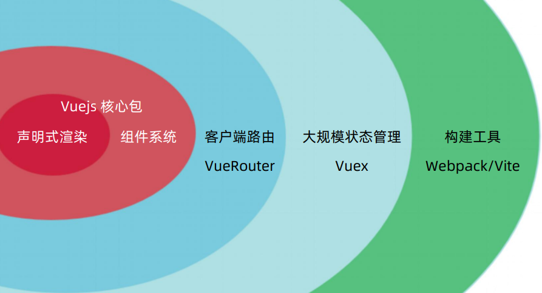
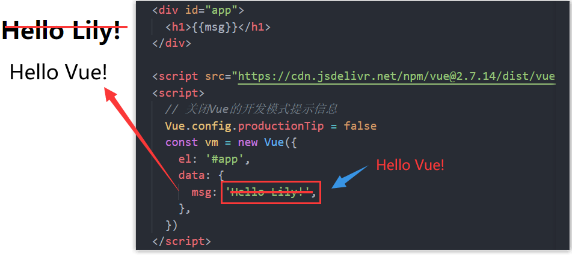
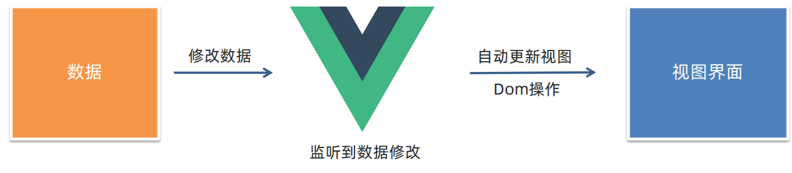
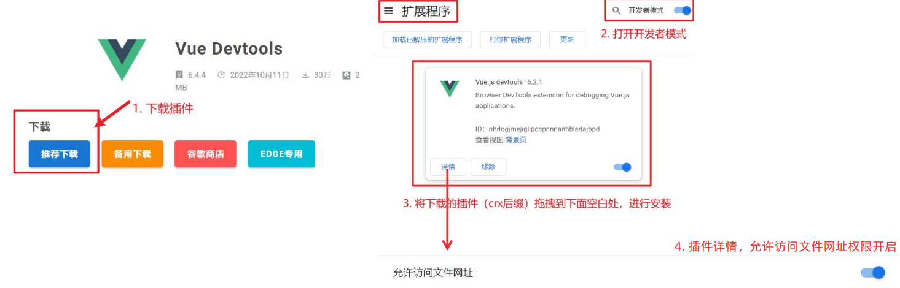
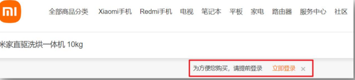
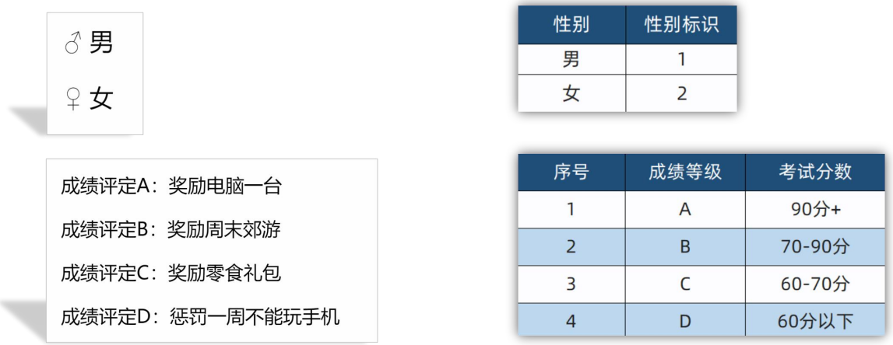
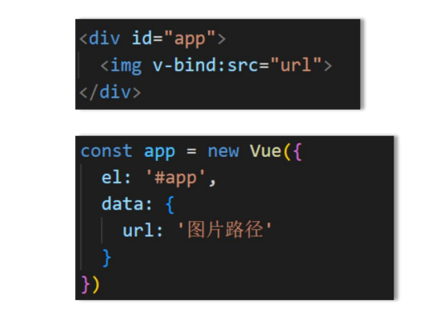
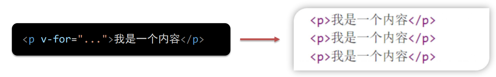
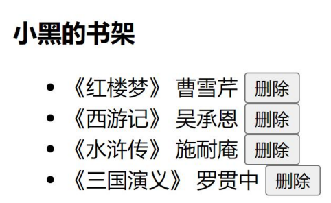
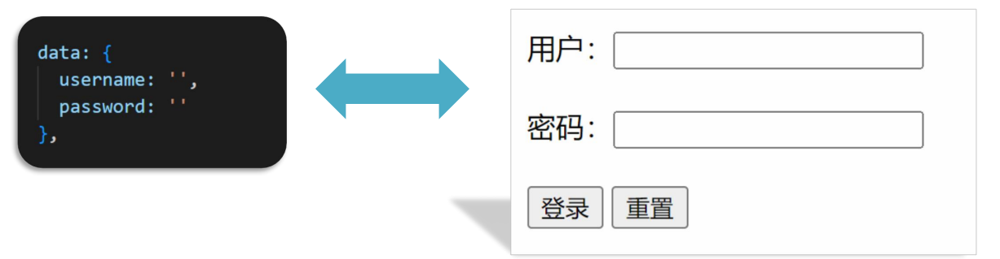

## vue-day01

#### 1、快速上手Vue

##### 1.1 Vue的概念

###### Vue是什么

概念：Vue是一个用于 **构建用户界面**<sup>1</sup> 的 **渐进式**<sup>2</sup> **框架**<sup>3</sup>。

> 1：基于数据渲染出用户看到的界面。


基于数据渲染出用户所看到的页面，这一整个过程就是所谓的`构建用户界面`。Vue刚好就是一个构建用户界面的框架。


> 2:循序渐进。



Vue的相关生态还是有很多的，如果小白一上来就要把所有的都去掌握才能进行开发，那么这对于小白是特别地不友好。Vue它允许你学习是循序渐进的，哪怕你只是学会了一个`声明式渲染`，它也可以构建一个基本的用户界面了。

如果我们考虑到更多的，比如说页面的复用呀，那我们就可以继续学习vue的组件系统。

Vue有两种使用方式：

1. Vue核心包开发

   > 局部模块改造

2. Vue核心包 & Vue 插件 工程化开发

   > 场景：整站开发


> 3：一套完整的项目解决方案。

用Vue来开发一个中大型项目的，是完全不在话下的。甚至用Vue来开发可以大大提升开发效率(`70%↑`)。

不过，用Vue来开发也有一个缺点，那就是需要记忆Vue的规则，我们通过规则来进行编码，最终才可以实现对应的业务需求。学习Vue语法，**我们可以通过[Vue的官网](https://cn.vuejs.org/)来查看对应的文档进行编码**。


##### 1.2 创建实例

构建用户界面，需要我们去创建Vue实例。创建实例的步骤如下：

1. 准备容器

2. 引包(官网) — `开发版本` / 生产版本

   > **Vue2官网**：https://v2.cn.vuejs.org/。
   >
   > **开发版本**：包含完整的警告和调试模式。建议我们在开发的时候不要使用压缩版本，要不然会失去所有常见错误的警告功能！(学习阶段建议使用)
   >
   > **生产版本**：删除了警告，37.51KB min+gzip。

3. 创建Vue实例，new Vue()

4. 指定配置项 -> 渲染数据

   * el：指定挂载点
   * data：提供数据

代码示例如下：

```html
<div id="app">
    <!-- 这里将来会编写一些用于渲染的代码逻辑 -->
    <h1>{{ msg }}</h1>
    <a href="#">{{count}}</a>
</div>

<!-- 引入的是开发版本包 - 包含完整的注释和警告 -->
<script src="https://cdn.jsdelivr.net/npm/vue@2.7.14/dist/vue.js"></script>
<script>
    // 一旦引入VueJS核心包，在全局环境，就有了Vue构造函数
    const app = new Vue({
        // 通过el配置选择器。作用：指定 Vue 管理的是哪个盒子
        el: '#app',
        // 通过 data 提供数据
        data: {
            msg: 'Hello Vue！',
            count: 666,
        },
    })
</script>
```

以上内容的重点：`Vue的配置选项`。

* el：指定一个元素，将其挂载到Vue上面，使其受Vue的管理。

  > 一个Vue实例只能管理一个元素(也可以称为容器/盒子)。

* data：Vue存放数据的地方，我们可以将data中的数据，渲染到Vue管控的元素中。

  > 不受Vue管控的元素，是不能使用data中的数据的。


##### 1.3 插值表达式

插值表达式`{{ }}`是一种Vue的模板语法。例如，上面的示例中就使用到了Vue的插值表达式：

```html
<div id="app">
    <!-- 这里将来会编写一些用于渲染的代码逻辑 -->
    <h1>{{ msg }}</h1>
    <a href="#">{{count}}</a>
</div>
```

**语法**：

```js
// 插值表达式
{{ 在这里写内容 }}
// 括号中可以放变量或者表达式
{{ 变量/表达式 }}
```

**作用**：利用表达式进行插值，渲染到页面当中。

**表达式**：是可以被求值的代码，JS引擎会将其计算得出一个结果。

`使用插值表达式的注意点`：

1. 使用的数据必须存放于Vue实例下的`data`中

2. 支持的是表达式，而并非js语句，比如：if、for...

   ```html
   <p>{{ if }}</p>
   ```

3. 不能再标签属性中使用`{{ }}`插值

   ```html
   <a href="{{src}}">点我跳转到百度</a>
   ```

   


##### 1.4 响应式特性

我们已经掌握了基础的模板渲染，其实除了基本的模板渲染，Vue背后还做了大量工作。

比如：`数据的响应式处理`   →  响应式：`数据变化，视图自动更新`



那么如何对`msg`进行访问 or 修改？

> data中的数据, 最终会被添加到实例上。我们只需要按照如下方式做即可。

1. 访问数据：`实例名.属性名`
2. 修改数据：`实例名.属性名 = 新值`


当数据发生改变，视图会自动更新。



开发者只需要：`聚焦于数据 → 数据驱动视图`

使用Vue开发，关注`业务的核心逻辑`，根据业务`修改数据`即可。这样带来的好处就是：开发效率大大地提升了。


##### 1.5 开发者工具

###### 安装 Vue 开发者工具：装插件调试 Vue 应用

(1) 通过谷歌应用商店安装(国外网站)

(2) 极简插件：下载 → 开发者模式 → 拖拽安装 → 插件详情允许访问文件

> https://chrome.zzzmh.cn/index




#### 2、Vue指令

Vue会根据不同的`【指令】`，针对标签实现不同的`【功能】`。

指令：带有`v-`前缀的特殊`标签属性`。

下面的指令为Vue中常用几个指令。

> 注意：Vue指令都是放在标签中使用的。


##### 2.1 v-html

作用：设置元素的`innerHTML`。

语法：`v-html="表达式"`。

代码示例：

```html
<div id="app">
    <div v-html="msg"></div>
</div>
...
<script>
    // 关闭Vue的开发模式提示信息
    Vue.config.productionTip = false
    const vm = new Vue({
        el: '#app',
        data: {
            msg: `<h1>Hello,Vue!</h1>`,
        },
    })
</script>
```

页面渲染效果如下：


##### 2..2 v-show

**作用**：控制元素显示隐藏

**语法**：

```
v-show = "表达式"
// 表达式的值返回的是一个boolean类型的值，true显示、false隐藏
```

**原理**：切换`display:none`控制显示隐藏。

**使用场景**：频繁切换显示隐藏的场景，例如商品的tab栏。


##### 2.3 v-if

作用：控制元素显示隐藏(`条件渲染`)

语法：

```
v-if="表达式"
// 表达式值 true 显示， false 隐藏
```

原理：基于`条件判断`，是否`创建`或`移除`元素节点。

使用场景：要么显示，要么隐藏，不频繁切换的场景。




##### 2.4 v-else / v-else-if

作用：辅助 `v-if` 进行判断渲染的。

语法：

```
v-else-if = "表达式"
v-else
```

类似于JavaScript中的`if条件语句的多重分支结构`。


注意点：

> 这两个指令需要紧挨着 `v-if` 一起使用。




##### 2.5 v-on

**作用**：注册事件 = `条件监听 + 提供处理逻辑` 。

**语法**：

```
// 1.第一种写法
v-on:事件名 = "内联语句"
// 2.第二种写法
v-on:事件名="methods中挂载的函数名"
```

> methods为Vue实例对象上的一个传递选项。我们可以将一些业务逻辑的处理函数集中挂载到`methods`上，这样我们在开发的时候就不要一个个文件或者一行行的去找对应的函数，只需要集中在Vue下面的`methods`上找即可。


**简写**：`@事件名`

1.内联写法：

```html
<button v-on:click="count++">按钮</button>
<!-- 简写后 -->
<button @click="count++">按钮</button>
```

2.methods中的函数：

```html
<button @click="fn">按钮</button>
```

```js
const app = new Vue({
    el:"#app",
    data:{
        // 提供数据
		count:100
    },
    methods:{
        // 提供处理逻辑函数
        fn(){
            console.log('提供逻辑代码')
        }
    }
})
```


##### 2.6 v-bind

作用：动态的设置html的`标签属性`→ src url title ..

语法：

```
v-bind:属性名="表达式"
```

注意：

> `v-bind`的简写形式为`:属性名 = 表达式`。(从v-bind => `:`)




##### 2.7 v-for

**作用**：基于`数据`循环，`多次`渲染整个元素 → 数组、对象、数字... 。



**遍历数组的语法**：

```
v-for = "(item,index) in 数组"	// item 每一项, index 下标
// 省略index的写法
v-for = "item in 数组"
```


###### 图书管理案例

实现效果：



实现步骤：

* 准备好data中的数据
* 渲染到页面上 -> v-for
* 添加图书的删除功能 -> methods中添加一个删除事件


###### v-for中的key

**语法**：`key属性="唯一标识"`

**作用**：给列表项添加的`唯一标识`。便于Vue进行列表项的`正确排序复用`。

```html
<ul>
    <li v-for="(item,index) in list" :key="item.id">
        <span>{{item.name}}</span>
        <span>{{item.author}}</span>
        <!-- 注册点击事件，根据id来删除对应的数据 -->
        <button @click="del(item.id)">删除</button>
    </li>
</ul>
```

如果没有加key，v-for的默认行为会尝试`原地修改元素`(`就地复用`)。

> 如果没有设置key，则会默认从当前删除元素开始，到最后一个元素。将最后一个元素删除，后面元素的内容往前覆盖。(可以尝试给渲染的元素设置css样式，查看对应结果来理解)


##### 2.8 v-model

**作用**：给`表单元素`使用，`双向数据绑定` → 可以快速 `获取` 或 `设置` 表单元素内容。

> 双向绑定的过程如下：
>
> 1. 数据变化 => 视图自动更新
> 2. `视图`变化 => `数据`自动更新

**语法**：

```
v-model = '变量'
```



表单视图和数据双向变化，一旦一方发生变化，另一方也会随之更新。


#### 3、综合案例

##### 3.1 实现步骤

① 列表渲染 ② 删除功能 ③ 添加功能 ④ 底部统计 和 清空


##### 3.2 列表渲染

`v-for key`的设置， {{ }}插值表达式：

```html
<ul class="todo-list">
    <li class="todo" v-for="(item,index) in list" :key="item.id">
      	...
    </li>
</ul>
```


##### 3.3 删除功能

`v-on` 调用传参 `filter` 过滤 覆盖修改原数组：

```html
<li class="todo" v-for="(item,index) in list" :key="item.id">
    <div class="view">
        <span class="index">{{index+1}}.</span> <label>{{item.title}}</label>
        <button @click="del(item.id)" class="destroy"></button>
    </div>
</li>
```

```js
methods: {
    del(id) {
        this.list = this.list.filter((item) => item.id !== id)
    },
}
```


##### 3.4 添加功能

`v-model` 绑定 `unshift` 修改原数：

```html
<header class="header">
    <h1>小黑记事本</h1>
    <input placeholder="请输入任务" class="new-todo" v-model="todoName" />
    <button class="add" @click="add">添加任务</button>
</header>
```

```js
data: {
    todoName: '',
    list:[...]
},
methods: {
    del(id) {
        ...
    },
    add() {
        if (this.todoName.trim() === '') return alert('请输入任务名称！')
        this.list.unshift({
            id: +new Date(),
            title: this.todoName,
        })
        this.todoName = ''
    },
}
```

数组的`unshift`方法，向数组的首位置新增一个新元素。


##### 3.5 底部统计

数组.length累计长度：

```html
<!-- 统计:数组的长度=任务数量 -->
<span class="todo-count">合 计:<strong> {{list.length}} </strong></span>
```


##### 3.6 清空

覆盖数组清空列表：

```html
<!-- 清空 -->
<button class="clear-completed" @click="clear">清空任务</button>
```

```js
methods: {
    del(id) {
        ...
    },
    add() {
		...
    },
    clear() {
        // 清空任务列表
        this.list = []
    },
},
```


 v-show 控制隐藏：

```html
<!-- 统计和清空 -> 如果没有任务了,底部隐藏掉 -> v-show -->
<footer class="footer" v-show="list.length > 0">
    <!-- 统计 -->
    <span class="todo-count">合 计:<strong> {{list.length}} </strong></span>
    <!-- 清空 -->
    <button class="clear-completed" @click="clear">清空任务</button>
</footer>
```


