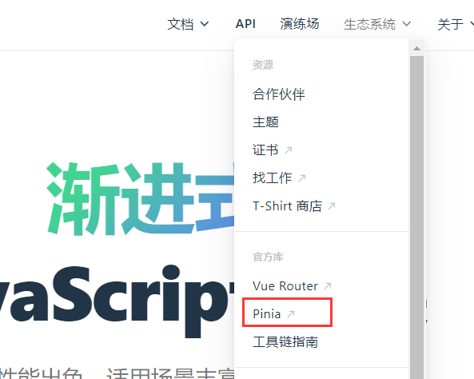

## day10-Pinia

> Pinia官网：https://pinia.vuejs.org/zh/

#### 1、什么是Pinia

Pinia是Vue的最新`状态管理工具`，是Vuex的`替代品`。



1. 提供更加简单的API （去掉了 mutation ） 。
2. 提供符合，组合式风格的API （和 Vue3 新语法统一） 。
3. 去掉了 modules 的概念，每一个 store 都是一个独立的模块 。
4. 配合 TypeScript 更加友好，提供可靠的类型推断。


#### 2、手动添加Pinia到Vue项目中

在实际开发项目的时候，关于Pinia的配置，可以在项目创建时自动添加。

步骤：

1. 使用vite创建一个空的Vue3项目

```bash
npm create vue@latest
```

2. `按照官方文档` 按照 pinia 到项目中

> 点击 => [Pinia官网](https://pinia.vuejs.org/zh/)


#### 3、Pinia基础使用 - 计数器案例

实现步骤：

1. 定义store
2. 组件使用store


#### 4、action异步实现

编写方式：异步action函数的写法和组件中获取异步数据的写法完全一致。

接口地址：：http://geek.itheima.net/v1_0/channels。

需求：在Pinia中获取频道列表数据并把数据渲染App组件的模板中。


#### 5、storeToRefs工具函数

使用`storeToRefs函数`可以辅助保持数据`（state+getter）`的响应式结构。

原本的结构：

```js
// 响应式丢失，视图不再更新
const {count,doubleCount} = counterStore
```

> 解构对象，是新创建两个变量来接收对象中同名称属性的值，并不是把属性的引用赋值给了变量。


通过`storeToRefs`实现后的响应式：

```js
// 保持数据响应式
const { count,doubleCount } = storeToRefs(counterStore)
```

> storeToRefs将与变量同名的属性引用赋值给了它们。


#### 6、Pinia持久化

##### 6.1 Pinia的调试

Vue官方的 `dev-tools 调试工具` 对 Pinia直接支持，可以直接进行调试。


##### 6.2 Pinia持久化插件

> 官方文档：https://prazdevs.github.io/pinia-plugin-persistedstate/zh/

1. 安装插件`pinia-plugin-persistedstate`

```bash
npm i pinia-plugin-persistedstate
```

2. main.js 使用

```js
import persist from 'pinia-plugin-persistedstate'
...
app.use(createPinia().use(persist))
```

3. store仓库中，`persist:true`开启


#### 7、总结

1. Pinia是用来做什么的？ 

> 新一代的状态管理工具，替代vuex 

2. Pinia中还需要mutation吗？ 

> 不需要，action 既支持同步也支持异步

3. Pinia如何实现getter？ 

> computed计算属性函数

4. Pinia产生的Store如何解构赋值数据保持响应式？

>  storeToRefs 

5. Pinia 如何快速实现持久化？ 

> pinia-plugin-persistedstat


