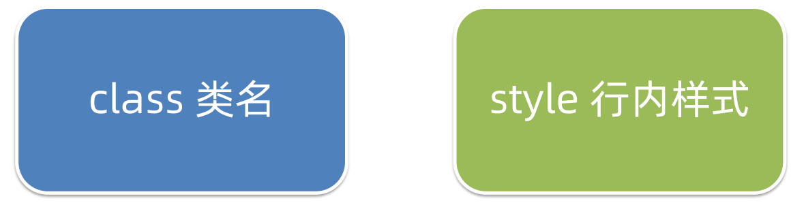
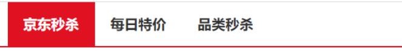
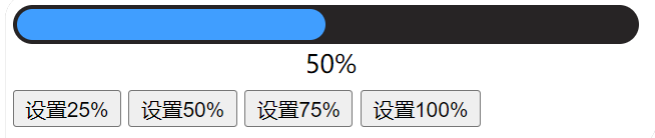
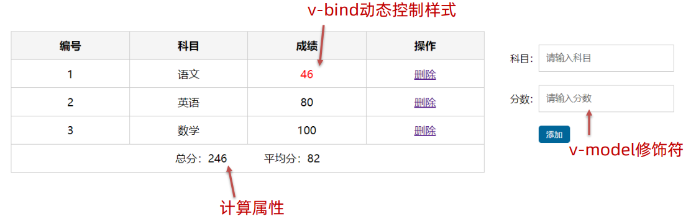
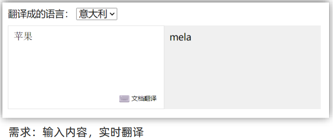
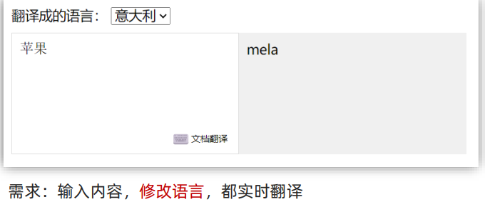
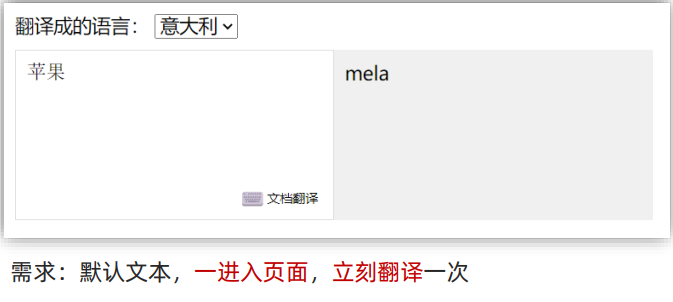

## vue-day02

#### 1、指令补充

##### 1.1指令修饰符

通过`.`指明一些指令的`后缀`，不同`后缀`封装了不同处理操作 → 简化代码。

###### 1.1.1 按键修饰符

`@keyup.enter`：键盘回车监听。


###### 1.1.2 v-model修饰符

```
v-model.trm	-> 去除空格
v-model.number -> 转数字
```


###### 1.1.3 事件修饰符

```
@事件名.stop -> 阻止冒泡
@事件名.prevent -> 阻止默认行为
```


##### 1.2 v-bind对于样式操作增强

为了方便开发者进行`样式控制`， Vue 扩展了` v-bind `的语法，可以针对` class 类名` 和 `style 行内样式` 进行控制 。



###### 语法：`:class="对象/数组"`

(1) `对象`→ 键就是类名，值是布尔值。如果值为` true`，有这个类，否则没有这个类

```html
<div class="box" :class="{类名1:布尔值,类名2:布尔值}"></div>
```

适用范围：一个类名，来回切换。




(2) `数组` → 数组中所有的类，都会添加到盒子上，本质就是一个 `class 列表`

```html
<div class="box" :class="['类名1','类名2','类名3']"></div>
```

适用范围：批量添加或删除类。


###### 语法 `:style = "样式对象"`

```html
<div class="box" :style="{ CSS属性名1:CSS属性值 , CSS属性名2:CSS属性值 }"></div>
```

适用场景：某个具体属性的动态设置。




##### 1.3 v-model应用于其他的表单元素

常见的表单元素都可以用 v-model 绑定关联 → 快速 **获取** 或 **设置** 表单元素的值。

它会根据 `控件类型` 自动选取 `正确的方法` 来更新元素。

```
输入框 input:text			→ value
文本域 textarea			→ value
复选框 input:checkbox		→ checked
单选框 input:radio			→ checked
下拉菜单 select			   → value
...
```


#### 2、computed计算属性

##### 2.1 基础语法

概念：基于`现有的数据`，计算出来的`新属性`。 `依赖`的数据变化，`自动`重新计算。

语法：

> ① 声明在 `computed 配置项`中，一个计算属性对应一个函数 
>
> ② 使用起来和普通属性一样使用 `{{ 计算属性名 }} `

computed计算属性也是Vue实例的一个配置项，在Vue实例下以如下格式挂载计算属性的：

```js
computed: { 
    计算属性名 () 
    { 
        基于现有数据，编写求值逻辑 
        return 结果 
    } 
}, 
```

计算属性的作用 → 可以将一段 `求值的代码` 进行封装。


##### 2.2 计算属性 vs 方法

###### computed计算属性

作用：封装了一段对于数据的处理，返回处理后的结果。

语法：

* 写在`computed`配置项中。
* 作为属性，可以直接使用 `this.计算属性`(在Vue实例中使用) or  `{{ 计算属性 }}`(在Vue管理的容器中使用)。

`缓存特性`(提升性能)：

> 计算属性会对计算出来的`结果缓存`，再次使用直接读取缓存， 依赖项变化了，会`自动`重新计算 → 并`再次缓存`。


###### methods方法

作用：给实例提供一个方法，调用以处理业务逻辑。

语法：

* 写在配置项`methods`中。
* 作为方法，需要调用 → `this.方法名( )`  or  `{{ 方法名() }}` or  `@事件名="方法名"`。


##### 2.3 完整写法 

计算属性默认的简写，只能读取访问，`不能 "修改"`。 如果要 `"修改"` → 需要写计算属性的`完整写法`。

简写：

```js
computed:{
    计算属性名(){
        一段代码逻辑 // 计算逻辑
        return 结果
    }
}
```

完整写法：

```js
computed:{
    计算属性名:{
        get(){
            一段代码逻辑	// 计算逻辑
   			return 结果
        },
        set(修改的值){
            一段代码逻辑	// 修改逻辑
        }
    }
}
```


##### 2.4 成绩案例

###### 案例分析

**需求说明**：

1. 渲染功能 
2. 删除功能 
3. 添加功能 
4. 统计总分，求平均分


**效果展示**：


###### 业务逻辑代码

渲染数据：

> 渲染成绩列表，如果**list**中有数据就用`v-for`指令渲染数据数据，没有数据就通过`v-if / v-else`显示暂无数据的信息。
>
> 成绩字体高亮，如果成绩不合格，就将该行的成绩进行标红处理。 (`v-bind` 处理样式)

```html
<tbody v-if="list.length > 0">
    <tr v-for="(item,index) in list" :key="item.id">
        <td>{{index+1}}</td>
        <td>{{item.subject}}</td>
        <td :class="{red:item.score < 60}">{{item.score}}</td>
        <td><a href="#" @click.prevent="del(item.id)">删除</a></td>
    </tr>
</tbody>
<tbody v-else>
    <tr>
        <td colspan="4">
            <span class="none">暂时无数据</span>
        </td>
    </tr>
</tbody>
```


删除功能：

> 我们通过列表中的a标签删除链接将对应的数据行做一个删除处理。删除的时候应该注意以下的事项：
>
> * 因为是a标签，如果当a标签中`href`属性存在url，则默认会跳转到对应页面，所以我们应该阻止它的默认行为。(指令修饰符`.prevent 或者 e.preventDefault()`)
> * 在删除时，我们要传递一个`id`，通过 `id`来删除对应的数据。

```js
methods: {
    del(id) {
        this.list = this.list.filter((item) => item.id !== id)
    },
}
```


添加功能 ：

> 在data中添加两个属性，表单通过`v-model`绑定data中的两个元素。
>
> 在双向绑定的同时，我们可以添加修饰符`.trim`去空格或`.number`转换为数字类型。(事件修饰符不是必要的，我们也可以通过js来实现。通过事件修饰符来实现该功能，简化代码)
>
> 给表单的button添加单击事件，绑定添加数据的处理函数。
>
> 最后，在添加函数中利用数组的`unshift`方法来更新成绩列表。(需要添加判断)

```html
<div class="form">
    <div class="form-item">
        <div class="label">科目：</div>
        <div class="input">
            <!-- 绑定科目属性,trim去空格 -->
            <input type="text" placeholder="请输入科目" v-model.trim="subject" />
        </div>
    </div>

    <div class="form-item">
        <div class="label">分数：</div>
        <div class="input">
            <!-- 绑定成绩属性 ,number将内容转换为数字型-->
            <input type="text" placeholder="请输入分数" v-model.number="score" />
        </div>
    </div>
    <div class="form-item">
        <div class="label"></div>
        <div class="input">
            <!-- 绑定添加处理函数 -->
            <button class="submit" @click="add">添加</button>
        </div>
    </div>
</div>
```


统计总分，求平均分：

> 可以通过计算属性来实现统计总分及求平均分的功能。

```js
computed: {
    totalScore() {
        // 累加
        return this.list.reduce((sum, item) => (sum += item.score), 0)
    },
    avgScore() {
        // 当数组中没有数据时，直接返回 0
        if (this.list.length === 0) {
            return 0
        }
        return (this.totalScore / this.list.length).toFixed(2)
    },
},
```


###### 业务技术点总结

1. 渲染功能（不及格高亮）

   > v-if v-else v-for v-bind:class 

2. 删除功能 

   > 点击传参 filter过滤覆盖原数组 .prevent 阻止默认行为 

3. 添加功能

   > v-model v-model修饰符(.trim .number) unshift 修改数组更新视图 

4. 统计总分，求平均分 

   > 计算属性 reduce求和


#### 3、watch侦听器

##### 3.1 基础语法

作用：监视数据变化，执行一些 业务逻辑 或 异步操作。

语法：

① `简单写法 → 简单类型数据，直接监视 `。

② 完整写法 → 添加额外配置项



代码示例：

```js
data:{
    words:'苹果',
    obj:{
		words:'苹果'
    }
},
    
watch:{
    // 该方法会在数据变化时，触发执行
    数据属性名(newValue,oldValue){
        一些业务逻辑 或 异步操作
    },
    '对象.属性名'(newValue,oldValue){
        一些业务逻辑 或 异步操作
    }
}
```


##### 3.2 完整写法

添加额外的`配置项`：

(1) `deep:true`	对复杂类型深度监视

(2) `immediate:true`	初始化立即执行一次handle方法



代码示例：

```js
data:{
    obj:{
		words:'苹果',
        lang:'italy'
    }
},
    
watch:{
	//完整写法
    数据属性名:{
        deep:true,	//深度监视
        handle(newValue){
            console.log(newValue)
        }
    }
}
```


加入`immediate`属性(默认为false)：



```js
data:{
    obj:{
		words:'苹果',
        lang:'italy'
    }
},
    
watch:{
	//完整写法
    数据属性名:{
        deep:true,	// 深度监视
        immediate:true,	// 是否立即执行一次handler
        handle(newValue){
            console.log(newValue)
        }
    }
}
```


#### 4、综合案例：水果购物车

##### 需求说明

1. 渲染功能	
2. 删除功能
3. 修改个数
4. 全选反选
5. 统计 `选中的` 总价 和总数量
6. 持久化到本地


##### 4.1 渲染

```html
<div class="tbody">
    <div v-for="(item,index) in fruitList" :key="item.id" class="tr" :class="{active:item.isChecked}">
        <div class="td"><input type="checkbox" :checked="item.isChecked" v-model="item.isChecked" /></div>
        <div class="td"></div>
        <div class="td">{{item.price}}</div>
        <div class="td">
            <div class="my-input-number">
                <button :disabled="item.num <= 1" class="decrease" @click="sub(item.id)">-</button>
                <span class="my-input__inner">{{item.num}}</span>
                <button class="increase" @click="add(item.id)">+</button>
            </div>
        </div>
        <div class="td">{{item.num * item.price}}</div>
        <div class="td"><button @click="del(item.id)">删除</button></div>
    </div>
</div>
```


##### 4.2 删除

在删除标签中，通过传递id来删除指定元素：

```js
del(id) {
    this.fruitList = this.fruitList.filter((item) => item.id !== id)
}
```


##### 4.3 修改数量

根据id，修改购物车中水果数量：

```js
add(id) {
    // 1.根据id找到数组中的对应项 => find
    const fruit = this.fruitList.find((item) => item.id === id)
    // 2.操作num数量
    fruit.num++
},
sub(id) {
    // 1.根据id找到数组中的对应项 => find
    const fruit = this.fruitList.find((item) => item.id === id)
    // 2.操作num数量
    fruit.num--
},
```


##### 4.4 全选和反选

全选和反选，在这里我们通过计算属性来实现该功能：

```html
<!-- 底部 -->
<div class="bottom">
    <!-- 全选 -->
    <label class="check-all">
        <input type="checkbox" v-model="isAll" />
        全选
    </label>
    <div class="right-box">
        <!-- 所有商品总价 -->
        <span class="price-box">总价&nbsp;&nbsp;:&nbsp;&nbsp;¥&nbsp;<span class="price">{{totalPrice}}</span></span>
        <!-- 结算按钮 -->
        <button class="pay">结算( 6 )</button>
    </div>
</div>
```

```html
<div class="tbody">
    <div v-for="(item,index) in fruitList" :key="item.id" class="tr" :class="{active:item.isChecked}">
        <div class="td"><input type="checkbox" :checked="item.isChecked" v-model="item.isChecked" /></div>
        <div class="td"></div>
        <div class="td">{{item.price}}</div>
        <div class="td">
            <div class="my-input-number">
                <button :disabled="item.num <= 1" class="decrease" @click="sub(item.id)">-</button>
                <span class="my-input__inner">{{item.num}}</span>
                <button class="increase" @click="add(item.id)">+</button>
            </div>
        </div>
        <div class="td">{{item.num * item.price}}</div>
        <div class="td"><button @click="del(item.id)">删除</button></div>
    </div>
</div>
```


```js
computed:{
    isAll: {
        get() {
            // 必须所有的小选框都选中 => 全选框才选中
            return this.fruitList.every((item) => item.isChecked)
        },
        set(value) {
            // 基于拿到的布尔值，要让所有的小选框 同步状态
            this.fruitList.forEach((item) => (item.isChecked = value))
        },
    }
}
```


##### 4.5 统计总价

因为总价会随着水果数量及小计发生变化，所以我们要使用计算属性：

```js
// 统计选中的总价 num * price
totalPrice() {
    return this.fruitList.reduce((sum, item) => {
        if (item.isChecked) {
            // 选中 => 累加每一项的小计
            return sum + item.price * item.num
        } else {
            // 没选中 => 不累加 返回原来的值(sum)
            return sum
        }
    }, 0)
},
```


##### 4.6 持久化

将数据保存在本地，通过watch深度侦听fruitList，一旦数据发生变化，就将变化后的数据添加到本地存储中：

```html
 watch: {
    fruitList: {
        deep: true,
        handler(newValue) {
        // 持久化处理
        // 需要将变化后的 newValue 存入本地 (转JSON)
        localStorage.setItem('list', JSON.stringify(newValue))
        },
    },
},
```


