## vue-day03

#### 1、生命周期

思考一个问题：学过JS之后，我们都知道在页面结构加载之后，我们可以通过JS操作DOM对象及初始化数据。那么，在Vue中什么时候可以发送`初始化渲染请求`？(越早越好) 什么时候可以`操作DOM`呢？(至少DOM得渲染出来)

上述的问题，涉及到了本节将要学习的内容—`Vue的生命周期`。

学习目标：将生命周期理解之后，我们就可以在合适的时候进行恰到好处的业务处理。

面试题：https://zhuanlan.zhihu.com/p/652236705


##### 1.1 生命周期 & 生命周期四个阶段

什么是Vue的生命周期？

> 一个Vue实例从`创建` 到 `销毁`的整个过程。

生命周期的四个阶段：① 创建 ② 挂载 ③ 更新 ④ 销毁

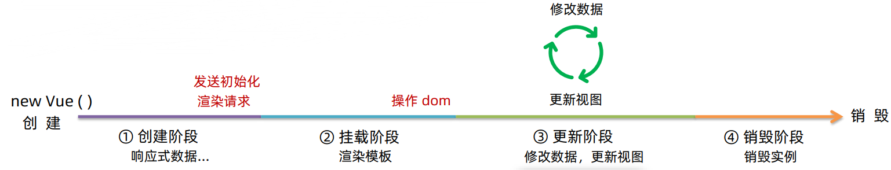


##### 1.2 生命周期钩子

Vue生命周期过程中，会`自动运行一些函数`，被称为`【生命周期钩子】`→ 让开发者可以在`【特定阶段】`运行`自己的代码`。

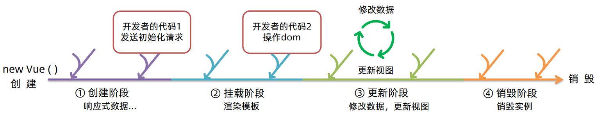

具体的生命周期钩子如下图所示：

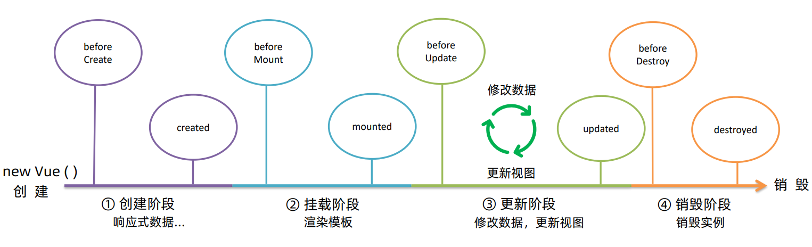

对上面两图，我们可以进一步总结，例如主要操作聚集于：created / mounted / beforeDestroy 这三个钩子。

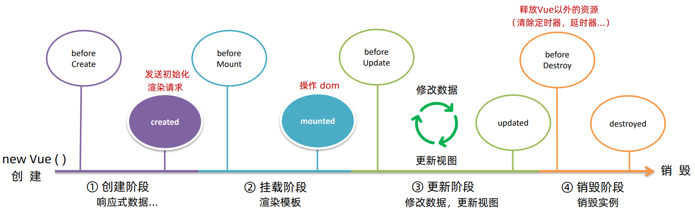


##### 1.3 生命周期案例

###### 1.3.1 新闻列表 — created

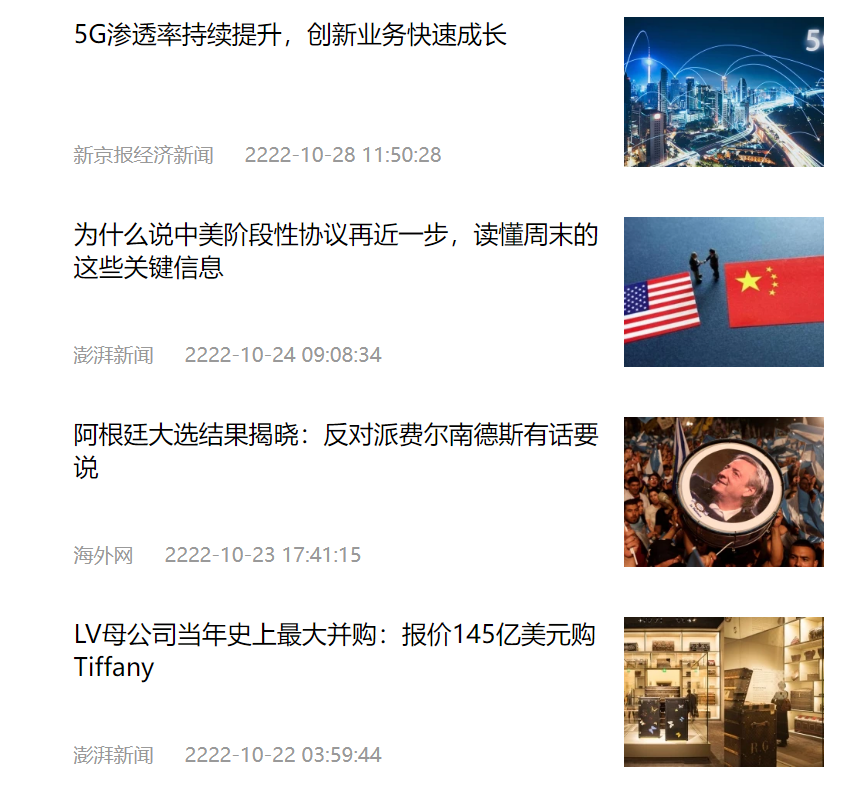

要完成以上的效果，步骤如下：

1. 准备好页面结构和样式(html+css)
2. 引入vue.js 和 axios.js 
3. 在data中创建一个空数组 list
4. 在Vue示例的创建阶段-钩子 created 中发送请求获取数据
5. 将获取的数据通过`v-for`渲染到页面上

具体发送请求代码如下：

```js
async created() {
    // 1.发送请求获取数据
    const res = await axios.get('http://hmajax.itheima.net/api/news')
    
    // const res = await axios({
    //   url: 'http://hmajax.itheima.net/api/news',
    // })
    
    // 以上两种写法都可以
    
    // 2.将获取的数据更新给 data 中的 list (初始化页面数据)
    this.list = res.data.data
},
```


###### 1.3.2 输入框自动聚焦—mounted

如果不是挂载在Vue实例上的容器，我们可以通过input的`autofocus`属性实现自动聚焦功能。但如果是Vue实例管理的容器，那该属性将会无效。但是我们可以通过钩子`mounted`实现自动聚焦。

```js
mounted() {
    // js的原生方法 focus(): 让文本框中的光标聚焦
    document.querySelector('#inp').focus()
},
```

效果如下：

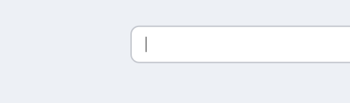

话说回来，为啥给挂载在Vue实例上的容器内部 input 加上 `autofocus`不能聚焦呢？

> 这是因为指定的容器被挂载到Vue实例上，Vue实例会根据现有的真实DOM构建一个虚拟DOM(挂载阶段)。最后再将虚拟的DOM和渲染的数据挂载到真实的DOM上。

注意：虚拟DOM的创建到挂载 于 `created`和`mounted`之间。


#### 2、综合案例：小黑记账清单

实现效果：

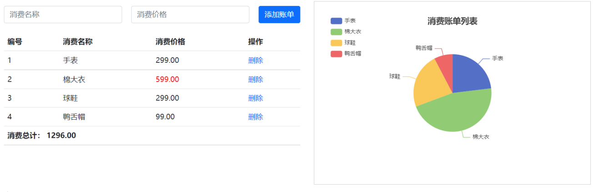

功能需求：

1. 基本渲染
2. 添加功能
3. 删除功能
4. 饼图渲染


##### 2.1 列表渲染(请求)

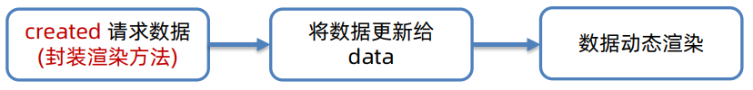


##### 2.2 添加

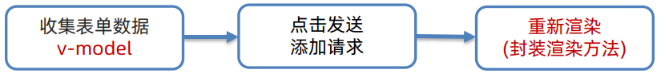


##### 2.3 删除

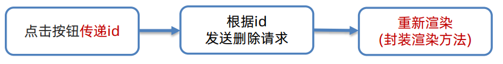


##### 2.4 饼图渲染

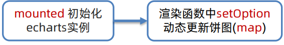


#### 3、工程化开发入门

##### 3.1 工程化开发和脚手架

###### 3.1.1 开发Vue的两种方式

1. 核心包传统开发模式：基于html/css/js文件，直接引入核心包，开发Vue。

2. `工程化开发模式：基于构建工具(例如：webpack)的环境中开发Vue`。

   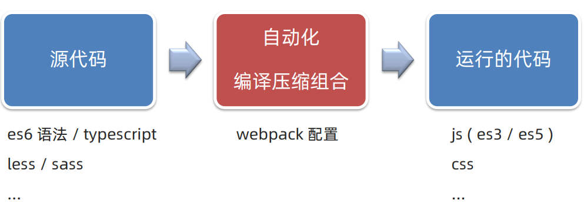

工程化开发的问题：

> ① webpack配置不简单
>
> ② 雷同的基础配置
>
> ③ 缺乏统一标准

**因此，需要一个工具，生成标准化配置！**


###### 3.1.2 工程化开发 & 脚手架 Vue CLI

**基本介绍：**

Vue CLI 是 Vue官方提供的一个`全局命令工具`。

可以帮助我们`快速创建`一个开发Vue项目的`标准化基础架子`。(集成了 webpack 配置)

​           

**好处：**

1. 开箱即用，零配置
2. 内置 babel 等工具
3. 标准化


**使用步骤：**

1. 全局安装(一次)：

   ```bash
   yarn global add @vue/cli # 或者
   npm i @vue/cli -g
   ```

2. 查看 Vue 版本

   ```bash
   vue --version / vue -v
   ```

3. 创建项目架子

   ```bash
   vue create project-name # project-name-项目名，不能使用中文，其中尽量不要包含大写字母
   ```

   这里我们选择Vue2

   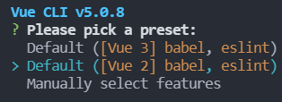

   因为我开启了`corepack`，并且`vue-cli`是通过`yarn`安装了，所以这里我选择`use yarn`。

   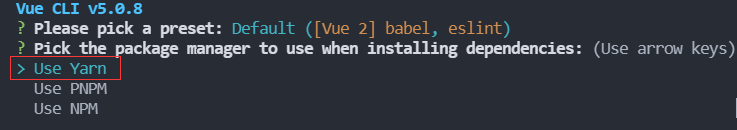

   > 这里选项就感觉很好，给我们提供了三个选项。可以根据自己所有的环境进行选择。

   **注意：如果在后续你想使用其他包管理器下载依赖，可以按如下步骤进行修改**：

   * 进入`C:\Users\用户名`目录下面

   * 找到`.vuerc`文件，然后打开它

     ```json
     {
       "useTaobaoRegistry": true,
       "packageManager": "yarn"
     }
     ```

   * 修改其中的`packageManager`选项的值为你需要更换的包管理器名即可。

   * 例如，我要使用npm包管理器：

     ```json
     {
       "useTaobaoRegistry": true,
       "packageManager": "npm"
     }
     ```

   

4. 启动项目

   首先，先进入项目目录。然后再输入下面的启动指令：
   
   ```bash
   # 看你的选择是通过哪个工具进行包的管理(yarn / npm)
yarn serve 
   npm run serve
   ```
   
     启动成功后，终端会给出vue项目运行在本机web服务器上的地址。
   
      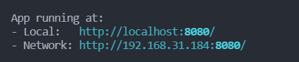
   
      按住`Ctrl + 鼠标左键`，在浏览器上打开，最终效果如下：
   
      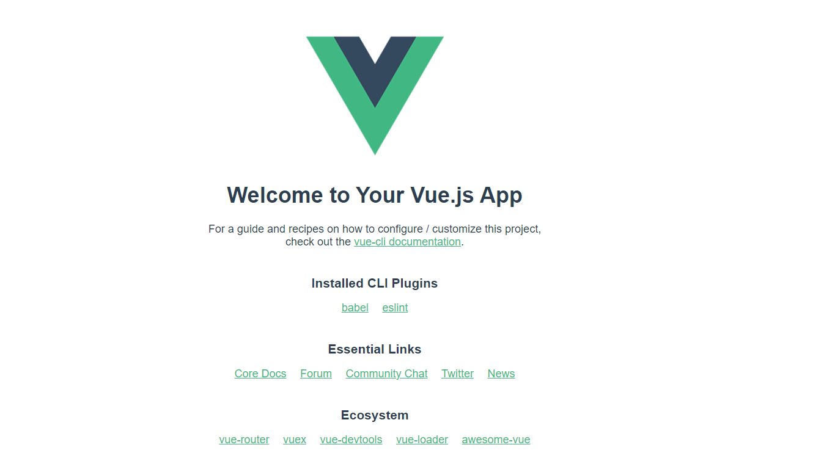

找package.json可以配置运行项目的脚步命令。

下面为一个vue项目的目录：

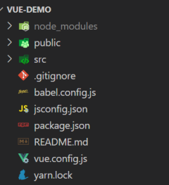


##### 3.2 项目运行流程

###### 3.2.1 脚手架目录文件介绍

```
VUE-DEMO
│─node_modules 第三包文件夹
├─public 放html文件的地方
│ ├─favicon.ico 网站图标
│ └─index.html index.html 模板文件 ③
├─src 源代码目录 → 以后写代码的文件夹
│ └─assets 静态资源目录 → 存放图片、字体等
│ └─components 组件目录 → 存放通用组件
│ └─App.vue App根组件 → 项目运行看到的内容就在这里编写 ②
│ └─main.js 入口文件 → 打包或运行，第一个执行的文件 ①
└─.gitignore git忽视文件
└─babel.config.js babel配置文件
└─jsconfig.json js配置文件
└─package.json 项目配置文件 → 包含项目名、版本号、scripts、依赖包等
└─README.md 项目说明文档
└─vue.config.js vue-cli配置文件
└─yarn.lock yarn锁文件，由yarn自动生成的，锁定安装版本
```

###### 项目运行流程

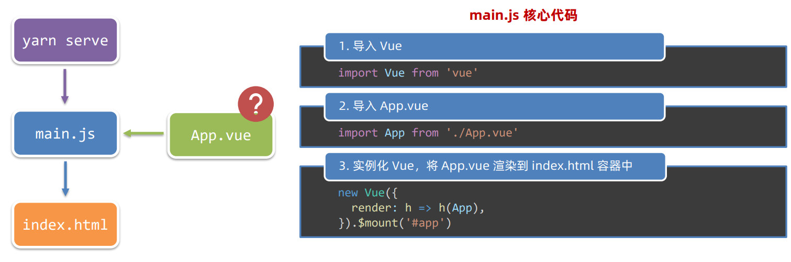


##### 3.3 组件化

###### 3.3.1 组件化开发

**组件化**：一个页面可以拆分成`一个个组件`，每个组件有着自己独立的`结构`、`样式`、`行为`。

**好处**：便于`维护`，利于`复用 `→ 提升`开发效率`。

> 项目越大，不作拆分，维护难度越大！


###### 3.3.2 根组件

**根组件**：整个应用最上层的组件，包裹所有普通小组件。

如下图：

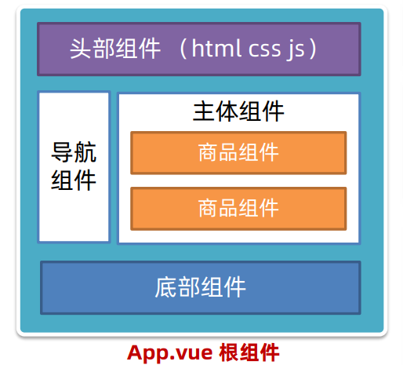

网站中最典型的例子，京东。

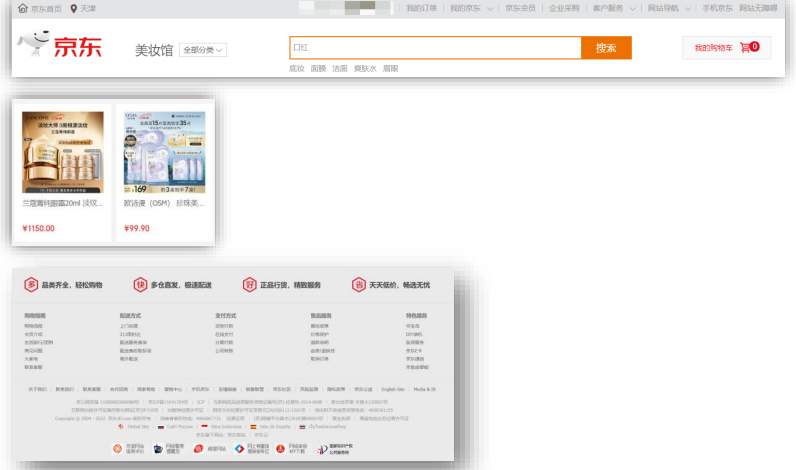

为了更加深入理解根组件和其他普通小组件的关系，我们可以用`组件树`来描述它们之间的关系：

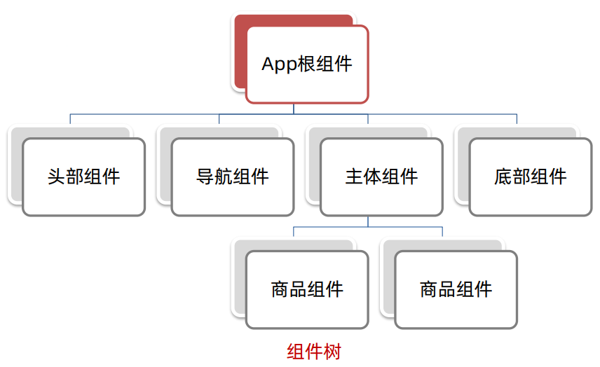


###### 3.3.3 App.vue 文件 (单文件组件) 的三个组成部分

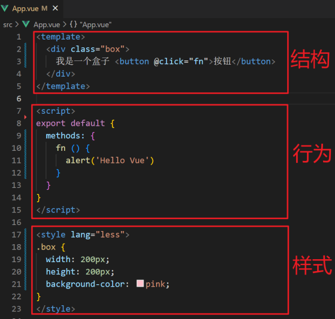

* template：结构 (有且只能有一个根元素)
* script：js逻辑
* style：样式 (可支持less，需要安装第三方包)


如果我们想让**组件支持 less**，需要做到以下两步：

(1) style标签，lang="less" 通过lang属性开启less功能

(2) 装包：`yarn add less less-loader` 或者 `npm i less less-loader`

最后，如果我们要实现Vue中的组件化开发，这里推荐一个`VSCode`的插件—`Vetur`。通过该插件，vscode可以接受`.vue`文件、自带语法高亮，并且对于**vue的组件化开发效率**大大提高。

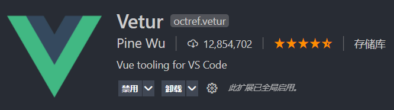


##### 3.4 组件注册

###### 3.4.1 普通组件的注册方式

组件注册的两种方式：

1. 局部注册：只能在注册的组件内使用
2. 全局注册：所有的组件内都能使用

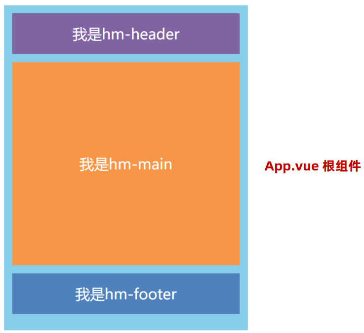


###### 3.4.2 组件的局部注册

1. 创建`.vue`文件(三个组成部分)
2. 在使用的组件内导入并注册


**组件局部注册示例**：

(1) 创建.`vue文件`。

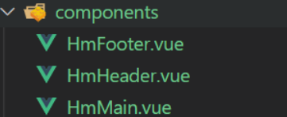

(2) 注册组件：

```vue
// App.vue
// 导入需要注册的组件
// 导入语法: import 组件对象 from '.vue文件路径'
import HmHeader from './components/HmHeader'

export default{
	// 局部注册
	components:{
		// 组件注册写法 => '组件名':组件对象
		HmHeader:HmHeader
    }
}
```


(3) 使用注册好的组件：

> 当成HTML标签来使用：`<组件名></组件名>`

```vue
<template>
	<div>
        <!-- 使用组件 -->
        <HmHeader></HmHeader>
    </div>
</template>
```

> 注意：组件名规范 => 大驼峰命名法，如：HmHeader。


###### 3.4.3 全局注册

步骤：

1. 创建 `.vue` 文件
2. `main.js`中进行全局注册

示例：

(1) 创建.vue文件

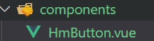

(2) 全局注册组件

```js
// main.js
// 导入需要全局注册的组件
import HmButton from './components/HmButton'

// 调用 Vue.component 进行全局注册
// Vue.component('组件名',组件对象)
Vue.component('HmButton',HmButton)
```

(3) 使用组件(和局部组件使用方式是一样的，不过全局组件在所有的组件中是都可使用的)

> 注意：
>
> ① 组件命名规范=> 大驼峰命名。
>
> 技巧：一般都是用`局部注册`，如果发现确实是`通用组件`，在定义到全局。


###### 3.4.4 .vue文件中标签名不能成对出来

问题：当我们输入一个`div`，按下`tab`，一对 **div标签** 出不来。

解决：配置vscode

1. 打开vscode设置，在搜索栏中搜索：`trigger on tab`

2. 勾选下面选项

   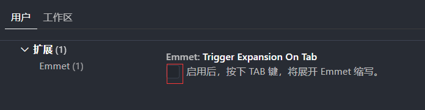


###### 3.4.5 总结

普通组件的注册使用：

1. 两种注册方式：

   ①局部注册

   * 创建.vue组件(单文件组件)
   * 使用的组件内导入，并局部注册 `components:{组件名:组件对象}`

   ②全局注册：

   * 创建.vue组件(单文件组件)
   * `main.js`导入，并全局注册 `Vue.component(组件名,组件对象)`

2. 使用：

   ```
   <组件名></组件名>
   ```

3. 技巧：一般都是用局部注册，如果发现确实是通用组件，再抽离到全局。


#### 4、综合案例：小兔鲜首页


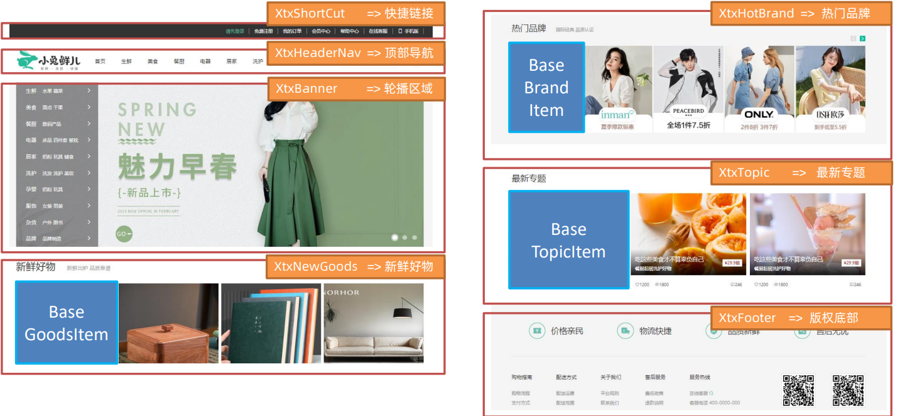

页面开发思路：

1. 分析页面，按模块拆分组件，搭架子(局部或全局注册)
2. 根据设计图，编写组件 html 结构 css样式(已准备好)
3. 拆分封装通用小组件(局部或全局注册)

> 将来 => 通过 js 动态渲染，实现功能。


