## vue-day04

#### 1、组件的三大组成部分(结构/样式/逻辑)

##### 1.1 scoped样式冲突

###### 1.1.1 默认情况

组件中的的两种样式：

1. 全局样式：默认组件中的样式会作用到全局。
2. 局部样式：可以给组件上的 style标签 加上 `scoped` 属性，`可以让样式只能作用于当前组件`。


写在组件中的样式会 `全局生效` → 因此很容易造成多个组件之间的样式冲突问题。

> 例如，我们组件header 中写了 一个类样式 `.top` ，在组件footer中也写了一个类样式` .top`。因为两个类样式名相同，将样式加载到页面上时会发生冲突(触发css的层叠性)。


###### 1.1.2 scoped的原理

1. 当前组件内标签都被添加 `data-v-hash值`的属性。
2. css选择器都被添加`[data-v-hash值]`的属性选择器。

最终效果：`必须是当前组件的元素`，才会有这个自定义属性，才会被这个样式作用到。


##### 1.2 data是一个函数

一个组件的 `data` 选项必须是一个`函数`。→ 保证每个组件实例，维护`独立`的一份数据对象。

> data必须是一个函数，这是Vue的一条规则。如果没有这一条规则，多个组件共用一个data，产生数据污染。
>
> 采用函数的形式，initData时会将其作为工厂函数都会返回全新data对象。当将组件中的data写成一个函数，数据以函数返回值形式定义，这样每复用一次组件，就会返回一份新的data，拥有自己的作用域，类似于给每个组件实例创建一个私有的数据空间，让各个组件实例维护各自的数据。
>
> > Vue中实现组件时为了保证代码的复用，同时提高代码的维护性。但是又为了保证每一个组件和根组件的特性相同(都有data,methods等配置项)。
> >
> > 唯有data这里不推荐共享，因为如果每个组件的都是使用一样的数据，那第二个第三个同样复用该组件的就没有任何意义了。例如，京东/淘宝等电商网站中的商品项的商品展示图片，数据都是不同的。(目的就是为了保证每个组件中数据的唯一性)
> >
> > 这也是Vue为什么建议组件中data都是一个函数。

每次创建新的组件实例，都会新执行一次 data 函数，得到一个新对象。


上图虽然是同一个data函数，但是返回的是不同的对象，所以每个count的变化都不会影响其他count的值。


##### 1.3 总结—组件的三大组成部分注意点


关于第二项和第三项，上面已经进行了解释，这里我们主要是讲解一下第一项。

那么，为什么Vue的组件中`template`只能有一个根元素呢？

> 详见文章：https://zhuanlan.zhihu.com/p/111691226


#### 2、组件通信

#####  2.1 组件通信语法

###### 2.1.2 什么是组件通信

组件通信，就是指 `组件与组件` 之间的`数据传递`。

* 组件的数据是独立的，无法直接访问其他组件的数据。 
* 想用其他组件的数据 → 组件通信


###### 2.1.2 组件关系分类

1. 父子关系
2. 非父子关系


用组件树来描述上图，如下：


###### 2.1.3 组件通信的解决方案


###### 2.1.4 父子通信流程图

1. 父组件通过 `props` 将数据传递给子组件
2. 子组件利用 `$emit` 通知父组件修改更新


##### 2.2 父传子 

父组件通过 `props` 将数据传递给子组件。

实现步骤：

1. 给组件标签，以添加动态属性的方式(`:属性名='数据/变量'`)，进行传值

   ```html
   <template>
       <Son :title="mytitle"></Son>
   </template>
   
   <script>
   	export default{
           data(){
               return {
                   mytitle:'一个普通的子组件标题'
               }
           }
       }
   </script>
   ```

   

2. 子组件中通过`props`接收父组件传递过来的数据

   ```html
   <template>
   	<div>
           <h5>
               {{title}}
           </h5>
       </div>
   </template>
   <script>
   	export default{
           props:['title']
       }
   </script>
   ```

   > 通过props接收的数据，我们可以直接通过属性名使用即可。

   


##### 2.3 子传父

子组件利用 `$emit` 通知父组件，进行修改更新。

实现步骤：

1. 子组件中`$emit`传递数据
2. 父组件中给子组件添加消息监听
3. 父组件中实现处理函数，将传递过来的数据进行处理

子组件中`$emit`传递数据：

```html
<template>
	<div>
        子组件
        <h5>{{title}}</h5>
        <button @changeTitle="changeFn">修改title</button>
    </div>
</template>
<script>
	export default{
        props:['title'],
        methods:{
            changeFn(){
                this.$emit('changeTitle','组件通信-子传父')
            }
        }
    }
</script>
```


父组件中给子组件添加消息监听，并且实现处理函数，将传递过来的数据进行处理

```html
<template>
	<div class="app">
        App组件
        <!-- 添加消息监听 => changeTitle , 处理函数为 changeFn-->
        <Son :title="mytitle" @changeTitle="changeFn"></Son>
    </div>
</template>
<script>
	export default{
        props:['title'],
        methods:{
            // 处理函数处理接收的数据
            changeFn(newTitle){
                this.myTitle = newTitle
            }
        }
    }
</script>
```


##### 2.4 props详解

###### 2.4.1 props简介

Prop 定义：`组件上`注册的一些 `自定义` 属性。

Prop 作用：向子组件传递数据。

特点：

* 可以传递`任意数量`的prop
* 可以传递`任意类型`的prop


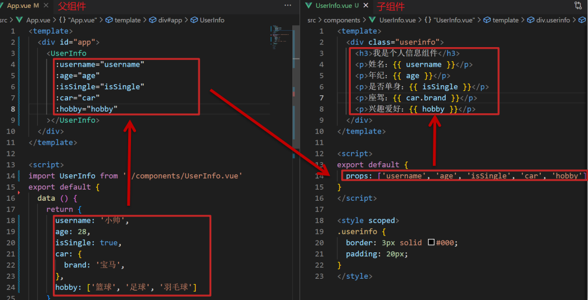


###### 2.4.2 props校验

思考：组件的 prop 可以乱传么？ 

作用：为组件的 prop 指定验证要求，不符合要求，控制台就会有错误提示 → 帮助开发者，快速发现错误 

**语法**： ① 类型校验 ② 非空校验 ③ 默认值 ④ 自定义校验

```js
props:{
	校验属性名:类型名	// Number String Boolean
}
```

props校验完整写法：

```js
props:{
    校验属性名:{
        type:类型,	// Number String Boolean ...
        required:true,	// 是否必填
        default:默认值,  // 默认值(没有传递过来就使用默认值)
        validator(value){
            // 自定义校验逻辑
            return 是否通过校验
        }
    }
}
```


###### 2.4.3 prop & data、单向数据流

**共同点**：都可以给组件提供数据。

**区别**：

* data 的数据是自己的 → 随便改 
* prop 的数据是外部的 → 不能直接改，要遵循 单向数据流

**单向数据流**：父级 prop 的数据更新，会向下流动，影响子组件。这个数据流动是单向的。

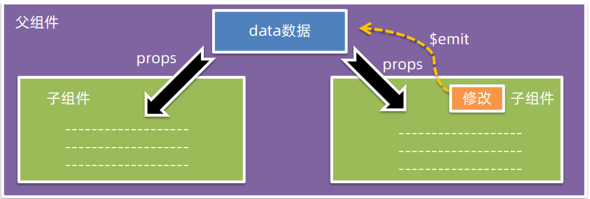

> 记忆口诀：谁的数据谁负责。


##### 2.5 非父子(扩展)

###### 2.4.1 event bus 事件总线

作用：非父子组件之间，进行简易消息传递。(复杂场景 → Vuex)


示例：

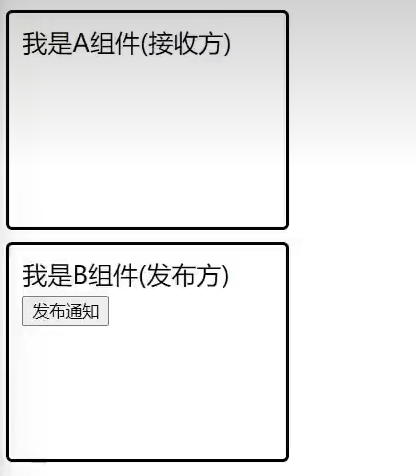

1. 创建一个都能访问到的事件总线 (空 Vue 实例) → utils/EventBus.js

   ```js
   import Vue from 'vue'
   const Bus = new Vue()
   exports default Bus
   ```

2. A 组件(接收方)，监听 Bus 实例的事件

   ```js
   created(){
       Bus.$on('sendMsg',msg=>{
           this.msg = msg
       })
   }
   ```

3. B 组件(发送方)，触发 Bus 实例的事件

   ```js
   Bus.$emit('sendMsg','这是一个消息')
   ```


###### 2.4.2 provide & inject

provide & inject 作用：`跨层级`共享数据。


什么是跨层级共享数据？

> 例如，你在父组件提供数据，子孙后代都通过这种方式得到数据。

示例：

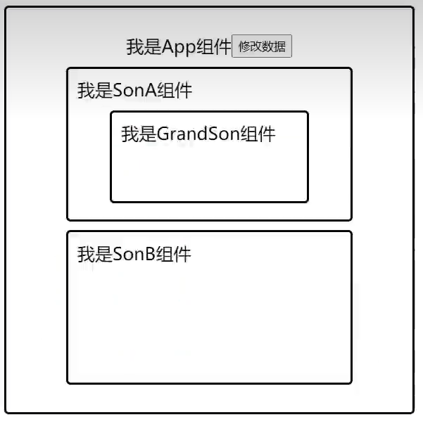

1. 父组件 provide 提供数据

   ```js
   export default {
       provide(){
           return {
               // 普通类型【非响应式】
               color: this.color,
               // 复杂类型【响应式】
               userInfo:this.userInfo
           }
       }
   }
   ```

2. 子/孙组件 inject 取值使用

   ```js
   export default{
       inject:['color','userInfo'],
       created(){
           console.log(this.color,this.userInfo)
       }
   }
   ```


#### 3、综合案例：小黑记事本(组件版)

需求说明：

① 拆分基础组件 

② 渲染待办任务 

③ 添加任务 

④ 删除任务 

⑤ 底部合计 和 清空功能 

⑥ 持久化存储


##### 3.1 拆分组件

我们可以以下图为例，进行拆分：

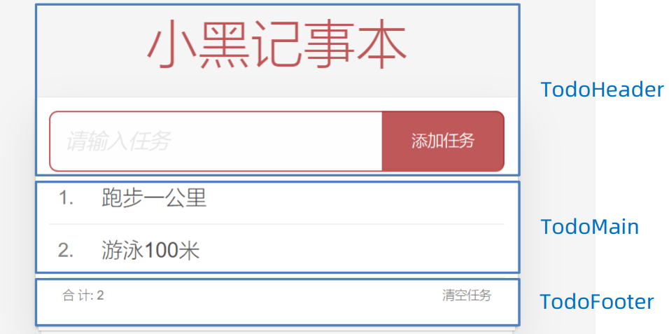

新建组件 → 拆分存放结构 → 导入注册使用


##### 3.2 渲染

提供数据(公共父组件) → 父传子传递 list → v-for 渲染


##### 3.3 添加

收集数据 v-model → 监听事件 → 子传父传递任务 → 父组件 unshift


##### 3.4 删除

监听删除携带 id → 子传父传递 id → 父组件 filter 删除


##### 3.5 统计

底部合计：父传子传递 list → 合计展示 


##### 3.6 清空

清空功能：监听点击 → 子传父通知父组件 → 父组件清空


##### 3.7 持久化

watch监视数据变化，持久化到本地


#### 4、进阶语法

##### 4.1 v-model原理

**原理**：v-model本质上是一个`语法糖`。例如应用在输入框上，就是 value属性 和 input事件 的合写。

> 语法糖本质上就是一些语法的简写。

**作用**：提供数据的双向绑定。

> ① 数据变，视图跟着变 :value  
>
> ② 视图变，数据跟着变 @input

**注意**：`$event` 用于在模板中，获取事件的形参。

> 不解`$event`参考官方文档：[使用事件抛出一个值](https://v2.cn.vuejs.org/v2/guide/components.html#%E4%BD%BF%E7%94%A8%E4%BA%8B%E4%BB%B6%E6%8A%9B%E5%87%BA%E4%B8%80%E4%B8%AA%E5%80%BC)

```html
<template>
	<div id="app">
        <input v-model="msg" type="text">
        <input :value="msg" @input="msg = $event.target.value" type="text">
    </div>
</template>
```

> v-model应用于输入框是`value`属性和`input`事件的合写，应用于复选框就是`checked`属性和`change`事件的合写。
>
> v-model的底层会根据不同的表单元素，设置不同的属性和事件。


##### 4.2 v-model应用于组件

###### 4.2.1 表单类组件封装

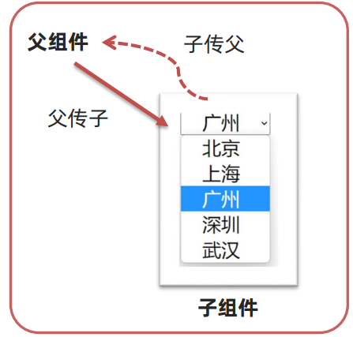

表单类组件 `封装`  → 实现 子组件 和 父组件数据 的双向绑定。

① 父传子：数据 应该是父组件 props 传递 过来的，`拆解` v-model 绑定数据 

> v-model是不可以直接和父组件绑定的，因为`v-model`是双向绑定，双向绑定意味着它可以修改你绑定的值的。子组件是不可以修改父组件的数据的，所以在这里我们要做一件事—`v-model的拆解`。

② 子传父：监听输入，子传父传值给父组件修改。

示例：

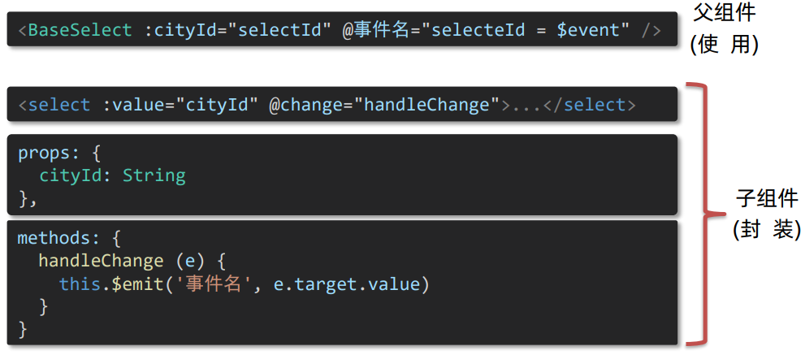


###### 4.2.2 v-model 简化代码

父组件 v-model `简化代码`，实现 子组件 和 父组件数据 `双向绑定`。

① 子组件中：props 通过 value 接收，事件触发 input 

 ② 父组件中：v-model 给组件直接绑数据 `(:value + @input)`

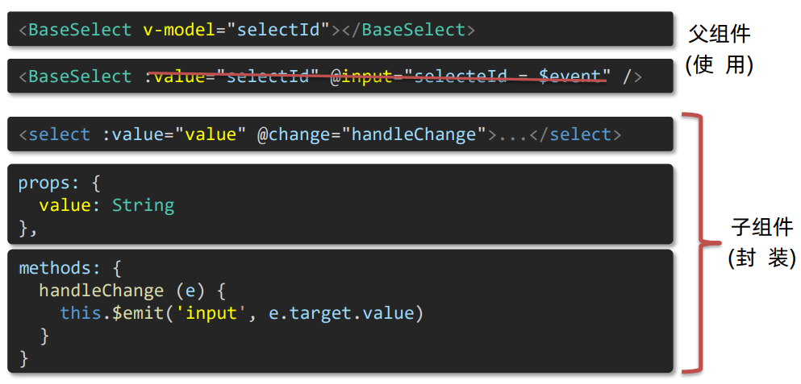


###### 4.2.3 小结

1.表单类基础组件封装思路

* 父传子：父组件动态传递 prop 数据，拆解v-model，绑定数据

* 子传父：监听输入，子传父传值给父组件修改

> 本质：实现了 子组件和父组件数据的双向绑定。

2.v-model 简化代码的核心步骤

* 子组件中：props 通过 value 接收，事件触发 input 
* 父组件中：v-model 给组件直接绑数据


##### 4.3 `.sync`修饰符

**作用**：可以实现 `子组件` 与 `父组件数据` 的 `双向绑定`，简化代码 。

**特点**：prop属性名，可以`自定义`，非固定为 `value`。

**场景**：封装弹框类的基础组件，`visible属性` true显示 false隐藏 。

**本质**：就是 `:属性名` 和 `@update:属性名` 合写。

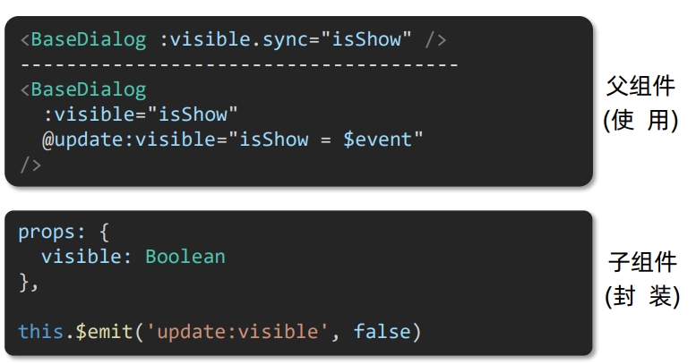


##### 4.4 ref和$refs

**作用**：利用 ref 和 $refs 可以用于 `获取 dom 元素`, 或 `组件实例` 。

**特点**：查找范围 → `当前组件内 (更精确稳定)`。


###### 4.4.1 获取dom

1. 目标并且 - 添加 `ref属性`：

   ```html
   <div ref="chartRef">我是渲染图表的容器</div>
   ```

2. 恰当时机，通过`this.$refs.xxx`，获取目标标签：

   ```js
   mounted(){
       console.log(this.$refs.chartRef)
   }
   ```


###### 4.4.2 获取组件

1. 目标组件 - 添加`ref属性`

   ```html
   <BaseForm ref="baseForm"></BaseForm>
   ```

2. 恰当时机，通过 `this.$refs.xxx` ，获取目标组件，就可以的`调用组件对象里面大的方法`。

   ```js
   this.$refs.baseForm.组件方法()
   ```


##### 4.5 $nextTick

###### 4.5.1 需求：编辑标题, 编辑框自动聚焦

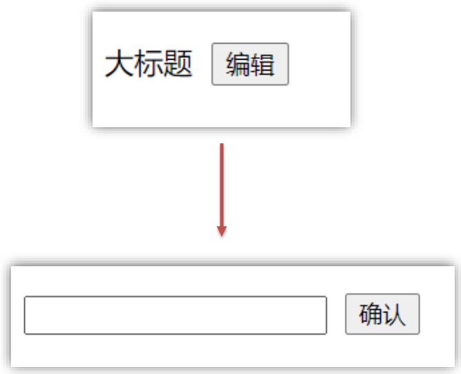

1. 点击编辑，显示编辑框 
2. 让编辑框，立刻获取焦点

```js
this.isShowEdit = true	// 显示输入框
ths.$refs.inp.focus()	// 获取焦点
```

问题是：“显示之后”，立即获取焦点是不能成功的！

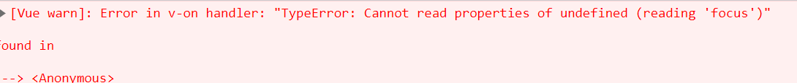

> 不能成功的原因是：在Vue中代码是异步更新DOM((提升性能)的，在`ths.$refs.inp.focus()`执行时，页面上还没有渲染`this.$refs.inp`指向的DOM元素。


###### 4.5.2 $nextTick

**作用**：等 DOM 更新后, 才会触发执行此方法里的函数体。

**语法**: `this.$nextTick(函数体)`。

**示例**：

```js
this.$nextTick(()=>{
    this.$refs.inp.focus()
})
```

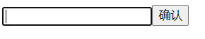

> 总结：在Vue中，想要在 DOM 更新完成之后做某件事，就可以使用`$nextTick`。

