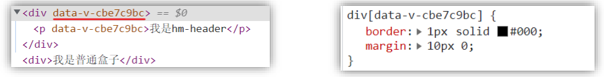
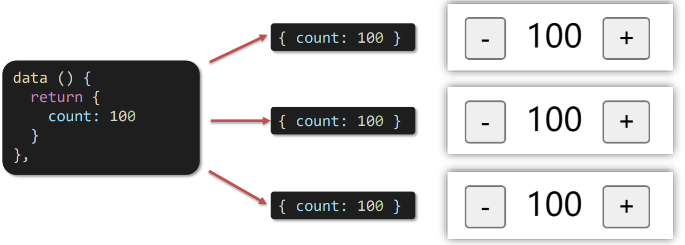
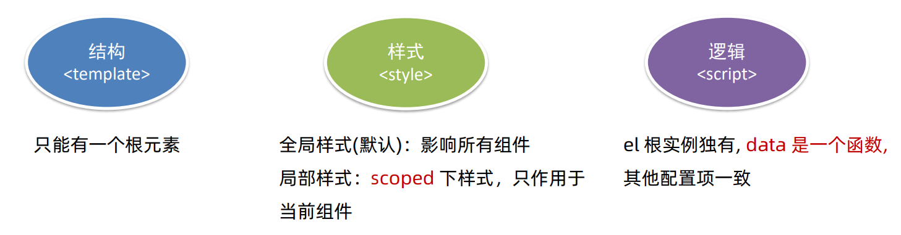
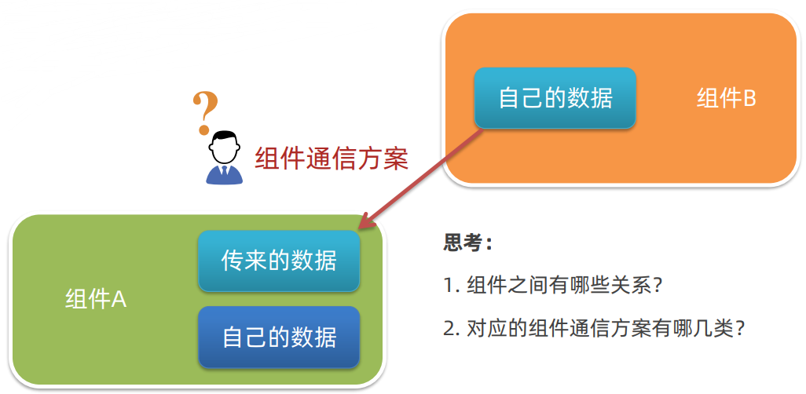
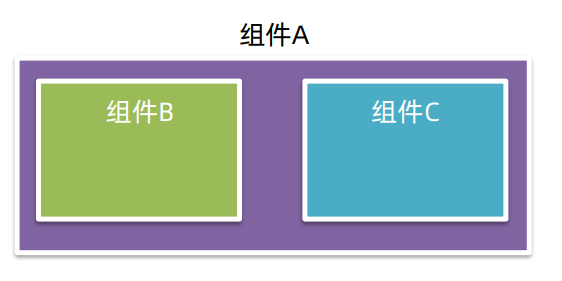
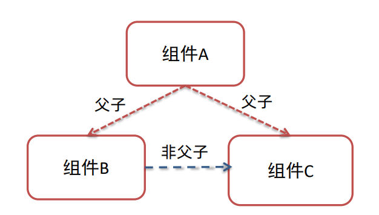
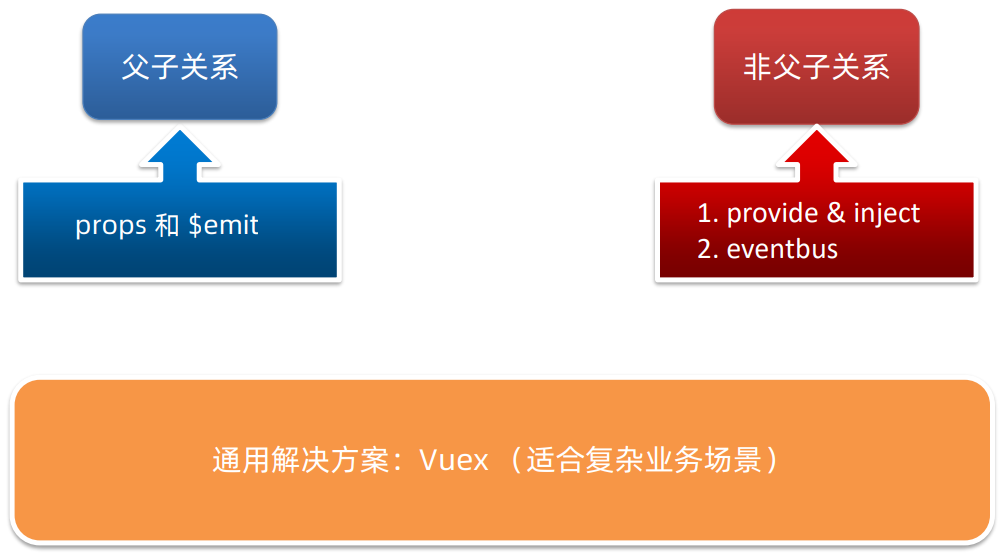
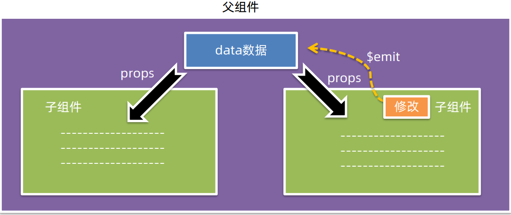
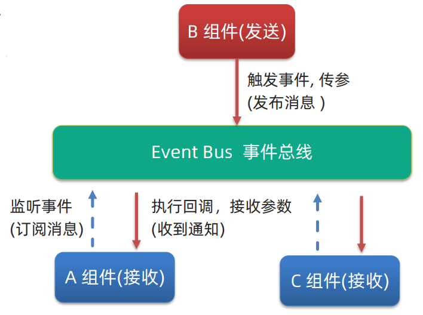
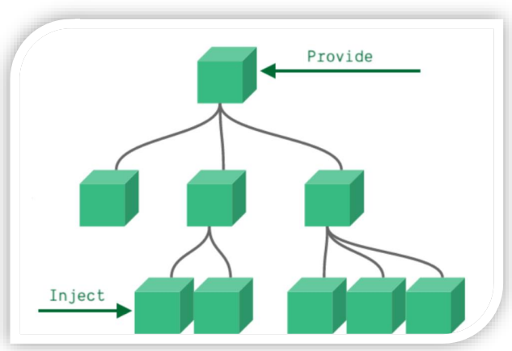

## vue-day04

#### 1、组件的三大组成部分(结构/样式/逻辑)

##### 1.1 scoped样式冲突

###### 1.1.1 默认情况

组件中的的两种样式：

1. 全局样式：默认组件中的样式会作用到全局。
2. 局部样式：可以给组件上的 style标签 加上 `scoped` 属性，`可以让样式只能作用于当前组件`。


写在组件中的样式会 `全局生效` → 因此很容易造成多个组件之间的样式冲突问题。

> 例如，我们组件header 中写了 一个类样式 `.top` ，在组件footer中也写了一个类样式` .top`。因为两个类样式名相同，将样式加载到页面上时会发生冲突(触发css的层叠性)。


###### 1.1.2 scoped的原理

1. 当前组件内标签都被添加 `data-v-hash值`的属性。
2. css选择器都被添加`[data-v-hash值]`的属性选择器。

最终效果：`必须是当前组件的元素`，才会有这个自定义属性，才会被这个样式作用到。




##### 1.2 data是一个函数

一个组件的 `data` 选项必须是一个`函数`。→ 保证每个组件实例，维护`独立`的一份数据对象。

> data必须是一个函数，这是Vue的一条规则。如果没有这一条规则，多个组件共用一个data，产生数据污染。采用函数的形式，initData时会将其作为工厂函数都会返回全新data对象。当将组件中的data写成一个函数，数据以函数返回值形式定义，这样每复用一次组件，就会返回一份新的data，拥有自己的作用域，类似于给每个组件实例创建一个私有的数据空间，让各个组件实例维护各自的数据。

每次创建新的组件实例，都会新执行一次 data 函数，得到一个新对象。



上图虽然是同一个data函数，但是返回的是不同的对象，所以每个count的变化都不会影响其他count的值。


##### 1.3 总结—组件的三大组成部分注意点



关于第二项和第三项，上面已经进行了解释，这里我们主要是讲解一下第一项。

那么，为什么Vue的组件中`template`只能有一个根元素呢？

> 详见文章：https://zhuanlan.zhihu.com/p/111691226


#### 2、组件通信

#####  2.1 组件通信语法

###### 2.1.2 什么是组件通信

组件通信，就是指 `组件与组件` 之间的`数据传递`。

* 组件的数据是独立的，无法直接访问其他组件的数据。 
* 想用其他组件的数据 → 组件通信




###### 2.1.2 组件关系分类

1. 父子关系
2. 非父子关系



用组件树来描述上图，如下：



###### 2.1.3 组件通信的解决方案




###### 2.1.4 父子通信流程图

1. 父组件通过 `props` 将数据传递给子组件
2. 子组件利用 `$emit` 通知父组件修改更新




##### 2.2 父传子 

父组件通过 `props` 将数据传递给子组件。


##### 2.3 子传父

子组件利用 `$emit` 通知父组件，进行修改更新。


##### 2.4 非父子(扩展)

###### 2.4.1 event bus 事件总线

作用：非父子组件之间，进行简易消息传递。(复杂场景 → Vuex)



示例：

1. 创建一个都能访问到的事件总线 (空 Vue 实例) → utils/EventBus.js

   ```js
   import Vue from 'vue'
   const Bus = new Vue()
   exports default Bus
   ```

2. A 组件(接收方)，监听 Bus 实例的事件

   ```js
   created(){
       Bus.$on('sendMsg',msg=>{
           this.msg = msg
       })
   }
   ```

3. B 组件(发送方)，触发 Bus 实例的事件

   ```js
   Bus.$emit('sendMsg','这是一个消息')
   ```


###### 2.4.2 provide & inject

provide & inject 作用：`跨层级`共享数据。



示例：

1. 父组件 provide 提供数据

   ```js
   export default {
       provide(){
           return {
               // 普通类型【非响应式】
               color: this.color,
               // 复杂类型【响应式】
               userInfo:this.userInfo
           }
       }
   }
   ```

2. 子/孙组件 inject 取值使用

   ```js
   export default{
       inject:['color','userInfo'],
       created(){
           console.log(this.color,this.userInfo)
       }
   }
   ```


#### 3、综合案例：小黑记事本(组件版)

##### 3.1 拆分组件


##### 3.2 渲染


##### 3.3 添加


##### 3.4 删除


##### 3.5 统计


##### 3.6 清空


##### 3.7 持久化


#### 4、进阶语法

##### 4.1 v-model原理

**原理**：v-model本质上是一个语法糖。例如应用在输入框上，就是 value属性 和 input事件 的合写。

**作用**：提供数据的双向绑定。

> ① 数据变，视图跟着变 :value  
>
> ② 视图变，数据跟着变 @input

**注意**：`$event` 用于在模板中，获取事件的形参。

```html
<template>
	<div id="app">
        <input v-model="msg" type="text">
        <input :value="msg" @input="msg = $event.target.value" type="text">
    </div>
</template>
```


##### 4.2 v-model应用于组件

###### 4.2.1 表单类组件封装

表单类组件 `封装`  → 实现 子组件 和 父组件数据 的双向绑定。

> ① 父传子：数据 应该是父组件 props 传递 过来的，拆解 v-model 绑定数据 
>
> ② 子传父：监听输入，子传父传值给父组件修改


###### 4.2.2 v-model 简化代码


##### 4.3 sync修饰符


##### 4.4 ref和$refs


##### 4.5 $nextTick

