## vue-day05

#### 1、自定义指令

##### 1.1 基本语法(全局&局部注册)

###### 1.1.1 为什么要有自定义指令

**自定义指令**：自己定义的指令, 可以`封装一些 dom 操作`， 扩展额外的一些功能。

需求：当页面加载时，让元素将获取焦点。

因为 `autofocus`属性 在 safari 浏览器具有兼容性，所以我们一般都是通过`dom元素.focus()`实现该功能。

```js
mounted(){
    this.$refs.inp.focus()
}
```

> 虽然我们可以通过上面的方法解决，但是当多个组件或者多个地方都需要该功能就会比较麻烦。

如果我们把上述操作，封装成一个指令，那么到时候只需要在需要该功能的标签上加上封装的指令即可完成同样的效果(一次封装，多次调用 => 代码复用)。


Vue有两种注册指令的方式：全局注册和局部注册。


###### 1.1.2 全局注册

语法：

```js
Vue.directive('指令名',{
    "inserted"(el){
        // 可以对el标签，扩展额外功能
        el.focus()
    }
})
```

使用：

```html
<input v-指令名 type="text">
```


###### 1.1.3 局部注册

语法：

```js
directives:{
    "指令名":{
        inserted(){
            // 可以对 el 标签，扩展额外功能
            el.focus()
        }
    }
}
```

使用：和全局注册使用方式时一样的。


##### 1.2 指令的值

需求：实现一个 color 指令 - 传入不同的颜色, 给标签设置文字颜色。

**语法**：在绑定指令时，可以通过“等号”的形式为指令 绑定 `具体的参数值`。

```html
<div v-color="color">我是内容</div>
```

通过 binding.value 可以拿到指令值，指令值修改会 触发 update 函数。

```js
directives:{
    color:{
		inserted(el,binding){
			el.style.color = binding.value
        },
        update(el,binding){
            el.style.color = binding.value
        }
    }
}
```


##### 1.3 v-loading指令的封装

场景：实际开发过程中，发送`请求需要时间`，在请求的数据未回来时，页面会处于`空白状态` => `用户体验不好`。

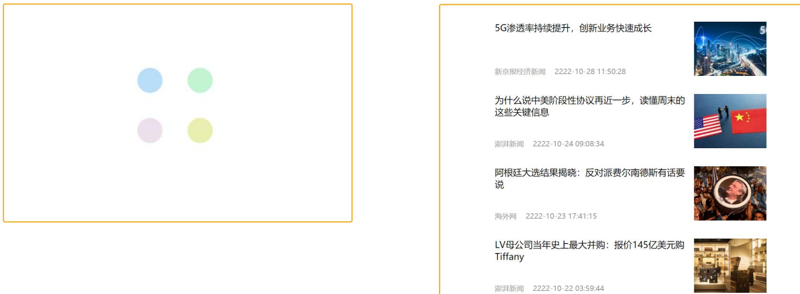

**需求**：封装一个 v-loading 指令，实现加载中的效果。

**分析**：

1. 本质 loading 效果就是一个蒙层，盖在了盒子上 
2. 数据请求中，开启loading状态，添加蒙层 
3. 数据请求完毕，关闭loading状态，移除蒙层

**实现**：

1. 准备一个 loading 类，通过伪元素定位，设置宽高，实现蒙层。

   ```css
   .loading:before {
       content: "";
       position: absolute;
       left: 0;
       top: 0;
       width: 100%;
       height: 100%;
       background: #fff url("./loading.gif")
       no-repeat center;
   }
   ```

   

2. 开启关闭 loading 状态（添加移除蒙层），本质只需要添加移除类即可 。

3. 结合自定义指令的语法进行封装复用。


#### 2、插槽

##### 2.1 默认插槽

###### 2.1.1 为什么要使用插槽？

作用：让组件内部的一些 结构 支持 自定义。

需求: 将需要多次显示的对话框, 封装成一个组件。

问题：组件的内容部分，`不希望写死`，希望能使用的时候`自定义`。怎么办?

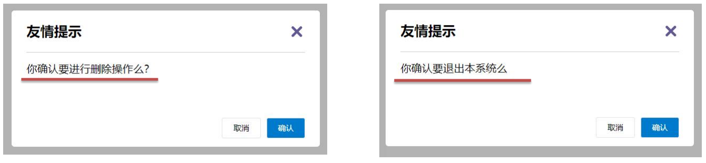

> 这里可以使用插槽。


###### 2.1.2插槽基本使用(默认插槽)

语法：

1. 组件内需要定制的结构部分(动态内容/数据)，改用`<slot></slot>`占位。
2. 使用组件时，`<MyDialog></MyDialog>`标签内部，传入结构替换slot。

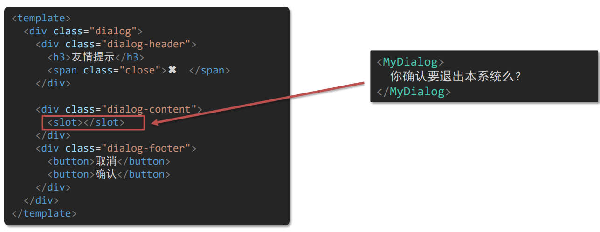

> 如上图，我们是在父组件中使用子组件，在标签中写入定制的内容，然后子组件这里就会把定制的内容丢到`<slot></slot>`这对插槽标签的位置。
>
> 这种方式类似于之前Vue的`{{ }}`表达式，就是用它占个位置，然后将表达式或内容填进去就行了。


##### 2.2 插槽—后备内容

通过插槽完成了内容的定制，传什么显示什么, 但是如果不传，则是空白。

那么，我们能否让插槽在我们不传的时候，显示`默认设置的内容`呢？

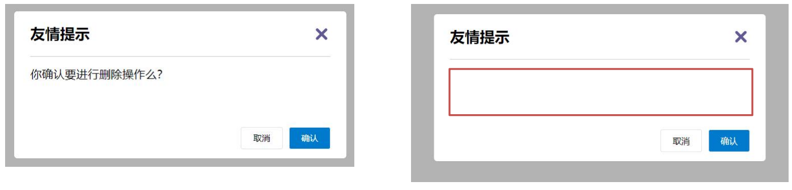


插槽后备内容：封装组件时，可以为预留的`<slot>`插槽提供`后备内容`(默认内容)。

* 语法：在`<slot>`标签内，放置内容，作为默认显示内容。

* 效果：

  * 外部使用组件时，不传东西，则slot会默认显示后备内容

    ```html
    <MyDialog></MyDialog>
    ```

  * 外部使用组件时，传东西了，则slot整体会被传入的内容替换掉

    ```html
    <MyDialog>我是内容</MyDialog>
    ```


##### 2.3 具名插槽

###### 2.3.1 为什么要使用具名插槽

需求：一个组件内有多处结构，需要外部传入标签，进行定制。

默认插槽：一个定制位置。

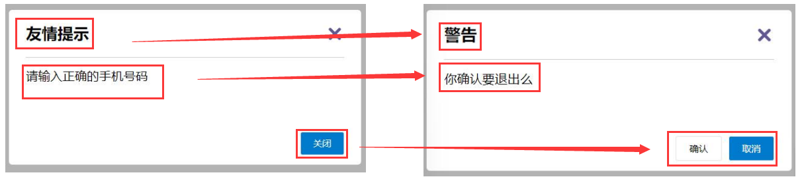

通过上图我们可以发现，如果是利用同一个对话框组件，上面的组件中有三部分是需要根据不同情况发生动态改变的。默认插槽已经不满足于我们实现该功能的需求，这个时候，我们就可以使用具名插槽来进行定制。


###### 2.3.2 具名插槽语法

顾名思义，具名就是给每一个`slot`添加上了对应的名字。

语法：

1. 多个`slot`使用`name`属性来区分名字

   ```html
   <!-- 子组件的内容 -->
   <div class="dialog">
       <div class="dialog-header">
           <slot name="head"></slot>
       </div>
       <div class="dialog-content">
           <slot name="content"></slot>
       </div>
       <div class="dialog-footer">
           <slot name="footer"></slot>
       </div>
   </div>
   ```

2. `template`配合`v-slot:名字`来分发对应的标签

   ```html
   <!-- 父组件中传递每个插槽定制内容 -->
   <MyDialog>
       <template v-slot:head>
           大标题
       </template>
       <template v-slot:content>
           内容文本
       </template>
       <template v-slot:footer>
           <button>按钮</button>
       </template>
   </MyDialog>
   ```

每一个template中的`v-slot:xxx`对应子组件中插槽`<slot name="xxx"></slot>`。

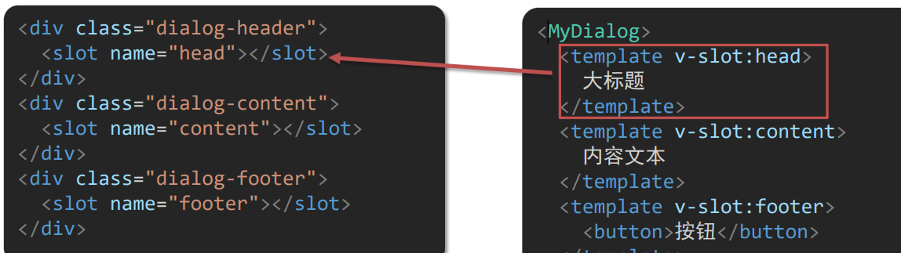

最后在页面上渲染的结果如下：

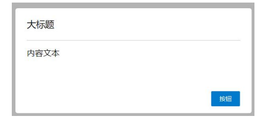


###### 2.3.3 具名插槽的简化语法

前面不是说了，每一个插槽的名称是唯一的，所以我们可以在父组件中通过这种方式`v-slot:插槽名 可以简化成 #插槽名`来传递给子组件中相对应的插槽。(在编程中，我们一般都是用id来表示唯一标识)

```html
<!-- 父组件中传递每个插槽定制内容 -->
<!-- v-slot:head 简化=> #head -->
<MyDialog>
    <template #head>
        大标题
    </template>
    <template #content>
        内容文本
    </template>
    <template #footer>
        <button>按钮</button>
    </template>
</MyDialog>
```


##### 2.4 作用域插槽

###### 2.4.1 什么是作用域插槽？

作用域插槽: 定义 slot 插槽的同时, 是可以`传值`的。给 `插槽` 上可以 `绑定数据`，将来 `使用组件时可以使用`。

场景：封装表格组件

1. 父传子，动态渲染表格内容
2. 利用默认插槽，定制操作列
3. 删除或查看都需要用到 `当前项的id` ，属于 `组件内部的数据` 通过 `作用域插槽` 传值绑定，进而使用。

```html
<!-- 父组件中使用子组件 -->
<MyTable :list="list">
	<button>删除</button>
</MyTable>
<MyTable :list="list2">
	<button>查看</button>
</MyTable>
```


###### 2.4.2  使用步骤

1. 给slot标签，以 添加属性的方式进行传值

   ```html
   <slot :id="item.id" msg="测试文本"></slot>
   ```

2. 所有添加的属性，都会被收集到一个对象中

   ```json
   {id:3,msg:"测试文本"}
   ```

3. 在template中，通过`#插槽名="obj"`接收，默认插槽名为`default`

   ```html
   <MyTable>
   	<template #default="obj">
       	<button @click="del(obj.id)">删除</button>
       </template>
   </MyTable>
   ```

   利用作用域插槽方式传值，省去了我们使用`$emit()`从子组件传值的这个流程，父组件也不需要再监听子组件传递过来的事件名。


#### 3、综合案例：商品列表

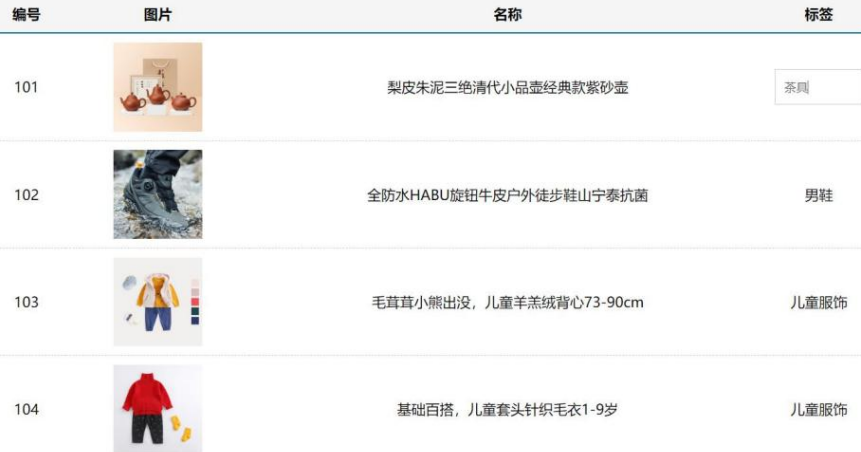

##### 3.1 MyTag组件封装

(1) 双击显示输入框，输入框获取焦点

(2) 失去焦点，隐藏输入框 

(3) 回显标签信息 

(4) 内容修改，回车 → 修改标签信息

##### 3.2 MyTable组件封装

(1) 动态传递表格数据渲染 

(2) 表头支持用户自定义 

(3) 主体支持用户自定义


#### 4、路由入门

##### 4.1 单页面应用程序

###### 4.1.1 什么是单页面应用程序？

**单页面应用**(SPA - Single Page Application): 所有功能在 一个html页面 上实现 。

**具体示例**: 网易云音乐 https://music.163.com。

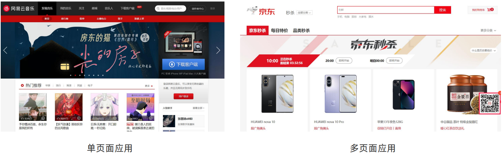


###### 4.1.2 单页面应用程序 VS 多页面应用程序

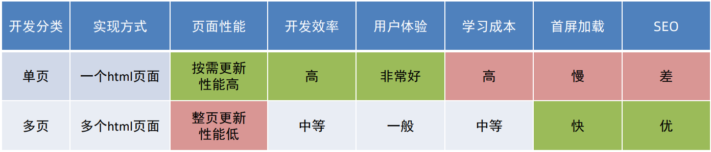

单页面应用开发场景：

> 系统类网站 / 内部网站 / 文档类网站 /移动端站(学习Vue就是主要应用于单页面应用的开发)

多页面应用开发场景：

> 公司官网 / 电商类网


综上所述，单页面有如下优缺点：

* 优点：按需加载性能高，开发效率高，用户体验好
* 缺点：学习成本高，首屏加载慢，不利于SEO


###### 4.1.3 思考

单页面应用程序，之所以开发效率高，性能高，用户体验好，最大的原因就是：`页面按需更新`。

要按需更新，首先就需要明确：`访问路径`和`组件`对应的关系！

访问路径 和 组件的对应关系如何确定呢？

> 路由


##### 4.2 路由概念

###### 4.2.1 生活中的路由

设备和ip的`映射`关系。

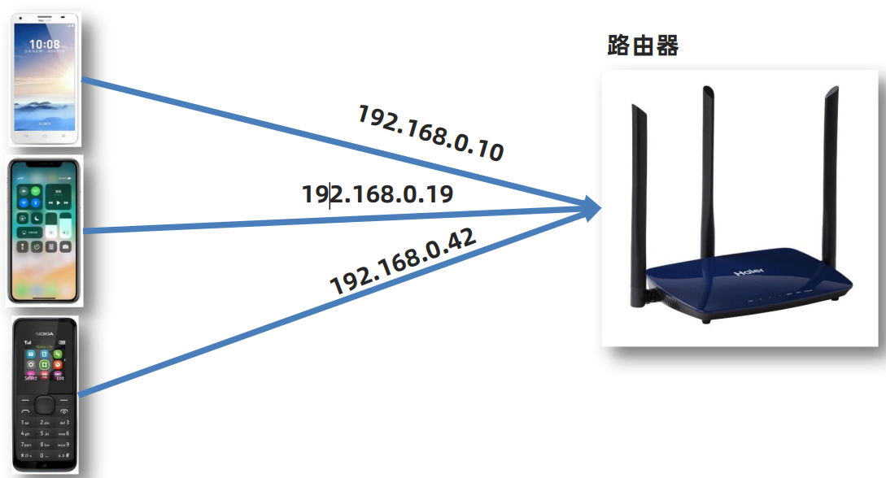


###### 4.2.2 Vue中的路由

`路径` 和 `组件`的 `映射`关系。

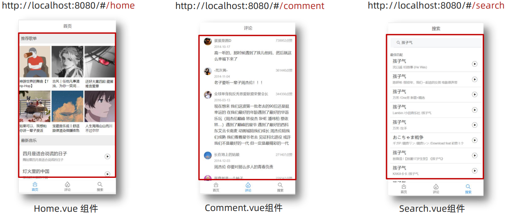


###### 4.2.3 小结

1.什么是路由？

> 路由是一种映射关系。

2.Vue中路由是什么？

> 路径和组件的映射关系。
>
> 根据路由就能知道不同路径的，应该匹配渲染哪个组件。


##### 4.3 VueRouter的基本使用

###### 4.3.1 VueRouter的介绍

作用：修改地址栏路径时，切换显示匹配的组件

说明：Vue官方的一个路由插件，是一个第三方包

官网：[Vue Router (vuejs.org)](https://v3.router.vuejs.org/zh/)


###### 4.3.2 VueRouter的使用(5+2)

从现在开始使用VueRouter就要开始注意依赖包版本问题了。我们学习的Vue需要注意下面两串数字：

> ①2 3 3 ： => Vue2   VueRouter3.x 	Vuex 3.x
>
> ②3 4 4：  => Vue3	VueRouter4.x	 Vuex 4.x

5个步骤(固定)

① 下载：

```bash
yarn add vue-router@3.6.5
# 或者
npm i vue-router@3.6.5
```

② 引入

```js
import VueRouter from 'vue-router'
```

③ 安装注册

```js
Vue.use(VueRouter)
```

④ 创建路由对象

```js
const router = new VueRouter()
```

⑤ 注入，将路由对象注入到new Vue实例中，建立关联

```js
new Vue({
    render: h => h(App),
    router
}).$mount('#app')
```


2个核心步骤

①  创建需要的组件 (views目录)，配置路由规则

```js
import Find from './views/Find.vue'
import My from './views/My.vue'
import Friend from './views/Friend.vue'
const router = new VueRouter({
    routes: [
        // path: 地址栏路径
        // component: 组件
        { path: '/find', component: Find },
        { path: '/my', component: My },
        { path: '/friend', component: Friend },
    ]
})
```

② 配置导航，配置路由出口(路径匹配的组件显示的位置)

```html 
<div class="footer_wrap">
    <a href="#/find">发现音乐</a>
    <a href="#/my">我的音乐</a>
    <a href="#/friend">朋友</a>
</div>
<div class="top">
    <!-- router-view标签是用来控制 组件显示的位置(路由出口) -->
    <router-view></router-view>
</div>
```


###### 4.3.3 小结

1.如何实现 路径改变，对应组件 切换？ 

> Vue 官方插件 VueRouter 

2.VueRouter 的使用基本步骤? (5 + 2) 

> 5个基础步骤 ：① 下包 ② 引入 ③ Vue.use 安装注册 ④ 创建路由对象 ⑤ 注入Vue实例 
>
> 2个核心步骤 ：① 创建组件，配置规则 ( 路径组件的匹配关系 ) ② 配导航，配置路由出口 router-view (组件展示的位置)


##### 4.4 组件目录存放问题

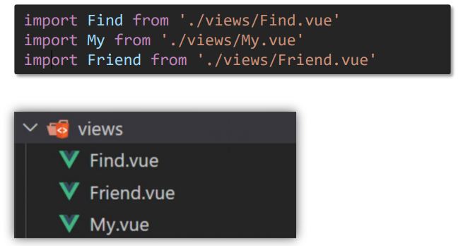

注意：`.vue文件`本质无区别。

那么，路由相关组件，为什么要放在 views 目录呢？

> 组件分类。


###### 4.4.1 组件分类

`.vue文件`分2类；页面组件 & 复用组件。 


如果将其分类开来，会`更易维护`

* src/views 文件夹

  > **页面组件** - 页面展示 ： 配合路由用。

* src/components 文件夹

  > **复用组件** - 展示数据 ：常用于复用。

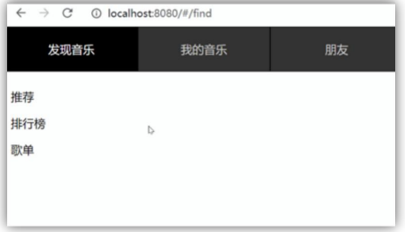


###### 4.4.2 小练习

练习1：以下 .vue 文件，属于什么分类组件？应该放在哪个目录？

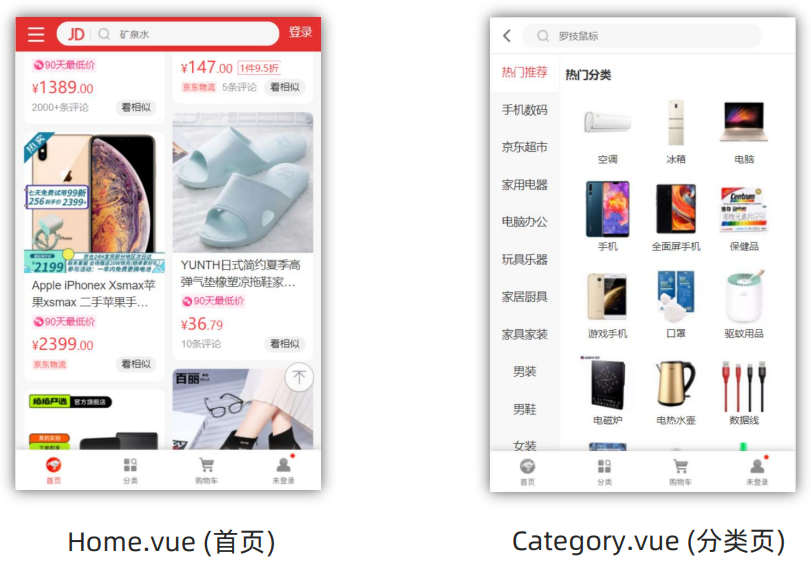

> 页面组件,配合路由用 放在 views 目录


练习2：以下 .vue 文件，属于什么分类组件？应该放在哪个目录？

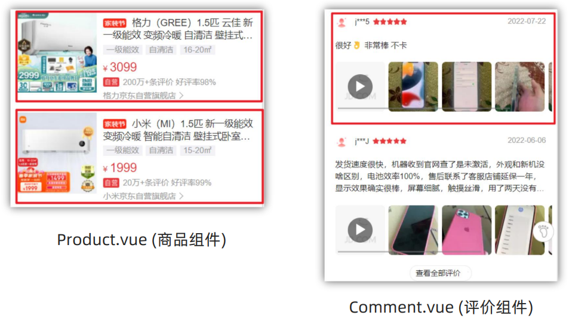

> 复用组件, 放在 components 目录