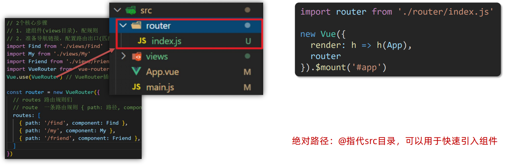
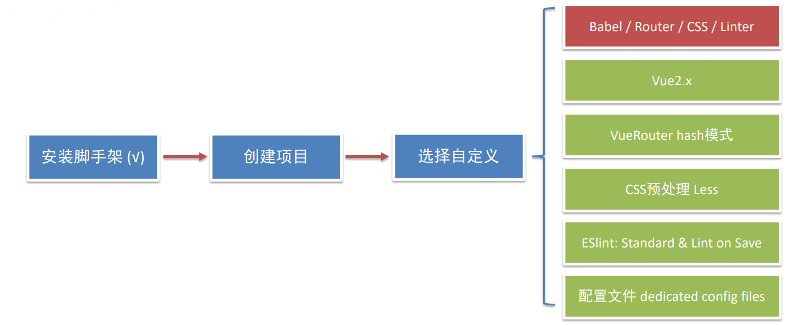

## vue-day06

#### 1、本节目标

* 能够实现路由模块封装
* 一级路由的基本使用
* 二级路由的基本使用


#### 2、路由进阶

##### 2.1 路由封装抽离

在学习这一小节之前，我们先思考一个问题：前面我们将所有的路由配置都堆在main.js中合适么？

> 答案当然就是否，不合适。在之前我们学习第三天学习组件化开发时提到了这样的一个点：
>
> `当项目规模越大，就越要拆分模块，这样利于维护`。

路由同样也是如此，我们可以将路由单独抽离作为一个模块，后面想要维护这方面也会特别方便。如下图就是一个抽离router的一个示例：



> 注意：上图中所说的`@`符指的是src目录，在项目中使用`@`进行导入，可以避免我们在移动文件时多次修改导入路径。

例如，我们的子组件是位于`views`文件中，我们在`main.js`中导入子组件是这样的：

```js
import Find from './views/Find'
import Friend from './views/Friend'
import My from './views/My'
```

但是当我们将其封装到`router`目录下的`index.js`文件中，又需要将导入路径再次修改(不修改则会报模块错误=>无法找到模块)：

```js
import Find from '../views/Find'
import Friend from '../views/Friend'
import My from '../views/My'
```

如果我们一开始使用`@`开始来作为导入组件模块路径，则无需在代码抽离的时候再对其模块导入进行修改，如下：

```js
import Find from '@/views/Find'
import Friend from '@/views/Friend'
import My from '@/views/My'
```

上述组件的导入，无论是在原本的`views`目录下，还是在抽离到`router`的模块下都是适用的。`@`符在其中就起到了一个类似于`绝对路径`的作用。

> 如果以后我们要快速引入组件，可以基于`@`从src目录出发找组件。


##### 2.2 声明式导航

###### 声明式导航—导航链接

需求：实现导航高亮效果。

在以前，我们给导航实现高亮效果，需要反复给当前选中导航添加和移除高亮样式，这样的操作就会涉及到了多条JS代码。

```html
<template>
  <div>
    <div class="footer_wrap">
      <a href="#/find">发现音乐</a>
      <a href="#/my">我的音乐</a>
      <a href="#/friend">朋友</a>
    </div>
    <div class="top">
      <!-- 路由出口 → 匹配的组件所展示的位置 -->
      <router-view></router-view>
    </div>
  </div>
</template>
```

`vue-router`提供了一个全局组件`router-link`(取代a标签)。

特点：

* `能跳转`，配置`to`属性指定路径(`必须`)。本质还是a标签，`to无需#`。
* `能高亮`，默认就会`提供高亮类名`，可以直接设置高亮样式。

将上述代码修改后：

```html
<div class="footer_wrap">
    <router-link to="/find">发现音乐</router-link>
    <router-link to="/my">我的音乐</router-link>
    <router-link to="/friend">朋友</router-link>
</div>
```

打开浏览器开发者工具查看效果：


如果我们需要实现高亮，可以添加上下面的CSS样式代码：

```css
.footer_wrap a.router-link-active {
  background-color: purple;
}
```

单击导航后的效果如下：


###### 精确匹配&模糊匹配 — 两个类名

前面，我们发现了router-link 自动给当前导航添加了 `两个高亮类名`。


1. router-link-active ：`模糊匹配`（用的多）

   > to="/my" 可以匹配 /my、/my/a、/my/b、....

2. router-link-exact-active：`精准匹配`

   > to="my" 仅可以匹配 /my


###### 自定义高亮类名

除了上面那种通过`router-link`自动添加的高亮类名，如果我们需要用自己添加的高亮类名，可以通过自定义类名的方式添加它，定制方式如下：

```js
const router = new VueRouter({
    routes:[...],
    linkActiveClass:"类名1",	// 配置模糊匹配类名
    linkExactActiveClass:"类名2"	// 配置精确匹配类名
})
```

配置前页面渲染：


配置后：

```js
const router = new VueRouter({
  routes: [...],
  //   link自定义高亮类名
  linkActiveClass: 'active', // linkActiveClass => 配置模糊匹配的类名
  linkExactActiveClass: 'exact-active', // linkExactActiveClass => 配置精确匹配的类名
})
```


###### 导航传参(查询参数传参&动态路由传参)

**(1) 查询参数传参**

* 语法格式如下：

  ```js
  // router-link 中to属性值的写法
  to="path?参数名=值"
  ```

* 对应跳转页面组件接受传递过来的值

  ```js
  $route.query.参数名
  ```

  

**(2) 动态路由传参**

* 配置动态路由

  ```js
  const router = new VueRouter({
      routes:[
          ...,
          {
          	path:'/search/:words',
          	component:Search
          }
      ]
  })
  ```

* 配置导航链接

  ```js
  // router-link 中to属性值配置
  to="/path/参数值"
  ```

* 对应页面组件接收传递过来的值

  ```js
  $router.params.参数名
  ```

  

**(3) 两种传参方式的区别**

1. 查询参数传参(比较适合传多个参数)

   ① 跳转：to="path`?参数名=值&参数名2=值`"

   ② 获取：$router.query.参数名

   

2. 动态路由传参

   ① 配置动态路由：`path:"/path/:参数名"`

   ② 跳转：to="/path/`参数值`"

   ③ 获取：$router.params.参数名


###### 动态路由参数可选符

**问题**：配了路由 `path: "/search/:words" `为什么按下面步骤操作，会未匹配到组件，显示空白？


**原因**：`/search/:words` 表示，必须要传参数。如果不传参数，也希望匹配，可以加个可选符 `?`。

```js
const router = new VueRouter({
  routes: [
    { path: '/home', component: Home },
    { path: '/search/:words?', component: Search },
  ],
})
```

配置后页面效果如下：


##### 2.3 Vue路由

###### 重定向

问题：网页打开， url 默认是 / 路径，未匹配到组件时，会出现空白。

说明：重定向 → 匹配path后, 强制跳转path路径。

语法：`{ path:匹配路径,redirect:重定向到的路径 }`。

```js
const router = new VueRouter({
  routes: [
    {path:'/',redirect:'/home'},
    { path: '/home', component: Home },
    { path: '/search/:words?', component: Search },
  ],
})
```


###### 路由404

**作用**：当路径找不到匹配时，给个提示页面。

**位置**：配置在路由最后面。

**语法**：`path:"*" `(任意路径) - 前面不匹配就命中最后这个。

```js
// 引入新的组件 NotFound
import NotFound from '@/views/NotFound'

const router = new VueRouter({
  routes: [
    // 重定向
    { path: '/', redirect: '/home' },
    { path: '/home', component: Home },
    { path: '/search/:words?', component: Search },
    // 路由不匹配 => 404
    { path: '*', component: NotFound },
  ],
})
```

访问一个不存在的路由：


###### 路由模式

**问题**：路由的路径看起来不自然, 有**#**，能否切成真正路径形式?

* hash路由(默认) 例如：http://localhost:8080/#/home
* history路由(常用) 例如：http://localhost:8080/home （以后上线需要服务端支持）

```js
const router = new VueRouter({
    routes,
    mode:'history'	// 设置路由模式为 history 模式
})
```

切换为`history`模式后：


##### 2.4 编程式导航

###### 基本跳转

思考一个问题：点击按钮跳转页面是如何实现的？

> 编程式导航：用JS代码来实现跳转。

编程式导航基本跳转有两种语法：

* path 路径跳转
* name 命名跳转


**（1） path路径跳转(简单方便)**

```js
// 在Vue实例中操作
this.$router.push('路由路径')

this.$router.push({
    path:'路由路径'
})
```


**（2）name命名跳转(适合 path 路径长的场景)**

通过该方式必须要给路由起名字：

```js
{ name: 'search', path: '/search/:words?', component: Search }
```

```js
this.$router.push({
    name:'路由名'
})
```


###### 路由跳转

问题：点击搜索按钮，跳转需要传参如何实现？

   

> 两种传参方式：查询参数 + 动态路由传参

两种跳转方式，对于两种从传参方式都支持：

1. path路径跳转传参
2. name命名路由跳转传参


**path路径跳转传参(query传参)**

```js
this.$router.push('/路径?参数名1=参数值1&参数2=参数值2')
this.$router.push({
    path: '/路径',
    query: {
        参数名1: '参数值1',
        参数名2: '参数值2'
    }
})
```

**path路径跳转传参(动态路由传参)**

```js
this.$router.push('/路径/参数值')
this.$router.push({
    path: '/路径/参数值'
})
```


**name命名路由跳转传参(query传参)**

```js
this.$router.push({
    name: '路由名字',
    query: {
        参数名1: '参数值1',
        参数名2: '参数值2'
    }
})
```

**name命名路由跳转传参(动态传参)**

```js
this.$router.push({
    name: '路由名字',
    params: {
        参数名: '参数值',
    }
})
```


#### 3、综合案例：面经基础版

##### 3.1 案例分析

实现效果：


**功能分析**：

* 通过演示效果发现，主要的功能页面有两个，一个是列表页，一个是详情页，并且在列表页点击时可以跳转到详情页
* 底部导航可以来回切换，并且在切换时，上面的主题内容在动态渲染。


**实现步骤分析**：`配路由+实现功能`

1. 配路由

   ① 首页 和 面经详情，两个一级路由

   ② 首页内嵌四个可切换页面(`嵌套二级路由`)

2. 实现功能

   ① 首页请求渲染

   ②` 跳转传参 `到 详细页，详细页渲染

   ③ `组件渲染`，优化性能

路由配置结构如下：


##### 3.2 路由配置和导航高亮

###### 1 创建好组件文件

```
面经src结构:
|--src
	|--views
		|--Article.vue	# 文章组件
		|--ArticleDetail.vue	# 文章详情组件
		|--Collect.vue	# 收藏组件
		|--Layout.vue	# 布局组件
		|--Like.vue		# 喜欢文章分类组件
		|--User.vue		# 我的信息组件
	|--router
		|--index.js		# 路由配置
	|--App.vue
	|--main.js
```


###### 2 路由配置

```js
import Vue from 'vue'
import VueRouter from 'vue-router'

import Layout from '@/views/Layout'
import ArticleDetail from '@/views/ArticleDetail'
import Article from '@/views/Article'
import Collect from '@/views/Collect'
import Like from '@/views/Like'
import User from '@/views/User'

Vue.use(VueRouter)

const router = new VueRouter({
  routes: [
    {
      path: '/',
      component: Layout,
      // 通过children配置项，可以配置嵌套子路由
      // 1.在children配置项中，配规则
      // 2.准备二级路由出口
      children: [
        {
          path: '/article',
          component: Article,
        },
        {
          path: '/collect',
          component: Collect,
        },
        {
          path: '/like',
          component: Like,
        },
        {
          path: '/user',
          component: User,
        },
      ],
    },
    {
      path: '/detail',
      component: ArticleDetail,
    },
  ],
  mode: 'history',
})
// 模块出口
export default router
```

Layout.vue中实现导航栏的高亮及跳转：

```vue
....
    <nav class="tabbar">
      <router-link to="/article">面经</router-link>
      <router-link to="/collect">收藏</router-link>
      <router-link to="/like">喜欢</router-link>
      <router-link to="/user">我的</router-link>
    </nav>

<style>
   a.router-link-active {
      color: orange;
    }
</style>
```


##### 3.3 动态渲染首页

###### 1 分析

1.安装axios 

2.看接口文档，确认请求方式，请求地址，请求参数

3.created中发送请求，获取数据，存储到data中

4.页面动态渲染


###### 2 实现

1.安装axios 

```bash
yarn add axios
npm i axios
```

2.看接口文档，确认请求方式，请求地址，请求参数

```
请求地址: https://mock.boxuegu.com/mock/3083/articles
请求方式: get
```

3.created中发送请求，获取数据，存储到data中

```js
data() {
    return {
        articelList: [],
    }
},
async created() {
    const {  data: { result: { rows } }} = await axios.get('https://mock.boxuegu.com/mock/3083/articles')
    this.articelList = rows
},
```

4.页面动态渲染(通过`v-for`将articelList一一遍历渲染到页面中)

```vue
<template>
  <div class="article-page">
    <div
      class="article-item"
      v-for="item in articles"
      :key="item.id"
    >
      <div class="head">
        
        <div class="con">
          <p class="title">{{ item.stem }}</p>
          <p class="other">{{ item.creatorName }} | {{ item.creatorAt }}</p>
        </div>
      </div>
      <div class="body">
        {{ item.content }}
      </div>
      <div class="foot">点赞 {{ item.likeCount }} | 浏览 {{ item.views }}</div>
    </div>
  </div>
</template>
```


##### 3.4 路由跳转传参

###### 1 说明

跳转详情页需要把当前点击的文章id传给详情页，获取数据

- 查询参数传参  this.$router.push('/detail?参数1=参数值&参数2=参数值') 
- 动态路由传参  先改造路由 在传参  this.$router.push('/detail/参数值')


###### 2 查询参数传参实现

Article.vue

```vue
<template>
  <div class="article-page">
    <div class="article-item" 
      v-for="item in articelList" :key="item.id" 
      @click="$router.push(`/detail?id=${item.id}`)">
     ...
    </div>
  </div>
</template>
```

ArticleDetail.vue

```vue
created(){
    console.log(this.$route.query.id)
}
```


###### 3 动态路由传参

步骤：

- 改造路由
- 动态传参
- 在详情页获取参数


**改造路由**

router/index.js

```js
...
  {
      path: '/detail/:id',
      component: ArticleDetail
  }
```

Article.vue

```vue
<div class="article-item" 
     v-for="item in articelList" :key="item.id" 
     @click="$router.push(`/detail/${item.id}`)">
       ....
 </div>
```

ArticleDetail.vue

```vue
  created(){
    console.log(this.$route.params.id)
  }
```

额外的改动：

```vue
<!-- ArticleDetail.vue -->
<template>
  <div class="article-detail-page">
    <nav class="nav"><span class="back" @click="$router.back()">&lt;</span> 面经详情</nav>
     ....
  </div>
</template>
```

> `$router.back()`：回退到上一页。


##### 3.5 详细页渲染

###### 1 步骤

- 导入axios
- 查看接口文档
- 在created中发送请求
- 页面动态渲染


###### 2 实现

接口文档

```vue
 请求地址: https://mock.boxuegu.com/mock/3083/articles/:id
 请求方式: get
```

在created中发送请求

```js
 data() {
    return {
      articleDetail:{}
    }
  },
  async created() {
    const id = this.$route.params.id
    const {data:{result}} = await axios.get(
      `https://mock.boxuegu.com/mock/3083/articles/${id}`
    )
    this.articleDetail = result
  },
```


页面动态渲染

```vue
<template>
  <div class="article-detail-page">
    <nav class="nav">
      <span class="back" @click="$router.back()">&lt;</span> 面经详情
    </nav>
    <header class="header">
      <h1>{{articleDetail.stem}}</h1>
      <p>{{articleDetail.createAt}} | {{articleDetail.views}} 浏览量 | {{articleDetail.likeCount}} 点赞数</p>
      <p>
        
        <span>{{articleDetail.creatorName}}</span>
      </p>
    </header>
    <main class="body">
      {{articleDetail.content}}
    </main>
  </div>
</template>
```


###### 3 问题

出现bug：


> 原因：发送请求是需要时间的，在article数据还没有拿到时，它还是个空对象，所以页面会出现一小段时间空白。  ==> 这样的情况不太好，我们需要进行处理一下

解决方式：拿到数据之后才开始渲染，没有数据就先不渲染。

* 加一个判断`v-if`，article有数据才进行渲染，没有数据空对象则不进行渲染。
* 加上loading进行处理这个中间过程。


##### 3.6 组件缓存 keep-alive

问题：从面经 点到 详情页，又点返回，数据重新加载了 → 希望回到原来的位置。

原因：路由跳转后，组件被销毁了，返回回来组件又被重建了，所以数据重新被加载了

解决：利用 keep-alive 将组件缓存下来。


###### 1 keep-alive

**keep-alive 是 Vue 的内置组件**，当它包裹动态组件时，会缓存不活动的组件实例，而不是销毁它们。 keep-alive 是一个抽象组件：它自身不会渲染成一个 DOM 元素，也不会出现在父组件链中。


###### 2 keep-alive的优点

在组件切换过程中 把切换出去的组件保留在内存中，防止重复渲染DOM， 减少加载时间及性能消耗，提高用户体验性。

```html
<template>
    <div class="h5-wrapper">
        <keep-alive>
            <router-view></router-view>
        </keep-alive>
    </div>
</template>
```

问题：缓存了所有被切换的组件。


###### 3 keep-alive的三个属性

① include ： 组件名数组，只有匹配的组件会被缓存 

② exclude ： 组件名数组，任何匹配的组件都不会被缓存 

③ max ： 最多可以缓存多少组件实例

```html
<template>
    <div class="h5-wrapper" :include="['LayoutPage']">
        <keep-alive >
            <router-view></router-view>
        </keep-alive>
    </div>
</template>
```


###### 4 keep-alive的使用会触发两个生命周期函数

activated 当组件`被激活（使用）`的时候触发 → 进入这个页面的时候触发 

deactivated 当组件`不被使用`的时候触发 → 离开这个页面的时候触发 

**组件缓存后就不会执行组件的created, mounted, destroyed 等钩子了**

 所以其提供了`actived` 和 `deactived`钩子，帮我们实现业务需求。

```js
activated () {
    console.log('actived 激活 → 进入页面');
},
deactivated() {
    console.log('deactived 失活 → 离开页面');
}
```


###### 5 小结

1. keep-alive是什么 

   > Vue 的内置组件，包裹动态组件时，可以缓存 

2. keep-alive的优点 

   > 组件切换过程中 把切换出去的组件保留在内存中(提升性能) 

3. keep-alive的三个属性 (了解) 

   > ① include ： 组件名数组，只有匹配的组件会被缓存 
   >
   > ② exclude ： 组件名数组，任何匹配的组件都不会被缓存 
   >
   > ③ max ： 最多可以缓存多少组件实例 

4. keep-alive的使用会触发两个生命周期函数 (了解)

   > activated 当组件被激活（使用）的时候触发 → 进入页面触发 
   >
   > deactivated 当组件不被使用的时候触发 → 离开页面触


##### 3.7 项目案例总结

1. 项目案例实现的基本步骤分哪两大步? 

   > ① 配路由 ② 实现页面功能 

2. 嵌套路由的关键配置项是什么？ 

   > children 

3. 路由传参两种方式？ 

   > ① 查询参数传参，$route.query.参数名 (适合多个参数) 
   >
   > ② 动态路由传参，$route.params.参数名 (更简洁直观) 

4. 缓存组件可以用哪个内置组件？

   > keep-alive 三个属性： include exclude max 
   >
   > 两个钩子： activated deactivated


#### 4、自定义创建项目

##### 4.1 基于 VueCli 自定义创建项目架子



步骤：

1. 脚手架选择自定义创建项目

   

2. 选择功能(空格选择/取消选择，a全选，i反选)，选择好之后，回车确认

   

3. 选择Vue 2.x

   

4. 路由是否使用history模式

   

5. CSS预处理器选择Less(看自己需求来选择)

   

6. 选择ES6规范

   

7. 检验方式选择：保存时校验

   

8. 你选择将Babel，ESLint等文件放在哪里？

   

9. 是否将上述操作作为未来自定义配置的操作？n

   

10. 项目创建成功后的目录如下：

    


##### 4.2 ESlint代码规范

代码规范：一套写代码的约定规则。例如："赋值符号的左右是否需要空格" "一句结束是否是要加;" ...

老话说："`没有规矩不成方圆`" → 正规的团队 需要 `统一 `的编码风格

JavaScript Standard Style 规范说明 https://standardjs.com/rules-zhcn.html

下面是这份规则中的一小部分：

* 字符串使用单引号 'abc'
* 无分号 const name = 'z
* 关键字后加空格 if (name = 'ls') { ... 
* 函数名后加空格 function name (arg) { ... }
* 坚持使用全等 === 摒弃 ==
* ...


##### 4.3 代码规范错误

如果你的代码不符合 standard 的要求，ESlint 会跳出来刀子嘴，豆腐心地提示你。

比如：在main.js中随意做一些改动，添加一些分号，空行。


两种解决代码规范错误：

1. 手动修正 

   * 根据错误提示来一项一项手动修改纠正。
   * 如果你不认识命令行中的语法报错是什么意思，根据错误代码去 [ESLint 规则表](https://zh-hans.eslint.org/docs/latest/rules/) 中查找其具体含义。

2. 自动修正

   

   ```json
   // 当保存的时候，eslint自动帮我们修复错误
   "editor.codeActionsOnSave": {
       "source.fixAll": true
   },
   // 保存代码，不自动格式化
   "editor.formatOnSave": false
   ```

   


