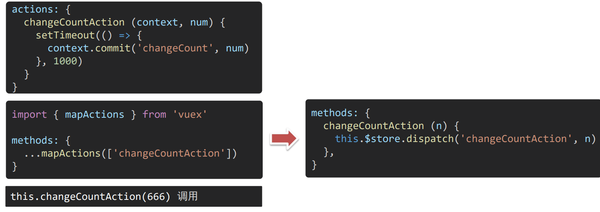

## Vuex

#### 1、本节目标

明确什么是vuex，应用场景，优势。


#### 2、vuex概述

##### 是什么

[vuex](https://v3.vuex.vuejs.org/zh/)是一个vue的`状态管理工具`，状态就是数据。

大白话：vuex 是一个插件，可以帮我们`管理 vue 通用的数据 (多组件共享的数据) `例如：购物车数据 个人信息数据。


##### 场景

① 某个状态在 很多个组件 来使用(个人信息)

② 多个组件 共同维护 一份数据(购物车)


##### 优势

① 共同维护一份数据，`数据集中化管理`

② `响应式变化`

③ 操作简洁(vuex提供了一些辅助函数)


#### 3、构建vuex环境[多组件数据共享]

目标：基于vue-cli创建项目，构建vuex多组件数据共享环境


效果是三个组件共享一份数据：

* 任意一个组件都可以修改数据
* 三个组件的数据是同步的


##### 3.1 创建项目

```bash
vue create vuex-demo
```

##### 3.2 创建三个组件，目录如下

```
|-component
|--Son1.vue
|--Son2.vue
|-App.vue
```

##### 3.3 代码如下

`App.vue`在入口组件中引入Son1和Son2这两个子组件：

```vue
<template>
  <div id="app">
    <div>
      <h1>根组件</h1>
      <input type="text">
    </div>
    <Son1></Son1>
    <Son2></Son2>
  </div>
</template>

<script>
import Son1 from '@/components/Son1.vue'
import Son2 from '@/components/Son2.vue'

export default {
  name: 'App',
  components: {
    Son1,Son2
  },
  data(){
    return {}
  }
}
</script>

<style>
#app{
  width: 600px;
  padding: 20px;
  margin:0 auto;
  border:2px solid #ccc;
}
</style>
```

`Son1.vue`

```vue
<template>
  <div class="son1">
    <h2>Son1 子组件</h2>
    <p>从vuex中获取的值为：</p>
    <button>值+1</button>
  </div>
</template>

<script>
export default {
  name: "SonOne",
  data() {
    return {};
  },
};
</script>

<style scoped>
.son1 {
  width: 400px;
  height: 150px;
  margin: 20px 0 0 0;
  padding: 20px;
  border: 2px solid #ccc;
}
</style>
```

`Son2.vue`

```vue
<template>
  <div class="son2">
    <h2>Son2 子组件</h2>
    <p>从vuex中获取的值为：</p>
    <button>值-1</button>
  </div>
</template>

<script>
export default {
  name: "SonTwo",
  data() {
    return {};
  },
};
</script>

<style>
.son2 {
  width: 400px;
  height: 150px;
  margin-top:20px;
  padding: 20px;
  border: 2px solid #ccc;
}
</style>
```


#### 4、创建一个空仓库

目标：安装`vuex`插件，初始化一个空仓库。

实现步骤：


##### 4.1 安装vuex插件

```bash
yarn add vuex@3
npm i vuex@3
```

##### 4.2 新建vuex模块文件(store/index.js)

创建目录`store`且在其中创建`index.js`文件来引入`vuex`管理数据。


##### 4.3 创建store仓库(编写vuex模块代码)

```js
// 1.导入模块
import Vue from 'vue'
import Vuex from 'vuex'

// 2.安装插件
Vue.use(Vuex)

// 3.创建仓库
const store = new Vuex.Store()

// 4.导出模块
export default store

```

##### 4.4 导入挂载

在`main.js`文件中导入挂载到Vue实例上。

```js
import Vue from 'vue'
import App from './App.vue'
import store from '@/store/index'
Vue.config.productionTip = false

new Vue({
  render: (h) => h(App),
  store,
}).$mount('#app')
```

检验是否挂载成功：

```js
// App.vue
created(){
    console.log(this.$store)
}
```


#### 5、核心概念 - state状态

目标：明确如何给仓库 **提供** 数据，如何 **使用** 仓库的数据。

##### 5.1 提供数据

State提供唯一的公共数据源，所有共享的数据都要统一放到 Store 中的 State 中存储。

在 state对象中可以添加我们要共享的数据。

```js
// 创建仓库
const store = new Vuex.Store({
    // state 状态, 即数据, 类似于vue组件中的data
    // 区别：
    // 1. data 是组件自己的数据
    // 2. state 是所有组件共享的数据
    state: {
        count: 101
    }
})
```


##### 5.2 使用数据

###### 通过store直接访问

```
获取 store：
(1) this.$store
(2) import 导入 store

模板中： {{ $store.state.xxx }}
组件逻辑中： this.$store.state.xxx
JS模块中： store.state.xxx
```


###### 通过辅助函数(简化)

mapState是辅助函数，帮助我们把 store中的数据 `自动` 映射到 组件的计算属性中。


1.需要导入mapState函数

```js
import {mapState} from 'vuex'
```

2.以数组的方式引入state

```js
mapState(['count'])
```

3.通过mapState将state数据映射到组件的计算属性中

```js
// 不推荐，赋值方式给计算属性，会导致我们不能编写自己的计算属性(已经写死了)
computed:mapState(['count'])	

// 推荐，通过展开运算符把所有映射成员添加到计算属性中，方便我们扩展自己的计算属性
computed:{
	...mapState(['count'])
}
```


#### 6、开启严格模式及Vuex的单向数据流

目标：明确 vuex 同样遵循单向数据流，组件中不能直接修改仓库的数据。

##### 6.1 开启严格模式

通过 strict: true 可以开启严格模式。

> vuex中的数据类似于父组件通过props传递给子组件的数据，是单向流动的，子组件是不可以修改其数据的。(只能在vuex的store中自己修改)
>
> 当我们修改state中的数据，vue默认是不会检测这种不符合规范的写法(监测是需要成本的)。如果我们希望在写代码时可以避免这个问题，可以在创建仓库时添加下面这行代码。

```js
const store = new Vuex.Store({
    // 开启严格模式(有利于初学者检查代码，上线时需要移除，监测代码是消耗性能的)
    strict:true,
    ...
})
```


开启严格模式后，我们在子组件`Son1.vue`中给数据 + 1：

```
<button @click="add">值+1</button>
...
methods:{
    add(){
    	// 错误写法
        this.$store.count++
    }
}
```

点击添加后开始报错：


大致意思是：state中的数据只能通过mutations来修改，其他方式都是违法的。


##### 6.2 mutations的使用

目标：掌握 mutations 的操作流程，来修改 state 数据。 (state数据的修改只能通过 mutations )。

mutations是vuex中的一个配置对象，就和data是Vue的配置项类似。

###### 1.定义mutations对象，对象中存放修改state的方法

```js
const store = new Vuex.Store({
    state: {
        count: 0
    },
    // 定义mutations
    mutations: {
        // 第一个参数是当前store的state属性
        addCount (state) {
            state.count += 1
        }
    }
})
```

mutations中的所有的方法都是用于修改state。其中每个方法我们可以理解为一个小的mutation(修改)。

###### 2.组件中提交调用 mutations

```js
this.$store.commit('addCount')
```


##### 6.3 mutations 传参语法

提交 mutation 是可以传递参数的 `this.$store.commit( 'xxx', 参数 )` 

###### 1.提供 mutation 函数(带参数 - 提交载荷 payload)

```js
mutations:{
	...
    addCount(state,n){
        state.count += n
    }
}

```

###### 2.组件中提交调用 mutation

```js
this.$store.commit('addCount', 10)
```

> Tips：提交参数只能一个，如果有多个参数，需要包装成一个对象传递。

```js
this.$store.commit('addCount', {
    count: 10,
    ...
})
```


##### 6.4 辅助函数-mapMutations(简化mutations写法)

目标：掌握辅助函数 mapMutations，映射方法。

mapMutations 和 mapState很像，它是把位于mutations中的方法提取了出来，映射到`组件methods`中。

总共步骤就两步：

* 导入`mapMutations`函数
* 通过数组的方式引入`mutations`中的函数，并映射到methods中。

###### 1.导入mapMutations函数

```js
import {mapMutations} from 'vuex'
```

###### 2.引入函数，并映射到methods中

```js
methods:{
    ...mapMutations(['addCount'])
}
```

调用该函数时，methods中的函数是怎么调用，它就是怎么调用。


#### 7、Actions

目标：明确 actions 的基本语法，处理异步操作。

官方解释：Action类似于mutation，不同在于

* Action 提交的是mutation，而不是直接变更状态(state)。
* Action 中可以包含任意异步操作。

> 说明：mutations 必须是同步的 (便于监测数据变化，记录调试)
>
> 综上所述，我们可以把Action理解为一个异步操作的容器，其中每一个操作都是异步的，我们把每一个异步操作称为action。


##### 7.1 实现方式

###### 1.提供action方法

```js
actions: {
    setAsyncCount (context, num) {
        // 一秒后, 给一个数, 去修改 num
        setTimeout(() => {
            context.commit('changeCount', num)
        }, 1000)
    }
}
```

###### 2.页面中 dispatch 调用

```js
this.$store.dispatch('setAsyncCount', 200)
```


##### 7.2 辅助函数 - mapActions

mapActions 是把位于 `actions中的方法`提取了出来，映射到组件`methods`中。




#### 8、Getters

目标：掌握核心概念 getters 的基本语法 (类似于计算属性) 。

说明：除了state之外，有时我们还需要从state中派生出一些状态，这些状态是依赖state的，此时会用到getters 。

例如：state中定义了list，为 1-10 的数组，组件中，需要显示所有大于5的数据。

```js
state: {
    list: [1, 2, 3, 4, 5, 6, 7, 8, 9, 10]
}
```

##### 8.1 实现方式

###### 1.定义getters

```js
getters: {
    // 注意：
    // (1) getters函数的第一个参数是 state
    // (2) getters函数必须要有返回值
    filterList (state) {
        return state.list.filter(item => item > 5)
    }
}
```

###### 2.访问getters

① 通过store访问getters

```html
<!-- 模板语法 -->
{{ $store.getters.filterList }}
```

② 通过辅助函数 mapGetter 映射

```js
computed: {
    ...mapGetters(['filterList'])
},
```

```html
{{ filterList }}
```


#### 9、Modules(进阶语法)

目标：掌握核心概念 module 模块的创建。

由于使用`单一状态树`，应用的所有状态会集中到一个比较大的对象。当应用变得非常复杂时，store 对象就有可能变得相当臃肿。


为了解决以上问题，Vuex 允许我们将 store 分割成**模块（module）**。每个模块拥有自己的 state、mutation、action、getter、甚至是嵌套子模块——从上至下进行同样方式的分割。


##### 9.1 Modules模块拆分

###### 1.在src/store目录下创建modules文件夹

创建好`modules`目录后，再往里面添加`user.js`和`setting.js`模块。

###### 2.编写user和setting子模块

`user.js`

```js
// user子模块
const state = {
  userInfo: {
    name: 'zs',
    age: 18,
  },
  score: 80,
}
const mutations = {}
const actions = {}
const getters = {}

// 导出模块
export default {
  state,
  mutations,
  actions,
  getters,
}
```

`setting.js`

```js
// setting子模块
const state = {
  theme: 'dark',
  desc: '测试demo',
}
const mutations = {}
const actions = {}
const getters = {}

// 导出模块
export default {
  state,
  mutations,
  actions,
  getters,
}
```

###### 3.挂载模块

想要真正使用我们写好的子模块还需要进行最后一步：挂载到Store上。Store提供了一个配置项`modules`，我们可以将子模块挂载到`modules`。

```js
// 导入模块
import user from '@/store/modules/user'
import setting from '@/store/modules/setting'

const store = new Vuex.Store({
    ...
    // 5. modules 模块
    modules: {
        user,
        setting
    },
})
```

如果想要知道模块是否已经挂载成功，我们可以打开vue devtools 工具查看vuex即可。


##### 9.2 访问模块中的state

尽管已经分模块了，但其实子模块的状态，还是会挂到根级别的 state 中，属性名就是模块名。

如果我们要使用模块中提供的数据，可以通过下面两种方式：

###### 1. 直接通过模块名访问

```js
$store.state.模块名.属性名
```

###### 2.通过 mapState 映射

Store的模块通过mapState映射分为两种：

* 默认根级别的映射
* 子模块的映射


默认根映射我们可以直接通过`mapState(['模块名'])` 映射到计算属性中即可。

子模块的映射则需要`开启命名空间`。

```js
// 映射方式
mapState('模块名',['属性名'])

// 导出时开启命名空间
export default {
    // 开启命名空间，默认值为false
    namespaced: true,
    state,
    mutations,
    actions,
    getters
}
```


##### 9.3 模块中getters的访问

使用模块中 getters 中的数据可以通过下面两种方式：

###### 1. 直接通过模块名访问

```js
$store.getters['模块名/xxx']
```

###### 2. 通过mapGetters 映射

默认根级别的映射 `mapGetters(['xxx'])`

子模块的映射 `mapGetters('模块名',['xxx'])`- 需要开启命名空间

```js
export default {
    namespaced: true,
    state,
    mutations,
    actions,
    getters
}
```


##### 9.4 模块中 mutation 的调用

注意：默认模块中的 mutation 和 actions 会被挂载到全局，需要开启命名空间，才会挂载到子模块。 

###### 1. 直接通过模块名访问

```js
$store.commit('模块名/xxx ', 额外参数)
```

###### 2. 通过 mapMutations 映射

默认根级别的映射 `mapMutations([ 'xxx' ]) `

子模块的映射 `mapMutations('模块名', ['xxx']) `- 需要开启命名空间

```js
export default {
    namespaced: true,
    state,
    mutations,
    actions,
    getters
}
```


##### 9.5 模块中 action 的调用

注意：默认模块中的 mutation 和 actions 会被挂载到全局，需要开启命名空间，才会挂载到子模块。

###### 1. 直接通过模块名访问

```js
$store.dispatch('模块名/xxx ', 额外参数)
```

###### 2. 通过 mapActions 映射

默认根级别的映射 `mapActions([ 'xxx' ]) `。

子模块的映射 `mapActions('模块名', ['xxx'])` - 需要开启命名空间。

```js
export default {
    namespaced: true,
    state,
    mutations,
    actions,
    getters
}
```


#### 10、购物车案例

##### 10.1 购物车案例分析

目标：功能分析，创建项目，构建分析基本结构。

###### 1.功能模块分析

① 请求动态渲染购物车，数据存vuex

② 数字框控件 修改数据

③ 动态计算 总价和总数量

###### 2.脚手架新建项目（注意：勾选vuex）

```bash
vue create vue-cart-demo 	# 自定义创建项目，勾选vuex
```

###### 3.修改源项目中src中的内容


##### 10.2 购物车模块构建

目标：构建 cart 购物车模块。

说明：既然明确数据要存 vuex，建议分模块存，购物车数据存 cart 模块，将来还会有 user 模块，article 模块..

###### 1. 新建`store/modules/cart.js`

```js
export default {
    namespaced: true,
    state () {
        return {
            list: []
        }
    },
}
```

###### 2. 挂载到 vuex仓库上 `store/index.js`

```js
import cart from './modules/cart'

const store = new Vuex.Store({
    modules: {
        cart
    }
})
export default store
```

###### 3. 检验是否挂载成功


##### 10.3 扩展工具：json-server

目标：基于 json-server 工具，准备后端接口服务环镜。

###### 1. 安装工具

安装全局工具` json-server` （全局工具仅需要安装一次）【[官网](https://www.npmjs.com/package/json-server)】

```bash
yarn global add json-server
npm i json-server -g
```

###### 2. 代码根目录新建一个db目录

###### 3. 将资料`index.json`移入db目录

###### 4.启动后端接口服务

进入db目录，执行命令`json-server index.json`

###### 5. 访问接口测试

```
http://localhost:3000/cart	# 端口号视个人设置而变化
```


> 推荐：`json-server --watch index.json (可以实时监听 json 文件的修改`


##### 10.4 购物车功能模块实现

###### 请求获取数据存入vuex，映射渲染


1.安装axios

```bash
yarn add axios
npm i axios
```

2.准备actions 和 mutations 

`cart.js`

```js
mutations: {
    updateList (state, newList) {
        state.list = newList
    }
},
actions: {
    // 请求方式：get
    // 请求地址： http://localhost:3000/cart
    async getList (context) {
        const res = await axios.get('http://localhost:3000/cart')
        context.commit('updateList', res.data)
    }
},
```

`App.vue`

```vue
<template>
    <!-- Header 区域 -->
    <cart-header></cart-header>

    <!-- 商品 Item 项组件 -->
    <cart-item v-for="item in list" :key="item.id" :item="item"></cart-item>

    <!-- Foote 区域 -->
    <cart-footer></cart-footer>
</template>
<script>
import CartHeader from '@/components/cart-header.vue'
import CartFooter from '@/components/cart-footer.vue'
import CartItem from '@/components/cart-item.vue'
import { mapState } from 'vuex'   
    
export default {
  name: 'App',
  created () {
    this.$store.dispatch('cart/getList')
  },
  components: {
    CartHeader,
    CartFooter,
    CartItem
  },
  computed: {
    ...mapState('cart', ['list'])
  }
}
</script>
```

`cart-item.vue`

```vue
<template>
  <div class="goods-container">
    <!-- 左侧图片区域 -->
    <div class="left">
      
    </div>
    <!-- 右侧商品区域 -->
    <div class="right">
      <!-- 标题 -->
      <div class="title">{{item.name}}</div>
      <div class="info">
        <!-- 单价 -->
        <span class="price">￥{{item.price}}</span>
        <div class="btns">
          <!-- 按钮区域 -->
          <button class="btn btn-light">-</button>
          <span class="count">{{item.count}}</span>
          <button class="btn btn-light">+</button>
        </div>
      </div>
    </div>
  </div>
</template>

<script>
export default {
  name: 'CartItem',
  methods: {

  },
  props: {
    item: {
      type: Object,
      required: true
    }
  }
}
</script>
```


###### 修改商品数量


实现效果：点击商品栏的添加和减少按钮，可以实现对商品数量的增减效果。


1. 注册点击事件

```jsx
<!-- 按钮区域 -->
<button class="btn btn-light" @click="subCount" :disabled="item.count <= 0">-</button>
<span class="count">{{item.count}}</span>
<button class="btn btn-light" @click="addCount">+</button>
```

2. 页面中dispatch action

```jsx
subCount () {
    const count = this.item.count - 1
    this.$store.dispatch('cart/changeCountAsync', {
        id: this.item.id,
        newCount: count
    })
},
addCount () {
    const count = this.item.count + 1
    this.$store.dispatch('cart/changeCountAsync', {
        id: this.item.id,
        newCount: count
    })
}
```

3. 提供action函数

```jsx
async changeCountAsync (context, newObj) {
    // 将修改更新同步到后台服务器
    const res = await axios.patch(`http://localhost:3000/cart/${newObj.id}`, {
        count: newObj.newCount
    })
    // 如果后台更新成功，我们则把最新的数据更新给状态state
    if (res.status === 200) {
        context.commit('updateCount', newObj)
    }
}
```

4. 提供mutation处理函数

```jsx
mutations: {
  ...,
  updateCount (state, payload) {
    const goods = state.list.find((item) => item.id === payload.id)
    goods.count = payload.count
  }
},
```


###### 底部getters的统计

1. 提供getters =>`cart.js`

```jsx
getters: {
  total(state) {
    return state.list.reduce((p, c) => p + c.count, 0);
  },
  totalPrice (state) {
    return state.list.reduce((p, c) => p + c.count * c.price, 0);
  },
},
```

2. 动态渲染 => `cart-footer.vue`

```jsx
<template>
  <div class="footer-container">
    <!-- 中间的合计 -->
    <div>
      <span>共 {{total}} 件商品，合计：</span>
      <span class="price">￥{{totalPrice}}</span>
    </div>
    <!-- 右侧结算按钮 -->
    <button class="btn btn-success btn-settle">结算</button>
  </div>
</template>

<script>
import { mapGetters } from 'vuex'
export default {
  name: 'CartFooter',
  computed: {
    ...mapGetters('cart', ['total', 'totalPrice'])
  }
}
</script>
```


