## 智慧商城项目

#### 1、项目的效果

> 接口文档地址：https://apifox.com/apidoc/shared-12ab6b18-adc2-444c-ad11-0e60f5693f66/doc-2221080 

**明确功能模块 → 完整的电商购物流程**


#### 2、做完该项目的收获

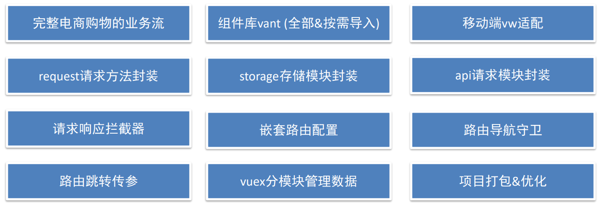


#### 3、构建项目框架

##### 3.1 创建项目

基于 vue-cli脚手架自定义项目架子

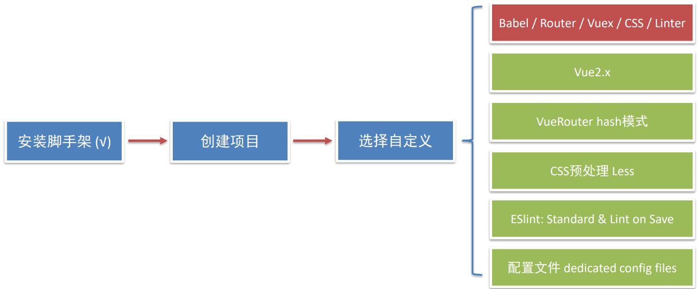

##### 3.2 调整初始化目录

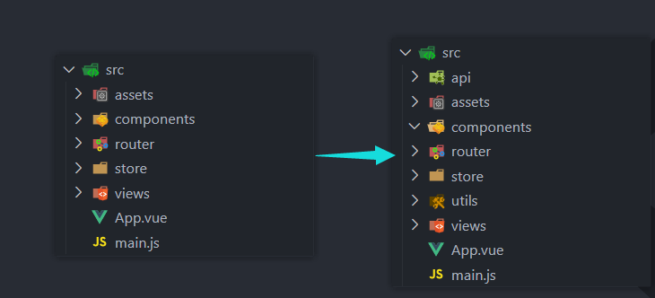

1. 删除多余的文件

2. 修改路由配置 和 App.vue

   新增 两个目录`api`/`utils`

   ① api 接口模块：发送ajax请求的接口模块

   ② utils 工具模块：自己封装的一些工具方法模块


#### 4、vant组件库

##### 4.1 认识vant组件库

什么是组件库？

> 组件库：第三方 封装 好了很多很多的 组件，整合到一起就是一个组件库。

vant组件库官网:https://vant-contrib.gitee.io/vant/v2/#/zh-CN/

版本对应：

| vant版本     | vue版本 |
| ------------ | ------- |
| vant2        | vue2    |
| vant3、vant4 | vue3    |

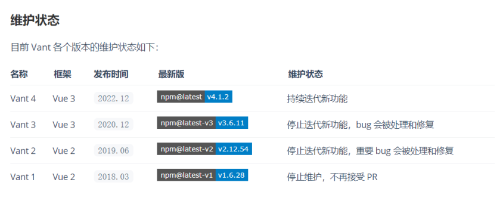


##### 4.2 其他组件库

Vue的组件库并不是唯一的，vant-ui 也仅仅只是组件库的一种。 一般会按照不同平台进行分类：

① PC端：[element-ui(element-plus)](https://element-plus.gitee.io/zh-CN/guide/quickstart.html)  [ant-design-vue](https://2x.antdv.com/docs/vue/introduce-cn)

> 两种组件库都能用于vue2和vue3，版本对应如下

| 组件库版本     | vue 版本                     |
| -------------- | ---------------------------- |
| element-ui     | vue2                         |
| element-plus   | vue3                         |
| ant-design-vue | vue2/vu3(根据文档提示来选择) |

② 移动端：`vant-ui` 	[Mint UI(饿了么)](http://mint-ui.github.io/#!/zh-cn)	[Cube UI(滴滴)](https://didi.github.io/cube-ui/#/zh-CN)


##### 4.3 vant使用

vant组件库的导入有两种方式：

* 全部导入
* 按需导入

###### 1. 全部导入

将整个组件库全部导入到项目中。

* 优点：方便，使用组件不用一一去导入，只需要参照文档使用对应组件即可。

* 缺陷：会导致整个项目打包后的体积变大。

使用步骤：

① 安装 vant-ui

```bash
yarn add vant@latest-v2
npm i vant@latest-v2 
```

② main.js 注册

```js
import Vant from 'vant'
import 'vant/lib/index.css'

// 把vant中所有的组件都导入了
Vue.use(Vant)
```

③ 使用测试

```html
<van-button type="primary">主要按钮</van-button>
<van-button type="info">信息按钮</van-button>
```


###### 2. 按需导入

官方推荐开发者使用按需导入的方式来使用vant组件库。按需导入打包时代码体积小，对于我们程序执行的性能会有一部分的提升。

按需导入有两种方式：

* 自动按需引入(推荐)

  [babel-plugin-import](https://github.com/ant-design/babel-plugin-import) 是一款 babel 插件，它会在编译过程中将 import 的写法自动转换为按需引入的方式。

  ```bash
  # 安装插件
  yarn add babel-plugin-import -D
  npm i babel-plugin-import -D
  ```

  添加配置：

  ```js
  // 在.babelrc 中添加配置 (旧版本的babel)
  // 注意：webpack 1 无需设置 libraryDirectory
  {
    "plugins": [
      ["import", {
        "libraryName": "vant",
        "libraryDirectory": "es",
        "style": true
      }]
    ]
  }
  
  // 对于使用 babel7 的用户，可以在 babel.config.js 中配置(新版本的babel都能使用，脚手架中的babel就是新版本的，所以我们用下面的配置)
  module.exports = {
    plugins: [
      ['import', {
        libraryName: 'vant',
        libraryDirectory: 'es',
        style: true
      }, 'vant']
    ]
  };
  ```

* 手动按需引入组件

  ```js
  import Button from 'vant/lib/button';
  import 'vant/lib/button/style';
  ```

第一种推荐方式会自动转换为第二种手动引入方式。


###### 3. 对于按需导入模块抽离

当我们需要使用组件库中的组件变多，代码就会变多，程序就会变得难以维护。因此我们会把按需导入的代码抽离出来，单独作为一个模块。

如下，我们在`src/utils`目录中创建一个名为`vant-ui.js`的组件模块。

```js
// 此模块为抽离后的组件引入模块
import Vue from 'vue'
import { Button, Rate, Switch } from 'vant'

Vue.use(Button)
Vue.use(Switch)
Vue.use(Rate)
```

最后，在`main.js`中导入：

```js
import '@/utils/vant-ui'
```


#### 5、项目中的vw适配

目标：基于 postcss 插件 实现项目 vw 适配。

[官网配置](https://vant-contrib.gitee.io/vant/v2/#/zh-CN/advanced-usage#liu-lan-qi-gua-pei)


① 安装插件

```bash
yarn add postcss-px-to-viewport@1.1.1 -D
```

② 根目录新建 `postcss.config.js`文件，填入配置

```js
// postcss.config.js
module.exports = {
    plugins: {
        'postcss-px-to-viewport':{
            // 标准屏宽度
            viewportWidth:375
        }
    }
}
```


#### 6、路由设计配置

**目标：分析页面，设计路由，配置一级路由。**

但凡是单个页面，独立显示的都是一级路由。

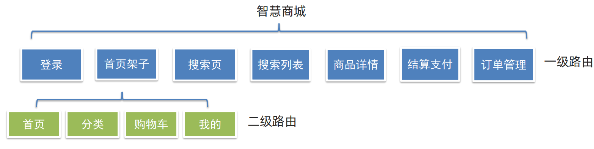

##### 6.1 页面文件创建和一级路由配置

在`views`目录下创建如下结构的目录及其下的文件：

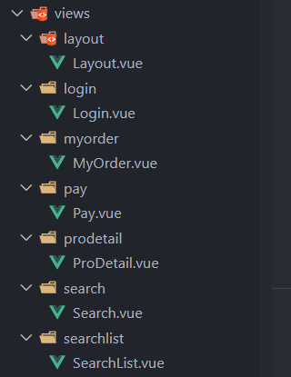

将上述文件配置路由：

```js
// router/index.js
import Vue from 'vue'
import VueRouter from 'vue-router'
import Login from '@/views/login/Login'
import Layout from '@/views/layout/Layout'
import MyOrder from '@/views/myorder/MyOrder'
import Pay from '@/views/pay/Pay'
import ProDetail from '@/views/prodetail/ProDetail'
import Search from '@/views/search/Search'
import SearchList from '@/views/searchlist/SearchList'

Vue.use(VueRouter)

const routes = [
  { path: '/login', component: Login },
  { path: '/', component: Layout },
  { path: '/search', component: Search },
  { path: '/searchlist', component: SearchList },
  // 动态路由传参，确认将来是由那个商品，路由参数中携带id
  { path: '/prodetail/:id', component: ProDetail },
  { path: '/pay', component: Pay },
  { path: '/myorder', component: MyOrder }
]

const router = new VueRouter({
  routes
})

export default router
```


##### 6.2 实现底部导航tabbar

目标：阅读vant组件库文档，实现底部导航 tabbar。

实现tabbar标签页的步骤如下：

① vant-ui.js按需引入

```js
import Vue from 'vue';
import { Tabbar, TabbarItem } from 'vant';

Vue.use(Tabbar);
Vue.use(TabbarItem);
```

② layout.vue 粘贴官网代码测试

```html
<van-tabbar>
    <van-tabbar-item icon="home-o">首页</van-tabbar-item>
    <van-tabbar-item icon="search">分类</van-tabbar-item>
    <van-tabbar-item icon="shopping-cart-o">购物车</van-tabbar-item>
    <van-tabbar-item icon="user-o">我的</van-tabbar-item>
</van-tabbar>
```

③ 修改文字、图标、颜色

```
1.修改文字
2.修改需要配置的图标在 vant文档中的 Icon图标 内容中找到即可
```

修改颜色：`Tabbar`组件通过`active-color`和`inative-color`两个属性来设置颜色。

```html
<van-tabbar active-color="#ee0a24" inactive-color="#000">	
    ...
</van-tabbar>
```

最后的效果如下：

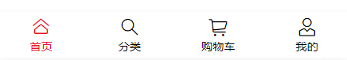


##### 6.2 二级路由配置

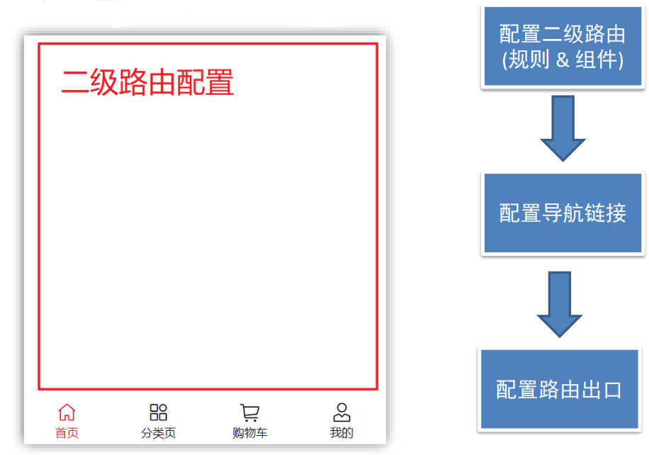

① 创建二级路由的组件及配置路由规则

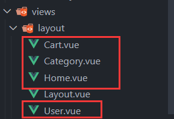

② 根据官方文档提示，配置路由导航链接

```html
<van-tabbar route active-color="#ee0a24" inactive-color="#000">
    <van-tabbar-item  to="/home" icon="home-o">首页</van-tabbar-item>
    <van-tabbar-item  to="/category" icon="search">分类</van-tabbar-item>
    <van-tabbar-item  to="/cart" icon="shopping-cart-o">购物车</van-tabbar-item>
    <van-tabbar-item  to="/user" icon="user-o">我的</van-tabbar-item>
</van-tabbar>
```

> 在vant组件中提供了路由模式，只需要在组件对应父标签中(此处`van-tabbar`)添加`route`属性即可开启路由模式。
>
> 路由模式下会匹配页面路径和标签的 `to` 属性，并自动选中对应的标签。

在这里我们还需要做一个小优化，路由默认是在`/`目录下，我们需要让页面默认页面显示为`/home`首页，所以需要进行一个重定向：

```js
// router/index.js
const routes = [
    { path: '/login', component: Login },
    {
        path: '/',
        component: Layout,
        // 路由重定向
        redirect: '/home',
        children: [
            { path: '/home', component: Home },
            { path: '/category', component: Category },
            { path: '/cart', component: Cart },
            { path: '/user', component: User }
        ]
    },
    ...
]
```

③ 配置路由出口(二级路由显示位置)

```html
<!-- 文件修改位置：@/views/layout/Layout.vue -->
<div class="layout-page">
    <!-- 二级路由出口：二级组件展示的位置 -->
    <router-view></router-view>
    <!-- 导航部分... -->
</div>
```


#### 7、登录页静态布局

页面展示效果：

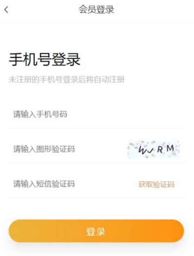

##### 7.1 准备工作

* 新建`styles/common.less`重置默认样式
* main.js 导入 common.less 
* 图片素材拷贝到 assets 目录【备用】


##### 7.2 登录页静态布局编写

* 头部组件说明(NavBar)

  > 使用vant组件库中的NavBar

* 通用样式覆盖

* 其他静态结构编写

```jsx
<template>
  <div class="login">
    <van-nav-bar title="会员登录" left-arrow @click-left="$router.go(-1)" />
    <div class="container">
      <div class="title">
        <h3>手机号登录</h3>
        <p>未注册的手机号登录后将自动注册</p>
      </div>

      <div class="form">
        <div class="form-item">
          <input class="inp" maxlength="11" placeholder="请输入手机号码" type="text">
        </div>
        <div class="form-item">
          <input class="inp" maxlength="5" placeholder="请输入图形验证码" type="text">
          
        </div>
        <div class="form-item">
          <input class="inp" placeholder="请输入短信验证码" type="text">
          <button>获取验证码</button>
        </div>
      </div>

      <div class="login-btn">登录</div>
    </div>
  </div>
</template>

<script>
export default {
  name: 'LoginPage'
}
</script>

<style lang="less" scoped>
.container {
  padding: 49px 29px;

  .title {
    margin-bottom: 20px;
    h3 {
      font-size: 26px;
      font-weight: normal;
    }
    p {
      line-height: 40px;
      font-size: 14px;
      color: #b8b8b8;
    }
  }

  .form-item {
    border-bottom: 1px solid #f3f1f2;
    padding: 8px;
    margin-bottom: 14px;
    display: flex;
    align-items: center;
    .inp {
      display: block;
      border: none;
      outline: none;
      height: 32px;
      font-size: 14px;
      flex: 1;
    }
    img {
      width: 94px;
      height: 31px;
    }
    button {
      height: 31px;
      border: none;
      font-size: 13px;
      color: #cea26a;
      background-color: transparent;
      padding-right: 9px;
    }
  }

  .login-btn {
    width: 100%;
    height: 42px;
    margin-top: 39px;
    background: linear-gradient(90deg,#ecb53c,#ff9211);
    color: #fff;
    border-radius: 39px;
    box-shadow: 0 10px 20px 0 rgba(0,0,0,.1);
    letter-spacing: 2px;
    display: flex;
    justify-content: center;
    align-items: center;
  }
}
</style>
```


##### 7.3 request模块 - axios 封装

目标：将 axios 请求方法，封装到 request 模块。

使用 axios 来请求`后端接口`, 一般都会对 axios 进行 `一些配置` (比如: 配置基础地址，请求响应拦截器等) 所以项目开发中, 都会对 axios 进行基本的`二次封装`, 单独封装到一个 request 模块中, 便于`维护使用`。


```js
// request模块封装 /utils/request.js

import axios from 'axios'

// 创建axios实例，将来创建出来的实例，进行自定义配置
// 好处：不会污染原始的 axios 实例
const instance = axios.create({
  // 设置基地址
  baseURL: 'http://cba.itlike.com/public/index.php?s=/api/',
  timeout: 5000
})

// 自定义配置
// 添加拦截器
// 添加请求拦截器
instance.interceptors.request.use(
  function (config) {
    // 在发送请求之前做些什么
    return config
  },
  function (error) {
    // 对请求错误做些什么
    return Promise.reject(error)
  }
)

// 添加响应拦截器
instance.interceptors.response.use(
  function (response) {
    // 2xx 范围内的状态码都会触发该函数。
    // 对响应数据做点什么(默认axios会多包装一层data,需要响应拦截器中处理一下)
    return response.data
  },
  function (error) {
    // 超出 2xx 范围的状态码都会触发该函数。
    // 对响应错误做点什么
    return Promise.reject(error)
  }
)

// 导出配置好的实例
export default instance
```

`Login.vue`，测试是否能够正常过`request`模块发送请求，并获取到数据

```jsx
<script>
import request from '@/utils/request'

export default {
  name: 'LoginPage',
  async created () {
    const res = await request.get('/captcha/image')
    console.log(res)
  }
}
</script>
```


##### 7.4 图片验证码功能完成

目标：基于上面请求回来的 base64 图片，实现图形验证码功能。

说明：

1.  图形验证码，本质就是一个请求回来的图片
2. 用户将来输入图形验证码，用于强制人机交互，可以`抵御机器自动化攻击`(例如：避免批量请求获取短信)

返回数据如下所示：

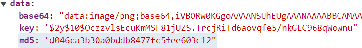

需求：

1.  动态将请求回来的 base64 图片，解析渲染出来。
2.  点击验证码图片盒子，要刷新验证码。

```js
async created () {
  this.getPicCode()
},
data () {
  return {
    picUrl: '',
    picKey: ''
  }
},
methods: {
  // 获取图形验证码
  async getPicCode () {
    const { data: { base64, key } } = await request.get('/captcha/image')
    this.picUrl = base64
    this.picKey = key
  }
}
```

```jsx

```


#### 8、api接口模块 - 封装图片验证码接口

目标：将请求封装成方法，`统一存放到 api 模块`，与页面分离。

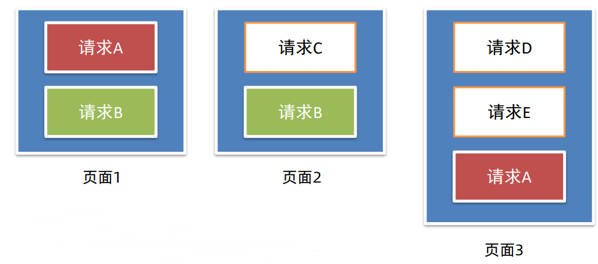

以前的模式：

1. 页面中充斥着请求代码，可阅读性不高。
2. 相同的请求没有复用。
3. 请求没有统一管理。


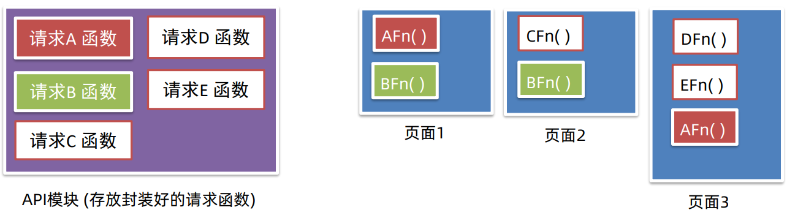

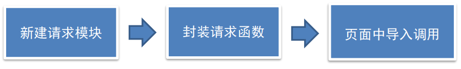

封装api模块的好处：

1. 请求与页面逻辑分离
2. 相同的请求可以直接复用
3. 请求进行了统一管理


封装图片验证码接口请求示例：

① 在`api`目录下创建`login.js`文件(此文件专门用来存放登录相关接口请求)

② 在`login.js`中编写封装代码

```js
// 此模块专门用来存放跟登录相关的接口
import request from '@/utils/request'

// 导出请求验证码图片
export const getCodeImg = () => {
  return request.get('/captcha/image')
}
```

③ 登录页面调用该请求接口

```js
// 按需导入
import { getCodeImg } from '@/api/login'
```

```js
// 获取验证码图片
async getCodeImg () {
    const { data: { key, base64 } } = await getCodeImg()
    this.picUrl = base64
    this.picKey = key
}
```


#### 9、Toast 轻提示

目标：阅读vant文档，掌握toast轻提示。

注册安装：

```js
import { Toast } from 'vant'
Vue.use(Toast)
```

两种使用方式：

① 导入调用(组件内 或 非组件中均可)

```js
import { Toast } from 'vant'
Toast('提示内容')
```

② 通过this直接调用(必须组件内)

```js
this.$toast('提示内容')
```

> 本质：将方法，注册挂载到了Vue原型上`Vue.prototype.$totast = xxx`


#### 10、短信倒计时

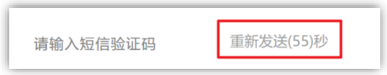

步骤分析：

1. 点击按钮，实现`倒计时`效果
2. 倒计时之前的`校验处理`(手机号、验证码)
3. 封装`短信验证请求接口`，发送请求添加提示

##### 10.1 倒计时效果

1. 准备 data 数据

```jsx
data () {
  return {
    totalSecond: 60, // 总秒数
    second: 60, // 倒计时的秒数
    timer: null // 定时器 id
  }
},
```

2. 给按钮注册点击事件

```jsx
<button @click="getCode">
  {{ second === totalSecond ? '获取验证码' : second + `秒后重新发送`}}
</button>
```

3. 开启倒计时时

```jsx
async getCode () {
  if (!this.timer && this.second === this.totalSecond) {
    // 开启倒计时
    this.timer = setInterval(() => {
      this.second--

      if (this.second < 1) {
        clearInterval(this.timer)
        this.timer = null
        this.second = this.totalSecond
      }
    }, 1000)

    // 发送请求，获取验证码
    this.$toast('发送成功，请注意查收')
  }
}
```

4. 离开页面销毁定时器

```jsx
destroyed () {
  clearInterval(this.timer)
}
```


##### 10.2 校验处理

1. 输入框 v-model 绑定变量

```jsx
data () {
  return {
    mobile: '', // 手机号
    picCode: '' // 图形验证码
  }
},
    
<input v-model="mobile" class="inp" maxlength="11" placeholder="请输入手机号码" type="text">
<input v-model="picCode" class="inp" maxlength="5" placeholder="请输入图形验证码" type="text">
```

2. methods中封装校验方法

```jsx
// 校验输入框内容
validFn () {
  if (!/^1[3-9]\d{9}$/.test(this.mobile)) {
    this.$toast('请输入正确的手机号')
    return false
  }
  if (!/^\w{4}$/.test(this.picCode)) {
    this.$toast('请输入正确的图形验证码')
    return false
  }
  return true
},
```

3. 请求倒计时前进行校验

```jsx
// 获取短信验证码
async getCode () {
  if (!this.validFn()) {
    return
  }
  ...
}
```


##### 10.3 封装短信验证请求接口

1. 封装接口 `api/login.js`

```jsx
// 获取短信验证码
export const getMsgCode = (captchaCode, captchaKey, mobile) => {
  return request.post('/captcha/sendSmsCaptcha', {
    form: {
      captchaCode,
      captchaKey,
      mobile
    }
  })
}
```

2. 调用接口，添加提示

```jsx
// 获取短信验证码
async getCode () {
  if (!this.validFn()) {
    return
  }

  if (!this.timer && this.second === this.totalSecond) {
    // 发送请求，获取验证码
    await getMsgCode(this.picCode, this.picKey, this.mobile)
    this.$toast('发送成功，请注意查收')
    
    // 开启倒计时
    ...
  }
}
```


#### 11、登录功能

步骤分析：

1. 阅读接口文档，封装登录接口 
2. 登录前的校验 (手机号，图形验证码，短信验证码) 
3. 调用方法，发送请求，成功添加提示并跳转

`api/login.js` 提供登录 Api 函数

```jsx
// 验证码登录
export const codeLogin = (mobile, smsCode) => {
  return request.post('/passport/login', {
    form: {
      isParty: false,
      mobile,
      partyData: {},
      smsCode
    }
  })
}
```

`login/index.vue` 登录功能

```jsx
<input class="inp" v-model="msgCode" maxlength="6" placeholder="请输入短信验证码" type="text">
<div class="login-btn" @click="login">登录</div>

data () {
  return {
    msgCode: '',
  }
},
methods: {
  async login () {
    if (!this.validFn()) {
      return
    }
    if (!/^\d{6}$/.test(this.msgCode)) {
      this.$toast('请输入正确的手机验证码')
      return
    }
    await codeLogin(this.mobile, this.msgCode)
    this.$router.push('/')
    this.$toast('登录成功')
  }
}
```


#### 12、响应拦截器统一处理错误提示

目标：通过响应拦截器，统一处理接口的错误提示。

问题：每次请求，都会有可能会错误，就都需要错误提示。

> 说明：响应拦截器是咱们拿到数据的 第一个 数据流转站，可以在里面统一处理错误。

只要不是 200, 就给默认提示，抛出错误。

`utils/request.js`

```jsx
import { Toast } from 'vant'

...

// 添加响应拦截器
request.interceptors.response.use(function (response) {
  const res = response.data
  if (res.status !== 200) {
    Toast(res.message)
    return Promise.reject(res.message)
  }
  // 对响应数据做点什么
  return res
}, function (error) {
  // 对响应错误做点什么
  return Promise.reject(error)
})
```


#### 13、登录权证信息存储

目标：vuex 构建 user 模块存储登录权证 (token & userId)。

> 补充说明： 
>
> 1. token 存入 vuex 的好处，易获取，响应式 
> 2. vuex 需要分模块 => user 模块

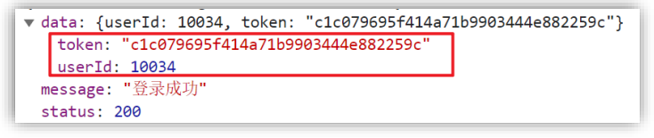

实现步骤如下：

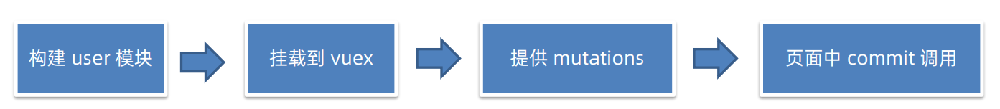

1. 新建 vuex user 模块  store/modules/user.js

```jsx
export default {
  namespaced: true,
  state () {
    return {
      userInfo: {
        token: '',
        userId: ''
      },
    }
  },
  mutations: {},
  actions: {}
}
```

2. 挂载到 vuex 上

```jsx
import Vue from 'vue'
import Vuex from 'vuex'
import user from './modules/user'

Vue.use(Vuex)

export default new Vuex.Store({
  modules: {
    user,
  }
})
```

3. 提供 mutations

```jsx
mutations: {
  setUserInfo (state, obj) {
    state.userInfo = obj
  },
},
```

4. 页面中 commit 调用

```jsx
// 登录按钮（校验 & 提交）
async login () {
  if (!this.validFn()) {
    return
  }
  ...
  const res = await codeLogin(this.mobile, this.msgCode)
  this.$store.commit('user/setUserInfo', res.data)
  this.$router.push('/')
  this.$toast('登录成功')
}
```


#### 14、storage存储模块 - vuex持久化处理

目标：封装 storage 存储模块，利用本地存储，进行 vuex 持久化处理。

问题1：vuex刷新会丢失，怎么办？

```js
// 将token存入本地
localStorage.setItem('hm_shopping_info', JSON.stringify(xxx))
```

问题2：每次存取操作太长，太麻烦？

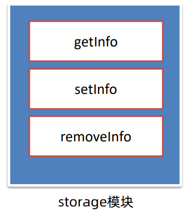

```js
const INFO_KEY = 'hm_shopping_info'
// 获取个人信息
export const getInfo = () => {
const result = localStorage.getItem(INFO_KEY)
return result ? JSON.parse(result) : { token: '', userId: '' }
}
// 设置个人信息
export const setInfo = (info) => {
localStorage.setItem(INFO_KEY, JSON.stringify(info))
}
// 移除个人信息
export const removeInfo = () => {
localStorage.removeItem(INFO_KEY)
}
```


#### 15、添加请求的loading效果

目标：统一在每次请求后台时，添加 loading 效果。

背景：有时候因为网络原因，一次请求的结果可能需要一段时间后才能回来， 此时，需要给用户 `添加 loading 提示`。

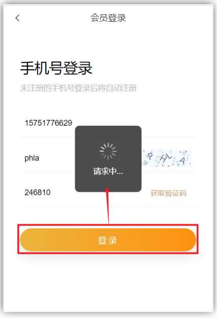

**添加 loading 提示的好处**：

1. 节流处理：防止用户在一次请求还没回来之前，多次进行点击，发送无效请求。
2. 友好提示：告知用户，目前是在加载中，请耐心等待，用户体验会更好。

**实操步骤**： 

1. 请求拦截器中，每次请求，打开 loading 。
2. 响应拦截器中，每次响应，关闭 loading 。

**代码**：

1. 请求时，打开 loading

```jsx
// 添加请求拦截器
instance.interceptors.request.use(function (config) {
  // 在发送请求之前做些什么
  Toast.loading({
    message: '请求中...',
    forbidClick: true,
    loadingType: 'spinner',
    duration: 0
  })
  return config
}, function (error) {
  // 对请求错误做些什么
  return Promise.reject(error)
})
```

2. 响应时，关闭 loading

```jsx
// 添加响应拦截器
request.interceptors.response.use(function (response) {
  const res = response.data
  if (res.status !== 200) {
    Toast(res.message)
    return Promise.reject(res.message)
  } else {
    // 清除 loading 中的效果
    Toast.clear()
  }
  // 对响应数据做点什么
  return res
}, function (error) {
  // 对响应错误做点什么
  return Promise.reject(error)
})
```


#### 16、页面访问拦截

目标：基于全局前置守卫，进行页面访问拦截处理。

说明：智慧商城项目，大部分页面，游客都可以直接访问, 如遇到需要登录才能进行的操作，提示并跳转到登录 但是：对于支付页，订单页等，必须是登录的用户才能访问的，游客不能进入该页面，需要做`拦截处理`。

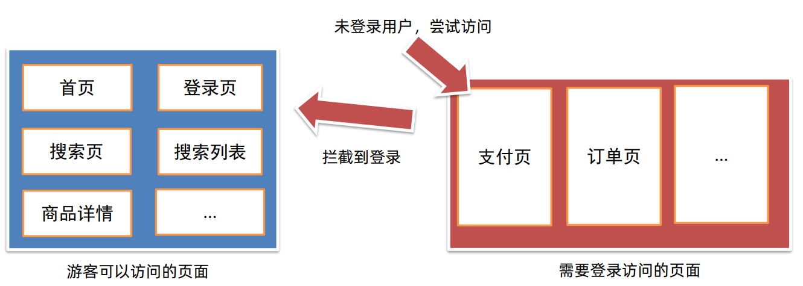


##### 16.1 路由导航守卫 - 全局前置守卫

> [导航守卫 | Vue Router (vuejs.org)](https://v3.router.vuejs.org/zh/guide/advanced/navigation-guards.html#全局前置守卫)

1. 所有的路由一旦被匹配到，都会先经过全局前置守卫 

2. 只有全局前置守卫放行，才会真正解析渲染组件，才能看到页面内容 访问权限页面时，拦截或放行的关键点？

   > → 用户是否有登录权证 token

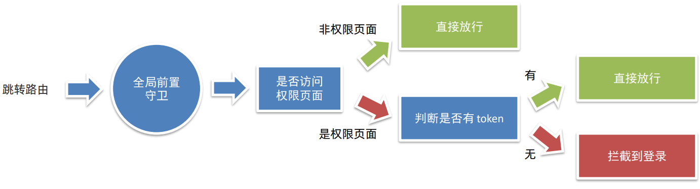

##### 16.2 实现代码

添加导航守卫模板：

```js
// 只有全局前置守卫放行了，才会到达对应页面
router.beforeEach((to, from, next) => {
// 1. to 往哪里去， 到哪去的路由信息对象
// 2. from 从哪里来， 从哪来的路由信息对象
// 3. next() 是否放行
// 如果next()调用，就是放行,放行到to要去的路径
// next(路径) 拦截到某个路径页面 进行拦截，拦截到next里面配置的路径
})
```

`router/index.js`

```js
// 定义一个数组，专门用户存放所有需要权限访问的页面
const authUrls = ['/pay', '/myorder']
router.beforeEach((to, from, next) => {
    if (!authUrls.includes(to.path)) {
        // 非权限页面，直接放行
        next()
        return
    }
    // 是权限页面，需要判断token
    const token = store.getters.getToken
    if (token) {
        next()
    } else {
        next('/login')
    }
})
```


#### 17、静态页面准备与动态渲染

**目标：实现首页静态结构，封装接口，完成首页动态渲染。**


实现流程图：

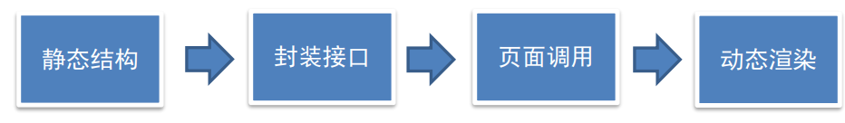

##### 17.1 静态结构

1. 静态结构和样式 `layout/home.vue`

```jsx
<template>
  <div class="home">
    <!-- 导航条 -->
    <van-nav-bar title="智慧商城" fixed />

    <!-- 搜索框 -->
    <van-search
      readonly
      shape="round"
      background="#f1f1f2"
      placeholder="请在此输入搜索关键词"
      @click="$router.push('/search')"
    />

    <!-- 轮播图 -->
    <van-swipe class="my-swipe" :autoplay="3000" indicator-color="white">
      <van-swipe-item>
        
      </van-swipe-item>
      <van-swipe-item>
        
      </van-swipe-item>
      <van-swipe-item>
        
      </van-swipe-item>
    </van-swipe>

    <!-- 导航 -->
    <van-grid column-num="5" icon-size="40">
      <van-grid-item
        v-for="item in 10" :key="item"
        icon="http://cba.itlike.com/public/uploads/10001/20230320/58a7c1f62df4cb1eb47fe83ff0e566e6.png"
        text="新品首发"
        @click="$router.push('/category')"
      />
    </van-grid>

    <!-- 主会场 -->
    <div class="main">
      
    </div>

    <!-- 猜你喜欢 -->
    <div class="guess">
      <p class="guess-title">—— 猜你喜欢 ——</p>

      <div class="goods-list">
        <GoodsItem v-for="item in 10" :key="item"></GoodsItem>
      </div>
    </div>
  </div>
</template>

<script>
import GoodsItem from '@/components/GoodsItem.vue'
export default {
  name: 'HomePage',
  components: {
    GoodsItem
  }
}
</script>

<style lang="less" scoped>
// 主题 padding
.home {
  padding-top: 100px;
  padding-bottom: 50px;
}

// 导航条样式定制
.van-nav-bar {
  z-index: 999;
  background-color: #c21401;
  ::v-deep .van-nav-bar__title {
    color: #fff;
  }
}

// 搜索框样式定制
.van-search {
  position: fixed;
  width: 100%;
  top: 46px;
  z-index: 999;
}

// 分类导航部分
.my-swipe .van-swipe-item {
  height: 185px;
  color: #fff;
  font-size: 20px;
  text-align: center;
  background-color: #39a9ed;
}
.my-swipe .van-swipe-item img {
  width: 100%;
  height: 185px;
}

// 主会场
.main img {
  display: block;
  width: 100%;
}

// 猜你喜欢
.guess .guess-title {
  height: 40px;
  line-height: 40px;
  text-align: center;
}

// 商品样式
.goods-list {
  background-color: #f6f6f6;
}
</style>
```

2. 新建`components/GoodsItem.vue`

```jsx
<template>
  <div class="goods-item" @click="$router.push('/prodetail')">
    <div class="left">
      
    </div>
    <div class="right">
      <p class="tit text-ellipsis-2">
        三星手机 SAMSUNG Galaxy S23 8GB+256GB 超视觉夜拍系统 超清夜景 悠雾紫
        5G手机 游戏拍照旗舰机s23
      </p>
      <p class="count">已售104件</p>
      <p class="price">
        <span class="new">¥3999.00</span>
        <span class="old">¥6699.00</span>
      </p>
    </div>
  </div>
</template>

<script>
export default {}
</script>

<style lang="less" scoped>
.goods-item {
  height: 148px;
  margin-bottom: 6px;
  padding: 10px;
  background-color: #fff;
  display: flex;
  .left {
    width: 127px;
    img {
      display: block;
      width: 100%;
    }
  }
  .right {
    flex: 1;
    font-size: 14px;
    line-height: 1.3;
    padding: 10px;
    display: flex;
    flex-direction: column;
    justify-content: space-evenly;

    .count {
      color: #999;
      font-size: 12px;
    }
    .price {
      color: #999;
      font-size: 16px;
      .new {
        color: #f03c3c;
        margin-right: 10px;
      }
      .old {
        text-decoration: line-through;
        font-size: 12px;
      }
    }
  }
}
</style>
```

3. 组件按需引入

```jsx
import { Search, Swipe, SwipeItem, Grid, GridItem } from 'vant'

Vue.use(GridItem)
Vue.use(Search)
Vue.use(Swipe)
Vue.use(SwipeItem)
Vue.use(Grid)
```


##### 17.2 封装接口&页面调用

1. 新建`api/home.js`

```js
// 此处用来封装跟首页相关的请求
import request from '@/utils/request'

// 获取首页数据
export const getHomeData = () => {
  return request.get('/page/detail', {
    params: {
      pageId: '0'
    }
  })
}
```

2. 在首页组件`views/layout/Home.vue`中调用该函数

```js
import { getHomeData } from '@/api/home'
export default {
  ...
  data () {
    return {
      searchData: {},
      bannerList: [],
      navBarList: []
    }
  },
  async created () {
    const res = await getHomeData()
    console.log(res)
  }
}
```

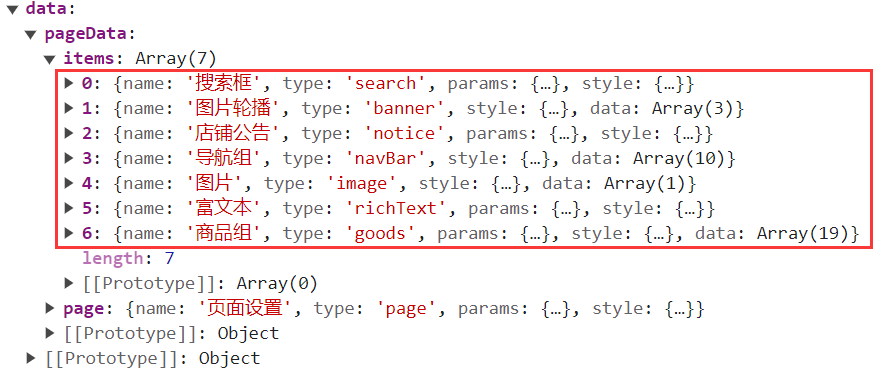


##### 17.3 动态渲染

1. 调用获取数据

```js
import GoodsItem from '@/components/GoodsItem.vue'
import { getHomeData } from '@/api/home'
export default {
  name: 'HomePage',
  components: {
    GoodsItem
  },
  data () {
    return {
      searchData: '',
      bannerList: [],
      navBarList: [],
      proList: []
    }
  },
  async created () {
    const res = await getHomeData()
    const { data: { pageData } } = res
    this.searchData = pageData.items[0].params.placeholder
    this.bannerList = pageData.items[1].data
    this.navBarList = pageData.items[3].data
    this.proList = pageData.items[6].data
  }
}
```

2. 页面渲染

```jsx
<!-- 搜索框 -->
<van-search
    readonly
    shape="round"
    background="#f1f1f2"
    :placeholder="searchData"
    @click="$router.push('/search')"
    />

<!-- 轮播图 -->
<van-swipe class="my-swipe" :autoplay="3000" indicator-color="white">
  <van-swipe-item v-for="item in bannerList" :key="item.imgUrl">
    
  </van-swipe-item>
</van-swipe>

<!-- 导航 -->
<van-grid column-num="5" icon-size="40">
  <van-grid-item
    v-for="item in navList" :key="item.imgUrl"
    :icon="item.imgUrl"
    :text="item.text"
    @click="$router.push('/category')"
  />
</van-grid>
    
<!-- 猜你喜欢 -->
<div class="guess">
  <p class="guess-title">—— 猜你喜欢 ——</p>

  <div class="goods-list">
    <GoodsItem v-for="item in proList"  :item="item" :key="item.goods_id"></GoodsItem>
  </div>
</div>
```

3. 商品组件内，动态渲染

```jsx
<template>
  <div v-if="item.goods_id" class="goods-item" @click="$router.push(`/prodetail/${goods_id}`)">
    <div class="left">
      
    </div>
    <div class="right">
      <p class="tit text-ellipsis-2">
        {{item.goods_name}}
      </p>
      <p class="count">已售{{item.goods_sales}}件</p>
      <p class="price">
        <span class="new">¥{{item.goods_price_min}}</span>
        <span class="old">¥{{item.goods_price_max}}</span>
      </p>
    </div>
  </div>
</template>

<script>
export default {
  name: 'GoodsItem',
  props: {
    item: {
      type: Object,
      default: () => ({})
    }
  }
}
</script>
```


#### 18、搜索 - 历史记录管理

目标：构建搜索页的静态布局，完成历史记录的管理 

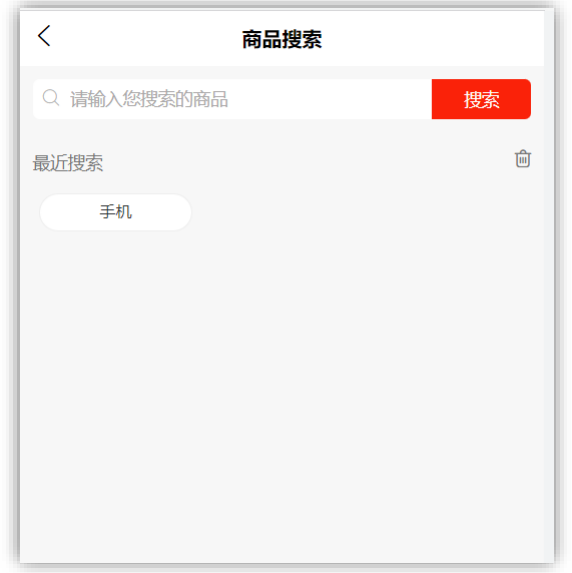

需求： 

1. 搜索历史基本渲染 

2. 点击搜索 (添加历史)  点击 搜索按钮 或 底下历史记录，都能进行搜索 

   > ① 若之前 没有 相同搜索关键字，则直接追加到最前面 
   >
   > ② 若之前 已有 相同搜索关键字，将该原有关键字移除，再追加

3. 清空历史：添加清空图标，可以清空历史记录 

4. 持久化：搜索历史需要持久化，刷新历史不丢失


##### 18.1 静态布局 - 搜索页面

`views/search/Index.vue`

1. 静态结构和代码

```jsx
<template>
  <div class="search">
    <van-nav-bar title="商品搜索" left-arrow @click-left="$router.go(-1)" />

    <van-search show-action placeholder="请输入搜索关键词" clearable>
      <template #action>
        <div>搜索</div>
      </template>
    </van-search>

    <!-- 搜索历史 -->
    <div class="search-history">
      <div class="title">
        <span>最近搜索</span>
        <van-icon name="delete-o" size="16" />
      </div>
      <div class="list">
        <div class="list-item" @click="$router.push('/searchlist')">炒锅</div>
        <div class="list-item" @click="$router.push('/searchlist')">电视</div>
        <div class="list-item" @click="$router.push('/searchlist')">冰箱</div>
        <div class="list-item" @click="$router.push('/searchlist')">手机</div>
      </div>
    </div>
  </div>
</template>

<script>
export default {
  name: 'SearchIndex'
}
</script>

<style lang="less" scoped>
.search {
  .searchBtn {
    background-color: #fa2209;
    color: #fff;
  }
  ::v-deep .van-search__action {
    background-color: #c21401;
    color: #fff;
    padding: 0 20px;
    border-radius: 0 5px 5px 0;
    margin-right: 10px;
  }
  ::v-deep .van-icon-arrow-left {
    color: #333;
  }
  .title {
    height: 40px;
    line-height: 40px;
    font-size: 14px;
    display: flex;
    justify-content: space-between;
    align-items: center;
    padding: 0 15px;
  }
  .list {
    display: flex;
    justify-content: flex-start;
    flex-wrap: wrap;
    padding: 0 10px;
    gap: 5%;
  }
  .list-item {
    width: 30%;
    text-align: center;
    padding: 7px;
    line-height: 15px;
    border-radius: 50px;
    background: #fff;
    font-size: 13px;
    border: 1px solid #efefef;
    overflow: hidden;
    white-space: nowrap;
    text-overflow: ellipsis;
    margin-bottom: 10px;
  }
}
</style>
```

2. 组件按需导入

```jsx
import { Icon } from 'vant'
Vue.use(Icon)
```


##### 18.2 功能实现

1. data 中提供数据，和搜索框双向绑定 (实时获取用户内容)

```jsx
data () {
  return {
    search: ''
  }
}

<van-search v-model="search" show-action placeholder="请输入搜索关键词" clearable>
  <template #action>
    <div>搜索</div>
  </template>
</van-search>
```

2. 准备假数据，进行基本的历史纪录渲染

```jsx
data () {
  return {
    ...
    history: ['手机', '空调', '白酒', '电视']
  }
},
    
<div class="search-history" v-if="history.length > 0">
  ...
  <div class="list">
    <div v-for="item in history" :key="item" @click="goSearch(item)" class="list-item">
      {{ item }}
    </div>
  </div>
</div>
```

3. 点击搜索，或者下面搜索历史按钮，都要进行搜索历史记录更新 (去重，新搜索的内容置顶)

```jsx
<div @click="goSearch(search)">搜索</div>

<div class="list">
  <div v-for="item in history" :key="item" @click="goSearch(item)" class="list-item">
    {{ item }}
  </div>
</div>

goSearch (key) {
  const index = this.history.indexOf(key)
  if (index !== -1) {
    this.history.splice(index, 1)
  }
  this.history.unshift(key)
  this.$router.push(`/searchlist?search=${key}`)
}
```

4. 清空历史

```jsx
<van-icon @click="clear" name="delete-o" size="16" />

clear () {
  this.history = []
}
```

5. 持久化到本地 - 封装方法

```jsx
const HISTORY_KEY = 'shoping_searchInfo'

// 获取搜索历史
export const getHistoryList = () => {
  const result = localStorage.getItem(HISTORY_KEY)
  return result ? JSON.parse(result) : []
}

// 设置搜索历史
export const setHistoryList = (arr) => {
  localStorage.setItem(HISTORY_KEY, JSON.stringify(arr))
}
```

2. 页面中调用 - 实现持久化

```jsx
data () {
  return {
    search: '',
    history: getHistoryList()
  }
},
methods: {
  goSearch (key) {
    ...
    setHistoryList(this.history)
    this.$router.push(`/searchlist?search=${key}`)
  },
  clear () {
    this.history = []
    setHistoryList([])
    this.$toast.success('清空历史成功')
  }
}
```


#### 19、搜索结果-商品列表静态布局

效果：


实现步骤：

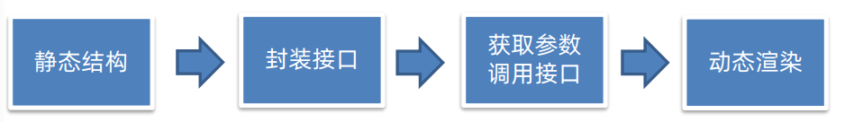


##### 19.1 从搜索页面查询跳转到商品列表

1. 搜索结果-商品列表的静态布局 `views/search/SearchList.vue`

```jsx
<template>
  <div class="search">
    <van-nav-bar fixed title="商品列表" left-arrow @click-left="$router.go(-1)" />

    <van-search
      readonly
      shape="round"
      background="#ffffff"
      value="手机"
      show-action
      @click="$router.push('/search')"
    >
      <template #action>
        <van-icon class="tool" name="apps-o" />
      </template>
    </van-search>

    <!-- 排序选项按钮 -->
    <div class="sort-btns">
      <div class="sort-item">综合</div>
      <div class="sort-item">销量</div>
      <div class="sort-item">价格 </div>
    </div>

    <div class="goods-list">
      <GoodsItem v-for="item in 10" :key="item"></GoodsItem>
    </div>
  </div>
</template>

<script>
import GoodsItem from '@/components/GoodsItem.vue'
export default {
  name: 'SearchIndex',
  components: {
    GoodsItem
  }
}
</script>

<style lang="less" scoped>
.search {
  padding-top: 46px;
  ::v-deep .van-icon-arrow-left {
    color: #333;
  }
  .tool {
    font-size: 24px;
    height: 40px;
    line-height: 40px;
  }

  .sort-btns {
    display: flex;
    height: 36px;
    line-height: 36px;
    .sort-item {
      text-align: center;
      flex: 1;
      font-size: 16px;
    }
  }
}

// 商品样式
.goods-list {
  background-color: #f6f6f6;
}
</style>
```

2. 封装查询商品的接口 - 创建`api/product.js`

```js
import request from '@/utils/request'

export const getProList = (obj) => {
  const { categoryId, goodsName, page } = obj
  return request.get('/goods/list', {
    params: {
      categoryId,
      goodsName,
      page
    }
  })
}
```

3. 调用接口获取`参数查询`得到的商品列表数据 `views/search/SearchList.vue`

```js
import GoodsItem from '@/components/GoodsItem.vue'
import { getProList } from '@/api/product'
export default {
    name: 'SearchIndex',
    data () {
        return {
            page: 1,
            proList: []
        }
    },
    computed: {
        querySearch () {
            return this.$route.query.search
        }
    },
    components: {
        GoodsItem
    },
    async created () {
        const params = {
            goodsName: this.querySearch,
            page: this.page
        }
        const res = await getProList(params)
        const { data: { list: { data } } } = res
        this.proList = data
    }
}
```

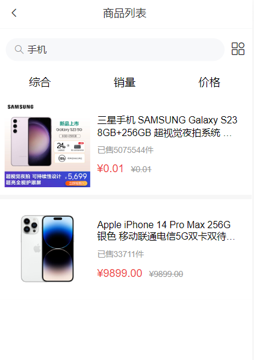


##### 19.2 分类页面跳转到商品列表

说明：通过单击分类列表中的一个分类我们可以跳转到这类归属的商品列表页面。(会使用到**categoryId**)

1. 分类页面的静态布局`views/layout/Category.vue`

```jsx
<template>
  <div class="category">
    <!-- 分类 -->
    <van-nav-bar title="全部分类" fixed />

    <!-- 搜索框 -->
    <van-search
      readonly
      shape="round"
      background="#f1f1f2"
      placeholder="请输入搜索关键词"
      @click="$router.push('/search')"
    />

    <!-- 分类列表 -->
    <div class="list-box">
      <div class="left">
        <ul>
          <li v-for="(item, index) in list" :key="item.category_id">
            <a :class="{ active: index === activeIndex }" @click="activeIndex = index" href="javascript:;">{{ item.name }}</a>
          </li>
        </ul>
      </div>
      <div class="right">
        <div @click="$router.push(`/searchlist?categoryId=${item.category_id}`)" v-for="item in list[activeIndex]?.children" :key="item.category_id" class="cate-goods">
          
          <p>{{ item.name }}</p>
        </div>
      </div>
    </div>
  </div>
</template>

<style lang="less" scoped>
// 主题 padding
.category {
  padding-top: 100px;
  padding-bottom: 50px;
  height: 100vh;
  .list-box {
    height: 100%;
    display: flex;
    .left {
      width: 85px;
      height: 100%;
      background-color: #f3f3f3;
      overflow: auto;
      a {
        display: block;
        height: 45px;
        line-height: 45px;
        text-align: center;
        color: #444444;
        font-size: 12px;
        &.active {
          color: #fb442f;
          background-color: #fff;
        }
      }
    }
    .right {
      flex: 1;
      height: 100%;
      background-color: #ffffff;
      display: flex;
      flex-wrap: wrap;
      justify-content: flex-start;
      align-content: flex-start;
      padding: 10px 0;
      overflow: auto;

      .cate-goods {
        width: 33.3%;
        margin-bottom: 10px;
        img {
          width: 70px;
          height: 70px;
          display: block;
          margin: 5px auto;
        }
        p {
          text-align: center;
          font-size: 12px;
        }
      }
    }
  }
}

// 导航条样式定制
.van-nav-bar {
  z-index: 999;
}

// 搜索框样式定制
.van-search {
  position: fixed;
  width: 100%;
  top: 46px;
  z-index: 999;
}
</style>
```

2. 封装获取分类数据的接口`api/category.js`

```js
import request from '@/utils/request'

export const getCategoryData = () => {
  return request.get('/category/list')
}
```

3. 调用分类数据的接口，动态渲染

```jsx
<script>
import { getCategoryData } from '@/api/category'
export default {
  name: 'CategoryPage',
  created () {
    this.getCategoryList()
  },
  data () {
    return {
      list: [],
      activeIndex: 0
    }
  },
  methods: {
    async getCategoryList () {
      const { data: { list } } = await getCategoryData()
      this.list = list
    }
  }
}
</script>
```

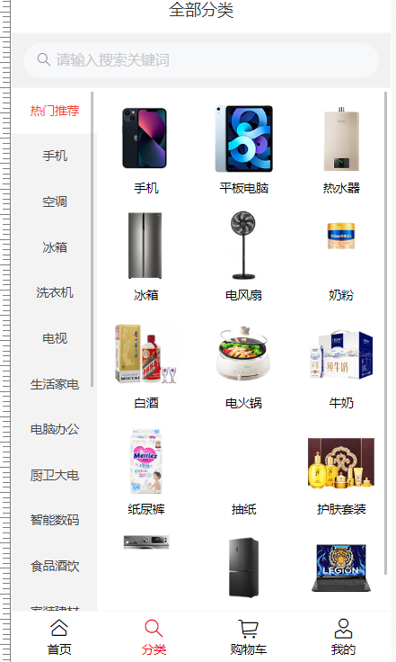

5. 修改`views/search/SearchList.vue`中的查询参数

```js
async created () {
    const params = {
        // 因为这里是通过分类获取的商品数据，所以需要用到categoryId
        categoryId: this.$route.query.categoryId,
        goodsName: this.querySearch,
        page: this.page
    }
    const res = await getProList(params)
    const { data: { list: { data } } } = res
    this.proList = data
}
```


#### 20、商品详细页 - 静态布局&渲染

目标：实现商品详情静态结构，封装接口，完成商品详情页渲染。

效果：

 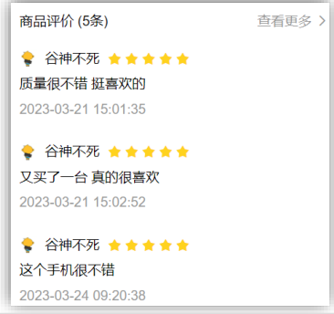

实现步骤：

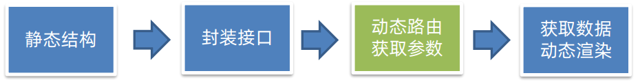

##### 20.1 商品详细页-布局

1. 商品详细页布局`/views/prodetail/ProDetail.vue`

```jsx
<template>
  <div class="prodetail">
    <van-nav-bar fixed title="商品详情页" left-arrow @click-left="$router.go(-1)" />

    <van-swipe :autoplay="3000" @change="onChange">
      <van-swipe-item v-for="(image, index) in images" :key="index">
        
      </van-swipe-item>

      <template #indicator>
        <div class="custom-indicator">{{ current + 1 }} / {{ images.length }}</div>
      </template>
    </van-swipe>

    <!-- 商品说明 -->
    <div class="info">
      <div class="title">
        <div class="price">
          <span class="now">￥0.01</span>
          <span class="oldprice">￥6699.00</span>
        </div>
        <div class="sellcount">已售1001件</div>
      </div>
      <div class="msg text-ellipsis-2">
        三星手机 SAMSUNG Galaxy S23 8GB+256GB 超视觉夜拍系统 超清夜景 悠雾紫 5G手机 游戏拍照旗舰机s23
      </div>

      <div class="service">
        <div class="left-words">
          <span><van-icon name="passed" />七天无理由退货</span>
          <span><van-icon name="passed" />48小时发货</span>
        </div>
        <div class="right-icon">
          <van-icon name="arrow" />
        </div>
      </div>
    </div>

    <!-- 商品评价 -->
    <div class="comment">
      <div class="comment-title">
        <div class="left">商品评价 (5条)</div>
        <div class="right">查看更多 <van-icon name="arrow" /> </div>
      </div>
      <div class="comment-list">
        <div class="comment-item" v-for="item in 3" :key="item">
          <div class="top">
            
            <div class="name">神雕大侠</div>
            <van-rate :size="16" :value="5" color="#ffd21e" void-icon="star" void-color="#eee"/>
          </div>
          <div class="content">
            质量很不错 挺喜欢的
          </div>
          <div class="time">
            2023-03-21 15:01:35
          </div>
        </div>
      </div>
    </div>

    <!-- 商品描述 -->
    <div class="desc">
      
      
      
      
    </div>

    <!-- 底部 -->
    <div class="footer">
      <div class="icon-home">
        <van-icon name="wap-home-o" />
        <span>首页</span>
      </div>
      <div class="icon-cart">
        <van-icon name="shopping-cart-o" />
        <span>购物车</span>
      </div>
      <div class="btn-add">加入购物车</div>
      <div class="btn-buy">立刻购买</div>
    </div>
  </div>
</template>

<script>
export default {
  name: 'ProDetail',
  data () {
    return {
      images: [
        'https://img01.yzcdn.cn/vant/apple-1.jpg',
        'https://img01.yzcdn.cn/vant/apple-2.jpg'
      ],
      current: 0
    }
  },
  methods: {
    onChange (index) {
      this.current = index
    }
  }
}
</script>
          
<style lang="less" scoped>
.prodetail {
  padding-top: 46px;
  ::v-deep .van-icon-arrow-left {
    color: #333;
  }
  img {
    display: block;
    width: 100%;
  }
  .custom-indicator {
    position: absolute;
    right: 10px;
    bottom: 10px;
    padding: 5px 10px;
    font-size: 12px;
    background: rgba(0, 0, 0, 0.1);
    border-radius: 15px;
  }
  .desc {
    width: 100%;
    overflow: scroll;
    ::v-deep img {
      display: block;
      width: 100%!important;
    }
  }
  .info {
    padding: 10px;
  }
  .title {
    display: flex;
    justify-content: space-between;
    .now {
      color: #fa2209;
      font-size: 20px;
    }
    .oldprice {
      color: #959595;
      font-size: 16px;
      text-decoration: line-through;
      margin-left: 5px;
    }
    .sellcount {
      color: #959595;
      font-size: 16px;
      position: relative;
      top: 4px;
    }
  }
  .msg {
    font-size: 16px;
    line-height: 24px;
    margin-top: 5px;
  }
  .service {
    display: flex;
    justify-content: space-between;
    line-height: 40px;
    margin-top: 10px;
    font-size: 16px;
    background-color: #fafafa;
    .left-words {
      span {
        margin-right: 10px;
      }
      .van-icon {
        margin-right: 4px;
        color: #fa2209;
      }
    }
  }

  .comment {
    padding: 10px;
  }
  .comment-title {
    display: flex;
    justify-content: space-between;
    .right {
      color: #959595;
    }
  }

  .comment-item {
    font-size: 16px;
    line-height: 30px;
    .top {
      height: 30px;
      display: flex;
      align-items: center;
      margin-top: 20px;
      img {
        width: 20px;
        height: 20px;
      }
      .name {
        margin: 0 10px;
      }
    }
    .time {
      color: #999;
    }
  }

  .footer {
    position: fixed;
    left: 0;
    bottom: 0;
    width: 100%;
    height: 55px;
    background-color: #fff;
    border-top: 1px solid #ccc;
    display: flex;
    justify-content: space-evenly;
    align-items: center;
    .icon-home, .icon-cart {
      display: flex;
      flex-direction: column;
      align-items: center;
      justify-content: center;
      font-size: 14px;
      .van-icon {
        font-size: 24px;
      }
    }
    .btn-add,
    .btn-buy {
      height: 36px;
      line-height: 36px;
      width: 120px;
      border-radius: 18px;
      background-color: #ffa900;
      text-align: center;
      color: #fff;
      font-size: 14px;
    }
    .btn-buy {
      background-color: #fe5630;
    }
  }
}
    
.tips {
  padding: 10px;
}
</style>
```


##### 20.2 功能实现

1. 封装商品详情的接口`api/product.js`

```js
import request from '@/utils/request'

// 根据查询字符或分类id查询商品列表
...
// 获取商品详情
export const getGoodsDetail = (id) => {
  return request.get('/goods/detail', {
    goodsId: id
  })
}
```

2. 调用商品详情接口

```jsx
import { getGoodsDetail } from '@/api/product'
export default {
  name: 'ProDetail',
  data () {
    return {
      images: [],
      current: 0,
      detail: {}
    }
  },
  created () {
    this.getProDetail()
  },
  computed: {
    id () {
      return this.$route.params.id
    }
  },
  methods: {
    onChange (index) {
      this.current = index
    },
    async getProDetail () {
      const res = await getGoodsDetail(this.id)
      const {
        data: { detail }
      } = res
      this.detail = detail
      this.images = detail.goods_images
    }
  }
}
```

3. 动态渲染页面 

```jsx
<div class="prodetail" v-if="detail.goods_name">

<van-swipe :autoplay="3000" @change="onChange">
  <van-swipe-item v-for="(image, index) in images" :key="index">
    
  </van-swipe-item>

  <template #indicator>
    <div class="custom-indicator">{{ current + 1 }} / {{ images.length }}</div>
  </template>
</van-swipe>

<!-- 商品说明 -->
<div class="info">
  <div class="title">
    <div class="price">
      <span class="now">￥{{ detail.goods_price_min }}</span>
      <span class="oldprice">￥{{ detail.goods_price_max }}</span>
    </div>
    <div class="sellcount">已售{{ detail.goods_sales }}件</div>
  </div>
  <div class="msg text-ellipsis-2">
    {{ detail.goods_name }}
  </div>

  <div class="service">
    <div class="left-words">
      <span><van-icon name="passed" />七天无理由退货</span>
      <span><van-icon name="passed" />48小时发货</span>
    </div>
    <div class="right-icon">
      <van-icon name="arrow" />
    </div>
  </div>
</div>

<!-- 商品描述 -->
<div class="tips">商品描述</div>
<div class="desc" v-html="detail.content"></div>
```

4. 封装评论接口`api/product.js`

```js
import request from '@/utils/request'

// 根据查询字符或分类id查询商品列表
...
// 获取商品详情
...
// 获取商品评论
export const getComments = (obj) => {
  const { goodsId, limit } = obj
  return request.get('/comment/listRows', {
    params: {
      goodsId,
      limit
    }
  })
}
```

5. 调用评论接口，动态渲染到页面

```js
...
import defaultImg from '@/assets/default-avatar.png'
export default {
    ...
    data () {
        return {
			...
            total: 0,
            commentList: [],
            defaultImg
        }
    },
    created () {
        this.getProDetail()
        this.getProComment()
    },
    computed: {
		...
    },
    methods: {
		...
        async getProComment () {
            const res = await getComments({ goodsId: this.id, limit: 5 })
            const { data: { list, total } } = res
            this.commentList = list
            this.total = total
        }
    }
```

```jsx
 <!-- 商品评价 -->
<div class="comment">
    <div class="comment-title">
        <div class="left">商品评价 ({{total}}条)</div>
        <div class="right">查看更多 <van-icon name="arrow" /></div>
    </div>
    <div class="comment-list">
        <div class="comment-item" v-for="item in commentList" :key="item.comment_id">
            <div class="top">
                
                <div class="name">{{item.user.nick_name}}</div>
                <van-rate
                    :size="16"
                    :value="5"
                    color="#ffd21e"
                    void-icon="star"
                    void-color="#eee"
                    />
            </div>
            <div class="content">{{item.content}}</div>
            <div class="time">{{item.create_time}}</div>
        </div>
    </div>
</div>
```


#### 21、加入购物车 - 弹层实现

目标：点击加入购物车，唤起弹层效果。


实现步骤：

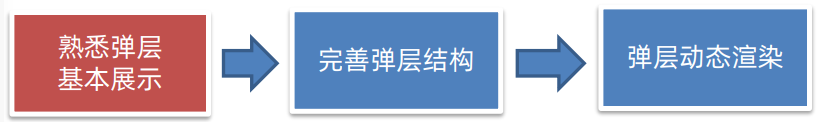


##### 21.1 基本弹层实现

1. 按需导入 van-action-sheet

```jsx
import { ActionSheet } from 'vant'
Vue.use(ActionSheet)
```

2. 准备 van-action-sheet 基本结构

```jsx
<van-action-sheet v-model="showPannel" :title="mode === 'cart' ? '加入购物车' : '立刻购买'">
	111
</van-action-sheet>
    
data () {
  return {
    ...
    mode: 'cart'
    showPannel: false
  }
},
```

3. 注册点击事件，点击时唤起弹窗

```jsx
<div class="btn-add" @click="addFn">加入购物车</div>
<div class="btn-buy" @click="buyFn">立刻购买</div>

addFn () {
  this.mode = 'cart'
  this.showPannel = true
},
buyFn () {
  this.mode = 'buyNow'
  this.showPannel = true
}
```

4. 完善结构

```jsx
<van-action-sheet v-model="showPannel" :title="mode === 'cart' ? '加入购物车' : '立刻购买'">
  <div class="product">
    <div class="product-title">
      <div class="left">
        
      </div>
      <div class="right">
        <div class="price">
          <span>¥</span>
          <span class="nowprice">9.99</span>
        </div>
        <div class="count">
          <span>库存</span>
          <span>55</span>
        </div>
      </div>
    </div>
    <div class="num-box">
      <span>数量</span>
      数字框占位
    </div>
    <div class="showbtn" v-if="true">
      <div class="btn" v-if="true">加入购物车</div>
      <div class="btn now" v-else>立刻购买</div>
    </div>
    <div class="btn-none" v-else>该商品已抢完</div>
  </div>
</van-action-sheet>
```

```css
.product {
  .product-title {
    display: flex;
    .left {
      img {
        width: 90px;
        height: 90px;
      }
      margin: 10px;
    }
    .right {
      flex: 1;
      padding: 10px;
      .price {
        font-size: 14px;
        color: #fe560a;
        .nowprice {
          font-size: 24px;
          margin: 0 5px;
        }
      }
    }
  }

  .num-box {
    display: flex;
    justify-content: space-between;
    padding: 10px;
    align-items: center;
  }

  .btn, .btn-none {
    height: 40px;
    line-height: 40px;
    margin: 20px;
    border-radius: 20px;
    text-align: center;
    color: rgb(255, 255, 255);
    background-color: rgb(255, 148, 2);
  }
  .btn.now {
    background-color: #fe5630;
  }
  .btn-none {
    background-color: #cccccc;
  }
}
```

5. 动态渲染

```jsx
<van-action-sheet v-model="showPannel" :title="mode === 'cart' ? '加入购物车' : '立刻购买'">
  <div class="product">
    <div class="product-title">
      <div class="left">
        
      </div>
      <div class="right">
        <div class="price">
          <span>¥</span>
          <span class="nowprice">{{ detail.goods_price_min }}</span>
        </div>
        <div class="count">
          <span>库存</span>
          <span>{{ detail.stock_total }}</span>
        </div>
      </div>
    </div>
    <div class="num-box">
      <span>数量</span>
      数字框组件
    </div>
    <div class="showbtn" v-if="detail.stock_total > 0">
      <div class="btn" v-if="mode === 'cart'">加入购物车</div>
      <div class="btn now" v-if="mode === 'buyNow'">立刻购买</div>
    </div>
    <div class="btn-none" v-else>该商品已抢完</div>
  </div>
</van-action-sheet>
```


##### 21.2 封装弹层中的数据框组件

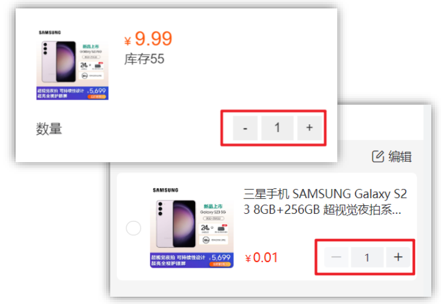

分析：组件名 CountBox 

1. 静态结构，左中右三部分 
2. 数字框的数字，应该是外部传递进来的 (父传子) 
3. 点击 + - 号，可以修改数字 (子传父) 
4. 使用 v-model 实现封装 (:value 和 @input 的简写) 
5. 数字不能减到小于 1 
6. 可以直接输入内容，输入完成判断是否合法

代码实现：

1. 封装组件 `components/CountBox.vue`

```jsx
<template>
  <div class="count-box">
    <button @click="handleSub" class="minus">-</button>
    <input :value="value" @change="handleChange" class="inp" type="text">
    <button @click="handleAdd" class="add">+</button>
  </div>
</template>

    
<script>
export default {
  props: {
    value: {
      type: Number,
      default: 1
    }
  },
  methods: {
    handleSub () {
      if (this.value <= 1) {
        return
      }
      this.$emit('input', this.value - 1)
    },
    handleAdd () {
      this.$emit('input', this.value + 1)
    },
    handleChange (e) {
      // console.log(e.target.value)
      const num = +e.target.value // 转数字处理 (1) 数字 (2) NaN

      // 输入了不合法的文本 或 输入了负值，回退成原来的 value 值
      if (isNaN(num) || num < 1) {
        e.target.value = this.value
        return
      }

      this.$emit('input', num)
    }
  }
}
</script>
    

<style lang="less" scoped>
.count-box {
  width: 110px;
  display: flex;
  .add, .minus {
    width: 30px;
    height: 30px;
    outline: none;
    border: none;
    background-color: #efefef;
  }
  .inp {
    width: 40px;
    height: 30px;
    outline: none;
    border: none;
    margin: 0 5px;
    background-color: #efefef;
    text-align: center;
  }
}
</style>

```

2. 使用组件

```jsx
import CountBox from '@/components/CountBox.vue'

export default {
  name: 'ProDetail',
  components: {
    CountBox
  },
  data () {
    return {
      addCount: 1
      ...
    }
  },
}

<div class="num-box">
  <span>数量</span>
  <CountBox v-model="addCount"></CountBox>
</div>
```


##### 21.3 判断 token 添加登录提示

目标：给未登录的用户，添加登录提示 

说明：加入购物车，是一个 登录后的用户 才能进行的操作 所以需要进行鉴权判断，判断用户 token 是否存在 

1. 若存在：继续加入购物车操作 
2. 不存在：提示 用户未登录，引导到登录页，登录完回跳

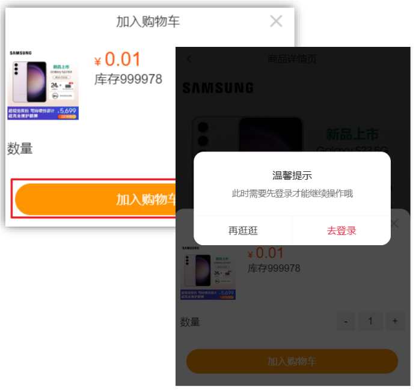

1. 按需注册 dialog 组件

```jsx
import { Dialog } from 'vant'
Vue.use(Dialog)
```

2. 按钮注册点击事件

```jsx
<div class="btn" v-if="mode === 'cart'" @click="addCart">加入购物车</div>
```

3. 添加 token 鉴权判断，跳转携带回跳地址

```jsx
async addCart () {
  // 判断用户是否有登录
  if (!this.$store.getters.token) {
    this.$dialog.confirm({
      title: '温馨提示',
      message: '此时需要先登录才能继续操作哦',
      confirmButtonText: '去登录',
      cancelButtonText: '再逛逛'
    })
      .then(() => {
        this.$router.replace({
          path: '/login',
          query: {
            backUrl: this.$route.fullPath
          }
        })
      })
      .catch(() => {})
    return
  }
  console.log('进行加入购物车操作')
}
```

4. 登录后，若有回跳地址，则回跳页面

```jsx
// 判断有无回跳地址
const url = this.$route.query.backUrl || '/'
this.$router.replace(url)
```


##### 21.4 加入购物车 发送请求 - 封装接口

目标：封装接口，进行加入购物车的请求。

1. `api/cart.js` 中封装接口 
2. 页面中调用接口 
3. 遇到问题：接口需要传递 token 
4. 解决问题：请求拦截器统一携带 token 
5. 小图标定制

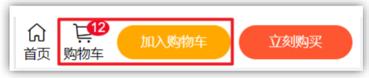

1. 封装接口 `api/cart.js`

```jsx
// 加入购物车
export const addCart = (goodsId, goodsNum, goodsSkuId) => {
  return request.post('/cart/add', {
    goodsId,
    goodsNum,
    goodsSkuId
  })
}
```

2. 页面中调用请求

```jsx
data () {
  return {
      cartTotal: 0
  }  
},

async addCart () {
  ...
  const { data } = await addCart(this.goodsId, this.addCount, this.detail.skuList[0].goods_sku_id)
  this.cartTotal = data.cartTotal
  this.$toast('加入购物车成功')
  this.showPannel = false
},
```

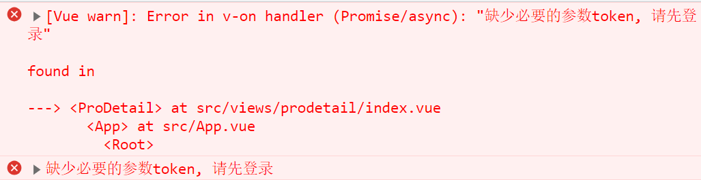

3. 请求拦截器中，统一携带 token

```jsx
// 自定义配置 - 请求/响应 拦截器
// 添加请求拦截器
instance.interceptors.request.use(function (config) {
  ...
  const token = store.getters.token
  if (token) {
    config.headers['Access-Token'] = token
    config.headers.platform = 'H5'
  }
  return config
}, function (error) {
  // 对请求错误做些什么
  return Promise.reject(error)
})
```

4. 准备小图标

```jsx
<div class="icon-cart">
  <span v-if="cartTotal > 0" class="num">{{ cartTotal }}</span>
  <van-icon name="shopping-cart-o" />
  <span>购物车</span>
</div>
```

5. 定制样式

```css
.footer .icon-cart {
  position: relative;
  padding: 0 6px;
  .num {
    z-index: 999;
    position: absolute;
    top: -2px;
    right: 0;
    min-width: 16px;
    padding: 0 4px;
    color: #fff;
    text-align: center;
    background-color: #ee0a24;
    border-radius: 50%;
  }
}
```


#### 22、购物车模块

说明：购物车 `数据联动关系` 较多，且通常会封装一些 小组件， 所以为了便于维护，一般都会将购物车的数据基于` vuex 分模块管理`。


##### 22.1 需求分析&准备工作

1. 基本静态结构 (快速实现) 
2. 构建 vuex cart 模块，获取数据存储 
3. 基于 数据 动态渲染 购物车列表 
4. 封装 getters 实现动态统计 
5. 全选反选功能 
6. 数字框修改数量功能 
7. 编辑切换状态，删除功能 
8. 空购物车处理

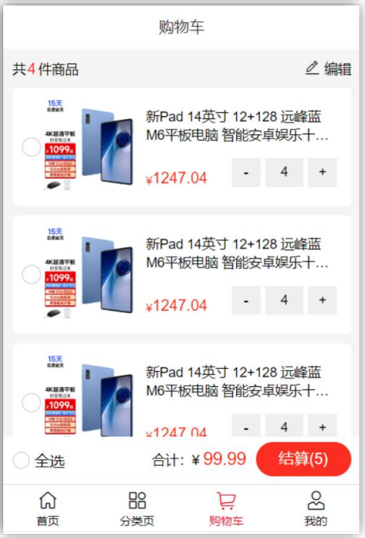

静态结构：`views/Layout/Cart.vue`

```jsx
<template>
  <div class="cart">
    <van-nav-bar title="购物车" fixed />
    <!-- 购物车开头 -->
    <div class="cart-title">
      <span class="all">共<i>4</i>件商品</span>
      <span class="edit">
        <van-icon name="edit" />
        编辑
      </span>
    </div>

    <!-- 购物车列表 -->
    <div class="cart-list">
      <div class="cart-item" v-for="item in 10" :key="item">
        <van-checkbox></van-checkbox>
        <div class="show">
          
        </div>
        <div class="info">
          <span class="tit text-ellipsis-2">新Pad 14英寸 12+128 远峰蓝 M6平板电脑 智能安卓娱乐十核游戏学习二合一 低蓝光护眼超清4K全面三星屏5GWIFI全网通 蓝魔快本平板</span>
          <span class="bottom">
            <div class="price">¥ <span>1247.04</span></div>
            <div class="count-box">
              <button class="minus">-</button>
              <input class="inp" :value="4" type="text" readonly>
              <button class="add">+</button>
            </div>
          </span>
        </div>
      </div>
    </div>

    <div class="footer-fixed">
      <div  class="all-check">
        <van-checkbox  icon-size="18"></van-checkbox>
        全选
      </div>

      <div class="all-total">
        <div class="price">
          <span>合计：</span>
          <span>¥ <i class="totalPrice">99.99</i></span>
        </div>
        <div v-if="true" class="goPay">结算(5)</div>
        <div v-else class="delete">删除</div>
      </div>
    </div>
  </div>
</template>

<script>
export default {
  name: 'CartPage'
}
</script>

<style lang="less" scoped>
// 主题 padding
.cart {
  padding-top: 46px;
  padding-bottom: 100px;
  background-color: #f5f5f5;
  min-height: 100vh;
  .cart-title {
    height: 40px;
    display: flex;
    justify-content: space-between;
    align-items: center;
    padding: 0 10px;
    font-size: 14px;
    .all {
      i {
        font-style: normal;
        margin: 0 2px;
        color: #fa2209;
        font-size: 16px;
      }
    }
    .edit {
      .van-icon {
        font-size: 18px;
      }
    }
  }

  .cart-item {
    margin: 0 10px 10px 10px;
    padding: 10px;
    display: flex;
    justify-content: space-between;
    background-color: #ffffff;
    border-radius: 5px;

    .show img {
      width: 100px;
      height: 100px;
    }
    .info {
      width: 210px;
      padding: 10px 5px;
      font-size: 14px;
      display: flex;
      flex-direction: column;
      justify-content: space-between;

      .bottom {
        display: flex;
        justify-content: space-between;
        .price {
          display: flex;
          align-items: flex-end;
          color: #fa2209;
          font-size: 12px;
          span {
            font-size: 16px;
          }
        }
        .count-box {
          display: flex;
          width: 110px;
          .add,
          .minus {
            width: 30px;
            height: 30px;
            outline: none;
            border: none;
          }
          .inp {
            width: 40px;
            height: 30px;
            outline: none;
            border: none;
            background-color: #efefef;
            text-align: center;
            margin: 0 5px;
          }
        }
      }
    }
  }
}

.footer-fixed {
  position: fixed;
  left: 0;
  bottom: 50px;
  height: 50px;
  width: 100%;
  border-bottom: 1px solid #ccc;
  background-color: #fff;
  display: flex;
  justify-content: space-between;
  align-items: center;
  padding: 0 10px;

  .all-check {
    display: flex;
    align-items: center;
    .van-checkbox {
      margin-right: 5px;
    }
  }

  .all-total {
    display: flex;
    line-height: 36px;
    .price {
      font-size: 14px;
      margin-right: 10px;
      .totalPrice {
        color: #fa2209;
        font-size: 18px;
        font-style: normal;
      }
    }

    .goPay, .delete {
      min-width: 100px;
      height: 36px;
      line-height: 36px;
      text-align: center;
      background-color: #fa2f21;
      color: #fff;
      border-radius: 18px;
      &.disabled {
        background-color: #ff9779;
      }
    }
  }

}
</style>
```

修改一下，商品详情页中的跳转`views/prodetail/ProDetail.vue`

```jsx
<div class="icon-home" @click="$router.push('/')">
    <van-icon name="wap-home-o" />
    <span>首页</span>
</div>

<div class="icon-cart" @click="$router.push('/cart')">
    <span v-if="cartTotal > 0" class="num">{{ cartTotal }}</span>
    <van-icon name="shopping-cart-o" />
    <span>购物车</span>
</div>
```

解决报错问题：

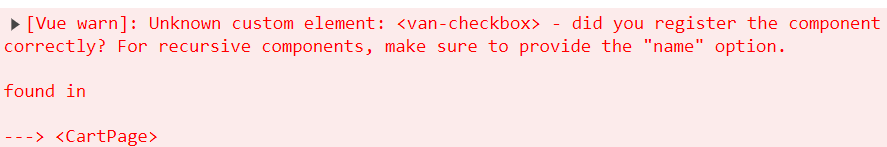

```js
import { Checkbox} from 'vant';
Vue.use(Checkbox);
```

引入已经创建好的组件`CountBox.vue`

```jsx
<div class="info">
    <span class="tit text-ellipsis-2">新Pad 14英寸 12+128 远峰蓝 M6平板电脑 智能安卓娱乐十核游戏学习二合一 低蓝光护眼超清4K全面三星屏5GWIFI全网通 蓝魔快本平板</span>
    <span class="bottom">
        <div class="price">¥ <span>1247.04</span></div>
        <CountBox></CountBox>
    </span>
</div>
...
<script>
import CountBox from '@/components/CountBox.vue'
export default {
  name: 'CartPage',
  components: {
    CountBox
  }
}
</script>
```


##### 22.2 构建 vuex 模块 - 获取数据存储


1. 新建 `modules/cart.js` 模块

```jsx
export default {
  namespaced: true,
  state () {
    return {
      cartList: []
    }
  },
  mutations: {
  },
  actions: {
  },
  getters: {
  }
}
```

2. 挂载到 store 上面

```jsx
import Vue from 'vue'
import Vuex from 'vuex'
import user from './modules/user'
import cart from './modules/cart'

Vue.use(Vuex)

export default new Vuex.Store({
  getters: {
    token: state => state.user.userInfo.token
  },
  modules: {
    user,
    cart
  }
})
```

3. 封装 API 接口 `api/cart.js`

```jsx
// 获取购物车列表数据
export const getCartList = () => {
  return request.get('/cart/list')
}
```

4. 封装 action 和 mutation

```jsx
mutations: {
  setCartList (state, newList) {
    state.cartList = newList
  },
},
actions: {
  async getCartAction (context) {
    const { data } = await getCartList()
    data.list.forEach(item => {
      item.isChecked = true
    })
    context.commit('setCartList', data.list)
  }
},
```

5. 页面中 dispatch 调用

```jsx
computed: {
  isLogin () {
    return this.$store.getters.token
  }
},
created () {
  if (this.isLogin) {
    this.$store.dispatch('cart/getCartAction')
  }
},
```


##### 22.3 基于数据完成动态渲染

1. 将数据映射到页面

```jsx
import { mapState } from 'vuex'

computed: {
  ...mapState('cart', ['cartList'])
}
```

2. 动态渲染

```jsx
<!-- 购物车列表 -->
<div class="cart-list">
  <div class="cart-item" v-for="item in cartList" :key="item.goods_id">
    <van-checkbox icon-size="18" :value="item.isChecked"></van-checkbox>
    <div class="show" @click="$router.push(`/prodetail/${item.goods_id}`)">
      
    </div>
    <div class="info">
      <span class="tit text-ellipsis-2">{{ item.goods.goods_name }}</span>
      <span class="bottom">
        <div class="price">¥ <span>{{ item.goods.goods_price_min }}</span></div>
        <CountBox :value="item.goods_num"></CountBox>
      </span>
    </div>
  </div>
</div>
```


##### 22.4 封装 getters 实现动态统计

1. 封装 getters：商品总数  / 选中的商品列表  /   选中的商品总数  /   选中的商品总价

```jsx
getters: {
  cartTotal (state) {
    return state.cartList.reduce((sum, item, index) => sum + item.goods_num, 0)
  },
  selCartList (state) {
    return state.cartList.filter(item => item.isChecked)
  },
  selCount (state, getters) {
    return getters.selCartList.reduce((sum, item, index) => sum + item.goods_num, 0)
  },
  selPrice (state, getters) {
    return getters.selCartList.reduce((sum, item, index) => {
      return sum + item.goods_num * item.goods.goods_price_min
    }, 0).toFixed(2)
  }
}
```

2. 页面中 mapGetters 映射使用

```jsx
computed: {
  ...mapGetters('cart', ['cartTotal', 'selCount', 'selPrice']),
},
    
<!-- 购物车开头 -->
<div class="cart-title">
  <span class="all">共<i>{{ cartTotal || 0 }}</i>件商品</span>
  <span class="edit">
    <van-icon name="edit"  />
    编辑
  </span>
</div>


<div class="footer-fixed">
  <div  class="all-check">
    <van-checkbox  icon-size="18"></van-checkbox>
    全选
  </div>
  <div class="all-total">
    <div class="price">
      <span>合计：</span>
      <span>¥ <i class="totalPrice">{{ selPrice }}</i></span>
    </div>
    <div v-if="true" :class="{ disabled: selCount === 0 }" class="goPay">
      结算({{ selCount }})
    </div>
    <div v-else  :class="{ disabled: selCount === 0 }" class="delete">
      删除({{ selCount }})
    </div>
  </div>
</div>
```


##### 22.5 全选和反选功能

1. 全选 getters`store/modules/cart.js`及`layout/Cart.vue`

```jsx
getters: {
  isAllChecked (state) {
    return state.cartList.every(item => item.isChecked)
  }
}
    
...mapGetters('cart', ['isAllChecked']),

<div class="all-check">
  <van-checkbox :value="isAllChecked" icon-size="18"></van-checkbox>
  全选
</div>
```

2. 点击小选，修改状态

```jsx
<van-checkbox @click="toggleCheck(item.goods_id)" ...></van-checkbox>
    
toggleCheck (goodsId) {
  this.$store.commit('cart/toggleCheck', goodsId)
},
    
mutations: {
  toggleCheck (state, goodsId) {
    const goods = state.cartList.find(item => item.goods_id === goodsId)
    goods.isChecked = !goods.isChecked
  },
}
```

3. 点击全选，重置状态

```jsx
<div @click="toggleAllCheck" class="all-check">
  <van-checkbox :value="isAllChecked" icon-size="18"></van-checkbox>
  全选
</div>

toggleAllCheck () {
  this.$store.commit('cart/toggleAllCheck', !this.isAllChecked)
},

mutations: {
  toggleAllCheck (state, flag) {
    state.cartList.forEach(item => {
      item.isChecked = flag
    })
  },
}
```


##### 22.6 数字框修改数量功能

1. 封装 api 接口

```jsx
// 更新购物车商品数量
export const changeCount = (goodsId, goodsNum, goodsSkuId) => {
  return request.post('/cart/update', {
    goodsId,
    goodsNum,
    goodsSkuId
  })
}
```

2. 页面中注册点击事件，传递数据

```jsx
<CountBox :value="item.goods_num" @input="value => changeCount(value, item.goods_id, item.goods_sku_id)"></CountBox>

changeCount (value, goodsId, skuId) {
  this.$store.dispatch('cart/changeCountAction', {
    value,
    goodsId,
    skuId
  })
},
```

3. 提供 action 发送请求， commit mutation

```jsx
mutations: {
  changeCount (state, { goodsId, value }) {
    const obj = state.cartList.find(item => item.goods_id === goodsId)
    obj.goods_num = value
  }
},
actions: {
  async changeCountAction (context, obj) {
    const { goodsId, value, skuId } = obj
    context.commit('changeCount', {
      goodsId,
      value
    })
    await changeCount(goodsId, value, skuId)
  },
}
```


##### 22.7 购物车 - 编辑切换状态

1. data 提供数据, 定义是否在编辑删除的状态

```jsx
data () {
  return {
    isEdit: false
  }
},
```

2. 注册点击事件，修改状态

```jsx
<span class="edit" @click="isEdit = !isEdit">
  <van-icon name="edit"  />
  编辑
</span>
```

3. 底下按钮根据状态变化

```jsx
<div v-if="!isEdit" :class="{ disabled: selCount === 0 }" class="goPay">
    去结算（{{ selCount }}）
</div>
<div v-else :class="{ disabled: selCount === 0 }" class="delete">删除</div>
```

4. 监视编辑状态，动态控制复选框状态

```jsx
watch: {
  isEdit (value) {
    if (value) {
      this.$store.commit('cart/toggleAllCheck', false)
    } else {
      this.$store.commit('cart/toggleAllCheck', true)
    }
  }
}
```


##### 22.8 购物车 - 删除功能完成

1. 查看接口，封装 API ( 注意：此处 id 为获取回来的购物车数据的 id )

```jsx
// 删除购物车
export const delSelect = (cartIds) => {
  return request.post('/cart/clear', {
    cartIds
  })
}
```

2. 注册删除点击事件

```jsx
<div v-else :class="{ disabled: selCount === 0 }" @click="handleDel" class="delete">
  删除({{ selCount }})
</div>

async handleDel () {
  if (this.selCount === 0) return
  await this.$store.dispatch('cart/delSelect')
  this.isEdit = false
},
```

3. 提供 actions

```jsx
actions: {
    // 删除购物车数据
    async delSelect (context) {
      const selCartList = context.getters.selCartList
      const cartIds = selCartList.map(item => item.id)
      await delSelect(cartIds)
      Toast('删除成功')

      // 重新拉取最新的购物车数据 (重新渲染)
      context.dispatch('getCartAction')
    }
},
```


##### 22.9 购物车 - 空购物车处理

1. 外面包个大盒子，添加 v-if 判断

```jsx
<div class="cart-box" v-if="isLogin && cartList.length > 0">
    <!-- 购物车开头 -->
    <div class="cart-title">
        ...
    </div>
    <!-- 购物车列表 -->
    <div class="cart-list">
        ...
    </div>
    <div class="footer-fixed">
        ...
    </div>
</div>

<div class="empty-cart" v-else>
    
        <div class="tips">
            您的购物车是空的, 快去逛逛吧
        </div>
        <div class="btn" @click="$router.push('/')">去逛逛</div>
</div>
```

2. 相关样式

```css
.empty-cart {
  padding: 80px 30px;
  img {
    width: 140px;
    height: 92px;
    display: block;
    margin: 0 auto;
  }
  .tips {
    text-align: center;
    color: #666;
    margin: 30px;
  }
  .btn {
    width: 110px;
    height: 32px;
    line-height: 32px;
    text-align: center;
    background-color: #fa2c20;
    border-radius: 16px;
    color: #fff;
    display: block;
    margin: 0 auto;
  }
}
```


#### 23、订单结算台

说明：所有的结算，本质上就是 `跳转到 "订单结算台"`，并且，跳转的同时，需要 `携带上对应的订单相关参数`， 具体需要哪些参数，基于 "订单结算台" 的需求来定。

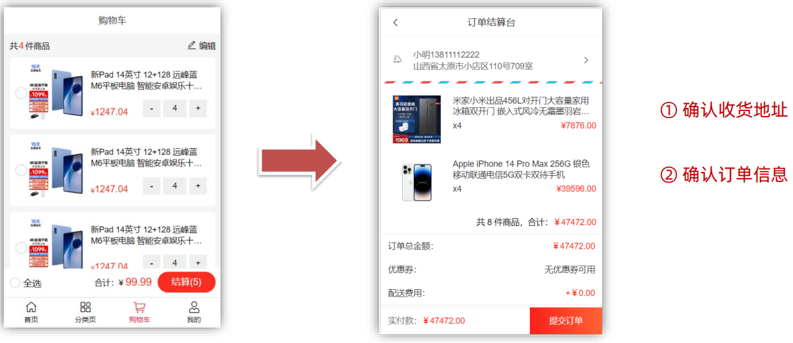


##### 23.1 静态布局

`views/pay/Pay.vue`

```jsx
<template>
  <div class="pay">
    <van-nav-bar fixed title="订单结算台" left-arrow @click-left="$router.go(-1)" />

    <!-- 地址相关 -->
    <div class="address">

      <div class="left-icon">
        <van-icon name="logistics" />
      </div>

      <div class="info" v-if="true">
        <div class="info-content">
          <span class="name">小红</span>
          <span class="mobile">13811112222</span>
        </div>
        <div class="info-address">
          江苏省 无锡市 南长街 110号 504
        </div>
      </div>

      <div class="info" v-else>
        请选择配送地址
      </div>

      <div class="right-icon">
        <van-icon name="arrow" />
      </div>
    </div>

    <!-- 订单明细 -->
    <div class="pay-list">
      <div class="list">
        <div class="goods-item">
            <div class="left">
              
            </div>
            <div class="right">
              <p class="tit text-ellipsis-2">
                 三星手机 SAMSUNG Galaxy S23 8GB+256GB 超视觉夜拍系统 超清夜景 悠雾紫 5G手机 游戏拍照旗舰机s23
              </p>
              <p class="info">
                <span class="count">x3</span>
                <span class="price">¥9.99</span>
              </p>
            </div>
        </div>
      </div>

      <div class="flow-num-box">
        <span>共 12 件商品，合计：</span>
        <span class="money">￥1219.00</span>
      </div>

      <div class="pay-detail">
        <div class="pay-cell">
          <span>订单总金额：</span>
          <span class="red">￥1219.00</span>
        </div>

        <div class="pay-cell">
          <span>优惠券：</span>
          <span>无优惠券可用</span>
        </div>

        <div class="pay-cell">
          <span>配送费用：</span>
          <span v-if="false">请先选择配送地址</span>
          <span v-else class="red">+￥0.00</span>
        </div>
      </div>

      <!-- 支付方式 -->
      <div class="pay-way">
        <span class="tit">支付方式</span>
        <div class="pay-cell">
          <span><van-icon name="balance-o" />余额支付（可用 ¥ 999919.00 元）</span>
          <!-- <span>请先选择配送地址</span> -->
          <span class="red"><van-icon name="passed" /></span>
        </div>
      </div>

      <!-- 买家留言 -->
      <div class="buytips">
        <textarea placeholder="选填：买家留言（50字内）" name="" id="" cols="30" rows="10"></textarea>
      </div>
    </div>

    <!-- 底部提交 -->
    <div class="footer-fixed">
      <div class="left">实付款：<span>￥999919</span></div>
      <div class="tipsbtn">提交订单</div>
    </div>
  </div>
</template>

<script>
export default {
  name: 'PayIndex',
  data () {
    return {
    }
  },
  methods: {
  }
}
</script>

<style lang="less" scoped>
.pay {
  padding-top: 46px;
  padding-bottom: 46px;
  ::v-deep {
    .van-nav-bar__arrow {
      color: #333;
    }
  }
}
.address {
  display: flex;
  align-items: center;
  justify-content: flex-start;
  padding: 20px;
  font-size: 14px;
  color: #666;
  position: relative;
  background: url(@/assets/border-line.png) bottom repeat-x;
  background-size: 60px auto;
  .left-icon {
    margin-right: 20px;
  }
  .right-icon {
    position: absolute;
    right: 20px;
    top: 50%;
    transform: translateY(-7px);
  }
}
.goods-item {
  height: 100px;
  margin-bottom: 6px;
  padding: 10px;
  background-color: #fff;
  display: flex;
  .left {
    width: 100px;
    img {
      display: block;
      width: 80px;
      margin: 10px auto;
    }
  }
  .right {
    flex: 1;
    font-size: 14px;
    line-height: 1.3;
    padding: 10px;
    padding-right: 0px;
    display: flex;
    flex-direction: column;
    justify-content: space-evenly;
    color: #333;
    .info {
      margin-top: 5px;
      display: flex;
      justify-content: space-between;
      .price {
        color: #fa2209;
      }
    }
  }
}

.flow-num-box {
  display: flex;
  justify-content: flex-end;
  padding: 10px 10px;
  font-size: 14px;
  border-bottom: 1px solid #efefef;
  .money {
    color: #fa2209;
  }
}

.pay-cell {
  font-size: 14px;
  padding: 10px 12px;
  color: #333;
  display: flex;
  justify-content: space-between;
  .red {
    color: #fa2209;
  }
}
.pay-detail {
  border-bottom: 1px solid #efefef;
}

.pay-way {
  font-size: 14px;
  padding: 10px 12px;
  border-bottom: 1px solid #efefef;
  color: #333;
  .tit {
    line-height: 30px;
  }
  .pay-cell {
    padding: 10px 0;
  }
  .van-icon {
    font-size: 20px;
    margin-right: 5px;
  }
}

.buytips {
  display: block;
  textarea {
    display: block;
    width: 100%;
    border: none;
    font-size: 14px;
    padding: 12px;
    height: 100px;
  }
}

.footer-fixed {
  position: fixed;
  background-color: #fff;
  left: 0;
  bottom: 0;
  width: 100%;
  height: 46px;
  line-height: 46px;
  border-top: 1px solid #efefef;
  font-size: 14px;
  display: flex;
  .left {
    flex: 1;
    padding-left: 12px;
    color: #666;
    span {
      color:#fa2209;
    }
  }
  .tipsbtn {
    width: 121px;
    background: linear-gradient(90deg,#f9211c,#ff6335);
    color: #fff;
    text-align: center;
    line-height: 46px;
    display: block;
    font-size: 14px;
  }
}
</style>
```


##### 23.2 获取收获地址

1 封装获取地址的接口

```jsx
import request from '@/utils/request'

// 获取地址列表
export const getAddressList = () => {
  return request.get('/address/list')
}
```

2 页面中 - 调用获取地址

```jsx
data () {
  return {
    addressList: []
  }
},
computed: {
  selectAddress () {
    // 这里地址管理不是主线业务，直接获取默认第一条地址
    return this.addressList[0] 
  }
},
async created () {
  this.getAddressList()
},
methods: {
  async getAddressList () {
    const { data: { list } } = await getAddressList()
    this.addressList = list
  }
}
```

3 页面中 - 进行渲染

```jsx
computed: {
  longAddress () {
    const region = this.selectAddress.region
    return region.province + region.city + region.region + this.selectAddress.detail
  }
},

<div class="info" v-if="selectAddress?.address_id">
  <div class="info-content">
    <span class="name">{{ selectAddress.name }}</span>
    <span class="mobile">{{ selectAddress.phone }}</span>
  </div>
  <div class="info-address">
    {{ longAddress }}
  </div>
</div>
```


##### 23.3 订单结算 - 封装通用接口

**思路分析：**这里的订单结算，有两种情况：

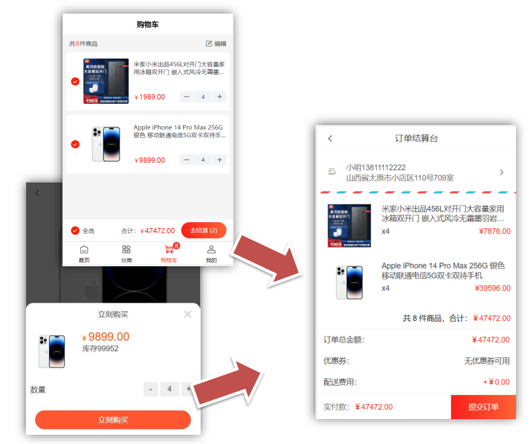

1. 购物车结算，需要两个参数

   ① mode="cart"

   ② cartIds="cartId, cartId"

2. 立即购买结算，需要三个参数

   ① mode="buyNow"

   ② goodsId="商品id" 

   ③ goodsSkuId="商品skuId"

都需要跳转时将参数传递过来

---

封装通用 API 接口 `api/order` 

```jsx
import request from '@/utils/request'

export const checkOrder = (mode, obj) => {
  return request.get('/checkout/order', {
    params: {
      mode,
      delivery: 0,
      couponId: 0,
      isUsePoints: 0,
      ...obj
    }
  })
}
```


##### 23.4 订单结算 - 购物车结算

目的：购物车结算跳转，传递参数，调用接口渲染订单结算台。

核心步骤：

* 跳转传递查询参数 `mode="cart"` 和 `cartIds`
* 页面中 `$route.query`接收参数
* 调用接口，获取数据
* 基于数据渲染

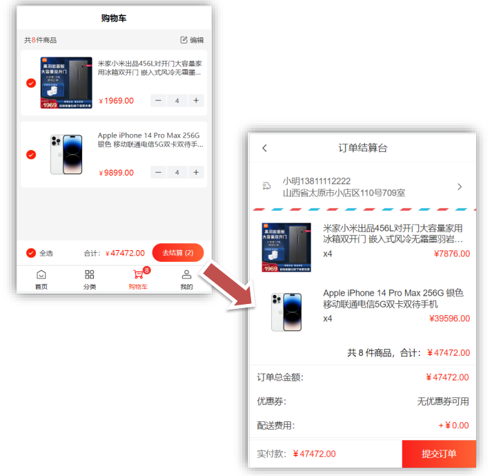

① 跳转时，传递查询参数

`layout/cart.vue`

```jsx
<div @click="goPay">结算({{ selCount }})</div>

goPay () {
  if (this.selCount > 0) {
    this.$router.push({
      path: '/pay',
      query: {
        mode: 'cart',
        cartIds: this.selCartList.map(item => item.id).join(',')
      }
    })
  }
}
```

② 页面中接收参数,   调用接口，获取数据

`views/pay/Pay.vue`

```jsx
data () {
  return {
    order: {},
    personal: {}
  }
},
    
computed: {
  mode () {
    return this.$route.query.mode
  },
  cartIds () {
    return this.$route.query.cartIds
  }
}

async created () {
  this.getOrderList()
},

async getOrderList () {
  if (this.mode === 'cart') {
    const { data: { order, personal } } = await checkOrder(this.mode, { cartIds: this.cartIds })
    this.order = order
    this.personal = personal
  }
}
```

③ 基于数据进行渲染

```jsx
<!-- 订单明细 -->
<div class="pay-list" v-if="order.goodsList">
  <div class="list">
    <div class="goods-item" v-for="item in order.goodsList" :key="item.goods_id">
        <div class="left">
          
        </div>
        <div class="right">
          <p class="tit text-ellipsis-2">
            {{ item.goods_name }}
          </p>
          <p class="info">
            <span class="count">x{{ item.total_num }}</span>
            <span class="price">¥{{ item.total_pay_price }}</span>
          </p>
        </div>
    </div>
  </div>

  <div class="flow-num-box">
    <span>共 {{ order.orderTotalNum }} 件商品，合计：</span>
    <span class="money">￥{{ order.orderTotalPrice }}</span>
  </div>

  <div class="pay-detail">
    <div class="pay-cell">
      <span>订单总金额：</span>
      <span class="red">￥{{ order.orderTotalPrice }}</span>
    </div>

    <div class="pay-cell">
      <span>优惠券：</span>
      <span>无优惠券可用</span>
    </div>

    <div class="pay-cell">
      <span>配送费用：</span>
      <span v-if="!selectAddress">请先选择配送地址</span>
      <span v-else class="red">+￥0.00</span>
    </div>
  </div>

  <!-- 支付方式 -->
  <div class="pay-way">
    <span class="tit">支付方式</span>
    <div class="pay-cell">
      <span><van-icon name="balance-o" />余额支付（可用 ¥ {{ personal.balance }} 元）</span>
      <!-- <span>请先选择配送地址</span> -->
      <span class="red"><van-icon name="passed" /></span>
    </div>
  </div>

  <!-- 买家留言 -->
  <div class="buytips">
    <textarea placeholder="选填：买家留言（50字内）" name="" id="" cols="30" rows="10"></textarea>
  </div>
</div>

<!-- 底部提交 -->
<div class="footer-fixed">
  <div class="left">实付款：<span>￥{{ order.orderTotalPrice }}</span></div>
  <div class="tipsbtn">提交订单</div>
</div>
```


##### 23.5 订单结算 - 立即购买结算

目的：商品详情页**立即购买**跳转，传递参数，调用接口渲染订单结算台。

核心步骤：

* 跳转传递查询参数

  ```
  mode="buyNow", goodsId, goodsSkuId, goodsNum
  ```

* 页面中 `$route.query`接收参数

* 基于数据渲染

* 未登录时，确认框的复用(`mixins混入`)

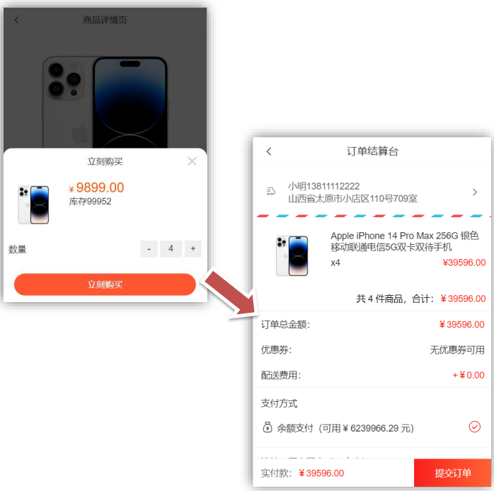

① 点击跳转传参

`prodetail/index.vue`

```jsx
<div class="btn" v-if="mode === 'buyNow'" @click="goBuyNow">立刻购买</div>

goBuyNow () {
  this.$router.push({
    path: '/pay',
    query: {
      mode: 'buyNow',
      goodsId: this.goodsId,
      goodsSkuId: this.detail.skuList[0].goods_sku_id,
      goodsNum: this.addCount
    }
  })
}
```

② 计算属性处理参数

`views/pay/Pay.vue`

```jsx
computed: {
  ...
  goodsId () {
    return this.$route.query.goodsId
  },
  goodsSkuId () {
    return this.$route.query.goodsSkuId
  },
  goodsNum () {
    return this.$route.query.goodsNum
  }
}
```

③ 基于请求时携带参数发请求渲染

```jsx
async getOrderList () {
  ...
  
  if (this.mode === 'buyNow') {
    const { data: { order, personal } } = await checkOrder(this.mode, {
      goodsId: this.goodsId,
      goodsSkuId: this.goodsSkuId,
      goodsNum: this.goodsNum
    })
    this.order = order
    this.personal = personal
  }
}
```


##### 23.6 mixins 复用 - 处理登录确认框的弹出

1 新建一个 mixin 文件   `mixins/loginConfirm.js`

```jsx
export default {
  methods: {
    // 是否需要弹登录确认框
    // (1) 需要，返回 true，并直接弹出登录确认框
    // (2) 不需要，返回 false
    loginConfirm () {
      if (!this.$store.getters.token) {
        this.$dialog.confirm({
          title: '温馨提示',
          message: '此时需要先登录才能继续操作哦',
          confirmButtonText: '去登陆',
          cancelButtonText: '再逛逛'
        })
          .then(() => {
            // 如果希望，跳转到登录 => 登录后能回跳回来，需要在跳转去携带参数 (当前的路径地址)
            // this.$route.fullPath (会包含查询参数)
            this.$router.replace({
              path: '/login',
              query: {
                backUrl: this.$route.fullPath
              }
            })
          })
          .catch(() => {})
        return true
      }
      return false
    }
  }
}

```

2 页面中导入，混入方法

```jsx
import loginConfirm from '@/mixins/loginConfirm'

export default {
  name: 'ProDetail',
  mixins: [loginConfirm],
  ...
}
```

3 页面中调用 混入的方法

```jsx
async addCart () {
  if (this.loginConfirm()) {
    return
  }
  const { data } = await addCart(this.goodsId, this.addCount, this.detail.skuList[0].goods_sku_id)
  this.cartTotal = data.cartTotal
  this.$toast('加入购物车成功')
  this.showPannel = false
  console.log(this.cartTotal)
},

goBuyNow () {
  if (this.loginConfirm()) {
    return
  }
  this.$router.push({
    path: '/pay',
    query: {
      mode: 'buyNow',
      goodsId: this.goodsId,
      goodsSkuId: this.detail.skuList[0].goods_sku_id,
      goodsNum: this.addCount
    }
  })
}
```


#### 24、提交订单并支付

目标：封装 API 请求方法，提交订单并支付。

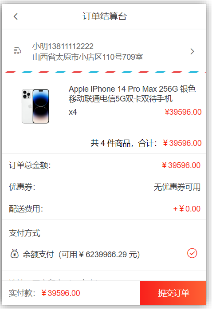


核心步骤： 

1. 封装通用请求方法 

```jsx
// 提交订单
export const submitOrder = (mode, params) => {
  return request.post('/checkout/submit', {
    mode,
    delivery: 10, // 物流方式  配送方式 (10快递配送 20门店自提)
    couponId: 0, // 优惠券 id
    payType: 10, // 余额支付
    isUsePoints: 0, // 是否使用积分
    ...params
  })
}
```

2. 买家留言绑定 

```jsx
data () {
  return {
    remark: ''
  }
},
<div class="buytips">
  <textarea v-model="remark" placeholder="选填：买家留言（50字内）" name="" id="" cols="30" rows="10">
  </textarea>
</div>
```

3. 注册事件，调用方法提交订单并支付

```jsx
<div class="tipsbtn" @click="submitOrder">提交订单</div>

// 提交订单
async submitOrder () {
  if (this.mode === 'cart') {
    await submitOrder(this.mode, {
      remark: this.remark,
      cartIds: this.cartIds
    })
  }
  if (this.mode === 'buyNow') {
    await submitOrder(this.mode, {
      remark: this.remark,
      goodsId: this.goodsId,
      goodsSkuId: this.goodsSkuId,
      goodsNum: this.goodsNum
    })
  }
  this.$toast.success('支付成功')
  this.$router.replace('/myorder')
}
```


#### 25、订单管理&个人中心

实现效果：

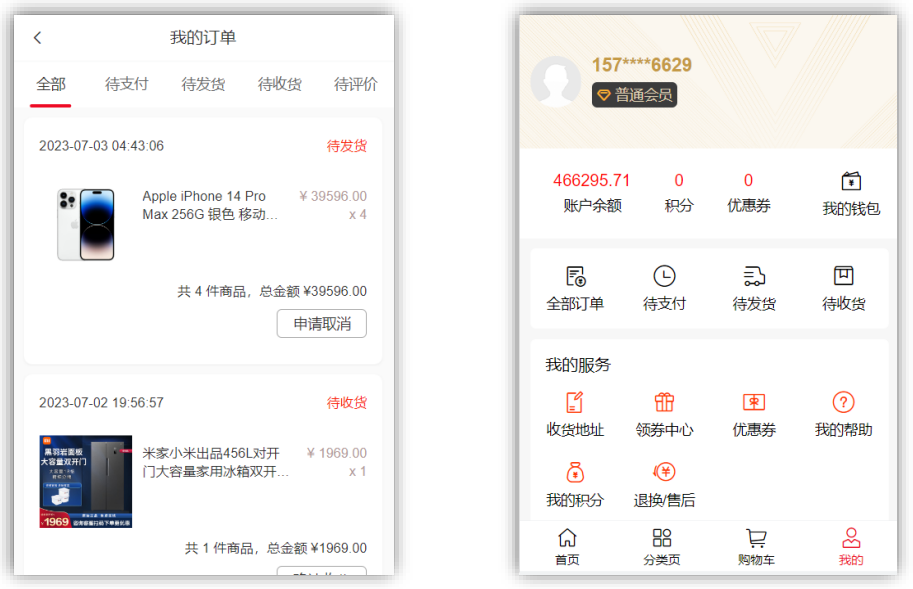

##### 25.1 订单管理

前置导入：

```js
import { Tab, Tabs } from 'vant'
Vue.use(Tab)
Vue.use(Tabs)
```


###### 1. 静态布局

`订单页面`,通用页面`components/OrderListItem.vue`

```jsx
<template>
  <div class="order-list-item">
    <div class="tit">
      <div class="time">2023-07-01 12:02:13</div>
      <div class="status">
        <span>待支付</span>
      </div>
    </div>
    <div class="list">
      <div class="list-item">
        <div class="goods-img">
          
        </div>
        <div class="goods-content text-ellipsis-2">
          Apple iPhone 14 Pro Max 256G 银色 移动联通电信5G双卡双待手机
        </div>
        <div class="goods-trade">
          <p>¥ 1299.00</p>
          <p>x 3</p>
        </div>
      </div>
      <div class="list-item">
        <div class="goods-img">
          
        </div>
        <div class="goods-content text-ellipsis-2">
          Apple iPhone 14 Pro Max 256G 银色 移动联通电信5G双卡双待手机
        </div>
        <div class="goods-trade">
          <p>¥ 1299.00</p>
          <p>x 3</p>
        </div>
      </div>
      <div class="list-item">
        <div class="goods-img">
          
        </div>
        <div class="goods-content text-ellipsis-2">
          Apple iPhone 14 Pro Max 256G 银色 移动联通电信5G双卡双待手机
        </div>
        <div class="goods-trade">
          <p>¥ 1299.00</p>
          <p>x 3</p>
        </div>
      </div>
    </div>
    <div class="total">
      共12件商品，总金额 ¥29888.00
    </div>
    <div class="actions">
      <span v-if="false">立刻付款</span>
      <span v-if="true">申请取消</span>
      <span v-if="false">确认收货</span>
      <span v-if="false">评价</span>
    </div>
  </div>
</template>

<script>
export default {

}
</script>

<style lang="less" scoped>
.order-list-item {
  margin: 10px auto;
  width: 94%;
  padding: 15px;
  background-color: #ffffff;
  box-shadow: 0 0.5px 2px 0 rgba(0,0,0,.05);
  border-radius: 8px;
  color: #333;
  font-size: 13px;

  .tit {
    height: 24px;
    line-height: 24px;
    display: flex;
    justify-content: space-between;
    margin-bottom: 20px;
    .status {
      color: #fa2209;
    }
  }

  .list-item {
    display: flex;
    .goods-img {
      width: 90px;
      height: 90px;
      margin: 0px 10px 10px 0;
      img {
        width: 100%;
        height: 100%;
      }
    }
    .goods-content {
      flex: 2;
      line-height: 18px;
      max-height: 36px;
      margin-top: 8px;
    }
    .goods-trade {
      flex: 1;
      line-height: 18px;
      text-align: right;
      color: #b39999;
      margin-top: 8px;
    }
  }

  .total {
    text-align: right;
  }
  .actions {
    text-align: right;
    span {
      display: inline-block;
      height: 28px;
      line-height: 28px;
      color: #383838;
      border: 0.5px solid #a8a8a8;
      font-size: 14px;
      padding: 0 15px;
      border-radius: 5px;
      margin: 10px 0;
    }
  }
}
</style>
```

`myorder/MyOrder.vue`

```jsx
<template>
  <div class="order">
    <van-nav-bar title="我的订单" left-arrow @click-left="$router.go(-1)" />
    <van-tabs v-model="active">
      <van-tab title="全部"></van-tab>
      <van-tab title="待支付"></van-tab>
      <van-tab title="待发货"></van-tab>
      <van-tab title="待收货"></van-tab>
      <van-tab title="待评价"></van-tab>
    </van-tabs>

    <OrderListItem></OrderListItem>
  </div>
</template>

<script>
import OrderListItem from '@/components/OrderListItem.vue'
export default {
  name: 'OrderPage',
  components: {
    OrderListItem
  },
  data () {
    return {
      active: 0
    }
  }
}
</script>

<style lang="less" scoped>
.order {
  background-color: #fafafa;
}
.van-tabs {
  position: sticky;
  top: 0;
}
</style>
```


###### 2. 点击tab切换渲染

1 封装获取订单列表的 API 接口

```jsx
// 订单列表
export const getMyOrderList = (dataType, page) => {
  return request.get('/order/list', {
    params: {
      dataType,
      page
    }
  })
}
```

2 给 tab 绑定 name 属性

```jsx
<van-tabs v-model="active" sticky>
  <van-tab name="all" title="全部"></van-tab>
  <van-tab name="payment" title="待支付"></van-tab>
  <van-tab name="delivery" title="待发货"></van-tab>
  <van-tab name="received" title="待收货"></van-tab>
  <van-tab name="comment" title="待评价"></van-tab>
</van-tabs>

data () {
  return {
    active: this.$route.query.dataType || 'all',
    page: 1,
    list: []
  }
},
```

3 封装调用接口获取数据

```jsx
methods: {
  async getOrderList () {
    const { data: { list } } = await getMyOrderList(this.active, this.page)
    list.data.forEach((item) => {
      item.total_num = 0
      item.goods.forEach(goods => {
        item.total_num += goods.total_num
      })
    })
    this.list = list.data
  }
},
watch: {
  active: {
    immediate: true,
    handler () {
      this.getOrderList()
    }
  }
}
```

4 动态渲染

```jsx
<OrderListItem v-for="item in list" :key="item.order_id" :item="item"></OrderListItem>

<template>
  <div class="order-list-item" v-if="item.order_id">
    <div class="tit">
      <div class="time">{{ item.create_time }}</div>
      <div class="status">
        <span>{{ item.state_text }}</span>
      </div>
    </div>
    <div class="list" >
      <div class="list-item" v-for="(goods, index) in item.goods" :key="index">
        <div class="goods-img">
          
        </div>
        <div class="goods-content text-ellipsis-2">
          {{ goods.goods_name }}
        </div>
        <div class="goods-trade">
          <p>¥ {{ goods.total_pay_price }}</p>
          <p>x {{ goods.total_num }}</p>
        </div>
      </div>
    </div>
    <div class="total">
      共 {{ item.total_num }} 件商品，总金额 ¥{{ item.total_price }}
    </div>
    <div class="actions">
      <div v-if="item.order_status === 10">
        <span v-if="item.pay_status === 10">立刻付款</span>
        <span v-else-if="item.delivery_status === 10">申请取消</span>
        <span v-else-if="item.delivery_status === 20 || item.delivery_status === 30">确认收货</span>
      </div>
      <div v-if="item.order_status === 30">
        <span>评价</span>
      </div>
    </div>
  </div>
</template>

<script>
export default {
  props: {
    item: {
      type: Object,
      default: () => {
        return {}
      }
    }
  }
}
</script>
```


##### 25.2 个人中心

###### 1. 静态布局

```jsx
<template>
  <div class="user">
    <div class="head-page" v-if="isLogin">
      <div class="head-img">
        
      </div>
      <div class="info">
        <div class="mobile">{{ detail.mobile }}</div>
        <div class="vip">
          <van-icon name="diamond-o" />
          普通会员
        </div>
      </div>
    </div>

    <div v-else class="head-page" @click="$router.push('/login')">
      <div class="head-img">
        
      </div>
      <div class="info">
        <div class="mobile">未登录</div>
        <div class="words">点击登录账号</div>
      </div>
    </div>

    <div class="my-asset">
      <div class="asset-left">
        <div class="asset-left-item">
          <span>{{ detail.pay_money || 0 }}</span>
          <span>账户余额</span>
        </div>
        <div class="asset-left-item">
          <span>0</span>
          <span>积分</span>
        </div>
        <div class="asset-left-item">
          <span>0</span>
          <span>优惠券</span>
        </div>
      </div>
      <div class="asset-right">
        <div class="asset-right-item">
          <van-icon name="balance-pay" />
          <span>我的钱包</span>
        </div>
      </div>
    </div>
    <div class="order-navbar">
      <div class="order-navbar-item" @click="$router.push('/myorder?dataType=all')">
        <van-icon name="balance-list-o" />
        <span>全部订单</span>
      </div>
      <div class="order-navbar-item" @click="$router.push('/myorder?dataType=payment')">
        <van-icon name="clock-o" />
        <span>待支付</span>
      </div>
      <div class="order-navbar-item" @click="$router.push('/myorder?dataType=delivery')">
        <van-icon name="logistics" />
        <span>待发货</span>
      </div>
      <div class="order-navbar-item" @click="$router.push('/myorder?dataType=received')">
        <van-icon name="send-gift-o" />
        <span>待收货</span>
      </div>
    </div>

    <div class="service">
      <div class="title">我的服务</div>
      <div class="content">
        <div class="content-item">
          <van-icon name="records" />
          <span>收货地址</span>
        </div>
        <div class="content-item">
          <van-icon name="gift-o" />
          <span>领券中心</span>
        </div>
        <div class="content-item">
          <van-icon name="gift-card-o" />
          <span>优惠券</span>
        </div>
        <div class="content-item">
          <van-icon name="question-o" />
          <span>我的帮助</span>
        </div>
        <div class="content-item">
          <van-icon name="balance-o" />
          <span>我的积分</span>
        </div>
        <div class="content-item">
          <van-icon name="refund-o" />
          <span>退换/售后</span>
        </div>
      </div>
    </div>

    <div class="logout-btn">
     <button>退出登录</button>
    </div>
  </div>
</template>

<script>
import { getUserInfoDetail } from '@/api/user.js'
export default {
  name: 'UserPage',
  data () {
    return {
      detail: {}
    }
  },
  created () {
    if (this.isLogin) {
      this.getUserInfoDetail()
    }
  },
  computed: {
    isLogin () {
      return this.$store.getters.token
    }
  },
  methods: {
    async getUserInfoDetail () {
      const { data: { userInfo } } = await getUserInfoDetail()
      this.detail = userInfo
      console.log(this.detail)
    }
  }
}
</script>

<style lang="less" scoped>
.user {
  min-height: 100vh;
  background-color: #f7f7f7;
  padding-bottom: 50px;
}

.head-page {
  height: 130px;
  background: url("http://cba.itlike.com/public/mweb/static/background/user-header2.png");
  background-size: cover;
  display: flex;
  align-items: center;
  .head-img {
    width: 50px;
    height: 50px;
    border-radius: 50%;
    overflow: hidden;
    margin: 0 10px;
    img {
      width: 100%;
      height: 100%;
      object-fit: cover;
    }
  }
}
.info {
  .mobile {
    margin-bottom: 5px;
    color: #c59a46;
    font-size: 18px;
    font-weight: bold;
  }
  .vip {
    display: inline-block;
    background-color: #3c3c3c;
    padding: 3px 5px;
    border-radius: 5px;
    color: #e0d3b6;
    font-size: 14px;
    .van-icon {
      font-weight: bold;
      color: #ffb632;
    }
  }
}

.my-asset {
  display: flex;
  padding: 20px 0;
  font-size: 14px;
  background-color: #fff;
  .asset-left {
    display: flex;
    justify-content: space-evenly;
    flex: 3;
    .asset-left-item {
      display: flex;
      flex-direction: column;
      justify-content: center;
      align-items: center;
      span:first-child {
        margin-bottom: 5px;
        color: #ff0000;
        font-size: 16px;
      }
    }
  }
  .asset-right {
    flex: 1;
    .asset-right-item {
      display: flex;
      flex-direction: column;
      justify-content: center;
      align-items: center;
      .van-icon {
        font-size: 24px;
        margin-bottom: 5px;
      }
    }
  }
}

.order-navbar {
  display: flex;
  padding: 15px 0;
  margin: 10px;
  font-size: 14px;
  background-color: #fff;
  border-radius: 5px;
  .order-navbar-item {
    display: flex;
    flex-direction: column;
    justify-content: center;
    align-items: center;
    width: 25%;
    .van-icon {
      font-size: 24px;
      margin-bottom: 5px;
    }
  }
}

.service {
  font-size: 14px;
  background-color: #fff;
  border-radius: 5px;
  margin: 10px;
  .title {
    height: 50px;
    line-height: 50px;
    padding: 0 15px;
    font-size: 16px;
  }
  .content {
    display: flex;
    justify-content: flex-start;
    flex-wrap: wrap;
    font-size: 14px;
    background-color: #fff;
    border-radius: 5px;
    .content-item {
      display: flex;
      flex-direction: column;
      justify-content: center;
      align-items: center;
      width: 25%;
      margin-bottom: 20px;

      .van-icon {
        font-size: 24px;
        margin-bottom: 5px;
        color: #ff3800;
      }
    }
  }
}

.logout-btn {
  button {
    width: 60%;
    margin: 10px auto;
    display: block;
    font-size: 13px;
    color: #616161;
    border-radius: 9px;
    border: 1px solid #dcdcdc;
    padding: 7px 0;
    text-align: center;
    background-color: #fafafa;
  }
}
</style>
```

###### 2. 基本渲染

1 封装获取个人信息 - API接口

```jsx
import request from '@/utils/request'

// 获取个人信息
export const getUserInfoDetail = () => {
  return request.get('/user/info')
}
```

2 调用接口，获取数据进行渲染

```jsx
<template>
  <div class="user">
    <div class="head-page" v-if="isLogin">
      <div class="head-img">
        
      </div>
      <div class="info">
        <div class="mobile">{{ detail.mobile }}</div>
        <div class="vip">
          <van-icon name="diamond-o" />
          普通会员
        </div>
      </div>
    </div>

    <div v-else class="head-page" @click="$router.push('/login')">
      <div class="head-img">
        
      </div>
      <div class="info">
        <div class="mobile">未登录</div>
        <div class="words">点击登录账号</div>
      </div>
    </div>

    <div class="my-asset">
      <div class="asset-left">
        <div class="asset-left-item">
          <span>{{ detail.pay_money || 0 }}</span>
          <span>账户余额</span>
        </div>
        <div class="asset-left-item">
          <span>0</span>
          <span>积分</span>
        </div>
        <div class="asset-left-item">
          <span>0</span>
          <span>优惠券</span>
        </div>
      </div>
      <div class="asset-right">
        <div class="asset-right-item">
          <van-icon name="balance-pay" />
          <span>我的钱包</span>
        </div>
      </div>
    </div>
    <div class="order-navbar">
      <div class="order-navbar-item" @click="$router.push('/myorder?dataType=all')">
        <van-icon name="balance-list-o" />
        <span>全部订单</span>
      </div>
      <div class="order-navbar-item" @click="$router.push('/myorder?dataType=payment')">
        <van-icon name="clock-o" />
        <span>待支付</span>
      </div>
      <div class="order-navbar-item" @click="$router.push('/myorder?dataType=delivery')">
        <van-icon name="logistics" />
        <span>待发货</span>
      </div>
      <div class="order-navbar-item" @click="$router.push('/myorder?dataType=received')">
        <van-icon name="send-gift-o" />
        <span>待收货</span>
      </div>
    </div>

    <div class="service">
      <div class="title">我的服务</div>
      <div class="content">
        <div class="content-item">
          <van-icon name="records" />
          <span>收货地址</span>
        </div>
        <div class="content-item">
          <van-icon name="gift-o" />
          <span>领券中心</span>
        </div>
        <div class="content-item">
          <van-icon name="gift-card-o" />
          <span>优惠券</span>
        </div>
        <div class="content-item">
          <van-icon name="question-o" />
          <span>我的帮助</span>
        </div>
        <div class="content-item">
          <van-icon name="balance-o" />
          <span>我的积分</span>
        </div>
        <div class="content-item">
          <van-icon name="refund-o" />
          <span>退换/售后</span>
        </div>
      </div>
    </div>

    <div class="logout-btn">
     <button>退出登录</button>
    </div>
  </div>
</template>

<script>
import { getUserInfoDetail } from '@/api/user.js'
export default {
  name: 'UserPage',
  data () {
    return {
      detail: {}
    }
  },
  created () {
    if (this.isLogin) {
      this.getUserInfoDetail()
    }
  },
  computed: {
    isLogin () {
      return this.$store.getters.token
    }
  },
  methods: {
    async getUserInfoDetail () {
      const { data: { userInfo } } = await getUserInfoDetail()
      this.detail = userInfo
      console.log(this.detail)
    }
  }
}
</script>

<style lang="less" scoped>
.user {
  min-height: 100vh;
  background-color: #f7f7f7;
  padding-bottom: 50px;
}

.head-page {
  height: 130px;
  background: url("http://cba.itlike.com/public/mweb/static/background/user-header2.png");
  background-size: cover;
  display: flex;
  align-items: center;
  .head-img {
    width: 50px;
    height: 50px;
    border-radius: 50%;
    overflow: hidden;
    margin: 0 10px;
    img {
      width: 100%;
      height: 100%;
      object-fit: cover;
    }
  }
}
.info {
  .mobile {
    margin-bottom: 5px;
    color: #c59a46;
    font-size: 18px;
    font-weight: bold;
  }
  .vip {
    display: inline-block;
    background-color: #3c3c3c;
    padding: 3px 5px;
    border-radius: 5px;
    color: #e0d3b6;
    font-size: 14px;
    .van-icon {
      font-weight: bold;
      color: #ffb632;
    }
  }
}

.my-asset {
  display: flex;
  padding: 20px 0;
  font-size: 14px;
  background-color: #fff;
  .asset-left {
    display: flex;
    justify-content: space-evenly;
    flex: 3;
    .asset-left-item {
      display: flex;
      flex-direction: column;
      justify-content: center;
      align-items: center;
      span:first-child {
        margin-bottom: 5px;
        color: #ff0000;
        font-size: 16px;
      }
    }
  }
  .asset-right {
    flex: 1;
    .asset-right-item {
      display: flex;
      flex-direction: column;
      justify-content: center;
      align-items: center;
      .van-icon {
        font-size: 24px;
        margin-bottom: 5px;
      }
    }
  }
}

.order-navbar {
  display: flex;
  padding: 15px 0;
  margin: 10px;
  font-size: 14px;
  background-color: #fff;
  border-radius: 5px;
  .order-navbar-item {
    display: flex;
    flex-direction: column;
    justify-content: center;
    align-items: center;
    width: 25%;
    .van-icon {
      font-size: 24px;
      margin-bottom: 5px;
    }
  }
}

.service {
  font-size: 14px;
  background-color: #fff;
  border-radius: 5px;
  margin: 10px;
  .title {
    height: 50px;
    line-height: 50px;
    padding: 0 15px;
    font-size: 16px;
  }
  .content {
    display: flex;
    justify-content: flex-start;
    flex-wrap: wrap;
    font-size: 14px;
    background-color: #fff;
    border-radius: 5px;
    .content-item {
      display: flex;
      flex-direction: column;
      justify-content: center;
      align-items: center;
      width: 25%;
      margin-bottom: 20px;

      .van-icon {
        font-size: 24px;
        margin-bottom: 5px;
        color: #ff3800;
      }
    }
  }
}

.logout-btn {
  button {
    width: 60%;
    margin: 10px auto;
    display: block;
    font-size: 13px;
    color: #616161;
    border-radius: 9px;
    border: 1px solid #dcdcdc;
    padding: 7px 0;
    text-align: center;
    background-color: #fafafa;
  }
}
</style>
```

###### 3. 退出功能

1 注册点击事件

```jsx
<button @click="logout">退出登录</button>
```

2 提供方法

```jsx
methods: {
  logout () {
    this.$dialog.confirm({
      title: '温馨提示',
      message: '你确认要退出么？'
    })
      .then(() => {
        this.$store.dispatch('user/logout')
      })
      .catch(() => {

      })
  }
}

actions: {
  logout (context) {
    context.commit('setUserInfo', {})
    context.commit('cart/setCartList', [], { root: true })
  }
},
```


##### 25.3 整体流程

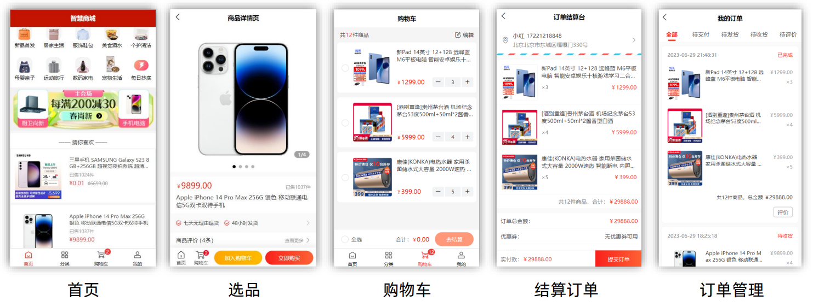


#### 26、项目打包优化

**目标：明确打包的作用。**

vue脚手架只是开发过程中，协助开发的工具，当真正开发完了 => 脚手架不参与上线

参与上线的是 => 打包后的源代码

打包：

- 将多个文件压缩合并成一个文件
- 语法降级
- less sass ts 语法解析, 解析成css
- ....

打包后，可以生成，浏览器能够直接运行的网页 => 就是需要上线的源码！

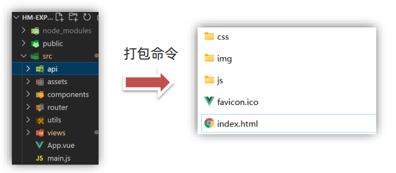


##### 26.1 打包命令

说明：vue脚手架工具已经提供了打包命令，直接使用即可。 

命令：

```bash
yarn build 
```

结果：在项目的根目录会自动创建一个文件夹`dist`, dist中的文件就是打包后的文件，只需要放到服务器中即可。 配置：默认情况下，需要放到服务器根目录打开，如果希望双击运行，需要配置publicPath 配成相对路径。

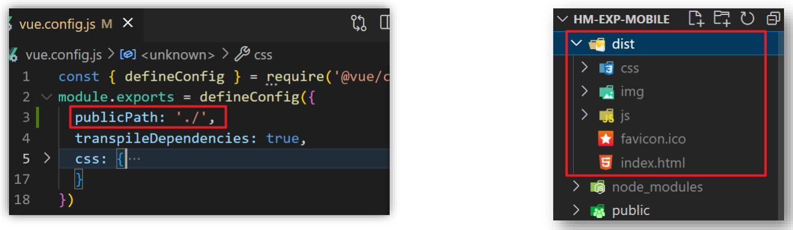


##### 26.2 打包优化：路由懒加载

**目标：配置路由懒加载，实现打包优化**

**说明**：当打包构建应用时，JavaScript 包会变得非常大，影响页面加载。如果我们能把不同路由对应的组件分割成不同 的代码块，然后当路由`被访问的时候才加载对应组件`，这样就更加`高效`了。

> 官方链接：https://router.vuejs.org/zh/guide/advanced/lazy-loading.html#%E4%BD%BF%E7%94%A8-webpack

步骤1：异步组件改造

```js
const ProDetail = () => import('@/views/prodetail')
const Pay = () => import('@/views/pay')
...
```

步骤2：路由中应用

```js
const router = new VueRouter({
routes: [
...
{ path: '/prodetail/:id', component: ProDetail },
{ path: '/pay', component: Pay },
...
```


