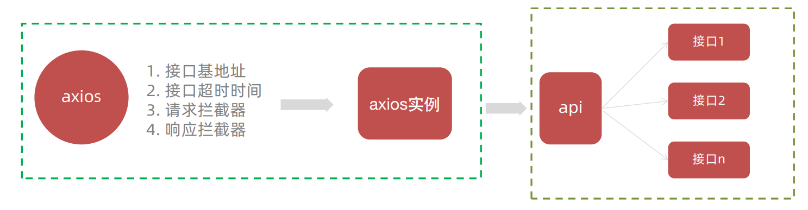
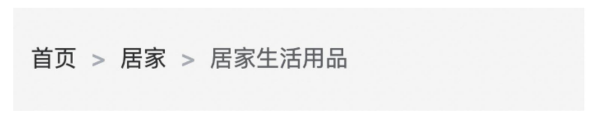
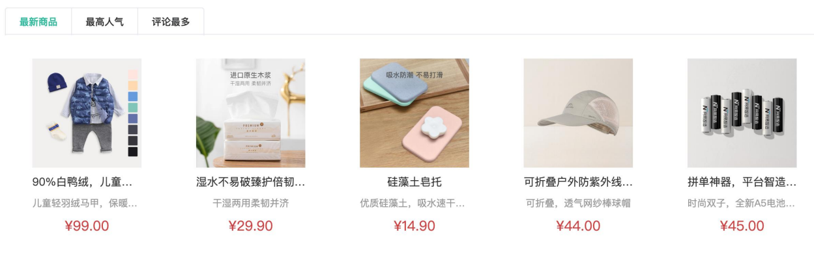
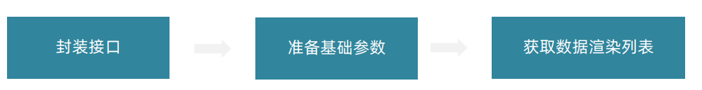
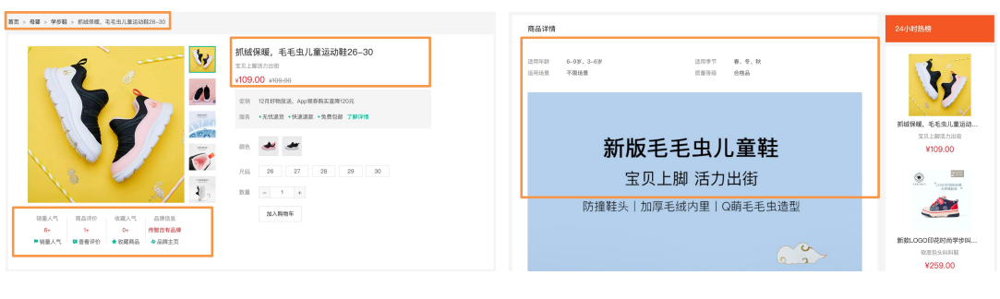
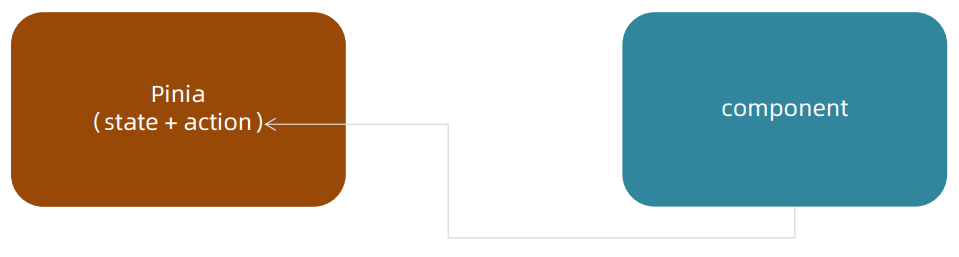
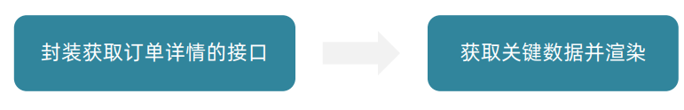

## vue3项目实战—小兔鲜

### 项目架构设计

> 接口文档：[https://www.apifox.cn/apidoc/shared-c05cb8d7-e591-4d9c-aff8-11065a0ec1de/api-67132167](https://www.apifox.cn/apidoc/shared-c05cb8d7-e591-4d9c-aff8-11065a0ec1de/api-67132167)
>

#### 1、项目准备

创建新项目`xtc-pc`:

```bash
npm init vue@latest
```

进入新项目目录下，下载依赖，运行项目：

```bash
cd xtc-pc
npm i / npm install
npm run dev
```


#### 2、目录调整


#### 3、配置

##### 3.1 ElementPlus 按需导入配置

小兔鲜项目组件分类：


小兔鲜项目UI组件会用到ElementPlus库，所以我们需要对其进行导入配置操作。步骤如下：

1. 安装element-plus

```bash
# 安装elementplus --save 表示同时在开发环境及生产环境依赖
npm install element-plus --save
```

2. 按需导入，需要安装`unplugin-vue-components` 和 `unplugin-auto-import`这两款插件

```bash
# -D 表示仅在开发环境下依赖
npm install -D unplugin-vue-components unplugin-auto-import
```

3. 将下列代码插入到`Vite`的配置文件中

```js
// vite.config.ts
import { defineConfig } from 'vite'
import AutoImport from 'unplugin-auto-import/vite'
import Components from 'unplugin-vue-components/vite'
import { ElementPlusResolver } from 'unplugin-vue-components/resolvers'

export default defineConfig({
  // ...
  plugins: [
    // ...
    AutoImport({
      resolvers: [ElementPlusResolver()],
    }),
    Components({
      resolvers: [ElementPlusResolver()],
    }),
  ],
})
```

4. 测试是否配置成功(App.vue)

```jsx
<el-button type="primary">Primary</el-button>
```


##### 3.2 ElementPlus主题定制

小兔鲜主题色和elementPlus默认的主题色存在冲突，通过定制主题让elementPlus的主题色和小兔鲜项目保持一致。


**如何定制？（scss变量替换方案）**


###### 1.安装sass

> 基于vite的项目默认不支持css预处理器，需要开发者单独安装

```bash
npm i sass -D
```

###### 2.准备定制文件 

目录：`styles/element/index.css`。

```scss
/* 只需要重写你需要的即可 */
@forward 'element-plus/theme-chalk/src/common/var.scss' with (
  $colors: (
    'primary': (
      // 主色
      'base': #27ba9b,
    ),
    'success': (
      // 成功色
      'base': #1dc779,
    ),
    'warning': (
      // 警告色
      'base': #ffb302,
    ),
    'danger': (
      // 危险色
      'base': #e26237,
    ),
    'error': (
      // 错误色
      'base': #cf4444,
    ),
  )
)
```


###### 3.自动导入配置- 样式覆盖

> 这里自动导入需要深入到elementPlus的组件中，按照官方的配置文档来
>
> 1. 自动导入定制化样式文件进行样式覆盖
> 2. 按需定制主题配置 （需要安装 unplugin-element-plus）

```js
import { fileURLToPath, URL } from 'node:url'
import { defineConfig } from 'vite'
import vue from '@vitejs/plugin-vue'
import AutoImport from 'unplugin-auto-import/vite'
import Components from 'unplugin-vue-components/vite'
import { ElementPlusResolver } from 'unplugin-vue-components/resolvers'
// 导入对应包
import ElementPlus from 'unplugin-element-plus/vite'
export default defineConfig({
  plugins: [
    vue(),
    AutoImport({
      resolvers: [ElementPlusResolver()],
    }),
    Components({
      resolvers: [ElementPlusResolver()],
    }),
    // 按需定制主题配置
    ElementPlus({
      useSource: true,
    }),
  ],
  resolve: {
    alias: {
      '@': fileURLToPath(new URL('./src', import.meta.url))
    }
  },
  css: {
    preprocessorOptions: {
      scss: {
        // 自动导入定制化样式文件进行样式覆盖
        additionalData: `
          @use "@/styles/element/index.scss" as *;
        `,
      }
    }
  }
})
```


###### 如何验证主题色替换成功？

> 使用el-button按钮组件进行验证，type=”primary ”时显示主色，如果颜色变成了小兔鲜的主色，即为成功。

如下图：


##### 3.3 axios基础配置

> 基地址：http://pcapi-xiaotuxian-front-devtest.itheima.net

1. 安装axios

```bash
npm i axios
```

2. 配置基础实例（统一接口配置）

> 基础配置通常包括：
>
> 1. 实例化 - baseURL + timeout
> 2. 拦截器 - 携带token 401拦截等



```js
// axios基础的封装
import axios from 'axios'

const request =  axios.create({
    baseURL: 'http://pcapi-xiaotuxian-front-devtest.itheima.net',
    timeout: 5000
})

// 添加请求拦截器
request.interceptors.request.use(function (config) {
    // 在发送请求之前做些什么
    return config;
}, function (error) {
    // 对请求错误做些什么
    return Promise.reject(error);
});

// 添加响应拦截器
request.interceptors.response.use(function (response) {
    // 2xx 范围内的状态码都会触发该函数。
    // 对响应数据做点什么
    return response;
}, function (error) {
    // 超出 2xx 范围的状态码都会触发该函数。
    // 对响应错误做点什么
    return Promise.reject(error);
});

export default request

```

3. 测试axios配置是否可以正常调用接口

```js
import request from '@/utils/request'

// 获取商品全部分类
export const getList = () => 
    request.get('/home/category/head')
```

​		App.vue中调用测试：

```js
import { getList } from '@/api/testApi.js'

getList().then(res=>{
    console.log(res)
})
```


如果项目里面不同的业务模块需要的接口基地址不同，该如何来做？

> axios.create()方法可以执行多次，每次执行就会生成一个新的实例，比如：

```js
const request1 = axios.create({baseURL:'url1'})
const request2 = axios.create({baseURL:'url2'})
```


#### 4、项目路由设计

##### 4.1 eslint解决multi-word问题

`eslintrc.cjs`

```js
/* eslint-env node */
module.exports = {
  root: true,
  'extends': [
    'plugin:vue/vue3-essential',
    'eslint:recommended'
  ],
  parserOptions: {
    ecmaVersion: 'latest'
  },
  rules: {
    'vue/multi-word-component-names': 0, // 不在强制要求组件命名 multi-word
  }
}
```


##### 4.2 配置路由

创建如下结构文件：

* 一级路由
  * `views/login/index.vue`
  * `views/layout/index.vue`
* 二级路由
  * `views/home/index.vue`
  * `views/category/index.vue`

路由配置：

```js
import { createRouter, createWebHistory } from 'vue-router'
import Login from '@/views/login/index.vue'
import Layout from '@/views/layout/index.vue'
import Home from '@/views/home/index.vue'
import Category from '@/views/category/index.vue'

const router = createRouter({
  history: createWebHistory(import.meta.env.BASE_URL),
  routes: [
    { 
      path: '/', 
      component:Layout,
      children:[
        { path: '', component: Home },
        { path: '/category', component: Category },
      ]
    },
    { path: '/login', component: Login }, 
  ]
})

export default router
```

注意：

> 路由设计的依据是根据内容切换方式来设计。如果是整体切换就是一级，在一级的部分内容切换则为二级，以此类推。
>
> 默认二级路由可以path配置项置空`path:''`。


#### 5、静态资源引入和 Error Lens安装

##### 5.1 静态资源的引入

资源说明：

> 1. 实际工作中的图片资源通常是由UI设计师提供，常见的图片格式有png，svg等都是由UI切图交给前端。
> 2. 样式资源通常是指项目初始化的时候进行样式重置，常见的比如开源的 normalize.css或者手写。

资源操作：

1. 图片资源 - 把 `images 文件夹放到assets` 目录下
2. 样式资源 - 把 `common.scss 文件放在styles`目录下


##### 5.2 Error Lens 插件安装

error lens是一个实时提供错误警告信息的VSCode插件，方便开发。


#### 6、scss文件自动导入

##### 6.1 为什么要自动导入

安装sass

```bash
npm i sass -D
```

在项目里一些组件共享的色值会以scss变量的方式统一放到一个名为 var.scss 的文件中，正常组件中使用，需要`先导入scss文件，再使用内部的变量`，比较繁琐，自动导入`可以免去手动导入的步骤，直接使用内部的变量`。


##### 6.2 自动导入配置

1. 新增一个 var.scss文件，存入色值变量
2. 通过vite.config.js配置自动导入文件


#### 7、Pinia构建用户仓库 和 持久化


##### 7.1 pinia独立维护

现在：初始化代码在 main.js 中，仓库代码在 stores 中，代码分散职能不单一。

优化：由 stores 统一维护，在 stores/index.js 中完成 pinia 初始化，交付 main.js 使用。

> 官方文档：https://prazdevs.github.io/pinia-plugin-persistedstate/zh/

1. 安装插件 pinia-plugin-persistedstate

```jsx
npm i pinia-plugin-persistedstate
```

2. 将插件添加到`pinia`实例上。(stores/index.js)

```js
import { createPinia } from 'pinia'
import persist from 'pinia-plugin-persistedstate'


const pinia = createPinia()
// 添加到pinia实例上
pinia.use(persist)
export default pinia
```


### 业务实现

#### 1、Layout - 页面结构搭建


##### 1.1 静态页面搭建

###### `LayoutNav.vue`

```jsx
<script setup>

</script>

<template>
  <nav class="app-topnav">
    <div class="container">
      <ul>
        <template v-if="true">
          <li><a href="javascript:;""><i class="iconfont icon-user"></i>周杰伦</a></li>
          <li>
            <el-popconfirm title="确认退出吗?" confirm-button-text="确认" cancel-button-text="取消">
              <template #reference>
                <a href="javascript:;">退出登录</a>
              </template>
            </el-popconfirm>
          </li>
          <li><a href="javascript:;">我的订单</a></li>
          <li><a href="javascript:;">会员中心</a></li>
        </template>
        <template v-else>
          <li><a href="javascript:;">请先登录</a></li>
          <li><a href="javascript:;">帮助中心</a></li>
          <li><a href="javascript:;">关于我们</a></li>
        </template>
      </ul>
    </div>
  </nav>
</template>


<style scoped lang="scss">
.app-topnav {
  background: #333;
  ul {
    display: flex;
    height: 53px;
    justify-content: flex-end;
    align-items: center;
    li {
      a {
        padding: 0 15px;
        color: #cdcdcd;
        line-height: 1;
        display: inline-block;

        i {
          font-size: 14px;
          margin-right: 2px;
        }

        &:hover {
          color: $xtxColor;
        }
      }

      ~li {
        a {
          border-left: 2px solid #666;
        }
      }
    }
  }
}
</style>
```

###### `LayoutHeader.vue`

```jsx
<script setup>

</script>

<template>
  <header class='app-header'>
    <div class="container">
      <h1 class="logo">
        <RouterLink to="/">小兔鲜</RouterLink>
      </h1>
      <ul class="app-header-nav">
        <li class="home">
          <RouterLink to="/">首页</RouterLink>
        </li>
        <li> <RouterLink to="/">居家</RouterLink> </li>
        <li> <RouterLink to="/">美食</RouterLink> </li>
        <li> <RouterLink to="/">服饰</RouterLink> </li>
      </ul>
      <div class="search">
        <i class="iconfont icon-search"></i>
        <input type="text" placeholder="搜一搜">
      </div>
      <!-- 头部购物车 -->
      
    </div>
  </header>
</template>


<style scoped lang='scss'>
.app-header {
  background: #fff;

  .container {
    display: flex;
    align-items: center;
  }

  .logo {
    width: 200px;

    a {
      display: block;
      height: 132px;
      width: 100%;
      text-indent: -9999px;
      background: url('@/assets/images/logo.png') no-repeat center 18px / contain;
    }
  }

  .app-header-nav {
    width: 820px;
    display: flex;
    padding-left: 40px;
    position: relative;
    z-index: 998;
  
    li {
      margin-right: 40px;
      width: 38px;
      text-align: center;
  
      a {
        font-size: 16px;
        line-height: 32px;
        height: 32px;
        display: inline-block;
  
        &:hover {
          color: $xtxColor;
          border-bottom: 1px solid $xtxColor;
        }
      }
  
      .active {
        color: $xtxColor;
        border-bottom: 1px solid $xtxColor;
      }
    }
  }

  .search {
    width: 170px;
    height: 32px;
    position: relative;
    border-bottom: 1px solid #e7e7e7;
    line-height: 32px;

    .icon-search {
      font-size: 18px;
      margin-left: 5px;
    }

    input {
      width: 140px;
      padding-left: 5px;
      color: #666;
    }
  }

  .cart {
    width: 50px;

    .curr {
      height: 32px;
      line-height: 32px;
      text-align: center;
      position: relative;
      display: block;

      .icon-cart {
        font-size: 22px;
      }

      em {
        font-style: normal;
        position: absolute;
        right: 0;
        top: 0;
        padding: 1px 6px;
        line-height: 1;
        background: $helpColor;
        color: #fff;
        font-size: 12px;
        border-radius: 10px;
        font-family: Arial;
      }
    }
  }
}
</style>
```

###### `LayoutFooter.vue`

```jsx
<template>
  <footer class="app_footer">
    <!-- 联系我们 -->
    <div class="contact">
      <div class="container">
        <dl>
          <dt>客户服务</dt>
          <dd><i class="iconfont icon-kefu"></i> 在线客服</dd>
          <dd><i class="iconfont icon-question"></i> 问题反馈</dd>
        </dl>
        <dl>
          <dt>关注我们</dt>
          <dd><i class="iconfont icon-weixin"></i> 公众号</dd>
          <dd><i class="iconfont icon-weibo"></i> 微博</dd>
        </dl>
        <dl>
          <dt>下载APP</dt>
          <dd class="qrcode"></dd>
          <dd class="download">
            <span>扫描二维码</span>
            <span>立马下载APP</span>
            <a href="javascript:;">下载页面</a>
          </dd>
        </dl>
        <dl>
          <dt>服务热线</dt>
          <dd class="hotline">400-0000-000 <small>周一至周日 8:00-18:00</small></dd>
        </dl>
      </div>
    </div>
    <!-- 其它 -->
    <div class="extra">
      <div class="container">
        <div class="slogan">
          <a href="javascript:;">
            <i class="iconfont icon-footer01"></i>
            <span>价格亲民</span>
          </a>
          <a href="javascript:;">
            <i class="iconfont icon-footer02"></i>
            <span>物流快捷</span>
          </a>
          <a href="javascript:;">
            <i class="iconfont icon-footer03"></i>
            <span>品质新鲜</span>
          </a>
        </div>
        <!-- 版权信息 -->
        <div class="copyright">
          <p>
            <a href="javascript:;">关于我们</a>
            <a href="javascript:;">帮助中心</a>
            <a href="javascript:;">售后服务</a>
            <a href="javascript:;">配送与验收</a>
            <a href="javascript:;">商务合作</a>
            <a href="javascript:;">搜索推荐</a>
            <a href="javascript:;">友情链接</a>
          </p>
          <p>CopyRight © 小兔鲜儿</p>
        </div>
      </div>
    </div>
  </footer>
</template>

<style scoped lang='scss'>
.app_footer {
  overflow: hidden;
  background-color: #f5f5f5;
  padding-top: 20px;

  .contact {
    background: #fff;

    .container {
      padding: 60px 0 40px 25px;
      display: flex;
    }

    dl {
      height: 190px;
      text-align: center;
      padding: 0 72px;
      border-right: 1px solid #f2f2f2;
      color: #999;

      &:first-child {
        padding-left: 0;
      }

      &:last-child {
        border-right: none;
        padding-right: 0;
      }
    }

    dt {
      line-height: 1;
      font-size: 18px;
    }

    dd {
      margin: 36px 12px 0 0;
      float: left;
      width: 92px;
      height: 92px;
      padding-top: 10px;
      border: 1px solid #ededed;

      .iconfont {
        font-size: 36px;
        display: block;
        color: #666;
      }

      &:hover {
        .iconfont {
          color: $xtxColor;
        }
      }

      &:last-child {
        margin-right: 0;
      }
    }

    .qrcode {
      width: 92px;
      height: 92px;
      padding: 7px;
      border: 1px solid #ededed;
    }

    .download {
      padding-top: 5px;
      font-size: 14px;
      width: auto;
      height: auto;
      border: none;

      span {
        display: block;
      }

      a {
        display: block;
        line-height: 1;
        padding: 10px 25px;
        margin-top: 5px;
        color: #fff;
        border-radius: 2px;
        background-color: $xtxColor;
      }
    }

    .hotline {
      padding-top: 20px;
      font-size: 22px;
      color: #666;
      width: auto;
      height: auto;
      border: none;

      small {
        display: block;
        font-size: 15px;
        color: #999;
      }
    }
  }

  .extra {
    background-color: #333;
  }

  .slogan {
    height: 178px;
    line-height: 58px;
    padding: 60px 100px;
    border-bottom: 1px solid #434343;
    display: flex;
    justify-content: space-between;

    a {
      height: 58px;
      line-height: 58px;
      color: #fff;
      font-size: 28px;

      i {
        font-size: 50px;
        vertical-align: middle;
        margin-right: 10px;
        font-weight: 100;
      }

      span {
        vertical-align: middle;
        text-shadow: 0 0 1px #333;
      }
    }
  }

  .copyright {
    height: 170px;
    padding-top: 40px;
    text-align: center;
    color: #999;
    font-size: 15px;

    p {
      line-height: 1;
      margin-bottom: 20px;
    }

    a {
      color: #999;
      line-height: 1;
      padding: 0 10px;
      border-right: 1px solid #999;

      &:last-child {
        border-right: none;
      }
    }
  }
}
</style>
```


##### 1.2 页面图标引入

> iconfont官网：https://www.iconfont.cn/help/detail?spm=a313x.home_index.i3.29.58a33a81VAyWVj&helptype=code
>
> 注意：这里我是使用Web端 => font-class 引用

字体图标采用的是阿里的字体图标库，样式文件已经准备好，在 `index.html`文件中引入即可：

```html
  <link rel="stylesheet" href="//at.alicdn.com/t/font_2143783_iq6z4ey5vu.css">
```


##### 1.3 layout 一级导航渲染

使用后端接口渲染一级路由导航


实现步骤：

1. 根据接口文档封装接口函数

2. 发送请求获取数据列表

3. v-for渲染页面

###### 封装接口

`api/layout.js`

```js
import request from '@/utils/request'

export function getCategoryListService(){
    return request({
        url: '/home/category/head',
    })
}
```


###### 发送请求获取数据列表 & v-for渲染页面

`LayoutHeader.vue`

```jsx
<script setup>
import { onMounted, ref } from 'vue'
import { getCategoryListService } from '@/api/layout'

const categoryList = ref([])

function getCategoryList() {
    getCategoryListService().then(res => {
        categoryList.value = res.data.result
    })
}

onMounted(() => {
    getCategoryList()
})
</script>

<template>
    ...
    <ul class="app-header-nav">
        <li class="home" v-for="item in categoryList" :key="item.id">
            <RouterLink to="/">{{item.name}}</RouterLink>
        </li>
    </ul>
    ...
</template>
```


##### 1.4 吸顶导航

要求：浏览器在上下滚动的过程中，如果距离顶部的滚动距离大于78px，吸顶导航显示，小于78px隐藏。


###### 吸顶导航静态结构

`LayoutFixed.vue`

```jsx
<script setup>

</script>

<template>
  <div class="app-header-sticky">
    <div class="container">
      <RouterLink class="logo" to="/" />
      <!-- 导航区域 -->
      <ul class="app-header-nav ">
        <li class="home">
          <RouterLink to="/">首页</RouterLink>
        </li>
        <li>
          <RouterLink to="/">居家</RouterLink>
        </li>
        <li>
          <RouterLink to="/">美食</RouterLink>
        </li>
        <li>
          <RouterLink to="/">服饰</RouterLink>
        </li>
        <li>
          <RouterLink to="/">母婴</RouterLink>
        </li>
        <li>
          <RouterLink to="/">个护</RouterLink>
        </li>
        <li>
          <RouterLink to="/">严选</RouterLink>
        </li>
        <li>
          <RouterLink to="/">数码</RouterLink>
        </li>
        <li>
          <RouterLink to="/">运动</RouterLink>
        </li>
        <li>
          <RouterLink to="/">杂项</RouterLink>
        </li>
      </ul>

      <div class="right">
        <RouterLink to="/">品牌</RouterLink>
        <RouterLink to="/">专题</RouterLink>
      </div>
    </div>
  </div>
</template>


<style scoped lang='scss'>
.app-header-sticky {
  width: 100%;
  height: 80px;
  position: fixed;
  left: 0;
  top: 0;
  z-index: 999;
  background-color: #fff;
  border-bottom: 1px solid #e4e4e4;
  // 此处为关键样式!!!
  // 状态一：往上平移自身高度 + 完全透明
  transform: translateY(-100%);
  opacity: 0;

  // 状态二：移除平移 + 完全不透明
  &.show {
    transition: all 0.3s linear;
    transform: none;
    opacity: 1;
  }

  .container {
    display: flex;
    align-items: center;
  }

  .logo {
    width: 200px;
    height: 80px;
    background: url("@/assets/images/logo.png") no-repeat right 2px;
    background-size: 160px auto;
  }

  .right {
    width: 220px;
    display: flex;
    text-align: center;
    padding-left: 40px;
    border-left: 2px solid $xtxColor;

    a {
      width: 38px;
      margin-right: 40px;
      font-size: 16px;
      line-height: 1;

      &:hover {
        color: $xtxColor;
      }
    }
  }
}

.app-header-nav {
  width: 820px;
  display: flex;
  padding-left: 40px;
  position: relative;
  z-index: 998;

  li {
    margin-right: 40px;
    width: 38px;
    text-align: center;

    a {
      font-size: 16px;
      line-height: 32px;
      height: 32px;
      display: inline-block;

      &:hover {
        color: $xtxColor;
        border-bottom: 1px solid $xtxColor;
      }
    }

    .active {
      color: $xtxColor;
      border-bottom: 1px solid $xtxColor;
    }
  }
}
</style>
```

注意：此处导航的显示与隐藏和样式`show`有关。

###### 获取滚动距离 - vueUse & 根据条件隐藏

获取页面上下滚动距离，我们是可以通过JS实现的，但是这里推荐`vueUse`。

> 什么是vueUse?
>
> * 官网：https://vueuse.netlify.app/guide/
> * vue3出现之后，vue团队基于 组合式API 封装了很多实用函数的js库。
> * 其中有一个函数就可以解决我们目前的问题。

使用`vueUse`：

1. 安装

```bash
npm i @vueuse/core
```

2. 在`LayoutFixed.vue`中使用`useScroll`

```jsx
<script setup>
import { useScroll } from '@vueuse/core'

// 解构出来的y为垂直滚动距离
const { y } = useScroll(window)
</script>

<template>
    <div class="app-header-sticky" :class="{ show: y > 78 }">
        <!-- ...导航内容... -->
    </div>
</template>
```


##### 1.5 pinia优化导航重复请求

###### 为什么要优化


结论：俩个导航中的列表是完全一致的，但是要发送俩次网络请求，存在浪费。通过Pinia集中管理数据，再把数据给组件使用。

###### 如何进行优化


1. 在pinia进行一次请求，将获取的导航数据存储到state中
2. 把state提供给两个组件使用


###### 封装好`pinia`

将创建`pinia`实例放在`stores`目录下，在main.js只需要导入使用即可：

`@/stores/index.js`(以后stores中所有的子模块都是通过它导出)

```js
import { createPinia } from 'pinia'


const pinia = createPinia()
export default pinia
```

`main.js`

```js
import { createApp } from 'vue'
import router from './router'
// 导入pinia
import pinia  from './stores'

import App from './App.vue'


// 引入初始化的样式文件
import '@/styles/common.scss'

const app = createApp(App)
// 注册插件
app.use(pinia)
app.use(router)

app.mount('#app')
```

###### 优化重复请求

`@/stores/modules/layout.js`

```js
import {defineStore} from 'pinia'
import { ref } from 'vue'
import { getCategoryListService } from '@/api/layout'

export const useLayoutStore = defineStore('layout',()=>{

    // state
    // 导航列表
    const categoryList = ref([])

    // action
    // 获取导航列表数据
    function getCategoryList() {
        getCategoryListService().then(res => {
            categoryList.value = res.data.result
        })
    }
    
    return{
        categoryList,
        getCategoryList
    }
})
```

`@/stores/index.js`导出layout模块

```js
// ....
// 导出layout模块
export * from './modules/layout'
```

`@/views/layout/index.vue`中发送请求

```js
//...
import { useLayoutStore } from '@/stores'

const layoutStore = useLayoutStore()
layoutStore.getCategoryList()
```

`LayoutFixed.vue`与`LayoutHeader.vue`中使用获取到的数据

```js
//....
import { useLayoutStore } from '@/stores'
const layoutStore = useLayoutStore()
```

```html
<li v-for="item in layoutStore.categoryList" :key="item.id">
    <RouterLink to="/">{{ item.name }}</RouterLink>
</li>
```


#### 2、Home - 页面结构搭建


实现步骤：

1. 创建对应的Home结构的子组件。
2. 在Home组件中导入子组件，进行对应的布局。
3. 对每个子组件进行细化，实现对应的业务逻辑。

Home组件整体结构(`home/index.vue`)

```jsx
<script setup>
import HomeCategory from './components/HomeCategory.vue'
import HomeBanner from './components/HomeBanner.vue'
import HomeNew from './components/HomeNew.vue'
import HomeHot from './components/HomeHot.vue'
import homeProduct from './components/HomeProduct.vue'
</script>

<template>
  <div class="container">
    <HomeCategory />
    <HomeBanner />
  </div>
  <HomeNew />
  <HomeHot />
  <homeProduct />
</template>
```


##### 2.1 分类实现

分类实现步骤：


###### 分类静态模板

```jsx
<script setup>

</script>

<template>
  <div class="home-category">
    <ul class="menu">
      <li v-for="item in 9" :key="item">
        <RouterLink to="/">居家</RouterLink>
        <RouterLink v-for="i in 2" :key="i" to="/">南北干货</RouterLink>
        <!-- 弹层layer位置 -->
        <div class="layer">
          <h4>分类推荐 <small>根据您的购买或浏览记录推荐</small></h4>
          <ul>
            <li v-for="i in 5" :key="i">
              <RouterLink to="/">
                
                <div class="info">
                  <p class="name ellipsis-2">
                    男士外套
                  </p>
                  <p class="desc ellipsis">男士外套，冬季必选</p>
                  <p class="price"><i>¥</i>200.00</p>
                </div>
              </RouterLink>
            </li>
          </ul>
        </div>
      </li>
    </ul>
  </div>
</template>


<style scoped lang='scss'>
.home-category {
  width: 250px;
  height: 500px;
  background: rgba(0, 0, 0, 0.8);
  position: relative;
  z-index: 99;

  .menu {
    li {
      padding-left: 40px;
      height: 55px;
      line-height: 55px;

      &:hover {
        background: $xtxColor;
      }

      a {
        margin-right: 4px;
        color: #fff;

        &:first-child {
          font-size: 16px;
        }
      }

      .layer {
        width: 990px;
        height: 500px;
        background: rgba(255, 255, 255, 0.8);
        position: absolute;
        left: 250px;
        top: 0;
        display: none;
        padding: 0 15px;

        h4 {
          font-size: 20px;
          font-weight: normal;
          line-height: 80px;

          small {
            font-size: 16px;
            color: #666;
          }
        }

        ul {
          display: flex;
          flex-wrap: wrap;

          li {
            width: 310px;
            height: 120px;
            margin-right: 15px;
            margin-bottom: 15px;
            border: 1px solid #eee;
            border-radius: 4px;
            background: #fff;

            &:nth-child(3n) {
              margin-right: 0;
            }

            a {
              display: flex;
              width: 100%;
              height: 100%;
              align-items: center;
              padding: 10px;

              &:hover {
                background: #e3f9f4;
              }

              img {
                width: 95px;
                height: 95px;
              }

              .info {
                padding-left: 10px;
                line-height: 24px;
                overflow: hidden;

                .name {
                  font-size: 16px;
                  color: #666;
                }

                .desc {
                  color: #999;
                }

                .price {
                  font-size: 22px;
                  color: $priceColor;

                  i {
                    font-size: 16px;
                  }
                }
              }
            }
          }
        }
      }

      // 关键样式  hover状态下的layer盒子变成block
      &:hover {
        .layer {
          display: block;
        }
      }
    }
  }
}
</style>
```

###### 分类列表数据渲染

```jsx
<ul class="menu">
    <li v-for="item in layoutStore.categoryList" :key="item.id">
        <RouterLink to="/">{{item.name}}</RouterLink>
        <RouterLink v-for="i in item.children.slice(0,2)" :key="i.id" to="/">{{i.name}}</RouterLink>
        <!-- 弹层layer位置 -->
        <div class="layer">
            <h4>分类推荐 <small>根据您的购买或浏览记录推荐</small></h4>
            <ul>
                <li v-for="i in item.goods" :key="i.id">
                    <RouterLink to="/">
                        
                        <div class="info">
                            <p class="name ellipsis-2">
                                {{i.name}}
                            </p>
                            <p class="desc ellipsis">{{i.desc}}</p>
                            <p class="price"><i>¥</i>{{i.price}}</p>
                        </div>
                    </RouterLink>
                </li>
            </ul>
        </div>
    </li>
</ul>
```


##### 2.1 Home - banner 轮播图功能实现


步骤：


###### 静态模板

这里我们用到了`elementPlus`中的`Carousel`组件。

```jsx
<script setup>

</script>


<template>
  <div class="home-banner">
    <el-carousel height="500px">
      <el-carousel-item v-for="item in 4" :key="item">
        
      </el-carousel-item>
    </el-carousel>
  </div>
</template>


<style scoped lang='scss'>
.home-banner {
  width: 1240px;
  height: 500px;
  position: absolute;
  left: 0;
  top: 0;
  z-index: 98;

  img {
    width: 100%;
    height: 500px;
  }
}
</style>
```

###### 封装接口，渲染页面

`api/home.js`

```js
import request from "@/utils/request";

// home - 获取轮播图数据
// distributionSite 默认值为 1
export const getHomeBannerDataService = (distributionSite) => request.get('/home/banner',{
    params:{
        distributionSite
    }
})
```

`HomeBanner.vue`页面渲染

```jsx
<script setup>
import { ref, onMounted } from 'vue'
import { getHomeBannerDataService } from '@/api/home'

const bannerList = ref([])
const getHomeBannerData = async () => {
    const res = await getHomeBannerDataService()
    bannerList.value = res.data.result
}
onMounted(()=>{
    getHomeBannerData()
})

</script>

<template>
    <div class="home-banner">
        <el-carousel height="500px">
            <el-carousel-item v-for="item in bannerList" :key="item.id">
                
            </el-carousel-item>
        </el-carousel>
    </div>
</template>
```


##### 2.3 Home - 面板封装

###### 思考

问：组件封装解决了什么问题？

> 答：1. 复用问题  2. 业务维护问题

新鲜好物和人气推荐模块，在`结构上非常相似`，只是内容不同，通过组件封装可以`实现复用结构`的效果。


###### 组件封装

核心思路：把可复用的结构只写一次，把`可能发生变化的部分抽象成组件参数（props / 插槽）`


实现步骤：

1. 不做任何抽象，准备静态模板
2. 抽象可变的部分
   * 主标题和副标题是`纯文本`，可以抽象成`prop`传入
   * 主体内容是`复杂的模板`，抽象成`插槽`传入


###### 面板封装的纯静态结构

```jsx
<script setup>

</script>


<template>
  <div class="home-panel">
    <div class="container">
      <div class="head">
         <!-- 主标题和副标题 -->
        <h3>
          新鲜好物<small>新鲜出炉 品质靠谱</small>
        </h3>
      </div>
      <!-- 主体内容区域 -->
      <div> 主体内容 </div>
    </div>
  </div>
</template>

<style scoped lang='scss'>
.home-panel {
  background-color: #fff;

  .head {
    padding: 40px 0;
    display: flex;
    align-items: flex-end;

    h3 {
      flex: 1;
      font-size: 32px;
      font-weight: normal;
      margin-left: 6px;
      height: 35px;
      line-height: 35px;

      small {
        font-size: 16px;
        color: #999;
        margin-left: 20px;
      }
    }
  }
}
</style>
```

###### 抽象之后的结构

```jsx

```

###### 小结

纯展示类组件通用封装思路：

1. 搭建纯静态的部分，不管可变的部分

2. 抽象可变的部分为组件参数

   > 非复杂的模板抽象成props，复杂的结构模板抽象为插槽。


##### 2.4 Home - 新鲜好物和人气推荐实现

###### 分析


步骤：


1. 导入好上面封装好的面板组件`HomePanel.vue`
2. 根据新鲜好物或人气推荐来定制 Props的传递
3. 封装接口，调用接口获取数据
4. 定制插槽内容，渲染插槽模板

###### 新鲜好物

模板：

```jsx
<script setup>

</script>

<template>
  <div></div>
  <!-- 下面是插槽主体内容模版
  <ul class="goods-list">
    <li v-for="item in newList" :key="item.id">
      <RouterLink to="/">
        
        <p class="name">{{ item.name }}</p>
        <p class="price">&yen;{{ item.price }}</p>
      </RouterLink>
    </li>
  </ul>
  -->
</template>


<style scoped lang='scss'>
.goods-list {
  display: flex;
  justify-content: space-between;
  height: 406px;

  li {
    width: 306px;
    height: 406px;

    background: #f0f9f4;
    transition: all .5s;

    &:hover {
      transform: translate3d(0, -3px, 0);
      box-shadow: 0 3px 8px rgb(0 0 0 / 20%);
    }

    img {
      width: 306px;
      height: 306px;
    }

    p {
      font-size: 22px;
      padding-top: 12px;
      text-align: center;
      text-overflow: ellipsis;
      overflow: hidden;
      white-space: nowrap;
    }

    .price {
      color: $priceColor;
    }
  }
}
</style>
```

封装接口`api/home.js`

```js
/**
 * @description: 获取新鲜好物
 * @param {*}
 * @return {*}
 */
export const findNewService = () => {
  return request({
    url:'/home/new'
  })
}
```

调用接口，渲染页面(`HomeNew.vue`)

```jsx
<script setup>
import HomePanel from './HomePanel.vue'
import { getNewAPI } from '@/apis/home'
import { ref } from 'vue'
const newList = ref([])
const getNewList = async () => {
  const res = await getNewAPI()
  newList.value = res.result
}

getNewList()
</script>

<template>
  <HomePanel title="新鲜好物" sub-title="新鲜出炉 品质靠谱">
    <template #main>
      <ul class="goods-list">
        <li v-for="item in newList" :key="item.id">
          <RouterLink :to="`/detail/${item.id}`">
            
            <p class="name">{{ item.name }}</p>
            <p class="price">&yen;{{ item.price }}</p>
          </RouterLink>
        </li>
      </ul>
    </template>
  </HomePanel>
</template>
```


###### 人气推荐

封装接口`api/home.js`

```js
/**
 * @description: 获取人气推荐
 * @param {*}
 * @return {*}
 */
export const getHotDataService = () =>  request.get('home/hot')
```

模板渲染(`HomeHot.vue`)

```jsx
<script setup>
import HomePanel from './HomePanel.vue'
import { getHotDataService } from '@/api/home'
import { ref, onMounted } from 'vue'
// 获取数据
const hotList = ref([])

const getHotList = async () => {
    const res = await getHotDataService()
    hotList.value = res.data.result
}

onMounted(() => {
    getHotList()
})

</script>

<template>
    <home-panel title="人气推荐" subTitle="人气爆款 不容错过">
        <ul class="goods-list">
            <li v-for="item in hotList" :key="item.id">
                <RouterLink to="/">
                    
                    <p class="name">{{ item.title }}</p>
                    <p class="desc">{{ item.alt }}</p>
                </RouterLink>
            </li>
        </ul>
    </home-panel>
</template>
```


##### 2.5 Home-图片懒加载指令实现

###### 场景和指令用法

场景：电商网站的首页通常会很长，用户不一定能访问到`页面靠下面的图片`，这类图片通过懒加载优化手段可以做到 `只有进入视口区域才发送图片请求`。

指令用法：

```jsx

```

在图片img身上绑定指令，该图片只有在正式进入到视口区域时才会发送图片网络请求。


###### 实现思路和步骤

核心原理：图片进入视口才发送资源请求。


###### 注册指令并使用

`main.js`

```js
app.directive('img-lazy',{
    mounted(el,binding){
        // el:指令绑定的元素 img
        // binding：binding.value 指令后面绑定的表达式的值 img.url
        useIntersectionObserver(
        el,
        ([{ isIntersecting }]) => {
            if(isIntersecting){
                el.src = binding.value
            }
        },)
    }
})
```

`HomeHot.vue`

```jsx
 
```


##### 2.6 懒加载指令优化

###### 问题

问题1：懒加载指令的逻辑直接写到入口文件中，合理吗？

> 不合理，入口文件通常只做一些初始化的事情，不应该包含太多的逻辑代码，可以通过插件的方法把`懒加载指令 封装为插件`，`main.js入口文件只需要负责注册插件即可`。


问题2：重复监听问题

useIntersectionObserver对于元素的监听是一直存在的，除非手动停止监听，存在内存浪费。

> 解决思路：在监听的图片第一次完成加载之后就停止监听。


`directives/index.js`

```js
// 定义懒加载插件
import { useIntersectionObserver } from '@vueuse/core'

export const lazyPlugin = {
  install (app) {
    // 懒加载指令逻辑
    app.directive('img-lazy', {
      mounted (el, binding) {
        // el: 指令绑定的那个元素 img
        // binding: binding.value  指令等于号后面绑定的表达式的值  图片url
        console.log(el, binding.value)
        const { stop } = useIntersectionObserver(
          el,
          ([{ isIntersecting }]) => {
            console.log(isIntersecting)
            if (isIntersecting) {
              // 进入视口区域
              el.src = binding.value
              stop()
            }
          },
        )
      }
    })
  }
}
```

`main.js`

```js
import {lazy} from '@/directives'

app.use(lazy)
```


##### 2.7 Home - Product 产品列表

###### 分析

Product产品列表是一个常规的列表渲染，实现步骤如下：


###### 静态模板

```jsx
<script setup>
import HomePanel from './HomePanel.vue'

</script>

<template>
  <div class="home-product">
    <!-- <HomePanel :title="cate.name" v-for="cate in goodsProduct" :key="cate.id">
      <div class="box">
        <RouterLink class="cover" to="/">
          
          <strong class="label">
            <span>{{ cate.name }}馆</span>
            <span>{{ cate.saleInfo }}</span>
          </strong>
        </RouterLink>
        <ul class="goods-list">
          <li v-for="good in cate.goods" :key="good.id">
            <RouterLink to="/" class="goods-item">
              
              <p class="name ellipsis">{{ good.name }}</p>
              <p class="desc ellipsis">{{ good.desc }}</p>
              <p class="price">&yen;{{ good.price }}</p>
            </RouterLink>
          </li>
        </ul>
      </div>
    </HomePanel> -->
  </div>
</template>

<style scoped lang='scss'>
.home-product {
  background: #fff;
  margin-top: 20px;
  .sub {
    margin-bottom: 2px;

    a {
      padding: 2px 12px;
      font-size: 16px;
      border-radius: 4px;

      &:hover {
        background: $xtxColor;
        color: #fff;
      }

      &:last-child {
        margin-right: 80px;
      }
    }
  }

  .box {
    display: flex;

    .cover {
      width: 240px;
      height: 610px;
      margin-right: 10px;
      position: relative;

      img {
        width: 100%;
        height: 100%;
      }

      .label {
        width: 188px;
        height: 66px;
        display: flex;
        font-size: 18px;
        color: #fff;
        line-height: 66px;
        font-weight: normal;
        position: absolute;
        left: 0;
        top: 50%;
        transform: translate3d(0, -50%, 0);

        span {
          text-align: center;

          &:first-child {
            width: 76px;
            background: rgba(0, 0, 0, 0.9);
          }

          &:last-child {
            flex: 1;
            background: rgba(0, 0, 0, 0.7);
          }
        }
      }
    }

    .goods-list {
      width: 990px;
      display: flex;
      flex-wrap: wrap;

      li {
        width: 240px;
        height: 300px;
        margin-right: 10px;
        margin-bottom: 10px;

        &:nth-last-child(-n + 4) {
          margin-bottom: 0;
        }

        &:nth-child(4n) {
          margin-right: 0;
        }
      }
    }

    .goods-item {
      display: block;
      width: 220px;
      padding: 20px 30px;
      text-align: center;
      transition: all .5s;

      &:hover {
        transform: translate3d(0, -3px, 0);
        box-shadow: 0 3px 8px rgb(0 0 0 / 20%);
      }

      img {
        width: 160px;
        height: 160px;
      }

      p {
        padding-top: 10px;
      }

      .name {
        font-size: 16px;
      }

      .desc {
        color: #999;
        height: 29px;
      }

      .price {
        color: $priceColor;
        font-size: 20px;
      }
    }
  }
}
</style>
```

###### 封装接口

```js
/**
 * @description: 获取所有商品模块
 * @param {*}
 * @return {*}
 */
export const getGoodsListService = () => {
  return request({
    url: '/home/goods'
  })
}
```

###### 渲染列表

```jsx
<script setup>
import HomePanel from './HomePanel.vue'
import { ref, onMounted } from 'vue'
import { getGoodsListService } from '@/api/home'

const goodsProduct = ref([])
const getGoodsList = () => {
    getGoodsListService().then(res => {
        goodsProduct.value = res.data.result
    })
}
onMounted(() => {
    getGoodsList()
})

</script>

<template>
    <div class="home-product">
        <HomePanel :title="cate.name" v-for="cate in goodsProduct" :key="cate.id">
            <div class="box">
                <RouterLink class="cover" to="/">
                    
                    <strong class="label">
                        <span>{{ cate.name }}馆</span>
                        <span>{{ cate.saleInfo }}</span>
                    </strong>
                </RouterLink>
                <ul class="goods-list">
                    <li v-for="good in cate.goods" :key="good.id">
                        <RouterLink to="/" class="goods-item">
                            
                            <p class="name ellipsis">{{ good.name }}</p>
                            <p class="desc ellipsis">{{ good.desc }}</p>
                            <p class="price">&yen;{{ good.price }}</p>
                        </RouterLink>
                    </li>
                </ul>
            </div>
        </HomePanel>
    </div>
</template>
```


##### 2.8 Home - GoodsItem组件封装

###### 为什么要封装GoodsItem组件


在小兔鲜项目的很多个业务模块中都需要用到同样的商品展示模块，没必要重复定义，封装起来，`方便复用`。

###### 如何封装

核心思想：把要显示的数据对象设计为`props参数`，传入什么数据对象就显示什么数据。

```jsx
<script setup>
defineProps({
    good: {
        type: Object,
        default: () => {}
    }
})
</script>

<template>
    <RouterLink to="/" class="goods-item">
        
        <p class="name ellipsis">{{ good.name }}</p>
        <p class="desc ellipsis">{{ good.desc }}</p>
        <p class="price">&yen;{{ good.price }}</p>
    </RouterLink>
</template>

<style scoped lang="scss">
        .goods-item {
            display: block;
            width: 220px;
            padding: 20px 30px;
            text-align: center;
            transition: all .5s;

            &:hover {
                transform: translate3d(0, -3px, 0);
                box-shadow: 0 3px 8px rgb(0 0 0 / 20%);
            }

            img {
                width: 160px;
                height: 160px;
            }

            p {
                padding-top: 10px;
            }

            .name {
                font-size: 16px;
            }

            .desc {
                color: #999;
                height: 29px;
            }

            .price {
                color: $priceColor;
                font-size: 20px;
            }
        }
</style>
```

`HomeProduct.vue`传入参数Props

```js
<GoodsItem :good="good"/>
```


#### 3、一级分类

##### 3.1 静态结构搭建和路由配置

###### 静态结构

```jsx
<script setup>

</script>

<template>
  <div class='top-category'>
    我是分类
  </div>
</template>
```

###### 路由配置

配置动态路由

```jsx
{
    path: 'category/:id',
    component: Category
}
```

###### 配置导航区域连接

`LayoutHeader.vue`/`LayoutFixed.vue`

```jsx
<li v-for="item in categoryStore.categoryList" :key="item.id">
  <RouterLink active-class="active" :to="`/category/${item.id}`">
    {{ item.name }}
  </RouterLink>
</li>
```


##### 3.2 面包屑结构导航渲染

###### 分析


点击导航之后，导航下面会出现一个`面包屑`结构告诉你当前导航路径。

步骤：


###### 认识组件准备模板

```jsx
<script setup>

</script>

<template>
  <div class="top-category">
    <div class="container m-top-20">
      <!-- 面包屑 -->
      <div class="bread-container">
        <el-breadcrumb separator=">">
          <el-breadcrumb-item :to="{ path: '/' }">首页</el-breadcrumb-item>
          <el-breadcrumb-item>居家</el-breadcrumb-item>
        </el-breadcrumb>
      </div>
    </div>
  </div>
</template>


<style scoped lang="scss">
.top-category {
  h3 {
    font-size: 28px;
    color: #666;
    font-weight: normal;
    text-align: center;
    line-height: 100px;
  }

  .sub-list {
    margin-top: 20px;
    background-color: #fff;

    ul {
      display: flex;
      padding: 0 32px;
      flex-wrap: wrap;

      li {
        width: 168px;
        height: 160px;


        a {
          text-align: center;
          display: block;
          font-size: 16px;

          img {
            width: 100px;
            height: 100px;
          }

          p {
            line-height: 40px;
          }

          &:hover {
            color: $xtxColor;
          }
        }
      }
    }
  }

  .ref-goods {
    background-color: #fff;
    margin-top: 20px;
    position: relative;

    .head {
      .xtx-more {
        position: absolute;
        top: 20px;
        right: 20px;
      }

      .tag {
        text-align: center;
        color: #999;
        font-size: 20px;
        position: relative;
        top: -20px;
      }
    }

    .body {
      display: flex;
      justify-content: space-around;
      padding: 0 40px 30px;
    }
  }

  .bread-container {
    padding: 25px 0;
  }
}
</style>
```

###### 封装接口

`api/category.js`

```js
import request from "@/utils/request";
/**
 * @description: 获取分类数据
 * @param {*} id 分类id 
 * @return {*}
 */
export const getCategoryService = (id)=>
    request.get('/category',{params:{id}})
```

###### 调用接口 & 渲染模板

```jsx
<script setup>
import { ref, onMounted } from 'vue'
import { getCategoryService } from '@/api/category'
import { useRoute } from 'vue-router'

const categoryData = ref({})
const route = useRoute()

const getCategory = ()=>{
    getCategoryService(route.params.id).then(res=>{
        console.log(res)
        categoryData.value = res.data.result
    })
}
onMounted(()=>{
    getCategory()
})
</script>

<template>
    <div class="top-category">
        <div class="container m-top-20">
            <!-- 面包屑 -->
            <div class="bread-container">
                <el-breadcrumb separator=">">
                    <el-breadcrumb-item :to="{ path: '/' }">首页</el-breadcrumb-item>
                    <el-breadcrumb-item>{{categoryData.name}}</el-breadcrumb-item>
                </el-breadcrumb>
            </div>
        </div>
    </div>
</template>
```


##### 3.3 banner轮播图功能实现

###### 分类轮播图实现

分类轮播图和首页轮播图的区别只有一个，`接口参数不同`，其余逻辑完成一致。


步骤：


###### 改造接口

`api/home.js`

```js
// home - 获取轮播图数据
export const getHomeBannerDataService = (distributionSite = '1') => request.get('/home/banner',{
    params:{
        distributionSite
    }
})
```

###### 将首页轮播图逻辑迁移到分类页面

`category/index.vue`

```jsx
<script setup>
import { ref, onMounted } from 'vue'
import { getCategoryService } from '@/api/category'
import { getHomeBannerDataService } from '@/api/home'
import { useRoute } from 'vue-router'

const categoryData = ref({})
const route = useRoute()

const getCategory = () => {
    getCategoryService(route.params.id).then(res => {
        console.log(res)
        categoryData.value = res.data.result
    })
}
onMounted(() => {
    getCategory()
})


const bannerList = ref([])
const getHomeBannerData = async () => {
    const res = await getHomeBannerDataService()
    bannerList.value = res.data.result
}
onMounted(() => {
    getHomeBannerData()
})


</script>

<template>
    <div class="top-category">
        <!-- 面包屑 -->
        ...
        <!-- 轮播图 -->
        <div class="home-banner">
            <el-carousel height="500px">
                <el-carousel-item v-for="item in bannerList" :key="item.id">
                    
                </el-carousel-item>
            </el-carousel>
        </div>
    </div>
</template>


<style scoped lang="scss">
...
.home-banner {
    width: 1240px;
    height: 500px;
    margin: 0 auto;

    img {
        width: 100%;
        height: 500px;
    }
}
</style>
```


##### 3.4 一级分类-激活状态显示和分类列表渲染

###### 激活状态显示


RouterLink组件默认支持激活样式显示的类名，只需要给`active-class属性设置对应的类名`即可。

```jsx
<li class="home" v-for="item in layoutStore.categoryList" :key="item.id">
    <RouterLink active-class="actvie" :to='`/category/${item.id}`'>{{item.name}}</RouterLink>
</li>
```

```css
.active {
    color: $xtxColor;
    border-bottom: 1px solid $xtxColor;
}
```

###### 分类列表渲染

分类的数据已经在面包屑导航实现的时候获取到了，只需要通过v-for遍历出来即可。

步骤：


分类列表渲染：

```jsx
<div class="sub-list">
  <h3>全部分类</h3>
  <ul>
    <li v-for="i in categoryData.children" :key="i.id">
      <RouterLink to="/">
        
        <p>{{ i.name }}</p>
      </RouterLink>
    </li>
  </ul>
</div>
<div class="ref-goods" v-for="item in categoryData.children" :key="item.id">
  <div class="head">
    <h3>- {{ item.name }}-</h3>
  </div>
  <div class="body">
    <GoodsItem v-for="good in item.goods" :goods="good" :key="good.id" />
  </div>
</div>
```


##### 3.5 解决路由缓存问题

###### 什么是路由缓存问题


问题：一级分类的切换正好满足上面的条件，组件实例复用，导致`分类数据无法更新` 。

> 解决问题的思路：
>
> 1. 让组件实例不复用，强制销毁重建 
>
> 2. 监听路由变化，变化之后执行数据更新操作


###### 方案一：给router-view添加key

以当前路由完整路径为key的值，给router-view组件绑定。

```jsx
<RouterView :key="$route.fullPath" />
```


###### 方案二：使用onBeforeRouteUpdate导航钩子

onBeforeRouteUpdate钩子函数可以在每次路由更新之前执行，在`回调中执行需要数据更新的业务逻辑`即可。


###### 小结

1. 路由缓存问题产生的原因是什么？

> 路由只有参数变化时，会复用组件实例。

2. 两种方案都可以解决路由缓存问题，如何选择呢？

> 在意性能问题，选择onBeforeUpdate, 精细化控制 不在意性能问题，选择key，简单粗暴。


##### 3.6 使用逻辑函数拆分业务

###### 理解

基于逻辑函数拆分业务是指把`同一个组件中独立的业务代码通过函数做封装处理`，提升`代码的可维护性`。


###### 具体怎么做

实现步骤：

1. 按照业务声明以`use`开头的逻辑函数。
2. 把`独立的业务逻辑`封装到各个函数内部。
3. 函数内部把组件中需要用到的数据或者方法`return`出去。
4. 在`组件中调用函数`把数据或者方法组合回来使用。

```javascript
// 封装分类数据业务相关代码
import { onMounted, ref } from 'vue'
import { getCategoryAPI } from '@/apis/category'
import { useRoute } from 'vue-router'
import { onBeforeRouteUpdate } from 'vue-router'

export function useCategory () {
  // 获取分类数据
  const categoryData = ref({})
  const route = useRoute()
  const getCategory = async (id = route.params.id) => {
    const res = await getCategoryAPI(id)
    categoryData.value = res.result
  }
  onMounted(() => getCategory())

  // 目标:路由参数变化的时候 可以把分类数据接口重新发送
  onBeforeRouteUpdate((to) => {
    // 存在问题：使用最新的路由参数请求最新的分类数据
    getCategory(to.params.id)
  })
  return {
    categoryData
  }
}
```

```javascript
// 封装banner轮播图相关的业务代码
import { ref, onMounted } from 'vue'
import { getBannerAPI } from '@/apis/home'

export function useBanner () {
  const bannerList = ref([])

  const getBanner = async () => {
    const res = await getBannerAPI({
      distributionSite: '2'
    })
    console.log(res)
    bannerList.value = res.result
  }

  onMounted(() => getBanner())

  return {
    bannerList
  }
}
```

```vue
<script setup>

import GoodsItem from '../Home/components/GoodsItem.vue'
import { useBanner } from './composables/useBanner'
import { useCategory } from './composables/useCategory'
const { bannerList } = useBanner()
const { categoryData } = useCategory()

</script>
```


###### 核心思想

1. 逻辑拆分的过程是一个拆分再组合的过程


2. 函数use打头，内部封装逻辑，return组件需要用到的数据和方法给组件消费


#### 4、二级分类


##### 4.1 配置二级路由

###### 组件模板

`views/subCategory/index.vue`

```jsx
<script setup>


</script>

<template>
  <div class="container ">
    <!-- 面包屑 -->
    <div class="bread-container">
      <el-breadcrumb separator=">">
        <el-breadcrumb-item :to="{ path: '/' }">首页</el-breadcrumb-item>
        <el-breadcrumb-item :to="{ path: '/' }">居家
        </el-breadcrumb-item>
        <el-breadcrumb-item>居家生活用品</el-breadcrumb-item>
      </el-breadcrumb>
    </div>
    <div class="sub-container">
      <el-tabs>
        <el-tab-pane label="最新商品" name="publishTime"></el-tab-pane>
        <el-tab-pane label="最高人气" name="orderNum"></el-tab-pane>
        <el-tab-pane label="评论最多" name="evaluateNum"></el-tab-pane>
      </el-tabs>
      <div class="body">
         <!-- 商品列表-->
      </div>
    </div>
  </div>

</template>


<style lang="scss" scoped>
.bread-container {
  padding: 25px 0;
  color: #666;
}

.sub-container {
  padding: 20px 10px;
  background-color: #fff;

  .body {
    display: flex;
    flex-wrap: wrap;
    padding: 0 10px;
  }

  .goods-item {
    display: block;
    width: 220px;
    margin-right: 20px;
    padding: 20px 30px;
    text-align: center;

    img {
      width: 160px;
      height: 160px;
    }

    p {
      padding-top: 10px;
    }

    .name {
      font-size: 16px;
    }

    .desc {
      color: #999;
      height: 29px;
    }

    .price {
      color: $priceColor;
      font-size: 20px;
    }
  }

  .pagination-container {
    margin-top: 20px;
    display: flex;
    justify-content: center;
  }


}
</style>
```

###### 路由配置

```js
routes: [
    { 
        path: '/', 
        component:Layout,
        children:[
            { path: '', component: Home },
            { path: '/category/:id', component: Category },
            { path: '/category/sub/:id', component:subCategory}
        ]
    },
    { path: '/login', component: Login }, 
]
```

###### 跳转配置

`category/index.vue`

```jsx
 <!-- 分类列表 -->
<div class="sub-list">
    <h3>全部分类</h3>
    <ul>
        <li v-for="i in categoryData.children" :key="i.id">
            <RouterLink :to='`/category/sub/${i.id}`'>
                
                <p>{{ i.name }}</p>
            </RouterLink>
        </li>
    </ul>
</div>
```


##### 4.2 面包屑导航实现

###### 分析

效果：



步骤：


###### 封装接口

```js
/**
 * @description: 获取二级分类列表数据
 * @param {*} id 分类id 
 * @return {*}
 */

export const getSubCategoryService = (id) => {
  return request({
    url:'/category/sub/filter',
    params:{
      id
    }
  })
}
```

###### 渲染面包屑实现跳转

```jsx
<div class="bread-container">
    <el-breadcrumb separator=">">
        <el-breadcrumb-item :to="{ path: '/' }">首页</el-breadcrumb-item>
        <el-breadcrumb-item :to="{ path: `/category/${subCategoryData.parentId}` }">{{ subCategoryData.parentName }}
        </el-breadcrumb-item>
        <el-breadcrumb-item>{{subCategoryData.name}}</el-breadcrumb-item>
    </el-breadcrumb>
</div>
```


##### 4.3 分类基本商品列表

###### 整体业务梳理

商品列表效果：



实现步骤：


###### 分类基本商品列表分析

步骤：



###### 封装接口

```js
/**
 * @description: 获取导航数据
 * @data { 
     categoryId: 1005000 ,
     page: 1,
     pageSize: 20,
     sortField: 'publishTime' | 'orderNum' | 'evaluateNum'
   } 
 * @return {*}
 */
export const getSubCategoryAPI = (data) => {
  return request({
    url:'/category/goods/temporary',
    method:'POST',
    data
  })
}
```

###### 分类数据渲染

`subCategory/index.vue`

```jsx
<div class="body">
    <!-- 商品列表-->
    <GoodsItem v-for="good in goodList" :key="good.id" :good="good"></GoodsItem>
</div>
```


##### 4.4 添加筛选参数实现筛选功能(接上4.3)

###### 分析

通过tab标签来筛选商品：


> 核心逻辑：点击tab，切换筛选条件参数sortField，重新发送列表请求。

步骤：


###### 列表筛选数据实现

> 通过v-model绑定tabs选中的数据，结合`el-tabs`来实现筛选的效果，每次tab切换就发送数据请求。对`Tabs`不熟悉可以参考elementPlus官网。

```jsx
<script setup>
// tab切换回调
const tabChange = () => {
  console.log('tab切换了', reqData.value.sortField)
  reqData.value.page = 1
  getGoodList()
}
</script>

<template>
  <el-tabs v-model="reqData.sortField" @tab-change="tabChange">
    <el-tab-pane label="最新商品" name="publishTime"></el-tab-pane>
    <el-tab-pane label="最高人气" name="orderNum"></el-tab-pane>
    <el-tab-pane label="评论最多" name="evaluateNum"></el-tab-pane>
  </el-tabs>
</template>
```


##### 4.5 列表无限加载

###### 分析


> 核心实现逻辑：使用elementPlus提供的 **v-infinite-scroll** 指令监听`是否满足触底条件`，满足加载条件时让`页数参数加 一获取下一页数据`，`做新老数据拼接渲染`。

步骤：


> 基础思路
>
> 1. 触底条件满足之后 page++，拉取下一页数据
> 2. 新老数据做数组拼接
> 3. 判断是否已经全部加载完毕，停止监听

```jsx
<script setup>
// 禁用无限加载
const disabled = ref(false)

// 商品列表实现无限加载功能
const load = async () => {
    reqData.value.page++
    const res = await getSubCategoryDataService(reqData.value)
    goodList.value = [...goodList.value, ...res.data.result.items]
    if(res.data.result.items.length === 0){
        disabled.value = true
    }
}
</script>

<template>
    <div class="body" v-infinite-scroll="load" :infinite-scroll-disabled="disabled">
        <!-- 商品列表-->
        <GoodsItem v-for="good in goodList" :key="good.id" :good="good"></GoodsItem>
    </div>
    <div v-loading="loading" element-loading-text="加载中..." style="text-align:center; color:#999;">
        <p v-show="loading" style="height:80px"></p>
        <p v-if="disabled">没有更多商品了!</p>
    </div>
</template>
```


##### 4.6 路由定制滚动行为

###### 定制路由行为解决什么问题

在不同路由切换的时候，可以自动滚动到页面的顶部，而不是停留在原先的位置。

> 如何配置？vue-router支持 scrollBehavior 配置项，可以指定路由切换时的滚动位置

`router/index.js`

```js
const router = createRouter({
  ...
  scrollBehavior(){
    return { top:0 }
  }
})
```


#### 5、详情页

##### 5.1 创建详情页和配置路由

###### 分析

点击某个商品会跳转到商品的详情页：


实现步骤：


###### 静态结构

`views/detail/index.vue`

```jsx
<script setup>


</script>

<template>
  <div class="xtx-goods-page">
    <div class="container">
      <div class="bread-container">
        <el-breadcrumb separator=">">
          <el-breadcrumb-item :to="{ path: '/' }">首页</el-breadcrumb-item>
          <el-breadcrumb-item :to="{ path: '/' }">母婴
          </el-breadcrumb-item>
          <el-breadcrumb-item :to="{ path: '/' }">跑步鞋
          </el-breadcrumb-item>
          <el-breadcrumb-item>抓绒保暖，毛毛虫子儿童运动鞋</el-breadcrumb-item>
        </el-breadcrumb>
      </div>
      <!-- 商品信息 -->
      <div class="info-container">
        <div>
          <div class="goods-info">
            <div class="media">
              <!-- 图片预览区 -->

              <!-- 统计数量 -->
              <ul class="goods-sales">
                <li>
                  <p>销量人气</p>
                  <p> 100+ </p>
                  <p><i class="iconfont icon-task-filling"></i>销量人气</p>
                </li>
                <li>
                  <p>商品评价</p>
                  <p>200+</p>
                  <p><i class="iconfont icon-comment-filling"></i>查看评价</p>
                </li>
                <li>
                  <p>收藏人气</p>
                  <p>300+</p>
                  <p><i class="iconfont icon-favorite-filling"></i>收藏商品</p>
                </li>
                <li>
                  <p>品牌信息</p>
                  <p>400+</p>
                  <p><i class="iconfont icon-dynamic-filling"></i>品牌主页</p>
                </li>
              </ul>
            </div>
            <div class="spec">
              <!-- 商品信息区 -->
              <p class="g-name"> 抓绒保暖，毛毛虫儿童鞋 </p>
              <p class="g-desc">好穿 </p>
              <p class="g-price">
                <span>200</span>
                <span> 100</span>
              </p>
              <div class="g-service">
                <dl>
                  <dt>促销</dt>
                  <dd>12月好物放送，App领券购买直降120元</dd>
                </dl>
                <dl>
                  <dt>服务</dt>
                  <dd>
                    <span>无忧退货</span>
                    <span>快速退款</span>
                    <span>免费包邮</span>
                    <a href="javascript:;">了解详情</a>
                  </dd>
                </dl>
              </div>
              <!-- sku组件 -->

              <!-- 数据组件 -->

              <!-- 按钮组件 -->
              <div>
                <el-button size="large" class="btn">
                  加入购物车
                </el-button>
              </div>

            </div>
          </div>
          <div class="goods-footer">
            <div class="goods-article">
              <!-- 商品详情 -->
              <div class="goods-tabs">
                <nav>
                  <a>商品详情</a>
                </nav>
                <div class="goods-detail">
                  <!-- 属性 -->
                  <ul class="attrs">
                    <li v-for="item in 3" :key="item.value">
                      <span class="dt">白色</span>
                      <span class="dd">纯棉</span>
                    </li>
                  </ul>
                  <!-- 图片 -->

                </div>
              </div>
            </div>
            <!-- 24热榜+专题推荐 -->
            <div class="goods-aside">

            </div>
          </div>
        </div>
      </div>
    </div>
  </div>
</template>


<style scoped lang='scss'>
.xtx-goods-page {
  .goods-info {
    min-height: 600px;
    background: #fff;
    display: flex;

    .media {
      width: 580px;
      height: 600px;
      padding: 30px 50px;
    }

    .spec {
      flex: 1;
      padding: 30px 30px 30px 0;
    }
  }

  .goods-footer {
    display: flex;
    margin-top: 20px;

    .goods-article {
      width: 940px;
      margin-right: 20px;
    }

    .goods-aside {
      width: 280px;
      min-height: 1000px;
    }
  }

  .goods-tabs {
    min-height: 600px;
    background: #fff;
  }

  .goods-warn {
    min-height: 600px;
    background: #fff;
    margin-top: 20px;
  }

  .number-box {
    display: flex;
    align-items: center;

    .label {
      width: 60px;
      color: #999;
      padding-left: 10px;
    }
  }

  .g-name {
    font-size: 22px;
  }

  .g-desc {
    color: #999;
    margin-top: 10px;
  }

  .g-price {
    margin-top: 10px;

    span {
      &::before {
        content: "¥";
        font-size: 14px;
      }

      &:first-child {
        color: $priceColor;
        margin-right: 10px;
        font-size: 22px;
      }

      &:last-child {
        color: #999;
        text-decoration: line-through;
        font-size: 16px;
      }
    }
  }

  .g-service {
    background: #f5f5f5;
    width: 500px;
    padding: 20px 10px 0 10px;
    margin-top: 10px;

    dl {
      padding-bottom: 20px;
      display: flex;
      align-items: center;

      dt {
        width: 50px;
        color: #999;
      }

      dd {
        color: #666;

        &:last-child {
          span {
            margin-right: 10px;

            &::before {
              content: "•";
              color: $xtxColor;
              margin-right: 2px;
            }
          }

          a {
            color: $xtxColor;
          }
        }
      }
    }
  }

  .goods-sales {
    display: flex;
    width: 400px;
    align-items: center;
    text-align: center;
    height: 140px;

    li {
      flex: 1;
      position: relative;

      ~li::after {
        position: absolute;
        top: 10px;
        left: 0;
        height: 60px;
        border-left: 1px solid #e4e4e4;
        content: "";
      }

      p {
        &:first-child {
          color: #999;
        }

        &:nth-child(2) {
          color: $priceColor;
          margin-top: 10px;
        }

        &:last-child {
          color: #666;
          margin-top: 10px;

          i {
            color: $xtxColor;
            font-size: 14px;
            margin-right: 2px;
          }

          &:hover {
            color: $xtxColor;
            cursor: pointer;
          }
        }
      }
    }
  }
}

.goods-tabs {
  min-height: 600px;
  background: #fff;

  nav {
    height: 70px;
    line-height: 70px;
    display: flex;
    border-bottom: 1px solid #f5f5f5;

    a {
      padding: 0 40px;
      font-size: 18px;
      position: relative;

      >span {
        color: $priceColor;
        font-size: 16px;
        margin-left: 10px;
      }
    }
  }
}

.goods-detail {
  padding: 40px;

  .attrs {
    display: flex;
    flex-wrap: wrap;
    margin-bottom: 30px;

    li {
      display: flex;
      margin-bottom: 10px;
      width: 50%;

      .dt {
        width: 100px;
        color: #999;
      }

      .dd {
        flex: 1;
        color: #666;
      }
    }
  }

  >img {
    width: 100%;
  }
}

.btn {
  margin-top: 20px;

}

.bread-container {
  padding: 25px 0;
}
</style>
```

###### 路由配置

```js
const router = createRouter({
  history: createWebHistory(import.meta.env.BASE_URL),
  // path和component对应关系的位置
  routes: [
    {
      path: '/',
      component: Layout,
      children: [
        {
          path: '',
          component: Home
        },
        {
          path: 'category/:id',
          component: Category
        },
        {
          path: 'category/sub/:id',
          component: SubCategory
        },
        {
          path: 'detail/:id',
          component: Detail
        }
      ]
    },
    {
      path: '/login',
      component: Login
    }
  ],
  // 路由滚动行为定制
  scrollBehavior () {
    return {
      top: 0
    }
  }
})
```

###### 绑定模板进行跳转

`GoodsItem.vue`等商品类组件修改跳转路由即可。

```jsx
<RouterLink :to="`/detail/${item.id}`">
    
    <p class="name">{{ item.name }}</p>
    <p class="price">&yen;{{ item.price }}</p>
</RouterLink>
```


##### 5.2 渲染基础数据

###### 分析



步骤：


###### 封装接口

```js
import request from '@/utils/request'


export const getDetailDataService = (id) => {
  return request({
    url: '/goods',
    params: {
      id
    }
  })
}
```

###### 基础数据渲染

```jsx
<script setup>
import { ref, onMounted } from 'vue'
import { useRoute } from 'vue-router'
import { getDetailDataService } from '@/api/detail'

const detailData = ref({})
const route = useRoute()
const getDetailData = async () => {
    const res = await getDetailDataService(route.params.id)
    detailData.value = res.data.result
}

onMounted(() => {
    getDetailData()
})
</script>

<template>
    <div class="xtx-goods-page">
        <div class="container" v-if="detailData.id">
            <div class="bread-container">
                <el-breadcrumb separator=">">
                    <el-breadcrumb-item :to="{ path: '/' }">首页</el-breadcrumb-item>
                    <!-- 
                        错误原因：goods一开始{}  {}.categories -> undefined  -> undefined[1]
                        1. 可选链的语法?. 
                        2. v-if手动控制渲染时机 保证只有数据存在才渲染
                    -->
                    <el-breadcrumb-item :to="{ path: `/category/${detailData.categories[1].id}` }">{{
                        detailData.categories[1].name }}
                    </el-breadcrumb-item>
                    <el-breadcrumb-item :to="{ path: `/category/sub/${detailData.categories[0].id}` }">{{
                        detailData.categories[0].name }}
                    </el-breadcrumb-item>
                    <el-breadcrumb-item>{{ detailData.name }}</el-breadcrumb-item>
                </el-breadcrumb>
            </div>
            <!-- 商品信息 -->
            <div class="info-container">
                <div>
                    <div class="goods-info">
                        <div class="media">
                            <!-- 图片预览区 -->

                            <!-- 统计数量 -->
                            <ul class="goods-sales">
                                <li>
                                    <p>销量人气</p>
                                    <p> {{detailData.salesCount }}+ </p>
                                    <p><i class="iconfont icon-task-filling"></i>销量人气</p>
                                </li>
                                <li>
                                    <p>商品评价</p>
                                    <p>{{ detailData.commentCount }}+</p>
                                    <p><i class="iconfont icon-comment-filling"></i>查看评价</p>
                                </li>
                                <li>
                                    <p>收藏人气</p>
                                    <p>{{ detailData.collectCount }}+</p>
                                    <p><i class="iconfont icon-favorite-filling"></i>收藏商品</p>
                                </li>
                                <li>
                                    <p>品牌信息</p>
                                    <p>{{ detailData.brand.name }}</p>
                                    <p><i class="iconfont icon-dynamic-filling"></i>品牌主页</p>
                                </li>
                            </ul>
                        </div>
                        <div class="spec">
                            <!-- 商品信息区 -->
                            <p class="g-name"> {{detailData.name}} </p>
                            <p class="g-desc">{{detailData.desc}} </p>
                            <p class="g-price">
                                <span>{{detailData.price}}</span>
                                <span> {{detailData.oldPrice}}</span>
                            </p>
                            <div class="g-service">
                                <dl>
                                    <dt>促销</dt>
                                    <dd>12月好物放送，App领券购买直降120元</dd>
                                </dl>
                                <dl>
                                    <dt>服务</dt>
                                    <dd>
                                        <span>无忧退货</span>
                                        <span>快速退款</span>
                                        <span>免费包邮</span>
                                        <a href="javascript:;">了解详情</a>
                                    </dd>
                                </dl>
                            </div>
                            <!-- sku组件 -->

                            <!-- 数据组件 -->

                            <!-- 按钮组件 -->
                            <div>
                                <el-button size="large" class="btn">
                                    加入购物车
                                </el-button>
                            </div>

                        </div>
                    </div>
                    <div class="goods-footer">
                        <div class="goods-article">
                            <!-- 商品详情 -->
                            <div class="goods-tabs">
                                <nav>
                                    <a>商品详情</a>
                                </nav>
                                <div class="goods-detail">
                                    <!-- 属性 -->
                                    <ul class="attrs">
                                        <li v-for="item in detailData.details.properties" :key="item.value">
                                            <span class="dt">{{item.name}}</span>
                                            <span class="dd">{{item.value}}</span>
                                        </li>
                                    </ul>
                                    <!-- 图片 -->
                                      
                                </div>
                            </div>
                        </div>
                        <!-- 24热榜+专题推荐 -->
                        <div class="goods-aside">

                        </div>
                    </div>
                </div>
            </div>
        </div>
    </div>
</template>
```

###### 注意事项


##### 5.3 热榜区域实现

###### 模板实现分析


结论：两块热榜相比，`结构一致，标题title和列表内容不同`。

实现步骤：


###### 封装Hot热榜组件

1. 组件模板

```jsx
<script setup>

</script>


<template>
  <div class="goods-hot">
    <h3>周日榜单</h3>
    <!-- 商品区块 -->
    <RouterLink to="/" class="goods-item" v-for="item in 3" :key="item.id">
      
      <p class="name ellipsis">一双男鞋</p>
      <p class="desc ellipsis">一双好穿的男鞋</p>
      <p class="price">&yen;200.00</p>
    </RouterLink>
  </div>
</template>


<style scoped lang="scss">
.goods-hot {
  h3 {
    height: 70px;
    background: $helpColor;
    color: #fff;
    font-size: 18px;
    line-height: 70px;
    padding-left: 25px;
    margin-bottom: 10px;
    font-weight: normal;
  }

  .goods-item {
    display: block;
    padding: 20px 30px;
    text-align: center;
    background: #fff;

    img {
      width: 160px;
      height: 160px;
    }

    p {
      padding-top: 10px;
    }

    .name {
      font-size: 16px;
    }

    .desc {
      color: #999;
      height: 29px;
    }

    .price {
      color: $priceColor;
      font-size: 20px;
    }
  }
}
</style>
```

2. 封装接口 `detail.js`

```js
/**
 * 获取热榜商品
 * @param {Number} id - 商品id
 * @param {Number} type - 1代表24小时热销榜 2代表周热销榜
 * @param {Number} limit - 获取个数
 */
export const getHotGoodsService = ({ id, type, limit = 3 }) => {
  return request({
    url:'/goods/hot',
    params:{
      id, 
      type, 
      limit
    }
  })
}
```

3. 渲染数据

```jsx
<script setup>
import { ref,onMounted } from 'vue'
import {useRoute} from 'vue-router'
import { getHotGoodsService } from '@/api/detail'

const route = useRoute()
const hotGoods = ref([])
const getHotGoods = async () => {
    const res = await getHotGoodsService({
        id:route.params.id,
        type:1
    })
    hotGoods.value = res.data.result
}
onMounted(()=>{
    getHotGoods()
})


</script>


<template>
    <div class="goods-hot">
        <h3>周日榜单</h3>
        <!-- 商品区块 -->
        <RouterLink to="/" class="goods-item" v-for="item in hotGoods" :key="item.id">
            
            <p class="name ellipsis">{{ item.name }}</p>
            <p class="desc ellipsis">{{ item.desc }}</p>
            <p class="price">&yen;{{ item.price  }}</p>
        </RouterLink>
    </div>
</template>
```


###### 适配热榜类型

根据不同的标题Title来适配不同的热榜类型。

> 设计Props参数，来是适配不同的title和数据

```jsx
const props = defineProps({
    hotType: {
        type: Number
    }
})
// 适配title 1-24小时热榜 2-周热榜
const TYPEMAP = {
    '1': '24小时热榜',
    '2': '周热榜'
}
const title = computed(() => TYPEMAP[props.hotType])

<h3>{{ title }}</h3>
```


##### 5.4 图片预览组件封装

###### 分析

1. 通过小图切换大图显示


2. 放大镜效果


###### 小图切大图实现

思路：维护一个数组图片列表，`鼠标划入小图记录当前小图下标值，通过下标值 在数组中取对应图片`，显示到大图位置。

```js
['url1','url2','url3','url4']
```

步骤：


###### 准备模板

`@/components/imgView/index.vue`

```jsx
<script setup>
// 图片列表
const imageList = [
    "https://yanxuan-item.nosdn.127.net/d917c92e663c5ed0bb577c7ded73e4ec.png",
    "https://yanxuan-item.nosdn.127.net/e801b9572f0b0c02a52952b01adab967.jpg",
    "https://yanxuan-item.nosdn.127.net/b52c447ad472d51adbdde1a83f550ac2.jpg",
    "https://yanxuan-item.nosdn.127.net/f93243224dc37674dfca5874fe089c60.jpg",
    "https://yanxuan-item.nosdn.127.net/f881cfe7de9a576aaeea6ee0d1d24823.jpg"
]
</script>


<template>
    <div class="goods-image">
        <!-- 左侧大图-->
        <div class="middle" ref="target">
            
            <!-- 蒙层小滑块 -->
            <div class="layer" :style="{ left: `0px`, top: `0px` }"></div>
        </div>
        <!-- 小图列表 -->
        <ul class="small">
            <li v-for="(img, i) in imageList" :key="i">
                
            </li>
        </ul>
        <!-- 放大镜大图 -->
        <div class="large" :style="[
            {
                backgroundImage: `url(${imageList[0]})`,
                backgroundPositionX: `0px`,
                backgroundPositionY: `0px`,
            },
        ]" v-show="false"></div>
    </div>
</template>

<style scoped lang="scss">
.goods-image {
    width: 480px;
    height: 400px;
    position: relative;
    display: flex;

    .middle {
        width: 400px;
        height: 400px;
        background: #f5f5f5;
    }

    .large {
        position: absolute;
        top: 0;
        left: 412px;
        width: 400px;
        height: 400px;
        z-index: 500;
        box-shadow: 0 0 10px rgba(0, 0, 0, 0.1);
        background-repeat: no-repeat;
        // 背景图:盒子的大小 = 2:1  将来控制背景图的移动来实现放大的效果查看 background-position
        background-size: 800px 800px;
        background-color: #f8f8f8;
    }

    .layer {
        width: 200px;
        height: 200px;
        background: rgba(0, 0, 0, 0.2);
        // 绝对定位 然后跟随咱们鼠标控制left和top属性就可以让滑块移动起来
        left: 0;
        top: 0;
        position: absolute;
    }

    .small {
        width: 80px;

        li {
            width: 68px;
            height: 68px;
            margin-left: 12px;
            margin-bottom: 15px;
            cursor: pointer;

            &:hover,
            &.active {
                border: 2px solid $xtxColor;
            }
        }
    }
}
</style>
```

###### 给小图标绑定事件，记录当前激活下标

```jsx
<script setup>
import { ref } from "vue"
// 1.小图切大图显示
const activeIndex = ref(0)
const handleEnter = (i)=>{
    activeIndex.value = i
}
    
</script>

<!-- 小图列表 -->
    <ul class="small">
        <li v-for="(img, i) in imageList" :key="i" @mouseenter="handleEnter(i)" >
            
                </li>
</ul>
```

###### 下标切换大图显示

```jsx
<!-- 左侧大图-->
<div class="middle" ref="target">
    
    <!-- 蒙层小滑块 -->
    <div class="layer" :style="{ left: `0px`, top: `0px` }"></div>
</div>
```

###### 通过下标激活状态显示

```jsx
<!-- 小图列表 -->
<ul class="small">
    <li v-for="(img, i) in imageList" :key="i" @mouseenter="handleEnter(i)" :class="{active:i=== activeIndex }">
        
    </li>
</ul>
```


##### 5.5 图片预览组件-放大镜功能

###### 放大镜实现


功能拆解：

1. 左侧滑块(**蒙层**)跟随鼠标移动
2. 右侧大图放大效果实现
3. 鼠标移入控制滑块和大图显示隐藏

###### 滑块跟随鼠标移动


思路：获取当前的`鼠标在盒子内相对位置(useMouseInElement)`，控制滑块跟随鼠标移动(left/top)。


1. 有效移动范围内的计算逻辑

   > 横向:100 < elementX < 300，left = elementX - 小滑块宽度一半 
   >
   > 纵向: 100 < elementY < 300，top = elementY - 小滑块高度一半 

2. 边界距离控制 

   > 横向：elementX > 300 left = 200 elementX < 100 left = 0 
   >
   > 纵向：elementY > 300 top = 200 elementY < 100 top = 

```jsx
<script setup>
import { ref, watch } from 'vue'
import { useMouseInElement } from '@vueuse/core'

// 1.小图切换大图显示
const activeIndex = ref(0)

const handleEnter = (i)=>{
    activeIndex.value = i
}

// 2. 获取鼠标相对位置
const target = ref(null)
const { elementX, elementY, isOutside } = useMouseInElement(target)

// 3. 控制滑块跟随鼠标移动（监听elementX/Y变化，一旦变化 重新设置left/top）
const left = ref(0)
const top = ref(0)

const positionX = ref(0)
const positionY = ref(0)
watch([elementX, elementY, isOutside], () => {
  console.log('xy变化了')
  // 如果鼠标没有移入到盒子里面 直接不执行后面的逻辑
  if (isOutside.value) return
  console.log('后续逻辑执行了')
  // 有效范围内控制滑块距离
  // 横向
  if (elementX.value > 100 && elementX.value < 300) {
    left.value = elementX.value - 100
  }
  // 纵向
  if (elementY.value > 100 && elementY.value < 300) {
    top.value = elementY.value - 100
  }

  // 处理边界
  if (elementX.value > 300) { left.value = 200 }
  if (elementX.value < 100) { left.value = 0 }

  if (elementY.value > 300) { top.value = 200 }
  if (elementY.value < 100) { top.value = 0 }
})
</script>


<!-- 蒙层小滑块 -->
<div class="layer" :style="{ left: `${left}px`, top: `${top}px` }"></div>
```

###### 大图效果实现


效果：为实现放大效果，大图的宽高是小图的2倍 。

思路：大图的移动方向和滑块移动方向相反，且数值为2倍。

```jsx
<script setup>
...
// 3.控制小滑块跟随鼠标移动 （监听elementX/elementY变化，一旦变化，小滑块跟着变化）

// 右侧大图坐标
const positionX = ref(0)
const positionY = ref(0)

watch([elementX, elementY], () => {
    // 如果鼠标在图片外，则不进行下列业务逻辑(因为该函数不管是在盒子内还是盒子外都会触发)
    if (isOutside.value) return
    // 有效范围内控制滑块距离
    // 横向
    if (elementX.value >= 100 && elementX.value <= 300) {
        left.value = elementX.value - 100
    }
    // 纵向
    if (elementY.value >= 100 && elementY.value <= 300) {
        top.value = elementY.value - 100
    }

    // 处理边界
    if (elementX.value > 300) { left.value = 200 }
    if (elementX.value < 100) { left.value = 0 }
    if (elementY.value > 300) { top.value = 200 }
    if (elementY.value < 100) { top.value = 0 }

    // 放大图的坐标
    positionX.value = -left.value * 2
    positionY.value = -top.value * 2
})
</script>

<!-- 放大镜大图 -->
<div class="large" :style="[{
    backgroundImage: `url(${imageList[activeIndex]})`,
    backgroundPositionX: `${positionX}px`,
    backgroundPositionY: `${positionY}px`,
},]"></div>
```

###### 小滑块和大图的显隐

鼠标移入盒子（isOutside），滑块和大图才显示（v-show)。

> isOutside：鼠标是否在盒子外，是=>true。
>
> 这里我们就可以通过`isOutside`取反来判断在鼠标在盒子内，小滑块和大图就显示，反之则隐藏。

```jsx
  <!-- 蒙层小滑块 -->
<div class="layer" v-show="!isOutside" :style="{ left: `${left}px`, top: `${top}px` }"></div>


<!-- 放大镜大图 -->
<div class="large" :style="[{
    backgroundImage: `url(${imageList[activeIndex]})`,
    backgroundPositionX: `${positionX}px`,
    backgroundPositionY: `${positionY}px`,
},]" v-show="!isOutside"></div>
```


##### 5.6 图片预览组件-Props

###### 组件props适配

组件中的图片列表不能写死，需要通过props参数把接口数据传入。

```js
// 图片列表
defineProps({
    imageList: {
        type: Array,
        default: () => []
    }
})
```

`detail/index.vue`

```jsx
<!-- 图片预览区 -->
<imgView :imageList="detailData.mainPictures"/>
```


###### 图片预览组件总结

1. 封装复杂交互组件的通用思路


2. 图片预览组件的封装逻辑


##### 5.7 SKU组件

###### 认识SKU

存货单位（英语：stock keeping unit，SKU/ˌɛsˌkeɪˈjuː/），也翻译为库存单元，是一个会计学名词，定义为库存管理 中的最小可用单元，例如纺织品中一个SKU通常表示规格、颜色、款式，而在连锁零售门店中有时称单品为一个SKU。


SKU组件的作用：`产出当前用户选择的商品规格`，为加入购物车操作提供数据信息。

SKU组件的作用是为了让用户能够选择商品的规格，从而提交购物车，在选择的过程中，组件的`选中状态`要进行更新， 组件还要`提示用户当前规格是否禁用`，每次选择都要`产出对应的Sku数据`


###### SKU组件

问：在实际工作中，经常会遇到别人写好的组件，熟悉一个三方组件，首先重点看什么？

> 答：props和emit，props决定了当前组件接收什么数据，emit决定了会产出什么数据。

验证组件是否成功使用：


###### 点击规格更新选中状态


核心思路：

> 1. 如果当前已经激活了，就取消激活 
> 2. 如果当前未激活，就把和自己同排的其他规格取消激活，再把自己激活

 响应式数据设计：

> 每一个规格项都添加一个selected字段来决定是否激活，true为激活，false为未激活 

样式处理： 

> 使用selected配合动态class属性，selected为true就显示对应激活类名


###### 点击规格更新禁用状态 - 生成有效路径字典(1)

规格禁用的判断依据是什么？


> 核心原理：当前的规格Sku，或者组合起来的规格Sku，在skus数组中对应项的库存为零时，当前规格会被禁用，生成 路径字典是为了`协助和简化这个匹配过程`。


###### 点击规格更新禁用状态 - 生成有效路径字典(2)


实现步骤：

1. 根据库存字段得到有效的Sku数组
2. 根据有效的Sku数组使用powerSet算法得到所有的子集
3. 根据子集生成路径字典对象

###### 点击规格更新禁用状态 - 初始化规格禁用

思路：遍历每一个规格对象，使用name字段作为key去路径字典pathMap中做匹配，匹配不上则禁用。


>怎么做到显示上的禁用呢？ 
>
>1. 通过增加disabled字段，匹配上路径字段，disabled为false, 匹配不上路径字段，disabled为true 
>2. 配合动态类名控制禁用类名

###### 点击规格更新禁用状态 - 点击时组合禁用更新


思路（点击规格时）：

1. 按照顺序得到规格选中项的数组`['蓝色','20cm',undefined]`

2. 遍历每一个规格

   2.1 把name字段的值填充到对应的位置 

   2.2 过滤掉undefined项使用join方法形成一个有效的key 

   2.3 使用key去pathMap中进行匹配，匹配不上，则当前项禁用

###### 产出有效的SKU信息

什么是有效的SKU？


如何判断当前用户已经选择了所有有效的规格？

> 已选择项数组 [‘蓝色’，‘20cm’, undefined] 中找不到undefined, 那么用户已经选择了所有的有效规格，此时可以产出数据

如何获取当前的SKU信息对象？ 

> 把已选择项数组拼接为路径字典的key，去路径字典pathMap中找即可


###### 思考问题


##### 5.8 通用组件统一注册全局

###### 为什么要优化

背景：components目录下有可能还会有很多其他通用型组件，有可能在多个业务模块中共享，所有统一进行全局组件 注册比较好。


###### 插件开发 & 插件注册

`components/index.js`

```js
import imgView from './imgView/index.vue'
import Sku from './XtxSku/index.vue'

export const componentPlugin = {
    install (app) {
    // app.component('组件名字'，组件配置对象)
    app.component('XtxImageView', imgView)
    app.component('XtxSku', Sku)
  }
}
```

`main.js`

```js
// 引入全局组件插件
import { componentPlugin } from '@/components'

app.use(componentPlugin)
```


#### 6、登录页

##### 6.1 登录模板&路由配置

###### 登录账号和密码

| heima282 | hm#qd@23! |
| -------- | --------- |
| heima283 | hm#qd@23! |
| heima284 | hm#qd@23! |
| heima285 | hm#qd@23! |

###### 登录模板

```jsx
<script setup>

</script>


<template>
    <div>
        <header class="login-header">
            <div class="container m-top-20">
                <h1 class="logo">
                    <RouterLink to="/">小兔鲜</RouterLink>
                </h1>
                <RouterLink class="entry" to="/">
                    进入网站首页
                    <i class="iconfont icon-angle-right"></i>
                    <i class="iconfont icon-angle-right"></i>
                </RouterLink>
            </div>
        </header>
        <section class="login-section">
            <div class="wrapper">
                <nav>
                    <a href="javascript:;">账户登录</a>
                </nav>
                <div class="account-box">
                    <div class="form">
                        <el-form label-position="right" label-width="60px" status-icon>
                            <el-form-item label="账户">
                                <el-input />
                            </el-form-item>
                            <el-form-item label="密码">
                                <el-input />
                            </el-form-item>
                            <el-form-item label-width="22px">
                                <el-checkbox size="large">
                                    我已同意隐私条款和服务条款
                                </el-checkbox>
                            </el-form-item>
                            <el-button size="large" class="subBtn">点击登录</el-button>
                        </el-form>
                    </div>
                </div>
            </div>
        </section>

        <footer class="login-footer">
            <div class="container">
                <p>
                    <a href="javascript:;">关于我们</a>
                    <a href="javascript:;">帮助中心</a>
                    <a href="javascript:;">售后服务</a>
                    <a href="javascript:;">配送与验收</a>
                    <a href="javascript:;">商务合作</a>
                    <a href="javascript:;">搜索推荐</a>
                    <a href="javascript:;">友情链接</a>
                </p>
                <p>CopyRight &copy; 小兔鲜儿</p>
            </div>
        </footer>
    </div>
</template>

<style scoped lang='scss'>
.login-header {
    background: #fff;
    border-bottom: 1px solid #e4e4e4;

    .container {
        display: flex;
        align-items: flex-end;
        justify-content: space-between;
    }

    .logo {
        width: 200px;

        a {
            display: block;
            height: 132px;
            width: 100%;
            text-indent: -9999px;
            background: url("@/assets/images/logo.png") no-repeat center 18px / contain;
        }
    }

    .sub {
        flex: 1;
        font-size: 24px;
        font-weight: normal;
        margin-bottom: 38px;
        margin-left: 20px;
        color: #666;
    }

    .entry {
        width: 120px;
        margin-bottom: 38px;
        font-size: 16px;

        i {
            font-size: 14px;
            color: $xtxColor;
            letter-spacing: -5px;
        }
    }
}

.login-section {
    background: url('@/assets/images/login-bg.png') no-repeat center / cover;
    height: 488px;
    position: relative;

    .wrapper {
        width: 380px;
        background: #fff;
        position: absolute;
        left: 50%;
        top: 54px;
        transform: translate3d(100px, 0, 0);
        box-shadow: 0 0 10px rgba(0, 0, 0, 0.15);

        nav {
            font-size: 14px;
            height: 55px;
            margin-bottom: 20px;
            border-bottom: 1px solid #f5f5f5;
            display: flex;
            padding: 0 40px;
            text-align: right;
            align-items: center;

            a {
                flex: 1;
                line-height: 1;
                display: inline-block;
                font-size: 18px;
                position: relative;
                text-align: center;
            }
        }
    }
}

.login-footer {
    padding: 30px 0 50px;
    background: #fff;

    p {
        text-align: center;
        color: #999;
        padding-top: 20px;

        a {
            line-height: 1;
            padding: 0 10px;
            color: #999;
            display: inline-block;

            ~a {
                border-left: 1px solid #ccc;
            }
        }
    }
}

.account-box {
    .toggle {
        padding: 15px 40px;
        text-align: right;

        a {
            color: $xtxColor;

            i {
                font-size: 14px;
            }
        }
    }

    .form {
        padding: 0 20px 20px 20px;

        &-item {
            margin-bottom: 28px;

            .input {
                position: relative;
                height: 36px;

                >i {
                    width: 34px;
                    height: 34px;
                    background: #cfcdcd;
                    color: #fff;
                    position: absolute;
                    left: 1px;
                    top: 1px;
                    text-align: center;
                    line-height: 34px;
                    font-size: 18px;
                }

                input {
                    padding-left: 44px;
                    border: 1px solid #cfcdcd;
                    height: 36px;
                    line-height: 36px;
                    width: 100%;

                    &.error {
                        border-color: $priceColor;
                    }

                    &.active,
                    &:focus {
                        border-color: $xtxColor;
                    }
                }

                .code {
                    position: absolute;
                    right: 1px;
                    top: 1px;
                    text-align: center;
                    line-height: 34px;
                    font-size: 14px;
                    background: #f5f5f5;
                    color: #666;
                    width: 90px;
                    height: 34px;
                    cursor: pointer;
                }
            }

            >.error {
                position: absolute;
                font-size: 12px;
                line-height: 28px;
                color: $priceColor;

                i {
                    font-size: 14px;
                    margin-right: 2px;
                }
            }
        }

        .agree {
            a {
                color: #069;
            }
        }

        .btn {
            display: block;
            width: 100%;
            height: 40px;
            color: #fff;
            text-align: center;
            line-height: 40px;
            background: $xtxColor;

            &.disabled {
                background: #cfcdcd;
            }
        }
    }

    .action {
        padding: 20px 40px;
        display: flex;
        justify-content: space-between;
        align-items: center;

        .url {
            a {
                color: #999;
                margin-left: 10px;
            }
        }
    }
}

.subBtn {
    background: $xtxColor;
    width: 100%;
    color: #fff;
}
</style>
```

###### 配置路由跳转

`LayoutNav.vue`

```jsx
 <li><a href="javascript:;" @click="router.push('/login')">请先登录</a></li>
```


##### 6.2 表单校验

###### 为什么要校验

作用：前端提前校验可以`省去一些错误的请求提交`，为后端节省接口压力。


###### 表单如何进行校验

1. 原生JS函数校验
2. `elementPlus等框架的表单校验功能(此项目我们用的是elementPlus)`

ElementPlus表单组件内置了表单校验功能，只需要按照组件要求配置必要参数即可（直接看文档）。


思想：当功能很复杂时，通过`多个组件各自负责某个小功能`，`再组合成一个大功能`是组件设计中的常用方法。

###### 表单校验步骤

步骤：


要求：

> 用户名：不能为空，字段名为 account 。
>
> 密码：不能为空且为6-14个字符，字段名为 password。
>
> 同意协议：必选，字段名为 agree。

###### 根据接口字段创建表单对象并绑定

```jsx
import { ref } from 'vue'
// 1.准备表单对象
const form = ref({
    account: '',
    password: ''
})

<!-- 表单绑定数据对象 -->
<el-form :model="form" label-position="right" label-width="60px" status-icon>
...
</el-form>
```

###### 按照要求配置校验规则

配置规则对象，并给表单绑定

```jsx
// 2.配置表单校验规则
const rules = {
    account:[
        { required: true, message: '请输入用户名', trigger: 'blur' }
    ],
    password:[
        { required: true, message: '请输入密码', trigger: 'blur'},
        {min: 6, max: 14, message: '密码长度在6-14位之间', trigger: 'blur'}
    ]
}

<!-- 表单绑定规则对象 -->
<el-form :rules="rules" :model="form" label-position="right" label-width="60px" status-icon>
...
</el-form> 
```

指定表单域校验字段名，把表单元素进行双向绑定。

```jsx
<el-form-item label="账户" prop="account">
    <el-input v-model="form.account" />
</el-form-item>
<el-form-item label="密码" prop="password">
    <el-input v-model="password"/>
</el-form-item>
```

###### 自定义表单校验规则

ElementPlus表单组件内置了初始的校验配置，应付简单的校验只需要`通过配置`即可，如果想要定制一些`特殊的校验需求，可以使用自定义校验规则`，格式如下：

```js
{
    validator:(rule,val,callback) =>{
        // rule:自定义校验逻辑
        // value:当前输入的数据
        // callback:校验处理函数 检验通过或者没通过都需要调用
    }
}
```

在该项目中需要用到`自定义校验规则`的地方是《同意协议》：


elementPlus并没有配置复选框需要的规则，所以我们需要自己定义和配置。

> 校验逻辑：如果勾选了协议框，通过校验，如果没有勾选，不通过校验

```jsx
// 配置表单校验规则
const rules = {
    account:[
        { required: true, message: '请输入用户名', trigger: 'blur' }
    ],
    password:[
        { required: true, message: '请输入密码', trigger: 'blur'},
        {min: 6, max: 14, message: '密码长度在6-14位之间', trigger: 'blur'}
    ],
    agree:[
        {
            validator: (rule, val, callback) => {
                return val ? callback() : new Error('请先同意协议')
            }
        }
    ]
}

<el-form-item label-width="22px" prop="agree">
    <el-checkbox size="large" v-model="form.agree">
        我已同意隐私条款和服务条款
    </el-checkbox>
</el-form-item>
```

###### 整个表单验证

思考：每个表单域都有自己的校验触发事件，如果用户一上来就点击登录怎么办呢？ 

> 答：在点击登录时需要对所有需要校验的表单进行统一校验.


步骤：


##### 6.3 基础登录业务实现

###### 登录业务流程


###### 封装登录接口

```js
/**
 * @description:用户名&密码登录
 * @data {
        account:string
        password:string
 * }
 * @return {*}
 */
export const userLoginService = (data)=>
    request.post('/login',data)
```

###### 登录组件中调用接口实现登录功能

```jsx
<script setup>
    ...
    // 3.表单统一校验
    const formRef = ref(null)
    // 4.点击表单时需要进行统一校验
    const handleSubmit = () => {
        const { account, password } = form.value
        formRef.value.validate(async (valid) => {
            // valid:只有当所有校验规则都通过时，valid为true
            if (valid) {
                // 校验通过 => TODO login
                // 1.调用登录接口，发送请求
                await userLoginService({ account, password })
                // 2.提示用户已经登录成功了
                ElMessage.success('登录成功')
                // 3.跳转到首页
                router.replace('/')
            }
        })
    }
</script>

<el-button @click="handleSubmit" size="large" class="subBtn">点击登录</el-button>
```


##### 6.4 pinia管理用户数据

###### 为什么要用Pinia管理数据

由于用户数据的特殊性，在很多组件中都有可能进行共享，共享的数据使用Pinia管理会更加方便。


###### 如何使用Pinia管理数据

遵循理念：和数据相关的所有操作（state + action）都放到Pinia中，组件只负责触发action函数。



代码实现(stores/modules/user.js)

```jsx
import {defineStore} from 'pinia'
import {ref} from 'vue'
import {userLoginService} from '@/api/login'

export const useUserStore = defineStore('user',()=>{
    // 1.定义管理的用户数据 state
    const userInfo = ref({})
    // 2.定义对数据(获取/增加/修改/删除)的action函数
    const getUserInfo = async ({account,password})=>{
        const res = await userLoginService({account,password})
        userInfo.value = res.data.result
    }

    // 3.把 state 和 action 以对象的形式导出
    return {
        userInfo,
        getUserInfo
    }
})
```

导出user模块(stores/index.js)

```js
export * from './modules/user'
```

login组件调用

```jsx
import { useUserStore } from '@/stores'

const userStore = useUserStore()
const handleSubmit = () => {
    formRef.value.validate(async (valid) => {
        // valid:只有当所有校验规则都通过时，valid为true
        if (valid) {
            // 校验通过 => TODO login
            // 1.调用登录接口，发送请求
            await userStore.getUserInfo(form.value)
            // 2.提示用户已经登录成功了
            ElMessage.success('登录成功')
            // 3.跳转到首页
            router.replace('/')
        }
    })
}
```


##### 6.5 pinia持久化数据

###### 说明

1. 用户数据中有一个关键的数据叫做Token （用来标识当前用户是否登录），而Token持续一段时间才会过期 
2. Pinia的存储是基于内存的，刷新就丢失，为了保持登录状态就要做到刷新不丢失，需要配合持久化进行存储

>目的：保持token不丢失，保持登录状态 。
>
>最终效果：操作state时会自动把用户数据在本地的localStorage也存一份，刷新的时候会从localStorage中先取。

在项目设计时我们已经安装了插件`pinia-plugin-persistedstate`，且将插件挂载到了pinia实例上，后面我们只需要使用即可。

###### 实现持久化


对需要进行数据持久化的`user`模块进行配置：

```js
export const useUserStore = defineStore('user',()=>{
    // 1.定义管理的用户数据 state
    const userInfo = ref({})
    // 2.定义对数据(获取/增加/修改/删除)的action函数
    const getUserInfo = async ({account,password})=>{
        const res = await userLoginService({account,password})
        userInfo.value = res.data.result
    }

    // 3.把 state 和 action 以对象的形式导出
    return {
        userInfo,
        getUserInfo
    }
},
{
    // 启用持久化
    persist:true
})
```

验证：


##### 6.6 登录和非登录状态模板适配

###### 理解


###### 多模板适配的通用思路

> 思路：有几个需要适配的模版就准备几个template片段，通过条件渲染控制显示即可。


`LayoutNav.vue`

```jsx
<script setup>
import {useUserStore} from '@/stores'
const userStore = useUserStore()
</script>

<template>
    <nav class="app-topnav">
        <div class="container">
            <ul>
                <!-- 多模板渲染 区分登录和非登录状态 -->

                <!-- 适配思路：登录时显示第一块，非登录时显示第二块 有token-->
                <template v-if="userStore.userInfo.token">
                    <li><a href="javascript:;"><i class=" iconfont icon-user"></i>{{userStore.userInfo.account }}</a></li>
                    <li>
                        <el-popconfirm title="确认退出吗?" confirm-button-text="确认" cancel-button-text="取消">
                            <template #reference>
                                <a href="javascript:;">退出登录</a>
                            </template>
                        </el-popconfirm>
                    </li>
                    <li><a href="javascript:;">我的订单</a></li>
                    <li><a href="javascript:;">会员中心</a></li>
                </template>
                <!-- 第二块：没有token -->
                <template v-else>
                    <li><a href="javascript:;" @click="$router.push('/login')">请先登录</a></li>
                    <li><a href="javascript:;">帮助中心</a></li>
                    <li><a href="javascript:;">关于我们</a></li>
                </template>
            </ul>
        </div>
    </nav>
</template>
```


##### 6.7 请求拦截器携带Token

###### 为什么请求拦截器中需要加上token

Token作为用户标识，在很多个接口中都需要携带Token才可以正确获取数据，所以需要在接口调用时携带Token。另 外，为了统一控制采取请求拦截器携带的方案。


###### 如何配置

Axios请求拦截器可以在接口正式发起之前对请求参数做一些事情，通常Token数据会被注入到`请求header`中，格式按照`后端要求的格式`进行拼接处理。

> 基础思想：很多接口如果想要获取数据必须要带着有效的Token信息才可以，拦截器中做一次，后面有调用接口时需要`Token`则不需要反复携带token，一劳永逸。

```js
// 添加请求拦截器
request.interceptors.request.use(function (config) {
    // 在发送请求之前做些什么
    // 1.从 userStore中获取token
    const userStore = useUserStore()
    const token = userStore.userInfo.token
    // 2.将token追加到请求头上(某些页面需要权限访问)
    config.headers.Authorization =`Bearer ` + token
    return config;
  }, function (error) {
    // 对请求错误做些什么
    return Promise.reject(error);
  });
```


##### 6.8 退出登录业务

###### 业务实现效果


步骤：


###### user模块清除数据业务

```js
export const useUserStore = defineStore('user',()=>{
    // 1.定义管理的用户数据 state
    const userInfo = ref({})
    const token = ref('')
    // 2.定义对数据(获取/增加/修改/删除)的action函数
    const getUserInfo = async ({account,password})=>{
        const res = await userLoginService({account,password})
        userInfo.value = res.data.result
        token.value = res.data.result.token
    }
    const clearUserInfo = ()=>{
        userInfo.value = {} 
        token.value = ''
    }
    // 3.把 state 和 action 以对象的形式导出
    return {
        token,
        userInfo,
        getUserInfo,
        clearUserInfo
    }
},
{
    // 启用持久化
    persist:true
})
```

> 注意：pinia持久化插件会把返回数据中带token键值对提取出来，单独作为一个属性来存放在localStorage中，如果我们只清除userInfo中的数据，token的数据还会被保留在本地存储中。这就是为什么我会单独另外创建一个token的存储令牌的原因。

###### 确认按钮的业务逻辑

给`el-popconfirm`添加confirm事件监听。

```jsx
<el-popconfirm title="确认退出吗?" @confirm="handleConfirm" confirm-button-text="确认" cancel-button-text="取消">
    <template #reference>
        <a href="javascript:;">退出登录</a>
    </template>
</el-popconfirm>
```

confirm事件中需要处理的业务逻辑：

```js
import {useUserStore} from '@/stores'
import {useRouter} from 'vue-router'

const router = useRouter()
const userStore = useUserStore()
// 退出登录
const handleConfirm = ()=>{
    // 1.清除用户信息
    userStore.clearUserInfo()
    // 2.跳转到登录页(这个操作可以由路由完成，路由守卫。当token不存在时，跳转到登录页)
    router.push('/login')
}
```


##### 6.9 Token失效401处理

###### 业务背景

Token的有效性可以保持一定时间，如果`用户一段时间不做任何操作/Token已经超出有效时间`，Token就会失效。这个时候，如果使用失效的Token去请求一些接口，`接口就会报401的状态码错误`。

这时，就需要前端做额外的处理。

两个需要思考的问题：

1. 我们能确定用户到底是在访问哪一个接口出现401错误的吗？在什么位置去拦截这个401？
2. 检测到401之后该去干些什么？

> 解决方案 — axios响应拦截器中统一处理

步骤：


#### 7、购物车

##### 7.1 购物车业务逻辑梳理拆解


1. 整个购物车的实现分为两个大分支，`本地购物车操作和接口购物车操作`。
2. 由于购物车数据的特殊性，`采取Pinia管理购物车列表数据并添加持久化缓存`。


##### 7.2 本地购物车

###### 加入购物车实现

步骤：


```js
// 购物车商品对象
{
    id:detailData.value.id,      // 商品id
    name:detailData.value.name,  // 商品名称
    picture:detailData.value.mainPictures[0],   // 商品图片
    price:detailData.value.price,   // 商品价格
    count:COUNT.value,  // 商品数量
    skuId:skuObj.skuId,  // 规格id
    attrsText:skuObj.specsText,  // 规格的文本
    selected:true   // 商品是否选中
}
```

###### 封装购物车stores模块

```js
// 封装购物车模块
import {defineStore} from 'pinia'
import {ref} from 'vue'

export const useCartStore = defineStore('cart',()=>{
    // 1.定义cart模块的state数据
    const cartList = ref([])

    // 2.定义cart模块的action函数
    // 添加购物车操作
    const addCart = (cartObj) =>{
        // 购物车添加业务逻辑
        const item = cartList.value.find(item => item.skuId === cartObj.skuId)
        if(item){
            item.count++
        }else{
            cartList.value.push(cartObj)
        }
    }

    // 3.返回cart模块中的state和action
    return {
        cartList,
        addCart
    }
},{
    persist:'true'
})
```

###### 头部购物车列表渲染

实现效果：


步骤：


头部购物车模板：(`layout/components/HeaderCart.vue`)

```jsx
<script setup>

</script>

<template>
  <div class="cart">
    <a class="curr" href="javascript:;">
      <i class="iconfont icon-cart"></i><em>2</em>
    </a>
    <div class="layer">
      <div class="list">
        <!--
        <div class="item" v-for="i in cartList" :key="i">
          <RouterLink to="">
            
            <div class="center">
              <p class="name ellipsis-2">
                {{ i.name }}
              </p>
              <p class="attr ellipsis">{{ i.attrsText }}</p>
            </div>
            <div class="right">
              <p class="price">&yen;{{ i.price }}</p>
              <p class="count">x{{ i.count }}</p>
            </div>
          </RouterLink>
          <i class="iconfont icon-close-new" @click="store.delCart(i.skuId)"></i>
        </div>
        -->
      </div>
      <div class="foot">
        <div class="total">
          <p>共 10 件商品</p>
          <p>&yen; 100.00 </p>
        </div>
        <el-button size="large" type="primary" >去购物车结算</el-button>
      </div>
    </div>
</div>
</template>

<style scoped lang="scss">
.cart {
  width: 50px;
  position: relative;
  z-index: 600;

  .curr {
    height: 32px;
    line-height: 32px;
    text-align: center;
    position: relative;
    display: block;

    .icon-cart {
      font-size: 22px;
    }

    em {
      font-style: normal;
      position: absolute;
      right: 0;
      top: 0;
      padding: 1px 6px;
      line-height: 1;
      background: $helpColor;
      color: #fff;
      font-size: 12px;
      border-radius: 10px;
      font-family: Arial;
    }
  }

  &:hover {
    .layer {
      opacity: 1;
      transform: none;
    }
  }

  .layer {
    opacity: 0;
    transition: all 0.4s 0.2s;
    transform: translateY(-200px) scale(1, 0);
    width: 400px;
    height: 400px;
    position: absolute;
    top: 50px;
    right: 0;
    box-shadow: 0 0 10px rgba(0, 0, 0, 0.2);
    background: #fff;
    border-radius: 4px;
    padding-top: 10px;

    &::before {
      content: "";
      position: absolute;
      right: 14px;
      top: -10px;
      width: 20px;
      height: 20px;
      background: #fff;
      transform: scale(0.6, 1) rotate(45deg);
      box-shadow: -3px -3px 5px rgba(0, 0, 0, 0.1);
    }

    .foot {
      position: absolute;
      left: 0;
      bottom: 0;
      height: 70px;
      width: 100%;
      padding: 10px;
      display: flex;
      justify-content: space-between;
      background: #f8f8f8;
      align-items: center;

      .total {
        padding-left: 10px;
        color: #999;

        p {
          &:last-child {
            font-size: 18px;
            color: $priceColor;
          }
        }
      }
    }
  }

  .list {
    height: 310px;
    overflow: auto;
    padding: 0 10px;

    &::-webkit-scrollbar {
      width: 10px;
      height: 10px;
    }

    &::-webkit-scrollbar-track {
      background: #f8f8f8;
      border-radius: 2px;
    }

    &::-webkit-scrollbar-thumb {
      background: #eee;
      border-radius: 10px;
    }

    &::-webkit-scrollbar-thumb:hover {
      background: #ccc;
    }

    .item {
      border-bottom: 1px solid #f5f5f5;
      padding: 10px 0;
      position: relative;

      i {
        position: absolute;
        bottom: 38px;
        right: 0;
        opacity: 0;
        color: #666;
        transition: all 0.5s;
      }

      &:hover {
        i {
          opacity: 1;
          cursor: pointer;
        }
      }

      a {
        display: flex;
        align-items: center;

        img {
          height: 80px;
          width: 80px;
        }

        .center {
          padding: 0 10px;
          width: 200px;

          .name {
            font-size: 16px;
          }

          .attr {
            color: #999;
            padding-top: 5px;
          }
        }

        .right {
          width: 100px;
          padding-right: 20px;
          text-align: center;

          .price {
            font-size: 16px;
            color: $priceColor;
          }

          .count {
            color: #999;
            margin-top: 5px;
            font-size: 16px;
          }
        }
      }
    }
  }
}
</style>
```

头部列表渲染：

```jsx
<script setup>
import { useCartStore } from '@/stores'
const cartStore = useCartStore()
</script>
<div class="item" v-for="i in cartStore.cartList" :key="i">
    <RouterLink to="">
        
        <div class="center">
            <p class="name ellipsis-2">
                {{ i.name }}
            </p>
            <p class="attr ellipsis">{{ i.attrsText }}</p>
        </div>
        <div class="right">
            <p class="price">&yen;{{ i.price }}</p>
            <p class="count">x{{ i.count }}</p>
        </div>
    </RouterLink>
    <i class="iconfont icon-close-new" @click="store.delCart(i.skuId)"></i>
</div>
```

###### 头部购物车列表删除


步骤：


代码实现：

```js
// 删除商品操作
const delCart = (skuId) =>{
    // 思路：
    // 1.找到要删除项的下标值 - splice
    // 2.使用数组的过滤方法 - filter
    const idx = cartList.value.findIndex(item => item.skuId === skuId)
    cartList.value.splice(idx,1)
}
```

绑定页面事件：

```jsx
<i class="iconfont icon-close-new" @click="cartStore.delCart(i.skuId)"></i>
```


###### 头部购物车统计计算


用什么来实现：计算属性。

计算逻辑是什么：

> 1. 商品总数计算逻辑：商品列表中的所有商品 `count 累加之和` 
> 2. 商品总价钱计算逻辑：商品列表中的`所有商品的 count * price累加之和`

代码：

```js
// 计算属性 - getters
// 1.商品总数量 ，所有项之和
const totalCount = computed(()=>cartList.value.reduce((pre,item) => pre + item.count,0))
// 2.所有商品总价格，所有项 count*price之和
const totalPrice = computed(()=>cartList.value.reduce((pre,item) => pre+item.count*item.price,0))


// 3.返回cart模块中的state和action
return {
    cartList,
    totalCount,
    totalPrice,
    addCart,
    delCart
}
```

页面渲染：

```jsx
<div class="total">
    <p>共 {{cartStore.totalCount}} 件商品</p>
    <p>&yen; {{cartStore.totalPrice.toFixed('2')}} </p>
</div>
```


##### 7.3 购物车页面

列表渲染：


步骤：


###### 购物车页面模板

(`views/Cart/index.vue`)

```jsx
<script setup>
const cartList = []
</script>

<template>
  <div class="xtx-cart-page">
    <div class="container m-top-20">
      <div class="cart">
        <table>
          <thead>
            <tr>
              <th width="120">
                <el-checkbox/>
              </th>
              <th width="400">商品信息</th>
              <th width="220">单价</th>
              <th width="180">数量</th>
              <th width="180">小计</th>
              <th width="140">操作</th>
            </tr>
          </thead>
          <!-- 商品列表 -->
          <tbody>
            <tr v-for="i in cartList" :key="i.id">
              <td>
                <el-checkbox />
              </td>
              <td>
                <div class="goods">
                  <RouterLink to="/"></RouterLink>
                  <div>
                    <p class="name ellipsis">
                      {{ i.name }}
                    </p>
                  </div>
                </div>
              </td>
              <td class="tc">
                <p>&yen;{{ i.price }}</p>
              </td>
              <td class="tc">
                <el-input-number v-model="i.count" />
              </td>
              <td class="tc">
                <p class="f16 red">&yen;{{ (i.price * i.count).toFixed(2) }}</p>
              </td>
              <td class="tc">
                <p>
                  <el-popconfirm title="确认删除吗?" confirm-button-text="确认" cancel-button-text="取消" @confirm="delCart(i)">
                    <template #reference>
                      <a href="javascript:;">删除</a>
                    </template>
                  </el-popconfirm>
                </p>
              </td>
            </tr>
            <tr v-if="cartList.length === 0">
              <td colspan="6">
                <div class="cart-none">
                  <el-empty description="购物车列表为空">
                    <el-button type="primary">随便逛逛</el-button>
                  </el-empty>
                </div>
              </td>
            </tr>
          </tbody>

        </table>
      </div>
      <!-- 操作栏 -->
      <div class="action">
        <div class="batch">
          共 10 件商品，已选择 2 件，商品合计：
          <span class="red">¥ 200.00 </span>
        </div>
        <div class="total">
          <el-button size="large" type="primary" >下单结算</el-button>
        </div>
      </div>
    </div>
  </div>
</template>

<style scoped lang="scss">
.xtx-cart-page {
  margin-top: 20px;

  .cart {
    background: #fff;
    color: #666;

    table {
      border-spacing: 0;
      border-collapse: collapse;
      line-height: 24px;

      th,
      td {
        padding: 10px;
        border-bottom: 1px solid #f5f5f5;

        &:first-child {
          text-align: left;
          padding-left: 30px;
          color: #999;
        }
      }

      th {
        font-size: 16px;
        font-weight: normal;
        line-height: 50px;
      }
    }
  }

  .cart-none {
    text-align: center;
    padding: 120px 0;
    background: #fff;

    p {
      color: #999;
      padding: 20px 0;
    }
  }

  .tc {
    text-align: center;

    a {
      color: $xtxColor;
    }

    .xtx-numbox {
      margin: 0 auto;
      width: 120px;
    }
  }

  .red {
    color: $priceColor;
  }

  .green {
    color: $xtxColor;
  }

  .f16 {
    font-size: 16px;
  }

  .goods {
    display: flex;
    align-items: center;

    img {
      width: 100px;
      height: 100px;
    }

    >div {
      width: 280px;
      font-size: 16px;
      padding-left: 10px;

      .attr {
        font-size: 14px;
        color: #999;
      }
    }
  }

  .action {
    display: flex;
    background: #fff;
    margin-top: 20px;
    height: 80px;
    align-items: center;
    font-size: 16px;
    justify-content: space-between;
    padding: 0 30px;

    .xtx-checkbox {
      color: #999;
    }

    .batch {
      a {
        margin-left: 20px;
      }
    }

    .red {
      font-size: 18px;
      margin-right: 20px;
      font-weight: bold;
    }
  }

  .tit {
    color: #666;
    font-size: 16px;
    font-weight: normal;
    line-height: 50px;
  }

}
</style>
```

###### 路由配置

`cart`也是二级路由

```js
import CartList from '@/views/CartList/index.vue'

{
  path: 'cartlist',
  component: CartList
}
```

###### 渲染购物车页面列表

```jsx
<script setup>
import { useCartStore } from '@/stores'
const cartStore = useCartStore()
</script>

<div class="cart">
    <table>
        <thead>
            <tr>
                <th width="120">
                    <el-checkbox />
                </th>
                <th width="400">商品信息</th>
                <th width="220">单价</th>
                <th width="180">数量</th>
                <th width="180">小计</th>
                <th width="140">操作</th>
            </tr>
        </thead>
        <!-- 商品列表 -->
        <tbody>
            <tr v-for="i in cartStore.cartList" :key="i.id">
                <td>
                    <el-checkbox />
                </td>
                <td>
                    <div class="goods">
                        <RouterLink to="/"></RouterLink>
                        <div>
                            <p class="name ellipsis">
                                {{ i.name }}
                            </p>
                        </div>
                    </div>
                </td>
                <td class="tc">
                    <p>&yen;{{ i.price }}</p>
                </td>
                <td class="tc">
                    <el-input-number v-model="i.count" />
                </td>
                <td class="tc">
                    <p class="f16 red">&yen;{{ (i.price * i.count).toFixed(2) }}</p>
                </td>
                <td class="tc">
                    <p>
                        <el-popconfirm title="确认删除吗?" confirm-button-text="确认" cancel-button-text="取消"
                            @confirm="delCart(i)">
                            <template #reference>
                                <a href="javascript:;">删除</a>
                            </template>
                        </el-popconfirm>
                    </p>
                </td>
            </tr>
            <tr v-if="cartStore.cartList.length === 0">
                <td colspan="6">
                    <div class="cart-none">
                        <el-empty description="购物车列表为空">
                            <el-button type="primary">随便逛逛</el-button>
                        </el-empty>
                    </div>
                </td>
            </tr>
        </tbody>

    </table>
</div>
```


###### 列表购物车 — 单选框功能

核心思路：单选的核心思路就是始终把单选框的状态和Pinia中store对应的状态保持同步 。

> 注意事项： v-model双向绑定指令不方便进行命令式的操作（因为后续还需要调用接口），所以把v-model回退到一 般模式，也就是 :model-value 和 @change 的


```js
// pinia/cart.js
// 购物车单选功能
const singleCheck = (skuId,selected) =>{
    const item = cartList.value.find(item => item.skuId === skuId)
    item.selected = selected
}   

// 购物车列表
// cart/index.vue
// 单选框功能
const singleCheck = (i,selected)=>{
    cartStore.singleCheck(i.skuId,selected)
}
```

调用函数

```jsx
<el-checkbox :model-value="i.selected" @change="(selected)=>singleCheck(i,selected)"/>
```


###### 列表购物车 — 全选

核心思路：

1. 操作单选决定全选：只有当cartList中的所有项都为true时，全选状态才为true 
2. 操作全选决定单选：cartList中的所有项的selected都要跟着一起变


```js
// pinia/cart.js
// 全选选中功能
const getCheckAll = (selected) =>{
    cartList.value.forEach(item => item.selected = selected)
}
// 3.商品是否全选
const isAll = computed(()=>cartList.value.every(item => item.selected))

// 购物车列表
// cart/index.vue
// 全选功能
const allCheck = (selected)=>{
    cartStore.getCheckAll(selected)
}
```

页面全选框绑定

```jsx
<el-checkbox :model-value="cartStore.isAll" @change="allCheck"/>
```


###### 列表购物车 — 统计数据


计算逻辑： 

> 1. 已选择数量 = cartList中所有`selected字段为true项的count之和 `
> 2. 商品合计 = cartList中所有`selected字段为true项的count * price 之和`


##### 7.4 接口购物车


结论 

> 到目前为止，购物车在非登录状态下的各种操作都已经ok了，包括action的封装、触发、参数传递，剩下的事情就是在action中做登录 状态的分支判断，补充登录状态下的接口操作逻辑即可。

###### 加入购物车

步骤：


封装接口

```js
export const addCartService = ({skuId, count}) => request.post('/member/cart', {skuId, count})
```

pinia中cart模块

```js
import {useUserStore} from './user'

const userStore = useUserStore()
const isLogin = computed(()=>userStore.token)

// 获取购物车商品列表
const getCartList = async () =>{
    // 1.发送请求获取购物车列表
    const {data:{result}} = await getCartListService()
    // 2.将获取到的购物车列表赋值给cartList
    cartList.value = result
}
// 添加购物车操作
const addCart = async (cartObj) =>{
    if(isLogin.value){
        // 已登录->接口添加商品
        // 1.发送添加商品请求
        await addCartService(cartObj)
        // 2.获取最新的购物车列表
        getCartList()
    }else{
        // 未登录->本地添加至购物车
        // 购物车添加业务逻辑
        const item = cartList.value.find(item => item.skuId === cartObj.skuId)
        if(item){
            item.count++
        }else{
            cartList.value.push(cartObj)
        }
    }
}
```


###### 删除购物车

步骤：


封装接口

```js
// cart.js
export const delCartService = (ids) => request({
    url:'/member/cart',
    method:'delete',
    data:{ids}
})
```

pinia中cart模块添加删除操作

```js
// 删除商品操作
const delCart =async (skuId) =>{
    if(isLogin.value){
        // 登录后的删除业务逻辑
        // 1.发送删除商品请求
        await delCartService([skuId])
        // 2.获取最新的购物车列表
        getCartList()
    }else{
        // 未登录时的业务逻辑
        // 思路：
        // 1.找到要删除项的下标值 - splice
        // 2.使用数组的过滤方法 - filter
        const idx = cartList.value.findIndex(item => item.skuId === skuId)
        cartList.value.splice(idx,1)
    }
}
```


##### 7.5 退出登录—清除购物车

###### 业务需求

在用户退出登录时，除了清除用户信息之外，也需要把购物车数据清空。

步骤：


pinia的cart模块需内置清除购物车数据函数

```js
// 清除购物车
const clearCart = ()=>{
    cartList.value = []
}
```

在user模块中导入cart模块，并调用该函数

```js
const clearUserInfo = ()=>{
    userInfo.value = {} 
    token.value = ''
    cartStore.clearCartList()
}
```


##### 7.6 合并购物车业务实现

问：用户在非登录时进行的所有购物车操作，我们的服务器能知道吗？ 

> 答：不能！不能的话不是白操作了吗？还本地购物车的意义在哪？ 

解决办法：在用户登录时，把本地的购物车数据和服务端购物车数据进行合并操作。


实现步骤：


封装接口

```js
// api/cart.js
export const mergerCartService = (data) => request({
    url:'/member/cart/merge',
    method:'post',
    data
})
```

pinia的cart模块

```js
// 合并本地购物车及用户已有购物车
const mergeCartList = async ()=>{ 
    const arr = cartList.value.map(item=>({skuId:item.skuId,selected:item.selected,count:item.count}))
    console.log(arr)
    await mergerCartService(arr)
}
```

user模块登录时进行合并操作

```js
const getUserInfo = async ({account,password})=>{
    // 发送登录请求
    const res = await userLoginService({account,password})
    // 将用户信息保存到Store中
    userInfo.value = res.data.result
    token.value = res.data.result.token
    // 如果本地存在购物车列表
    if(cartStore.cartList.length>0){
        // 发送请求合并数据
        await cartStore.mergeCartList()
    }
    // 获取购物车列表
    cartStore.getCartList()
} 
```


#### 8、结算

##### 8.1 结算页面路由配置及基本渲染

###### 分析

路由配置：


基础数据渲染：


###### 页面模板

```jsx
<script setup>
const checkInfo = {}  // 订单对象
const curAddress = {}  // 地址对象

</script>

<template>
  <div class="xtx-pay-checkout-page">
    <div class="container">
      <div class="wrapper">
        <!-- 收货地址 -->
        <h3 class="box-title">收货地址</h3>
        <div class="box-body">
          <div class="address">
            <div class="text">
              <div class="none" v-if="!curAddress">您需要先添加收货地址才可提交订单。</div>
              <ul v-else>
                <li><span>收<i />货<i />人：</span>{{ curAddress.receiver }}</li>
                <li><span>联系方式：</span>{{ curAddress.contact }}</li>
                <li><span>收货地址：</span>{{ curAddress.fullLocation }} {{ curAddress.address }}</li>
              </ul>
            </div>
            <div class="action">
              <el-button size="large" @click="toggleFlag = true">切换地址</el-button>
              <el-button size="large" @click="addFlag = true">添加地址</el-button>
            </div>
          </div>
        </div>
        <!-- 商品信息 -->
        <h3 class="box-title">商品信息</h3>
        <div class="box-body">
          <table class="goods">
            <thead>
              <tr>
                <th width="520">商品信息</th>
                <th width="170">单价</th>
                <th width="170">数量</th>
                <th width="170">小计</th>
                <th width="170">实付</th>
              </tr>
            </thead>
            <tbody>
              <tr v-for="i in checkInfo.goods" :key="i.id">
                <td>
                  <a href="javascript:;" class="info">
                    
                    <div class="right">
                      <p>{{ i.name }}</p>
                      <p>{{ i.attrsText }}</p>
                    </div>
                  </a>
                </td>
                <td>&yen;{{ i.price }}</td>
                <td>{{ i.price }}</td>
                <td>&yen;{{ i.totalPrice }}</td>
                <td>&yen;{{ i.totalPayPrice }}</td>
              </tr>
            </tbody>
          </table>
        </div>
        <!-- 配送时间 -->
        <h3 class="box-title">配送时间</h3>
        <div class="box-body">
          <a class="my-btn active" href="javascript:;">不限送货时间：周一至周日</a>
          <a class="my-btn" href="javascript:;">工作日送货：周一至周五</a>
          <a class="my-btn" href="javascript:;">双休日、假日送货：周六至周日</a>
        </div>
        <!-- 支付方式 -->
        <h3 class="box-title">支付方式</h3>
        <div class="box-body">
          <a class="my-btn active" href="javascript:;">在线支付</a>
          <a class="my-btn" href="javascript:;">货到付款</a>
          <span style="color:#999">货到付款需付5元手续费</span>
        </div>
        <!-- 金额明细 -->
        <h3 class="box-title">金额明细</h3>
        <div class="box-body">
          <div class="total">
            <dl>
              <dt>商品件数：</dt>
              <dd>{{ checkInfo.summary?.goodsCount }}件</dd>
            </dl>
            <dl>
              <dt>商品总价：</dt>
              <dd>¥{{ checkInfo.summary?.totalPrice.toFixed(2) }}</dd>
            </dl>
            <dl>
              <dt>运<i></i>费：</dt>
              <dd>¥{{ checkInfo.summary?.postFee.toFixed(2) }}</dd>
            </dl>
            <dl>
              <dt>应付总额：</dt>
              <dd class="price">{{ checkInfo.summary?.totalPayPrice.toFixed(2) }}</dd>
            </dl>
          </div>
        </div>
        <!-- 提交订单 -->
        <div class="submit">
          <el-button type="primary" size="large" >提交订单</el-button>
        </div>
      </div>
    </div>
  </div>
  <!-- 切换地址 -->
  <!-- 添加地址 -->
</template>

<style scoped lang="scss">
.xtx-pay-checkout-page {
  margin-top: 20px;

  .wrapper {
    background: #fff;
    padding: 0 20px;

    .box-title {
      font-size: 16px;
      font-weight: normal;
      padding-left: 10px;
      line-height: 70px;
      border-bottom: 1px solid #f5f5f5;
    }

    .box-body {
      padding: 20px 0;
    }
  }
}

.address {
  border: 1px solid #f5f5f5;
  display: flex;
  align-items: center;

  .text {
    flex: 1;
    min-height: 90px;
    display: flex;
    align-items: center;

    .none {
      line-height: 90px;
      color: #999;
      text-align: center;
      width: 100%;
    }

    >ul {
      flex: 1;
      padding: 20px;

      li {
        line-height: 30px;

        span {
          color: #999;
          margin-right: 5px;

          >i {
            width: 0.5em;
            display: inline-block;
          }
        }
      }
    }

    >a {
      color: $xtxColor;
      width: 160px;
      text-align: center;
      height: 90px;
      line-height: 90px;
      border-right: 1px solid #f5f5f5;
    }
  }

  .action {
    width: 420px;
    text-align: center;

    .btn {
      width: 140px;
      height: 46px;
      line-height: 44px;
      font-size: 14px;

      &:first-child {
        margin-right: 10px;
      }
    }
  }
}

.goods {
  width: 100%;
  border-collapse: collapse;
  border-spacing: 0;

  .info {
    display: flex;
    text-align: left;

    img {
      width: 70px;
      height: 70px;
      margin-right: 20px;
    }

    .right {
      line-height: 24px;

      p {
        &:last-child {
          color: #999;
        }
      }
    }
  }

  tr {
    th {
      background: #f5f5f5;
      font-weight: normal;
    }

    td,
    th {
      text-align: center;
      padding: 20px;
      border-bottom: 1px solid #f5f5f5;

      &:first-child {
        border-left: 1px solid #f5f5f5;
      }

      &:last-child {
        border-right: 1px solid #f5f5f5;
      }
    }
  }
}

.my-btn {
  width: 228px;
  height: 50px;
  border: 1px solid #e4e4e4;
  text-align: center;
  line-height: 48px;
  margin-right: 25px;
  color: #666666;
  display: inline-block;

  &.active,
  &:hover {
    border-color: $xtxColor;
  }
}

.total {
  dl {
    display: flex;
    justify-content: flex-end;
    line-height: 50px;

    dt {
      i {
        display: inline-block;
        width: 2em;
      }
    }

    dd {
      width: 240px;
      text-align: right;
      padding-right: 70px;

      &.price {
        font-size: 20px;
        color: $priceColor;
      }
    }
  }
}

.submit {
  text-align: right;
  padding: 60px;
  border-top: 1px solid #f5f5f5;
}

.addressWrapper {
  max-height: 500px;
  overflow-y: auto;
}

.text {
  flex: 1;
  min-height: 90px;
  display: flex;
  align-items: center;

  &.item {
    border: 1px solid #f5f5f5;
    margin-bottom: 10px;
    cursor: pointer;

    &.active,
    &:hover {
      border-color: $xtxColor;
      background: lighten($xtxColor, 50%);
    }

    >ul {
      padding: 10px;
      font-size: 14px;
      line-height: 30px;
    }
  }
}
</style>
```

###### 路由配置

```js
import Checkout from '@/views/checkout/index.vue'

{ path: 'checkout', component:Checkout}
```

`cart/index.vue`页面跳转

```jsx
<el-button size="large" type="primary" @click="$router.push('/checkout')">下单结算</el-button>
```

###### 封装接口

```js
// 封装和订单相关的接口
import request from '@/utils/request'

// 生成订单
export const getOrderInfoService = ()=>request.get('/member/order/pre')
```

###### 渲染数据

根据模板进行修改即可。


##### 8.2 地址切换交互实现

###### 分析


1. 打开弹框交互：点击切换地址按钮，打开弹框，回显用户可选地址列表 
2. 切换地址交互：点击切换地址，点击确定按钮，激活地址替换默认收货地址

步骤：


###### 弹框组件

```jsx
<el-dialog title="切换收货地址" width="30%" center>
    <div class="addressWrapper">
        <div class="text item" v-for="item in checkInfo.userAddresses"  :key="item.id">
            <ul>
                <li><span>收<i />货<i />人：</span>{{ item.receiver }} </li>
                <li><span>联系方式：</span>{{ item.contact }}</li>
                <li><span>收货地址：</span>{{ item.fullLocation + item.address }}</li>
            </ul>
        </div>
    </div>
    <template #footer>
        <span class="dialog-footer">
            <el-button>取消</el-button>
            <el-button type="primary">确定</el-button>
        </span>
    </template>
</el-dialog>
```

###### 组件绑定数据 & 渲染

```js
const showDialog = ref(false)   // 控制弹框显示
```

```jsx
<div class="addressWrapper">
    <div class="text item" v-for="item in curAddress" :key="item.id">
        <ul>
            <li><span>收<i />货<i />人：</span>{{ item.receiver }} </li>
            <li><span>联系方式：</span>{{ item.contact }}</li>
            <li><span>收货地址：</span>{{ item.fullLocation + item.address }}</li>
        </ul>
    </div>
</div>
```

###### 切换地址激活交互

原理：地址切换是我们经常遇到的 `tab切换类` 需求，这类需求的实现逻辑都是相似的 

1. 点击时记录一个当前激活地址对象activeAddress, 点击哪个地址就把哪个地址对象记录下来 
2. 通过动态类名:class 控制激活样式类型 active是否存在，判断条件为：`激活地址对象的id === 当前项id`。

```js
const activeAddress = ref({})   // 当前选中的地址
const switchAddress = (address) =>{
    activeAddress.value = address
    console.log(activeAddress.value)
}  
// 确认切换地址
const confirmAddress = () =>{
    defaultAddress.value = activeAddress.value
    showDialog.value = false
}
```

```jsx
<div class="addressWrapper">
    <div class="text item" @click="switchAddress(item)" :class="{active:item.id === activeAddress.id}" v-for="item in curAddress" :key="item.id">
        <ul>
            <li><span>收<i />货<i />人：</span>{{ item.receiver }} </li>
            <li><span>联系方式：</span>{{ item.contact }}</li>
            <li><span>收货地址：</span>{{ item.fullLocation + item.address }}</li>
        </ul>
    </div>
</div>
<template #footer>
    <span class="dialog-footer">
        <el-button @click="showDialog = false">取消</el-button>
        <el-button type="primary" @click="confirmAddress">确定</el-button>
    </span>
</template>
```

###### 小结

切换地址属于哪类通用型交互功能？

> tab切换类交互。
>
> 如果我们要实现激活效果，可以通过整个对象/id/index + 动态类名控制。


##### 8.3 生成订单功能

###### 分析


确定结算信息没有问题之后，点击提交订单按钮，需要做以下俩个事情： 

1. 调用接口生成订单id，并且携带id跳转到支付页 
2. 调用更新购物车列表接口，更新购物车状态

步骤：


###### 支付页组件

```jsx
<script setup>
    const payInfo = {}
</script>


<template>
    <div class="xtx-pay-page">
        <div class="container">
            <!-- 付款信息 -->
            <div class="pay-info">
                <span class="icon iconfont icon-queren2"></span>
                <div class="tip">
                    <p>订单提交成功！请尽快完成支付。</p>
                    <p>支付还剩 <span>24分30秒</span>, 超时后将取消订单</p>
                </div>
                <div class="amount">
                    <span>应付总额：</span>
                    <span>¥{{ payInfo.payMoney?.toFixed(2) }}</span>
                </div>
            </div>
            <!-- 付款方式 -->
            <div class="pay-type">
                <p class="head">选择以下支付方式付款</p>
                <div class="item">
                    <p>支付平台</p>
                    <a class="btn wx" href="javascript:;"></a>
                    <a class="btn alipay" :href="payUrl"></a>
                </div>
                <div class="item">
                    <p>支付方式</p>
                    <a class="btn" href="javascript:;">招商银行</a>
                    <a class="btn" href="javascript:;">工商银行</a>
                    <a class="btn" href="javascript:;">建设银行</a>
                    <a class="btn" href="javascript:;">农业银行</a>
                    <a class="btn" href="javascript:;">交通银行</a>
                </div>
            </div>
        </div>
    </div>
</template>

<style scoped lang="scss">
    .xtx-pay-page {
        margin-top: 20px;
    }

    .pay-info {

        background: #fff;
        display: flex;
        align-items: center;
        height: 240px;
        padding: 0 80px;

        .icon {
            font-size: 80px;
            color: #1dc779;
        }

        .tip {
            padding-left: 10px;
            flex: 1;

            p {
                &:first-child {
                    font-size: 20px;
                    margin-bottom: 5px;
                }

                &:last-child {
                    color: #999;
                    font-size: 16px;
                }
            }
        }

        .amount {
            span {
                &:first-child {
                    font-size: 16px;
                    color: #999;
                }

                &:last-child {
                    color: $priceColor;
                    font-size: 20px;
                }
            }
        }
    }

    .pay-type {
        margin-top: 20px;
        background-color: #fff;
        padding-bottom: 70px;

        p {
            line-height: 70px;
            height: 70px;
            padding-left: 30px;
            font-size: 16px;

            &.head {
                border-bottom: 1px solid #f5f5f5;
            }
        }

        .btn {
            width: 150px;
            height: 50px;
            border: 1px solid #e4e4e4;
            text-align: center;
            line-height: 48px;
            margin-left: 30px;
            color: #666666;
            display: inline-block;

            &.active,
                &:hover {
                    border-color: $xtxColor;
                }

            &.alipay {
                background: url(https://cdn.cnbj1.fds.api.mi-img.com/mi-mall/7b6b02396368c9314528c0bbd85a2e06.png) no-repeat center / contain;
                                }

            &.wx {
                background: url(https://cdn.cnbj1.fds.api.mi-img.com/mi-mall/c66f98cff8649bd5ba722c2e8067c6ca.jpg) no-repeat center / contain;
                                }
        }
    }
</style>
```


#### 9、支付

##### 9.1 基础数据渲染

###### 分析


支付页有俩个关键数据，一个是要`支付的钱数`，一个是`倒计时数据`（超时不支付商品释放）。

实现步骤：



###### 封装接口

```js
import request from '@/utils/request'

export const getPayInfoService = (id) => request.get(`/member/order/${id}`)
```

###### 

##### 9.2 实现支付功能

###### 支付业务流程


###### 支付携带参数

```js
// 支付地址
const baseURL = 'http://pcapi-xiaotuxian-front-devtest.itheima.net/'
const backURL = 'http://127.0.0.1:5173/paycallback'
const redirectUrl = encodeURIComponent(backURL)
const payUrl = `${baseURL}pay/aliPay?orderId=${route.query.id}&redirect=${redirectUrl}`
```

###### 支付宝沙箱账号信息

| 账号     | askgxl8276@sandbox.com |
| -------- | ---------------------- |
| 登录密码 | 111111                 |
| 支付密码 | 111111                 |


##### 9.3 支付结果页面展示

###### 分析


步骤：


###### 模板

```jsx

```

###### 绑定路由

```js
{
  path: 'paycallback', // 注意路径，必须是paycallback
  component: PayBack
},
```

###### 渲染数据

```jsx
<script setup>
import { ref, onMounted } from 'vue'
import { useRoute } from 'vue-router'
import { getPayInfoService } from '@/api/pay'

const route = useRoute()
const orderInfo = ref({})
const getOrderInfo = async () => {
    const res = await getPayInfoService(route.query.orderId)
    orderInfo.value = res.data.result
}
onMounted(() => getOrderInfo())
</script>


<template>
    <div class="xtx-pay-page">
        <div class="container">
            <!-- 支付结果 -->
            <div class="pay-result">
                <span class="iconfont icon-queren2 green" v-if="$route.query.payResult === 'true'"></span>
                <span class="iconfont icon-shanchu red" v-else></span>
                <p class="tit">支付成功</p>
                <p class="tip">我们将尽快为您发货，收货期间请保持手机畅通</p>
                <p>支付方式：<span>支付宝</span></p>
                <p>支付金额：<span>¥{{ orderInfo.payMoney?.toFixed(2) }}</span></p>
                <div class="btn">
                    <el-button type="primary" style="margin-right:20px">查看订单</el-button>
                    <el-button>进入首页</el-button>
                </div>
                <p class="alert">
                    <span class="iconfont icon-tip"></span>
                    温馨提示：小兔鲜儿不会以订单异常、系统升级为由要求您点击任何网址链接进行退款操作，保护资产、谨慎操作。
                </p>
            </div>
        </div>
    </div>
</template>
```


##### 9.4 封装倒计时函数

###### 理解需求


编写一个函数 useCountDown 可以把秒数格式化为倒计时的显示状态，函数使用样例如下：


1. formatTime为显示的倒计时事件
2. start是倒计时启动函数，调用时可以设置初始值并且开始倒计时

###### 实现思路分析


###### 代码实现

```js
// 封装倒计时逻辑函数
import {ref,computed,onUnmounted} from 'vue'
import { dayjs } from 'element-plus'

export const useCountDown = ()=>{
    // 1.响应式的数据
    let timer = null
    const time = ref(0)
    const formatTime = computed(()=>dayjs.unix(time.value).format('mm分ss秒'))
    // 2.开始倒计时函数
    const start = (currentTime)=>{
        // 开始倒计时逻辑
        // 核心逻辑的编写：每隔1秒减一
        time.value = currentTime
        timer =  setInterval(()=>{
                time.value--
        },1000)
    }
    onUnmounted(()=>{
        timer && clearInterval(timer)
    })
    return{
        formatTime,
        start
    }
}
```


#### 10、会员中心

##### 10.1 整体功能梳理和路由配置

###### 功能梳理


1. 个人中心 - 个人信息 和 猜你喜欢数据渲染
2. 我的订单 - 各种状态下的订单列表展示


###### 路由配置(包括三级路由配置)


步骤：


###### 准备模板

`member/index.vue` - 会员中心

```jsx
<script setup>

</script>

<template>
    <div class="container">
        <div class="xtx-member-aside">
            <div class="user-manage">
                <h4>我的账户</h4>
                <div class="links">
                    <RouterLink to="/member/user">个人中心</RouterLink>
                </div>
                <h4>交易管理</h4>
                <div class="links">
                    <RouterLink to="/member/order">我的订单</RouterLink>
                </div>
            </div>
        </div>
        <div class="article">
            <!-- 三级路由的挂载点 -->
            <RouterView />
        </div>
    </div>
</template>

<style scoped lang="scss">
.container {
    display: flex;
    padding-top: 20px;

    .xtx-member-aside {
        width: 220px;
        margin-right: 20px;
        border-radius: 2px;
        background-color: #fff;

        .user-manage {
            background-color: #fff;

            h4 {
                font-size: 18px;
                font-weight: 400;
                padding: 20px 52px 5px;
                border-top: 1px solid #f6f6f6;
            }

            .links {
                padding: 0 52px 10px;
            }

            a {
                display: block;
                line-height: 1;
                padding: 15px 0;
                font-size: 14px;
                color: #666;
                position: relative;

                &:hover {
                    color: $xtxColor;
                }

                &.active,
                &.router-link-exact-active {
                    color: $xtxColor;

                    &:before {
                        display: block;
                    }
                }

                &:before {
                    content: '';
                    display: none;
                    width: 6px;
                    height: 6px;
                    border-radius: 50%;
                    position: absolute;
                    top: 19px;
                    left: -16px;
                    background-color: $xtxColor;
                }
            }
        }
    }

    .article {
        width: 1000px;
        background-color: #fff;
    }
}
</style>
```

`components/UserInfo.vue` - 个人中心

```jsx
<script setup>
const userStore = {}
</script>

<template>
    <div class="home-overview">
        <!-- 用户信息 -->
        <div class="user-meta">
            <div class="avatar">
                
            </div>
            <h4>{{ userStore.userInfo?.account }}</h4>
        </div>
        <div class="item">
            <a href="javascript:;">
                <span class="iconfont icon-hy"></span>
                <p>会员中心</p>
            </a>
            <a href="javascript:;">
                <span class="iconfont icon-aq"></span>
                <p>安全设置</p>
            </a>
            <a href="javascript:;">
                <span class="iconfont icon-dw"></span>
                <p>地址管理</p>
            </a>
        </div>
    </div>
    <div class="like-container">
        <div class="home-panel">
            <div class="header">
                <h4 data-v-bcb266e0="">猜你喜欢</h4>
            </div>
            <div class="goods-list">
                <!-- <GoodsItem v-for="good in likeList" :key="good.id" :good="good" /> -->
            </div>
        </div>
    </div>
</template>

<style scoped lang="scss">
.home-overview {
    height: 132px;
    background: url(@/assets/images/center-bg.png) no-repeat center / cover;
    display: flex;

    .user-meta {
        flex: 1;
        display: flex;
        align-items: center;

        .avatar {
            width: 85px;
            height: 85px;
            border-radius: 50%;
            overflow: hidden;
            margin-left: 60px;

            img {
                width: 100%;
                height: 100%;
            }
        }

        h4 {
            padding-left: 26px;
            font-size: 18px;
            font-weight: normal;
            color: white;
        }
    }

    .item {
        flex: 1;
        display: flex;
        align-items: center;
        justify-content: space-around;

        &:first-child {
            border-right: 1px solid #f4f4f4;
        }

        a {
            color: white;
            font-size: 16px;
            text-align: center;

            .iconfont {
                font-size: 32px;
            }

            p {
                line-height: 32px;
            }
        }
    }
}

.like-container {
    margin-top: 20px;
    border-radius: 4px;
    background-color: #fff;
}

.home-panel {
    background-color: #fff;
    padding: 0 20px;
    margin-top: 20px;
    height: 400px;

    .header {
        height: 66px;
        border-bottom: 1px solid #f5f5f5;
        padding: 18px 0;
        display: flex;
        justify-content: space-between;
        align-items: baseline;

        h4 {
            font-size: 22px;
            font-weight: 400;
        }

    }

    .goods-list {
        display: flex;
        justify-content: space-around;
    }
}
</style>
```

`components/UserOrder.vue` - 我的订单

```jsx
<script setup>
// tab列表
const tabTypes = [
    { name: "all", label: "全部订单" },
    { name: "unpay", label: "待付款" },
    { name: "deliver", label: "待发货" },
    { name: "receive", label: "待收货" },
    { name: "comment", label: "待评价" },
    { name: "complete", label: "已完成" },
    { name: "cancel", label: "已取消" }
]
// 订单列表
const orderList = []

</script>

<template>
    <div class="order-container">
        <el-tabs>
            <!-- tab切换 -->
            <el-tab-pane v-for="item in tabTypes" :key="item.name" :label="item.label" />

            <div class="main-container">
                <div class="holder-container" v-if="orderList.length === 0">
                    <el-empty description="暂无订单数据" />
                </div>
                <div v-else>
                    <!-- 订单列表 -->
                    <div class="order-item" v-for="order in orderList" :key="order.id">
                        <div class="head">
                            <span>下单时间：{{ order.createTime }}</span>
                            <span>订单编号：{{ order.id }}</span>
                            <!-- 未付款，倒计时时间还有 -->
                            <span class="down-time" v-if="order.orderState === 1">
                                <i class="iconfont icon-down-time"></i>
                                <b>付款截止: {{ order.countdown }}</b>
                            </span>
                        </div>
                        <div class="body">
                            <div class="column goods">
                                <ul>
                                    <li v-for="item in order.skus" :key="item.id">
                                        <a class="image" href="javascript:;">
                                            
                                        </a>
                                        <div class="info">
                                            <p class="name ellipsis-2">
                                                {{ item.name }}
                                            </p>
                                            <p class="attr ellipsis">
                                                <span>{{ item.attrsText }}</span>
                                            </p>
                                        </div>
                                        <div class="price">¥{{ item.realPay?.toFixed(2) }}</div>
                                        <div class="count">x{{ item.quantity }}</div>
                                    </li>
                                </ul>
                            </div>
                            <div class="column state">
                                <p>{{ order.orderState }}</p>
                                <p v-if="order.orderState === 3">
                                    <a href="javascript:;" class="green">查看物流</a>
                                </p>
                                <p v-if="order.orderState === 4">
                                    <a href="javascript:;" class="green">评价商品</a>
                                </p>
                                <p v-if="order.orderState === 5">
                                    <a href="javascript:;" class="green">查看评价</a>
                                </p>
                            </div>
                            <div class="column amount">
                                <p class="red">¥{{ order.payMoney?.toFixed(2) }}</p>
                                <p>（含运费：¥{{ order.postFee?.toFixed(2) }}）</p>
                                <p>在线支付</p>
                            </div>
                            <div class="column action">
                                <el-button v-if="order.orderState === 1" type="primary" size="small">
                                    立即付款
                                </el-button>
                                <el-button v-if="order.orderState === 3" type="primary" size="small">
                                    确认收货
                                </el-button>
                                <p><a href="javascript:;">查看详情</a></p>
                                <p v-if="[2, 3, 4, 5].includes(order.orderState)">
                                    <a href="javascript:;">再次购买</a>
                                </p>
                                <p v-if="[4, 5].includes(order.orderState)">
                                    <a href="javascript:;">申请售后</a>
                                </p>
                                <p v-if="order.orderState === 1"><a href="javascript:;">取消订单</a></p>
                            </div>
                        </div>
                    </div>
                    <!-- 分页 -->
                    <div class="pagination-container">
                        <el-pagination background layout="prev, pager, next" />
                    </div>
                </div>
            </div>

        </el-tabs>
    </div>
</template>

<style scoped lang="scss">
.order-container {
    padding: 10px 20px;

    .pagination-container {
        display: flex;
        justify-content: center;
    }

    .main-container {
        min-height: 500px;

        .holder-container {
            min-height: 500px;
            display: flex;
            justify-content: center;
            align-items: center;
        }
    }
}

.order-item {
    margin-bottom: 20px;
    border: 1px solid #f5f5f5;

    .head {
        height: 50px;
        line-height: 50px;
        background: #f5f5f5;
        padding: 0 20px;
        overflow: hidden;

        span {
            margin-right: 20px;

            &.down-time {
                margin-right: 0;
                float: right;

                i {
                    vertical-align: middle;
                    margin-right: 3px;
                }

                b {
                    vertical-align: middle;
                    font-weight: normal;
                }
            }
        }

        .del {
            margin-right: 0;
            float: right;
            color: #999;
        }
    }

    .body {
        display: flex;
        align-items: stretch;

        .column {
            border-left: 1px solid #f5f5f5;
            text-align: center;
            padding: 20px;

            >p {
                padding-top: 10px;
            }

            &:first-child {
                border-left: none;
            }

            &.goods {
                flex: 1;
                padding: 0;
                align-self: center;

                ul {
                    li {
                        border-bottom: 1px solid #f5f5f5;
                        padding: 10px;
                        display: flex;

                        &:last-child {
                            border-bottom: none;
                        }

                        .image {
                            width: 70px;
                            height: 70px;
                            border: 1px solid #f5f5f5;
                        }

                        .info {
                            width: 220px;
                            text-align: left;
                            padding: 0 10px;

                            p {
                                margin-bottom: 5px;

                                &.name {
                                    height: 38px;
                                }

                                &.attr {
                                    color: #999;
                                    font-size: 12px;

                                    span {
                                        margin-right: 5px;
                                    }
                                }
                            }
                        }

                        .price {
                            width: 100px;
                        }

                        .count {
                            width: 80px;
                        }
                    }
                }
            }

            &.state {
                width: 120px;

                .green {
                    color: $xtxColor;
                }
            }

            &.amount {
                width: 200px;

                .red {
                    color: $priceColor;
                }
            }

            &.action {
                width: 140px;

                a {
                    display: block;

                    &:hover {
                        color: $xtxColor;
                    }
                }
            }
        }
    }
}
</style>
```

###### 三级路由

```js
{ 
    path: 'member',
    component:Member,
    children:[
        { path: 'user', component:UserInfo},
        { path: 'order', component:UserOrder}
    ]
}
```


##### 10.2 个人中心渲染

###### 分析


只需要获取数据，渲染头像昵称/猜你喜欢部分即可。

步骤：


###### 接口封装

`user.js`

```js
// 封装和用户相关的接口
import request from '@/utils/request'

export const getLikeService = (limit = 4) => {
  return request({
    url:'/goods/relevant',
    params: {
      limit 
    }
  })
}
```

###### 渲染数据

```jsx
<script setup>
    import { useUserStore } from '@/stores'
    import { getLikeService } from '@/api/user'
    import GoodsItem from '@/views/home/components/GoodsItem.vue'
    import { ref,onMounted } from 'vue'

    const userStore = useUserStore()
    const likeList = ref([])
    const getUserlike = async () => {
        const res = await getLikeService()
        likeList.value = res.data.result
    } 
    onMounted(()=> getUserlike())

</script>

<template>
    <div class="home-overview">
        <!-- 用户信息 -->
        <div class="user-meta">
            <div class="avatar">
                
            </div>
            <h4>{{ userStore.userInfo?.account }}</h4>
        </div>
        <div class="item">
            <a href="javascript:;">
                <span class="iconfont icon-hy"></span>
                <p>会员中心</p>
            </a>
            <a href="javascript:;">
                <span class="iconfont icon-aq"></span>
                <p>安全设置</p>
            </a>
            <a href="javascript:;">
                <span class="iconfont icon-dw"></span>
                <p>地址管理</p>
            </a>
        </div>
    </div>
    <div class="like-container">
        <div class="home-panel">
            <div class="header">
                <h4 data-v-bcb266e0="">猜你喜欢</h4>
            </div>
            <div class="goods-list">
                <GoodsItem v-for="good in likeList" :key="good.id" :good="good" />
            </div>
        </div>
    </div>
</template>
```


##### 10.3 我的订单

###### 分析


通过接口获取数据，拿到数据之后渲染到页面上。

步骤：


###### 封装接口

```js
// 获取订单信息
export const getUserOrder = (params) => {
  return request({
    url:'/member/order',
    method:'GET',
    params
  })
}
```

###### 渲染我的订单

```jsx
<script setup>
import { ref, onMounted } from 'vue'
import { getUserOrder } from '@/api/order'

// tab列表
...
    
// 订单列表
const orderList = ref([])
const params = ref({
    orderState: 0,  // 订单状态
    page: 1,
    pageSize: 2
})
const getOrderList = async () => {
    const res = await getUserOrder(params.value)
    orderList.value = res.data.result.items
}
onMounted(() => getOrderList())
</script>
```


##### 10.4 tab切换

###### 分析


重点：切换tab时修改 `orderState` 参数，再次发起请求获取订单列表数据。


###### 切换实现

```jsx
const tabChange = (tab) => {
    // 改变orderState的状态，然后在调用接口获取数据
    params.value.orderState = tab
    getOrderList()
}   

<el-tabs @tab-change="tabChange">...</el-tabs>
```


##### 10.5 分页效果实现

###### 分析


1. 使用列表数据生成分页（页数 = 总条数 / 每页条数）


2. 切换分页修改 page 参数，再次获取订单列表数据


###### 列表数据生成分页

```jsx
const total = ref(0)
const getOrderList = async () => {
    const res = await getUserOrder(params.value)
    orderList.value = res.data.result.items
    total.value = res.data.result.counts
}

<el-pagination background layout="prev, pager, next" :page-size="params.pageSize" :total="total"/>
```

###### 切换页码获取新的订单数据

```jsx
// 分页切换获取新的数据
const pageChange = (page) => {
    params.value.page = page
    getOrderList()
}

 <el-pagination @current-change="pageChange" background layout="prev, pager, next" :page-size="params.pageSize" :total="total"/>
```


##### 10.6 细节优化

###### 默认三级路由设置


效果：当路由path为二级路由路径member的时候，右侧可以显示个人中心三级路由对应的组件。

```js
{ 
    path: 'member',
	component:Member,
	children:[
		{ path: '', component:UserInfo},
        { path: 'order', component:UserOrder}
	]
}
<div class="links">
    <RouterLink to="/member">个人中心</RouterLink>
</div>

// 或者使用重定向
{ 
    path: 'member',
	component:Member,
    redirect:'/member/user'
	children:[
		{ path: '', component:UserInfo},
        { path: 'order', component:UserOrder}
	]
}
```

###### 订单状态适配


思路：根据接口文档给到的状态码和中文的对应关系进行适配。

```jsx
// 创建格式化函数
const fomartPayState = (payState) => {
    const stateMap = {
        1: '待付款',
        2: '待发货',
        3: '待收货',
        4: '待评价',
        5: '已完成',
        6: '已取消'
    }
    return stateMap[payState]
}

<p>{{ fomartPayState(order.orderState) }}</p>
```

###### 异步路由

```js
routes: [
    { 
        path: '/', 
        component:()=>import('@/views/layout/index.vue'),
        children:[
        { path: '', component: ()=>import ('@/views/home/index.vue') },
            { path: 'category/:id', component: ()=>import ('@/views/category/index.vue') },
                { path: 'category/sub/:id', component:()=>import ('@/views/subCategory/index.vue')},
                    { path: 'detail/:id' , component:()=>import ('@/views/detail/index.vue')},
                        { path: 'cart', component:()=>import ('@/views/cart/index.vue')},
                            { path: 'checkout', component:()=>import ('@/views/order/index.vue')},
                                { path: 'pay', component:()=>import ('@/views/Pay/index.vue')},
                                    // 注意路径，必须是paycallback
                                    { path: 'paycallback', component:()=>import ('@/views/Pay/PayBack.vue')},
                                        { 
                                            path: 'member',
                                                component:()=>import ('@/views/member/index.vue'),
                                                    redirect:'/member/user',
                                                        children:[
                                                            { path: 'user', component:()=>import ('@/views/member/components/UserInfo.vue')},
                                                            { path: 'order', component:()=>import ('@/views/member/components/UserOrder.vue')}
                                                        ]
                                        }
]
},
    { path: '/login', component: ()=> import('@/views/login/index.vue') }, 
],
```

